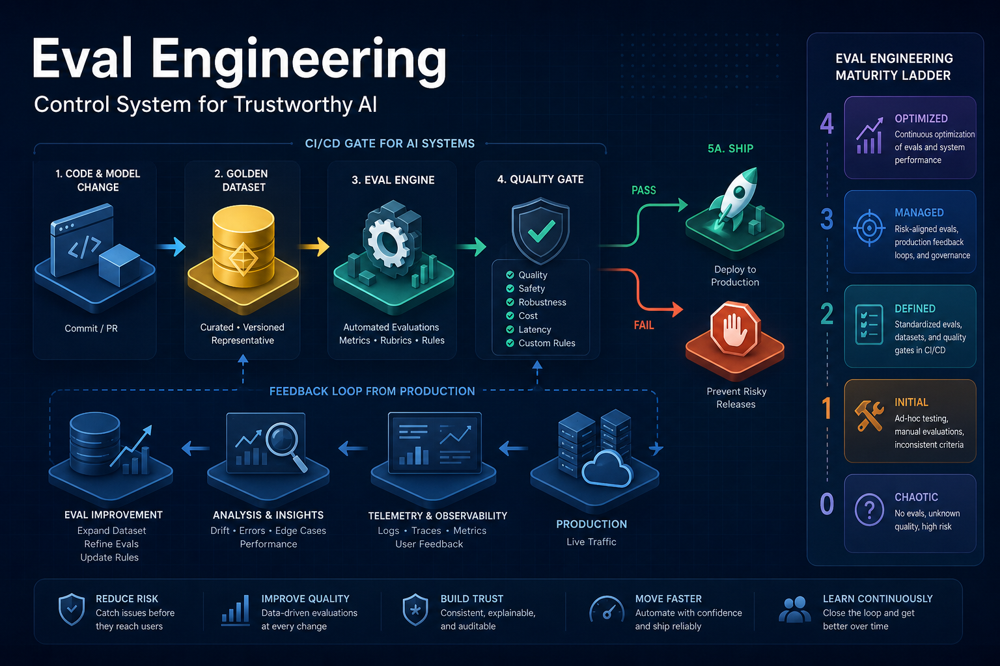
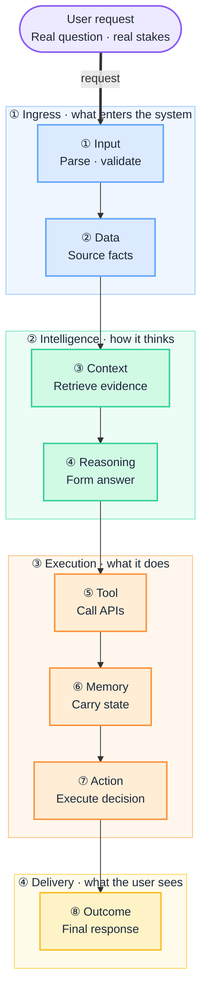
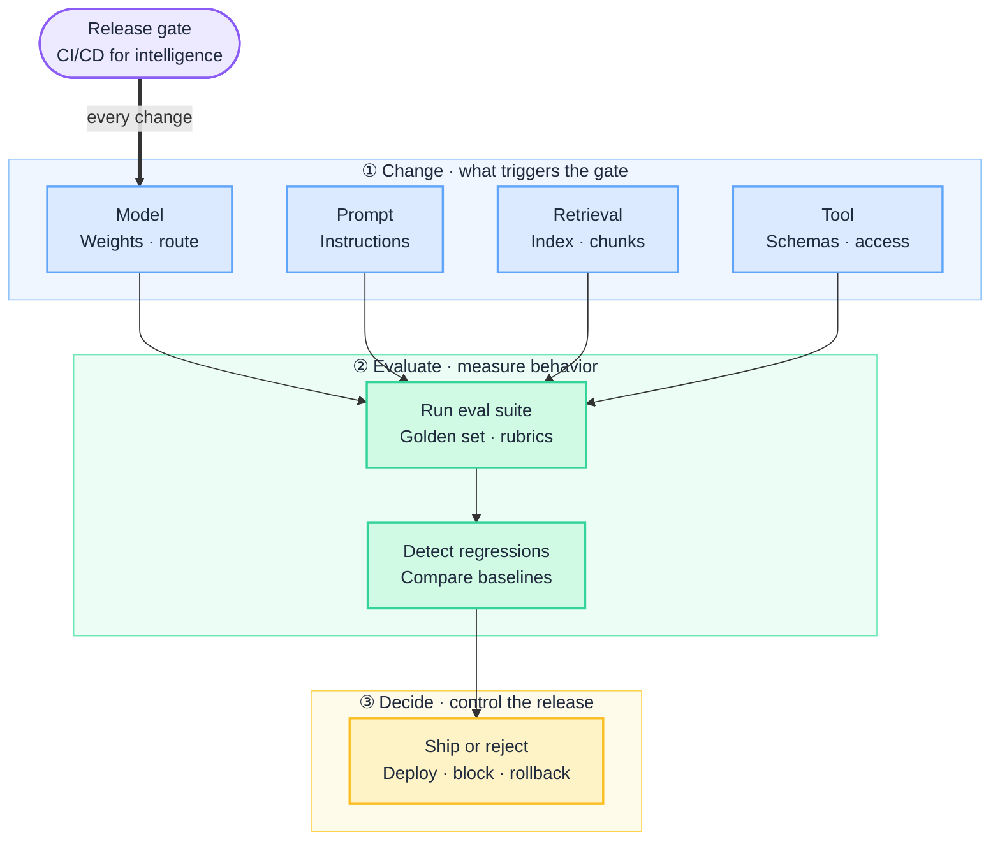
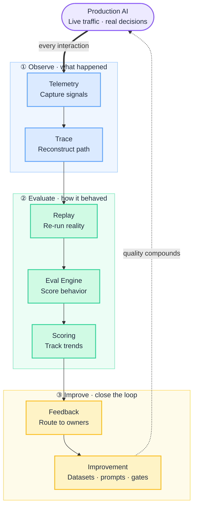

# Eval Engineering: The Control System for Trustworthy AI

Your teams demo an AI assistant. It works. You approve the budget. Three weeks after launch it confidently gives a customer a wrong policy number, takes an action it should have refused, or cites a document that does not exist — and the first you hear of it is from a regulator, a journalist, or a churned account.

Nothing "broke." Every service ran. Every test passed. That is the trap: in traditional software, passing tests means the system is correct. **In AI systems, passing tests means almost nothing.** The same input can produce many different outputs, and "it ran" says nothing about whether it behaved.

This is the gap between **testing** (did it run?) and **eval engineering** (did it behave correctly?). For any enterprise putting AI on the path to customers, money, or regulated decisions, closing that gap is not an engineering nicety. It is how you make AI risk **measurable, governable, and defensible**.

:::tip[THE EXECUTIVE TAKE]
**Testing validates execution. Eval engineering validates behavior.**

Deterministic systems map input → one fixed output. AI systems map input → many possible valid outputs. You cannot manage that with a pass/fail test suite. Evals are the **control system** that lets you measure quality, gate every change, and prove reliability — before production proves it for you, expensively.
:::

<!-- truncate -->

## The bottom line first

- **The risk is behavioral, not operational.** Your AI will run flawlessly while being wrong, unsafe, or ungrounded. Uptime dashboards will stay green. Only evals catch this class of failure.
- **Evals are the gate, not the afterthought.** Mature teams treat evaluation as CI/CD for intelligence: no model, prompt, retrieval, or tool change ships without passing the eval suite.
- **Coverage compounds.** Every production incident should become a permanent test case. Eval coverage is a balance sheet asset that grows with every failure you survive.
- **It needs an owner.** Eval engineering is becoming a named operational discipline — the way SRE did. Without ownership, quality debt accumulates invisibly until a regulatory review or public failure surfaces it.
- **The cost of skipping it is asymmetric.** Building evals is a known, bounded investment. The failures they prevent — compliance breaches, customer harm, brand damage — are not.

## Why this reaches the boardroom

| Question leadership actually asks | What only evals can answer |
| --- | --- |
| Is the AI safe to put in front of customers? | How often it behaves correctly under real-world uncertainty |
| Can we prove it to a regulator or auditor? | Documented, repeatable scores against defined quality and risk criteria |
| Will the next update make it worse? | Regression results gating every change before release |
| What happens when it fails? | A classified failure, an owner, and a test that prevents recurrence |
| Are we spending wisely on AI quality? | Cost, latency, and risk measured against business impact |

## 1. What an eval actually is

An **eval** is a repeatable way to measure whether the system behaves the way the business needs it to — under uncertainty, not just on a happy-path demo.

- **Testing** asks: *did it run?*
- **Evals** ask: *did it behave correctly?*

The distinction is the whole point. A model can retrieve documents, call tools, and return clean output — executing perfectly — while still failing the actual job. Testing cannot see that. Evals are built to.

## 2. Evaluate the whole system, not just the model

The most expensive mistake is scoring only the model's final answer. An AI system is a chain of stages, and **every stage can fail independently**. A confident, well-written answer can sit on top of the wrong document, a stale memory, or an action that should never have been allowed — and a single end-of-pipeline quality score will wave all of it through.

 

Each plane introduces its own failure mode — invisible if you only score the final output. The table below maps every surface to what breaks silently.

| Plane | What it contributes | How it fails silently |
| --- | --- | --- |
| **Input** | Captures the request | Ambiguity or injection slips through |
| **Data** | Supplies source facts | Stale, wrong, or out-of-policy data |
| **Context** | Retrieves evidence | Irrelevant or over-broad retrieval |
| **Reasoning** | Forms the answer | Right evidence, wrong conclusion |
| **Tool** | Acts on the world | Wrong tool or wrong arguments |
| **Memory** | Carries state | Stale or cross-session leakage |
| **Action** | Executes the decision | Unauthorized or unsafe action |
| **Outcome** | Delivers to the user | Fluent answer that fails the job |

:::note[Why Data ≠ Context]
Teams often merge these into one "RAG eval." That hides who owns the fix.

**Data** asks: is the corpus correct, current, entitled, and indexed? (pipelines, catalogs, embeddings — mostly async)

**Context** asks: for *this request*, did we retrieve, rank, filter, and pack the right evidence? (query-time retrieval — per inference)

Same bad answer, different root cause: stale policy in the index is a **Data** failure; the right doc ranked fifth is a **Context** failure. Eval them separately so gates can read "data green, context red." See [Data plane](/playbooks/eval-engineering/plane-data) and [Context plane](/playbooks/eval-engineering/plane-context).
:::

A correct-looking answer built on the wrong document is a **retrieval failure**. A polished answer attached to an unsafe action is a **policy failure**. Score only the final string and you will ship both. The leadership implication is simple: **demand evaluation at every surface**, not one quality score at the end — because that is where the liability actually lives.

## 3. Use multiple evaluation methods

No single method is trustworthy on its own. A credible program combines them — and understanding why protects you from teams over-relying on the cheapest one.

| Method | What it gives you | The catch |
| --- | --- | --- |
| **Static evals** | Stable regression baselines | Miss real-world drift |
| **Dynamic evals** | Real production behavior | Lag and noise |
| **Synthetic evals** | Edge and adversarial coverage | Need careful design |
| **Human evals** | Nuanced quality judgment | Do not scale |
| **Model-as-judge** | Scalable automated scoring | Need calibration and oversight |

If your teams report only one number from one method, that is a maturity signal worth questioning.

## 4. Measure what the business cares about

Quality is not one metric. A useful program measures four dimensions — and treats **business impact** as the metric every other number must ultimately predict.

| Dimension | What it covers | Why leadership cares |
| --- | --- | --- |
| **Correctness** | Factuality, grounding, faithfulness | Wrong answers create liability |
| **Quality** | Completeness, clarity, usefulness | Drives adoption and trust |
| **System** | Latency, cost, retries | Unit economics at scale |
| **Risk** | Hallucinations, unsafe actions, policy violations | Compliance and brand exposure |

A fast, cheap, confident, *wrong* answer looks healthy on the system dashboard and fails on correctness and risk. Without all four lenses, you are optimizing the wrong thing.

## 5. Golden datasets: your institutional memory

A "golden dataset" is the curated set of cases the system is held against. Its quality determines whether your evals reflect reality. Strong sets include:

- **Representative tasks** — the work users actually do
- **Edge cases** — the boundaries the demo never touched
- **Adversarial cases** — prompt injection, tool misuse, policy-bypass attempts
- **Historical failures** — every incident, captured permanently
- **Production replays** — real traffic re-scored after each change

The discipline that separates mature teams: **every production failure becomes a permanent test case.** If an incident is not in the golden set within a week, your eval system is falling behind your own product.

## 6. Make evals a release gate

Every meaningful change to an AI system should have to pass evaluation before it ships — the same way code passes CI before it merges.

 

This is **CI/CD for intelligence systems**. A prompt tweak that improves tone but quietly drops grounding should fail the gate exactly like a broken integration would. The governance win: change control over AI behavior becomes automated and auditable, not a matter of hope.

## 7. Classify failures so improvement is targeted

"Make the model better" is not a plan. A failure taxonomy turns vague dissatisfaction into routed, ownable work.

| Failure class | What went wrong |
| --- | --- |
| **Retrieval failure** | Wrong or missing evidence |
| **Reasoning failure** | Right evidence, wrong conclusion |
| **Hallucination** | Confident claim with no source |
| **Tool misuse** | Wrong tool, wrong inputs, wrong moment |
| **Memory corruption** | Stale or leaked state across sessions |
| **Unsafe action** | A policy violation on the execution path |
| **Bad user experience** | Correct but unclear or untrustworthy |

Tagging every failure by class is what converts incidents into a prioritized roadmap instead of a backlog of anecdotes.

## 8. The production eval architecture

A mature program is not a spreadsheet someone opens after launch. It is **infrastructure that runs alongside production and closes the loop** — every real interaction becomes evidence, every failure becomes coverage, and the system gets measurably safer with use instead of drifting quietly out of spec.

 
The power is in the arrow back to production: improvements feed straight into the system that generated the evidence, so quality compounds instead of decays.

| Stage | What it does | Why it matters |
| --- | --- | --- |
| **① Telemetry** | Captures what actually happened in production | You cannot evaluate what you did not record |
| **② Trace** | Reconstructs the full request path across planes | Pinpoints *where* a failure entered |
| **③ Replay** | Re-runs real cases against new versions | Tests changes on reality, not toy inputs |
| **④ Eval Engine** | Applies rubrics, judges, and metrics | Turns behavior into a score |
| **⑤ Scoring** | Stores results and tracks trends | Makes quality and drift visible over time |
| **⑥ Feedback** | Routes failures to named owners | Closes the gap between detection and action |
| **⑦ Improvement** | Feeds fixes back into datasets, prompts, gates | Converts every incident into permanent coverage |

This is what "we measure AI quality" looks like when it is real — not a launch checklist, but a standing capability. The framework-level patterns live in [G.A.I.N Evaluation](/frameworks/gain-evaluation).

## 9. Eval engineering is a discipline with an owner

Reliability for AI spans five functions. The failure mode is assuming someone else owns it.

| Function | What they own in evals |
| --- | --- |
| **Platform** | Harnesses, replay, score stores, release gates |
| **Product** | Golden tasks, quality rubrics, business-impact thresholds |
| **ML** | Model benchmarks, judge calibration, drift detection |
| **Governance** | Policy correctness, risk classes, audit trails |
| **Reliability** | Targets on eval pass rates and incident-to-test speed |

Just as "it works on my machine" stopped being acceptable and SRE was born, "the demo looked fine" is becoming indefensible — and eval engineering is the function that replaces it.

## A maturity model for the conversation

Use this to locate where your organization actually is — most are at Level 1 and believe they are at Level 3.

| Level | State | What it means for risk |
| --- | --- | --- |
| **0 — Vibes** | "It looked good in the demo" | Unmanaged. Production is your test environment. |
| **1 — Ad hoc** | Manual spot-checks before launch | Failures found by users, not by you. |
| **2 — Systematic** | Golden datasets, defined metrics | You can measure quality at a point in time. |
| **3 — Gated** | Evals block every change in CI/CD | Regressions caught before release. |
| **4 — Operational** | Production loop feeds eval coverage | Self-improving, audit-ready, board-defensible. |

## Questions to ask your teams this quarter

1. **What do we measure, and against what definition of "good"?** If the answer is a single accuracy number, that is a red flag.
2. **Does every change pass an eval gate before release?** If not, you have no change control over AI behavior.
3. **When the AI failed last, did that failure become a permanent test case?** If not, it will happen again.
4. **Who owns eval engineering by name?** If everyone owns it, no one does.
5. **Can we hand a regulator our eval results tomorrow?** That is the bar mature AI organizations are already clearing.

:::important[The decision]
In non-deterministic systems, evals are not testing. **They are the control system for reliability.**

If no part of your architecture owns the question *"did this behave correctly under uncertainty?"*, then nothing does — and production will answer it for you, on its own timeline, at its own price. Eval engineering is how you take that answer back.
:::

## Build the framework (implementation series)

Ready to implement? This article is the executive case. The **Eval Framework Blueprint** series covers plane-by-plane evals across **offline CI and online production**, with golden datasets, synthetic generation, replay, human review, and LLM-as-judge.

**Start here:** [Eval Framework Blueprint](/blueprints/eval-blueprint)

| Guide | Topic |
| --- | --- |
| [Golden Datasets](/playbooks/eval-engineering/golden-datasets) | Curated cases, versioning, splits |
| [Synthetic Generation](/playbooks/eval-engineering/synthetic-generation) | Edge & adversarial coverage at scale |
| [Online & Dynamic Eval](/playbooks/eval-engineering/online-dynamic) | Live sampling, shadow, canary, drift |
| [Human Review](/playbooks/eval-engineering/human-review) | Manual eval, rubrics, calibration |
| [LLM-as-Judge](/playbooks/eval-engineering/llm-as-judge) | Scaled scoring, pairwise comparison |
| [① Input](/playbooks/eval-engineering/plane-input) · [② Data](/playbooks/eval-engineering/plane-data) · [③ Context](/playbooks/eval-engineering/plane-context) · [④ Reasoning](/playbooks/eval-engineering/plane-reasoning) | Ingress & intelligence planes |
| [⑤ Tool](/playbooks/eval-engineering/plane-tool) · [⑥ Memory](/playbooks/eval-engineering/plane-memory) · [⑦ Action](/playbooks/eval-engineering/plane-action) · [⑧ Outcome](/playbooks/eval-engineering/plane-outcome) | Execution & delivery planes |
| [Further reading (external)](/playbooks/eval-engineering/further-reading) | Curated third-party articles & tool docs |
