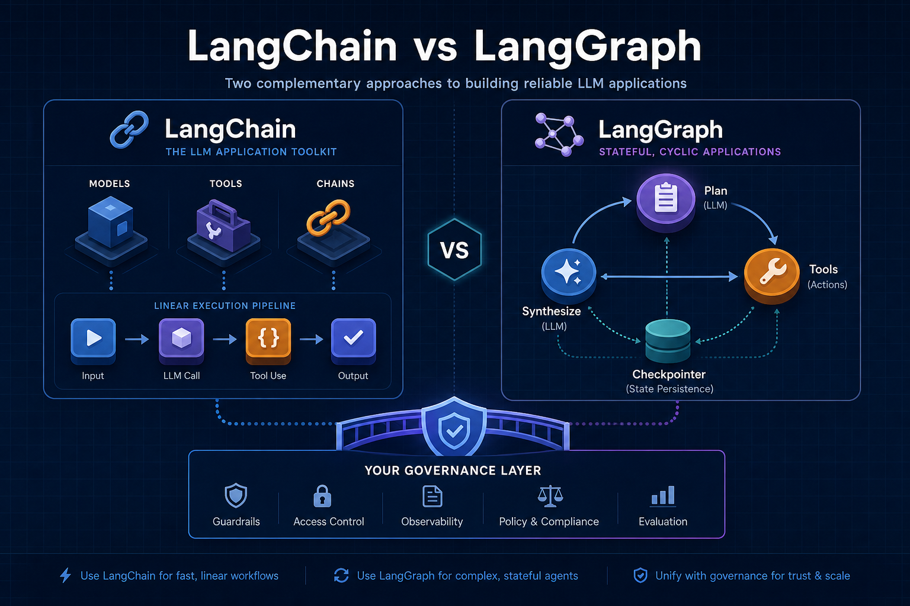
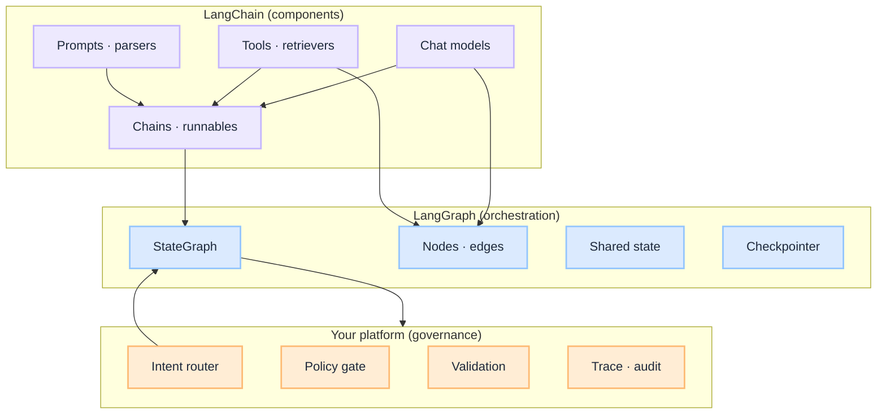

import Details from '@theme/Details';



# LangChain vs LangGraph — When to Use What in Production Agents

Teams evaluating agent frameworks often ask: **LangChain or LangGraph?** The question assumes a fork. In practice there is none. **LangGraph is built on LangChain.** LangChain supplies models, tools, prompts, retrievers, and parsers. LangGraph supplies **stateful graphs** — explicit loops, branching, persistence, and human-in-the-loop for multi-step agents.

The real decision is not which library to pick. It is **which execution pattern fits the workflow**:

| Pattern | Best fit |
| --- | --- |
| Linear pipeline | LangChain **chain** |
| Single-pass tool call | LangChain **tool-calling chain** |
| Multi-step plan → act → observe | **LangGraph** (or custom state machine) |
| Regulated side effects + audit | LangGraph + **your governance layer** |

This guide maps both to the [agentic loop](/insights/what-is-agentic-loop), shows pseudo-code for each, and covers **memory**, **validation**, and **LLM selection** — the production concerns demos skip.

:::tip[THE CLAIM]
**LangChain is the toolkit. LangGraph is the loop.** Use LangChain for components; use LangGraph when the workflow cycles, branches, persists state, or needs explicit control between LLM and tool steps.
:::

<!-- truncate -->

## The bottom line first

- **Same ecosystem** — LangGraph imports LangChain models, tools, and messages; you do not choose one and abandon the other.
- **LangChain chains** — best for RAG, extraction, classification, and one-shot tool calls with a fixed path.
- **LangGraph** — best for ReAct loops, step limits, conditional routing inside the loop, checkpointers, and step-up / human approval.
- **Memory** — conversation history in LangChain; durable loop state in LangGraph checkpointers; long-term memory is usually **your store**, not either library.
- **Validation** — neither library replaces manifest checks, PEP, or observation grounding; wrap tools or add graph nodes.
- **LLM selection** — route table picks workflow; inside it use a **cheap model for routing/classification** and a **capable model for planning/synthesis**.

## What each piece actually is



| Layer | Owns | Does not own |
| --- | --- | --- |
| **LangChain** | Model I/O, tool definitions, prompt templates, sequential composition | Policy, durable workflow recovery, production audit |
| **LangGraph** | Graph topology, loop control, state merge, checkpoint resume | Business authorization, compliance verdicts |
| **Your agentic app** | Router, PEP, validation, trace, LLM routing by task | Replacing the model |

Aligns with [G.A.I.N Agents](/frameworks/gain-agents): intelligence in the call; truth in the system around it.

---

## Decision guide — when to use what

### Use LangChain chains when

- The path is **fixed**: input → retrieve → prompt → answer
- You need **one** LLM call, or a **linear** sequence with no back-edges
- Tasks: summarization, extraction, intent classification, embedding + search, structured output parsing
- Latency and cost must stay predictable — no hidden loop

### Use LangChain `AgentExecutor` when

- You need a **quick prototype** of plan → act → observe
- Loop is short (2–3 steps), governance is light, no step-up mid-flight
- You will wrap governance inside **custom tool classes** rather than explicit graph nodes

:::note
LangChain's direction for production agents is **LangGraph**. `AgentExecutor` remains valid for prototypes and simple internal tools; regulated workflows outgrow it quickly.
:::

### Use LangGraph when

- The workflow **loops** until done, blocked, or timed out
- You need **visible stages**: validate proposal → policy → execute → validate observation
- You need **branching**: tool path vs synthesize path vs escalate path
- You need **persistence**: resume after crash, human approval, multi-turn tool workflows
- You need **human-in-the-loop** (step-up, four-eyes) as a graph interrupt

### Use neither as your only layer when

- **Intent routing** sits before the graph — see [Intent Router](/insights/what-is-intent-router)
- **Policy (PEP/PDP)** is a separate service — see [PGAR](/insights/policy-governed-agent-runtime)
- **Eval gates** block prompt/model/graph changes — see [Eval Engineering](/insights/eval-engineering)

---

## Pseudo-code examples

Click each block to expand. Collapsed by default — three patterns: linear chain, `AgentExecutor`, and LangGraph.

<Details summary="LangChain chain (RAG, no loop)">

Fixed pipeline. No agent loop. Typical for policy Q&A or document summarization.

```python
# ── Components (LangChain) ──
llm_fast = ChatModel("gpt-4o-mini")      # cheap: routing / extract
llm_main = ChatModel("gpt-4o")           # capable: synthesis
retriever = VectorStoreRetriever(index="policy-engine")
prompt = ChatPromptTemplate.from_messages([
    ("system", "Answer only from context. Say 'I don't know' if missing."),
    ("human", "{question}\n\nContext:\n{context}"),
])

# ── Chain (linear) ──
rag_chain = (
    {"context": retriever | format_docs, "question": RunnablePassthrough()}
    | prompt
    | llm_main
    | output_parser
)

# ── Pre-loop (your platform, not LangChain) ──
route = intent_router(user_message, session)
if route.intent != "policy_qa":
    return clarify_or_redirect(route)

# ── Run once ──
raw = rag_chain.invoke(user_message)
safe = output_filter(raw)                # PII · policy · format
return respond(safe)
```

**Stages touched:** ① ingress → ③ router → retrieve (⑩-like, but no loop) → ⑮ synthesize → ⑯ filter → ⑰ respond.

No LangGraph required — the path never cycles.

</Details>

<Details summary="LangChain AgentExecutor (simple loop)">

One object owns the loop. Governance lives inside tools or callbacks.

```python
# ── Tools with governance baked in ──
class GovernedTransferTool(BaseTool):
    name = "initiate_transfer"

    def _run(self, amount: float, beneficiary_id: str) -> str:
        proposal = {"tool": self.name, "args": {...}}
        validate_manifest(proposal, session.manifest)     # ⑦
        verdict = pep_check(proposal, session.token)      # ⑧
        if verdict == "DENY":
            return "ERROR: not permitted"
        if verdict == "STEP_UP":
            approval = wait_for_supervisor(session)       # ⑨
            verdict = pep_check(proposal, session.token, approval)
        result = payment_hub.execute(proposal)            # ⑩
        return validate_observation(result)               # ⑫

tools = [lookup_beneficiary, GovernedTransferTool()]
agent = create_tool_calling_agent(llm_main, tools, agent_prompt)

# ── Orchestrator + loop in one box ──
executor = AgentExecutor(
    agent=agent,
    tools=tools,
    max_iterations=8,           # ⑭ step limit
    return_intermediate_steps=True,
    callbacks=[TraceCallback()], # ⑱ audit
)

# ── Pre-loop ──
route = intent_router(user_message, session)
tools = load_tools_for_route(route.manifest_id)
executor.tools = tools

# ── Invoke ──
result = executor.invoke({"input": user_message, "chat_history": session.messages})
return output_filter(result["output"])
```

**Pros:** minimal code, fast to demo.  
**Cons:** loop logic is opaque; step-up and validation are buried in tools; harder to trace per-stage SLOs and to eval individual stages.

</Details>

<Details summary="LangGraph (production-shaped loop)">

Explicit nodes map to [agentic loop stages](/insights/what-is-agentic-loop). LangChain still provides model and tools.

```python
# ── State (loop memory) ──
class AgentState(TypedDict):
    messages: Annotated[list, add_messages]
    step_count: int
    route_id: str
    validated_context: list          # only grounded chunks / tool results
    pending_approval: dict | None

# ── LangChain components inside nodes ──
llm_planner = ChatModel("gpt-4o").bind_tools(manifest_tools)
llm_synth   = ChatModel("gpt-4o")

# ⑤⑥ Plan + Propose
def plan_node(state: AgentState) -> AgentState:
    response = llm_planner.invoke(state["messages"])
    return {"messages": [response], "step_count": state["step_count"] + 1}

# ⑦-⑫ Governed Act + Observe
def governed_tools_node(state: AgentState) -> AgentState:
    last = state["messages"][-1]
    observations = []
    for call in last.tool_calls:
        validate_manifest(call, state["route_id"])           # ⑦
        verdict = pep_check(call, session.token)             # ⑧
        if verdict == "STEP_UP":
            return {"pending_approval": call, ...}           # interrupt graph
        if verdict == "DENY":
            observations.append(deny_observation(call))
            continue
        raw = ToolNode(manifest_tools).invoke(call)          # ⑩
        observations.append(validate_observation(raw))       # ⑫
    return {
        "messages": observations,
        "validated_context": state["validated_context"] + observations,
    }

# ⑭ Continue or exit
def route_after_plan(state: AgentState) -> str:
    if state["step_count"] >= MAX_STEPS:
        return "synthesize"
    if state["messages"][-1].tool_calls:
        return "tools"
    return "synthesize"

# ⑮ Synthesize from validated context only
def synthesize_node(state: AgentState) -> AgentState:
    pack = build_context_pack(state["validated_context"])
    answer = llm_synth.invoke([system_prompt, *state["messages"], pack])
    return {"messages": [answer]}

# ── Graph (orchestrator = graph runtime) ──
graph = StateGraph(AgentState)
graph.add_node("plan", plan_node)
graph.add_node("tools", governed_tools_node)
graph.add_node("synthesize", synthesize_node)
graph.set_entry_point("plan")
graph.add_conditional_edges("plan", route_after_plan, {
    "tools": "tools", "synthesize": "synthesize"
})
graph.add_edge("tools", "plan")
graph.add_edge("synthesize", END)

app = graph.compile(
    checkpointer=PostgresCheckpointer(),   # ⑬ durable state
    interrupt_before=["tools"],            # optional: human review
)
```

**Pre-loop** still runs outside the graph:

```python
route = intent_router(input, session)
initial = AgentState(messages=[user_msg], step_count=0, route_id=route.id, ...)
config = {"configurable": {"thread_id": session.id}}
final = app.invoke(initial, config=config)
return output_filter(final["messages"][-1])
```

**Pros:** stages are explicit, testable, traceable; step-up maps to interrupts; resume after crash via checkpointer.  
**Cons:** more boilerplate; you own graph design and ops.

</Details>

---

## Side-by-side — same payment task

| Concern | LangChain `AgentExecutor` | LangGraph |
| --- | --- | --- |
| Loop | Hidden in executor | `plan → tools → plan` edges |
| Step limit | `max_iterations=8` | `route_after_plan` + counter in state |
| PEP / manifest | Inside each `Tool._run` | Dedicated `governed_tools_node` |
| Step-up | Block inside tool ( awkward ) | `interrupt` + resume with approval in state |
| Trace | Callback hooks | Per-node spans + state diffs |
| Eval | End-to-end only | Per-node fixtures (plan vs validate vs synth) |
| Resume after crash | Manual | Checkpointer reload by `thread_id` |

---

## Memory — what goes where

Memory in agent systems is not one thing. Split it by lifecycle:

| Memory type | What it holds | LangChain | LangGraph | Your store |
| --- | --- | --- | --- | --- |
| **Conversation** | User/assistant messages | `ChatMessageHistory`, buffer in chain input | `messages` in `AgentState` | Session DB |
| **Working** | Current task slots, entities | Chain variables | Fields on `AgentState` | Session / Redis |
| **Loop** | Step count, proposals, observations | `AgentExecutor` intermediate steps | State + checkpointer | Postgres / Dynamo |
| **Episodic** | Past sessions summaries | Custom retriever | Optional node | Vector / OLTP |
| **Long-term** | User prefs, facts | Not built-in | Not built-in | Your memory service |

<Details summary="Pseudo-code — memory (LangChain vs LangGraph)">

```python
# LangChain: conversation only, passed each invoke
history = ChatMessageHistory(session_id)
history.add_user_message(user_msg)
chain.invoke({"question": user_msg, "history": history.messages})

# LangGraph: conversation + loop state, persisted
app.invoke(state, config={"configurable": {"thread_id": session_id}})
# after step-up interrupt:
app.invoke(None, config=config)   # resumes from checkpoint
```

</Details>

**Production rule:** the checkpointer is **working + loop memory** for recovery. Long-term memory is a **retrieval step** (④ context assembly or a dedicated graph node), not unbounded messages in the prompt.

See [G.A.I.N Agents — Agent memory](/frameworks/gain-agents) pattern: separate working, episodic, and long-term stores.

---

## Validation — libraries do not replace it

LangChain and LangGraph will happily pass raw tool output back to the model. **Validation is your code** — as tool wrappers, graph nodes, or middleware.

| Validation | When | Where to implement |
| --- | --- | --- |
| **Input** | Before loop | Pre-loop; [Eval Input plane](/playbooks/eval-engineering/plane-input) |
| **Proposal** | Tool name + args | Before PEP; manifest schema check |
| **Policy** | Authorization | PEP/PDP — outside both libraries |
| **Observation** | Tool/RAG result | After execute, before next plan or synth |
| **Output** | User-facing text | Post-loop filter |

<Details summary="Pseudo-code — validation (tool wrapper vs graph node)">

```python
# LangChain: validation inside tool
def validate_observation(raw: dict) -> str:
    if not schema.validate(raw):
        raise ToolValidationError(...)
    if not entitlement_covers(session.claims, raw.doc_ids):
        raise PolicyError(...)
    return truncate(redact(raw), max_tokens=2000)

# LangGraph: validation as explicit node (alternative)
graph.add_node("validate_obs", validate_observation_node)
graph.add_edge("tools", "validate_obs")
graph.add_edge("validate_obs", "plan")
```

</Details>

Structured output parsers (`with_structured_output`, Pydantic) help **format** — they do not replace grounding checks or policy.

---

## LLM selection — more than one model per request

Neither library picks the right model for you. Use a **capability matrix** per stage — same idea as [G.A.I.N LLM](/frameworks/gain-llm) gateway routing.

| Stage | Model tier | Example | Why |
| --- | --- | --- | --- |
| Intent routing | Fast / cheap | `gpt-4o-mini`, small classifier | High volume; eval-gated labels |
| Plan + propose | Capable | `gpt-4o`, domain fine-tune | Tool selection quality |
| Synthesize | Capable | Same or stronger | Final answer quality |
| Validation judge | Fast or rules | Mini model or code | Cost control on high traffic |
| Embedding / RAG | Dedicated | Embedding model | Not the chat model |

<Details summary="Pseudo-code — LLM selection by route profile">

```python
# Route selects workflow; profiles select models
ROUTE_PROFILES = {
    "policy_qa":     {"planner": None,      "synth": "gpt-4o-mini", "tools": []},
    "payment_flow":  {"planner": "gpt-4o",  "synth": "gpt-4o",      "tools": PAYMENT_MANIFEST},
    "general_chat":  {"planner": None,      "synth": "gpt-4o-mini", "tools": []},
}

profile = ROUTE_PROFILES[route.route_id]
llm_planner = get_model(profile["planner"]) if profile["planner"] else None
llm_synth   = get_model(profile["synth"])
```

</Details>

**LangChain:** swap models per chain or per Runnable branch.  
**LangGraph:** bind different models in different nodes (`plan_node` vs `synthesize_node`).

Avoid one flagship model for every stage — cost and latency scale with loop iterations.

---

## Other production concerns

### Tracing and audit

Both support callbacks; LangGraph adds **per-node** boundaries for OpenTelemetry-style spans.

<Details summary="Pseudo-code — tracing and audit callbacks">

```python
# LangChain
chain.invoke(input, config={"callbacks": [LangfuseCallbackHandler()]})

# LangGraph: tag spans by node name in platform APM
with trace_span("graph.plan", session_id=session.id):
    plan_node(state)
```

</Details>

Capture: `session_id`, `route_id`, `manifest_version`, `step_count`, `pep_verdict`, `policy_version` — not just token counts.

### Streaming

LangChain chains stream tokens from the final LLM. LangGraph can stream **node completion events** (plan done, tool running, synthesizing) for better UX on long loops.

### Testing

| Layer | What to test |
| --- | --- |
| LangChain chain | Golden input → expected output; retrieval fixtures |
| AgentExecutor | End-to-end task success; max iteration respected |
| LangGraph node | Unit test each node; mock PEP and tools |
| Platform | Policy scenarios; adversarial routing; observation rejection |

Per-node testing is the main reason teams move from `AgentExecutor` to LangGraph in regulated environments.

### When to skip both abstractions

Sometimes a **plain state machine** (Temporal, Step Functions, custom) orchestrates LangChain **runnables** as step handlers. LangGraph is the in-process version of that pattern. Use external workflow engines when you need cross-service sagas, long human waits, or strict SLA isolation.

---

## Recommended path by maturity

| Maturity | Stack |
| --- | --- |
| **Prototype** | LangChain chain or `AgentExecutor` + custom tools |
| **Pilot** | LangGraph + checkpointer + intent router + output filter |
| **Production** | LangGraph (or workflow engine) + PEP + eval CI + multi-model routing + trace |
| **Regulated** | Explicit graph nodes per [agentic loop stage](/insights/what-is-agentic-loop); no governance hidden inside tools |

---

## Key takeaways

- **Same ecosystem, different pattern:** LangGraph builds on LangChain; choose chain vs graph by workflow shape, not library loyalty.
- **Use LangChain chains** for fixed paths: RAG, extraction, classification, and one-shot tool calls.
- **Use LangGraph** when the workflow loops, branches, persists state, or needs step-up interrupts and per-node evals.
- **Wrap both in your platform:** intent routing, PEP, observation validation, and output filtering stay outside either library.
- **Split memory by tier:** conversation and loop state in session or checkpointer; long-term memory is your retrieval layer.
- **Route models by stage:** cheap for classification and judges; capable for plan and synthesize.

:::info[Builds on]
[What Is the Agentic Loop](/insights/what-is-agentic-loop) · [G.A.I.N Agents](/frameworks/gain-agents) · [G.A.I.N LLM](/frameworks/gain-llm) · [What Is an Intent Router](/insights/what-is-intent-router)
:::
