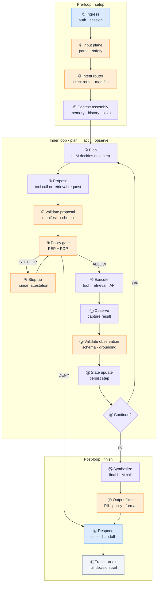

# What Is the Agentic Loop — and How It Works End to End

Demos make agents look simple: the user asks, the model calls a tool, the answer appears. Production is a chain of stages — each with an owner, a failure mode, and an audit trail. Skip or blur a stage and the loop still *runs*; it just behaves wrong, unsafely, or unrecoverably.

The **agentic loop** is the repeating cycle at the center of that chain: **plan → act → observe**. The model plans the next step, the system executes permitted actions, results return as observations, and the loop continues until the task completes, escalates, or hits a boundary.

This article maps the **full end-to-end path** — every stage before, inside, and after the loop — and what each stage is responsible for.

:::tip[THE CLAIM]
**An agent is a governed workflow with intelligence, not a free-running loop with tools.** The model drives planning inside the loop; the architecture owns routing, policy, execution, state, validation, and audit around it.
:::

<!-- truncate -->

## The bottom line first

- **The agentic loop is plan → act → observe**, repeated until done — not one LLM call with tools bolted on.
- **Stages outside the loop matter as much as the loop itself** — ingress, routing, and synthesis define what the loop may see and do.
- **The model proposes; the system executes.** Tool calls are proposals until policy permits them and the platform runs them.
- **Observations must be validated** before they re-enter the model — raw API or retrieval output is not trusted context.
- **State makes the loop durable** — without it, retries, step-up approvals, and multi-turn tasks collapse.
- **Every iteration should be traced** — step number, proposal, verdict, tool result, validation outcome.

## What the agentic loop actually is

At its core, the loop implements **ReAct-style reasoning**: the agent reasons about what to do, takes an action, observes the result, and reasons again.

| Phase | Who drives it | What happens |
| --- | --- | --- |
| **Plan** | LLM (assisted) | Decide the next step toward the user's goal |
| **Act** | System (governed) | Execute a permitted tool call or retrieval |
| **Observe** | System | Capture structured result; update session state |
| **Repeat or exit** | Orchestrator | Continue loop, synthesize answer, clarify, or escalate |

In a demo, all four phases often live inside one process with direct tool access. In production, **Plan** is model-assisted; **Act**, **Observe**, and **Repeat** are platform-owned — gated by policy, bounded by manifests, and persisted in a state store.

:::important[PREDICTION VS. EXECUTION]
**Intelligence in the LLM. Truth in the system.** The loop's planning step is probabilistic. Permission to act, execution of side effects, and what counts as valid observation are deterministic architecture decisions.
:::

## End to end on one page

A single user request crosses **three regions**: pre-loop (ingress and setup), **inner loop** (plan → act → observe), and post-loop (synthesis and response).

Not every request runs every stage. A simple FAQ may skip tool execution entirely. A wire transfer may loop twice — lookup beneficiary, then initiate payment — with step-up between proposal and execution.

---

## Pre-loop stages

These run **once per user turn** (usually) before the inner loop begins.

### ① Ingress — auth and session

| | |
| --- | --- |
| **Purpose** | Authenticate the caller; establish or resume session |
| **Owns** | Token validation, claims issuance, rate limits, channel metadata |
| **Does not own** | Planning, tool selection, business logic |
| **Output** | `session_id`, identity claims, entitlements |
| **Failure** | Unauthenticated access, session hijack, missing tenant context |

The ingress boundary is where trust starts. Everything downstream assumes identity is already verified. See [PGAR Boundary ①: Ingress](/playbooks/pgar-runtime/boundary/ingress).

### ② Input plane — parse and safety

| | |
| --- | --- |
| **Purpose** | Normalize raw input; run first-line safety filters |
| **Owns** | Parsing, encoding, PII detection, injection pattern scan |
| **Does not own** | Intent routing, tool execution |
| **Output** | `normalized_input`, `safety_flags`, optional redaction map |
| **Failure** | Injection passes through; PII logged in cleartext; malformed payload crashes downstream |

Evaluated on the [Eval Input plane](/playbooks/eval-engineering/plane-input): injection resistance, schema validation, PII handling.

### ③ Intent router — select the governed path

| | |
| --- | --- |
| **Purpose** | Map request to workflow, tool manifest, and policy profile |
| **Owns** | Classification, confidence, entity extraction, route dispatch |
| **Does not own** | Multi-step planning inside the workflow |
| **Output** | `route_id`, `intent_label`, `manifest_version`, `policy_profile` |
| **Failure** | Intent misroute — wrong tools exposed, wrong corpus retrieved |

See [What Is an Intent Router](/insights/what-is-intent-router). Routing happens **before** the loop, not inside it.

### ④ Context assembly — what the model may see

| | |
| --- | --- |
| **Purpose** | Build the initial message context for the first plan step |
| **Owns** | Conversation history, working memory, route entities, system prompt template |
| **Does not own** | Credentials, raw policy text, unconstrained retrieval |
| **Output** | Scoped message array + tool schemas from manifest |
| **Failure** | Stale memory; cross-tenant context leak; policy text in system prompt |

The [agentic app](/playbooks/pgar-runtime/boundary/agentic-app) assembles context. The LLM receives messages and schemas — never the bearer token.

---

## Inner loop stages

These repeat zero to N times until the task is complete or a boundary is hit.

### ⑤ Plan — decide the next step

| | |
| --- | --- |
| **Purpose** | Reason about what action moves toward the user's goal |
| **Owns** | LLM inference — decomposition, tool selection intent, argument drafting |
| **Does not own** | Permission to execute, actual side effects |
| **Output** | Reasoning trace (optional) + decision to respond or call a tool |
| **Failure** | Runaway planning; wrong tool chosen; hallucinated arguments |

This is where [G.A.I.N Agents](/frameworks/gain-agents) delegates **Intelligent** work — ambiguity and sequencing — to the model.

### ⑥ Propose — structured tool call

| | |
| --- | --- |
| **Purpose** | Emit a structured proposal the orchestrator can validate |
| **Owns** | LLM structured output — tool name, arguments |
| **Does not own** | Execution |
| **Output** | `{ tool, arguments }` or direct text response (loop exit) |
| **Failure** | Proposal for tool not in manifest; malformed JSON; invented tool name |

In [Policy-Governed Agent Runtime](/insights/policy-governed-agent-runtime): **proposal is not permission**.

### ⑦ Validate proposal — manifest and schema check

| | |
| --- | --- |
| **Purpose** | Reject proposals before they reach policy or downstream |
| **Owns** | Manifest membership, argument schema, required fields |
| **Does not own** | Business authorization (that is policy) |
| **Output** | Valid proposal forwarded to PEP, or rejection back to planner |
| **Failure** | Unknown tool reaches payment hub; invalid amount format accepted |

Deterministic. Fast. Non-negotiable.

### ⑧ Policy gate — PEP and PDP

| | |
| --- | --- |
| **Purpose** | Authorize whether this principal may perform this action on this resource |
| **Owns** | PEP enforcement; PDP verdict (ALLOW / DENY / STEP_UP) |
| **Does not own** | Generating the proposal; downstream business logic |
| **Output** | Verdict + audit record with policy version |
| **Failure** | Direct downstream bypass; policy in prompt instead of PDP |

Subject, action, resource, context — evaluated against policy. The LLM never saw the rules that triggered DENY.

### ⑨ Step-up — human attestation

| | |
| --- | --- |
| **Purpose** | Collect approval when policy requires escalation |
| **Owns** | Agentic app UX; re-submission with attestation in context |
| **Does not own** | PDP verdict generation |
| **Output** | Approved context attached; loop resumes at ⑧ |
| **Failure** | Step-up context lost on retry; approval forged without re-PEP |

STEP_UP is a **PDP verdict**, not a model feature. See [Step-up and attestation](/playbooks/pgar-runtime/foundation/step-up-and-attestation).

### ⑩ Execute — run the permitted action

| | |
| --- | --- |
| **Purpose** | Perform the side effect or retrieval the policy allowed |
| **Owns** | Tool runtime, retrieval gateway, downstream API call |
| **Does not own** | Deciding whether execution was permitted |
| **Output** | Raw tool result, retrieval pack, or API response |
| **Failure** | Execution without ALLOW; timeout with no retry; non-idempotent duplicate |

Downstream services re-authorize the token. Results return to the agentic app — not directly to the LLM.

### ⑪ Observe — capture the result

| | |
| --- | --- |
| **Purpose** | Normalize tool output into a structured observation |
| **Owns** | Parsing API response, truncating to token budget, error classification |
| **Does not own** | Trusting raw output as ground truth |
| **Output** | `observation` message for state and optional re-planning |
| **Failure** | Raw error stack pasted to model; oversized payload blows context |

Observation is **input to the next plan step** — treat it as untrusted until validated.

### ⑫ Validate observation — grounding check

| | |
| --- | --- |
| **Purpose** | Verify tool output before it re-enters the model or user response |
| **Owns** | Schema check, citation verification, entitlement re-check on retrieved docs |
| **Does not own** | Generating the answer |
| **Output** | Validated context pack or retry/error path |
| **Failure** | Unvalidated retrieval pasted into synthesis — wrong doc, wrong tenant |

Critical for agentic RAG: [Retrieval is a governed action](/insights/retrieval-is-a-governed-action).

### ⑬ State update — persist the iteration

| | |
| --- | --- |
| **Purpose** | Durably record loop progress for retries, audit, and resume |
| **Owns** | Step counter, proposal history, observations, approval context |
| **Does not own** | Planning |
| **Output** | Updated session/workflow state |
| **Failure** | In-memory-only state lost on crash; step-up approval missing on replay |

State carries the loop. Without it, multi-step workflows die mid-flight.

### ⑭ Continue? — loop control

| | |
| --- | --- |
| **Purpose** | Decide whether to plan again or exit to synthesis |
| **Owns** | Orchestrator — step limit, timeout, goal completion heuristics |
| **Does not own** | Unbounded model self-direction |
| **Output** | Loop back to ⑤, or exit to ⑮ |
| **Failure** | Infinite loop; premature exit before task done |

Production loops always have **max steps**, **timeouts**, and explicit termination conditions.

---

## Post-loop stages

These run when the inner loop exits — whether after zero tool calls or many.

### ⑮ Synthesize — final answer

| | |
| --- | --- |
| **Purpose** | Generate user-facing response from validated context |
| **Owns** | LLM call with validated observations only — no raw tool dumps |
| **Does not own** | Policy verdicts; tool execution |
| **Output** | Draft response text or structured payload |
| **Failure** | Model invents facts not in validated pack; ignores step-up outcome |

May be the same LLM call as ⑤ when no tools ran. Often a **separate call** after tool loops complete.

### ⑯ Output filter — safety and format

| | |
| --- | --- |
| **Purpose** | Enforce output policy before the user sees anything |
| **Owns** | PII redaction, prohibited content, schema enforcement, abstention |
| **Does not own** | Generation |
| **Output** | Filtered response or blocked-with-fallback |
| **Failure** | Regulated data in user channel; wrong format reaches API consumer |

### ⑰ Respond — deliver to user or downstream

| | |
| --- | --- |
| **Purpose** | Return result, clarification, refusal, or human handoff |
| **Owns** | Channel formatting, handoff payload, error UX |
| **Does not own** | Re-running the loop silently without user visibility |
| **Output** | User-visible message or workflow completion signal |
| **Failure** | Internal error exposed; handoff loses session context |

### ⑱ Trace and audit — full decision trail

| | |
| --- | --- |
| **Purpose** | Record every stage for debug, compliance, and eval sampling |
| **Owns** | Distributed trace, audit log, policy version, manifest version |
| **Does not own** | Real-time user display |
| **Output** | Immutable record per request |
| **Failure** | Cannot answer "who authorized what, with which policy, before money moved?" |

Minimum trace fields: `session_id`, `orchestration_step`, `proposal_count`, `pep_calls`, `validation_passed`, `route_id`, `manifest_version`. See [G.A.I.N Observability](/frameworks/gain-observability).

---

## Stage ownership summary

| Stage | Primary owner | Model involved? |
| --- | --- | --- |
| ① Ingress | Platform / API gateway | No |
| ② Input plane | Platform | Optional classifier |
| ③ Intent router | Platform | Optional fallback |
| ④ Context assembly | Agentic app | No |
| ⑤ Plan | LLM | Yes |
| ⑥ Propose | LLM | Yes |
| ⑦ Validate proposal | Agentic app | No |
| ⑧ Policy gate | PEP / PDP | No |
| ⑨ Step-up | Agentic app + human | No |
| ⑩ Execute | Tool runtime / downstream | No |
| ⑪ Observe | Agentic app | No |
| ⑫ Validate observation | Agentic app | Optional judge |
| ⑬ State update | State store | No |
| ⑭ Continue? | Orchestrator | No |
| ⑮ Synthesize | LLM | Yes |
| ⑯ Output filter | Platform | Optional classifier |
| ⑰ Respond | Agentic app | No |
| ⑱ Trace / audit | Platform | No |

**Rule of thumb:** if a stage can fail expensively — compliance, money, data leak — it should not be LLM-owned.

---

## Demo loop vs production loop

| | Demo loop | Production loop |
| --- | --- | --- |
| **Tool access** | Model calls functions directly | Proposal → manifest → PEP → execute |
| **Policy** | System prompt: "be careful" | PDP verdict on every action |
| **State** | In-memory in one process | Durable store; survives restart |
| **Observations** | Raw JSON pasted to model | Validated context pack |
| **Termination** | Model decides when done | Step limit + timeout + orchestrator |
| **Audit** | Console logs | Trace per step; policy version logged |
| **Failure** | Retry the prompt | Idempotent retry, compensation, dead letter |

The demo loop is useful for prototyping **plan → act → observe** semantics. Production wraps every act with authority, validation, and persistence.

---

## Walkthrough — one request, two iterations

**User:** "Send $500 to Acme Corp and confirm my new balance."

| Step | Stage | What happens |
| --- | --- | --- |
| 1 | ①–③ | Auth OK; input clean; routed to `payment_initiate` |
| 4 | ④ | Context: payment manifest, session history, entity `amount=500`, `payee=Acme Corp` |
| 5 | ⑤ Plan | Model proposes `lookup_beneficiary("Acme Corp")` |
| 6–8 | ⑥–⑧ | Valid manifest; PEP ALLOW |
| 10–12 | ⑩–⑫ | Beneficiary found; observation validated |
| 13–14 | ⑬–⑭ | State updated; continue |
| 5 | ⑤ Plan | Model proposes `initiate_transfer($500, bene_id)` |
| 6–8 | ⑥–⑧ | PEP returns STEP_UP — amount exceeds auto-approve limit |
| 9 | ⑨ | Supervisor approves; re-submitted with attestation |
| 8 | ⑧ | PEP ALLOW |
| 10–12 | ⑩–⑫ | Transfer executed; balance retrieved; validated |
| 14 | ⑭ | Goal complete; exit loop |
| 15–17 | ⑮–⑰ | Synthesize confirmation; filter; respond to user |
| 18 | ⑱ | Full trace: 2 proposals, 2 PEP calls, 1 step-up, policy v3.2 |

Every stage left an artifact. Remove step-up persistence (⑨) or observation validation (⑫) and the same loop produces a demo that fails under audit.

---

## Loop termination conditions

The orchestrator must exit explicitly:

| Condition | Action |
| --- | --- |
| **Goal satisfied** | Exit to synthesis |
| **Model returns text** (no tool call) | Exit to synthesis or return directly |
| **Max steps reached** | Synthesize with partial state or escalate |
| **Timeout** | Fail safe; offer handoff |
| **Policy DENY** | Explain boundary; no retry loop without user change |
| **Validation failure** | Retry plan with error observation (bounded) or abort |
| **User cancel** | Persist state; graceful exit |

Unbounded loops are a design defect, not a model quirk.

---

## What to evaluate per stage

Align with [Eval Engineering](/insights/eval-engineering) — evaluate the whole system, not just the final answer:

| Stage | Example eval |
| --- | --- |
| ② Input | Injection resistance 100% on adversarial set |
| ③ Router | Intent accuracy ≥ 95% on golden set |
| ⑥ Propose | Proposal schema valid; tool in manifest |
| ⑧ Policy | ALLOW/DENY/STEP_UP matches policy test scenarios |
| ⑫ Validate | Wrong corpus blocked before synthesis |
| ⑮ Synthesize | Answer grounded in validated pack only |
| End-to-end | Task success on workflow fixtures |

A confident final answer on unvalidated observations is an eval failure — even if the prose is fluent.

---

## Common failure classes

| Failure | Stage | Symptom |
| --- | --- | --- |
| **Direct downstream** | ⑩ | Tool called without PEP |
| **Token to LLM** | ④ | Credentials in model context |
| **Validation skipped** | ⑫ | Raw retrieval in synthesis |
| **Stateless chaos** | ⑬ | Step-up lost on retry |
| **Runaway loop** | ⑭ | 20 tool calls; timeout; angry user |
| **Misroute** | ③ | Payment tools for a FAQ |

Each maps to an architecture fix — not a prompt tweak.

---

## Summary

The **agentic loop** is plan → act → observe, repeated under orchestrator control. End to end, a production request crosses **eighteen named stages** — from ingress through routing, the inner loop, synthesis, and audit. The model plans and proposes inside the loop; the platform routes, permits, executes, validates, persists, and traces everything around it.

Build the loop as a **governed workflow with intelligence** — not a chat completion with function calling and hope.

:::info[Builds on]
[G.A.I.N Agents](/frameworks/gain-agents) · [Policy-Governed Agent Runtime](/insights/policy-governed-agent-runtime) · [What Is an Intent Router](/insights/what-is-intent-router) · [PGAR Boundary ②: Agentic App](/playbooks/pgar-runtime/boundary/agentic-app)
:::
