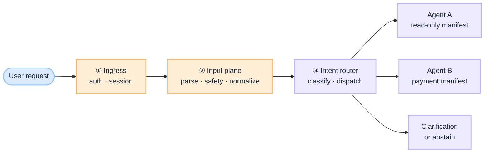

# What Is an Intent Router — and Why It Matters in Agentic AI

Enterprise teams ship agentic assistants with twenty tools, one system prompt, and a hope the model “figures out what the user wants.” Demos work. Production does not. The failure is rarely reasoning — it is **routing**: the wrong workflow activated, the wrong tool family exposed, a payment path opened for a read-only question.

An **intent router** is the architectural component that fixes this. It sits at ingress — after auth and input normalization, before the agent loop — and answers one question deterministically: **which governed path should handle this request?**

:::tip[THE CLAIM]
**The model proposes; the system routes.** Intent classification is not a prompt trick inside the agent loop. It is a platform decision that selects workflow, tool manifest, policy profile, and model path — before any tool schema reaches the LLM.
:::

<!-- truncate -->

## The bottom line first

- **An intent router maps requests to routes** — not to answers. It picks which agent, workflow, or tool family should run.
- **It is the first gate in the intelligence path.** Wrong route means wrong tools, wrong policy, wrong retrieval corpus — even when every later stage “succeeds.”
- **Routing belongs in code, not in the loop.** The agent planner decides *what step next* inside a workflow; the router decides *which workflow*.
- **It is evaluable.** Unlike open-ended agent behavior, intent labels have golden sets, confusion matrices, and CI gates.
- **It is where prediction meets authority.** Session context, entitlements, and safety filters constrain which routes are even eligible.

## What an intent router actually is

An intent router is a **dispatch layer** between the user and the agentic app. Given a normalized request (plus session, channel, and identity context), it returns a **route contract**:

| Output | Purpose |
| --- | --- |
| `intent_label` | Business-meaningful category (`account_history`, `payment_initiate`, `policy_qa`) |
| `route_id` | Which agent profile or workflow to activate |
| `confidence` | Whether to route, clarify, or abstain |
| `entities` | Structured slots extracted for downstream use |
| `allowed_tools` | Tool manifest scope for this path |
| `policy_profile` | Risk tier, step-up rules, data classification ceiling |

The router does **not** plan multi-step execution. It does **not** call tools. It does **not** hold credentials. It selects the governed entry point — and the [agentic app](/playbooks/pgar-runtime/boundary/agentic-app) takes it from there.

This aligns with the [Eval Input plane](/playbooks/eval-engineering/plane-input): parsing, intent classification, and first-line safety filters happen **before inference begins**. If ambiguous intent or injection passes here, no amount of retrieval quality or tool governance will save the outcome.

## Why it is a significant architectural component

### 1. It isolates failure modes

Agent systems fail in layers. When you conflate routing with planning, you cannot tell whether a bad outcome came from:

- wrong workflow selection,
- wrong tool inside the right workflow,
- wrong retrieval,
- or wrong synthesis.

A dedicated router makes **intent misroute** a first-class failure class — measurable, owned, and fixable without retraining the whole agent.

### 2. It scopes authority before the LLM sees tools

In [Policy-Governed Agent Runtime](/insights/policy-governed-agent-runtime), the LLM receives conversation and tool schemas only. The agentic app holds the token and forwards proposals to the PEP. **Routing decides which schemas appear at all.**

A customer asking “show my balance” should never see `initiate_wire` in the manifest — not because the prompt says “be careful,” but because the router never activated the payment route. This is [G.A.I.N Agents](/frameworks/gain-agents) in practice: **grounding is a pipeline, not a prompt.**

### 3. It makes non-determinism manageable

AI systems map input → many possible outputs. Routing is one place where you can demand **repeatable, testable decisions**. Your eval suite can assert:

- “Summarize my last three wire transfers” → `account_history`
- Empty message → clarification, no tool call
- Injection payload → block, no exfil route

That is the same discipline as [Eval Engineering](/insights/eval-engineering): behavior validated under uncertainty, not just “did it run.”

### 4. It separates cheap decisions from expensive ones

Routing should be fast. A layered router — rules, classifier, LLM fallback only when needed — keeps latency and cost down while reserving capable models for the agent loop itself. [G.A.I.N LLM](/frameworks/gain-llm) treats gateway routing as infrastructure: task-aware dispatch, abstention as a first-class outcome, capability matrix per route.

### 5. It enables multi-agent systems without chaos

When you have specialized agents — support, payments, compliance, internal ops — something must decide which one owns the turn. Without a router, you get:

- every agent loaded with every tool,
- supervisor prompts that grow without bound,
- handoffs that depend on model mood rather than contracts.

The router is the **capability matrix at ingress**: task × role × data class → route.

## Intent router vs agent planner

Teams often collapse these. They should not.

| | Intent router | Agent planner |
| --- | --- | --- |
| **When** | Once per user turn (usually) | Inside the plan → act → observe loop |
| **Decides** | Which workflow / manifest | Which step / tool within workflow |
| **Nature** | Deterministic + eval-gated | Model-assisted, policy-gated |
| **Output** | Route contract | Tool proposal |
| **Failure** | Intent misroute | Wrong tool, wrong args, loop runaway |

:::important[PREDICTION VS. TRUTH]
**Intelligence in the LLM. Truth in the system.** The model may infer intent as part of conversation — that is prediction. The router’s verdict, constrained by entitlements and safety, is the architectural decision that activates a governed path.
:::

## What happens when you skip it

| Anti-pattern | Production symptom |
| --- | --- |
| One mega-agent, all tools exposed | Model picks payment tool for a FAQ; PEP denies; user gets confusing errors |
| Routing inside the agent loop | Inconsistent routes across retries; impossible to eval in isolation |
| Prompt-only intent (“figure out what they want”) | Injection hijacks workflow; adversarial inputs reach high-risk tools |
| No confidence threshold | Silent misroutes; wrong corpus retrieved; confident wrong answers |
| No session stickiness | “Yes” after “initiate wire?” re-classified as general chat |

Every row is an **architecture failure**, not a model failure. The services ran. The model responded. The user still lost trust.

## Where it sits in the G.A.I.N stack

| G.A.I.N pillar | Router contribution |
| --- | --- |
| **G · Grounded** | Route table respects entitlements; high-risk paths require step-up profiles |
| **A · Adaptive** | Misroute feedback closes loop into route table and golden sets |
| **I · Intelligent** | LLM used for ambiguous classification only — not for owning dispatch |
| **N · Native** | Trace every route decision; latency SLOs per layer; cost attribution by route |

The router is not optional glue. It is the **control plane entry** for agentic intelligence — the same way an API gateway is not optional for microservices.

## Examiner and operator questions

If you cannot answer these from logs and evals, the router is not production-ready:

1. Which route handled this request, with what confidence?
2. Which routes were eligible given this user’s entitlements?
3. How often does each route misroute on the golden set?
4. What happens below threshold — clarify, abstain, or escalate?
5. Did a production incident become a permanent regression test?

## What comes next

This article defines **what** an intent router is and **why** it belongs in the architecture. The companion piece — [How to Design an Intent Router](/insights/design-intent-router) — covers route tables, layered classification, confidence thresholds, eval gates, and wiring into the agentic app.

:::info[Builds on]
[G.A.I.N Agents](/frameworks/gain-agents) · [Policy-Governed Agent Runtime](/insights/policy-governed-agent-runtime) · [Eval Plane ①: Input](/playbooks/eval-engineering/plane-input)
:::
