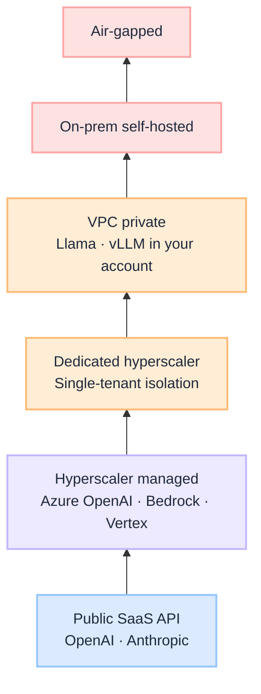
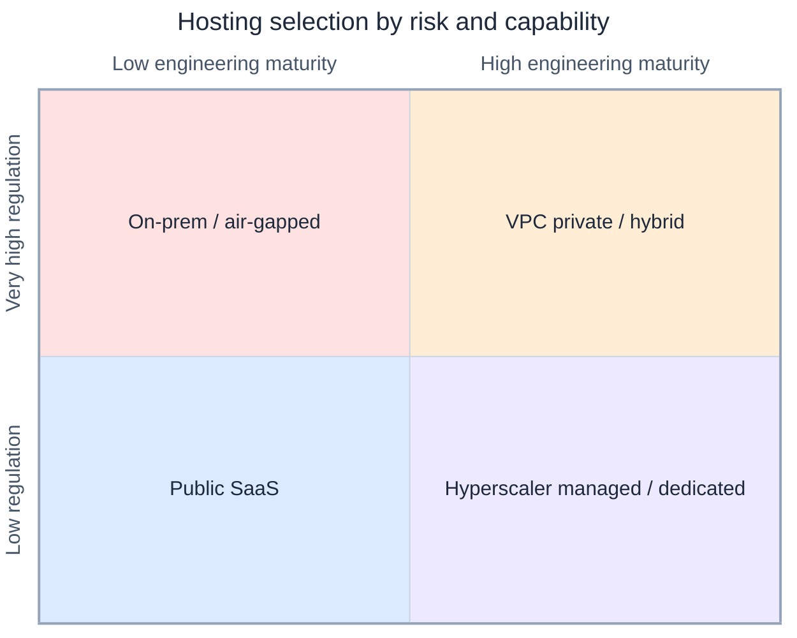

# LLM Hosting Options for Regulated Industries

Enterprise teams ask **which model** first. Regulated organisations should ask **where it runs**, **who owns the boundary**, and **who is accountable when inference touches sensitive data**. The model brand matters less than the hosting pattern, and the hosting pattern must match both **regulatory pressure** and **engineering capability**.

This is a **decision guide**: the hosting ladder (what exists), selection logic by industry profile, and a simple matrix to shortlist realistic options, aligned with [G.A.I.N LLM](/frameworks/gain-llm) and production governance patterns.

:::tip[THE CLAIM]
**SaaS is fastest. Hyperscaler managed is the safest default for most enterprises. Dedicated and VPC patterns earn their cost when isolation is auditable. On-prem and air-gapped are sovereignty choices, not performance choices.**
:::

<!-- truncate -->

## Two questions, one guide

| Section | Answers |
| --- | --- |
| **1. Hosting ladder** | Where *can* I run models? |
| **2. Selection logic** | Which option fits *my* risk and capability? |

**One-line summary:**

- **SaaS** = fastest
- **Hyperscaler managed / dedicated** = safest managed default through enterprise isolation
- **VPC private** = controlled ownership
- **On-prem** = full sovereignty
- **Air-gapped** = maximum security

---

## 1. LLM hosting options: what exists

From **least to most control**:

| Option | Where it runs | Ownership | Control | Cost | Responsibility |
| --- | --- | --- | --- | --- | --- |
| **Public SaaS API** | Vendor cloud | Vendor | Low | Low | Vendor |
| **Hyperscaler managed** (multi-tenant) | AWS / Azure / GCP regions | Vendor | Medium | Medium | Shared |
| **Dedicated on hyperscaler** (single-tenant) | Isolated infra in cloud | Vendor | High | High | Mostly vendor |
| **VPC private deployment** | Your cloud account | You | Very high | High | You + vendor tooling |
| **On-prem self-hosted** | Your datacenter | You | Maximum | Very high | Fully you |
| **Air-gapped** | Offline secure environment | You | Maximum+ | Highest | Fully you |
| **Edge / local** | Laptop / edge devices | You | High | Low | You |
| **Hybrid** | Mixed setup | Shared | Flexible | Flexible | Shared |

### The hosting ladder: at a glance

| Option | Control | Cost | Ownership | Responsibility |
| --- | --- | --- | --- | --- |
| Public SaaS | Low | Low | Vendor | Vendor |
| Hyperscaler managed | Medium | Medium | Vendor | Shared |
| Dedicated hyperscaler | High | High | Vendor | Mostly vendor |
| VPC private | Very high | High | You | Mostly you |
| On-prem | Very high | Very high | You | Fully you |
| Air-gapped | Maximum | Highest | You | Fully you |

**Edge / local** and **hybrid** sit orthogonal to the ladder: edge for offline or latency-sensitive workloads; hybrid for **risk-based routing** (low-risk → managed API; high-risk → private stack).

---

## 2. How organisations choose: regulation × engineering

Map on two axes:

- **Regulatory pressure** (low → very high)
- **Engineering maturity** (low → high)

Then shortlist **three realistic options**, not every rung on the ladder.

**Rule of thumb:**

- If **regulation grows faster than engineering capability** → move **right** on the ladder (managed isolation: dedicated, VPC).
- If **engineering capability grows faster than regulation** → move **down** on ownership (VPC, on-prem, self-hosted stack).

---

### A. Low regulation + low engineering maturity

**Examples:** internal tools, marketing, basic chatbots, knowledge search (non-sensitive), customer support (non-PII).

**Goal:** speed over control.

| Option | When to choose | Examples |
| --- | --- | --- |
| **A: Public SaaS** | Fast delivery; minimal infra team | OpenAI Platform, Anthropic API |
| **B: Hyperscaler managed** | Already on AWS / Azure / GCP; want IAM and audit hooks | Azure OpenAI Service, Amazon Bedrock, Vertex AI |
| **C: Hybrid** | SaaS for general workloads; private RAG for internal docs | Managed inference + private vector store |

:::note
Even in low-regulation contexts, **data classification** still applies. Do not paste customer PII or unreleased financials into public SaaS without a policy review.
:::

---

### B. Medium regulation + low/medium engineering

**Examples:** insurance operations, HR systems, enterprise support, financial services (non-core).

**Goal:** compliance without heavy infra burden.

| Option | When to choose | Examples |
| --- | --- | --- |
| **A: Hyperscaler managed** (default) | Strongest default: audit logs, IAM, regional controls | Azure OpenAI, Bedrock, Vertex AI |
| **B: Dedicated vendor deployment** | Regulator or CISO asks for stronger isolation | OpenAI Enterprise, Cohere Enterprise, isolated enterprise tenants |
| **C: Private RAG + managed inference** | Keep documents and indexes in your boundary; use managed model for inference | Private retrieval gateway + Azure OpenAI / Bedrock |

**Very common pattern:** private data layer + managed model API. Retrieval and context assembly stay yours; inference is vendor-operated. See [Retrieval is a governed action](/insights/retrieval-is-a-governed-action).

---

### C. High regulation + medium/high engineering

**Examples:** banking, healthcare, telecom, government contractors.

**Goal:** strong isolation + manageable ops.

| Option | When to choose | Examples |
| --- | --- | --- |
| **A: Dedicated on hyperscaler** (best balance) | Isolated infra; vendor-managed GPU; lower ops than full self-host | Single-tenant Azure OpenAI, dedicated Bedrock, private endpoints |
| **B: VPC private deployment** | Platform team exists; want model stack in your account | Llama, Mistral, vLLM on EKS / AKS / GKE |
| **C: Hybrid split by risk** | Different workloads, different boundaries | Low-risk → dedicated managed; high-risk → VPC private |

Most realistic at scale: **risk-based routing** in the [LLM gateway](/frameworks/gain-llm), not one hosting pattern for every use case.

---

### D. Very high regulation + high engineering maturity

**Examples:** defense, sovereign systems, critical infrastructure, core banking paths, classified environments.

**Goal:** full sovereignty.

| Option | When to choose | Examples |
| --- | --- | --- |
| **A: On-prem self-hosted** | Strict data residency and ownership; ops team in place | Private GPU cluster, on-prem vLLM / TGI |
| **B: Air-gapped** | Classified or fully offline requirements | Offline model weights, no egress |
| **C: VPC private with open models** | On-prem too heavy; cloud account still sovereign-controlled | Open weights in private cloud with no public endpoints |

Examiner and auditor questions at this tier: **who can reach the model**, **where weights live**, **what leaves the boundary**, **what is logged**, and **how you patch without egress**.

---

## Decision matrix

| Regulatory need | Engineering capability | Best first choice |
| --- | --- | --- |
| Low | Low | Public SaaS |
| Medium | Low | Hyperscaler managed |
| Medium | Medium | Hyperscaler managed / dedicated |
| High | Medium | Dedicated hyperscaler |
| High | High | VPC private |
| Very high | High | On-prem / air-gapped |

Use the matrix as a **starting shortlist**, not a final architecture sign-off. Always add: data classification, residency, model-risk review, and eval gates before production.

---

## What to decide beyond hosting

Hosting answers **where inference runs**. Production LLM architecture still requires:

| Concern | Where it lives | See |
| --- | --- | --- |
| **Gateway routing** | Task-aware model selection per route | [G.A.I.N LLM](/frameworks/gain-llm) |
| **Context boundary** | What may enter the prompt | [G.A.I.N RAG](/frameworks/gain-rag) |
| **Agent side effects** | Policy before tools run | [PGAR](/insights/policy-governed-agent-runtime) |
| **Behavior validation** | Eval CI on every change | [G.A.I.N Evaluation](/frameworks/gain-evaluation) |
| **Trace and cost** | Per-tenant attribution | [G.A.I.N Observability](/frameworks/gain-observability) |

The wrong hosting choice is expensive to unwind. The right hosting choice with no gateway, eval, or policy layer still fails in production.

---

## Common mistakes

| Mistake | Why it hurts |
| --- | --- |
| **Defaulting to public SaaS for regulated data** | Data leaves your control boundary without a recorded decision |
| **Jumping to on-prem for speed** | Ops burden kills delivery; team cannot patch or scale |
| **One pattern for all use cases** | Marketing chatbot and wire-transfer copilot share a boundary they should not |
| **Confusing vendor SOC 2 with your compliance** | Shared responsibility: you still own data classification and access |
| **Ignoring hybrid as a permanent state** | Risk-based routing is a valid end state, not a stepping-stone failure |

---

## Summary

**Section 1: the ladder:** from public SaaS (fastest, least control) to air-gapped (maximum security, highest cost). Edge and hybrid extend the ladder for latency and split-risk designs.

**Section 2: the choice:** map **regulatory pressure** against **engineering maturity**. Low/low → SaaS or hyperscaler managed. Medium → hyperscaler managed or dedicated. High → dedicated or VPC private. Very high → on-prem or air-gapped.

Move **right** when regulation outpaces engineering. Move **down** on ownership when engineering outpaces regulation. Shortlist three options, then validate against data class, residency, and operational reality, not vendor marketing slides.

:::info[Builds on]
[G.A.I.N LLM](/frameworks/gain-llm) · [G.A.I.N AIOM](/frameworks/gain-aiom) · [Policy-Governed Agent Runtime](/insights/policy-governed-agent-runtime)
:::
