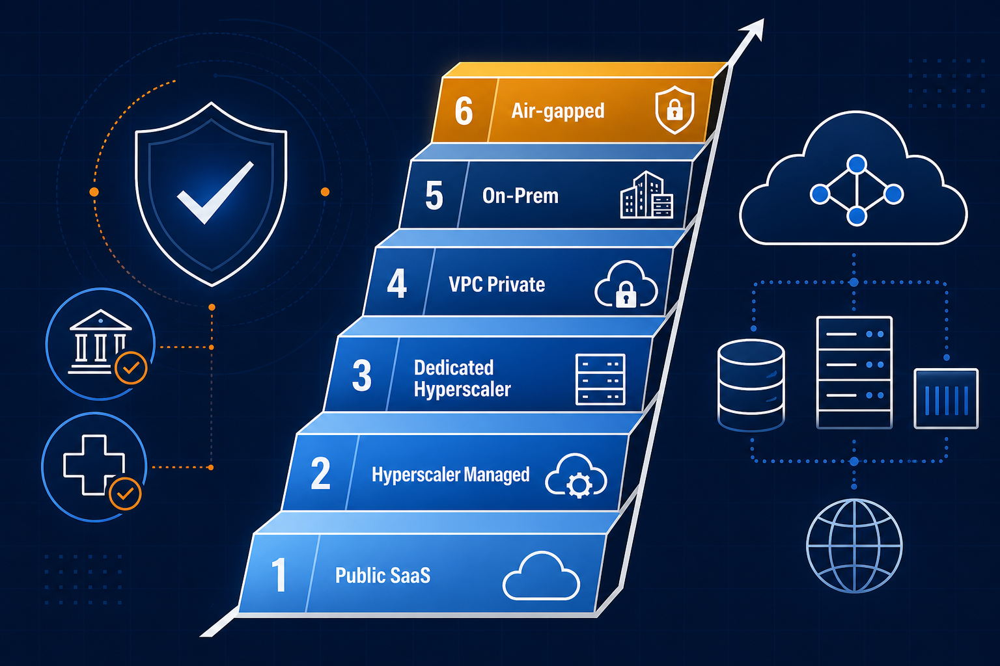
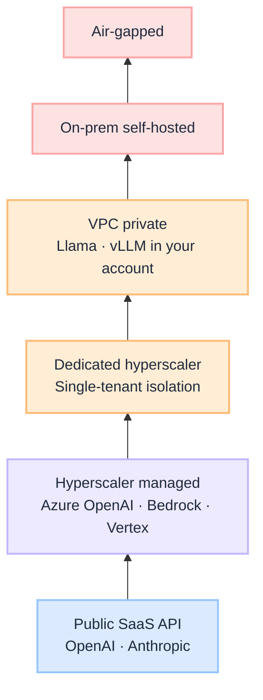
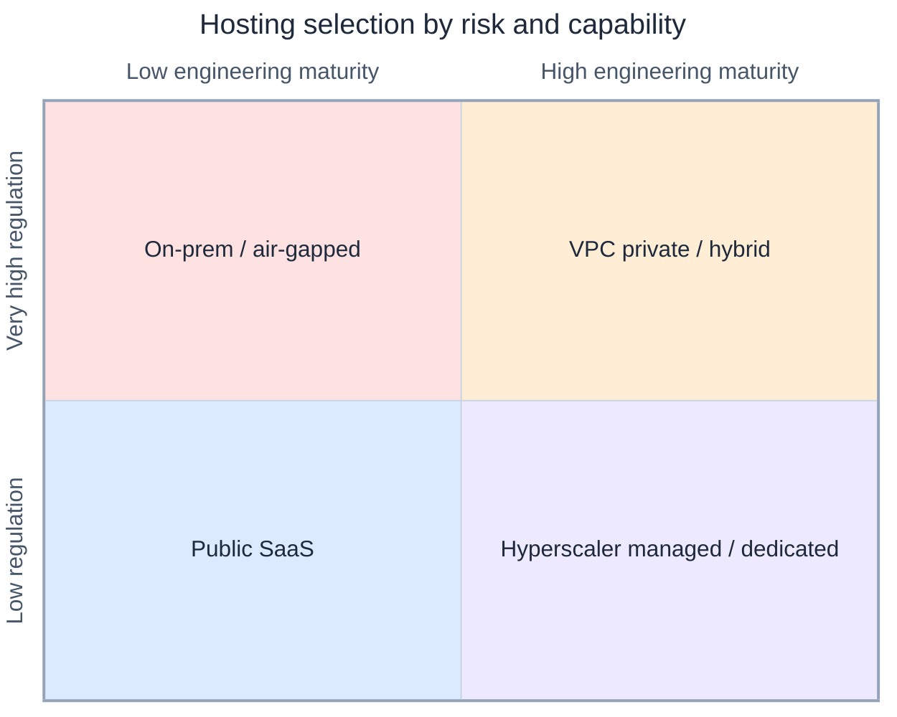

# LLM Hosting Options for Regulated Industries

Enterprise teams ask **which model** first. Regulated organisations should ask **where it runs**, **who owns the boundary**, and **who is accountable when inference touches sensitive data**. The model brand matters less than the hosting pattern, and the hosting pattern must match both **regulatory pressure** and **engineering capability**.

This is a **decision guide**: the hosting ladder (what exists), selection logic by industry profile, and a simple matrix to shortlist realistic options, aligned with [G.A.I.N LLM](/frameworks/gain-llm) and production governance patterns.

:::tip[THE CLAIM]
**SaaS is fastest. Hyperscaler managed is the safest default for most enterprises. Dedicated and VPC patterns earn their cost when isolation is auditable. On-prem and air-gapped are sovereignty choices, not performance choices.**
:::

<!-- truncate -->

## The bottom line first

- **Hosting is a ladder**, from public SaaS to air-gapped, not a single vendor or model choice.
- **Regulatory pressure × engineering maturity** picks the rung; shortlist three realistic options.
- **Sovereignty follows data class**: prompts, weights, logs, and egress differ on every rung.
- **Hyperscaler managed** is the safest default for most enterprises; **dedicated/VPC** when isolation must be auditable.
- **Hybrid + gateway routing** is a valid end state for split-risk workloads.
- **Right hosting without gateway, eval, and policy** still fails in production.

## Three questions, one guide

| Section | Answers |
| --- | --- |
| **1. Hosting ladder** | Where *can* I run models? |
| **2. Data sovereignty** | Who holds prompts, weights, and logs; what crosses borders? |
| **3. Selection logic** | Which option fits *my* risk and capability? |

---

## 1. LLM hosting options: what exists

From **least to most control**:

| Option | Where it runs | Ownership | Control | Cost | Responsibility |
| --- | --- | --- | --- | --- | --- |
| **Public SaaS API** | Vendor cloud | Vendor | Low | Low | Vendor |
| **Hyperscaler managed** (multi-tenant) | AWS / Azure / GCP regions | Vendor | Medium | Medium | Shared |
| **Dedicated on hyperscaler** (single-tenant) | Isolated infra in cloud | Vendor | High | High | Mostly vendor |
| **VPC private deployment** | Your cloud account | You | Very high | High | You + vendor tooling |
| **On-prem self-hosted** | Your datacenter | You | Maximum | Very high | Fully you |
| **Air-gapped** | Offline secure environment | You | Maximum+ | Highest | Fully you |
| **Edge / local** | Laptop / edge devices | You | High | Low | You |
| **Hybrid** | Mixed setup | Shared | Flexible | Flexible | Shared |

**Edge / local** and **hybrid** sit orthogonal to the ladder: edge for offline or latency-sensitive workloads; hybrid for **risk-based routing** (low-risk → managed API; high-risk → private stack).

---

## 2. Data sovereignty by hosting model

Hosting is not only a **control** choice. It is a **sovereignty** choice: who legally and operationally owns the data that enters inference, where it is processed and stored, what may leave your jurisdiction, and who can access logs under subpoena or vendor policy.

Sovereignty has four layers. Every hosting model answers them differently:

| Layer | Question |
| --- | --- |
| **Ingress** | Where do prompts, RAG context, and attachments land? |
| **Inference** | Where does the model run; who operates the GPU stack? |
| **Egress** | What leaves the boundary (responses, embeddings, telemetry, support logs)? |
| **Persistence** | Where are weights, caches, fine-tunes, and audit trails stored? |

### Sovereignty posture by option

| Hosting model | Prompt & response data | Model weights | Residency control | Cross-border risk | Typical sovereignty posture |
| --- | --- | --- | --- | --- | --- |
| **Public SaaS API** | Processed in vendor-chosen region(s); often US-default | Vendor-owned; location opaque | Contractual only (DPA, data region clauses) | **High** unless vendor offers explicit in-region processing | Non-sensitive workloads only; legal review before any PII or unreleased financials |
| **Hyperscaler managed** | Pin to chosen region (e.g. EU West, Sydney) via Azure OpenAI, Bedrock, Vertex | Vendor-managed in that region; shared tenancy | **Medium**: regional deployment + IAM; you configure region | **Medium**: stays in region if configured; metadata/support flows may still cross borders | Default for medium regulation when region pinning, no-training, and logging contracts are in place |
| **Dedicated hyperscaler** | Single-tenant compute in contracted region | Isolated stack; vendor still owns platform | **High** for compute boundary; vendor operates infra | **Lower** if dedicated instance never leaves sovereign region | Strong isolation without full self-host ops; common for banking and health at scale |
| **VPC private** | Prompts, RAG packs, logs in **your** cloud account and region | Open weights in your storage; you control replication | **Very high**: your VPC, KMS, network policy | **Low** if no public endpoints and egress is gated | Sovereign-cloud pattern: data stays inside your legal entity's cloud boundary |
| **On-prem self-hosted** | All inference data on your hardware in your datacenter | Weights on your storage; no vendor runtime dependency | **Maximum**: physical and legal control in your facilities | **Minimal** if egress is blocked by policy | Full sovereignty; you own patch velocity, capacity, and incident response |
| **Air-gapped** | Offline only; no network path to vendor | Weights imported via controlled physical transfer | **Maximum+**: no external jurisdiction by design | **None** if truly air-gapped | Classified, defense, critical infrastructure; not a general enterprise default |
| **Edge / local** | Data on device; may sync if connected | Small models local; updates may pull from vendor | **High locally**, weak if device syncs to cloud | **Variable**: depends on sync and telemetry policy | Latency and offline use cases; sovereignty follows device management policy |
| **Hybrid** | Split by workload: SaaS for low sensitivity, private stack for regulated | Mixed: managed APIs + self-hosted weights per route | **Per-route**: classification drives where data may go | **Managed by routing policy**, not one global rule | Realistic end state for large regulated orgs; requires gateway and data-class enforcement |

### What crosses the boundary (checklist)

Before signing off on a hosting model, record answers for **each** data class you will send to the model:

1. **Prompts and attachments**: region, encryption at rest, retention period, vendor training use
2. **Retrieved context (RAG)**: does retrieval stay in your boundary while only a summary hits SaaS?
3. **Embeddings**: where vectors are computed and stored; re-index replication across regions
4. **Logs and telemetry**: inference logs, prompt logging, support tickets, crash dumps
5. **Model artifacts**: base weights, LoRA adapters, fine-tunes; who can export them
6. **Subprocessor chain**: vendor's subprocessors, cloud regions, and lawful-access jurisdictions

:::important[Sovereignty ≠ vendor compliance badge]
A vendor SOC 2 or ISO 27001 report proves **their** controls exist. It does not prove **your** data residency, **your** lawful-access posture, or **your** regulator's acceptance. You still own classification, residency decisions, and evidence that data stayed where policy requires.
:::

### Examiner and auditor questions

At minimum, be able to answer:

- **Which hosting model applies to each data class?** (not one model for everything)
- **Where are prompts processed and stored?** (region, legal entity, subprocessors)
- **What may leave the jurisdiction?** (responses, logs, embeddings, support access)
- **Where do model weights live?** (vendor cloud, your account, on-prem, air-gapped vault)
- **How do you enforce routing?** (gateway, policy, not prompt instructions alone)

Hybrid and VPC patterns fail audits when **policy says private** but **routing still sends regulated context to public SaaS**. See [G.A.I.N LLM gateway routing](/frameworks/gain-llm) and [Retrieval is a governed action](/insights/retrieval-is-a-governed-action).

---

## 3. How organisations choose: regulation × engineering

Map on two axes:

- **Regulatory pressure** (low → very high)
- **Engineering maturity** (low → high)

Then shortlist **three realistic options**, not every rung on the ladder.

**Rule of thumb:**

- If **regulation grows faster than engineering capability** → move **right** on the ladder (managed isolation: dedicated, VPC).
- If **engineering capability grows faster than regulation** → move **down** on ownership (VPC, on-prem, self-hosted stack).

---

### A. Low regulation + low engineering maturity

**Examples:** internal tools, marketing, basic chatbots, knowledge search (non-sensitive), customer support (non-PII).

**Goal:** speed over control.

| Option | When to choose | Examples |
| --- | --- | --- |
| **A: Public SaaS** | Fast delivery; minimal infra team | OpenAI Platform, Anthropic API |
| **B: Hyperscaler managed** | Already on AWS / Azure / GCP; want IAM and audit hooks | Azure OpenAI Service, Amazon Bedrock, Vertex AI |
| **C: Hybrid** | SaaS for general workloads; private RAG for internal docs | Managed inference + private vector store |

:::note
Even in low-regulation contexts, **data classification** still applies. Do not paste customer PII or unreleased financials into public SaaS without a policy review.
:::

---

### B. Medium regulation + low/medium engineering

**Examples:** insurance operations, HR systems, enterprise support, financial services (non-core).

**Goal:** compliance without heavy infra burden.

| Option | When to choose | Examples |
| --- | --- | --- |
| **A: Hyperscaler managed** (default) | Strongest default: audit logs, IAM, regional controls | Azure OpenAI, Bedrock, Vertex AI |
| **B: Dedicated vendor deployment** | Regulator or CISO asks for stronger isolation | OpenAI Enterprise, Cohere Enterprise, isolated enterprise tenants |
| **C: Private RAG + managed inference** | Keep documents and indexes in your boundary; use managed model for inference | Private retrieval gateway + Azure OpenAI / Bedrock |

**Very common pattern:** private data layer + managed model API. Retrieval and context assembly stay yours; inference is vendor-operated. See [Retrieval is a governed action](/insights/retrieval-is-a-governed-action).

---

### C. High regulation + medium/high engineering

**Examples:** banking, healthcare, telecom, government contractors.

**Goal:** strong isolation + manageable ops.

| Option | When to choose | Examples |
| --- | --- | --- |
| **A: Dedicated on hyperscaler** (best balance) | Isolated infra; vendor-managed GPU; lower ops than full self-host | Single-tenant Azure OpenAI, dedicated Bedrock, private endpoints |
| **B: VPC private deployment** | Platform team exists; want model stack in your account | Llama, Mistral, vLLM on EKS / AKS / GKE |
| **C: Hybrid split by risk** | Different workloads, different boundaries | Low-risk → dedicated managed; high-risk → VPC private |

Most realistic at scale: **risk-based routing** in the [LLM gateway](/frameworks/gain-llm), not one hosting pattern for every use case.

---

### D. Very high regulation + high engineering maturity

**Examples:** defense, sovereign systems, critical infrastructure, core banking paths, classified environments.

**Goal:** full sovereignty.

| Option | When to choose | Examples |
| --- | --- | --- |
| **A: On-prem self-hosted** | Strict data residency and ownership; ops team in place | Private GPU cluster, on-prem vLLM / TGI |
| **B: Air-gapped** | Classified or fully offline requirements | Offline model weights, no egress |
| **C: VPC private with open models** | On-prem too heavy; cloud account still sovereign-controlled | Open weights in private cloud with no public endpoints |

Examiner and auditor questions at this tier: **who can reach the model**, **where weights live**, **what leaves the boundary**, **what is logged**, and **how you patch without egress**.

---

## Decision matrix

| Regulatory need | Engineering capability | Best first choice |
| --- | --- | --- |
| Low | Low | Public SaaS |
| Medium | Low | Hyperscaler managed |
| Medium | Medium | Hyperscaler managed / dedicated |
| High | Medium | Dedicated hyperscaler |
| High | High | VPC private |
| Very high | High | On-prem / air-gapped |

Use the matrix as a **starting shortlist**, not a final architecture sign-off. Always add: data classification, residency, model-risk review, and eval gates before production.

---

## What to decide beyond hosting

Hosting answers **where inference runs**. Production LLM architecture still requires:

| Concern | Where it lives | See |
| --- | --- | --- |
| **Gateway routing** | Task-aware model selection per route | [G.A.I.N LLM](/frameworks/gain-llm) |
| **Context boundary** | What may enter the prompt | [G.A.I.N RAG](/frameworks/gain-rag) |
| **Agent side effects** | Policy before tools run | [PGAR](/insights/policy-governed-agent-runtime) |
| **Behavior validation** | Eval CI on every change | [G.A.I.N Evaluation](/frameworks/gain-evaluation) |
| **Trace and cost** | Per-tenant attribution | [G.A.I.N Observability](/frameworks/gain-observability) |

The wrong hosting choice is expensive to unwind. The right hosting choice with no gateway, eval, or policy layer still fails in production.

---

## Common mistakes

| Mistake | Why it hurts |
| --- | --- |
| **Defaulting to public SaaS for regulated data** | Data leaves your control boundary without a recorded decision |
| **Jumping to on-prem for speed** | Ops burden kills delivery; team cannot patch or scale |
| **One pattern for all use cases** | Marketing chatbot and wire-transfer copilot share a boundary they should not |
| **Confusing vendor SOC 2 with your compliance** | Shared responsibility: you still own data classification, residency, and access |
| **Treating region pinning as full sovereignty** | Hyperscaler managed keeps vendor subprocessors and support paths; record what still crosses borders |
| **Ignoring hybrid as a permanent state** | Risk-based routing is a valid end state, not a stepping-stone failure |

---

## Key takeaways

- **Move right** on the ladder when regulation outpaces engineering (managed isolation: dedicated, VPC).
- **Move down** on ownership when engineering outpaces regulation (VPC, on-prem, self-hosted stack).
- **Match hosting to data class**, not one global pattern for every workload.
- **Record sovereignty** for prompts, RAG context, embeddings, logs, and subprocessors before sign-off.
- **SOC 2 and ISO reports** prove vendor controls, not your residency or lawful-access posture.
- **Validate three shortlisted options** against residency, ops reality, and gateway policy, not vendor slides.

:::info[Builds on]
[G.A.I.N LLM](/frameworks/gain-llm) · [G.A.I.N AIOM](/frameworks/gain-aiom) · [Policy-Governed Agent Runtime](/insights/policy-governed-agent-runtime)
:::
