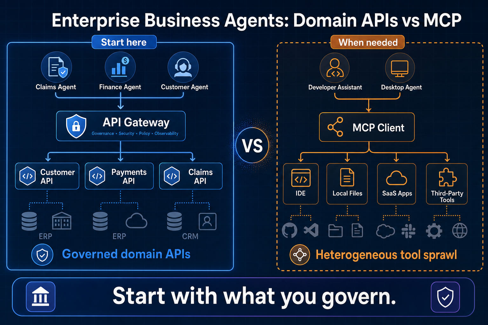
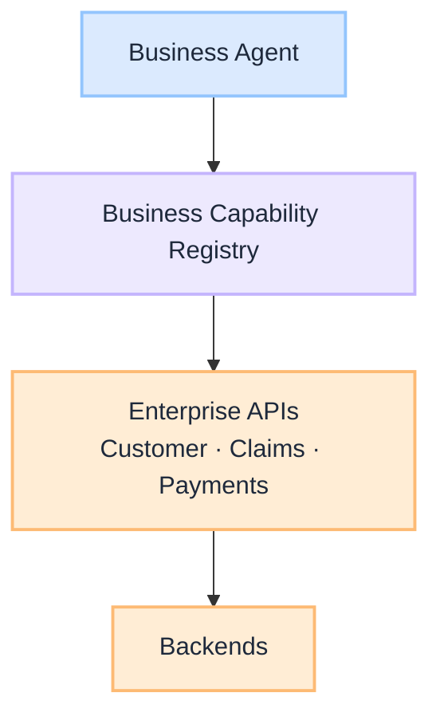
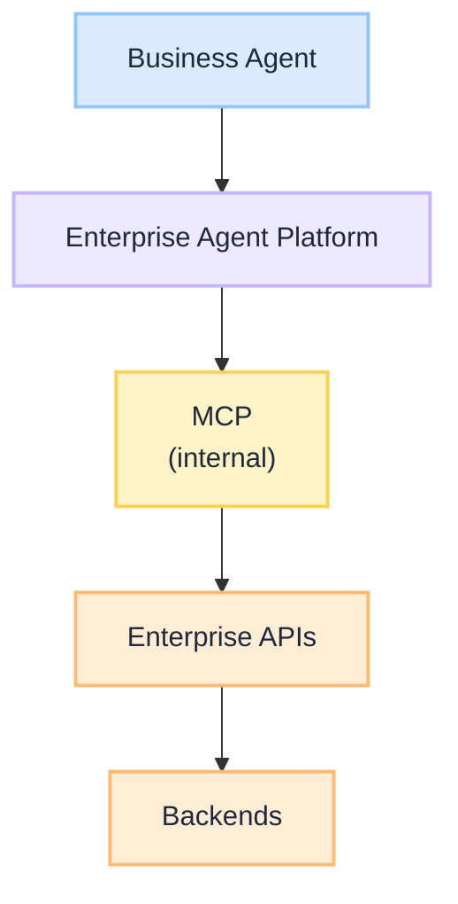
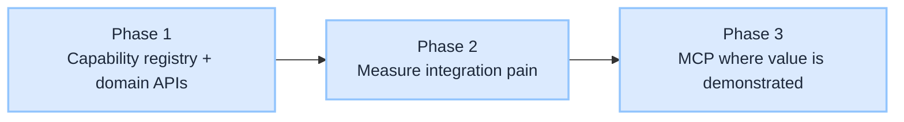

# Is MCP Really Necessary for Business Agents in Large Regulated Enterprises?

**Model Context Protocol (MCP)** is an important and promising standard for AI tool interoperability, particularly where agents interact with many heterogeneous tools. Vendors position it as a foundational layer for enterprise agent architectures. That positioning is understandable. MCP solves real problems.

The architectural question for large regulated enterprises is different. It is not **whether MCP is good**. It is **whether MCP's benefits outweigh its operational cost for a particular use case**. Business agents in regulated industries typically operate against a relatively small set of well-governed business capabilities already exposed through enterprise APIs. In those environments, MCP should be an **implementation choice**, not an **architectural prerequisite**.

This is a **decision guide**: when governed domain APIs are the right starting point, when MCP earns its cost, and how platform teams can adopt MCP internally without changing the business architecture, building on [Policy-Governed Agent Runtime](/insights/policy-governed-agent-runtime) and [Design an Intent Router](/insights/design-intent-router).

:::tip[THE CLAIM]
**MCP is a valuable standard. Adopt it when it demonstrably simplifies the system.** Business agents and developer agents solve different integration problems. If enterprise APIs already satisfy business agent needs, MCP may not provide sufficient additional value initially. Treat MCP as an implementation choice inside the platform, not a mandatory layer every agent must traverse on day one.
:::

<!-- truncate -->

## The bottom line first

- **MCP is good at what it does**: standardising AI-facing tool discovery, schemas, resources, and sessions across heterogeneous systems.
- **Business agents and developer agents are different**: Claims and Payments agents invoke governed capabilities; developer agents span GitHub, Slack, IDEs, and hundreds of SaaS tools.
- **MCP does not replace enterprise APIs**: it standardises the AI-facing surface; REST, OpenAPI, and domain APIs remain the governed execution path.
- **Ask an economic question**: does MCP reduce complexity more than it introduces?
- **Platform teams may adopt MCP internally** without changing what business teams see: Business Agent → Capability Registry → Enterprise APIs.
- **Introduce MCP deliberately**: when measured integration pain justifies platform cost, not because the standard exists.

## Three questions, one guide

| Section | Answers |
| --- | --- |
| **1. What MCP standardises** | AI-facing interoperability, not REST replacement |
| **2. Business vs developer agents** | Different integration patterns, different MCP value |
| **3. Economics and adoption** | When benefits outweigh cost; platform evolution |

---

## 1. MCP is a valid standard, not a substitute for enterprise APIs

MCP is a valuable standard for AI tool interoperability. It standardises how agents discover and invoke tools:

| MCP surface | What it standardises |
| --- | --- |
| **Tool discovery** | `list_tools` across servers with consistent metadata |
| **Tool metadata** | Names, descriptions, capability boundaries |
| **Input/output schemas** | Structured arguments and return shapes |
| **Resources** | Readable context (files, records, configs) |
| **Prompts** | Reusable prompt templates per server |
| **Sessions** | Stateful interaction across tool calls |
| **Streaming** | Incremental results for long-running operations |

MCP does **not** replace REST, OpenAPI, or enterprise domain APIs. Those remain the governed execution surfaces behind the tools. MCP sits at the **AI-facing boundary**: how the planner discovers what it can call and how it formats requests.

The argument is narrower and stronger:

> If enterprise APIs already satisfy the needs of business agents, introducing MCP may not provide sufficient additional value initially.

That is not a criticism of MCP. It is an application of a timeless enterprise architecture principle: **adopt technology when it solves a real problem, not because it is fashionable or expected.**

---

## 2. Business agents and developer agents solve different problems

This is the strongest architectural distinction in the decision.

### Developer agents: heterogeneous tool sprawl

Developer and productivity agents typically interact with a large, changing set of unrelated tools:

| Category | Examples |
| --- | --- |
| **Source control** | GitHub, GitLab, Bitbucket |
| **Collaboration** | Slack, Teams, email |
| **Work tracking** | Jira, Linear, Azure DevOps |
| **IDEs and local** | VS Code, local files, terminals |
| **Infrastructure** | Kubernetes, cloud consoles, Terraform |
| **SaaS** | Hundreds of third-party products |

MCP's benefits are often **much greater here**: one protocol over highly heterogeneous systems, consistent discovery, and a growing ecosystem of MCP servers.

### Business agents: governed business capabilities

Business agents in regulated enterprises typically invoke a **relatively small, stable set** of governed capabilities:

| Capability | What the agent does |
| --- | --- |
| **Customer** | Lookup, update, entitlements |
| **Claims** | Intake, status, adjudication triggers |
| **Payments** | Validate, initiate, reconcile |
| **Orders** | Create, modify, fulfil |
| **Pricing** | Quote, discount rules, approval |

These capabilities already expose REST APIs, OpenAPI contracts, OAuth, audit logging, monitoring, and lifecycle management through enterprise gateways. Business applications consume them today. A Claims Agent calling the Claims API is not a new pattern. It is the same governed consumer with a planner in front.

| Dimension | Business agents | Developer agents |
| --- | --- | --- |
| **Tool count** | Small, stable set of domain APIs | Large, heterogeneous, frequently changing |
| **Governance** | PEP + domain auth ([PGAR](/insights/policy-governed-agent-runtime)) | Tool exposure controls, server registry |
| **Schema source** | OpenAPI in API catalog | MCP `list_tools` / server manifests |
| **MCP value** | Often lower initially | Often high |
| **Default path** | Capability registry + domain APIs | MCP often justified early |

### Business agents should think in capabilities, not products

| Agent | Should call | Should not know |
| --- | --- | --- |
| **Claims Agent** | Claims API | SAP, Guidewire, or whichever claims platform runs underneath |
| **Customer Service Agent** | Customer API | Salesforce, ServiceNow, or CRM product name |
| **Finance Agent** | Payments API | Payment provider, core banking product, or wire hub vendor |
| **Inventory Agent** | Inventory API | Which ERP stores stock levels |

An [intent router](/insights/design-intent-router) maps requests to **business routes** (Claims, Customer, Payments), not vendor names. This mirrors [Retrieval is a governed action](/insights/retrieval-is-a-governed-action): the agent proposes; governance decides.

---

## 3. The economic question: does MCP reduce complexity more than it introduces?

Rather than asking **"Should we use MCP?"**, ask **"Does MCP reduce complexity more than it introduces?"**

Every new platform layer brings measurable cost:

| Cost area | What you inherit |
| --- | --- |
| **Security reviews** | New attack surface, server sprawl, tool exposure |
| **Monitoring** | Traces, quotas, server health, version drift |
| **Support** | On-call, incident response, capacity planning |
| **Upgrades** | Protocol versions, server compatibility |
| **Governance** | Policy gates, audit trails, entitlement mapping |
| **Skills** | Teams learn MCP alongside existing API governance |
| **Operational ownership** | Who runs the gateway, registry, and server fleet? |

These costs should be justified by **measurable benefits**: reduced integration time, fewer bespoke adapters, lower schema drift, or OpenAPI gaps MCP fills better than alternatives.

[AI observability in enterprise](/insights/ai-observability-in-enterprise) applies the same discipline: instrument what matters, not every possible signal. MCP adoption deserves the same rigour.

### Common mistakes

| Mistake | Why it hurts |
| --- | --- |
| **MCP as architectural prerequisite for all agents** | Cost lands before integration pain is measurable |
| **Treating MCP as a REST replacement** | Domain APIs remain the governed execution path |
| **One pattern for business and developer agents** | Different integration profiles deserve different defaults |
| **Agents calling vendor SaaS directly** | Bypasses gateway, audit, and policy |
| **Treating MCP as governance** | Protocol standardises invocation; it does not replace PEP or domain auth |
| **Future-proofing without a trigger** | Operational cost is real; benefit is hypothetical |

---

## 4. MCP inside the platform, not in the business architecture

Even if business agents call domain APIs directly today, **platform teams may adopt MCP internally** without changing what business teams experience.

**Today:**

 

**Platform evolution (MCP as internal implementation):**

 

Business teams do not necessarily need to care which protocol the platform uses internally. What they need is a **stable capability registry**, governed tool manifests, and policy enforcement before execution. MCP becomes a platform engineering choice, not a business architecture mandate.

---

## 5. Introduce MCP deliberately

A pragmatic adoption path:

 

**Phase 1: Capability registry and domain APIs**

Business agents discover capabilities through a registry and invoke governed domain APIs. Register OpenAPI specs as tool manifests. Route through the existing gateway. Enforce policy at the PEP. This is the default for regulated business agents.

**Phase 2: Measure integration pain**

Track where integration cost actually lands: adapter count, schema drift, discovery overhead, OpenAPI gaps, or server sprawl. The trigger for MCP is **demonstrated pain**, not vendor momentum or industry expectation.

**Phase 3: MCP where value is demonstrated**

Introduce MCP where it **demonstrably simplifies** the system: developer tooling, cross-vendor SaaS sprawl, platform-internal standardisation, or environments where OpenAPI coverage is thin. Business agents on governed domain APIs may never need to traverse MCP directly.

:::note[THE ARCHITECTURAL PRINCIPLE]
Like any architectural abstraction, MCP should be introduced when it demonstrably simplifies the system, not simply because it is available. Architectural maturity is not measured by the number of layers you introduce. It is measured by introducing the right layers at the right time.
:::

## Key takeaways

- **MCP is a valuable standard** for AI tool interoperability; the question is fit and economics, not validity.
- **Business agents and developer agents differ**: small governed capability sets vs heterogeneous tool sprawl.
- **MCP standardises the AI-facing surface**; it does not replace REST, OpenAPI, or enterprise domain APIs.
- **Ask whether MCP reduces complexity** more than it introduces: security, monitoring, support, upgrades, governance, skills.
- **Platform teams may adopt MCP internally** while business teams continue to see capability registries and domain APIs.
- **Introduce MCP deliberately** when demonstrated value justifies cost, not as a day-one prerequisite for every agent.

:::info[Builds on]
[Policy-Governed Agent Runtime](/insights/policy-governed-agent-runtime) · [Design an Intent Router](/insights/design-intent-router) · [RAG Is Not a Database](/insights/rag-is-not-a-database) · [G.A.I.N MCP](/frameworks/gain-mcp)
:::
