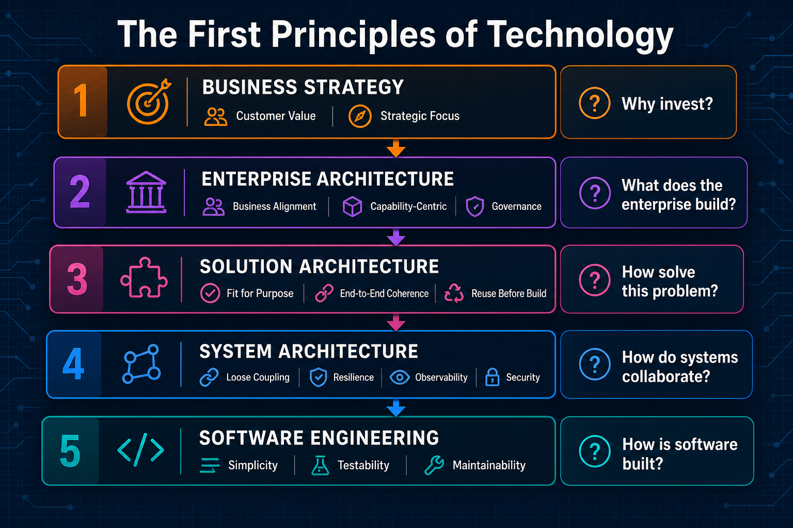

# The First Principles of Technology

*Every technology decision is guided by first principles. The mistake is assuming they are the same principles at every level.*

Ask a room of architects what "first principles" means and you will hear SOLID, KISS, DRY, and maybe a debate about microservices. All valid. All software engineering. None of them answer whether the enterprise should invest in a governed agent platform, consolidate data platforms, or standardise on a single observability stack.

First principles are not one list. They are a **hierarchy**: business strategy, enterprise architecture, solution architecture, system architecture, and software engineering. Each layer has its own enduring principles, its own question, and its own definition of a good outcome. Mix the layers and you get elegant code solving the wrong problem, a solution design that ignores enterprise standards, or a strategy deck that never survives contact with production.

This article maps that hierarchy: what each layer optimises for, which principles belong there, and how to trace a technical decision back to the business outcome it is meant to serve. For **agentic AI**, where models propose actions and loop across tools, skipping a layer does not stay a design debate. It becomes scaled, autonomous impact.

:::tip[THE CLAIM]
**First principles are layer-specific, not universal.** Business strategy decides *why*, enterprise architecture decides *what the enterprise builds*, solution architecture decides *how to solve this specific problem*, system architecture decides *how systems collaborate at runtime*, and software engineering decides *how code is built*. Good decisions apply the right principles at the right level and trace upward to the outcome they support.
:::

<!-- truncate -->

## The bottom line first

- **SOLID, KISS, and DRY live at the software-engineering layer.** They do not settle enterprise investment or platform strategy questions on their own.
- **Five layers span every technology decision:** business strategy, enterprise architecture, solution architecture, system architecture, and software engineering.
- **Each layer optimises for a different outcome:** business value, enterprise value, solution fit, system quality, and software quality.
- **The governing question changes at each layer:** why we invest, what the enterprise builds, how we solve this problem, how systems collaborate at runtime, and how code is written.
- **Frameworks and vendors rotate; layer-specific principles endure.** The anchor is the layer, not the product catalogue.
- **Every technical choice should trace upward** through all five layers to the business outcome it supports.
- **Agentic AI compounds mistakes across layers.** A tool-calling agent that skips strategy, enterprise standards, or runtime governance can automate the wrong outcome at production scale.

## How the layers connect

The diagram above is the map. What follows is the detail: the principles that belong at each layer, what each one optimises for, and where teams most often apply the wrong lens.

Decisions cascade **downward**. Strategy constrains what the enterprise invests in. Enterprise architecture constrains which capabilities, standards, and platforms programmes must use. Solution architecture shapes how one initiative answers a specific business problem. System architecture makes that answer reliable at runtime. Software engineering makes it maintainable in code.

Accountability runs **upward**. A service boundary, integration pattern, or refactoring choice should trace through system design, solution shape, enterprise capability, and business outcome. If the trace breaks, you are probably debating at the wrong layer.

:::note[WHERE SOLUTION ARCHITECTURE SITS]
**Enterprise architecture** is portfolio-wide: standards, capabilities, and platforms across the estate. **Solution architecture** is initiative-scoped: the end-to-end design for one programme, product, or business problem. **System architecture** is runtime-scoped: how the systems in that solution behave, integrate, and fail under load. Many debates stall because the room is mixing all three.
:::

The sections below walk through each layer in order. For each one: the governing question, the principles that endure, and the outcome it is trying to maximise.

## ① Business Strategy

*Why are we investing?*

This layer is **strategy**, not **business architecture**. Strategy sets direction: which outcomes matter, where to invest, and what to defer. Business architecture (capability maps, value streams, operating models) translates that direction into structural business design and feeds the enterprise-architecture layer below. Collapsing the two is how teams end up debating capability models when the funding case was never settled.

These principles keep the organisation focused on opportunities that are worth pursuing.

| Principle | What it guards |
| --- | --- |
| Customer Value | Investment serves a real need, not internal convenience |
| Competitive Advantage | Capability is hard to copy or costly to match |
| Strategic Focus | Resources concentrate; everything else is explicit deferral |
| Economic Value | Returns are measurable, not assumed |
| Adaptability | The portfolio can shift when the market moves |
| Measurable Outcomes | Success is defined before funding, not retrofitted after launch |

:::success[**Purpose:** Maximise business value.]

A common failure mode: a platform team ships excellent infrastructure that no product line asked for. The engineering was sound. The strategy layer was skipped.

:::

## ② Enterprise Architecture

*What should the enterprise build?*

These principles ensure technology serves the enterprise as a whole, not a single programme or vendor relationship.

| Principle | What it guards |
| --- | --- |
| Business Alignment | Capabilities map to outcomes the business actually funds |
| Simplicity | The portfolio stays governable as it grows |
| Capability-Centric Thinking | Investments are named by what the enterprise can *do*, not by product category |
| Enterprise Optimisation | Duplication and fragmentation are deliberate trade-offs, not accidents |
| Data as an Enterprise Asset | Truth, lineage, and access are owned at enterprise scope |
| Governance that Enables Delivery | Controls speed safe delivery; they do not replace it |
| Security and Risk by Design | Risk posture is architectural, not a late-stage review |
| Evolvability | The estate can absorb new domains without wholesale replacement |

:::success[**Purpose:** Maximise enterprise value.]

Capability-centric thinking shows up when teams treat a vector index as a candidate store while the application owns truth at query time. That is an enterprise-architecture decision about where capability lives, not a chunk-size tuning exercise.
:::

## ③ Solution Architecture

*How do we solve this business problem?*

These principles guide the end-to-end design of a specific initiative: which systems participate, how they integrate, and what the solution must deliver for one business problem.

| Principle | What it guards |
| --- | --- |
| Problem-First Design | The solution solves a named business problem, not a technology preference |
| Fit for Purpose | Components are chosen for the outcome, not because the team already owns them |
| Reuse Before Build | Existing enterprise capabilities are consumed before new ones are commissioned |
| End-to-End Coherence | Data, identity, workflow, and policy flow across the solution as one design |
| Stakeholder Alignment | Business, operations, security, and delivery agree on scope before build starts |
| Non-Functional Requirements by Design | Latency, residency, audit, and availability are designed in, not discovered late |
| Integration Clarity | System boundaries, contracts, and ownership are explicit |
| Solution Scope Control | The design resists scope creep; out-of-scope is documented |
| Deliverability | The solution can be built, operated, and funded within programme constraints |
| Traceability to Requirements | Every major component maps to a business or regulatory requirement |

:::success[**Purpose:**  Maximise solution fit.]

A common failure mode: the programme produces a polished integration diagram that ignores enterprise standards, or selects a new platform when an existing capability would do. The system design may be elegant. The solution layer was wrong.

Whether an agent programme enforces policy on the execution path for wire transfers, KYC, or claims is often a solution-architecture decision first. The runtime wire between proposal and permission is system architecture. The choice to govern agents that way for this product is solution architecture.
:::

## ④ System Architecture

*How do systems collaborate at runtime?*

These principles guide the runtime design of systems that must scale, fail gracefully, and operate under real load.

| Principle | What it guards |
| --- | --- |
| Separation of Concerns | Each component has one job on the execution path |
| Loose Coupling | Changes in one service do not cascade unpredictably |
| High Cohesion | Related behaviour stays together; unrelated behaviour does not |
| Scalability | Throughput and cost grow in proportion to demand |
| Resilience | Failure is expected, contained, and recoverable |
| Availability | Downtime has a defined blast radius and recovery path |
| Performance | Latency and throughput are designed in, not discovered in production |
| Observability | The system can explain what happened, for operators and auditors |
| Security by Design | Trust boundaries are structural, not conventional |
| Fault Isolation | One failure does not take down unrelated workloads |
| Cost Efficiency | Spend tracks value; waste is visible before it compounds |

:::success[**Purpose:**  Maximise system quality.]

At this layer, observability is a capture-and-retention architecture with distinct consumers and retention policies, not a dashboard slogan. Governance lives on the execution path, not in the prompt. Validation, cost control, and policy sit **around** the model, not inside it.

:::

## ⑤ Software Engineering

*How should we build reliable software?*

These principles guide how teams write, structure, and evolve code.

| Principle | What it guards |
| --- | --- |
| Simplicity | The simplest correct design ships and survives |
| Abstraction | Complexity is hidden behind stable interfaces |
| Encapsulation | Internal state cannot be corrupted by callers |
| Single Responsibility | Each unit does one thing well |
| Testability | Behaviour can be verified without production traffic |
| Maintainability | Future readers can change the code safely |
| Readability | Intent is visible in the structure, not only in comments |
| Reusability | Shared logic is extracted once, not copied |
| Continuous Improvement | Quality compounds through review, refactoring, and learning |

:::success[**Purpose:**  Maximise software quality.]

When production failures trace to missing validation or grounding, the fix is usually at the system layer, not the coding-style layer. The model behaved as models do; the system never enforced the boundary.

:::

## Why Agentic AI makes every layer non-negotiable

A chatbot that gives a wrong answer is embarrassing. An **agentic system** that proposes tool calls, branches across services, and may write to production databases is a different class of software. The model is one step in a loop: plan, retrieve, act, observe, repeat. Each iteration can spend tokens, touch regulated data, or trigger side effects. That is why the full hierarchy matters **more**, not less, when the product is agentic.

Demos hide the gap. A polished agent with five tools and a friendly UI can ship without a funding case, without enterprise standards, and without policy on the execution path. In production, those omissions do not stay local. They scale with every autonomous loop.

| Layer | Why agentic AI raises the stakes |
| --- | --- |
| **① Business strategy** | <ul><li>Agents automate decisions and actions, not only text.</li><li>Settle value and measurable outcomes before granting autonomy.</li><li>Skip this layer and you scale the wrong workflow.</li></ul> |
| **② Enterprise architecture** | <ul><li>Agents cross identity, data, tools, and policy.</li><li>Capability-centric design keeps teams on governed platforms.</li><li>Without it, every squad ships shadow integrations.</li></ul> |
| **③ Solution architecture** | <ul><li>Tool lists and knowledge sources expand scope silently.</li><li>Problem-first design and explicit scope control are non-optional.</li><li>NFRs and traceability stop ungoverned orchestration.</li></ul> |
| **④ System architecture** | <ul><li>Loops need full-trace observability, not one completion log.</li><li>Resilience and fault isolation contain bad tool calls.</li><li>Policy belongs on the execution path, not in the prompt.</li></ul> |
| **⑤ Software engineering** | <ul><li>Orchestration code still needs testability and maintainability.</li><li>Harnesses and contracts matter.</li><li>Clean code does not replace runtime boundaries.</li></ul> |

:::important[AGENTS AMPLIFY THE LAYER YOU SKIPPED]
If strategy never justified autonomy, enterprise architecture never named where truth lives, solution architecture never bounded tool scope, or system architecture never put policy on the path, the agent will still run. It will just run **faster and further** into the gap. Intelligence sits in the model; accountability sits in the layers around it.
:::

The pattern repeats in incident reviews: the team debates prompt wording (software layer) when the agent should never have had write access (solution layer), or when retrieval was never a governed action (system layer), or when no business outcome justified autonomous claims handling (strategy layer). Agentic AI does not create new principles. It **compresses the time** between a layer mistake and customer impact.

## One hierarchy, many decisions

The principles differ by layer, but the layers are connected. A decision at one level constrains or enables the next.

| Layer | Decides |
| --- | --- |
| Business strategy | **Why** |
| Enterprise architecture | **What** the enterprise builds |
| Solution architecture | **How** to solve this specific problem |
| System architecture | **How systems collaborate at runtime** |
| Software engineering | **How the software is built** |

:::important[TRACE UPWARD]
Before you approve a design, ask: which business outcome does this serve, which enterprise capability does it strengthen, whether this is the right solution shape for the problem, which system qualities the runtime requires, and which engineering standards will keep it maintainable? If any answer is missing, you may be debating at the wrong layer.
:::

Frameworks, programming languages, cloud platforms, and AI technologies will continue to evolve. First principles endure because they are independent of any specific product.

Whether you are a CIO defining strategy, an enterprise architect shaping platforms, a solution architect designing an end-to-end programme, a system architect defining runtime boundaries, or an engineer writing code, the same rule holds: **good decisions come from applying the right first principles at the right level.**

## Key takeaways

- **Match the principle set to the decision layer.** Software-engineering defaults do not settle enterprise investment or solution-scope questions.
- **Name the layer before you debate the option.** A funding case is business strategy; a capability roadmap is enterprise architecture; an integration design for one programme is solution architecture; a hosting or resilience choice is system architecture.
- **Do not collapse solution and system architecture.** Solution design picks the shape of the answer; system design makes that shape reliable at runtime.
- **Trace technical choices upward.** If you cannot connect a design to a business outcome, the layer may be wrong or the scope unclear.
- **When the model is frozen, invest at the system layer.** Intelligence in the LLM; control, observability, and policy in the system around it.
- **Treat agentic loops as a full-stack stress test.** Autonomy turns a missing layer into scaled impact: skipped strategy becomes automated waste, skipped system design becomes autonomous harm.
- **Treat enduring principles as the anchor.** Vendors and frameworks rotate; layer-specific principles stay stable across technology cycles.
