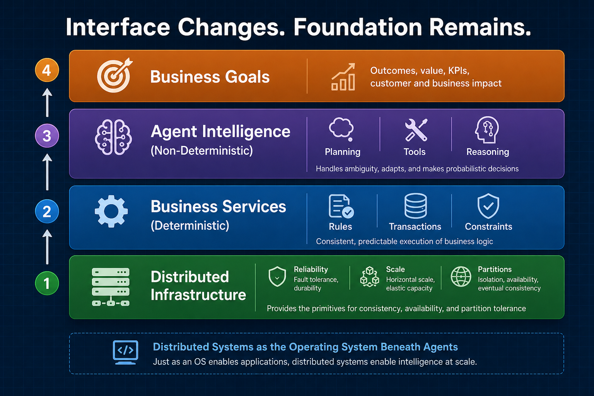
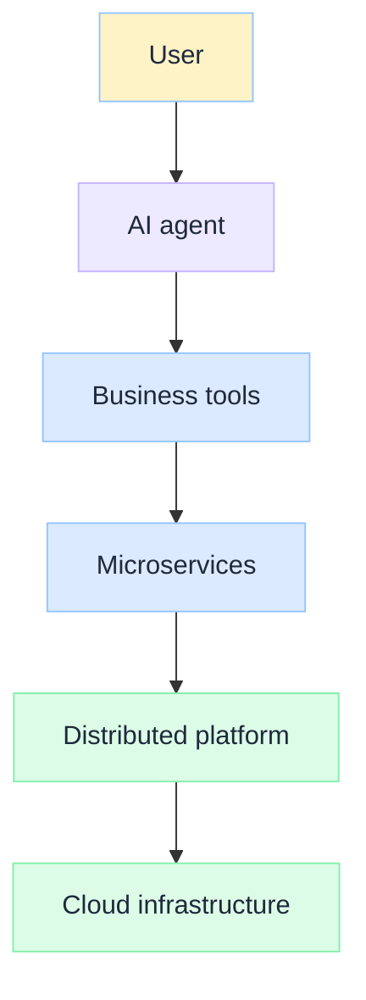
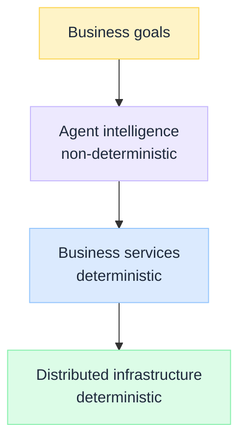
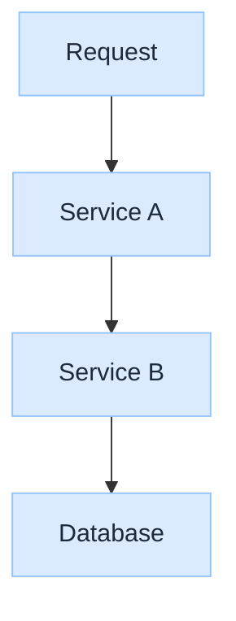
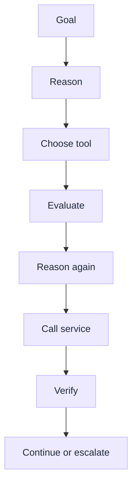

import Tabs from '@theme/Tabs';
import TabItem from '@theme/TabItem';

 

# The Death of Distributed Systems? Why Agentic AI Changes the Interface, Not the Foundation

*Distributed systems are not disappearing. They are becoming the operating system beneath intelligent agents.*

Conference stages repeat two claims: **agents replace applications**, and **distributed systems become irrelevant**. Demos make both sound plausible. Production in a regulated enterprise tells a different story.

An agent that "increases a customer's credit limit" still invokes identity, fraud, risk, policy, workflow, notifications, and document services. The AI did not replace distributed systems. It **orchestrated** them.

:::tip[THE CLAIM]
**Agentic AI changes the interaction model, not the execution foundation.** Agents coordinate intelligence. Distributed systems coordinate machines. The more non-deterministic the reasoning layer becomes, the more deterministic the execution layer beneath it must be.
:::

<!-- truncate -->

## The bottom line first

- **Agents consume distributed systems; they do not replace them.** Identity, payments, risk, data, and workflow still live in governed services.
- **The layers stack.** Distributed systems answer reliability and consistency; agents answer planning and tool selection.
- **Agents increase path complexity:** dynamic tool chains make latency, retries, and partial failure harder, not easier.
- **Reason non-deterministically. Execute deterministically.** AI explores options; business services and platforms must run auditable, repeatable actions.
- **Distributed systems literacy is a core skill, not a legacy specialty.** Agentic paths multiply the failure modes great engineers already knew how to handle.

## Two layers, one stack

| | Traditional distributed systems ask | Agentic AI asks |
| --- | --- | --- |
| **Questions** | <ul><li>How do services communicate?</li><li>How do we scale, replicate, and recover?</li><li>How do we maintain consistency under partitions?</li></ul> | <ul><li>What should happen next?</li><li>Which tool or agent should act?</li><li>What business objective matters now?</li><li>Which information belongs in context?</li></ul> |

Agent questions do not solve partitions, consensus, or transactional integrity. They solve **reasoning** problems.

 

The agent is **another layer**. What fades is **hardcoded orchestration** (UI → logic → fixed service chains), not microservices. Vector stores, GPU clusters, gateways, and observability pipelines are all distributed systems. Nothing got simpler.

Dynamic paths (Tool A → Agent B → Human → Database → API) reintroduce cascading failure, retries, and compensation logic, often **harder** than fixed flows. [Policy-Governed Agent Runtime](/insights/policy-governed-agent-runtime) exists because proposal is not permission.

## Deterministic execution, non-deterministic reasoning

Enterprise software assumed: **same input, same output.** A $100 transfer follows a known workflow.

An agent asked to "reduce financial risk" has **no predefined path**. The goal may be fixed; the route is not. That is the architectural shift.

 

| Layer | Nature | Responsibility |
| --- | --- | --- |
| **Agent** | Non-deterministic | Decide what to do |
| **Business services** | Deterministic | Execute business rules |
| **Distributed systems** | Deterministic | Execute reliably at scale |

Complexity did not vanish. It **shifted**: architects still own latency, consistency, and partitions, and now also own unpredictable paths, context quality, and governance. Traditional systems asked *can this run?* Agentic systems ask *what is the best way to run it?*

## Runtime execution graphs

<Tabs groupId="execution-graph">
  <TabItem value="traditional" label="Traditional (build time)" default>

One fixed path, defined before deployment.

 

  </TabItem>
  <TabItem value="agentic" label="Agentic (runtime)">

The agent proposes edges at runtime, within policy bounds.

 

  </TabItem>
</Tabs>

Architecture must govern **which edges are allowed**, not assume one static graph.

:::important[ARCHITECTURE FIRST PRINCIPLE]
**Reason non-deterministically. Execute deterministically.**

The agent may choose **which** payment service to call. The service must process the transaction **exactly once**; the database must stay consistent. PGAR wires that split: LLM proposes, PEP enforces, PDP decides. [Retrieval is a governed action](/insights/retrieval-is-a-governed-action) applies the same pattern to context.
:::

## What architects need next

Platforms expose **capabilities for agents**: tool contracts, policy-aware APIs, business events, observability metadata. The distributed foundation becomes **more** important, not less.

| Distributed systems | Agent systems |
| --- | --- |
| Reliability, consistency, CAP | Planning, context, tool orchestration |
| Event-driven scale | Safety, eval, human-in-the-loop |

Cloud did not kill networking. Serverless did not kill distributed computing. **Agentic AI will not kill distributed systems.** It changes the surface; the kernel stays.

## Where I land

I am **more convinced than ever** that distributed systems thinking is one of the primary skills required to build great software, not less.

The hype cycle suggests otherwise. If the model can plan, wire services, and recover from errors in a demo, why study consensus, idempotency, or backpressure? Because the demo skipped the hard part. Production does not forgive it.

Every convincing agent story still depends on someone who understands:

| Skill | Why it matters more with agents |
| --- | --- |
| **Partial failure** | Step three of seven times out after step four already committed |
| **Idempotency** | The agent retries a payment tool call the model proposed twice |
| **Backpressure** | Ten parallel tool chains saturate a downstream API |
| **Consistency boundaries** | Fraud, risk, and ledger services disagree mid-workflow |
| **Traceability** | An examiner asks which service owned the side effect, not which prompt ran |

None of that is prompt engineering. It is distributed systems engineering, applied under unpredictable orchestration.

I have watched teams hire for "AI skills" and discover six months later that the bottleneck was never the model. It was sagas nobody designed, caches nobody invalidated, queues nobody drained, and retries that doubled spend without doubling success. The teams that ship governed agents are not the ones who prompt best. They are the ones who **already knew** how distributed systems fail, and built the agent layer assuming those failures are guaranteed.

:::important[MY POSITION]
Agentic AI did not retire distributed systems expertise. It **raised the bar**. The reasoning layer is new. The failure modes underneath are familiar. Shallow literacy in partitions, retries, and consistency shows up faster when paths are dynamic and autonomy widens the blast radius.
:::

## Questions to ask

1. Which actions stay **deterministic** no matter how the agent plans?
2. Where does **deterministic routing** run before the model loop (intent, policy, manifest)?
3. Can you **replay** a run from verdict and audit chains, not chat logs alone?

Distributed systems plus agentic AI is the future: intelligent at the edge of decision-making, certain at the point of execution. The engineers who thrive will not be the ones who treat distributed systems as yesterday's curriculum. They will be the ones who treat it as the skill that makes agentic software **survivable**.

:::info[Builds on]
[Policy-Governed Agent Runtime](/insights/policy-governed-agent-runtime) · [What Is an Intent Router](/insights/what-is-intent-router) · [How LLM Works Under the Hood](/insights/how-llm-works-under-the-hood) · [Hallucinations Is a System Design Problem](/insights/hallucinations-is-a-system-design-problem-not-model-problem) · [Retrieval Is a Governed Action](/insights/retrieval-is-a-governed-action) · What Is the Agentic Loop (coming soon) · The First Principles of Technology (coming soon)
:::
