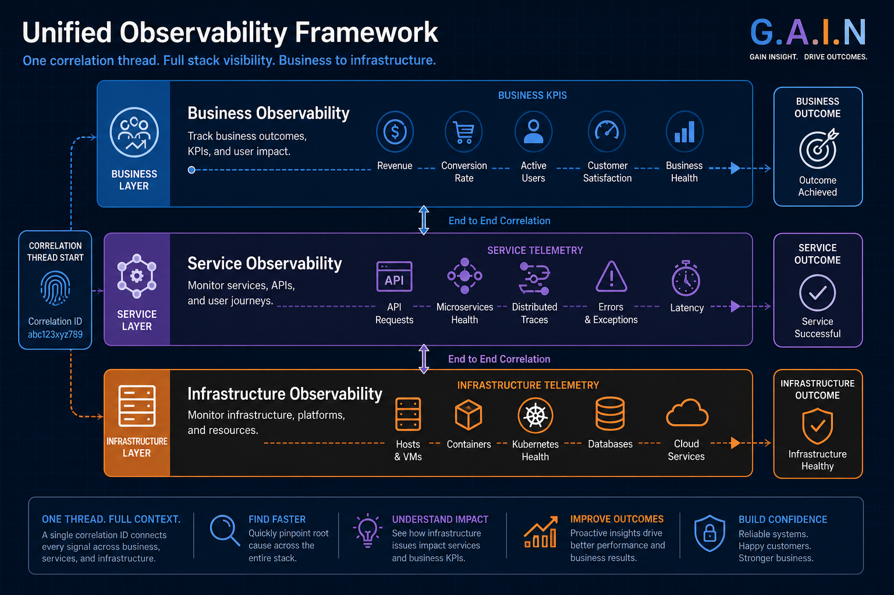
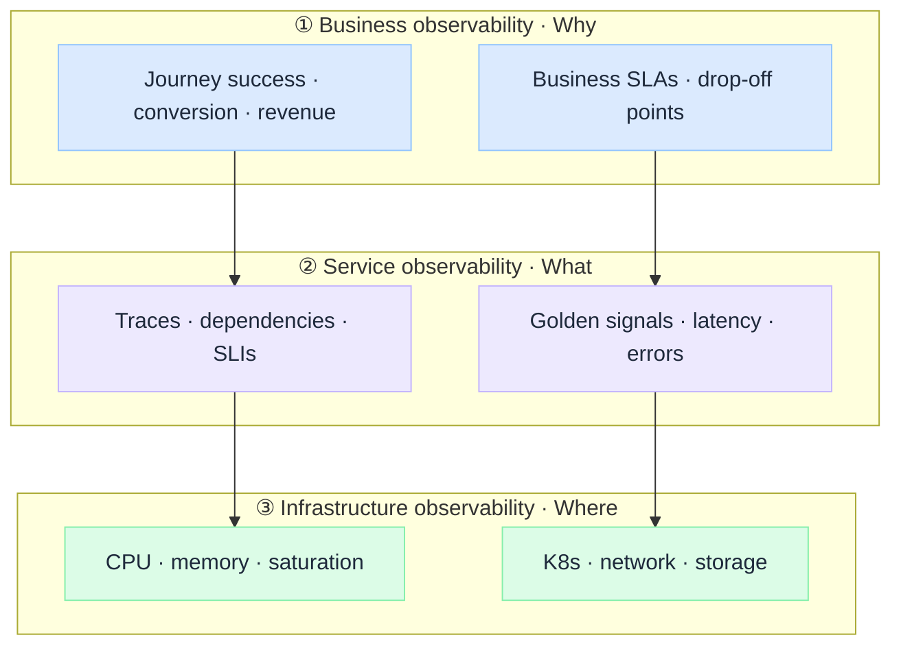

 

# Building a Unified Observability Framework

*Business, service, and infrastructure observability in modern enterprises.*

Infrastructure teams monitor servers. Platform teams monitor services. Product teams track business KPIs. When something breaks, leadership asks one question:

**"Why can't we connect what the business is seeing to what the system is doing?"**

That gap is not a tooling problem. It is a **modeling** problem. Dashboards multiply. Alerts fire. Root cause still takes hours of manual stitching across silos.

A unified observability framework is not more panels. It is **cause-and-effect understanding** across three connected layers, with one rule that governs every investment:

**Every business outcome must be traceable to system behaviour and infrastructure state.**

:::tip[THE CLAIM]
**Observability fails in silos.** Business analytics answers what happened without system context. Application monitoring answers where it failed without business impact. Infrastructure monitoring answers what is unhealthy without user or journey context. The fix is a **three-layer model** (business, service, infrastructure) joined by an observability graph, not another vendor.
:::

<!-- truncate -->

## The bottom line first

- **Three layers, one graph:** Business observability (why), service observability (what), infrastructure observability (where). Power comes from **correlation**, not from picking one layer.
- **Business impact is the ultimate truth.** Technical health without journey or revenue context produces over-alerting and misaligned priorities.
- **This is enterprise architecture, not a monitoring project.** Capability model, maturity, governance rules, and operating model matter as much as signal collection.
- **Regulated enterprises need replay, not screenshots.** Auditors and incident leads must follow the same narrative from KPI drop to service trace to infra saturation without manual log archaeology.
- **AI workloads sit inside the service layer.** Governed AI telemetry (capture, retention, audit) is the vertical deep dive inside horizontal observability.
- **Implementation is a blueprint + playbook series**, not a single tool rollout.

## The core problem: fragmented observability

Most enterprises evolve observability in silos:

| Layer | Built for | Question answered | Limitation |
| --- | --- | --- | --- |
| **Business analytics** | Reporting | What happened? | No system context |
| **Application monitoring** | Debugging | Where did it fail? | No business impact |
| **Infrastructure monitoring** | Uptime | What is unhealthy? | No service or user context |

When incidents land, teams reconstruct the story under pressure. That produces slow root cause analysis, tech and business priorities that never align, alerts that lack business relevance, and operations that stay reactive instead of predictive.

The solution is a **unified observability model**, then tools that serve it.

## Three layers on one page

 

### ① Business observability (the why)

Focus on **outcomes**, not servers.

| Signal type | Examples |
| --- | --- |
| Journey health | Conversion per workflow, transaction success rate, customer drop-off |
| Value | Revenue per workflow, SLA breach from a business view |
| Experience | Task completion, abandonment, time-to-outcome |

Instead of "API latency is high," ask: **"Did payment success rate drop for checkout users?"** That shifts observability from engineering-centric to value-centric.

### ② Service observability (the what)

Captures **system behaviour** across applications and services.

| Signal type | Examples |
| --- | --- |
| Golden signals | Latency, traffic, errors, saturation |
| Causality | Distributed traces, dependency graphs, API-level SLIs/SLOs |

A spike in payment failures might trace to checkout latency, a fraud-service timeout, and retry storms. Service observability is mechanism-level truth.

### ③ Infrastructure observability (the where)

Monitors the **compute and runtime** layer.

| Signal type | Examples |
| --- | --- |
| Resource stress | CPU, memory, node saturation |
| Platform | Pod restarts, network latency, storage I/O |

Service latency might trace to CPU throttling, memory pressure in a cluster, or database connection pool exhaustion. Infrastructure observability is physical truth.

:::note[WHERE AI FITS]
**Governed AI observability** (prompt lineage, tool spans, audit replay, drift) lives at the **service layer** for agent and RAG workloads. See [AI Observability in Enterprise](/insights/ai-observability-in-enterprise) and [G.A.I.N Observability](/frameworks/gain-observability). The unified framework is the horizontal wrapper; AI content is the vertical depth.
:::

## First principles (what endures)

Three principles outlive any vendor:

1. **Systems must be explainable.** Every material state change is traceable through signals.
2. **Signals must be connected.** Metrics, logs, traces, and business events form one graph, not three portals.
3. **Business impact is the ultimate truth.** Technical green without customer or revenue context is incomplete.

These map to the [first-principles hierarchy](/insights/first-principles-of-technology): business observability traces **upward** to strategy; capability standards and operating model sit at **enterprise architecture**; the observability graph and golden signals sit at **system architecture**.

## The observability graph (preview)

Correlation is the missing piece. The **observability graph** links:

**Business KPI → service transaction → infrastructure resource**

Example: payment success drops from 98% to 85%. Service layer shows payment API latency up and fraud-service timeouts. Infrastructure layer shows database CPU at 95% and connection pool exhaustion. One narrative, three layers, no manual stitching.

Full reference design: [Observability Blueprint](/blueprints/observability-blueprint). Implementation: [Observability playbooks](/playbooks/observability).

## Why regulated enterprises feel this first

In banking, insurance, and public sector, incidents are not only operational. They are **examinable**.

- **Prioritization:** Severity follows customer and regulatory impact, not loudest pager.
- **Replay:** The same trace chain supports SRE, product, and audit without re-running production.
- **Retention:** Business events, service traces, and infra metrics carry different retention and access rules (see AI observability insight for the five-signal pattern applied to governed workloads).
- **Ownership:** Every alert has an owner, a runbook, and a mapped business KPI or journey.

Generic APM does not deliver that. **Model + operating model** does.

## Questions to ask before the next tooling purchase

1. Can we trace a **business KPI drop** to a **service trace** and an **infra signal** in one path?
2. Does every critical journey have a **named owner** for business and service SLOs?
3. Do **correlation IDs** propagate from ingress through async and batch, not only happy-path HTTP?
4. Is there a **maturity target** (reactive → business-aware → predictive), not a boolean "we have Datadog"?
5. For AI workloads, does service observability include **policy, retrieval, and tool spans**, or only final model output?

If any answer is no, another dashboard will not fix it.

:::info[Builds on]
[G.A.I.N Observability](/frameworks/gain-observability) · [AI Observability in Enterprise](/insights/ai-observability-in-enterprise) · [Observability Blueprint](/blueprints/observability-blueprint) · [Observability playbooks](/playbooks/observability) · [The First Principles of Technology](/insights/first-principles-of-technology)
:::
