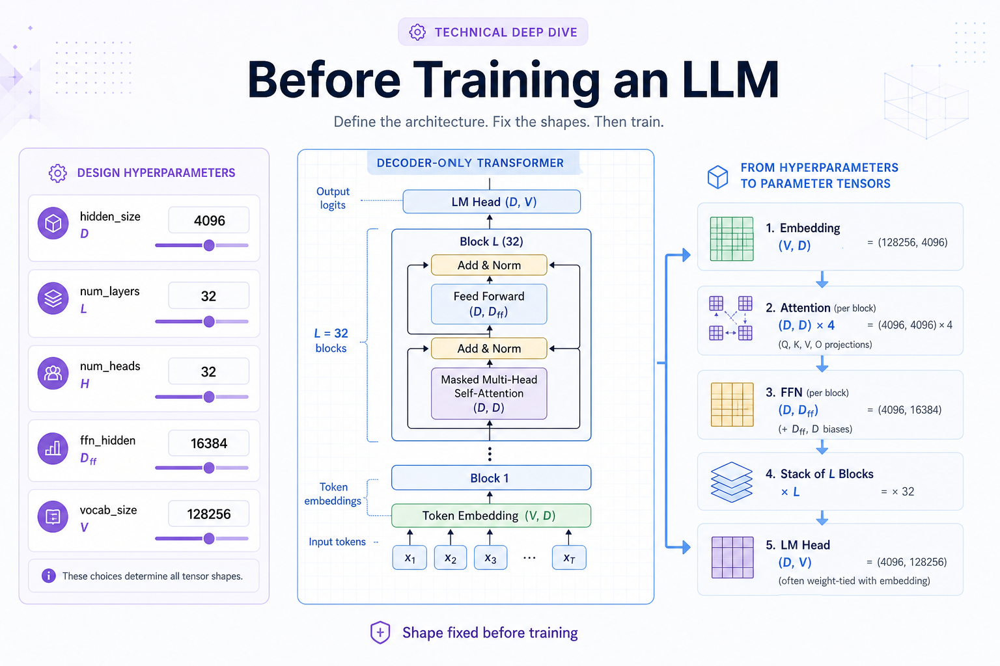
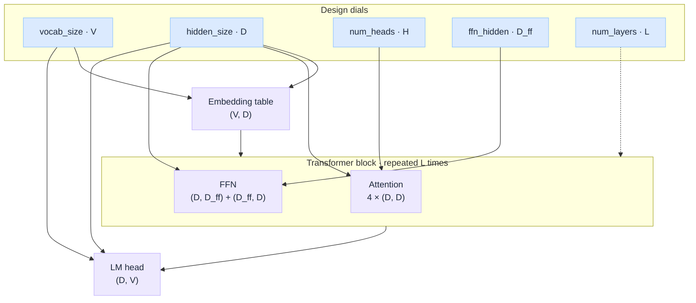
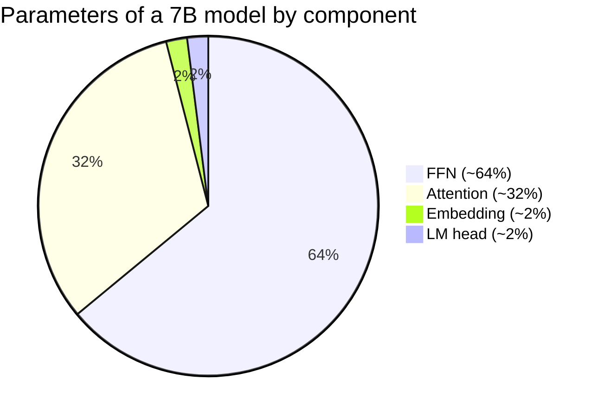

# The Blueprint Before Training

*Hyperparameters, vocabulary, and why a 7B model is 7B before day one.*

Two things have to be **finalised before the model ever sees a single training token**:

1. The **design hyperparameters**, the architectural shape of the network.
2. The **token vocabulary**, the dictionary that maps text into the integer ids the model will learn from.

Both are choices a human makes. Once chosen, they are baked into the model and almost never change for the life of that model.

This is a **deep dive into Stage 1** of [How LLM Works Under the Hood](/insights/how-llm-works-under-the-hood). Training fills in values; alignment shapes behavior; inference runs read-only. This page is everything that must be decided **before** any of that begins.

:::tip[THE CLAIM]
**A 7B model is 7B because of architectural dials, not because training grew it.** Parameter count, tensor shapes, and vocabulary are fully determined before the first forward pass. Training only changes *what values* the weights hold.
:::

<!-- truncate -->

## 1. Design hyperparameters (fixed at initialization)

These are the architectural dials. They are set **once**, before any weights are initialised, and they determine how big the model is and how many parameters it will have.

| Hyper parameter  | Mental model | What it does |
| --- | --- | --- |
| **`hidden_size` (D)**    e.g. 4096 | How much detail each token carries as it travels through the network, the resolution of an image, or the bandwidth of the bus carrying that token. | The width of every token's representation as it flows through the model. Sets the size of the embedding table `(V, D)`, every attention projection, every residual stream. Bigger D = more capacity per token, more compute per step. |
| **`num_layers` (L)**   e.g. 32| How many rounds of refinement each token goes through, like passing a draft through 32 editors, each allowed to rewrite based on what the previous one produced. | How many transformer blocks are stacked. Each block re-mixes information across tokens (attention) and re-transforms each token (FFN). More layers = deeper reasoning chains, more compute, more parameters. |
| **`num_heads` (H)**   e.g. 32| A panel of 32 specialists per layer, each scanning the sentence for a different kind of pattern (grammar, coreference, numbers, etc.) and contributing their finding to the next layer. | How many parallel attention heads per layer. Each head learns to focus on a different relational pattern. More heads = more diverse attention patterns at the same width. |
| **`head_dim` (D_h)**   e.g. 128   (derived: D / H)| The size of each specialist's notebook, how much detail one head can record about its specific pattern. Usually you don't pick this; it falls out of how you split D among H specialists. | The width of each individual attention head. Usually not set directly, it falls out of `hidden_size / num_heads`. Affects how expressive each head can be. |
| **`ffn_hidden` (D_ff)**   e.g. 16384 | The model's knowledge bank, a wide scratch space inside every block where most of "what the model knows" (facts, patterns, associations) is actually stored. Typically ~4× wider than D. | The intermediate width inside the feed-forward network of every block. Typically 4× `hidden_size` (or ~3.5× for SwiGLU). This is where most of the model's parameters live. |
| **`vocab_size` (V)**   e.g. 32,000 | The model's alphabet, every distinct piece of text it can read or write. | The number of distinct tokens. Sets the size of the embedding table and the output LM head. Larger V = finer tokenization, bigger embedding and head matrices. |
| **Model type**   e.g. decoder-only   transformer | How the model "thinks", a forward-only writer (GPT/Llama) vs a bidirectional reader (BERT). | The architecture family. Decoder-only is the modern standard for LLMs: GPT, Claude, Gemini, Llama. |
| **Positional encoding scheme**   e.g. RoPE, ALiBi,  learned absolute | The model's sense of word order, without it, a sentence is an unordered bag of words. | How the model knows token positions. **RoPE (rotary)** is the modern default; it generalizes better to long contexts than absolute learned positions. |

:::important[Parameter count is fixed before training]
The model's parameter count is fully determined by these hyperparameters, **before training starts**.

You can compute the total parameter count from `hidden_size`, `num_layers`, `num_heads`, `ffn_hidden`, and `vocab_size` alone. Training does not change *how many* parameters there are; it only changes *what values* they hold. A 7B model is 7B because of these dials, not because training "grew" it.
:::

## How these dials connect

Each dial below sets the **shape** of one or more parameter tensors. Count the elements in each tensor, multiply by `L` where blocks repeat, and sum, that is the model's total parameter count.

| Tensor | Shape | Sized by |
| --- | --- | --- |
| **Embedding table** | `(V, D)` | `vocab_size`, `hidden_size` |
| **Attention** (per layer) | `4 × (D, D)` | `hidden_size`, `num_heads` |
| **FFN** (per layer) | `(D, D_ff) + (D_ff, D)` | `hidden_size`, `ffn_hidden` |
| **LM head** | `(D, V)` | `hidden_size`, `vocab_size` |
| **Block stack** | above block repeated | `num_layers` |

## Worked example: parameter count of a 7B model

Typical 7B-class architecture (Llama-2 scale):

- **D** = 4096 (hidden size)
- **L** = 32 (layers)
- **H** = 32 (attention heads)
- **D_h** = 128 (head dim, derived: D / H)
- **D_ff** = 16384 (FFN intermediate)
- **V** = 32,000 (vocab size)

Walk every parameter tensor, one component at a time.

### 1. Embedding table

- **Shape:** `(V, D) = (32000, 4096)`
- **Params:** V × D = 32,000 × 4096 = **131 M**

### 2. Attention (per layer)

Each transformer block has 4 projection matrices: W_Q, W_K, W_V, W_O, each shape `(D, D)`.

- **Params per layer:** 4 × D² = 4 × 4096² = **67 M**
- **Across L = 32 layers:** 32 × 67 M ≈ **2.15 B**

### 3. Feed-forward network (per layer)

Vanilla 2-matrix FFN: expansion `(D, D_ff)` + compression `(D_ff, D)`.

- **Params per layer:** 2 × D × D_ff = 2 × 4096 × 16384 = **134 M**
- **Across 32 layers:** 32 × 134 M ≈ **4.29 B**

:::note[SwiGLU in production models]
Real models like Llama-2 use **SwiGLU**, which has 3 matrices instead of 2. Architects compensate by setting D_ff smaller (e.g. 11,008) so total FFN parameter count stays around 4.3 B.
:::

### 4. LayerNorm

Two LayerNorms per block (pre-attention and pre-FFN), each with scale γ and bias β of shape `(D,)`. Plus one final norm before the LM head.

- **Params per layer:** 4 × D = 16,384
- **Across 32 layers + final norm:** ≈ **0.53 M**, essentially negligible.

### 5. LM head (output projection)

- **Shape:** `(D, V) = (4096, 32000)`
- **Params:** D × V = **131 M**

If the model uses **tied embeddings**, the LM head shares weights with the embedding table, saving 131 M parameters.

### Total parameter breakdown

| Component | Params | Share |
| --- | --- | --- |
| **Embedding** | 131 M | ~2 % |
| **Attention (32 layers)** | 2,147 M | ~32 % |
| **FFN (32 layers)** | 4,295 M | ~64 % |
| **LayerNorm** | 0.5 M | ~0 % |
| **LM head** | 131 M | ~2 % |
| **Total** | **~6.7 B** | **100 %** |

That's the famed "7B" model. Production 7B models like Llama-2 7B land at ~6.74 B for almost identical reasons.

:::tip[Where the parameters live]
**FFN dominates (~64 %).** That is why architects scale FFN width to add capacity and why Mixture-of-Experts (MoE) models scale the FFN specifically. Attention is significant (~32 %) but often smaller than people assume. Embedding and LM head combined are only ~4 %. LayerNorm is a rounding error.
:::

## The context window: how much the model can see at once

The **context window** is the maximum number of tokens the model can attend to in a single forward pass. It is not a single dial you turn. It emerges from three choices made **before and during** training:

| Factor | Role in setting the window | Hard cap or soft frontier? |
| --- | --- | --- |
| **Positional encoding scheme** | Decides *whether* longer positions are even representable | **The gatekeeper** |
| **Training sequence length** | The length the model actually gets *good* at | **Soft**, quality degrades past it |
| **Attention cost + KV-cache memory** | The compute/memory you can afford to serve | **The real-world ceiling** |

The context window is a **budgeted design choice**, not a free dial. RoPE/ALiBi set the gatekeeper; training length sets the soft frontier; PI / NTK / YaRN and similar techniques extend RoPE at inference; but O(T²) attention cost and KV-cache memory set what you can actually serve.

Recent LLMs (Llama 3/4, Qwen, DeepSeek, Gemma, GPT, Gemini, Claude) reach 128K-10M tokens by combining these methods, not by flipping one hyperparameter.

## 2. Create the token vocabulary

Models do not read text. They read **integers**. Before training, a tokenizer maps those integers to a **token vocabulary**, the alphabet the model will speak in for its entire life.

### Steps

1. **Prepare a training text corpus**, a large, representative sample: web, books, code, multilingual data.
2. **Choose a target vocabulary size**, a human decision balancing coverage vs cost. Typical values: 32k (Llama 2), 50k (GPT-2), 128k (Llama 3), 256k (Gemini).
3. **Scan the dataset for frequent patterns**, BPE (Byte Pair Encoding), WordPiece, or Unigram iteratively merge subword pieces until the target size is reached. This is corpus statistics, not neural learning.
4. **Finalize the vocabulary**, freeze files like `vocab.json`, `merges.txt`, or `tokenizer.model`. The tokenizer is now a fixed artefact.

### Why this matters

:::important[The vocabulary is fixed before training]
You decide the target vocabulary size. The model does **not** discover `vocab_size` during training.

By the time training starts, the embedding table shape `(V, D)` and the LM head shape `(D, V)` are already fixed because V is known and frozen. Changing the vocabulary after the fact requires resizing the embedding table and effectively re-training the model.
:::

## Summary

Before a single gradient is computed, the model is fully described by:

- **The shape** of every weight tensor, set by design hyperparameters.
- **The alphabet** the model will speak in, set by the tokenizer.

Pre-training fills in the values. Alignment shapes behavior. Inference navigates a frozen geometry. But the shapes and alphabet stay frozen for the life of that model.

:::tip[TAKEAWAY]
**Shape + vocabulary are fixed first.** Training only fills the values. A 7B model is 7B because of dials you set on day zero, and most of those parameters live in the FFN, not attention.

Continue the lifecycle: [How LLM Works Under the Hood](/insights/how-llm-works-under-the-hood) (Stages 2-4: training, alignment, inference).
:::
