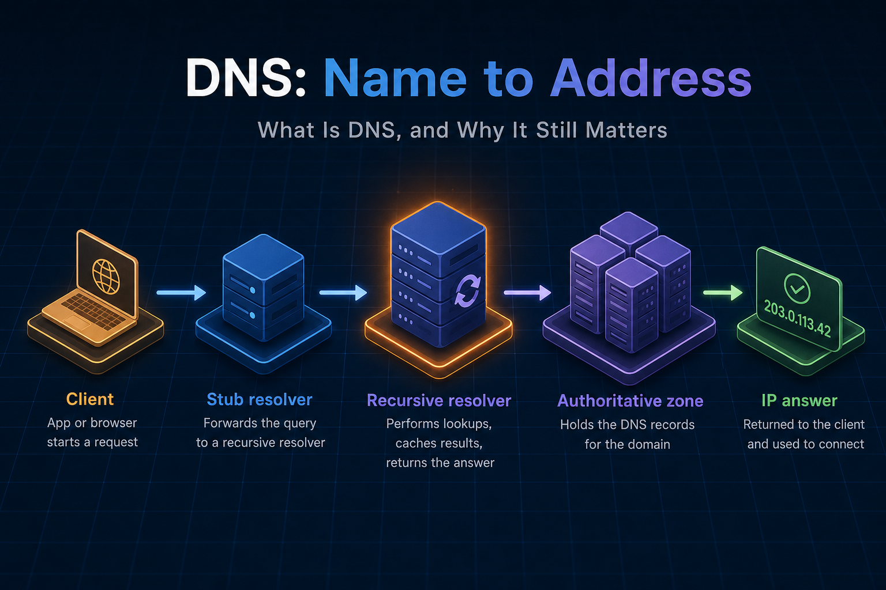
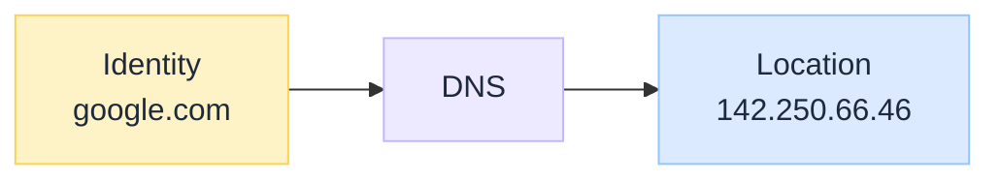
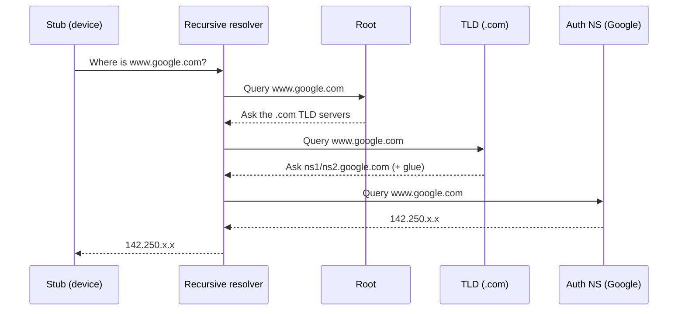
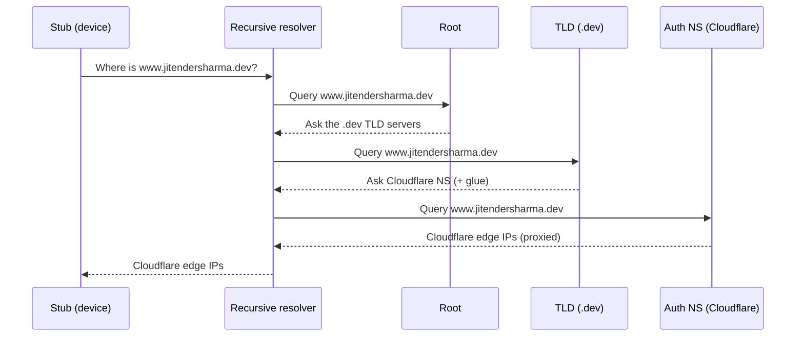
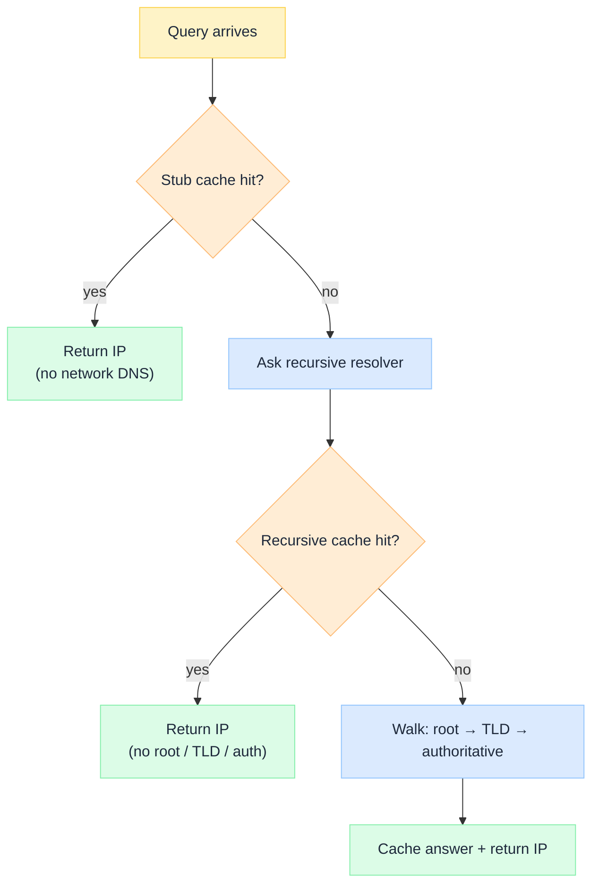

import Tabs from '@theme/Tabs';
import TabItem from '@theme/TabItem';

 

# DNS Under the Hood

*Every time you open a website, send an email, or call an API, one of the oldest distributed systems on the Internet quietly does its job in a few milliseconds.*

Most engineers know DNS as the service that converts a domain name into an IP address: `google.com` → `142.250.66.46`. That explanation is correct. It barely scratches the surface.

DNS is not a lookup table. It is a globally distributed, fault-tolerant, hierarchical, eventually consistent database that handles hundreds of billions of queries every day while remaining one of the fastest systems on the Internet.

This is an **explainer** in the **Under the Hood** series: how a lookup works (stub → recursive resolver → root → TLD → authoritative name server), why it scales, and which design principles modern cloud platforms still borrow from it.

:::tip[THE CLAIM]
**DNS is one of the largest distributed systems ever built, and it is still on every critical path.** It separates identity from location through hierarchical delegation, aggressive multi-layer caching, stateless queries, geographic anycast, and eventual consistency. Cloud and Kubernetes platforms did not replace those ideas. They reused them.
:::

<!-- truncate -->

## The bottom line first

- **DNS maps names to data** (addresses, aliases, mail, services), not one giant phone book table.
- **One lookup path:** stub (device) → recursive resolver → root name server → TLD name server → authoritative name server → IP.
- **Scale comes from delegation:** each name server knows only enough to point to the next owner.
- **Caching at many layers** turns millions of user lookups into a handful of authoritative queries.
- **TTL is an architecture contract** between accuracy and performance.
- **UDP, anycast, and eventual consistency** keep DNS fast and available; DNSSEC, DoH, and DoT harden it without changing the hierarchy.

## What DNS actually is

Without DNS, clients would hardcode location (`https://142.250.66.46`). Change a server and millions of clients break. DNS separates **identity** from **location**: applications know the name; DNS knows where it points. That is the same abstraction behind Kubernetes, Consul, and AWS Cloud Map.

 

DNS is not one database. The namespace is a **tree of zones**: root → TLD (`.com`, `.dev`) → organisation → host → record. Nobody owns the whole Internet. Partitioned ownership is why it scales.

### Components involved

Every public lookup follows the same path:

1. Device checks local cache; if missing, asks a **recursive resolver**.
2. Recursive resolver asks a **root name server** → pointed at the right **TLD name server** (`.com`, `.org`, `.au`).
3. Recursive resolver asks the **TLD name server** → pointed at the domain's **authoritative name server**.
4. Recursive resolver asks that **authoritative name server** → gets the IP → returns it to the device.

The stub (your phone, laptop, VM) asks one question: "what is the IP for this name?" It does **not** know how to chase root → TLD → authoritative. The **recursive resolver** is the workhorse that does that chase and returns a final answer. Your device talks to **one** recursive resolver (handed out by DHCP/Wi-Fi, or set manually). That operator varies; the role does not.

| Recursive resolver | Typical address | Who runs it |
| --- | --- | --- |
| **ISP / home router** | DHCP default (often via `192.168.1.1`, then upstream ISP DNS) | Your router or internet provider |
| **Cloudflare Public DNS** | `1.1.1.1` | Cloudflare (as a *resolver*, not as your domain host) |
| **Google Public DNS** | `8.8.8.8` | Google (as a *resolver*, not as `google.com`'s authoritative DNS) |
| **Enterprise / cloud** | Corporate DNS, VPC DNS, CoreDNS | Your org or cluster |

Same job in every row: find the answer (cache first, else walk the hierarchy). Different operators mean different privacy, filtering, latency, and geography.

Roles and ownership (the diagram for *who talks to whom* is in the next section):

| Step | Component | What it does | Where it lives |
| --- | --- | --- | --- |
| ① | **Stub resolver** | Checks local cache; if missing, asks the recursive resolver for a final IP. Does not walk the tree itself. | Your laptop, phone, VM, or container (OS / browser) |
| ② | **Recursive resolver** | Finds the answer: cache first, then root → TLD → authoritative. Returns the IP and caches it. | ISP DNS, corporate DNS, `1.1.1.1`, `8.8.8.8`, VPC DNS, CoreDNS |
| ③ | **Root name server** | Index of **all** TLDs (`.com`, `.dev`, `.org`, `.au`, …). Returns only “ask these TLD name servers.” Never knows `www…` or any website IP. | Public root operators (ICANN / root server system). You do not run these. |
| ④ | **TLD name server** | Manages an extension (`.com`, `.org`, `.au`, `.dev`). Points to the domain's authoritative name servers (plus glue IPs). | TLD registries (e.g. Verisign for `.com`). You do not run these for public TLDs. |
| ⑤ | **Authoritative name server** | Holds the definitive records for the zone. This is what people usually mean by **name server** (`ns1…`). | **Domain owner** (or their DNS host). For `google.com`, Google runs `ns1.google.com` / `ns2…`. You (or Cloudflare / Route 53 / …) run yours. |

**Zone + records** are not a sixth network hop. They are the **data** stored on the authoritative name server (A/AAAA, CNAME, MX, TXT, NS).

:::note[RECURSIVE RESOLVER ≠ NAME SERVER]
- **Recursive resolver** = hunter on *your* path that *finds* the answer (`8.8.8.8`, ISP DNS, `1.1.1.1`). Not the website's DNS.
- **Authoritative name server** = owned/run for that domain. For `www.google.com`, that is **Google's** name servers (`ns1.google.com`, …). Your stub never talks to them; your recursive resolver does (on a cache miss).
- **Root** and **TLD** are also name servers, but they only **refer** ("ask someone else"). The final website IP comes from the domain's authoritative name server.
- **Cloudflare dual role:** `1.1.1.1` is recursive. Cloudflare as *your* domain's DNS host is authoritative for *your* zone. Same company, different job.
:::

If the recursive resolver already has `www.google.com` cached, root → TLD → authoritative are skipped until the TTL expires. The device then connects using the IP. `8.8.8.8` resolving Google is not special: it is the resolver chasing Google's authoritative servers like any other domain.

## Delegation: the secret behind scalability

Would one server store hundreds of millions of domains? No. The **recursive resolver** gets **referrals** from root and TLD name servers, then the final answer from the domain's **authoritative name server**. Same chain for a hyperscaler domain or a personal `.dev` site.

<Tabs groupId="dns-delegation">
  <TabItem value="google" label="www.google.com" default>

*"Where is www.google.com?"* Root, TLD, and Google's NS never talk to each other. The **recursive resolver** queries each lane and stitches the answer.

 

| Hop | Component | What it returns |
| --- | --- | --- |
| ② | **Recursive resolver** | Starts the chase (after stub cache miss); runs every outbound query |
| ③ | **Root name server** | "Ask the `.com` TLD name servers" |
| ④ | **TLD name server** (`.com`) | Google's authoritative NS names (`ns1.google.com`, `ns2.google.com`) plus **glue** (their IPs) |
| ⑤ | **Authoritative name server** (**run by Google**) | `www.google.com` → `142.250.x.x` |

  </TabItem>
  <TabItem value="jitender" label="www.jitendersharma.dev">

*"Where is www.jitendersharma.dev?"* Same lanes. Different TLD (`.dev`) and **Cloudflare** as the authoritative name server.

 

| Hop | Component | What it returns |
| --- | --- | --- |
| ② | **Recursive resolver** | Starts the chase (after stub cache miss); runs every outbound query |
| ③ | **Root name server** | "Ask the `.dev` TLD name servers" |
| ④ | **TLD name server** (`.dev`) | Cloudflare NS names + glue |
| ⑤ | **Authoritative name server** (**Cloudflare**) | Proxied answer → Cloudflare edge IPs (origin behind the proxy is GitHub Pages) |

  </TabItem>
</Tabs>

Each name server knows only enough to point to the next. That is **delegation**. Glue records break the chicken-and-egg problem: the recursive resolver cannot reach `ns1…` without already knowing its IP.

No single machine needs the entire namespace. Storage and operational complexity stay local to each zone owner.

:::tip[TAKEAWAY]
**Delegate ownership; do not centralise the catalogue.** Hierarchical pointers beat one global table when the namespace is planetary.
:::

## How a lookup works

Enter `https://www.amazon.com`. The stub checks **browser / OS cache**. On a miss it asks the **recursive resolver**. That resolver either answers from **its** cache or walks root → TLD → authoritative (see the swimlane above).

 

After the first success, later lookups often never leave the ISP or VPC recursive resolver: a million users can collapse into a handful of queries to the authoritative name server.

Every record carries a **TTL**. Long TTL: fewer queries, slower cutovers. Short TTL: faster failover, more load on the authoritative name server. Match TTL to release policy; it is a product contract, not a random number.

**Recursive vs iterative:** the stub asks the recursive resolver recursively ("find the answer"). The recursive resolver queries root, TLD, and authoritative name servers **iteratively**. Hot-path DNS uses **UDP/53** for one RTT; TCP is for large answers (DNSSEC, zone transfers).

## Speed, consistency, and trust

**Anycast** makes public **recursive resolvers** like `1.1.1.1` and `8.8.8.8` appear as one IP while many PoPs advertise it. BGP sends each client to a nearby healthy instance: lower latency and automatic failover without changing stub config.

DNS is **eventually consistent**. After a change on the **authoritative name server**, recursive resolvers refresh when TTL expires. Different users can briefly see different answers. That trades immediate global consistency for availability and scale.

Classic DNS assumed a trusting network (poisoning, spoofing, amplification). **DNSSEC** adds signatures so recursive resolvers can verify records; **DoH** and **DoT** encrypt queries from stub to recursive. The hierarchy (root → TLD → authoritative) stays; integrity and privacy improve.

## Why it still matters

Cloud and mesh layers multiply names. They do not remove DNS.

| Surface | Why DNS stays critical |
| --- | --- |
| Hybrid / split-horizon | Same name, different answers from different recursive / authoritative views |
| Failover and cutover | Health checks and TTL on the authoritative name server drive how fast traffic moves |
| TLS | Certificate SANs must match names the stub resolves |
| Microservices / APIs | Hostnames before URLs; resolution failures look like "the app is down" |
| Observability | NXDOMAIN vs SERVFAIL vs wrong answer on the recursive path explain mystery latency |

Principles you reuse elsewhere: partition ownership across zones, delegate through root / TLD / authoritative boundaries, cache at stub and recursive layers, keep requests stateless, route to the nearest healthy endpoint (anycast), accept TTL-bounded staleness, keep identity separate from location. Put DNS on the request path in your observability model the same way you treat load balancers and gateways.

Ask before you ignore DNS: who runs each **authoritative name server**, which names are public vs private, what the **TTL** policy is, where **recursive resolvers** run, and whether incident playbooks distinguish miss, failure, and wrong answer. If you cannot answer, DNS is unowned.

## Final takeaway

DNS is often called "the Internet's phone book." Useful for beginners. Incomplete for architects.

A lookup is always the same chain: **stub → recursive resolver → root name server → TLD name server → authoritative name server → IP**. On top of that sit caching, TTL, anycast, and delegation. Treat DNS as a **control plane for names**. Design zones, recursive resolvers, and TTL with the same seriousness you give service boundaries. Cloud platforms still depend on it.

:::info[Builds on]
Under the Hood series: CDN Under the Hood (coming soon) · The First Principles of Technology (coming soon)
:::
