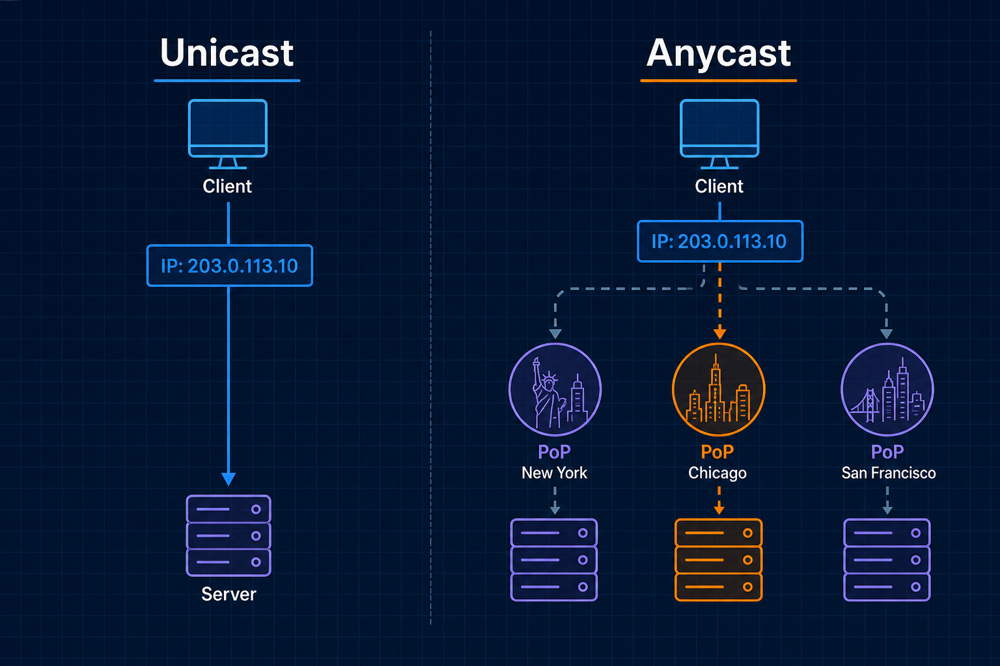
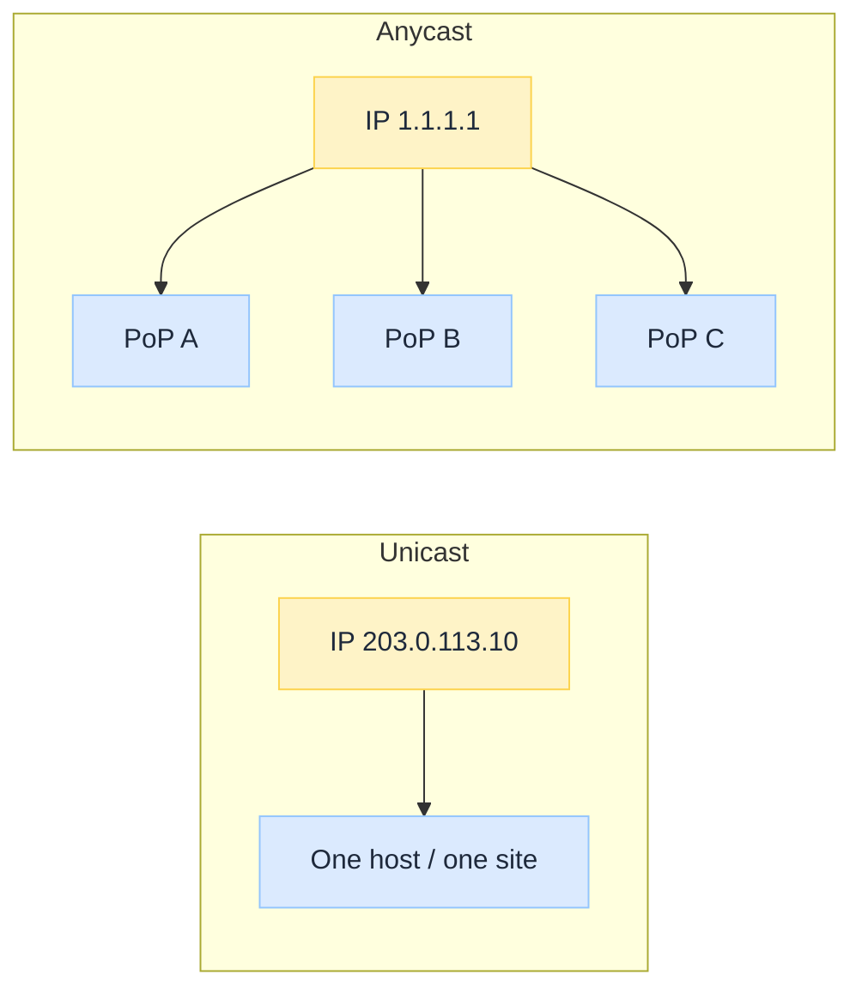
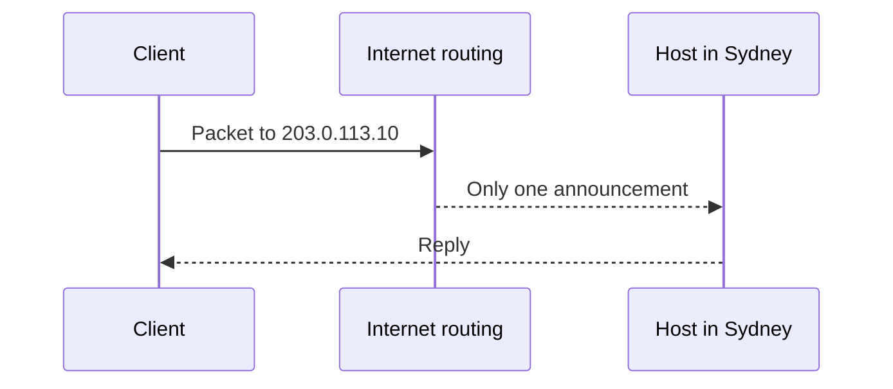
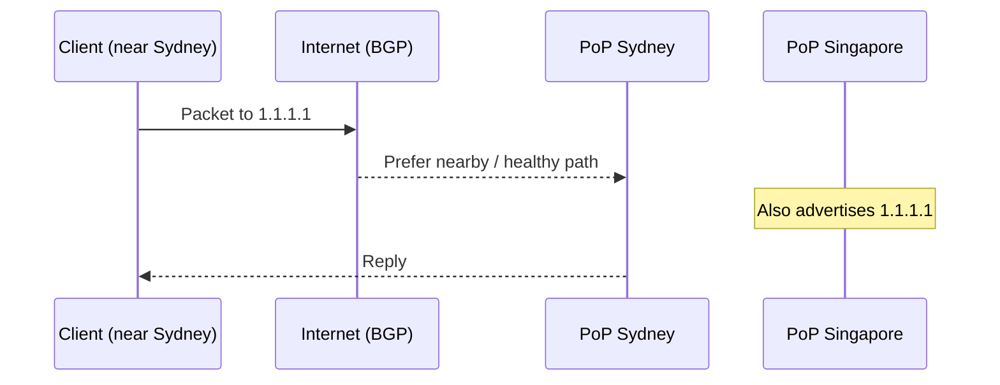

import Tabs from '@theme/Tabs';
import TabItem from '@theme/TabItem';

 

# Anycast vs Unicast Under the Hood

*You configure `1.1.1.1` or a CDN hostname once. The Internet quietly decides which city answers.*

Most engineers treat an IP as a single machine. For classic apps that is often true (**unicast**). For public DNS resolvers and many CDN edges it is not: the same IP is alive in many places at once (**anycast**).

Mixing the two up produces the wrong incident story: "the app is slow in Sydney," "failover did not flip," or "traceroute shows a random PoP" when routing, not application code, chose the destination.

:::tip[THE CLAIM]
**Unicast is one IP → one place. Anycast is one IP → many places, with BGP (or equivalent) picking the path.** Same address on the stub or DNS answer; different number of hosts advertising it. Cloud edges did not invent this. They productised it.
:::

<!-- truncate -->

## The bottom line first

- **Unicast:** one destination IP maps to one host (or one VIP in one site).
- **Anycast:** one destination IP is advertised from many PoPs; the network picks a nearby healthy path.
- **Clients do not choose the city.** They dial the IP; routing (or geo-DNS) does the rest.
- **Failover looks different:** unicast needs DNS/LB cutover; anycast often withdraws a route and traffic shifts without changing the IP.
- **DNS and CDNs** rely on anycast (or geo-DNS) so `8.8.8.8` / edge hostnames stay simple.
- **Observability:** the IP alone does not name the box. You need PoP, ASN, or provider edge metadata.

## What unicast and anycast actually are

Both are ways an IP address is **reached**. Neither is a layer-7 protocol. HTTP, DNS, and TLS ride on top unchanged.

 

| | **Unicast** | **Anycast** |
| --- | --- | --- |
| **Identity** | One IP → one place | One IP → many places |
| **Who picks the destination** | Routing toward that one announcement | Routing among many announcements of the same IP |
| **Typical feel** | Origin server, regional LB VIP | Public DNS (`8.8.8.8`), CDN edge IP |
| **Client config on failover** | Often a new IP (DNS/LB change) | Same IP; routes move |

### Components involved

| Piece | Role |
| --- | --- |
| **Destination IP** | What the client (or next hop) targets |
| **Route advertisement** | BGP (or IGP inside a provider) saying "I can reach this IP" |
| **PoP / instance** | The machine or cluster that serves traffic for that IP |
| **Path selection** | Routers prefer a "better" path (AS path, locality, health) |
| **Health / withdrawal** | Sick PoP stops advertising; traffic flows elsewhere |

:::note[ANYCAST ≠ LOAD BALANCER VIP (ALWAYS)]
A classic LB VIP is often **unicast in one site**: many backends, **one location** from the Internet's point of view. Anycast spreads the *same* IP across **many locations**. Both balance load; the scope differs.
:::

## How a packet gets there

<Tabs groupId="cast-path">
  <TabItem value="unicast" label="Unicast" default>

Client has `203.0.113.10`. Only your Sydney site announces it.

 

If Sydney dies and nothing else advertises that IP, the address goes dark until DNS or automation points clients somewhere else.

  </TabItem>
  <TabItem value="anycast" label="Anycast">

Client has `1.1.1.1`. Sydney, Singapore, and Frankfurt all advertise it.

 

If Sydney withdraws the route, BGP converges toward another PoP. The stub still uses `1.1.1.1`. No DNS change required for that shift.

  </TabItem>
</Tabs>

:::tip[TAKEAWAY]
**Same dialled IP. Different number of speakers on the Internet.** Count advertisements before you count application instances.
:::

## Where you already use both

| Surface | Usually | Why |
| --- | --- | --- |
| **Origin / API in one region** | Unicast (or regional VIP) | One deployment boundary you own |
| **Public recursive DNS** (`1.1.1.1`, `8.8.8.8`) | Anycast | One address in every stub config; many PoPs |
| **CDN edge IP** | Anycast (or geo-DNS to regional unicast) | Hostname stays stable; edge stays near the user |
| **Geo-DNS** | DNS returns *different* unicast IPs by location | Steering happens at **lookup** time, not only at **forward** time |

DNS Under the Hood (coming soon) covers the resolver chain. CDN Under the Hood (coming soon) covers the edge after you have an IP. This page is the cast model those systems sit on.

**Anycast vs geo-DNS (keep them straight):**

- **Anycast:** DNS may return the **same** A/AAAA everywhere; BGP picks the PoP after connect.
- **Geo / latency DNS:** DNS returns **different** A/AAAA per resolver location; unicast (often) after that.

Providers mix both. Your mental model should still separate "answer changed" from "path changed."

## Speed, failover, and failure modes

**Latency:** anycast aims traffic at a nearby announcement. Unicast to a far origin pays WAN RTT every time.

**Failover:** withdrawing an anycast route can move users without changing stub or DNS config. Unicast failover usually needs a second IP, DNS TTL wait, or LB health logic in one place.

**Debugging:** traceroute and TCP sessions land on *a* PoP, not "the" IP as a single box. Ask the provider which colo answered. Do not assume one shared process space across cities.

**Oddities to expect:**

| Symptom | Unicast reading | Anycast reading |
| --- | --- | --- |
| User A and B see different behaviour on "the same IP" | Misconfig / cache | Different PoPs or cold cache per edge |
| Failover "did nothing" | Health check / DNS TTL | Route not withdrawn; sticky path; resolver still on old geo answer |
| Mystery latency | App or DB | Wrong (far) PoP or path flap between PoPs |

State is the hard part: anycast loves **stateless** or **local-state** services (DNS, CDN cache, TLS terminate). Sticky sessions across continents need care (or avoidance).

## Why it still matters

Platforms put more shared front doors on anycast: DNS, CDN, global API gateways. Your origin stays mostly unicast. Incidents span both.

| Surface | Why cast type matters |
| --- | --- |
| **SLO / latency** | Regional pain can be routing to a distant PoP, not code |
| **Failover drills** | Confirm route withdrawal vs DNS cutover |
| **Observability** | Tag PoP / edge ID; IP alone is not the instance |
| **Security / compliance** | Traffic may enter in another country than you assumed |
| **Change control** | DNS TTL, anycast health, and LB VIP are different levers |

Ask before you blame the app: is this IP unicast or anycast? How many places advertise it? What fails over the IP vs changes the DNS answer? If you cannot answer, the front door is unowned.

## Final takeaway

"One IP, one server" is a beginner default. Architects need the cast model.

**Unicast** pins a destination to one place. **Anycast** shares a destination identity across many places and lets the network pick. DNS resolvers and CDN edges use that so configuration stays simple while capacity stays global. Treat cast type as part of the **control plane for reachability**, same seriousness you give DNS names and CDN cache keys.
