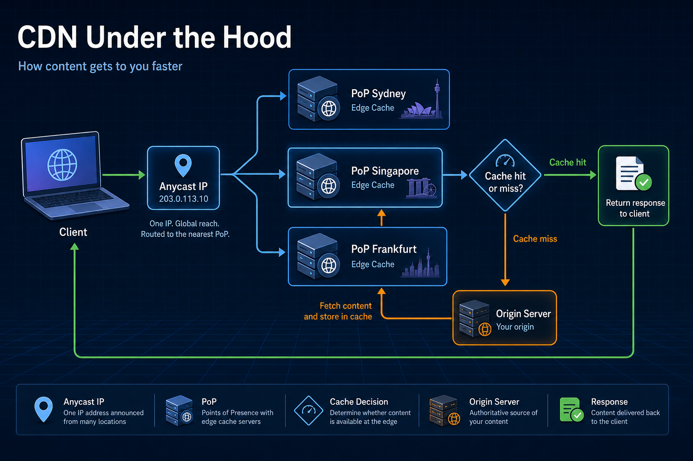
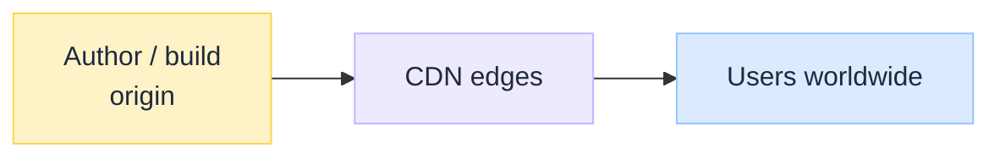
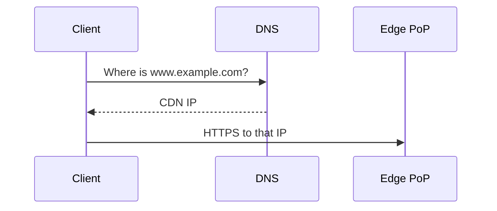
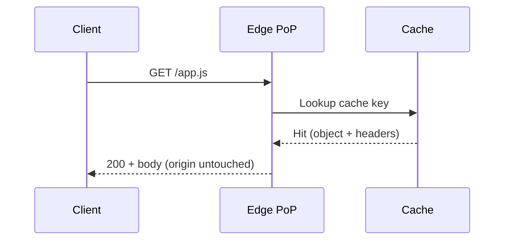
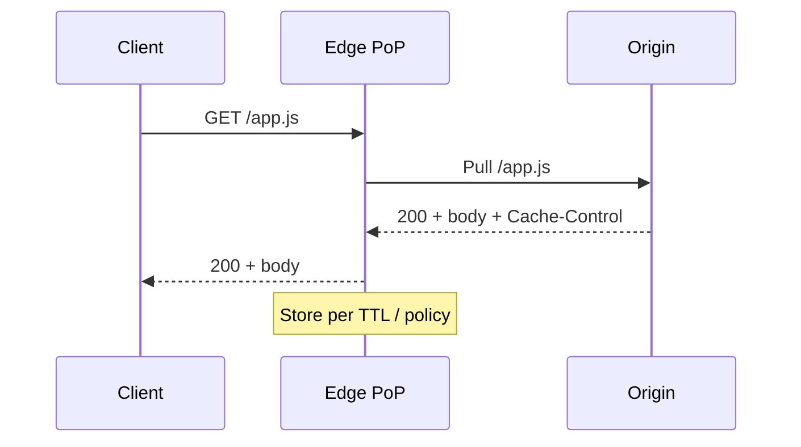
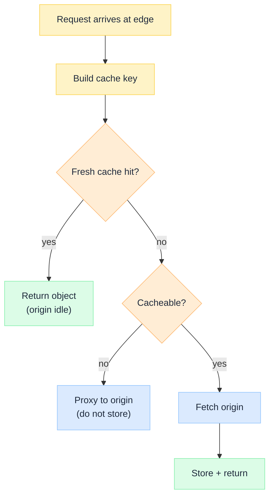

import Tabs from '@theme/Tabs';
import TabItem from '@theme/TabItem';

 

# CDN Under the Hood

*Every time you open a site, stream an image, or load a SPA shell, an edge PoP often answers before your origin ever sees the request.*

Most engineers know a CDN as "a cache that makes websites faster." That explanation is correct. It barely scratches the surface.

A CDN is not a bucket of files closer to users. It is a globally distributed cache-and-route fabric: many PoPs, one anycast or geo-mapped front door, aggressive multi-layer caching, TTL contracts, and eventual consistency across edges. Origin stays off the hot path until something misses.

:::tip[THE CLAIM]
**A CDN is a control plane for delivery, not "fast storage."** It keeps origin capacity off the critical path through geographic PoPs, cache keys, TTL-bounded staleness, and anycast (or equivalent) steering to a nearby healthy edge. Cloud front doors and API gateways reuse the same ideas.
:::

<!-- truncate -->

## The bottom line first

- **A CDN maps a request to a cached (or origin-fetched) response** near the client, not one giant origin farm for every byte.
- **One request path:** client → **DNS to CDN IP** → edge PoP → cache hit **or** pull from origin → store + return.
- **Scale comes from geography + caching:** millions of users collapse into shared edge objects; origin only pays for misses and uncacheable traffic.
- **The cache key is an architecture contract** (URL, query, headers, cookies): get it wrong and you leak private responses or hammer origin.
- **TTL and purge policy** trade freshness for hit ratio; treat them like release policy, not defaults.
- **Anycast, TLS termination, and WAF** often sit on the same edge box; the core CDN claim remains: hit/miss routing and cache coherence.

## What a CDN actually is

Without a CDN, every browser hits your origin (or a regional LB) for static assets, HTML shells, and often APIs. Distance and origin capacity become the product's latency and cost ceiling.

A CDN separates **where content is served** from **where it is authored**. You publish once at origin (or object storage); edges copy on demand (or by push) and serve nearby clients.

 

DNS answers "which IP?" A CDN answers "which bytes, from which edge, under which cache policy?" They collaborate: DNS (or anycast BGP) steers the client to an edge; the edge decides hit, miss, or bypass.

### Components involved

Every public object fetch follows the same path:

1. Client resolves the hostname (often to an **anycast** CDN IP) and opens TLS to the nearest healthy **edge PoP**.
2. Edge computes a **cache key** for the request and looks in its **cache**.
3. **Hit:** return the object (plus headers such as `Age`, `Cache-Control`, `CF-Cache-Status` / vendor equivalents).
4. **Miss:** edge fetches from **origin** (or a parent cache), stores per TTL/policy, returns to the client.

The client asks one question: "give me this URL." It does **not** know which city PoP answered. The **edge** is the workhorse that terminates TLS, applies cache policy, and only then talks to origin.

| CDN / front door | Typical entry | Who runs the edges |
| --- | --- | --- |
| **Cloudflare** | Proxied hostname → Cloudflare anycast | Cloudflare PoPs |
| **Fastly** | CNAME / anycast | Fastly PoPs |
| **Amazon CloudFront** | `*.cloudfront.net` or alternate domain | AWS edge locations |
| **Akamai** | Customer hostname on Akamai | Akamai PoPs |
| **Self-managed** | Regional LB + Varnish / nginx / Envoy | Your regions only |

Same job in every row: serve from cache when allowed; pull from origin when not. Different operators mean different PoP density, purge APIs, pricing, and compliance posture.

Roles on the path:

| Step | Component | What it does | Where it lives |
| --- | --- | --- | --- |
| ① | **Client** | Browser, app, or bot; may have its own HTTP cache | User device |
| ② | **DNS / anycast** | Steers hostname to a nearby CDN IP | DNS + BGP (provider fabric) |
| ③ | **Edge PoP** | TLS, HTTP, optional WAF/bot; owns the cache decision | Provider PoP closest (routing-wise) |
| ④ | **Cache** | Stores objects keyed by cache key + TTL / surrogate keys | Inside the PoP (and sometimes mid-tier) |
| ⑤ | **Origin** | Source of truth: app servers, object storage, or another CDN | Your VPC, S3/GCS, or origin shield |

:::note[CDN ≠ DNS ≠ ORIGIN]
- **DNS** = finds an IP for the name (often a CDN anycast IP). See DNS Under the Hood (coming soon).
- **CDN edge** = serves or fetches the **bytes**; caches by policy.
- **Origin** = where you change the truth. Edges refresh on TTL expiry, purge, or miss.
- **Cloudflare dual role (again):** authoritative DNS *and* reverse-proxy CDN can be the same company. Proxied orange-cloud hostnames return CDN edge IPs, not your GitHub Pages or EC2 address.
:::

If the edge already has the object and TTL allows it, **origin is not contacted**. That is the point.

## How DNS helps the CDN reach the destination

HTTP needs an IP before anything starts. For a CDN-backed site, that IP should be a **CDN edge**, not your origin. DNS is what gets the client to that door.

Three steps:

1. Your zone points `www.example.com` at the CDN (usually a **CNAME** to something like `xxx.cdn.cloudflare.net` or `d111.cloudfront.net`).
2. DNS returns a **CDN IP** (often **anycast**: one address, many PoPs).
3. The client connects to that IP. Routing picks a nearby PoP. Only then does the edge do hit/miss.

 

:::note[DNS TTL ≠ CACHE TTL]
**DNS TTL** = how long clients remember the **edge IP**. **Cache TTL** = how long the edge remembers the **file**. Purge clears content; it does not rewrite DNS.
:::

If the name does not resolve to the CDN, every PoP and cache setting is idle. Companion: DNS Under the Hood (coming soon).

:::tip[TAKEAWAY]
**DNS delivers the destination; the CDN delivers the bytes.**
:::

## Caching: the secret behind scalability

Would one origin serve every static asset for a global audience? Poorly. The CDN turns "N users × M assets" into "cacheable objects × miss rate," with geographic reuse.

<Tabs groupId="cdn-path">
  <TabItem value="hit" label="Cache hit" default>

*"GET /app.js"* when the Sydney PoP already holds it.

 

| Hop | Component | What it returns |
| --- | --- | --- |
| ② | **DNS / anycast** | Nearby CDN IP |
| ③ | **Edge PoP** | Completes TLS; looks up cache |
| ④ | **Cache** | Object still fresh → hit |

  </TabItem>
  <TabItem value="miss" label="Cache miss">

*"GET /app.js"* when this PoP has never seen it (or TTL expired).

 

| Hop | Component | What it returns |
| --- | --- | --- |
| ③ | **Edge PoP** | Miss → fetch |
| ⑤ | **Origin** | Bytes + cache directives |
| ④ | **Cache** | Stores for later hits at this (and sometimes sibling) edges |

  </TabItem>
</Tabs>

**Push vs pull:** most modern CDNs are **pull** (fill on miss). Push (pre-place objects) exists for large media workflows. Same edges; different fill model.

:::tip[TAKEAWAY]
**Cache what is safe to share; protect what is not.** Hit ratio without a correct cache key is a privacy and correctness bug, not a win.
:::

## How a request works

Enter `https://cdn.example.com/assets/app.9f3c.js`. DNS steers you to a CDN IP. The edge builds a **cache key**, then:

 

After the first success at a PoP, later clients in that routing neighbourhood often never touch origin for that object until TTL expires or you purge.

Every cacheable object carries freshness rules: `Cache-Control`, `CDN-Cache-Control` / surrogate keys, and provider TTLs. Long TTL: high hit ratio, slower global cutover after a bad deploy. Short TTL or frequent purge: fresher edges, more origin load. Match policy to release cadence; it is a product contract.

**Purge vs wait:** purge/invalidate forces edges to drop keys now. Waiting for TTL is cheaper operationally and safer when you version filenames (`app.9f3c.js`). Fingerprinted assets + long TTL is the usual static-asset pattern.

## Speed, consistency, and trust

**Anycast** (or dense geo-DNS) makes the CDN hostname resolve to "one" IP while many PoPs advertise it. BGP sends each client to a nearby healthy PoP: lower latency and failover without changing client config. Same idea as public recursive resolvers (`1.1.1.1`, `8.8.8.8`), applied to HTTP delivery.

A CDN is **eventually consistent** across PoPs. After you update origin, some cities may still serve the old object until TTL expires or purge propagates. Different users can briefly see different bytes. That trades immediate global consistency for availability and scale.

TLS usually terminates at the edge. Certificates live on the CDN; origin may use a separate origin cert or private link. WAF, bot management, and DDoS scrubbing are common edge add-ons. Useful. Optional for understanding the core hit/miss machine.

## Why it still matters

Origins moved to clouds and containers. They did not remove CDNs. Frontends, media, and often APIs still need an edge story.

| Surface | Why the CDN stays critical |
| --- | --- |
| Global static / SPA | JS/CSS/images must be fast everywhere without replicating origin |
| Releases and rollback | Fingerprints + purge/TTL define how fast users see a new build |
| Origin protection | Edges absorb bots, spikes, and bulk of read traffic |
| Hybrid APIs | Some paths cacheable (`GET` catalog), some bypass (`Authorization` private) |
| Observability | Separate edge 5xx, origin 5xx, cache miss storms, and purge mistakes |

Principles you reuse elsewhere: put a cache in front of expensive work, key carefully, accept TTL-bounded staleness, route to the nearest healthy endpoint, keep authoring location separate from serving location. Put CDN metrics on the request path in observability the same way you treat load balancers and gateways.

Ask before you treat the CDN as "just infra": what is the **cache key**, what is **TTL / purge** policy, which paths **bypass**, who owns **origin**, and whether playbooks distinguish hit, miss, and origin failure. If you cannot answer, delivery is unowned.

## Final takeaway

A CDN is often called "a cache near the user." Useful for beginners. Incomplete for architects.

A request is always the same chain: **client → DNS/anycast → edge PoP → cache hit or origin pull → response**. On top of that sit cache keys, TTL, purge, TLS, and optional WAF. Treat the CDN as a **control plane for delivery**. Design PoPs (via your provider), cache keys, and freshness with the same seriousness you give origin capacity. Platforms still depend on it.
