 

# TCP vs UDP Under the Hood

*HTTPS feels solid. Live video and classic DNS often gamble on packets that may never arrive. Same Internet. Different transport contracts.*

Most engineers know the slogan: **TCP is reliable; UDP is fast.** That is directionally right. It skips the components, the steps, and the use cases that decide which failures belong to the network versus your app.

TCP gives you an ordered byte stream with retransmission and congestion control. UDP gives you datagrams and almost nothing else. Pick wrong and you either pay latency you did not need, or you reinvent reliability badly.

:::tip[THE CLAIM]
**TCP buys reliability and order with state, handshake cost, and head-of-line blocking. UDP buys simplicity and low overhead; delivery, order, and congestion are your problem (or QUIC’s).** Transport choice is an architecture contract, not a default checkbox.
:::

<!-- truncate -->

## The bottom line first

- **TCP:** connection-oriented **byte stream**; handshake, sequence numbers, ACKs, retransmission, congestion control.
- **UDP:** connectionless **datagrams**; send and (maybe) receive; no built-in delivery guarantee.
- **Both use ports** on top of IP so many apps can share one host.
- **Reliability is not free:** TCP pays RTT and buffers; UDP pushes loss handling into the application or a layer like QUIC.
- **Classic use map:** web, SSH, databases → TCP; DNS queries, NTP, media, many games, HTTP/3 (QUIC) → UDP.
- **Observability differs:** TCP shows RSTs, retransmits, window collapse; UDP shows silent drops and app-level timeouts.

## What TCP and UDP actually are

Both sit in the **transport layer (Layer 4)** above IP. **IP (Layer 3)** delivers packets between hosts. **TCP and UDP (Layer 4)** deliver data between **applications** (via ports). Applications such as HTTP and DNS sit above that (**Layer 7** in the OSI map people usually mean).

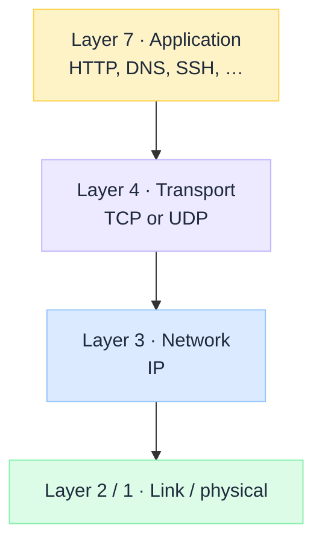
 

| | **TCP** | **UDP** |
| --- | --- | --- |
| **Abstraction** | Reliable, ordered byte stream | Discrete datagrams |
| **Connection** | Yes (state on both ends) | No (stateless sends) |
| **Delivery** | Retransmit until ACK (or give up) | Best effort; loss is silent to the stack |
| **Order** | In-order delivery to the app | Arrival order not guaranteed |
| **Overhead** | Higher (headers + state + ACKs) | Lower |
| **Congestion** | Built-in control | Application / upper layer |

### Components involved

| Component | What it is | TCP | UDP |
| --- | --- | --- | --- |
| **Socket** | App endpoint (IP + port + protocol) | Connected after handshake | Bound; send/recv datagrams |
| **Port** | 16-bit app demux (`443`, `53`, …) | Yes | Yes |
| **Segment / datagram** | Transport PDU inside an IP packet | TCP segment | UDP datagram |
| **Sequence / ACK** | Track bytes and confirm delivery | Core | Absent |
| **Checksum** | Detect corruption | Yes | Yes (often required in practice) |
| **Window / buffer** | Flow and congestion control | Yes | App manages pacing |
| **Firewall / NAT state** | Middlebox tracking | Conntrack feels “natural” | Short-lived or UDP timeout quirks |

:::note[PORTS ARE NOT THE PROTOCOL]
Port `53` is often DNS over **UDP**, and sometimes DNS over **TCP** (large answers, zone transfer). The number names the service habit; the transport still matters.
:::

## How a flow works (steps)

TCP is a **lifecycle** (open → transfer → close). UDP is a **send path** (optional bind → datagram → hope). Below, each phase is its own section: first what is **in the Layer 4 header**, then what happens on the wire.

### What sits in the TCP header

A TCP **segment** = **TCP header + optional payload**. The header is **not** sent once at connect time. **Every segment on the wire carries a TCP header** (handshake, data, pure ACK, `FIN`, `RST`). Only the **payload** is sometimes empty.

#### Header fields (layout)

Think of the header as a fixed control block glued in front of every chunk of (optional) data. On the wire it is laid out in **32-bit rows** like this:

 

Read it top to bottom: **ports** (which sockets), then **seq / ack** (reliability), then **flags + window** (what this segment means and flow control), then **checksum**, then optional **options** and **data**.

| Field | Bits | Role | Example | When it matters |
| --- | --- | --- | --- | --- |
| **Source port** | 16 | Sending socket on the **local** host. Client usually uses an **ephemeral** port the OS picks. | Browser open: `53122`. Reply from server uses `53122` as **dest** port. | Demux on the client; NAT maps this port; two tabs = two source ports. |
| **Destination port** | 16 | Receiving socket on the **peer**. Servers listen on a **well-known** port. | HTTPS request: dest `443`. SSH: dest `22`. Postgres: dest `5432`. | Client must target the right service; firewalls filter on this. |
| **Sequence #** | 32 | Byte offset of **this segment's payload** in the sender's stream (after the initial SYN seq). | Data segment: `seq=1000`, length 100 → covers bytes 1000-1099. Next data often `seq=1100`. | Ordering, reassembly, detecting loss/duplicates. |
| **Acknowledgment #** | 32 | Next byte the sender of this segment **expects** from the peer. Valid when **`ACK` flag** is set. | Got bytes through 1099 → send `ack=1100` ("send me from 1100 onward"). | Cumulative ACK; gaps → dup ACKs → fast retransmit. |
| **Flags** | 6+ (classic) | Bit switches for what this segment **means**. Common: `SYN`, `ACK`, `FIN`, `RST`, `PSH`, `URG`. | `SYN` only = start connect. `SYN+ACK` = accept. `ACK` = confirming data/handshake. `FIN` = done sending. `RST` = abort. | Handshake, teardown, resets, "push to app now" (`PSH`). |
| **Window** | 16 | **Flow control:** how many more bytes the receiver will accept from the peer (scaled if window-scale option negotiated). | Window `65535` = "you may have up to that much unacked data toward me." Window `0` = "stop; my buffer is full." | Zero-window stalls; slow consumer backs up the sender. |
| **Checksum** | 16 | Corruption check over header + payload (+ IP pseudo-header). Bad checksum → segment dropped. | Bit flip in flight → receiver discards; TCP retransmits later. You rarely "read" the value in apps. | Silent data corruption protection; bad NIC/path shows as loss. |
| **Options** | 0-320 | Variable extras after the base header. Common: **MSS**, **window scale**, **SACK**, **timestamps**. | On `SYN`: MSS `1460` ("max payload I want"). Later: SACK blocks listing which holes were received. | Tuning throughput, selective retransmit, RTT measurement. |

#### Working example: one HTTPS flow (same connection)

Scenario: browser on `203.0.113.10` opens `https://example.com` (server `198.51.100.20:443`). One TCP connection, ports **53122 ↔ 443** for the whole life of that socket.

Numbers below are **teaching values**. Real sequence numbers are large random ISNs; after the handshake, data seq continues from that stream. TLS ClientHello / HTTP bytes ride in the **payload**; TCP does not parse HTTPS.

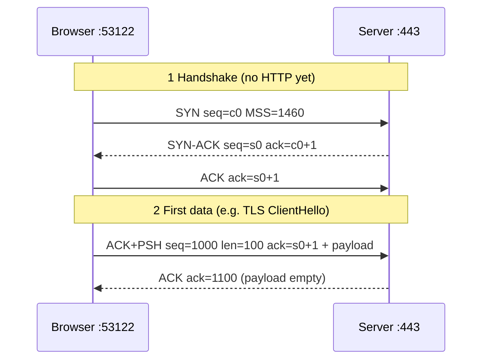
 

**Step 1: Client `SYN` (open the connection)**

| Header field | Value | Meaning |
| --- | --- | --- |
| Src port | `53122` | This browser socket (OS-picked ephemeral) |
| Dst port | `443` | HTTPS listener on the server |
| Sequence # | `c0` (ISN) | Client's starting stream number |
| Ack # | (not meaningful yet) | `ACK` flag not set on pure `SYN` |
| Flags | **`SYN`** | "I want to connect; sync sequence numbers" |
| Options | e.g. **MSS 1460** | "Please do not send me TCP payloads larger than this" |
| Payload | empty | Handshake only |

**Step 2: Server `SYN-ACK` (accept + sync the other way)**

| Header field | Value | Meaning |
| --- | --- | --- |
| Src port | `443` | Reply comes **from** the HTTPS socket |
| Dst port | `53122` | Ports **swap** so the reply hits the browser socket |
| Sequence # | `s0` (server ISN) | Server's starting stream number |
| Ack # | `c0+1` | "I received your `SYN`; next byte I expect from you is c0+1" |
| Flags | **`SYN` + `ACK`** | Accept + acknowledge client `SYN` |
| Payload | empty | Still no TLS/HTTP |

After this, the server has connection state for `203.0.113.10:53122 ↔ 198.51.100.20:443`.

**Step 3: Client final handshake `ACK`, then first data**

The third handshake packet is often a pure **`ACK`**. Right after (or combined in later segments), the client sends application data, for example the **TLS ClientHello**, still on the **same** ports:

| Header field | Value | Meaning |
| --- | --- | --- |
| Src / dst port | `53122` → `443` | Same connection as the `SYN` |
| Sequence # | `1000` (illustrative) | First byte of this payload in the client's stream |
| Ack # | `s0+1` | Still confirming the server's `SYN` |
| Flags | **`ACK`**, often **`PSH`** | Data is valid; `PSH` nudges "deliver to the app promptly" |
| Window | e.g. `65535` | "You may send me up to this much before I ACK" |
| Payload | 100 bytes | Encrypted/handshake bytes at TLS layer (TCP only sees bytes) |

If payload length is 100 and seq is `1000`, this segment covers client bytes **1000-1099**. The next client data segment should use seq **1100**.

**Step 4: Server `ACK` (confirm those 100 bytes)**

| Header field | Value | Meaning |
| --- | --- | --- |
| Src / dst port | `443` → `53122` | Same connection, ports swapped |
| Sequence # | (server's current seq) | May send server data later (TLS ServerHello, …) |
| Ack # | `1100` | "I have contiguous client bytes through 1099; send from 1100" |
| Flags | **`ACK`** | Cumulative acknowledgment |
| Payload | often **empty** | Pure ACK; server app data can ride later or piggyback |

**How to read the story end to end**

1. Ports pin **which sockets** talk (`53122` ↔ `443`) for every segment on this connection.
2. `SYN` / `SYN-ACK` / `ACK` only set up state; they usually carry **no** HTTPS payload.
3. Seq/ack track **byte streams**, not "request 1 / request 2." HTTP requests are just more bytes in those streams (inside TLS).
4. A pure server ACK with `ack=1100` does not mean "HTTP 200"; it only means "TCP got 100 client bytes." Application success is in the payload of later segments.

Reuse note: a second HTTP request on HTTP keep-alive or another HTTP/2 stream still uses **53122 ↔ 443** until teardown. New connection (new tab without coalescing, or pool miss) → new ephemeral port and a new `SYN`.

#### Ports: which apps (sockets) on each host

IP (Layer 3) only names **hosts** (`203.0.113.10` → `198.51.100.20`). One host runs many apps at once (browser tabs, SSH, a database client, …). **Ports** are the Layer 4 mailbox numbers so the OS can hand each segment to the right **socket**.

A **socket** is the OS endpoint an app uses: for TCP, think “my IP + my port, talking to your IP + your port.” The kernel demultiplexes arriving segments using the **4-tuple** (plus protocol = TCP):

**source IP · source port · dest IP · dest port**

| Side | Typical port | Who chooses it |
| --- | --- | --- |
| **Server (listening)** | **Well-known / registered** (e.g. `443` HTTPS, `22` SSH, `5432` Postgres) | Service config; clients must know it (or discover it) |
| **Client (connecting)** | **Ephemeral** (e.g. `49152`-`65535`, OS-picked) | Kernel assigns a free local port for this connection |

Example: browser to `https://example.com`:

- Client segment: src port **53122** (ephemeral) → dst port **443** (HTTPS)
- Server reply: src port **443** → dst port **53122** (swapped)

Same host IP can run HTTPS on `443` and SSH on `22` at once. Ports are how those two listening sockets stay distinct. Two browser tabs to the same site get **different ephemeral source ports**, so they are two separate TCP connections (two sockets), not one shared stream.

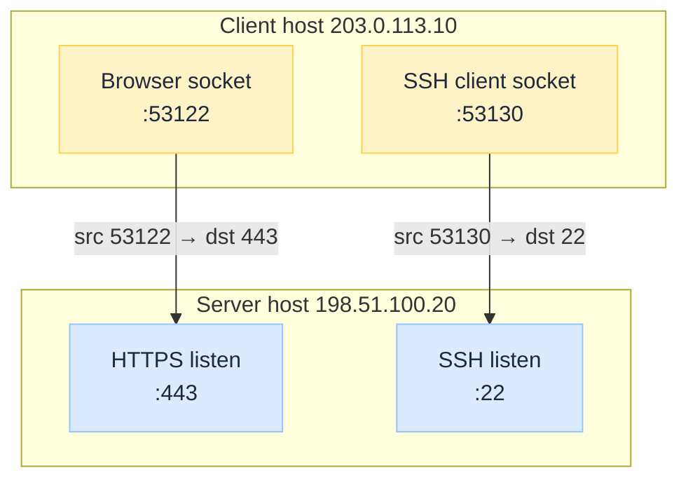
 

:::note[PORT ≠ PROCESS FOREVER]
A port identifies a **bound socket**, not a permanent app brand. When the process exits, the listening socket goes away; another process can bind `443` later. On the client, closing the connection releases the ephemeral port back to the pool.
:::

#### Same header, every phase (when it is sent)

Flags and seq/ack **values** change; the **header is always there**:

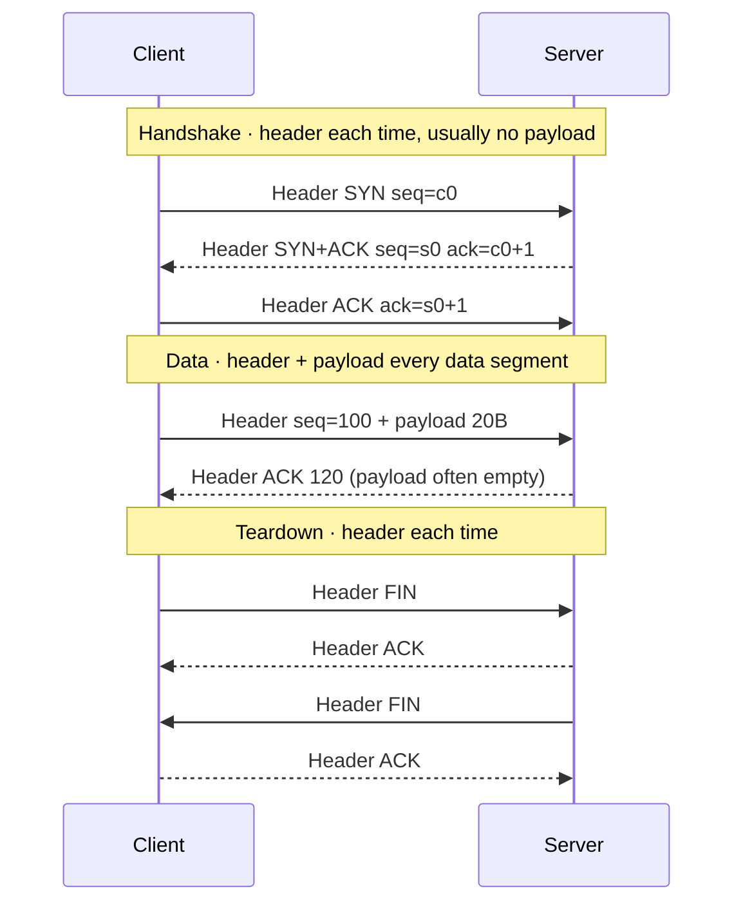
 

| Phase | Header sent? | Typical payload |
| --- | --- | --- |
| Handshake (`SYN` / `SYN-ACK` / `ACK`) | **Yes, every packet** | Empty |
| Data | **Yes, every segment** | Application bytes |
| Pure ACK | **Yes** | Empty |
| `FIN` / `RST` | **Yes, every packet** | Empty |

:::note[HEADER ≠ HANDSHAKE]
`SYN` is just **flags inside the header**. After the handshake finishes, data and ACKs still send a full TCP header on every packet. There is no headerless TCP data path.
:::

### TCP handshake

Client actively opens; server was in **LISTEN**. Goal: exchange initial sequence numbers and create connection state **before** application data.

| Step | Flags in header | Purpose |
| --- | --- | --- |
| 1 | Client → Server **`SYN`** | "Connect; my initial seq = c0" |
| 2 | Server → Client **`SYN` + `ACK`** | "Accepted; my initial seq = s0; ack = c0+1" |
| 3 | Client → Server **`ACK`** | Both sides **ESTABLISHED** |

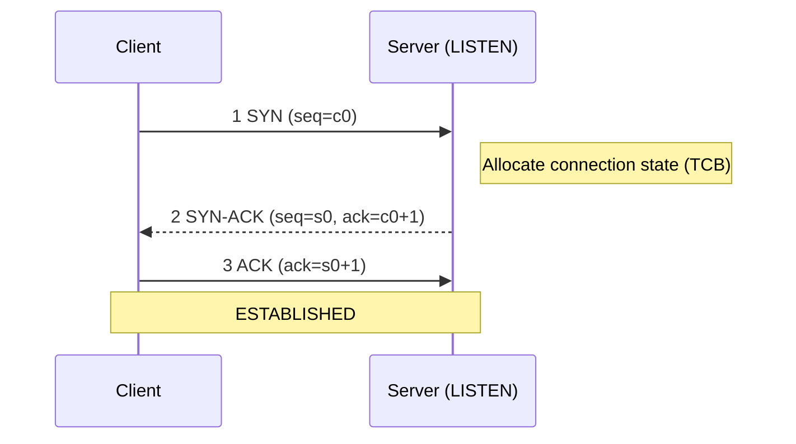
 

Cost: about **one RTT** before application bytes (TLS handshake, if any, comes after this).

### TCP data transfer

Either side sends segments with **seq** + payload. Peer returns **ACK** = next expected byte. Lost segments → timeout or **fast retransmit** (duplicate ACKs).

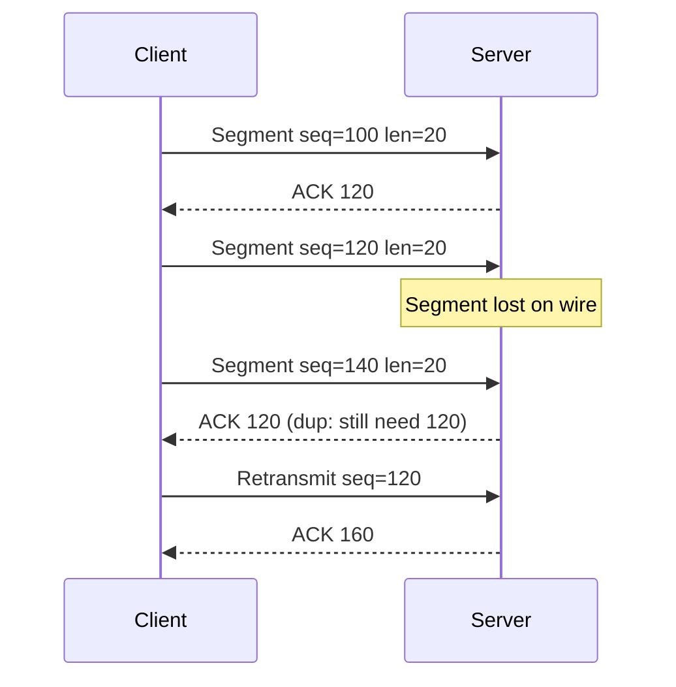
 

| Mechanism | Header / behaviour | Effect |
| --- | --- | --- |
| **Flow control** | Receiver **window** field | Cap how much the sender may have in flight |
| **Congestion control** | Sender algorithm (loss, delay, ECN) | Slow down when the path is full |
| **Head-of-line** | In-order delivery rule | One gap can block later bytes from the app |

### TCP teardown

| Mode | Flags | Meaning |
| --- | --- | --- |
| **Orderly** | `FIN` then `ACK` each way | "No more data from me"; drain then close |
| **Abort** | `RST` | Drop now (policy, crash, reject) |

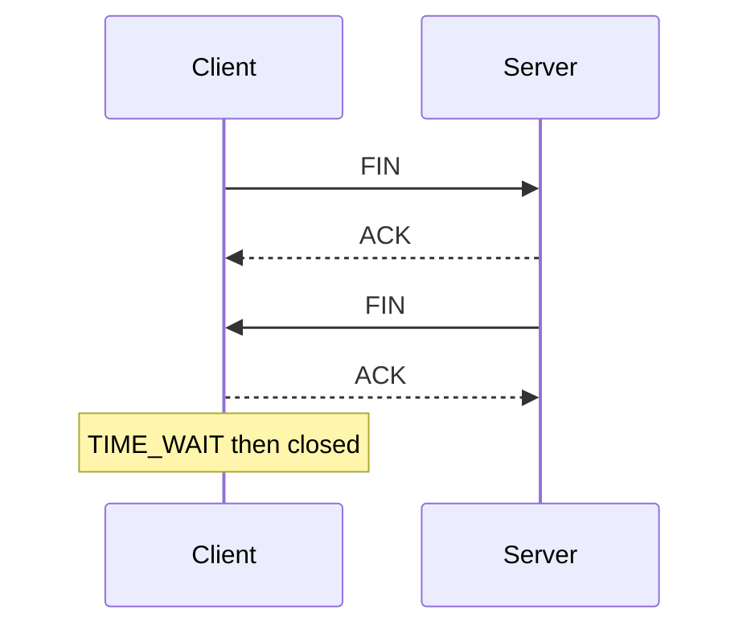
 

**`TIME_WAIT`:** brief hold on the 4-tuple so a delayed old segment cannot corrupt a new connection that reused the same ports.

:::tip[TAKEAWAY]
**TCP wire story:** header fields (seq/ack/flags/window) drive establish → reliable transfer → close. Incidents are handshake timeout, retransmits, zero window, `RST`, or `TIME_WAIT` pressure.
:::

### What sits in the UDP header

A UDP **datagram** = **UDP header + payload**. Same rule as TCP: the header is **on every datagram**, not only the first message. There is no separate connect header.

| When | What is sent |
| --- | --- |
| **Every send** | Full UDP header + that message's payload |
| **Every reply** | Its own full UDP header + reply payload |

| Field | Role | Sent when? |
| --- | --- | --- |
| **Source port** | Reply address for the peer (0 if not used) | **Every** datagram |
| **Dest port** | Which listening socket on the target host | **Every** datagram |
| **Length** | Header + payload size | **Every** datagram |
| **Checksum** | Detect corruption (header + payload + IP pseudo-header) | **Every** datagram |

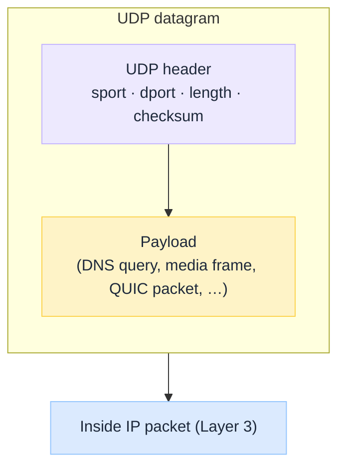
 

### UDP bind and send

App **binds** a local port (typical), then writes a datagram to destination IP + port. Stack fills the UDP header and hands off to **IP (Layer 3)**. No handshake packet exists.

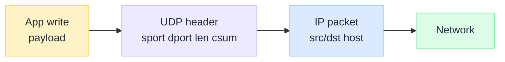
 

### UDP on the path

The network may **deliver, drop, duplicate, or reorder** datagrams. UDP does not fix that. `recv` returns whatever arrived.

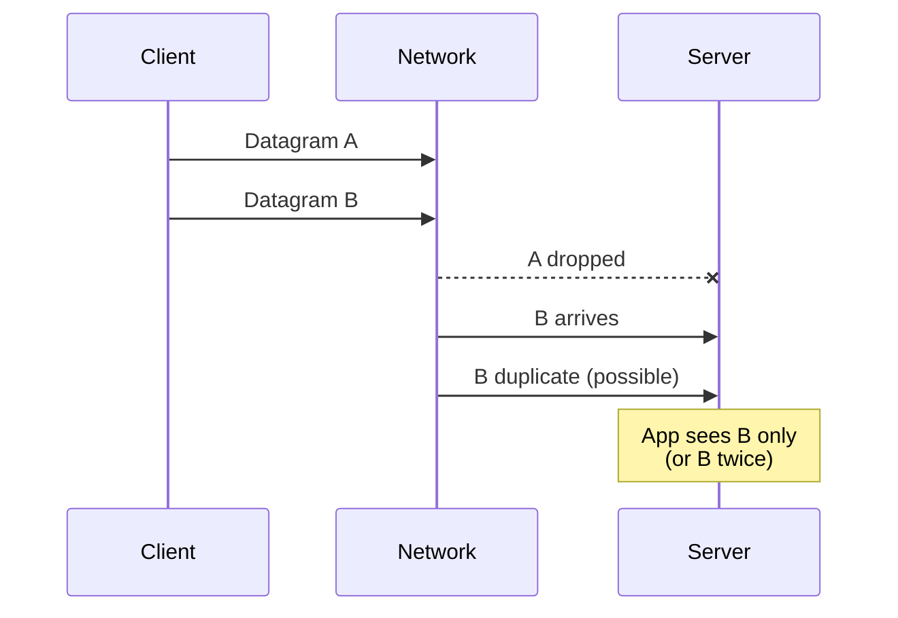
 

### UDP reply and retries

A peer may send another datagram. Timeouts, retries, sequence numbers, and crypto (DTLS / QUIC) live in the **application** (or library), not in the UDP header.

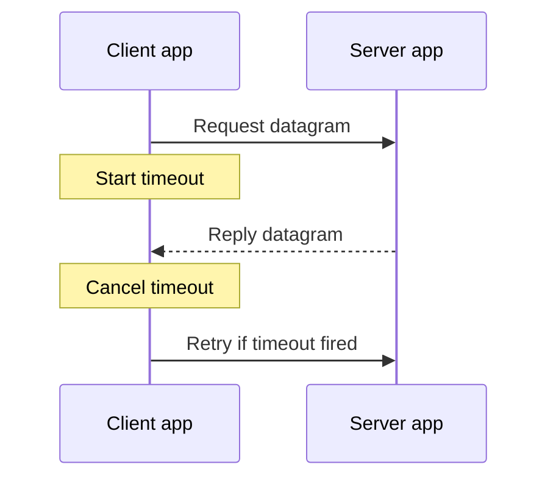
 

:::tip[TAKEAWAY]
**UDP wire story:** a tiny header plus payload, then best effort. Reliability is a Layer 7 (or QUIC) product choice, not a Layer 4 feature.
:::

## Reuse and pooling

Handshake and teardown are expensive relative to a small request. Systems therefore **reuse** live sessions and often **pool** several warm ones. TCP and UDP do not mean the same thing here.

### TCP: keep-alive, reuse, connection pools

A TCP connection stays usable from **ESTABLISHED** until `FIN`/`RST`. While it is open, either side can send many application messages on the **same** 4-tuple. That is **reuse**.

| Pattern | What it is | Examples |
| --- | --- | --- |
| **Keep-alive / persistent connection** | One TCP session, many requests over time | HTTP/1.1 keep-alive, long-lived gRPC/HTTP/2, DB sessions |
| **Multiplexing on one TCP** | Many app streams interleaved on one connection | HTTP/2 streams, HTTP/3 is different (QUIC on UDP) |
| **Connection pool** | Library holds N established TCP (often TLS) sockets and lends one out | JDBC pools, HTTP client pools, Redis pools, LB upstreams |

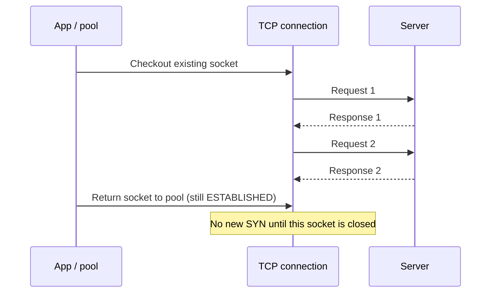
 

**What reuse buys:** skip repeated SYN handshakes (and usually skip full TLS again if the TLS session is still on that socket).

**Gotchas:**

- Idle **LB / NAT / server** timeouts drop pooled sockets; next checkout fails until reconnect.
- Server restart → `ECONNRESET` / broken pipe on the next write.
- Stale peer (DNS or backend IP changed) while the pool still holds the old connection.
- Oversized pools waste file descriptors and `ESTABLISHED` state.

Closed TCP (`FIN` done, past `TIME_WAIT`) is **not** reused. A new connect means a new handshake (new ephemeral port is common).

### UDP: no connection to pool (usually)

UDP has **no Layer 4 connection object**. There is nothing like TCP `ESTABLISHED` to keep warm at the stack level. Each datagram is independent.

| Pattern | What people actually reuse | Examples |
| --- | --- | --- |
| **Bound socket reuse** | Keep one local UDP socket open; send many datagrams to one or many peers | DNS stub/resolver socket, NTP client, game client socket |
| **App-level “session”** | Soft state (peer IP/port + timer) in your code, not in UDP | Media engines, custom RPC over UDP |
| **QUIC connection** (on UDP) | Real multiplexed, crypto-protected **connection** *implemented in QUIC*, still packets over UDP | HTTP/3: connection reuse and pooling look TCP-like, substrate is UDP |
| **Datagram “pool”** | Rarely a pool of connections; more often a pool of **workers/sockets** or buffer pools | High-QPS DNS, telemetry agents |

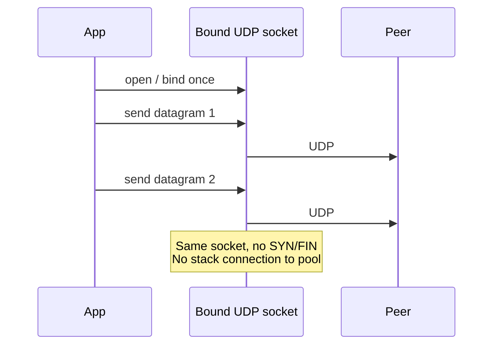
 

**Connected UDP sockets** (`connect()` on a UDP fd) only set a **default peer** for that socket (and filter incoming). They still do not create TCP-style reliability or a pooled “session” in the network stack.

**Gotchas:**

- NAT bindings for UDP expire; long “quiet” peers look dead until the next datagram refreshes mapping.
- Reusing one socket for many peers is fine; dooming all traffic on one blocked port/path is the failure mode.
- For HTTP/3, talk about **QUIC connection pools**, not “UDP connection pools.”

:::tip[TAKEAWAY]
**TCP pools connections. UDP reuses sockets (or QUIC connections on top of UDP).** Do not design a “UDP connection pool” unless you mean QUIC or your own session layer.
:::

## Use cases

| Use case | Usual transport | Why |
| --- | --- | --- |
| **HTTP/1.1, HTTP/2, HTTPS (classic)** | TCP | Request/response needs reliable bytes; TLS rides on the stream |
| **SSH, databases, SMTP, most APIs** | TCP | Ordered, complete messages matter |
| **DNS query (classic hot path)** | UDP/53 | Tiny Q&A; fail fast; retry at resolver; TCP for large/DNSSEC answers |
| **NTP, many telemetry beacons** | UDP | Periodic small messages; occasional loss OK |
| **VoIP, live video, gaming** | UDP | Late is worse than lost; app or codec conceals gaps |
| **HTTP/3** | UDP (QUIC inside) | QUIC rebuilds reliability, TLS, and streams on UDP to avoid TCP+middlebox pain |
| **QUIC / HTTP/3 discovery** | UDP | If UDP is blocked, clients fall back to HTTP/2 over TCP |

**When teams pick badly:**

- Forcing TCP on lossy real-time media → backlog and lag instead of skipping frames.
- Using raw UDP for a money transfer API → silent loss looks like “random” business bugs.
- Blaming the app for DNS timeouts that are UDP drops or rate limits path-side.

DNS Under the Hood (coming soon) goes deep on why resolvers lean UDP first. This page is the transport reason underneath.

## Reliability, latency, and failure modes

| Concern | TCP behaviour | UDP behaviour |
| --- | --- | --- |
| **Packet loss** | Retransmit; app sees delay, not a hole (until timeout) | App sees timeout / gap / nothing |
| **Latency** | Handshake + ACK/RTT coupling | First byte can be immediate |
| **Head-of-line** | Lost segment blocks later data on that stream | Each datagram is independent (app may still HOL itself) |
| **Congestion** | Backs off when the path is full | Can melt a link unless the app paces |
| **Middleboxes** | Widely expected; RST on policy deny | Often filtered, timed out in NAT, or rate-limited |

**Signals that belong on the wire, not in your stacktrace (first):**

- TCP: retransmit rate up, zero window, `ECONNRESET`, handshake timeout.
- UDP: ICMP unreachable (sometimes), one-way success rates, resolver/app retry storms with no TCP-style counters.

## Why it still matters

Cloud load balancers, service meshes, and “HTTP everywhere” hide the transport until production loss shows up.

| Surface | Why TCP vs UDP still matters |
| --- | --- |
| **SLOs** | Retransmits and HOL feel like API latency; UDP loss feels like flaky features |
| **Security** | TLS-on-TCP vs DTLS/QUIC-on-UDP change handshake and middlebox behaviour |
| **Egress policy** | Corporate firewalls that allow `443/tcp` but block UDP break HTTP/3 |
| **Observability** | Different metrics and packet captures; same “user error” symptom |
| **Protocol evolution** | QUIC proves UDP is not “toys only”; it is a substrate for modern reliability |

Ask before you change timeouts again: is this a **stream** that must arrive complete and ordered, or a **message** that can be lost and retried? If you cannot answer, the transport is unowned.

## Final takeaway

“TCP reliable, UDP fast” is a classroom poster. Architects need the contract.

**TCP** is a stateful, reliable, ordered byte stream: handshake, ACKs, congestion control, teardown. **UDP** is a thin datagram path: ports, checksum, and best effort. Use cases pick the contract; QUIC shows you can rebuild TCP-like guarantees on UDP when middleboxes and latency demand it. Treat transport as part of the **control plane for delivery**, same seriousness you give DNS names and CDN cache keys.

:::info[Builds on]
Under the Hood series: DNS Under the Hood (coming soon) · Anycast vs Unicast Under the Hood (coming soon) · The First Principles of Technology (coming soon)
:::
