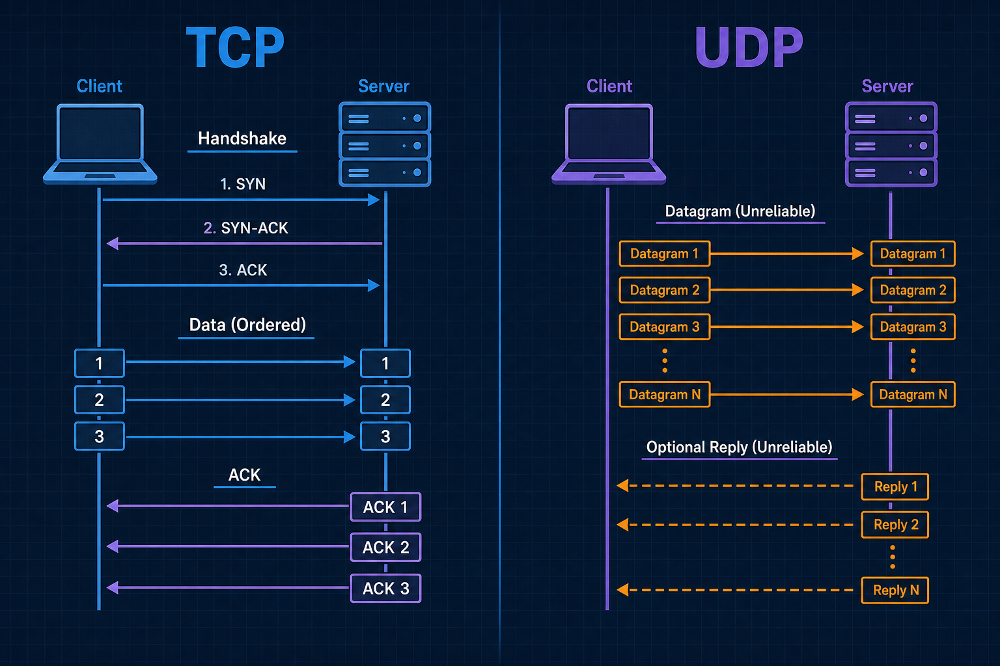
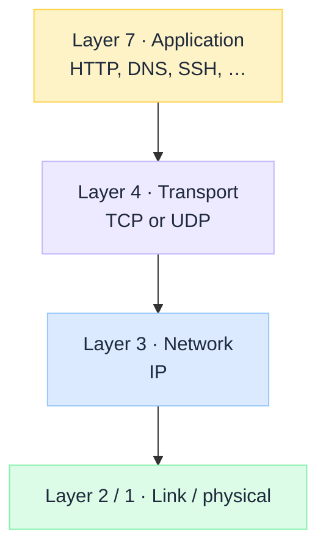
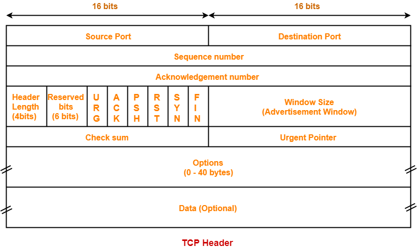
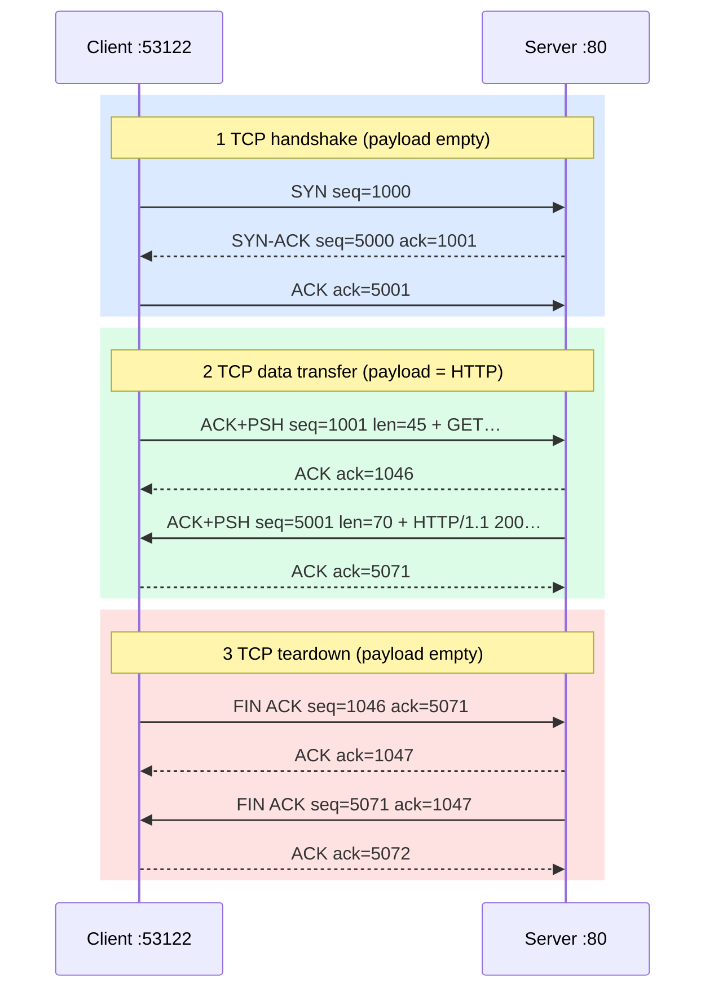
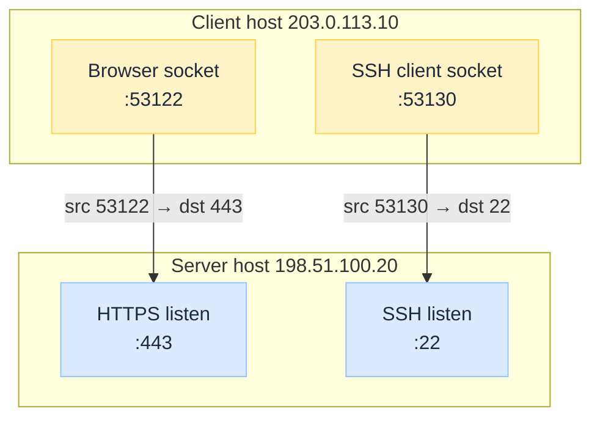
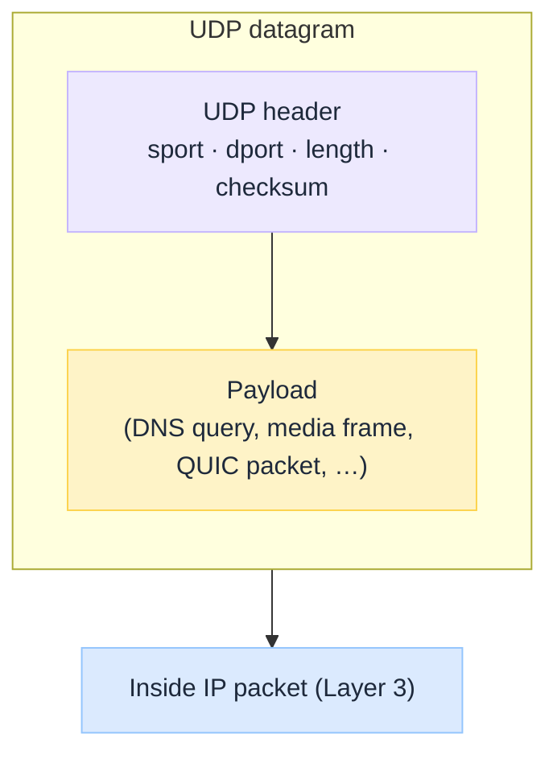
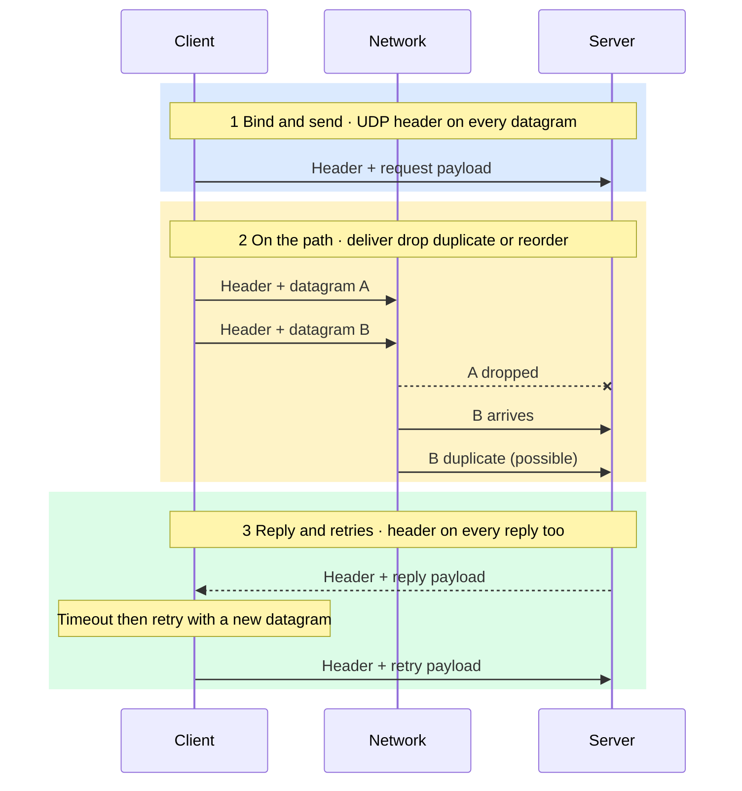
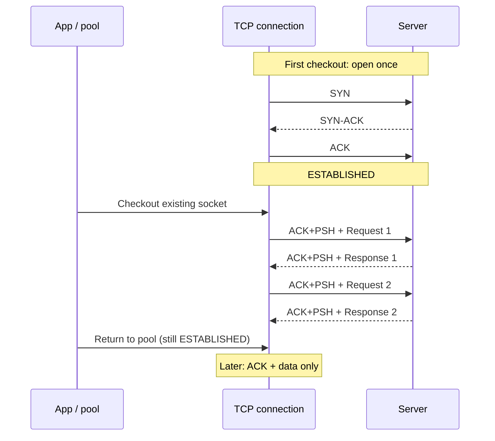
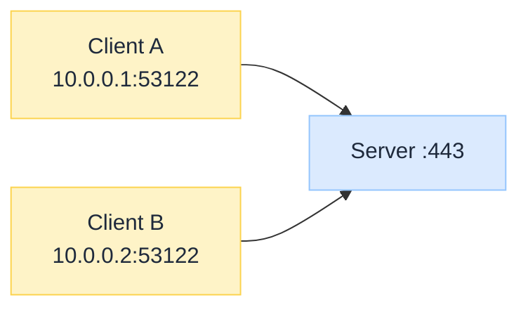

import Details from '@theme/Details';

<br/>


# TCP vs UDP Under the Hood

*HTTPS feels solid. Live video and classic DNS often gamble on packets that may never arrive. Same Internet. Different transport contracts.*

Most engineers know the slogan: **TCP is reliable; UDP is fast.** That is directionally right. It skips the components, the steps, and the use cases that decide which failures belong to the network versus your app.

TCP gives you an ordered byte stream with retransmission and congestion control. UDP gives you datagrams and almost nothing else. Pick wrong and you either pay latency you did not need, or you reinvent reliability badly.

:::tip[THE CLAIM]
**TCP buys reliability and order with state, handshake cost, and head-of-line blocking. UDP buys simplicity and low overhead; delivery, order, and congestion are your problem (or QUIC’s).** Transport choice is an architecture contract, not a default checkbox.
:::

<!-- truncate -->

## The bottom line first

- **TCP:** connection-oriented **byte stream**; handshake, sequence numbers, ACKs, retransmission, congestion control.
- **UDP:** connectionless **datagrams**; send and (maybe) receive; no built-in delivery guarantee.
- **Both use ports** on top of IP so many apps can share one host.
- **Reliability is not free:** TCP pays RTT and buffers; UDP pushes loss handling into the application or a layer like QUIC.
- **Classic use map:** web, SSH, databases → TCP; DNS queries, NTP, media, many games, HTTP/3 (QUIC) → UDP.
- **Observability differs:** TCP shows RSTs, retransmits, window collapse; UDP shows silent drops and app-level timeouts.

## What TCP and UDP actually are

Both sit in the **transport layer (Layer 4)** above IP. **IP (Layer 3)** delivers packets between hosts. **TCP and UDP (Layer 4)** deliver data between **applications** (via ports). Applications such as HTTP and DNS sit above that (**Layer 7** in the OSI map people usually mean).


<br/>

| | **TCP** | **UDP** |
| --- | --- | --- |
| **Abstraction** | Reliable, ordered byte stream | Discrete datagrams |
| **Connection** | Yes (state on both ends) | No (stateless sends) |
| **Delivery** | Retransmit until ACK (or give up) | Best effort; loss is silent to the stack |
| **Order** | In-order delivery to the app | Arrival order not guaranteed |
| **Overhead** | Higher (headers + state + ACKs) | Lower |
| **Congestion** | Built-in control | Application / upper layer |

### Components involved

| Component | What it is | TCP | UDP |
| --- | --- | --- | --- |
| **Socket** | App endpoint (IP + port + protocol) | Connected after handshake | Bound; send/recv datagrams |
| **Port** | 16-bit app demux (`443`, `53`, …) | Yes | Yes |
| **Segment / datagram** | Transport PDU inside an IP packet | TCP segment | UDP datagram |
| **Sequence / ACK** | Track bytes and confirm delivery | Core | Absent |
| **Checksum** | Detect corruption | Yes | Yes (often required in practice) |
| **Window / buffer** | Flow and congestion control | Yes | App manages pacing |
| **Firewall / NAT state** | Middlebox tracking | Conntrack feels “natural” | Short-lived or UDP timeout quirks |

:::note[PORTS ARE NOT THE PROTOCOL]
Port `53` is often DNS over **UDP**, and sometimes DNS over **TCP** (large answers, zone transfer). The number names the service habit; the transport still matters.
:::

## How a flow works (steps)

TCP is a **lifecycle** (open → transfer → close). UDP is a **send path** (optional bind → datagram → hope). Below, each phase is its own section: first what is **in the Layer 4 header**, then what happens on the wire.

### What is a TCP header, and what sits in it

A **TCP header** is the Layer 4 control block on every TCP segment. It tells the peer which sockets are talking, where this data sits in the byte stream, what the segment means (`SYN`, `ACK`, `FIN`, …), and how much more the receiver can accept. It is **not** the application message (HTTP, TLS, …). Those bytes, when present, follow in the **payload**.

So: a TCP **segment** = **TCP header + optional payload**. The header is **not** sent once at connect time. **Every segment on the wire carries a TCP header** (handshake, data, pure ACK, `FIN`, `RST`). Only the **payload** is sometimes empty.

What sits in that header is the field set below (ports, seq/ack, flags, window, checksum, options).

#### Header fields (layout)

Think of the header as a fixed control block glued in front of every chunk of (optional) data. On the wire it is laid out in **32-bit rows** like this:



<br/>

Read it top to bottom: **ports** (which sockets), then **seq / ack** (reliability), then **flags + window** (what this segment means and flow control), then **checksum**, then optional **options** and **data**.

<div style={{overflowX: 'auto'}}>

| Field | Bits | Role | Example | When it matters |
| --- | --- | --- | --- | --- |
| **Source port** | 16 | Sending socket on the **local** host. Client usually uses an **ephemeral** port the OS picks. | Browser open: `53122`. Reply from server uses `53122` as **dest** port. | Demux on the client; NAT maps this port; two tabs = two source ports. |
| **Destination port** | 16 | Receiving socket on the **peer**. Servers listen on a **well-known** port. | HTTPS request: dest `443`. SSH: dest `22`. Postgres: dest `5432`. | Client must target the right service; firewalls filter on this. |
| **Sequence #** | 32 | Byte offset of **this segment's payload** in the sender's stream (after the initial SYN seq). | Data segment: `seq=1000`, length 100 → covers bytes 1000-1099. Next data often `seq=1100`. | Ordering, reassembly, detecting loss/duplicates. |
| **Acknowledgment #** | 32 | Next byte the sender of this segment **expects** from the peer. Valid when **`ACK` flag** is set. | Got bytes through 1099 → send `ack=1100` ("send me from 1100 onward"). | Cumulative ACK; gaps → dup ACKs → fast retransmit. |
| **Flags** | 6+ (classic) | Bit switches for what this segment **means**. Common: `SYN`, `ACK`, `FIN`, `RST`, `PSH`, `URG`. | `SYN` only = start connect. `SYN+ACK` = accept. `ACK` = confirming data/handshake. `FIN` = done sending. `RST` = abort. | Handshake, teardown, resets, "push to app now" (`PSH`). |
| **Window** | 16 | **Flow control:** how many more bytes the receiver will accept from the peer (scaled if window-scale option negotiated). | Window `65535` = "you may have up to that much unacked data toward me." Window `0` = "stop; my buffer is full." | Zero-window stalls; slow consumer backs up the sender. |
| **Checksum** | 16 | Corruption check over header + payload (+ IP pseudo-header). Bad checksum → segment dropped. | Bit flip in flight → receiver discards; TCP retransmits later. You rarely "read" the value in apps. | Silent data corruption protection; bad NIC/path shows as loss. |
| **Options** | 0-320 | Variable extras after the base header. Common: **MSS**, **window scale**, **SACK**, **timestamps**. | On `SYN`: MSS `1460` ("max payload I want"). Later: SACK blocks listing which holes were received. | Tuning throughput, selective retransmit, RTT measurement. |

</div>

#### TCP call start to finish: headers and payloads

Full life of **one** TCP connection: open → exchange application data → close. Scenario uses **plain HTTP** on port `80` so payloads are readable. **HTTPS is the same TCP header story**; the early payloads are TLS binary (ClientHello, …) instead of `GET /…`.

| | Client | Server |
| --- | --- | --- |
| Host | `203.0.113.10` | `198.51.100.20` |
| Port | `53122` (ephemeral) | `80` (HTTP) |
| Teaching ISN | client starts at seq **1000** | server starts at seq **5000** |

Real ISNs are large and random. Lengths below are small for teaching.


<br/>

##### A. Open the call (handshake, no app payload)

**1. Client → Server: `SYN`**

| | |
| --- | --- |
| **Ports** | src `53122` → dst `80` |
| **Seq / ack** | seq=`1000` (ISN). Ack unused (`ACK` flag off) |
| **Flags** | `SYN` |
| **Options** | e.g. MSS `1460` |
| **Payload** | *(empty)* |

**2. Server → Client: `SYN-ACK`**

| | |
| --- | --- |
| **Ports** | src `80` → dst `53122` (swapped) |
| **Seq / ack** | seq=`5000` (server ISN), ack=`1001` ("got your SYN") |
| **Flags** | `SYN` + `ACK` |
| **Payload** | *(empty)* |

**3. Client → Server: final handshake `ACK`**

| | |
| --- | --- |
| **Ports** | src `53122` → dst `80` |
| **Seq / ack** | seq=`1001`, ack=`5001` |
| **Flags** | `ACK` |
| **Payload** | *(empty)* |

Connection is **ESTABLISHED**. Next client **data** byte is at seq `1001`; next server data byte at seq `5001`.

##### B. Application data on the call (header + payload)

**4. Client → Server: HTTP request bytes**

| | |
| --- | --- |
| **Ports** | `53122` → `80` |
| **Seq / ack** | seq=`1001`, ack=`5001`, **len=45** (covers 1001-1045) |
| **Flags** | `ACK` + `PSH` |
| **Payload (example)** | see below |

<Details summary="Example request payload (bytes inside TCP)">

```http
GET / HTTP/1.1
Host: example.com
Connection: close

```

</Details>

TCP does not understand HTTP. It only sees **45 bytes** of payload. Next client seq after this segment = `1046`.

**5. Server → Client: pure `ACK` (optional alone; often delayed or piggybacked)**

| | |
| --- | --- |
| **Ports** | `80` → `53122` |
| **Seq / ack** | ack=`1046` ("I have client bytes through 1045") |
| **Flags** | `ACK` |
| **Payload** | *(empty)*. Confirms delivery only, not "HTTP 200" |

**6. Server → Client: HTTP response bytes**

| | |
| --- | --- |
| **Ports** | `80` → `53122` |
| **Seq / ack** | seq=`5001`, ack=`1046`, **len=70** (covers 5001-5070) |
| **Flags** | `ACK` + `PSH` |
| **Payload (example)** | see below |

<Details summary="Example response payload (bytes inside TCP)">

```http
HTTP/1.1 200 OK
Content-Length: 13
Content-Type: text/plain

Hello, world!
```

</Details>

Next server seq = `5071`.

**7. Client → Server: `ACK` for the response**

| | |
| --- | --- |
| **Ports** | `53122` → `80` |
| **Seq / ack** | ack=`5071` |
| **Flags** | `ACK` |
| **Payload** | *(empty)* |

##### C. End the call (teardown, no app payload)

Both sides still use the same ports. `FIN` consumes one sequence number (like a one-byte "I'm done") even with empty payload.

**8. Client → Server: `FIN`**

| | |
| --- | --- |
| **Ports** | `53122` → `80` |
| **Seq / ack** | seq=`1046`, ack=`5071` |
| **Flags** | `FIN` + `ACK` |
| **Payload** | *(empty)* |

**9. Server → Client: `ACK` of FIN, then server `FIN`**

| | |
| --- | --- |
| **ACK of client FIN** | ack=`1047`, flags `ACK`, payload empty |
| **Server FIN** | seq=`5071`, ack=`1047`, flags `FIN`+`ACK`, payload empty |

**10. Client → Server: final `ACK`**

| | |
| --- | --- |
| **Ports** | `53122` → `80` |
| **Seq / ack** | ack=`5072` |
| **Flags** | `ACK` |
| **Payload** | *(empty)* |

Client enters **`TIME_WAIT`**, then the 4-tuple is free. A **new** call needs a new `SYN` (often a new ephemeral port).

##### Header vs payload cheat sheet

| Phase | Header always? | Typical payload |
| --- | --- | --- |
| `SYN` / `SYN-ACK` / handshake `ACK` | Yes | Empty |
| App request / response | Yes | HTTP text, TLS records, DB protocol, … |
| Pure `ACK` | Yes | Empty |
| `FIN` / `RST` | Yes | Empty (`RST` aborts; no orderly FIN dance) |

**HTTPS note:** TCP phases are identical. After ESTABLISHED, early payloads are TLS (ClientHello, cert, …), then TLS Application Data wrapping HTTP. Wireshark: TCP flags/seq/ack for lifecycle; TLS/HTTP dissectors for payload. Companions: [HTTP vs HTTPS Under the Hood](/insights/http-vs-https-under-the-hood) for cleartext vs TLS wrap; [HTTPS Encryption Lifecycle Under the Hood](/insights/https-encryption-lifecycle-under-the-hood) for one full call by phase.

**Scale note:** large bodies split into many segments (≤ MSS); ACKs are frequent; TCP is full duplex. The diagram is the smallest story so headers stay readable.

**Reuse:** keep-alive skips teardown and sends another data phase on the same ports; a new call needs a new `SYN` (often a new ephemeral port).

#### Ports: which apps (sockets) on each host

IP names **hosts**. **Ports** pick the **socket** on that host. Demux uses the **4-tuple** (plus protocol = TCP):

**source IP · source port · dest IP · dest port**

| Side | Typical port | Who chooses it |
| --- | --- | --- |
| **Server** | Well-known (e.g. `443`, `22`, `5432`) | Service config |
| **Client** | Ephemeral (e.g. `49152`-`65535`) | OS |

Example: browser `53122` → server `443`; reply swaps ports (`443` → `53122`). Two tabs to the same site get different ephemeral ports = two connections.


<br/>

:::note[HEADER ≠ HANDSHAKE]
`SYN` is a **flag in the header**, not a separate header type. Every later data/ACK/FIN segment still carries a full TCP header. A port names a **bound socket**, not a permanent process.
:::

### TCP phase notes (beyond the walkthrough)

| Topic | What to remember |
| --- | --- |
| **Handshake cost** | About one RTT before app bytes (TLS adds more after ESTABLISHED) |
| **Loss** | Retransmit on timeout or duplicate ACKs (fast retransmit) |
| **Flow / congestion** | Receiver **window** caps in-flight bytes; sender backs off on loss/delay |
| **Head-of-line** | A gap can block later bytes from the app even if they arrived |
| **Teardown** | Orderly `FIN`/`ACK` each way; `RST` aborts. Client often sits in **`TIME_WAIT`** briefly so delayed segments cannot corrupt a new 4-tuple |

:::tip[TAKEAWAY]
**TCP wire story:** header fields drive establish → reliable transfer → close. Incidents are handshake timeout, retransmits, zero window, `RST`, or `TIME_WAIT` pressure.
:::

### What sits in the UDP header

A UDP **datagram** = **UDP header + payload**. Same rule as TCP: the header is **on every datagram**, not only the first message. There is no separate connect header.

| When | What is sent |
| --- | --- |
| **Every send** | Full UDP header + that message's payload |
| **Every reply** | Its own full UDP header + reply payload |

| Field | Role | Sent when? |
| --- | --- | --- |
| **Source port** | Reply address for the peer (0 if not used) | **Every** datagram |
| **Dest port** | Which listening socket on the target host | **Every** datagram |
| **Length** | Header + payload size | **Every** datagram |
| **Checksum** | Detect corruption (header + payload + IP pseudo-header) | **Every** datagram |


<br/>

#### Same header, every datagram (phases)

UDP has **no handshake or teardown**. The header is still on **every** datagram. Map the story as three app-level phases:


<br/>

| Phase | Header sent? | Typical payload |
| --- | --- | --- |
| **1 Bind and send** | **Yes, every datagram** | Request bytes (DNS query, game packet, …) |
| **2 On the path** | Same headers ride in IP packets | Unchanged; may never arrive |
| **3 Reply / retry** | **Yes, every reply and retry** | Reply bytes, or a fresh copy of the request |

:::note[NO SYN / FIN]
UDP never sends a connect or close header. “Session” and retries are application logic. Wire constant: **datagram = UDP header + payload**, every time.
:::

:::tip[TAKEAWAY]
**UDP wire story:** tiny header plus payload, then best effort. Reliability is Layer 7 (or QUIC), not a Layer 4 feature.
:::

## Reuse and pooling

Handshake and teardown are expensive relative to a small request. Systems **reuse** live sessions and often **pool** several warm ones. TCP and UDP differ here.

### TCP: keep-alive, reuse, connection pools

A TCP connection stays usable from **ESTABLISHED** until `FIN`/`RST`. Reuse is **not** another `SYN` on the same socket. After open, segments use **`ACK`** (often with data).

**“A new `SYN` = a new call”** means: sending `SYN` again starts a **new** TCP connection, not a continuation of the one you already have. Keep-alive and pools keep talking on the live ESTABLISHED socket with `ACK` + data. A fresh `SYN` (often with a new ephemeral port) is a brand-new handshake and a new connection.

| Pattern | What it is | Examples |
| --- | --- | --- |
| **Keep-alive** | One TCP session, many requests | HTTP/1.1 keep-alive, gRPC/HTTP/2, DB sessions |
| **Multiplexing** | Many streams on one connection | HTTP/2 (HTTP/3 is QUIC on UDP) |
| **Connection pool** | Library holds N warm sockets | JDBC, HTTP clients, Redis, LB upstreams |


<br/>

**Buys:** skip repeated SYN (and often full TLS) while the socket lives. **Gotchas:** idle LB/NAT timeouts, server restart → `ECONNRESET`, stale peer after DNS change, oversized pools waste FDs. Closed TCP is not reused.

### UDP: no connection to pool (usually)

UDP has no Layer 4 connection. Reuse the **bound socket** (many datagrams), or an app/QUIC session on top.

| Pattern | Reality | Examples |
| --- | --- | --- |
| **Bound socket reuse** | One local UDP socket, many sends | DNS stub, NTP, games |
| **App session** | Soft state in your code | Media, custom RPC |
| **QUIC** | Real connections *on* UDP | HTTP/3 pools |

`connect()` on UDP only sets a default peer filter. It does not create TCP-style reliability. NAT UDP mappings expire when quiet. For HTTP/3, pool **QUIC connections**, not "UDP connections."

:::tip[TAKEAWAY]
**TCP pools connections. UDP reuses sockets (or QUIC on UDP).**
:::

## How many sockets can you open (client vs server)

No fixed language max. Concurrent use is the lowest of FDs, ephemeral ports (when they apply), memory/threads, and app pools. Client and server hit different walls.

### TCP

Limit ≈ `min(pool, free FDs, free ephemeral ports)` toward **one** remote `IP:port`. Typical ephemeral range ~16k (`49152`-`65535`).

| Situation | What happens |
| --- | --- |
| Many connects to **same** peer | Bound by free ephemeral ports + FDs |
| Connects to **different** remotes | Local ports can reuse across remotes (different 4-tuples) |
| Fast open/close | `TIME_WAIT` lowers usable ports |
| App pool tiny | Pool wins (e.g. Hikari 20) even if OS allows more |

**Server replies do not need a matching ephemeral port.** Server speaks from the **listen** port (`443`) to the client's ephemeral port. Caps: FDs, backlog, accept/worker pool. When the server dials out (DB, API), *that* side is a client and uses ephemeral ports.

**Same ephemeral port on two clients?** OK if source IPs differ. Same client IP + same port + same server `IP:port` is the same 4-tuple → not allowed. NAT rewrites so home devices do not collide on the public side.


<br/>

### UDP

Usually **one** (or few) sockets, many datagrams. Do not burn one ephemeral port per request. Caps: FDs, buffers, NAT idle timeouts, app session tables. Server answers from the **service** port. Same "two clients, same source port" rule as TCP (4-tuple). HTTP/3 often shares one UDP socket with QUIC connection IDs inside.

:::tip[TAKEAWAY]
**TCP client:** pool + FDs + ephemeral ports per peer. **TCP server:** service port + FDs + workers. **UDP:** reuse sockets; do not size like one port per datagram.
:::

## Use cases

| Use case | Usual transport | Why |
| --- | --- | --- |
| **HTTP/1.1, HTTP/2, HTTPS (classic)** | TCP | Reliable bytes; TLS on the stream |
| **SSH, databases, SMTP, most APIs** | TCP | Ordered, complete messages |
| **DNS query (classic hot path)** | UDP/53 | Tiny Q&A; TCP for large/DNSSEC answers |
| **NTP, many telemetry beacons** | UDP | Occasional loss OK |
| **VoIP, live video, gaming** | UDP | Late worse than lost |
| **HTTP/3** | UDP (QUIC) | Rebuild reliability on UDP |

**Bad picks:** TCP for lossy real-time → lag; raw UDP for money APIs → silent loss; blaming the app for DNS timeouts that are UDP drops.

## Reliability, latency, and failure modes

| Concern | TCP | UDP |
| --- | --- | --- |
| **Loss** | Retransmit; app sees delay | App sees gap / timeout |
| **Latency** | Handshake + ACK/RTT | First byte can be immediate |
| **Head-of-line** | Gap blocks later data on the stream | Datagrams independent |
| **Congestion** | Backs off | Can melt a link unless paced |
| **Middleboxes** | RST common on deny | Often filtered / NAT timed out |

Wire signals first: TCP retransmits, zero window, `ECONNRESET`, handshake timeout. UDP: ICMP unreachable (sometimes), one-way success rates, retry storms.

## Why it still matters

Meshes and "HTTP everywhere" hide transport until loss shows up. Separate TCP failures, TLS failures, and app status. Ask: stream that must arrive complete and ordered, or message that can be lost and retried? If unclear, transport is unowned.

## Final takeaway

"TCP reliable, UDP fast" is a poster. **TCP** is a stateful ordered byte stream. **UDP** is a thin datagram path. QUIC shows you can rebuild TCP-like guarantees on UDP when needed. Treat transport as a delivery control plane, same seriousness as DNS names and CDN cache keys.
