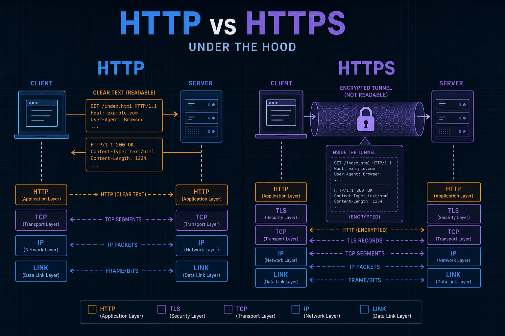
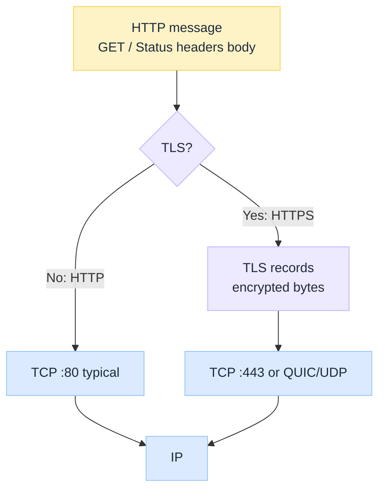
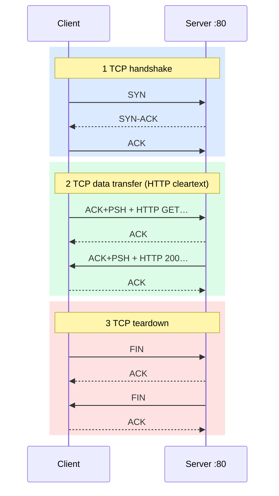
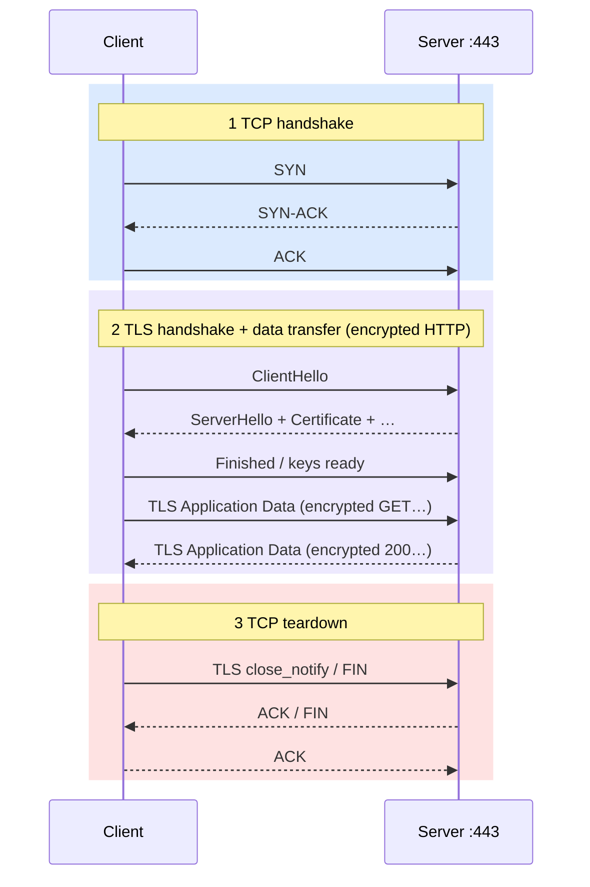

import Details from '@theme/Details';

<br/>


# HTTP vs HTTPS Under the Hood

*The padlock is not a different web language. It is the same HTTP messages riding inside a cryptographic channel.*

Most engineers know: **HTTP is plain; HTTPS is secure.** That slogan skips the layering. HTTP defines request/response. HTTPS means those bytes travel over **TLS** (usually on TCP `:443`, or inside QUIC for HTTP/3). Misread that boundary and you debug TLS alerts as “the API is down” or treat HTTP 500 as a certificate problem.

:::tip[THE CLAIM]
**HTTPS is HTTP over TLS, not a separate application protocol.** HTTP still owns method, path, status, and headers. TLS owns confidentiality, integrity, and (usually) server authentication before those bytes move.
:::

<!-- truncate -->

## The bottom line first

- **HTTP (Layer 7):** request/response messages; methods, status codes, headers, optional body.
- **HTTPS:** same HTTP messages inside a **TLS** session (encrypt + integrity + server auth via certificates in the common case).
- **Ports:** cleartext often `:80`; TLS-wrapped often `:443` (convention, not magic).
- **Stack:** HTTP → (TLS) → TCP or QUIC → IP. HTTP/3 = HTTP over QUIC (UDP), still “HTTPS” in the browser sense.
- **Cleartext HTTP** exposes URLs, headers, and bodies to the path. HTTPS hides them from casual observers; the IP/SNI story is more nuanced.
- **Observability:** separate TCP failure, TLS handshake failure, and HTTP status. They are different layers.

## What HTTP and HTTPS actually are


<br/>

| | **HTTP** | **HTTPS** |
| --- | --- | --- |
| **What it is** | Application protocol | HTTP + TLS channel |
| **On the wire** | Readable ASCII/text (HTTP/1.x) or binary frames (H2) in clear | Encrypted TLS records; HTTP inside after decrypt |
| **Typical port** | 80 | 443 |
| **Server proof** | None by default | Certificate validated against trust store (usual browser/API client mode) |

### Components involved

| Piece | Role | HTTP | HTTPS |
| --- | --- | --- | --- |
| **URL / URI** | Scheme + host + path + query | `http://…` | `https://…` |
| **Request line** | Method + path + version | Yes | Same (inside TLS) |
| **Headers** | Metadata (`Host`, `Content-Type`, cookies, …) | Clear on path | Encrypted in transit |
| **Body** | Optional payload | Clear | Encrypted |
| **Status line** | Version + code + reason | Yes | Same inside TLS |
| **TLS** | Handshake, keys, records | Absent | Required for “HTTPS” |
| **Certificate** | Binds public key to hostname(s) | N/A | Server presents; client verifies |

## What sits in an HTTP message

Minimal request:

<Details summary="Example HTTP request (cleartext shape)">

```http
GET /health HTTP/1.1
Host: api.example.com
Accept: application/json
Connection: close

```

</Details>

Minimal response:

<Details summary="Example HTTP response (cleartext shape)">

```http
HTTP/1.1 200 OK
Content-Type: application/json
Content-Length: 16

{"status":"ok"}
```

</Details>

| Part | Example | Meaning |
| --- | --- | --- |
| **Method** | `GET`, `POST`, `PUT`, `DELETE` | Intent (safe vs unsafe methods matter for caches and CDNs) |
| **Path** | `/health` | Resource on the host |
| **Host** | `api.example.com` | Which virtual site on a shared IP |
| **Status** | `200`, `404`, `502` | Outcome *after* transport succeeded |
| **Body** | JSON, HTML, empty | Application data |

HTTPS uses the **same** message shape. A packet capture on the wire shows TLS records, not this ASCII, until you decrypt with keys.

## Start to finish: HTTP vs HTTPS on the wire

Teaching TCP ports: client `:53122`, server `:80` or `:443`.

### Cleartext HTTP (no TLS)


<br/>

Anyone on the path who sees TCP payloads can read `GET /health` and the JSON body.

### HTTPS (HTTP inside TLS on TCP)


<br/>

| Phase | What you see on the wire | HTTP visible? |
| --- | --- | --- |
| **1 TCP handshake** | `SYN` / `SYN-ACK` / `ACK` | No |
| **2 TLS + data transfer** | ClientHello, cert, key share, then TLS Application Data records | Only after decrypt |
| **3 TCP teardown** | `FIN` / `ACK`, TLS `close_notify` (typical) | N/A |

**SNI** (Server Name Indication) often appears in ClientHello in cleartext (or encrypted in newer TLS modes with limits). Hostname privacy is not absolute just because you said HTTPS.

:::tip[TAKEAWAY]
**Same HTTP. Different path protection.** Debug with the layer that failed: TCP connect, TLS handshake, or HTTP status.
:::

## Certificates and trust (HTTPS)

| Idea | Meaning |
| --- | --- |
| **Certificate** | Document: public key + identity (SAN/CN hostnames) + issuer signature |
| **Trust store** | Set of CA roots the client trusts |
| **Chain** | Server cert → intermediate(s) → root the client already trusts |
| **Hostname check** | Name in the URL must match a name on the cert |

Common breaks: expired cert, wrong hostname, incomplete chain, private CA not in the trust store (common in enterprises), clock skew.

Companion depth: [Symmetric vs Asymmetric Encryption Under the Hood](/insights/symmetric-vs-asymmetric-encryption-under-the-hood) explains why certs use public keys and why bulk traffic uses symmetric session keys. For one full call from TCP open through handshake and encrypted Application Data, see [HTTPS Encryption Lifecycle Under the Hood](/insights/https-encryption-lifecycle-under-the-hood).

## HTTP versions (short map)

| Version | Transport habit | Note |
| --- | --- | --- |
| **HTTP/1.1** | TCP; text messages; keep-alive | One request at a time per connection (usual); pipelining rare |
| **HTTP/2** | TCP; binary frames; multiplex streams | Still TLS in browsers for “HTTPS” |
| **HTTP/3** | QUIC over **UDP**; TLS 1.3 integrated | Same origin “https://”; different lower layer (see TCP vs UDP Under the Hood) |

## Use cases

| Situation | Prefer | Why |
| --- | --- | --- |
| Public websites / APIs | **HTTPS** | Confidentiality + server auth expected |
| Browser apps | **HTTPS** | Cookies, tokens, mixed-content rules |
| Internal health on loopback | Sometimes HTTP | Local only; still prefer HTTPS in shared networks |
| Legacy device talking cleartext | HTTP only if unavoidable | Isolate; do not expose to the internet |
| HTTP/3 rollout | HTTPS on QUIC | Need UDP allowed on path |

## Failure modes (wrong layer blame)

| Symptom | Often really | Not first |
| --- | --- | --- |
| Browser “Your connection is not private” | Cert / trust / hostname / clock | App business logic |
| `SSLHandshakeException` / TLS alert | Protocol/cipher/cert mismatch | HTTP 500 |
| `Connection refused` / timeout | TCP / firewall / DNS | HTTPS vs HTTP scheme alone |
| HTTP `502` / `503` | Upstream/app after TLS OK | “TLS is broken” |
| Works on `:80`, fails on `:443` | Cert or TLS config | “HTTP methods wrong” |

## Why it still matters

CDNs, API gateways, and service meshes terminate TLS and speak HTTP upstream. You must know **where** TLS ends. Observability that only logs HTTP status after a mesh will miss handshake failures at the edge.

Ask: where does TLS terminate, what names are on the cert, and is the client trusting the right store? If you cannot answer, HTTPS is unowned.

## Final takeaway

HTTP is the **language** of requests and responses. HTTPS is that language spoken inside a **TLS** tunnel. Ports and versions change; the split stays: HTTP semantics above, cryptography below. Design and debug each layer on purpose.
