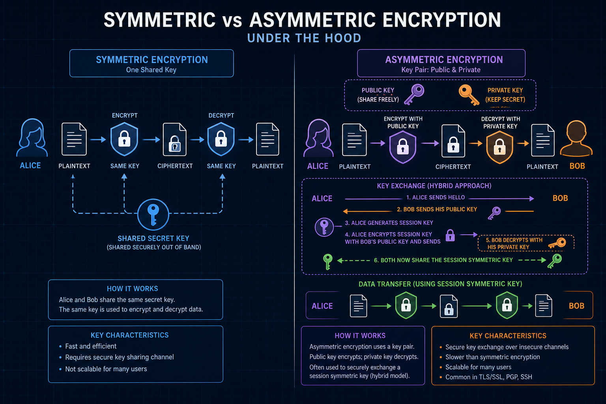
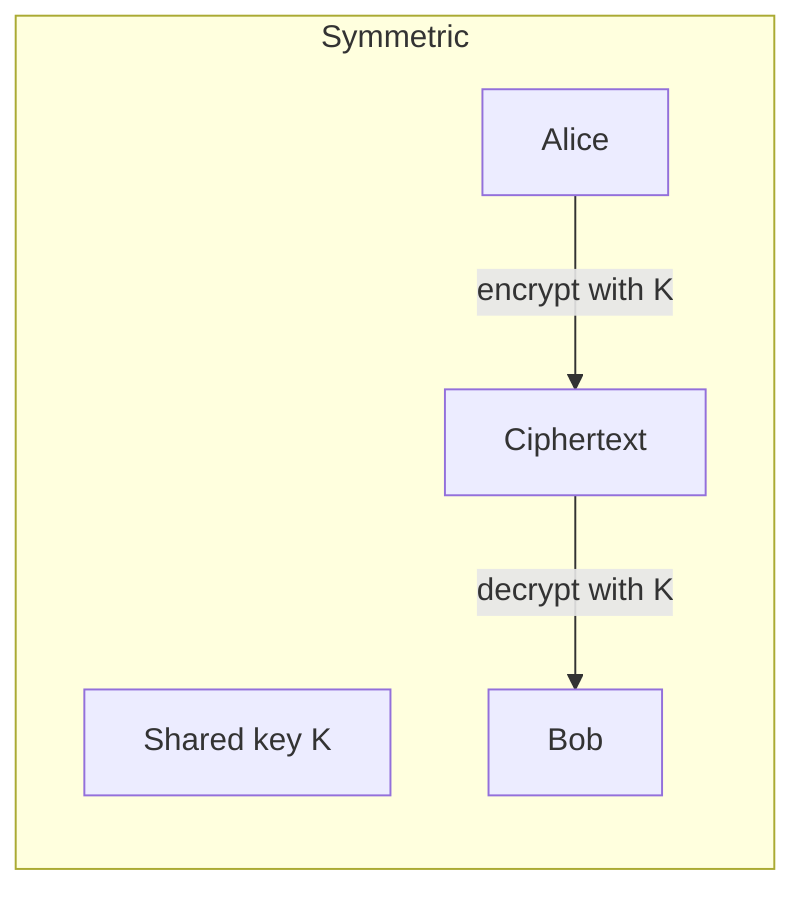
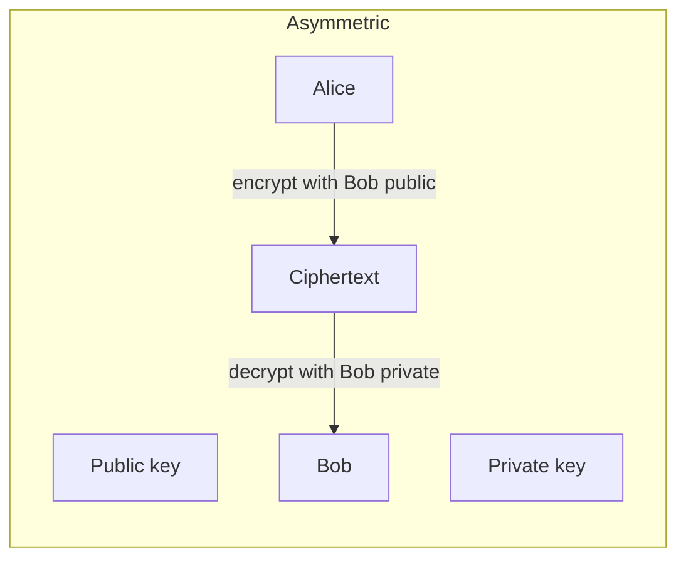
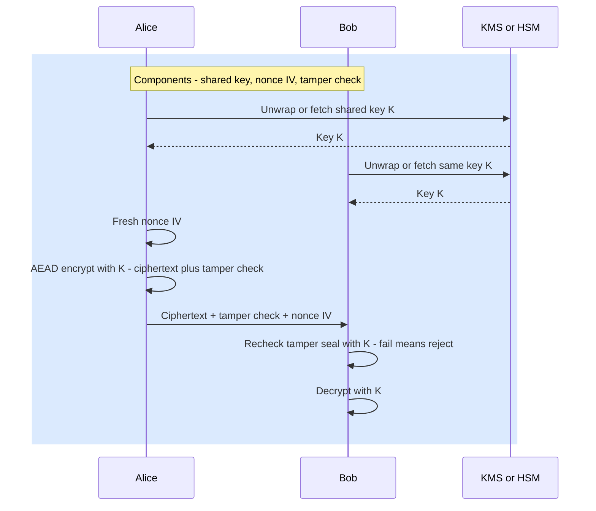
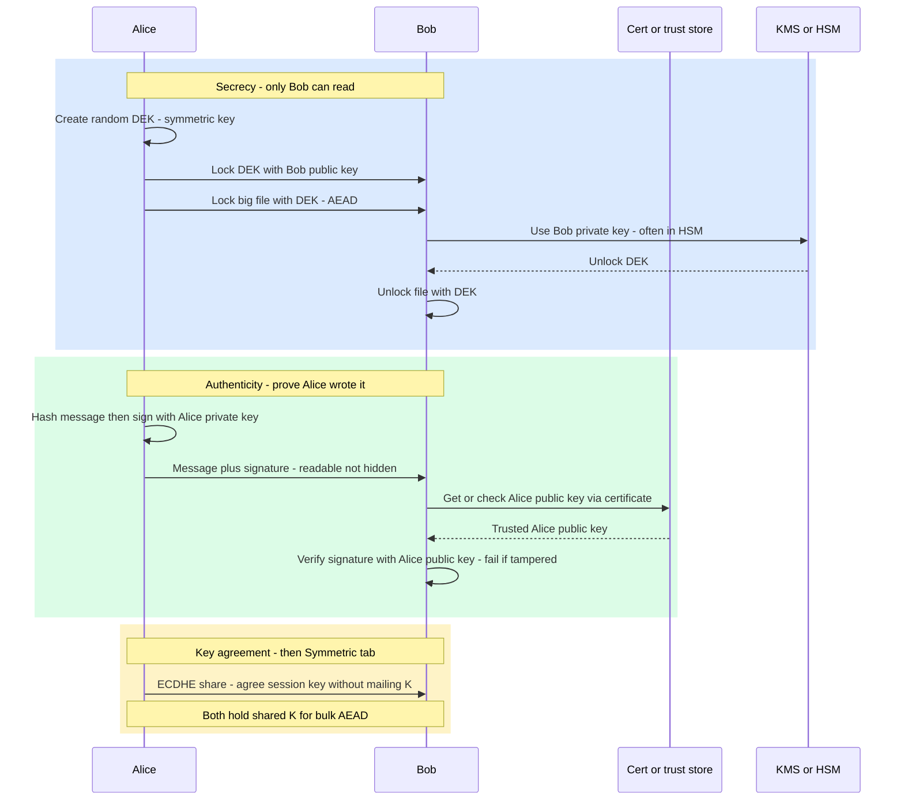
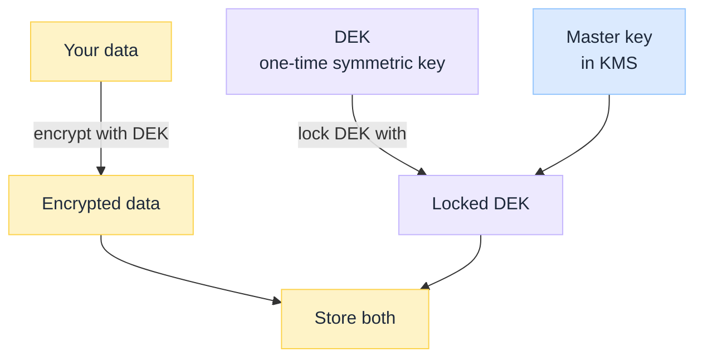

import Tabs from '@theme/Tabs';
import TabItem from '@theme/TabItem';

 

# Symmetric vs Asymmetric Encryption Under the Hood

*Bulk traffic is almost never encrypted with RSA directly. Trust starts with key pairs; speed runs on shared secrets.*

Most engineers hear: **symmetric = one key; asymmetric = public/private.** Correct. Incomplete. The hard problem is usually **key distribution**: how do strangers share a secret without leaking it? Production systems answer with a hybrid: asymmetric (or a KEM) to authenticate and agree a secret; symmetric algorithms (AES-GCM, ChaCha20-Poly1305, …) to protect the bytes that matter at volume: TLS records, disks, database fields.

:::tip[THE CLAIM]
**Asymmetric crypto solves key distribution and identity. Symmetric crypto solves bulk confidentiality and integrity at speed.** Modern TLS, envelope encryption, and most “encrypt the API” designs are hybrids. Treating one as a full replacement for the other is the root design error.
:::

<!-- truncate -->

## The bottom line first

- **Symmetric:** same secret for encrypt and decrypt. Fast. Prefer modes that also attach a **tamper seal** (AES-GCM, …). Hard part: **sharing and storing** the secret safely.
- **Asymmetric:** key **pair**. Public key can encrypt or verify; private key decrypts or signs. Slower. Hard part: **protecting the private key** and **trusting** the public key.
- **The real question is not “which is more secure.”** It is key size, algorithm choice, and how you store and distribute keys. A leaked AES key loses; a leaked RSA private key loses.
- **Encrypt ≠ sign.** Encryption hides content. Signatures prove origin/integrity. Different keys, different goals.
- **TLS / HTTPS:** handshake uses asymmetric (certs + ECDHE/KEM) to set up trust; record protection uses **symmetric** session keys.
- **At rest:** often a data key (symmetric) wrapped by a KMS master key (asymmetric or HSM-backed).
- **Pick by problem:** shared secret channel you control → symmetric; bootstrap trust over an open network → asymmetric + PKI (then switch to symmetric).

## What they actually are

<Tabs groupId="crypto-kind">
  <TabItem value="symmetric" label="Symmetric" default>

 

Same secret on both sides. Alice encrypts with `K`; Bob decrypts with `K`.

  </TabItem>
  <TabItem value="asymmetric" label="Asymmetric">

 

Alice encrypts with Bob’s **public** key; only Bob’s **private** key opens it.

  </TabItem>
</Tabs>

| | **Symmetric** | **Asymmetric** |
| --- | --- | --- |
| **Keys** | One shared secret | Public + private pair |
| **Key distribution** | Must share `K` safely (or derive / unwrap it) | Public key can be published; private key never travels |
| **Speed** | Fast for large data | Slower; used on small secrets / signatures |
| **Typical key size** | 128 or 256-bit (e.g. AES) | Much longer (e.g. RSA 2048+) or shorter ECC keys with hard math |
| **What you get** | Confidentiality + integrity when you use AEAD | Confidentiality (encrypt to a recipient), authenticity, non-repudiation (sign) |
| **Main job** | Protect streams/blobs once keys exist | Authenticate, sign, wrap keys, agree keys |
| **Examples (use these)** | AES-GCM, ChaCha20-Poly1305 | RSA, ECDSA, ECDH/ECDHE, ML-KEM (post-quantum emerging) |
| **Legacy (avoid for new work)** | DES, 3DES, RC4, IDEA | Weak RSA sizes, broken padding modes |

Symmetric wins on **bulk bytes**. Asymmetric wins on **who holds which secret** over an open network. Production systems almost always use **both**.

### Components involved

The building blocks. Plain versions:

| Piece | What it is | Symmetric | Asymmetric |
| --- | --- | --- | --- |
| **Key / key pair** | The secret the math runs on | One **shared** secret both sides know (like a house key both roommates have). Anyone with `K` can read | A **pair**: public (ok to share) + private (must stay secret). Public is like a padlock others can lock; private is the key that opens it |
| **Block vs stream** | How plaintext is chopped for the cipher | **Block** (AES: fixed-size chunks) or **stream** (ChaCha: continuous). Prefer modern AEAD modes | Not the main mental model; you usually encrypt small blobs or run a handshake, not stream a whole disk with RSA |
| **Tamper check (auth tag)** | A short seal computed with the key and glued to the ciphertext | Modern modes (AES-GCM, ChaCha20-Poly1305) encrypt **and** seal in one step (**AEAD**). Bob recomputes the seal; if it does not match → someone changed the bytes → **reject**. Not a signature; same shared `K` | Cousin is a **signature**: proves *who* wrote it, not only that it was unchanged |
| **Nonce / IV** | A **one-time random number** sent with each encrypted message (usually not secret) | Required with AEAD: same key + same nonce twice can leak data. Fresh nonce every message | Not used the same way for “encrypt to Bob.” Signing has its own reuse rules |
| **Key agreement** | How strangers get a shared secret without mailing `K` | After agreement, both hold the same session key | ECDHE / Diffie-Hellman-style math (often inside TLS). Different from “RSA-encrypt the file” |
| **Certificate** | A signed document that binds a public key to a name | Not used. You already shared the secret somehow | “This public key belongs to `api.example.com`,” backed by a trusted CA. What browsers check for HTTPS |
| **KMS / HSM** | Safe place to keep keys so apps do not hardcode secrets | Often stores or **wraps** data encryption keys | Often guards the **private** or master key so it is hard to extract |

## How a flow works

Same building blocks as **Components involved** above. Each swim lane labels which pieces show up.

<Tabs groupId="crypto-flow">
  <TabItem value="symmetric" label="Symmetric" default>

Uses: **shared key**, **nonce/IV**, **tamper check (auth tag)**, optional **KMS**. Not used: certificate. **Key agreement** (if any) already happened; both sides hold `K`.

 

1. **Key:** same shared secret `K` on both sides (already shared, KDF, or **KMS**).
2. **Nonce / IV:** fresh one-time random for this message.
3. **Encrypt (block or stream AEAD):** plaintext → ciphertext **plus tamper check (auth tag)**.
4. Send ciphertext + tamper check + nonce. Peer verifies the seal, then decrypts with `K`.

  </TabItem>
  <TabItem value="asymmetric" label="Asymmetric">

A key pair does **two different jobs**. Mixing them is the classic crypto mistake.

| Job | Question it answers | What you do | Which key |
| --- | --- | --- | --- |
| **Secrecy** (confidentiality) | Can only **Bob** read this? | Encrypt (usually a small DEK) | Bob’s **public** lock; Bob’s **private** unlock |
| **Authenticity** (origin + integrity) | Did **Alice** write this, unchanged? | Sign a hash | Alice’s **private** seal; Alice’s **public** check |

**Secrecy** hides content. Think of locking a box with **Bob’s padlock** (his public key). Anyone can snap the padlock shut. Only Bob has the key that opens it (his private key). In practice you lock a small **DEK**, then encrypt the big file with that DEK (envelope).

**Authenticity** does **not** hide content. Think of a **wax seal** on a letter: everyone can read the letter; the seal shows it came from Alice and was not rewritten. Alice seals with her **private** key; Bob (or anyone) checks with her **public** key, usually after trusting that public key via a **certificate**.

 

**Secrecy steps**

1. Bob publishes his **public** key; **private** key stays with Bob (**KMS/HSM** if hardened).
2. Alice encrypts a **small** DEK with Bob’s public key, then encrypts the file with the DEK.
3. Only Bob unlocks the DEK with his private key → only Bob reads the file.

**Authenticity steps**

1. Alice hashes the message and **signs the hash with her private key**.
2. She sends **message + signature** (the message itself can stay readable).
3. Bob trusts Alice’s public key via a **certificate** (or already knows it), then verifies.
4. Match → Alice’s key and untampered. Fail → wrong person, wrong key, or change.

**Key agreement** (ECDHE) is a third job: strangers derive a shared session key without shipping `K`. After that, the **Symmetric** tab applies for bulk bytes.

| Goal | Component | Which key |
| --- | --- | --- |
| **Secrecy: encrypt for Bob** | Key pair | Bob’s **public** |
| **Secrecy: decrypt** | Key pair / KMS | Bob’s **private** |
| **Authenticity: sign** | Signature | Alice’s **private** |
| **Authenticity: verify** | Signature + certificate | Alice’s **public** |

Common myth: “encrypt with private, decrypt with public.” That is **authenticity** (signing), not **secrecy**. **Signing** uses your private key; **encrypting for someone** uses their public key.

  </TabItem>
</Tabs>

:::tip[TAKEAWAY]
**Symmetric moves bulk bytes. Asymmetric moves trust and small secrets.** Glue them with envelope encryption or a TLS-style handshake.
:::

## Where each is used

| Surface | Symmetric | Asymmetric |
| --- | --- | --- |
| **HTTPS / TLS records** | Session keys protect Application Data | Certs + key agreement (ECDHE, …) set up those keys |
| **SSH** | Session encryption after auth | Host keys / user keys authenticate |
| **JWT** | `HS256` (shared secret HMAC) | `RS256` / `ES256` (sign with private, verify with public) |
| **Disk / DB / file encryption** | DEK encrypts data (AES) | KMS wraps DEK with master key |
| **VPN / IPsec / WireGuard** | Session crypto | Identity and handshake material |
| **mTLS** | Symmetric after handshake | Client and server certs prove identity |
| **Secure email / document signing** | Optional body encryption via hybrid | Signatures and cert chains |
| **Code / firmware signing** | Rarely the outer model | Signatures and cert chains |

For one HTTPS call by phase (TCP → handshake → session keys → AEAD records), see [HTTPS Encryption Lifecycle Under the Hood](/insights/https-encryption-lifecycle-under-the-hood).

### Hybrid pattern (envelope encryption)

Big files use fast **symmetric** crypto. Asymmetric / KMS only protects a **small key**, not every byte. Same hybrid idea as TLS: handshake or wrap is expensive; bulk traffic is AES (or ChaCha).

 

1. Make a random **DEK** (symmetric).
2. Encrypt the data with that DEK.
3. Encrypt (**wrap**) the DEK with the **master key** in KMS.
4. Store: encrypted data + locked DEK.

Steal the disk → you get both blobs, but not the master key → you cannot unlock the DEK → data stays unread. Same idea as TLS: slow crypto sets up keys; fast crypto moves the bytes.

## Use cases: how to choose

| Need | Prefer | Why |
| --- | --- | --- |
| Encrypt high-volume traffic, disks, or large files | **Symmetric** (after keys exist) | Performance |
| Prove a server is `api.example.com` on the open internet | **Asymmetric + PKI certs** | Public verifiable without a pre-shared secret per client |
| Two services in one VPC that already share a secret | **Symmetric** (or mTLS if you want identity beyond a string secret) | Simpler ops if secret distribution is solid |
| Non-repudiation / artifact signing | **Asymmetric signatures** | Private key implies signer |
| Rotate data keys often without re-encrypting the world | **Envelope** (new DEK, re-wrap) | Ops flexibility |
| Browser ↔ public API | **TLS hybrid** (do not invent your own) | Use the platform |
| “Which is more secure, symmetric or asymmetric?” | **Wrong question** | Ask: algorithm + key length + who holds keys + how keys move |

## Failure modes

| Mistake | What goes wrong |
| --- | --- |
| Reuse nonce/IV with same AES-GCM key | Catastrophic confidentiality/integrity failure |
| “Encrypt with private key” for secrecy | Wrong primitive; you wanted sign or recipient public encrypt |
| “Asymmetric is always more secure” | Ignores key custody; a leaked private key or weak RSA size still loses |
| Ship private key in the app binary | Anyone extracts trust |
| Trust-all / disable hostname verify | HTTPS becomes cleartext theater |
| One long-lived symmetric key for everything | Blast radius = entire estate |
| Asymmetric-encrypt huge payloads | Latency, size limits, wrong design |
| Keep DES / 3DES / RC4 in new systems | Broken or withdrawn; use AES-GCM or ChaCha20-Poly1305 |

## Why it still matters

Service meshes, KMS, JWT libraries, and TLS terminate in different places. Architects must say **which key**, **who holds it**, and **which algorithm class** protects data in transit vs at rest. Compliance questionnaires ask that; so do real incidents.

Ask: where is the private/master key, how is the DEK wrapped, and does TLS terminate before the data is “safe”? If vague, crypto is unowned.

## Final takeaway

Symmetric cryptography is the workhorse for **bytes**. Asymmetric cryptography is the workhorse for **trust and key bootstrap**. HTTPS, SSH, and envelope encryption succeed because they use **both**. Design the hybrid on purpose; do not pick a side like a sports team.
