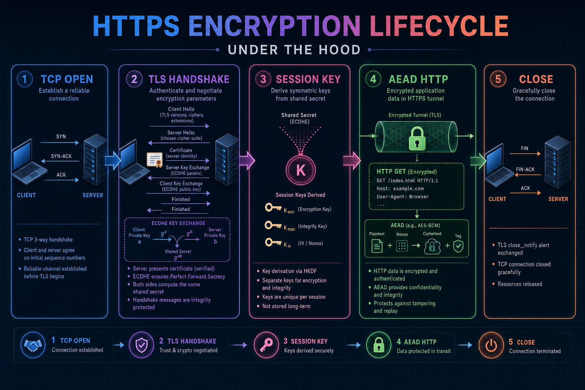
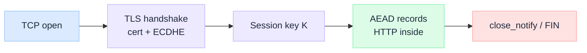
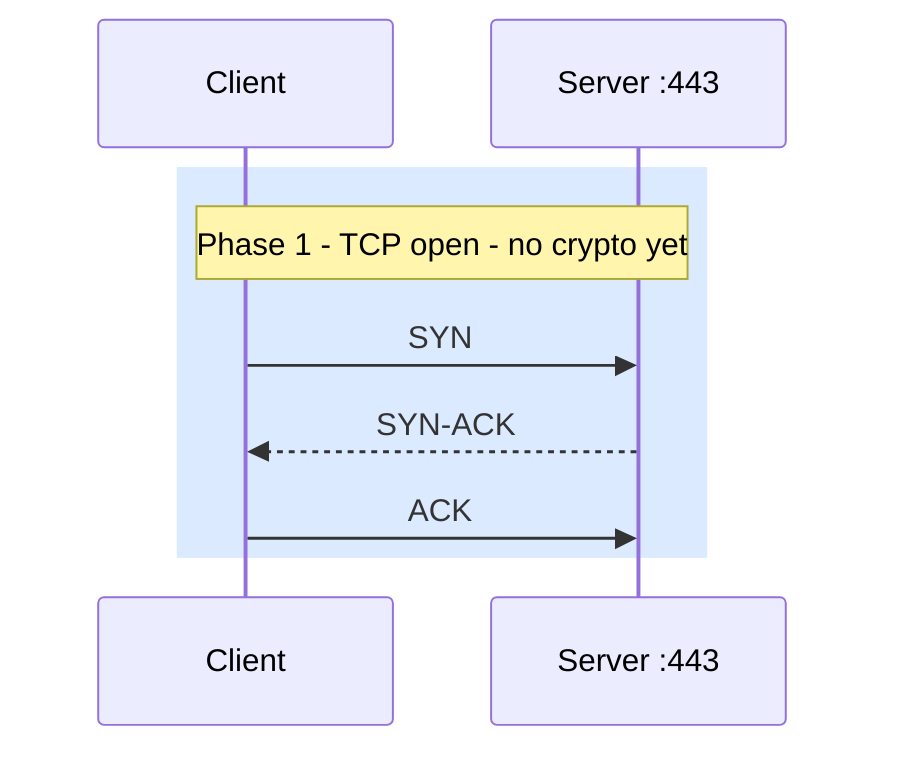
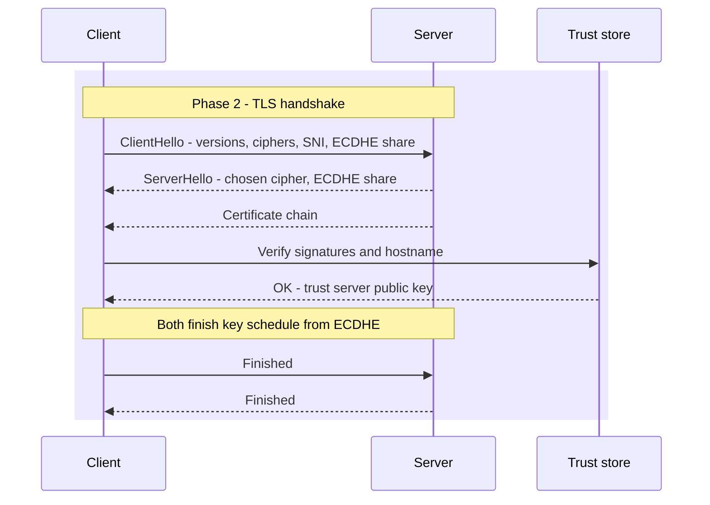
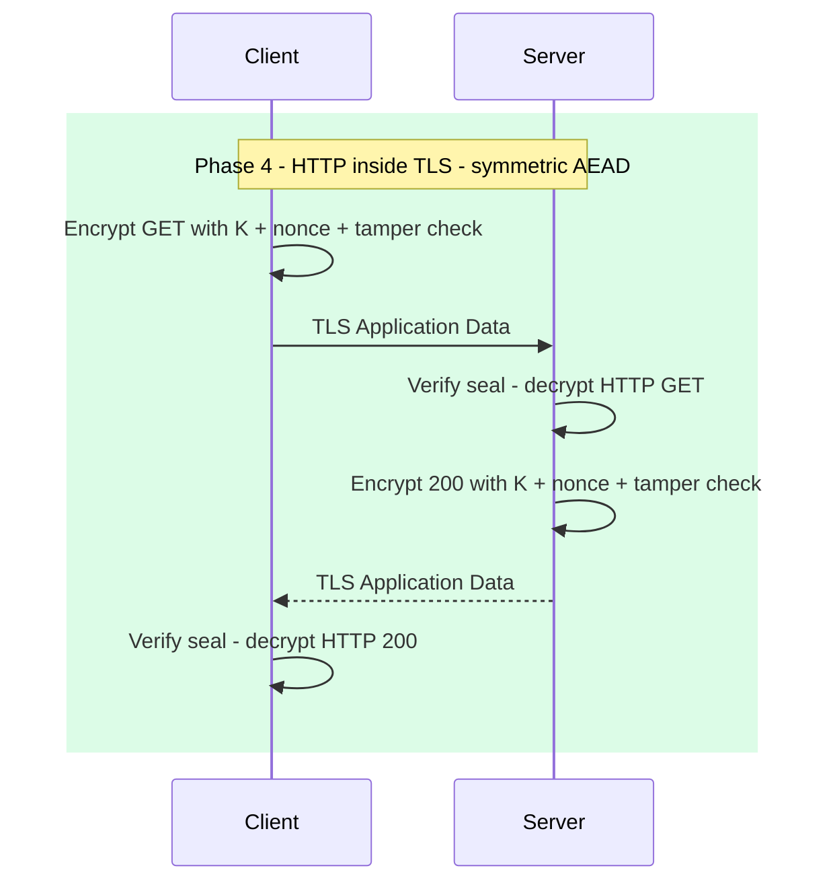
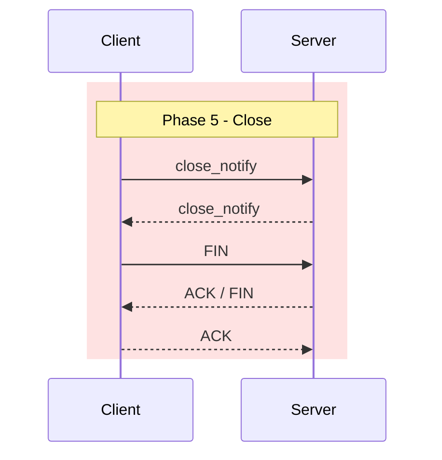
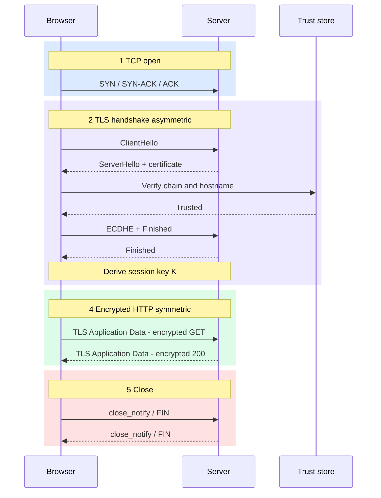

 

# HTTPS Encryption Lifecycle Under the Hood

*The padlock is not “RSA encrypt the whole page.” It is a short asymmetric bootstrap, then fast symmetric crypto on every TLS record.*

Most engineers know HTTPS means “HTTP over TLS.” Fewer can name **when** the certificate matters, **when** ECDHE runs, and **when** AES-GCM actually protects `GET /api/orders`. That gap shows up in wrong debugging: blaming the API for a handshake failure, or assuming the load balancer “keeps HTTPS all the way to the pod.”

This piece walks **one full HTTPS call** on classic TCP `:443`: open → handshake → session keys → encrypted HTTP → close. HTTP/3 (QUIC) uses the same crypto ideas on UDP; the wire shape differs (see TCP vs UDP Under the Hood).

:::tip[THE CLAIM]
**Asymmetric crypto proves who you are talking to and helps agree a secret. Symmetric crypto (AEAD) protects every Application Data record after that.** Design and debug by phase. Do not treat “HTTPS” as one undifferentiated blob.
:::

<!-- truncate -->

## The bottom line first

- **One call lifecycle:** TCP open → TLS handshake → derive session keys → AEAD-protect HTTP → teardown.
- **Certificate = identity,** not bulk encryption of your JSON.
- **ECDHE (key agreement)** produces a shared session secret without mailing that secret as one ciphertext blob.
- **Bulk traffic** uses AES-GCM or ChaCha20-Poly1305 with a session key, nonce, and tamper check per record.
- **TLS ends where something terminates it** (browser, LB, ingress, sidecar). The next hop is a new trust decision.
- **Debug by layer:** TCP connect vs TLS alert vs HTTP status. They fail differently.

## What “end to end” means here

Here **end to end** means **one client↔server TLS session for one call** (or one connection reused for keep-alive). It does **not** automatically mean “encrypted from browser to application process with no decrypt in between.”

| Claim people say | What is usually true |
| --- | --- |
| “HTTPS end to end” | Encrypted to the **TLS terminator** |
| Terminator = app | Rare in enterprise; often LB / ingress / mesh |
| Hop after terminate | Cleartext or **new** TLS (re-encrypt) unless you designed otherwise |
| True app-to-app E2E | Needs mTLS, message-level crypto, or no middlebox decrypt |

Companion framing: [HTTP vs HTTPS Under the Hood](/insights/http-vs-https-under-the-hood) for cleartext vs TLS wrap; [Symmetric vs Asymmetric Encryption Under the Hood](/insights/symmetric-vs-asymmetric-encryption-under-the-hood) for why the hybrid exists.

## Components on the path

| Piece | Role in this lifecycle |
| --- | --- |
| **TCP** | Ordered byte pipe on `:443` before any TLS (HTTP/1.1 and HTTP/2). See [/insights/tcp-vs-udp-under-the-hood](/insights/tcp-vs-udp-under-the-hood). |
| **Certificate** | Binds a **public** key to a hostname; chain of **signatures** back to a trust store |
| **Server private key** | Proves the server owns the cert (signature or decryption in older modes). Does **not** encrypt every HTTP byte in modern TLS |
| **Key agreement (ECDHE)** | Client and server contribute randomness; both derive the same shared secret |
| **Session keys** | Short-lived **symmetric** keys for this connection (or resumed session) |
| **Nonce / IV** | Fresh per TLS record (or carefully constructed); reuse with same key is catastrophic |
| **Tamper check (AEAD tag)** | Seal on each record; bad seal → reject, do not trust the plaintext |
| **SNI** | Hostname often sent in ClientHello so the server picks the right cert (visibility depends on TLS version / ECH) |

 

## Phase 1: TCP open

Nothing is encrypted yet. Client and server complete the TCP three-way handshake on port **443** (convention, not magic).

 

| If this fails | Typical cause |
| --- | --- |
| Timeout / no SYN-ACK | Firewall, wrong IP, dead host, routing |
| Connection refused | Nothing listening on `:443` |
| Works then TLS fails | Transport is fine; problem is Phase 2+ |

DNS already answered “where is this name?” before this phase. See [/insights/dns-under-the-hood](/insights/dns-under-the-hood).

:::tip[TAKEAWAY]
**No session key exists after TCP alone.** A green TCP connect is not “HTTPS is healthy.”
:::

## Phase 2: TLS handshake

Goal: **authenticate the server** (usual browser case) and run **key agreement** so both sides can derive session secrets. Optional: client certs (**mTLS**) so the server authenticates the client too.

Simplified modern shape (TLS 1.2/1.3 ideas; exact messages differ by version):

 

### Certificate verify (asymmetric)

1. Server sends leaf cert + intermediates.
2. Client checks signatures up to a **root in its trust store**.
3. Client checks the URL hostname matches SAN/CN.
4. Failures look like: expired, wrong host, incomplete chain, unknown private CA, clock skew.

This step proves **identity**. It does not encrypt your POST body.

### Key agreement (ECDHE)

Client and server each have an ephemeral ECDHE key pair for this handshake. They exchange public shares. From those shares (plus handshake transcripts and secrets), both run a **key schedule** and get the same traffic secrets. The long-term cert private key is used to **authenticate** (sign) in TLS 1.3, not to RSA-encrypt every megabyte.

Older “RSA key transport” modes shipped a premaster secret encrypted to the server public key. Modern deployments prefer ECDHE for **forward secrecy**: steal the server private key later → old recorded sessions stay hard to decrypt.

| Handshake job | Primitive class | Outcome |
| --- | --- | --- |
| Prove `api.example.com` | **Asymmetric** (cert signatures) | Trusted server public identity |
| Agree shared secret | **Asymmetric** math (ECDHE) | Input to key schedule |
| Optional client identity | **Asymmetric** (client cert) | mTLS |

:::tip[TAKEAWAY]
**Handshake = trust + agree secrets.** Your JSON is still not on the wire in clear Application Data form until Phase 4.
:::

## Phase 3: Derive session keys

After ECDHE and the handshake transcript, both sides compute **symmetric** traffic keys (and IVs / nonces as the AEAD requires). Think of one logical session key material `K` (in reality: separate keys for each direction and purpose).

| Property | Why it matters |
| --- | --- |
| **Short-lived** | Blast radius of leak is this connection / ticket lifetime |
| **Symmetric** | Fast enough for every record |
| **Never “the cert private key”** | Cert key is long-term identity; session keys are ephemeral |
| **Both sides compute locally** | `K` is not emailed as a single AES key blob |

Session **resumption** (tickets / PSK) can skip a full handshake next time. You still end with symmetric traffic keys. Cryptographically it is a shortcut of Phase 2, not a different Phase 4 model.

:::tip[TAKEAWAY]
**Session keys are the bridge.** Asymmetric work produced trust and shared secrets; from here on, bulk protection is symmetric AEAD.
:::

## Phase 4: Encrypted HTTP

HTTP is unchanged as an application protocol: method, path, headers, status, body. Those bytes become the **plaintext** inside TLS **Application Data** records. Each record is protected with AEAD (commonly **AES-GCM** or **ChaCha20-Poly1305**):

1. Take plaintext HTTP bytes (or a chunk of them).
2. Encrypt with session key + **nonce**.
3. Attach **tamper check** (auth tag).
4. Put the result in a TLS record on the TCP stream.

 

| On the wire (no keys) | After decrypt at an endpoint |
| --- | --- |
| Opaque TLS records | `GET /orders HTTP/1.1` … |
| Cipher suite name in handshake logs | `200` + JSON body |
| SNI / cert metadata (varies) | Same HTTP semantics as cleartext HTTP |

Path observers without keys see **ciphertext**, not your Authorization header (with the usual caveats: SNI, IP, timing, length side channels).

HTTP/2 multiplexes streams inside the same TLS connection. Still one TLS record layer; still symmetric after the handshake.

:::tip[TAKEAWAY]
**Bulk HTTPS traffic is symmetric AEAD on session keys.** If you are RSA-encrypting large HTTP bodies yourself, you reinvented a worse TLS.
:::

## Phase 5: Close and resume

Orderly close typically includes TLS **`close_notify`** then TCP **`FIN`/`ACK`**. Abrupt close can be TCP **`RST`** or a dropped path; apps see connection errors, not clean HTTP statuses.

 

| Event | Crypto meaning |
| --- | --- |
| New TCP + full handshake | New ECDHE, new session keys |
| Keep-alive / HTTP/2 reuse | Same TLS session; more Application Data with same keys |
| Session ticket / PSK resume | Faster re-entry; still AEAD with (derived) traffic keys |
| Server restart mid-session | Client often sees reset; must reconnect and handshake again |

## Where TLS ends

| Topology | Encrypts to | Risk if misunderstood |
| --- | --- | --- |
| Browser → origin app | App process | Simplest mental model |
| Browser → LB → app (TLS terminate at LB) | LB | Path LB→app may be cleartext in VPC |
| Browser → ingress → mesh sidecar → app | Each hop’s policy | Multiple trust boundaries |
| mTLS service-to-service | Peer identity per hop | Still not “browser private to DB” |

Ask in design reviews: **Who has plaintext after decrypt?** If the answer is vague, compliance and incident response will be too.

## Failure modes

| Symptom | Likely phase | Wrong blame |
| --- | --- | --- |
| Connect timeout | TCP / network | “API is down” when DNS or firewall |
| `CERT_DATE_INVALID`, hostname mismatch | Handshake (cert) | “Backend 500” |
| TLS alert / handshake failure | Cipher / version / cert / client auth | App business logic |
| HTTP 401 / 500 after padlock | Application (Phase 4 plaintext) | “TLS is broken” |
| Works in browser, fails in curl/Java | Trust store / SNI / TLS version | Random “network flake” |
| Intermittent after idle | Middlebox / LB idle timeout | App bug only |

## Full call map

| Phase | Symmetric or asymmetric? | What you should remember |
| --- | --- | --- |
| **1 TCP open** | Neither | Pipe only |
| **2 Handshake** | **Asymmetric** | Cert verify + ECDHE |
| **3 Session keys** | Hybrid → **symmetric keys** | Local derive, short-lived |
| **4 HTTP records** | **Symmetric AEAD** | Nonce + tamper check every record |
| **5 Close** | Symmetric until last record | Then tear down TCP |

 

## Final takeaway

HTTPS succeeds because it is a **deliberate hybrid**: certificates and ECDHE for **trust and key bootstrap**, AES-GCM (or ChaCha) for **bytes at speed**. One call is five phases, not one magic padlock. Know which phase owns the key, who terminates TLS, and which failure belongs to TCP, handshake, or HTTP, and you stop treating crypto as a sports team and start treating it as an architecture contract.
