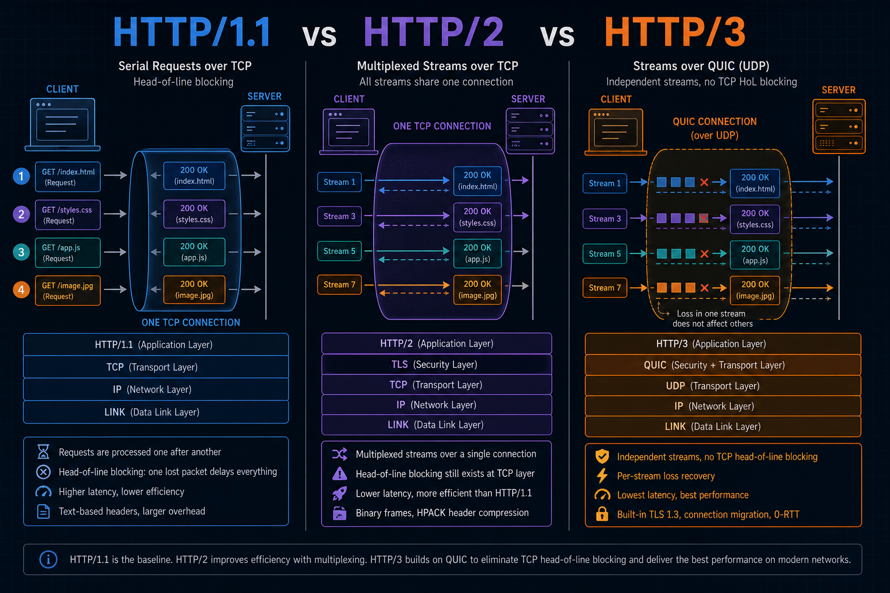
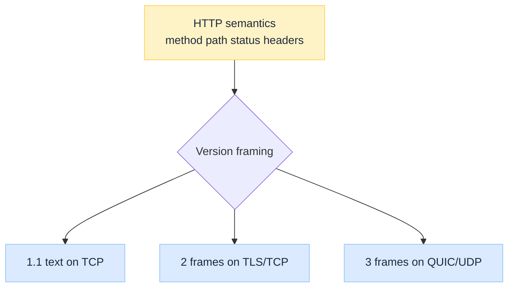
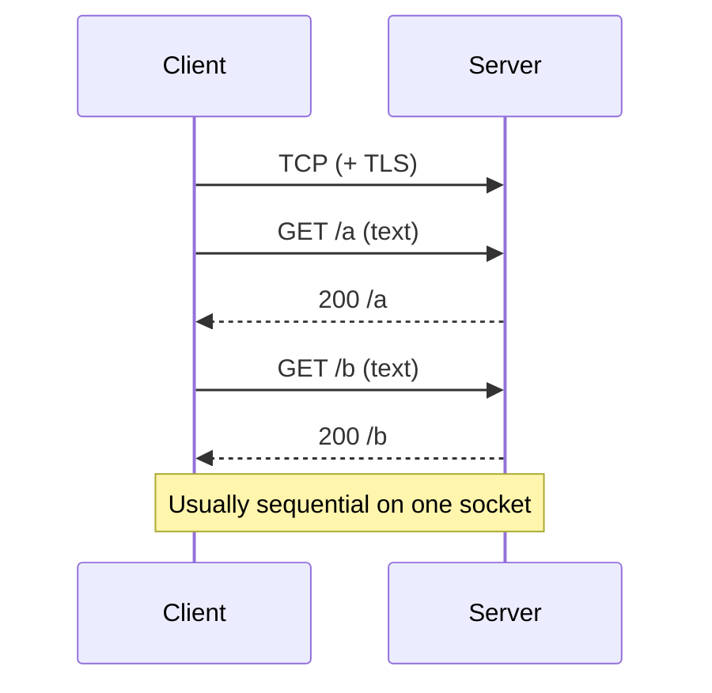
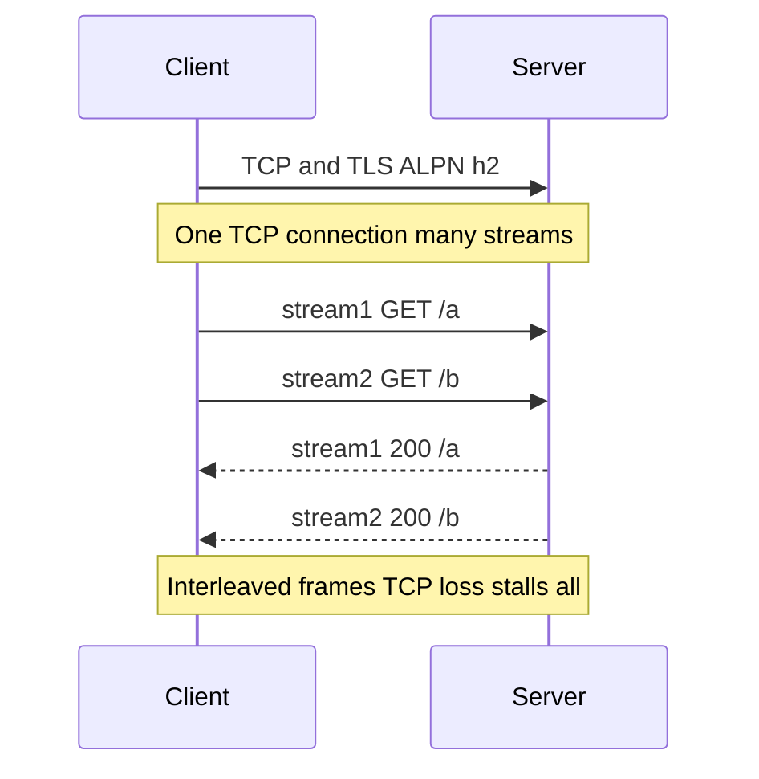
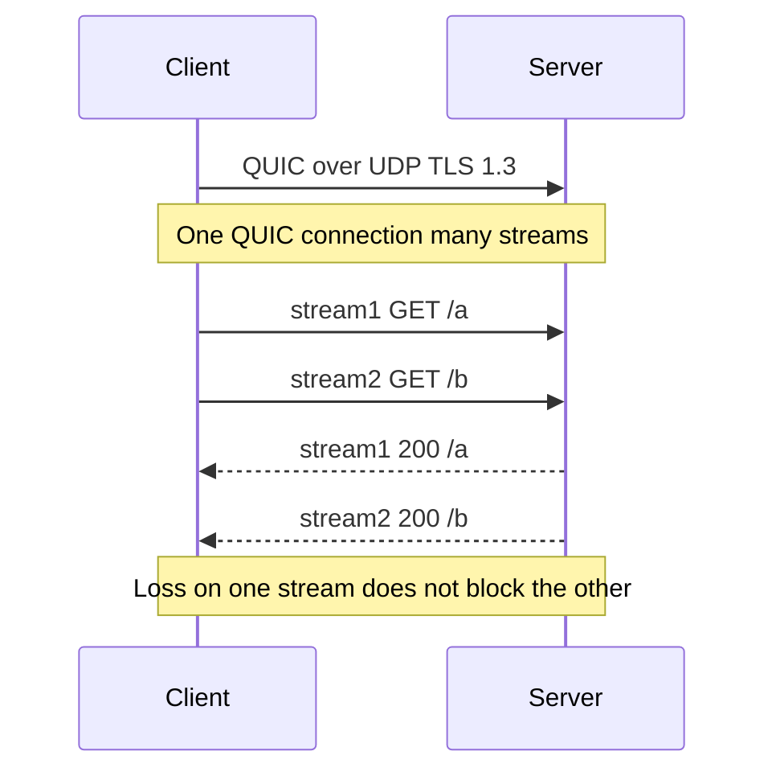

import Tabs from '@theme/Tabs';
import TabItem from '@theme/TabItem';

 

# HTTP/1.1 vs HTTP/2 vs HTTP/3 Under the Hood

*`GET /api` still means GET. What changed is how many of those messages share a connection, how headers ride on the wire, and whether a lost packet stalls every other request.*

Most engineers know the slogan: **HTTP/2 is faster; HTTP/3 is the new one.** That skips the contracts. HTTP/1.1 is mostly text on TCP. HTTP/2 multiplexes binary streams on one TLS/TCP pipe but still suffers **TCP head-of-line blocking**. HTTP/3 moves HTTP onto **QUIC (UDP)** so streams recover loss independently. Misread that and you debug "slow page" as an app bug when the browser is stuck behind one lost TCP segment.

:::tip[THE CLAIM]
**HTTP version is a delivery contract, not a new REST language.** Methods, paths, and status codes stay. Framing, multiplexing, header compression, and the transport under TLS change, and that is where head-of-line blocking lives or dies.
:::

<!-- truncate -->

## The bottom line first

- **Same application model:** request/response, methods, status, headers (semantics).
- **HTTP/1.1:** text messages on **TCP**; keep-alive reuses connections; parallel work often means many connections.
- **HTTP/2:** binary **frames** + **multiplexed streams** on one **TLS/TCP** connection; HPACK compresses headers; TCP loss can still stall all streams.
- **HTTP/3:** HTTP over **QUIC on UDP**; TLS 1.3 integrated; stream-level loss recovery; different handshake and ops story.
- **HTTPS still applies:** 1.1 and 2 wrap TLS over TCP; 3 embeds crypto in QUIC. See [HTTP vs HTTPS](/insights/http-vs-https-under-the-hood).
- **Pick by constraint:** legacy middleboxes and simple debug → 1.1; modern web/API on TCP → 2; lossy networks / wanting QUIC → 3.

## What stays the same

| Layer | Still true across 1.1 / 2 / 3 |
| --- | --- |
| **Semantics** | `GET`, `POST`, status `200` / `404`, `Host`, `Content-Type`, … |
| **URLs** | Scheme, authority, path, query |
| **App mental model** | Client sends a request; server returns a response |
| **"HTTPS" in the browser** | User-facing secure origin; padlock story unchanged |

What changes is the **session and framing** under that message.

 

---

## HTTP/1.1

### What it is

HTTP/1.1 is the classic web protocol most people still picture: a **text** request line and headers, optional body, then a text status line and headers. It rides **TCP** (cleartext `:80` or TLS `:443` for HTTPS).

**Keep-alive** reuses one TCP connection for many requests in sequence. **Pipelining** (send several requests without waiting) existed but is fragile and largely unused. Browsers opened **many parallel TCP connections** per origin to fake concurrency.

### Head-of-line (application)

On one connection, response N usually waits until response N-1 finishes. A large or slow response blocks the next request on that socket.

### When it still appears

- Simple tools (`curl` defaults), old clients, some corporate proxies
- Cleartext debugging on `:80`
- Servers that never negotiated h2/h3

:::tip[TAKEAWAY]
**HTTP/1.1 buys simplicity and universal support.** Concurrency costs extra TCP (and often TLS) handshakes.
:::

---

## HTTP/2

### What it is

HTTP/2 keeps HTTP semantics but changes the wire to **binary frames** on a single connection (almost always **TLS** in browsers; ALPN negotiates `h2`). Multiple **streams** carry requests/responses **concurrently** on that one TCP socket. **HPACK** compresses headers.

Server push existed; many deployments disable or ignore it. **gRPC** typically runs on HTTP/2.

### Head-of-line (TCP)

Streams are independent at the HTTP layer, but they share one **TCP** byte stream. A lost TCP packet can stall **all** streams until retransmission fills the gap. That is **TCP HOL blocking**, the main reason HTTP/3 exists.

### When it wins

- Modern browsers and APIs over TLS
- Many small objects (JS/CSS/APIs) without opening 6+ connections
- Multiplexed RPC (gRPC)

:::tip[TAKEAWAY]
**HTTP/2 fixes HTTP-level HOL on one connection.** It does not fix TCP-level HOL when the network drops packets.
:::

---

## HTTP/3

### What it is

HTTP/3 maps HTTP semantics onto **QUIC**, which runs over **UDP**. Crypto is **TLS 1.3 integrated into QUIC** (not a separate TLS record layer over TCP). Streams are first-class in QUIC: loss on one stream should not block others the way TCP HOL does.

Browsers still show `https://`. Discovery often uses **Alt-Svc** / HTTPS DNS records / prior knowledge after an h2 connection.

### What changes operationally

| Topic | Implication |
| --- | --- |
| **UDP** | Firewalls and some corp networks still treat UDP oddly |
| **Connection IDs** | QUIC can survive some NAT/path changes better than TCP 4-tuples |
| **CPU / offload** | Kernel TCP offload habits do not always apply the same way |
| **Debug** | Wireshark/QUIC decryption and "is UDP filtered?" become first questions |

Transport companion: [TCP vs UDP Under the Hood](/insights/tcp-vs-udp-under-the-hood). TLS companion: [HTTPS Encryption Lifecycle](/insights/https-encryption-lifecycle-under-the-hood).

:::tip[TAKEAWAY]
**HTTP/3 is HTTP over QUIC.** Same web meaning; different loss and handshake physics on UDP.
:::

---

## Side-by-side matrix

| | **HTTP/1.1** | **HTTP/2** | **HTTP/3** |
| --- | --- | --- | --- |
| **Wire format** | Text | Binary frames | Binary frames (QUIC) |
| **Transport** | TCP | TCP | UDP (QUIC) |
| **Typical secure stack** | TLS over TCP | TLS over TCP | TLS 1.3 in QUIC |
| **Multiplexing** | Weak (many conns) | Streams on one conn | Streams on one QUIC conn |
| **Header compression** | None (raw) | HPACK | QPACK |
| **HOL risk** | Per-connection app HOL | TCP HOL across streams | Stream-local loss recovery |
| **ALPN / token** | `http/1.1` | `h2` | `h3` |
| **Browser default goal** | Fallback | Common | Growing where UDP works |

---

## Request path walkthrough

One tab per version: short steps, then a swim lane.

<Tabs groupId="http-version-path">
  <TabItem value="h1" label="HTTP/1.1" default>

1. Resolve name → TCP connect (and TLS if HTTPS).
2. Send one text request on the connection.
3. Read the full response (or until connection rules say stop).
4. Next request on the same keep-alive connection, or open another TCP conn for parallelism.

 

  </TabItem>
  <TabItem value="h2" label="HTTP/2">

1. TCP + TLS; ALPN selects `h2`.
2. Client opens multiple streams; each carries a request.
3. Frames from different streams interleave on one TCP connection.
4. A lost TCP segment can pause delivery for every stream until recovered.

 

  </TabItem>
  <TabItem value="h3" label="HTTP/3">

1. UDP path to server; QUIC + TLS 1.3 handshake (or 0-RTT when allowed).
2. Open QUIC streams for concurrent requests.
3. Loss on one stream is recovered without TCP-style global HOL.
4. If UDP is blocked, client falls back to h2/1.1 over TCP.

 

  </TabItem>
</Tabs>

---

## When to care

| Situation | Lean toward |
| --- | --- |
| Public website, modern browsers, TLS terminated at edge/CDN | **HTTP/2** (and **HTTP/3** if edge supports UDP well) |
| Internal tools, strict firewalls, UDP filtered | **HTTP/1.1** or **HTTP/2** on TCP |
| gRPC / many concurrent RPCs | **HTTP/2** |
| Mobile / lossy Wi-Fi, wanting fewer stall-all-streams events | **HTTP/3** where available |
| Packet capture teaching / simplest mental model | **HTTP/1.1** cleartext lab, then HTTPS |

CDNs and edges often speak h2/h3 to clients while origins still speak 1.1 or 2 upstream. Own each hop. See [CDN Under the Hood](/insights/cdn-under-the-hood).

## Common mistakes

| Mistake | Why it hurts |
| --- | --- |
| **"HTTP/2 removed all HOL"** | TCP HOL remains on h2 |
| **"HTTP/3 is UDP video / unreliable"** | QUIC is reliable; UDP is only the substrate |
| **Forcing h3 through a UDP-hostile network** | Silent fallback or breakage; measure |
| **Debugging status codes when TLS/ALPN failed** | Wrong layer; split TCP, TLS, HTTP |
| **Assuming origin speaks h3 because the browser did** | Edge may terminate; origin protocol is separate |

## Final takeaway

HTTP/1.1, HTTP/2, and HTTP/3 share one application vocabulary. They disagree on **framing, multiplexing, and transport**. **1.1** is simple text on TCP. **2** multiplexes on TLS/TCP but can still stall on packet loss. **3** moves that multiplexing onto QUIC over UDP so streams fail more independently. Treat version choice as a performance and path-reliability decision, not a new API style.

:::info[Builds on]
[HTTP vs HTTPS Under the Hood](/insights/http-vs-https-under-the-hood) · [HTTPS Encryption Lifecycle Under the Hood](/insights/https-encryption-lifecycle-under-the-hood) · [TCP vs UDP Under the Hood](/insights/tcp-vs-udp-under-the-hood) · [CDN Under the Hood](/insights/cdn-under-the-hood)
:::

## Further reading

| Topic | Resource | Why read it |
| --- | --- | --- |
| **HTTP/1.1** | [RFC 9112: HTTP/1.1](https://www.rfc-editor.org/rfc/rfc9112.html) | Current text mapping of HTTP/1.1 on the wire |
| **Semantics** | [RFC 9110: HTTP Semantics](https://www.rfc-editor.org/rfc/rfc9110.html) | Shared meaning of methods, status, fields across versions |
| **HTTP/2** | [RFC 9113: HTTP/2](https://www.rfc-editor.org/rfc/rfc9113.html) | Frames, streams, HPACK relationship |
| **HTTP/3** | [RFC 9114: HTTP/3](https://www.rfc-editor.org/rfc/rfc9114.html) | HTTP mapping onto QUIC |
| **QUIC** | [RFC 9000: QUIC](https://www.rfc-editor.org/rfc/rfc9000.html) | Transport under HTTP/3 |
| **Primer** | [MDN: HTTP](https://developer.mozilla.org/en-US/docs/Web/HTTP) | Approachable overview and guides |
| **Chrome** | [HTTP/3 from Chromium](https://www.chromium.org/quic/) | Deployment and QUIC engineering notes |
