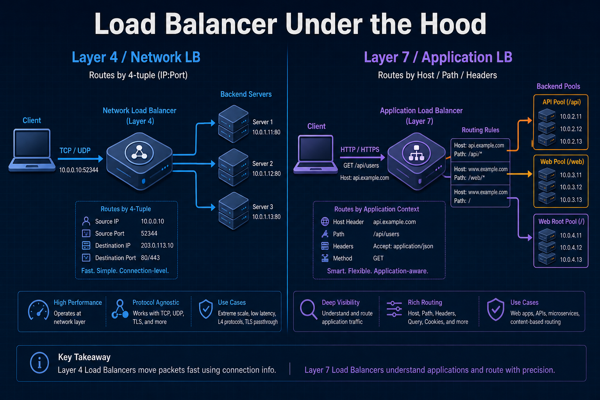
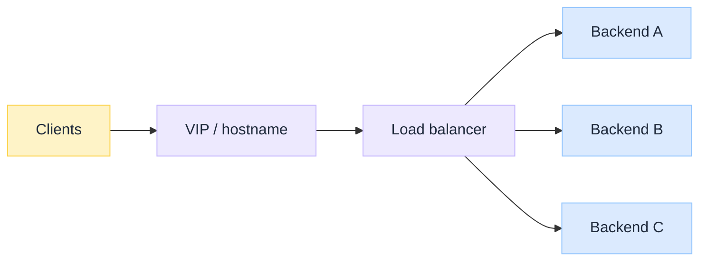
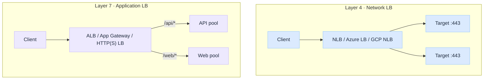
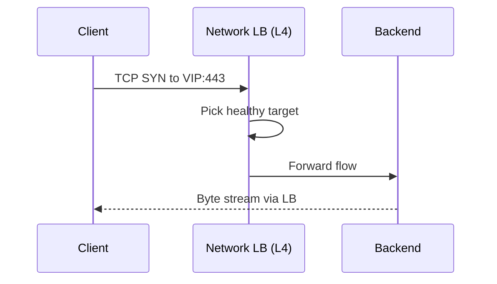
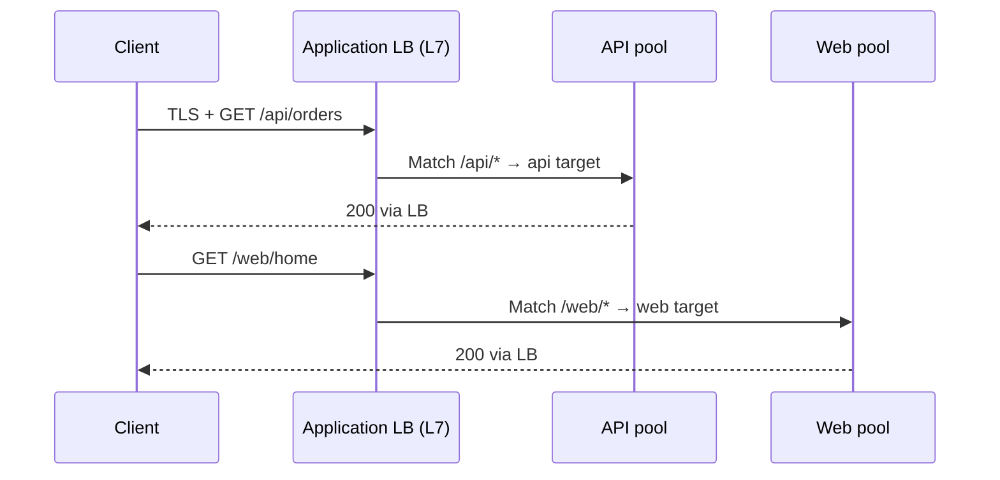

import Details from '@theme/Details';
import Tabs from '@theme/Tabs';
import TabItem from '@theme/TabItem';

<br/>


# Load Balancer Under the Hood

*DNS gave you an IP. TLS may wrap the bytes. Something still has to decide which of N healthy machines answers this connection or this request.*

Most engineers know a load balancer as "the box that spreads traffic across servers." That explanation is correct. It skips the OSI layer, what headers the balancer can read, and whether cloud "Network" vs "Application" load balancers are marketing or a real wire difference.

A load balancer sits in front of a **backend pool**. Clients talk to a **virtual IP** (or hostname that resolves to one). The balancer picks a healthy target, forwards traffic, and fails over when health checks fail. The hard part is *which layer* it balances on.

:::tip[THE CLAIM]
**Layer 4 balances connections (and packets) using IP and port. Layer 7 balances requests using application data (HTTP host, path, headers, cookies).** Cloud names map to that choice: Network Load Balancer ≈ L4; Application Load Balancer ≈ L7. Pick the layer for the decision you need, not the product brochure.
:::

<!-- truncate -->

## The bottom line first

- **Load balancer = VIP + pool + health + policy** in front of backends; clients should not pick a single instance forever.
- **L4 (network / transport):** sees TCP/UDP 4-tuple; fast, protocol-agnostic; cannot route on URL path.
- **L7 (application):** terminates (or inspects) HTTP/gRPC; routes on host, path, headers; often terminates TLS.
- **Network LB** (AWS NLB, Azure Load Balancer, GCP Network/Passthrough) ≈ **L4**.
- **Application LB** (AWS ALB, Azure Application Gateway, GCP HTTP(S) LB) ≈ **L7**.
- **CDN and DNS** steer *where* traffic enters a region or edge; the LB steers *which instance* inside that boundary. See [DNS](/insights/dns-under-the-hood), [CDN](/insights/cdn-under-the-hood), [Anycast vs Unicast](/insights/anycast-vs-unicast-under-the-hood).

## What a load balancer actually is

Without a balancer, clients hardcode one server (or one DNS A record). That host dies, restarts, or saturates, and the product dies with it.

A load balancer separates **service identity** (the VIP / hostname clients use) from **instance location** (which backend has capacity right now).


<br/>

### Components involved

| Component | Role |
| --- | --- |
| **VIP / listener** | Address and port clients connect to (`443`, `80`, …) |
| **Target / backend pool** | Instances, containers, IPs, or Lambda-style targets |
| **Health check** | Probe that marks a target in/out of rotation |
| **Scheduling policy** | Round-robin, least connections, consistent hash, weighted, … |
| **Security / TLS** | Optional terminate, passthrough, or re-encrypt to backends |

DNS answers "which IP owns this name?" (often the LB or a CDN in front). The load balancer answers "which healthy backend gets this connection or request?" Transport details: [TCP vs UDP Under the Hood](/insights/tcp-vs-udp-under-the-hood).

---

## Layer 4 load balancers (network / transport)

### What it is

A **Layer 4** load balancer works at the **transport** layer. It forwards **TCP or UDP** flows using network and transport headers: source IP, destination IP, source port, destination port (the **4-tuple**), plus protocol. It does **not** need to understand HTTP, gRPC framing, or URL paths.

Modes you will hear:

| Mode | Idea |
| --- | --- |
| **Pass-through / DSR-style** | Packets steered with minimal rewrite; backend may see client IP |
| **NAT / proxy L4** | Balancer owns the client connection and opens a second connection to the backend |

Either way, the *decision* is still L4: connection or flow affinity, not "`/api/v2` goes to pool B."

### What it sees (and does not)

| Sees | Does not see (without going L7) |
| --- | --- |
| IP, port, TCP/UDP, SYN/flow state | HTTP method, path, `Host`, cookies |
| Connection rate, bytes, RST/timeouts | JSON body, gRPC method name |
| TLS as opaque bytes (if not terminating) | Certificate SAN routing as HTTP logic |

### When to use

- Extreme throughput / low latency (millions of connections, thin proxy)
- Non-HTTP protocols: databases, MQTT, custom TCP, raw UDP, gaming
- TLS **passthrough** to backends that terminate TLS themselves
- Static or simple port-based services (`:5432`, `:6379`, `:443` as a pipe)

### When not to use

- You need path-based or host-based routing (`/api` vs `/web`)
- You need cookie stickiness, WAF, or header-based canaries
- You want the balancer to terminate TLS and inject identity headers

### Pros and cons

| Pros | Cons |
| --- | --- |
| Fast; low CPU per connection | No HTTP-aware routing |
| Protocol-agnostic | Limited observability of "requests" |
| Good for TCP/UDP and TLS passthrough | Sticky sessions usually mean source-IP hash, not cookies |
| Simple mental model | Wrong tool for microservices URL meshes |

<Details summary="L4 mental model (TCP flow to a backend)">

```text
Client                     L4 LB                         Backend
  |---- TCP SYN ---------->|                               |
  |                        |---- TCP SYN (chosen IP) ----->|
  |<--- TCP stream --------|<--- TCP stream ---------------|
  |     (balanced as one connection / flow)                |
```

Decision inputs: listener port, 4-tuple (or flow hash), health, algorithm. Not `GET /checkout`.

</Details>

:::tip[TAKEAWAY]
**L4 is a smart pipe distributor.** It is the right default when the app protocol is not HTTP, or when you must not inspect application bytes.
:::

---

## Layer 7 load balancers (application)

### What it is

A **Layer 7** load balancer understands the **application** protocol, almost always **HTTP/1.1, HTTP/2, or gRPC**. It can terminate TLS, parse requests, and route each request (not only each TCP connection) to a different target group based on **host**, **path**, **headers**, **methods**, or **cookies**.

That is why cloud products call these **Application Load Balancers**: the unit of balance is often the **request**, after the balancer speaks HTTP.

Companion framing: [HTTP vs HTTPS Under the Hood](/insights/http-vs-https-under-the-hood) and [HTTPS Encryption Lifecycle Under the Hood](/insights/https-encryption-lifecycle-under-the-hood) for cleartext vs TLS and who terminates where.

### What it sees

| Sees | Typical actions |
| --- | --- |
| `Host`, path, query, headers, cookies | Path/host routing to different pools |
| HTTP method, status codes | Retries, redirects, fixed responses |
| TLS (if terminating) | Certs, SNI, optional mTLS |
| gRPC / HTTP/2 streams | Per-stream routing and health |

### When to use

- Microservices and APIs with path or host-based routing
- Browser and mobile HTTP(S) front doors
- TLS termination at the edge of the VPC / cluster
- Canary or blue/green by header or weighted target groups
- WAF, auth redirects, and request-level observability

### When not to use

- Raw TCP/UDP or database protocols (use L4)
- You need absolute minimum latency and no HTTP parsing
- Backends must see end-to-end TLS with no proxy in the middle (use L4 passthrough)

### Pros and cons

| Pros | Cons |
| --- | --- |
| Rich routing and HTTP features | More CPU and state per request |
| Request-level metrics and access logs | Protocol surface (HTTP only, in practice) |
| Easy canaries, sticky cookies, redirects | Misconfigured rules become outages |
| Natural fit for APIs and websites | Extra hop if you also terminate TLS again upstream |

<Details summary="L7 mental model (HTTP request routing)">

```text
Client                     L7 LB                              Backends
  |-- TLS + HTTP --------->|  terminate TLS                   |
  |   GET /api/orders      |-- rule: /api/*  --------------->| api-pool
  |   GET /assets/app.js   |-- rule: /assets/* ------------->| static-pool
```

One TCP connection (especially HTTP/2) can carry many requests; L7 can send those requests to different pools.

</Details>

:::tip[TAKEAWAY]
**L7 is a request router that happens to load-balance.** If your policy needs the URL or headers, you are in L7 territory.
:::

---

## Network vs application load balancer (cloud names)

Vendors productise the same OSI split with different names. Map the **layer**, not the logo.

| Kind | Layer | Cloud examples | Balances on |
| --- | --- | --- | --- |
| **Network (NLB)** | **L4** | AWS NLB, Azure Load Balancer, GCP Network LB | IP:port, TCP/UDP |
| **Application (ALB)** | **L7** | AWS ALB, Azure App Gateway, GCP HTTP(S) LB | Host, path, headers |

Same split outside the big three: HAProxy/Nginx `stream` and LVS/IPVS are typically **L4**; Nginx/Envoy HTTP and API gateways are typically **L7**.

### Examples in practice

| Workload | Prefer | Why |
| --- | --- | --- |
| Public HTTPS API with `/v1` and `/v2` services | **Application (L7)** | Path rules to different target groups |
| Postgres or Redis behind a stable VIP | **Network (L4)** | TCP pipe; no HTTP |
| gRPC microservices with one hostname | **Application (L7)** (HTTP/2) | Request/stream-aware |
| Millions of WebSocket or MQTT connections | Often **Network (L4)** or specialised L7 | Connection scale; check vendor limits |
| TLS passthrough to pods that present certs | **Network (L4)** | Opaque TCP to backend |
| Host-based multi-tenant `a.example.com` / `b.example.com` | **Application (L7)** | SNI + `Host` routing |


<br/>

:::note[GATEWAY ≠ LOAD BALANCER]
API gateways and service meshes (Envoy, Istio, Kong) often **include** L7 load balancing plus auth, rate limits, and schema checks. The L4/L7 distinction still applies to the *balancing* part; the product may do more than balance.
:::

---

## Algorithms and health checks

### Scheduling (how a target is chosen)

| Algorithm | Idea | Common on |
| --- | --- | --- |
| **Round-robin** | Next target in turn | L4 and L7 |
| **Least connections** | Prefer the least-busy target | L4 and L7 |
| **Weighted** | Send more traffic to larger instances | Both |
| **Consistent hash / source IP** | Same client tends to same backend | L4 stickiness |
| **Cookie stickiness** | Same session to same backend | **L7** |

### Health checks

| Layer | Typical probe | Failure signal |
| --- | --- | --- |
| **L4** | TCP connect (or UDP synthetic) to port | Connect timeout, RST |
| **L7** | `GET /healthz` expecting `200` | Bad status, slow TTFB, TLS errors |

L7 checks catch "port open but app wedged." L4 checks are cheaper and blinder. Use both in deep stacks (LB L7 check + app readiness).

---

## Request path walkthrough

One tab per layer: steps, then the swim lane.

<Tabs groupId="lb-request-path">
  <TabItem value="l4" label="Layer 4" default>

1. Resolve name → network LB VIP ([DNS](/insights/dns-under-the-hood)).
2. Open **TCP** (or **UDP**) to VIP:port.
3. LB picks a healthy target (hash, RR, least conn).
4. Bytes flow (preserve or NAT client IP by mode).
5. Unhealthy target leaves the pool; new flows go elsewhere.


<br/>

  </TabItem>
  <TabItem value="l7" label="Layer 7">

1. Resolve name → application LB VIP (sometimes after a [CDN](/insights/cdn-under-the-hood)).
2. Complete **TLS** to the LB (usual case).
3. Send **HTTP** request; LB matches host/path/header → pool.
4. Proxy to a healthy target (`X-Forwarded-*` as needed).
5. Response returns through the LB; metrics are per request.


<br/>

  </TabItem>
</Tabs>

## When to choose L4 vs L7

| Need | Choose |
| --- | --- |
| Route by URL path or `Host` | **L7 / Application LB** |
| Database, Redis, custom TCP/UDP | **L4 / Network LB** |
| TLS passthrough to backends | **L4** |
| TLS terminate + WAF + canary headers | **L7** |
| Max connections, minimal proxy cost | **L4** (often) |
| Request logs, status-based health | **L7** |
| gRPC / HTTP/2 microservices front door | **L7** |

**Rule of thumb:** if the scheduling decision needs application bytes, use **L7**. If it only needs "this TCP/UDP flow to a healthy IP:port," use **L4**.

Stacks often combine them: **CDN (edge) → Application LB (HTTP) → Network LB or Service (TCP to pods)** or **NLB → ingress controller (L7)**. Own each hop's job.

## Common mistakes

| Mistake | Why it hurts |
| --- | --- |
| **Expecting path routing on an NLB** | L4 never sees `/api`; rules will not exist |
| **Putting Postgres behind an ALB** | Application LBs speak HTTP, not the DB wire protocol |
| **Health check = TCP only for a wedged JVM** | Port accepts SYN while `/healthz` would fail |
| **Source-IP stickiness behind CGNAT** | Thousands of users share one IP; affinity collapses |
| **Double TLS without a reason** | Latency and cert sprawl; know who terminates ([HTTPS lifecycle](/insights/https-encryption-lifecycle-under-the-hood)) |
| **One giant ALB rule soup** | Undebuggable routing; split by domain or intentional gateway |

## Final takeaway

"Load balancer" is not one product. **Layer 4** distributes **connections** with IP and port. **Layer 7** distributes **requests** with HTTP semantics. **Network** load balancers are the cloud name for L4; **Application** load balancers are the cloud name for L7. Choose the layer for the decision you need, put health checks at the same depth as the failure mode you care about, and keep DNS/CDN steering separate from instance selection.
