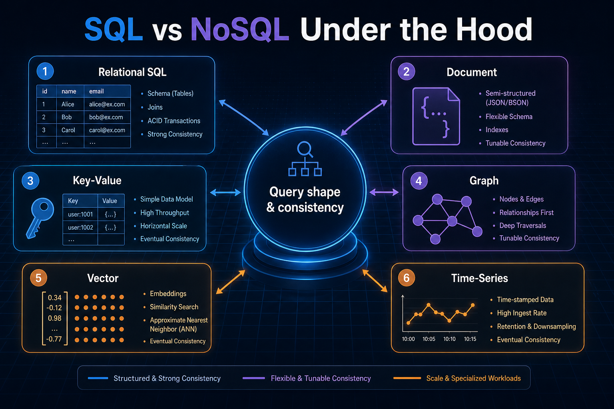
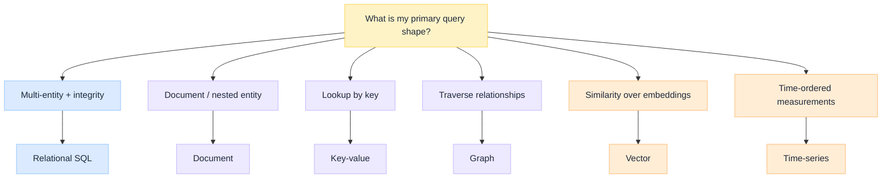
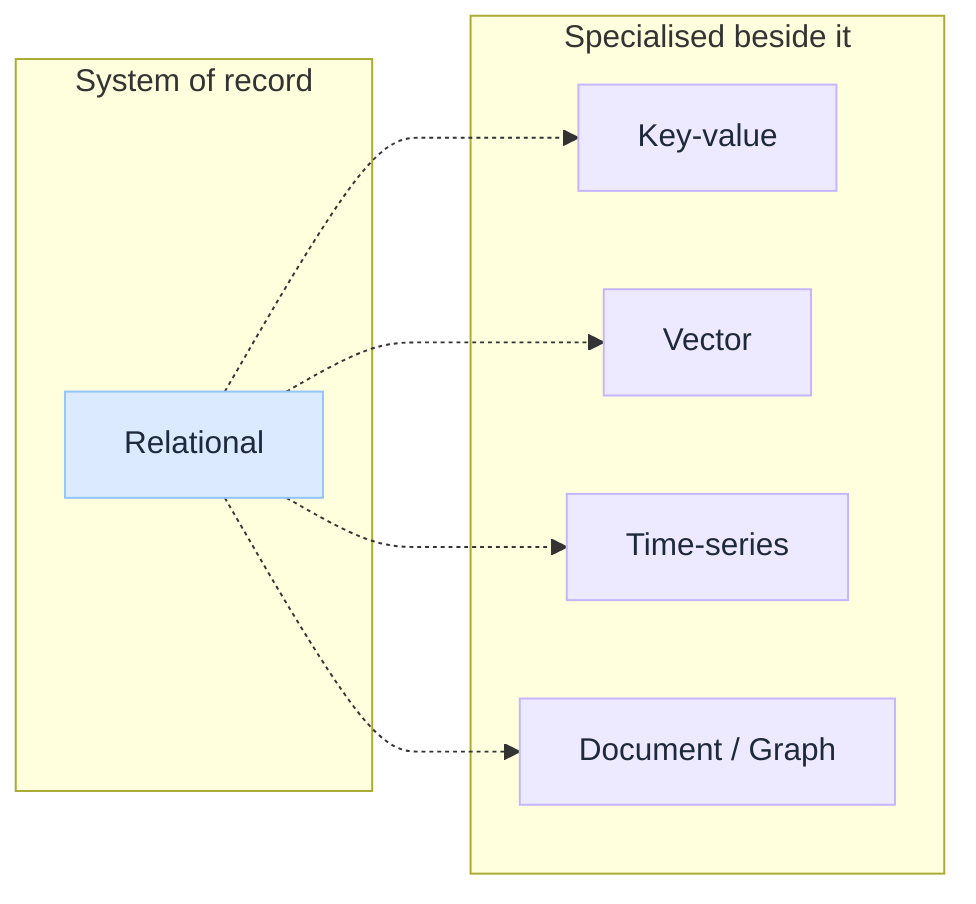

import Details from '@theme/Details';

<br/>


# SQL vs NoSQL Under the Hood

*Teams still argue "SQL or NoSQL" as if those were two products. They are not. They are families of storage models, each optimised for a different query shape and consistency contract.*

Most engineers know the slogan: **SQL is structured; NoSQL is flexible.** That is directionally right. It skips what each engine actually stores, how it answers questions, and which failures show up when you pick the wrong model.

Relational systems give you tables, joins, and strong integrity. Document, key-value, graph, vector, and time-series systems give you different first-class primitives. Pick wrong and you either fight the model with application glue, or you pay for generality you never use.

:::tip[THE CLAIM]
**Pick the storage model for the query shape and consistency you need.** "NoSQL" is not one engine. Document, key-value, graph, vector, and time-series solve different problems. SQL remains the default for transactional integrity; specialised stores earn their place when access patterns do not fit tables and joins.
:::

<!-- truncate -->

## The bottom line first

- **Relational (SQL):** tables, rows, columns, ACID transactions; default for money, CRM, and multi-entity integrity.
- **Document:** JSON-like records with flexible schemas; good for product catalogs and evolving APIs.
- **Key-value:** O(1)-style lookup by key; caches, sessions, rate limits, hot paths.
- **Graph:** nodes and edges as first-class; fraud rings, org charts, recommendations with deep traversal.
- **Vector:** embeddings + similarity search; semantic retrieval and AI grounding (not a system of record).
- **Time-series:** append-heavy, timestamped measurements; IoT, metrics, observability signals.

## What "SQL vs NoSQL" actually means

The useful split is not brand names. It is **data model + query model + consistency model**.

| Axis | Relational (SQL) | Typical NoSQL / specialised |
| --- | --- | --- |
| **Primary shape** | Tables + relations | Documents, keys, edges, vectors, or samples |
| **Schema** | Declared up front; migrations are intentional | Often flexible or workload-specific |
| **Query strength** | Ad hoc joins, filters, aggregations | Path-optimised for one access pattern |
| **Integrity** | Constraints, foreign keys, transactions | Often app-enforced or eventual |
| **Scale story** | Vertical + careful sharding; mature SQL engines | Horizontal partitions, replication topologies |


<br/>

### Keys and how you query

Every family has something that plays the role of a key. What you query *with* is the real difference.

| Family | Has keys? | What you usually query by |
| --- | --- | --- |
| **Relational (SQL)** | Yes: primary keys, foreign keys, unique keys, indexes | SQL `WHERE` / `JOIN` on columns; PK for point lookup (`WHERE id = …`); indexes for filters and sorts |
| **Document** | Yes: document `_id` (primary); optional secondary indexes on fields | By `_id`, or by indexed fields / nested paths (`find({ "attrs.color": "slate" })`) |
| **Key-value** | Yes: the key *is* the model | Almost only by exact key (`GET session:user:42`); secondary query is weak or absent |
| **Graph** | Yes: node IDs / properties; relationships are first-class too | Start from a known node (ID or property), then traverse edges |
| **Vector** | Yes: record/chunk ID + optional metadata filters; the embedding is not a classic key | Similarity to a query vector (nearest neighbour); often plus a metadata filter (`tenant = acme`) |
| **Time-series** | Soft keys: measurement name + **tags** (dimensions) + **timestamp** | Time range + tag filters (`host=web-1`, `time > now()-1h`); not "get row by UUID" as the main path |

**Short version:** SQL, document, and graph let you look up by ID *and* query other fields (or paths). Key-value needs the key. Vector asks "similar to this embedding." Time-series asks "this series over this window."

:::note[POLYglot is normal]
Production systems often use **more than one** store: Postgres as system of record, Redis for cache, a vector index for retrieval, and a time-series store for metrics. The anti-pattern is forcing one engine to fake all five models poorly.
:::

---

Below, each family includes one collapsible record/query example. Click to expand; collapsed by default.

## Relational databases (SQL)

### What it is

Relational databases organise data in **structured tables** with rows and columns. Relationships are expressed with foreign keys. You query with **SQL**. Engines enforce types, constraints, and usually **ACID** transactions so multi-row updates either fully commit or fully roll back.

**Examples:** PostgreSQL, MySQL, Oracle, SQL Server.

<Details summary="Relational record (SQL: orders + customers)">

Tables + foreign keys. One order joins to a customer; integrity is enforced in the engine.

```sql
CREATE TABLE customers (
  id         UUID PRIMARY KEY,
  email      TEXT UNIQUE NOT NULL
);

CREATE TABLE orders (
  id           UUID PRIMARY KEY,
  customer_id  UUID NOT NULL REFERENCES customers(id),
  total_cents  INTEGER NOT NULL CHECK (total_cents >= 0),
  status       TEXT NOT NULL
);

-- Typical query shape: join across related entities
SELECT o.id, c.email, o.total_cents
FROM orders o
JOIN customers c ON c.id = o.customer_id
WHERE o.status = 'open';
```

</Details>

### When to use

- Financial ledgers, billing, orders, inventory with stock counts
- CRM, HR, ERP, and any domain with many related entities
- Strong consistency and auditability requirements
- Ad hoc reporting and joins across tables you cannot denormalise forever

### When not to use

- Hot-path cache or session store (use key-value)
- Deep multi-hop relationship walks as the primary workload (consider graph)
- Pure embedding similarity search at scale (use vector index; keep metadata in SQL)
- Extremely write-heavy telemetry where retention and downsampling dominate (consider time-series)

### Pros and cons

| Pros | Cons |
| --- | --- |
| Mature integrity: constraints, transactions, proven tooling | Schema changes need discipline (migrations) |
| Powerful ad hoc SQL and analytics | Horizontal scale is harder than single-key stores |
| Ecosystem: ORMs, BI, backups, expertise everywhere | Wrong for ultra-flexible nested blobs if you never join |
| Clear mental model for business entities | Can become a dumping ground if every new shape lands in JSON columns without design |

:::tip[TAKEAWAY]
**SQL is still the default system of record** when money, identity, or multi-table integrity matter. Specialised stores sit beside it; they rarely replace it for core transactions.
:::

---

## Document databases

### What it is

Document databases store **JSON-like documents** (nested fields, arrays) as the unit of persistence. Schemas are flexible: documents in a collection can evolve without a single rigid table definition. Queries target document fields and nested paths rather than normalised joins across many tables.

**Example:** MongoDB. (Also: Couchbase, DocumentDB-style engines.)

<Details summary="Document record (MongoDB-style product)">

One nested document is the unit of read/write. Arrays and embedded objects live inside the same record.

```javascript
// Collection: products
{
  "_id": "sku-1042",
  "name": "Trail runner",
  "price_cents": 12900,
  "attrs": { "color": "slate", "sizes": ["8", "9", "10"] },
  "reviews": [
    { "user": "a1", "stars": 5, "text": "Great grip" }
  ]
}

// Typical query shape: filter on nested fields
db.products.find({
  "attrs.color": "slate",
  "price_cents": { "$lte": 15000 }
})
```

</Details>

### When to use

- Product catalogs, content, user profiles with nested attributes
- APIs that naturally return one aggregate document per request
- Rapid iteration where fields change often and joins are rare
- Event or CMS-style payloads that vary by type

### When not to use

- Heavy multi-document transactions that look like a classic relational ledger
- Reporting that needs wide joins across many collections as the daily path
- When you need strict cross-entity constraints enforced by the database

### Pros and cons

| Pros | Cons |
| --- | --- |
| Flexible schema matches evolving products | Easy to create inconsistent document shapes |
| Natural fit for aggregate-oriented reads | Cross-document integrity is mostly your problem |
| Horizontal scale patterns are well documented | "Just store JSON" can hide a bad data model |
| Developer ergonomics for document-shaped APIs | Analytics often need export or a second store |

:::tip[TAKEAWAY]
**Documents win when the unit of read/write is one nested entity.** If your app constantly stitches five documents into one business transaction, you may want relational integrity instead.
:::

---

## Key-value stores

### What it is

Key-value stores map a **key** to a **value** (blob, string, hash, list). The primary operation is get/set by key: extremely fast, simple, and easy to shard by key. Many are in-memory or memory-first with optional persistence.

**Example:** Redis. (Also: DynamoDB in key-value mode, Memcached, etcd for specific cases.)

<Details summary="Key-value record (Redis session + TTL)">

You already know the key. Value is an opaque blob (or a small structure); TTL handles expiry.

```bash
# Set session payload; expire in 30 minutes
SET session:user:42 '{"cart_id":"c9","role":"member"}' EX 1800

# Typical query shape: get by exact key
GET session:user:42

# Rate limit counter
INCR ratelimit:api:42
EXPIRE ratelimit:api:42 60
```

</Details>

### When to use

- Caches in front of a slower system of record
- Sessions, feature flags, rate limits, locks, leaderboards
- Hot configuration or computed results with TTL
- Simple ID → payload lookups at very high QPS

### When not to use

- Primary store for complex relational data and ad hoc queries
- Workloads that need rich secondary indexes as the main access path
- Long-term system of record without a clear durability and backup story

### Pros and cons

| Pros | Cons |
| --- | --- |
| Latency and throughput on the hot path | Limited query model (start from the key) |
| Simple mental model and APIs | Data modelling mistakes become opaque blobs |
| TTL, pub/sub, and structures (lists, sets) in Redis-class engines | Memory cost; eviction surprises |
| Natural cache layer beside SQL | Not a substitute for transactional ledgers |

:::tip[TAKEAWAY]
**Key-value is the accelerator, not the ledger.** Use it when you already know the key. Keep durable business truth in a store that matches your integrity needs.
:::

---

## Graph databases

### What it is

Graph databases store **nodes** and **relationships (edges)** as first-class citizens. Queries traverse paths ("friends of friends", "accounts linked through shared devices") instead of joining large tables repeatedly. The model matches connected data.

**Example:** Neo4j. (Also: Amazon Neptune, JanusGraph, and graph extensions on other engines.)

<Details summary="Graph record (Cypher: accounts and devices)">

Nodes and edges are first-class. The query walks paths, not wide joins.

```cypher
// Create connected records
CREATE (a:Account {id: 'A-100'})
CREATE (b:Account {id: 'A-200'})
CREATE (d:Device {id: 'D-9'})
CREATE (a)-[:USED]->(d)<-[:USED]-(b)

// Typical query shape: multi-hop traversal
MATCH (a:Account {id: 'A-100'})-[:USED]->(d:Device)<-[:USED]-(other:Account)
WHERE other.id <> a.id
RETURN other.id AS linked_account, d.id AS shared_device
```

</Details>

### When to use

- Fraud and AML rings, identity resolution, supply-chain hops
- Org charts, access graphs, knowledge graphs with deep traversal
- Recommendations driven by relationship paths
- Any domain where "how are these entities connected?" is the question

### When not to use

- Flat CRUD with rare relationships (SQL or documents are simpler)
- Bulk analytical aggregations over wide tables (warehouse / SQL)
- Simple cache or session problems (key-value)

### Pros and cons

| Pros | Cons |
| --- | --- |
| Traversal queries stay natural as depth grows | Different query language and ops skill set |
| Relationships are data, not join glue | Overkill for shallow, tabular domains |
| Good fit for connected-domain algorithms | Ecosystem smaller than mainstream SQL |
| Visual reasoning for investigators and analysts | Modelling still needs discipline (edge types, direction) |

:::tip[TAKEAWAY]
**Graphs earn their cost when path depth and relationship variety are the product.** If you mostly filter rows, stay relational.
:::

---

## Vector databases

### What it is

Vector databases (and vector indexes) store **embeddings**: high-dimensional numerical representations of text, images, or other data. The primary query is **similarity search** (nearest neighbours), not exact equality. They are specialised infrastructure for machine learning, semantic search, and AI retrieval.

They are **not** a replacement for your system of record. Chunks, permissions, and provenance still need a governed source. See [RAG is not a database](/insights/rag-is-not-a-database) and [Retrieval is a governed action](/insights/retrieval-is-a-governed-action).

<Details summary="Vector record (embedding + similarity query)">

Each record is a chunk ID, metadata, and an embedding vector. Query by nearest neighbour, not equality.

```python
# Record shape (conceptual)
{
  "id": "chunk-881",
  "doc_id": "policy-12",
  "text": "Refunds are processed within 5 business days.",
  "embedding": [0.012, -0.44, 0.91, ...],  # e.g. 768 or 1536 dims
  "tenant": "acme",
}

# Typical query shape: top-k similar to a query embedding
results = vector_index.query(
    vector=embed("How long do refunds take?"),
    top_k=5,
    filter={"tenant": "acme"},
)
# -> [{id: "chunk-881", score: 0.87}, ...]
```

</Details>

### When to use

- Semantic search over documents, tickets, or knowledge bases
- RAG grounding for LLM applications
- Duplicate / similar-item detection via embeddings
- Multimodal similarity (text ↔ image) when embeddings exist

### When not to use

- Transactional CRUD, billing, or strict relational integrity
- Exact key lookup or structured filters alone (use SQL / key-value; combine filters with vectors when needed)
- As the only store for authoritative business entities

### Pros and cons

| Pros | Cons |
| --- | --- |
| Enables meaning-based retrieval at scale | Approximate search: tune recall vs latency |
| Core building block for production RAG | Embeddings drift when models change (re-index cost) |
| Complements SQL for hybrid search patterns | Not ACID business logic |
| Specialised ANN indexes (HNSW, IVF, …) | Easy to confuse "found similar text" with "authorised truth" |

:::tip[TAKEAWAY]
**Vectors answer "what is similar?"** They do not answer "what is allowed?" or "what is the ledger balance?" Keep embeddings beside a governed source of truth.
:::

---

## Time-series databases

### What it is

Time-series databases are optimised for **continuous, timestamped measurements**: append-heavy writes, queries by time range, tags/dimensions, downsampling, and retention policies. The primary axis is time.

**Example:** InfluxDB. (Also: TimescaleDB on Postgres, Prometheus, OpenTSDB-class systems.)

<Details summary="Time-series record (Influx line protocol + range query)">

Each point is a measurement at a timestamp, with tags (dimensions) and fields (values).

```text
# Write: measurement,tags fields timestamp
cpu,host=web-1,region=au-syd usage_percent=72.4 1721188800000000000
cpu,host=web-1,region=au-syd usage_percent=74.1 1721188860000000000
```

```sql
-- Typical query shape: values over a time window (InfluxQL-style)
SELECT mean(usage_percent)
FROM cpu
WHERE host = 'web-1' AND time > now() - 1h
GROUP BY time(1m)
```

</Details>

### When to use

- IoT sensor streams, industrial telemetry
- System and application metrics, SLOs, capacity trends
- Observability backends where scrape/push volume is high
- Workloads that roll up (1m → 1h → 1d) and expire old raw data

### When not to use

- General transactional applications (orders, users, permissions)
- Document or graph-shaped domain models as the primary store
- One-off business entities with rare time dimensions (SQL with a timestamp column may be enough)

### Pros and cons

| Pros | Cons |
| --- | --- |
| Write and compress patterns built for samples | Poor fit as a general app database |
| Time-range queries and retention are first-class | Joins across business entities are limited or awkward |
| Downsampling and continuous queries | Cardinality explosions (high-tag chaos) hurt hard |
| Aligns with metrics and IoT mental models | You still need SQL/docs for the business objects those metrics describe |

:::tip[TAKEAWAY]
**Time-series stores own the clock.** Use them for measurements over time; keep entities and transactions elsewhere.
:::

---

## Decision matrix

| Primary need | First-choice family | Examples |
| --- | --- | --- |
| Multi-entity integrity, money, CRM | **Relational (SQL)** | PostgreSQL, MySQL, Oracle |
| Nested aggregates, evolving schema | **Document** | MongoDB |
| Ultra-fast get/set by ID, cache, session | **Key-value** | Redis |
| Deep relationship traversal | **Graph** | Neo4j |
| Semantic / embedding similarity | **Vector** | Dedicated vector DB or pgvector-class index |
| Metrics, IoT, timestamped samples | **Time-series** | InfluxDB, TimescaleDB, Prometheus |

**Rule of thumb:** start from the **query you run a thousand times a day**, not from the blog post that won last year. If two shapes are both primary, plan a **polyglot** boundary with a clear system of record.


<br/>

## Common mistakes

| Mistake | Why it hurts |
| --- | --- |
| **One database for every shape** | You invent joins in app code or fake graphs in tables forever |
| **"NoSQL because scale" without a hot key** | You trade integrity for a scale story you may not need |
| **Vector DB as source of truth** | Similarity ≠ authorisation or ledger correctness |
| **Redis as the only store** | Eviction and restart become data-loss incidents |
| **Skipping schema discipline in documents** | Flexible becomes unqueryable |
| **Time-series for business entities** | You lose relational integrity and gain the wrong retention model |

## Final takeaway

"SQL vs NoSQL" is a poster. Under the hood you choose a **data model for a query shape**: tables for integrity, documents for aggregates, keys for speed, graphs for paths, vectors for similarity, time-series for the clock. Most serious systems use more than one. Own the boundary: what is system of record, what is index, what is cache, and what is measurement.
