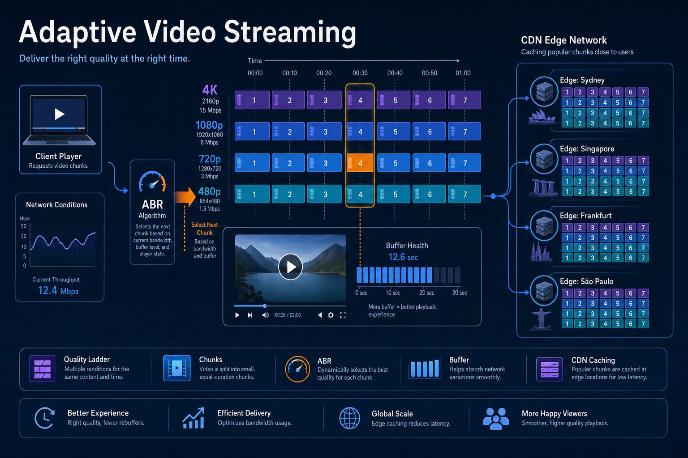
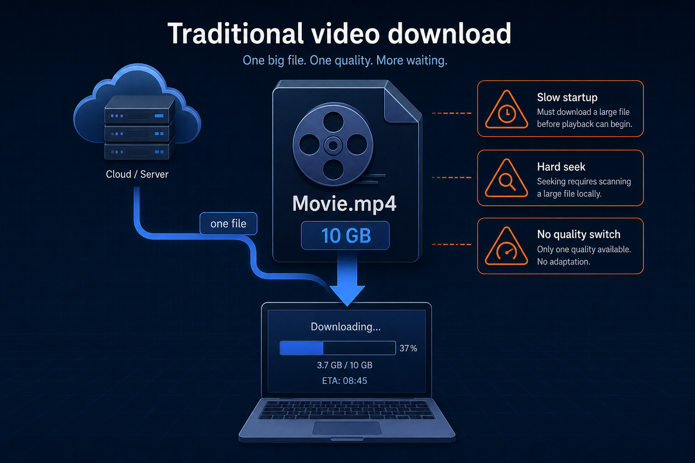
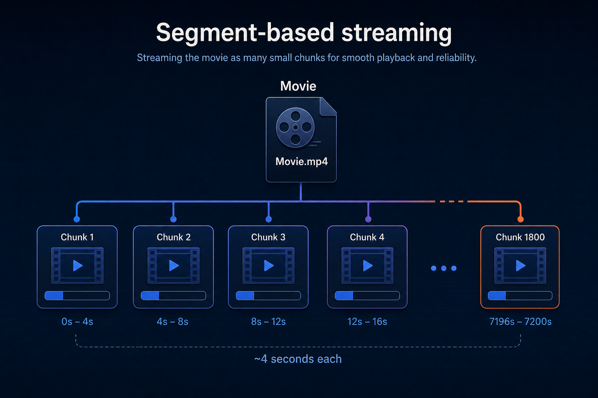
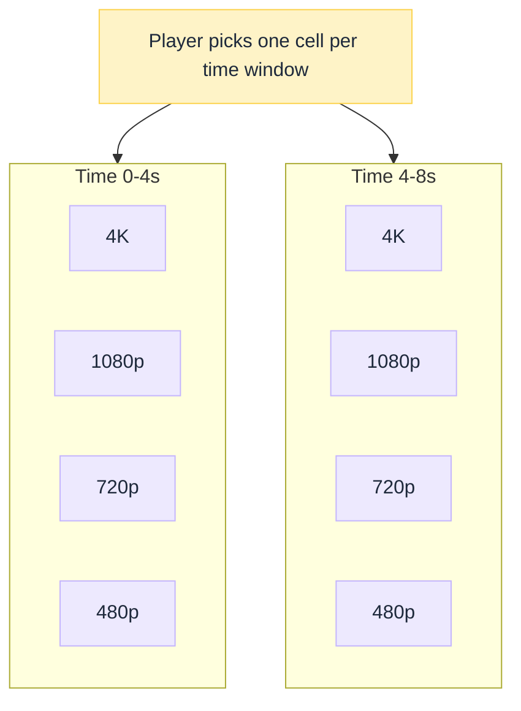
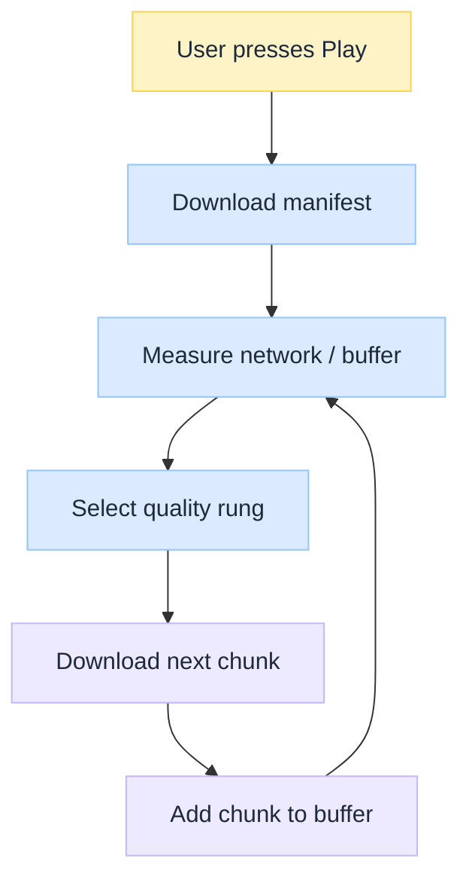

import Details from '@theme/Details';

<br/>


# Adaptive Video Streaming Explained: How Netflix Streams One Chunk at a Time

*When you watch Netflix, picture quality can rise or fall without stopping playback. That is not magic. It is architecture.*

Netflix does **not** stream one large video file. It streams thousands of tiny segments while the player continuously adapts to your network. This explainer walks that design: why one-file download fails, how chunks and quality ladders work, what a manifest is, how ABR chooses the next segment, and why buffering, seeking, and CDN caching all depend on independent objects.

:::tip[THE CLAIM]
**Adaptive streaming is not "download the movie."** It is a loop that repeatedly answers: which version of the next few seconds can I fetch before my buffer runs out? Chunks, ladders, manifests, and edge caches exist so that question stays cheap and continuous.
:::

<!-- truncate -->

## The bottom line first

- **One big file fails** at startup, seek, and mid-stream network change.
- **Segments (~few seconds)** are the unit of request, cache, and quality switch.
- **Aligned ladders** (4K / 1080p / 720p / …) share the same timeline; only bitrate changes.
- **Manifest** lists rungs, codecs, durations, and chunk URLs before play starts.
- **ABR** picks the next chunk from measured bandwidth, latency, loss, and buffer.
- **CDN caches chunks as objects**; popular segments win edge storage. See [CDN Under the Hood](/insights/cdn-under-the-hood).

---

## Traditional video download

Imagine downloading an entire movie as one file.



<br/>

Problems include:

- Slow startup (wait for a large prefix, or the whole file)
- Difficult seeking (scan or re-download large ranges)
- Buffering when the network slows mid-transfer
- No way to change quality dynamically without restarting

Modern streaming solves these by changing the **unit of transfer** from "the title" to "the next few seconds."

:::tip[TAKEAWAY]
**A single monolithic file couples startup, seek, quality, and network into one failure mode.**
:::

---

## Segment-based streaming

Every encoded version is split into small **segments** (chunks).



<br/>

Each chunk typically covers on the order of **a few seconds** of playback (often around four seconds in teaching examples; real ladders vary by codec and recipe).

Instead of requesting one large file, the player requests **one chunk at a time** (often several in parallel into a buffer).

:::tip[TAKEAWAY]
**The chunk is the atomic unit of streaming:** fetch, cache, and switch quality at chunk boundaries.
:::

---

## Multiple quality levels

Netflix (and ABR systems generally) create **identical time segments** for every resolution on the ladder.

<Details summary="Aligned ladder for the same time windows">

```text
0-4 seconds

4K Chunk 1
1080p Chunk 1
720p Chunk 1
480p Chunk 1

4-8 seconds

4K Chunk 2
1080p Chunk 2
720p Chunk 2
480p Chunk 2
```

</Details>

Only the **quality (bitrate / resolution / codec rung)** changes. The **playback timeline** stays aligned so the player can switch rungs between chunks without jumping in story time.


<br/>

:::tip[TAKEAWAY]
**Ladders are time-aligned menus.** Adaptation changes which row you order for the next window, not where you are in the movie.
:::

---

## Manifest file

Before fetching video, the player downloads a **manifest** (DASH `.mpd`, HLS playlist, or vendor equivalent).

<Details summary="Simplified manifest shape">

```text
Movie.mpd

4K
  Chunk1
  Chunk2
  Chunk3

1080p
  Chunk1
  Chunk2
  Chunk3

720p
  Chunk1
  Chunk2
  Chunk3
```

</Details>

The manifest describes:

- Available resolutions / bitrate rungs
- Codecs and other constraints
- Segment duration
- URLs (or URL templates) for every chunk

The player uses that map to decide **what is legal to request** before ABR decides **what to request next**.

:::tip[TAKEAWAY]
**No manifest, no menu.** ABR only chooses among options the manifest declares.
:::

---

## Adaptive bitrate streaming (ABR)

The player continuously measures signals such as:

- Download speed (throughput)
- Latency
- Packet loss / rebuffer risk
- Available buffer (seconds of media already on hand)

It then chooses the best **version of the next chunk** (sometimes with hysteresis so quality does not thrash).

<Details summary="ABR adapting as bandwidth changes">

```text
Bandwidth = 100 Mbps
Request: 4K Chunk 1, 4K Chunk 2, 4K Chunk 3

Bandwidth = 8 Mbps
Request: 1080p Chunk 4, 720p Chunk 5, 720p Chunk 6

Bandwidth = 60 Mbps
Request: 1080p Chunk 7, 4K Chunk 8, 4K Chunk 9
```

</Details>

Playback continues because **only future chunks** change quality. Already-decoded frames in the buffer keep playing.

:::tip[TAKEAWAY]
**ABR is a control loop on the next segment**, not a one-time "pick a resolution for the whole title."
:::

---

## Buffering

The player stays **ahead of the playhead**.

:::note[NOT UDP VIDEO]
Browsers, mobile apps, and TV clients refill that buffer with normal **HTTPS GETs** of each chunk (HLS/DASH-style). That is **HTTP over TLS on TCP** (HTTP/1.1 or HTTP/2), not a raw UDP media stream. If the client uses **HTTP/3**, the app still speaks HTTPS chunk fetches; the wire is **QUIC on UDP** (reliable), not classic fire-and-forget UDP video. See [TCP vs UDP Under the Hood](/insights/tcp-vs-udp-under-the-hood) and [HTTP vs HTTPS Under the Hood](/insights/http-vs-https-under-the-hood).
:::

<Details summary="Buffer ahead of what you are watching">

```text
Watching: 0-4 seconds

Already downloaded:
4-8
8-12
12-16
16-20
20-24
```

</Details>

If the network pauses briefly, playback continues from buffered chunks. If the buffer drains faster than fetches refill it, you see a rebuffer. ABR's job is to pick rungs that keep that buffer healthy.

:::tip[TAKEAWAY]
**Buffer turns network jitter into a soft problem.** Empty buffer turns it into a hard stop.
:::

---

## Seeking

Jump to the one-hour mark. The player does **not** scan through the movie file.

It maps time → chunk index and requests something like:

<Details summary="Seek as chunk fetch">

```text
Chunk 901
Chunk 902
Chunk 903
```

</Details>

Playback resumes near-immediately once those segments arrive (plus a short buffer rebuild). That only works because segments are addressable objects on a shared timeline.

:::tip[TAKEAWAY]
**Seek is random access into the chunk index**, not a linear scan of a 10 GB blob.
:::

---

## CDN caching

Because every chunk is an **independent object**:

<Details summary="Chunks as cache keys">

```text
Chunk 850
Chunk 851
Chunk 852
```

</Details>

CDNs can cache only the segments that were requested. Popular titles and popular time ranges (intros, cliffhangers) naturally become widely cached; rarely watched segments consume little edge storage.

That is the same edge hit/miss idea as a general CDN, applied to media objects. Deep dive: [CDN Under the Hood](/insights/cdn-under-the-hood).

:::tip[TAKEAWAY]
**Chunking makes video CDN-native.** One giant file fights the cache; segments fit it.
:::

---

## End-to-end request flow


<br/>

<Details summary="Same loop as text">

```text
User Presses Play
        |
        v
Download Manifest
        |
        v
Measure Network Speed
        |
        v
Select Quality
        |
        v
Download Next Chunk
        |
        v
Add Chunk to Buffer
        |
        v
Repeat every few seconds
```

</Details>

The decision repeats continuously throughout playback.

---

## Benefits of chunk-based streaming

| Feature | Benefit |
| --- | --- |
| Small segments | Fast startup |
| Multiple qualities | Smooth adaptation |
| Buffering | Fewer interruptions |
| Independent chunks | Efficient CDN caching |
| Manifest-driven playback | Device and codec compatibility |
| Chunk boundaries | Seamless quality switching |

---

## Final takeaway

Adaptive streaming combines intelligent encoding, chunking, manifests, and real-time decision making.

Instead of downloading a single movie file, the player repeatedly asks one question:

> **Which version of the next four seconds can I download before my playback buffer runs out?**

By answering that every few seconds, systems like Netflix deliver smooth playback from slow mobile networks to high-speed fiber while minimizing buffering and maximizing quality.

:::info[Builds on]
[CDN Under the Hood](/insights/cdn-under-the-hood) · [TCP vs UDP Under the Hood](/insights/tcp-vs-udp-under-the-hood) · [HTTP vs HTTPS Under the Hood](/insights/http-vs-https-under-the-hood)
:::

## Further reading

Specs and primaries behind chunked ABR: manifests, player APIs, and how large streamers deliver segments over HTTP.

| Topic | Resource | Why read it |
| --- | --- | --- |
| **Protocols** | [HTTP Live Streaming (Apple)](https://developer.apple.com/streaming/) | Official HLS overview and authoring entry point |
| **Protocols** | [RFC 8216: HTTP Live Streaming](https://datatracker.ietf.org/doc/html/rfc8216/) | Wire-level HLS playlist and segment model |
| **Protocols** | [HLS 2nd Edition (draft)](https://datatracker.ietf.org/doc/draft-pantos-hls-rfc8216bis/) | Current HLS evolution (fMP4, LL-HLS, steering) |
| **Protocols** | [DASH Industry Forum](https://dashif.org/) | MPEG-DASH interoperability guidelines and tools |
| **Protocols** | [ISO/IEC 23009-1 (MPEG-DASH)](https://www.iso.org/standard/83314.html) | International standard for DASH MPD + segments |
| **Players** | [MDN: Media Source Extensions](https://developer.mozilla.org/en-US/docs/Web/API/Media_Source_Extensions_API) | How browsers append downloaded chunks into a buffer |
| **Players** | [dash.js](https://github.com/Dash-Industry-Forum/dash.js) | Reference DASH player implementation |
| **Players** | [hls.js](https://github.com/video-dev/hls.js/) | Widely used HLS player for MSE-based browsers |
| **Players** | [Shaka Player](https://github.com/shaka-project/shaka-player) | Open player with DASH/HLS and ABR logic |
| **Delivery** | [Open Connect Overview (PDF)](https://openconnect.netflix.com/Open-Connect-Overview.pdf) | How Netflix pre-positions and serves segment objects |
| **Delivery** | [Open Connect site](https://openconnect.netflix.com/) | Partner-facing CDN program docs |
| **Quality** | [VMAF perceptual metric](https://netflixtechblog.com/toward-a-practical-perceptual-video-quality-metric-653f208b9652) | Why ladders are judged by eyes, not only bitrate |
| **Pipeline** | [Netflix video pipeline microservices](https://netflixtechblog.com/rebuilding-netflix-video-processing-pipeline-with-microservices-4e5e6310e359) | How encode/package produce the ladders ABR consumes |
