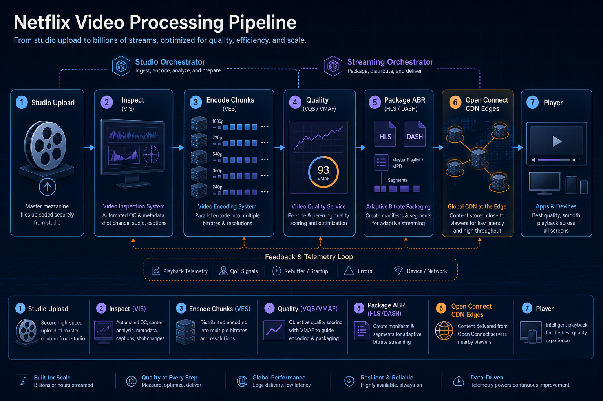
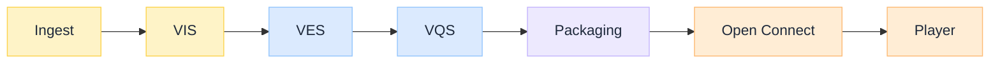
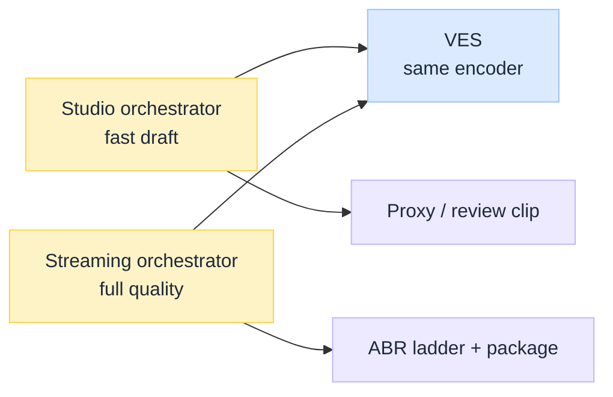
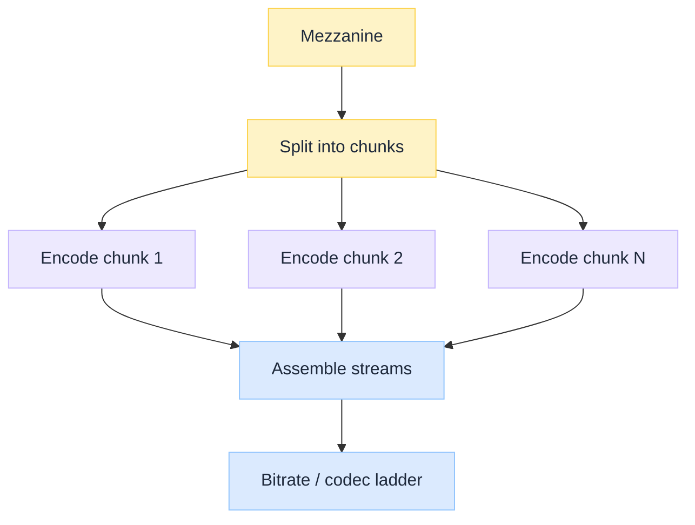
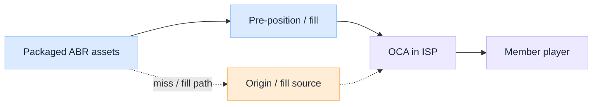

 

# Netflix Video Processing Pipeline: From Studio Upload to Global Streaming

*A title does not become streamable when someone clicks Upload. It becomes streamable when a media factory turns one mezzanine into many adaptive streams, measures quality, packages segments, and pre-positions bytes at the edge of the Internet.*

Most system-design interviews stop at "encode and put it on a CDN." That skips the hard parts Netflix published about in the open: **service boundaries** for inspect vs encode vs quality, **two orchestrators** (studio latency vs streaming perfection), **chunked parallel encoding**, and a **purpose-built CDN** (Open Connect) that treats pre-positioning as part of the pipeline, not an afterthought.

This is an **architecture breakdown** of that path, grounded in Netflix Engineering's Cosmos / VES / Open Connect material. Exact internal names and topologies evolve; the design lessons stay useful.

:::tip[THE CLAIM]
**Studio upload and member streaming are different products that share media services.** Cosmos splits the work into focused microservices (inspect, encode, quality, …). Dual workflow orchestrators customize latency vs quality. Open Connect turns finished assets into a global hit path. The pipeline is the product, not a single encoder binary.
:::

<!-- truncate -->

## Pipeline at a glance

 

| Component | What it does | Failure if skipped |
| --- | --- | --- |
| **Ingest** (mezzanine / IMF) | Accept the high-quality studio source package | Garbage in, expensive garbage out |
| **VIS** (Video Inspection Service) | Validate conformance and basic source quality | Bad masters pollute every ladder rung |
| **VES** (Video Encoding Service) | Chunked parallel encode into codec/bitrate ladders | Latency and cost explode; devices cannot adapt |
| **VQS** (Video Quality Service) | Score encodes (e.g. VMAF); feed analytics | Blind bitrates; bad viewer experience |
| **Packaging** | Segment + manifest for HLS/DASH (plus audio/text) | Players cannot switch quality |
| **Open Connect** (OCA edges) | Pre-position assets; serve ABR near the member | Origin melts; startup and rebuffer suffer |
| **Player** | ABR: pick the next chunk from buffer and bandwidth | No playback or constant rebuffer |

---

## From Reloaded to Cosmos

Netflix's earlier media stack (often discussed as **Reloaded**) concentrated a lot of video work in a large, tightly coupled system. That model struggles when you need independent release cadence for codecs (stable AVC vs fast-moving AV1), different SLOs for studio vs streaming, and elastic compute for bursty encode farms.

**Cosmos** is Netflix's media microservice platform direction: small services with clear functions, messaging between layers, and continuous delivery for encoding tools. Encoding itself became **VES** (Video Encoding Service); quality measurement became **VQS** (Video Quality Service); inspection and ladder/recipe helpers sit beside them rather than inside one monolith.

| Monolith pressure | Microservice response |
| --- | --- |
| One release train for every codec | Codec-specific compute functions that can ship independently |
| Same workflow for proxy and member stream | Dual orchestrators with different optimization goals |
| Encode + quality tangled | VES vs VQS with explicit contracts |
| Hard to scale burst encode | Elastic chunk workers (Stratum-style compute) |

:::note[CASE STUDY, NOT A BLUEPRINT COPY]
Treat published Netflix names (Cosmos, VES, VQS, Open Connect) as **reference architecture vocabulary**. Your org will rename services; keep the boundaries: inspect, encode, measure, package, place, play.
:::

---

## Ingest and inspection

### What arrives from the studio

Upstream of streaming sits a **mezzanine**: a high-quality source package (often IMF / studio interchange style), not a phone upload. That asset is the root of every later encode. Metadata, audio stems, and timed text may arrive on parallel tracks.

### Why inspect before encode

**Video Inspection Service (VIS)**-class steps extract metadata and reject non-conformant or obviously bad sources. Encoding is expensive. Discovering a corrupt master after burning thousands of chunk-hours is a systems failure, not an encoder bug.

| Check class | Examples |
| --- | --- |
| **Conformance** | Expected formats, tracks, timing |
| **Sanity quality** | Gross defects that should never enter the ladder |
| **Identity / lineage** | Which title, which cut, which version |

Studio paths may also need **forensic watermarking** or **timecode / text burn-in** for production review. Those features belong on the studio orchestrator path, not on every member-streaming encode.

---

## Dual workflow orchestrators

**Purpose in one line:** two different people need video processed for two different jobs, so Netflix uses **two managers** (orchestrators) over the **same kitchen** (VIS, VES, …).

| Who is waiting? | What they need | Which orchestrator |
| --- | --- | --- |
| **Production team** on set | A rough cut **today** so they can plan tomorrow's shoot | **Studio** |
| **Members** watching at home | Best possible quality on every device, ready for the CDN | **Streaming** |

If you force one workflow for both:

- Studio waits hours for member-grade ABR ladders they do not need yet.
- Or streaming ships half-baked encodes because the pipeline was tuned for speed.

So Netflix split the **recipe / order of steps**, not the encode service itself.

 

| | **Studio orchestrator** | **Streaming orchestrator** |
| --- | --- | --- |
| **Goal** | Speed | Quality and completeness |
| **Calls** | Mostly VIS + VES (simple recipes) | VIS, ladder/recipe choice, VES, VQS, audio/text, packaging |
| **Output** | Editorial proxy, marketing clip, watermarked review copy | Full ABR streams for Open Connect |
| **Extra features** | Watermarking, timecode burn-in | Quality scores, analytics, CDN-ready package |

**Analogy:** one restaurant kitchen (VES). Lunch rush orders a quick sandwich (studio). Dinner service orders a full tasting menu with wine pairing (streaming). Same cooks; different tickets.

---

## Encoding at scale (VES)

### Chunked parallel encoding

A two-hour title is not one serial encode. The mezzanine is split into **chunks**, encoded in parallel across an elastic worker pool, then **assembled** into streams. Parallelism is how burst catalogs and new codec experiments finish in human-relevant time.

 

### VES layered design (published shape)

Netflix described VES roughly as three layers:

| Layer | Role |
| --- | --- |
| **Optimus** | API / request edge for encode jobs |
| **Plato** | Workflow orchestration (DAG of media steps) |
| **Stratum** | Serverless-style compute running encoder containers |

Messaging between layers (e.g. Timestone-class bus) keeps API, workflow, and compute releaseable on different clocks. Codec-specific Stratum functions let AV1 churn without destabilizing AVC.

### Codecs and ladders

Member devices need a **ladder**: multiple resolutions/bitrates and often multiple codecs (AVC, VP9, AV1, …). Recipe / ladder generation services (discussed alongside **LGS**-style optimization) choose where to spend bits before VES burns CPU/GPU.

| Concern | Design implication |
| --- | --- |
| Device diversity | Many encodes per title, not one "master MP4" |
| Network diversity | ABR segments; player switches rungs |
| Codec maturity | Isolate encoder binaries behind stable service APIs |

---

## Quality as a first-class service (VQS)

Encoding without measurement is hope. **VQS** scores encodes and feeds Netflix data pipelines for monitoring and analytics. **VMAF** (Video Multi-Method Assessment Fusion), which Netflix open-sourced, is widely used as a perceptual quality metric in this ecosystem.

| Quality loop | Purpose |
| --- | --- |
| Per-encode scores | Catch bad rungs before wide deployment |
| Aggregate analytics | Compare recipes, codecs, and regressions |
| Feedback into recipes | Spend bits where viewers notice |

Separating **VES** (make bits) from **VQS** (judge bits) keeps innovation on encoders from blocking innovation on metrics.

---

## Audio, timed text, and packaging

Video is only one plane. Streaming orchestrators also drive:

- **Audio** encodes and language variants
- **Timed text** (subtitles, captions)
- **Packaging** that containerizes media into player-ready **HLS** and/or **DASH** segments and manifests

Adaptive bitrate streaming means the player fetches short segments (often a few seconds) and can change quality between segments as bandwidth changes. Packaging is the contract between the encode farm and every device client.

---

## Global delivery: Open Connect

After packaging, members should not pull every byte from a single origin region. Netflix's **Open Connect** CDN places **Open Connect Appliances (OCAs)** deep in ISP networks and **pre-positions** popular titles so playback is mostly a local hit.

That is the same control-plane idea as a general CDN (cache key, TTL, edge vs origin), with a content business that can predict and push catalogs. For the generic edge mechanics, see [CDN Under the Hood](/insights/cdn-under-the-hood). Name → edge IP still starts with [DNS](/insights/dns-under-the-hood).

 

| Delivery concern | Pipeline implication |
| --- | --- |
| Hit ratio | Encode/package complete before fill windows |
| Catalog bursts | Elastic encode + scheduled pre-position |
| Global footprint | Multi-codec ladders matched to device maps |

---

## Design lessons (what to steal)

| Lesson | Why it matters |
| --- | --- |
| **Split studio vs streaming orchestrators** | Fast review for production ≠ full ABR for members; share VES, not one workflow |
| **Inspect before you burn encode spend** | Fail fast on bad mezzanines |
| **Chunk + assemble** | Parallelism is the scalability primitive |
| **Quality is a service** | Metrics must evolve independently of encoders |
| **Package for ABR, not for a single file** | Players adapt; origins should not |
| **CDN is part of the pipeline** | Pre-positioning is a release step, not ops folklore |
| **Isolate codec compute** | Fast-moving codecs need independent deployability |

## Where teams go wrong copying this

| Mistake | Why it hurts |
| --- | --- |
| **One workflow for proxy and production stream** | Studio latency fights streaming quality gates |
| **Monolithic "media platform" release** | AV1 experiment freezes AVC hotfixes |
| **No perceptual quality gate** | Bitrate ladders optimized for file size, not eyes |
| **CDN bolted on after encode** | Launch day origin storms |
| **Treating packaging as an afterthought** | Great encodes that no player can switch across |

:::tip[TAKEAWAY]
**From studio upload to global streaming is a staged media factory:** inspect → encode in chunks → measure quality → package ABR → pre-position at the edge → let the player adapt. Netflix's Cosmos story is less about a brand-name encoder and more about **boundaries, dual SLOs, and delivery as a first-class stage**.
:::

:::info[Builds on]
[CDN Under the Hood](/insights/cdn-under-the-hood) · [DNS Under the Hood](/insights/dns-under-the-hood)
:::

## Further reading

Primary sources from Netflix Engineering and related docs. Start here if you want the original design write-ups behind this case study.

### Pipeline and Cosmos

| Resource | Why read it |
| --- | --- |
| [Rebuilding Netflix Video Processing Pipeline with Microservices](https://netflixtechblog.com/rebuilding-netflix-video-processing-pipeline-with-microservices-4e5e6310e359) | Overview: Reloaded → Cosmos, VIS / VES / VQS, studio vs streaming orchestrators |
| [The Making of VES](https://netflixtechblog.com/the-making-of-ves-the-cosmos-microservice-for-netflix-video-encoding-946b9b3cd300) | Deep dive: Optimus / Plato / Stratum, chunked encode, Timestone |
| [The Netflix Cosmos Platform](https://netflixtechblog.com/the-netflix-cosmos-platform-35c14d9351ad) | Platform model: orchestrated functions, Tapas / Sagan-style higher-level workflows |

### Quality (VMAF)

| Resource | Why read it |
| --- | --- |
| [Toward A Practical Perceptual Video Quality Metric](https://netflixtechblog.com/toward-a-practical-perceptual-video-quality-metric-653f208b9652) | Why VMAF exists and how Netflix thinks about perceptual quality |
| [Netflix/vmaf on GitHub](https://github.com/Netflix/vmaf) | Open-source VMAF toolkit and docs |

### Delivery (Open Connect)

| Resource | Why read it |
| --- | --- |
| [Open Connect Overview (PDF)](https://openconnect.netflix.com/Open-Connect-Overview.pdf) | Official overview of OCAs, control plane, and pre-positioning |
| [Open Connect site](https://openconnect.netflix.com/) | Partner-facing docs and program entry point |
| [Driving Content Delivery Efficiency Through Classifying Cache Misses](https://netflixtechblog.com/driving-content-delivery-efficiency-through-classifying-cache-misses-ffcf08026b6c) | How Netflix reasons about edge hit/miss and steering |
| [Netflix content distribution through Open Connect (APNIC)](https://blog.apnic.net/2018/06/20/netflix-content-distribution-through-open-connect/) | Clear ISP/OCA steering walkthrough |

### Related (live and playback)

| Resource | Why read it |
| --- | --- |
| [Behind the Streams: Live at Netflix (Part 1)](https://netflixtechblog.com/behind-the-streams-live-at-netflix-part-1-d23f917c2f40) | How live differs from VOD encode → Open Connect |
| [Netflix Live Origin](https://netflixtechblog.com/netflix-live-origin-41f1b0ad5371) | Cloud origin between live packager and Open Connect |
