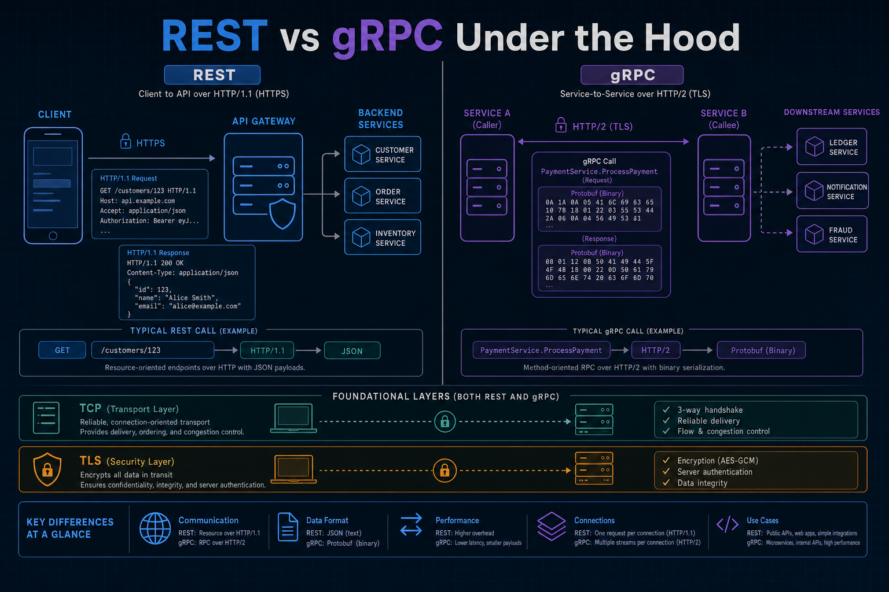
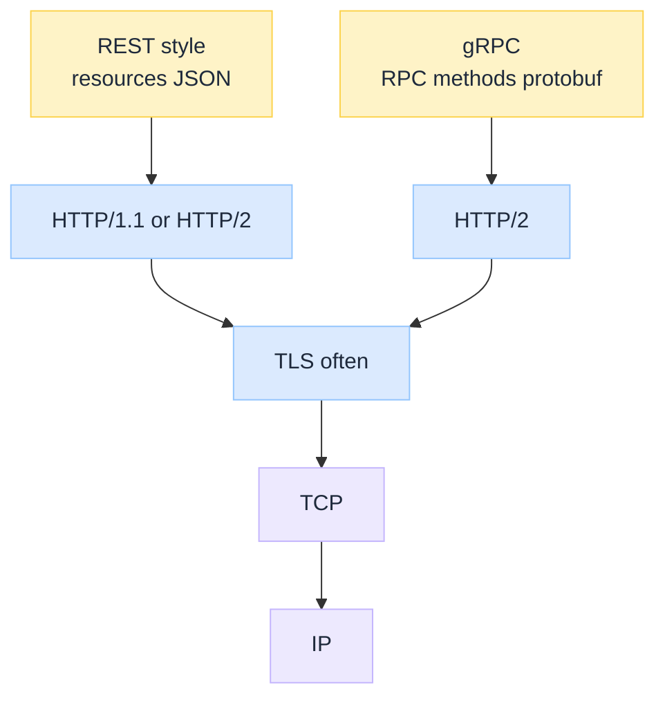
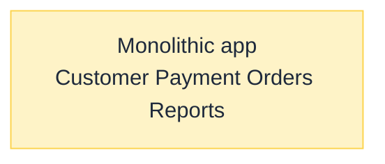
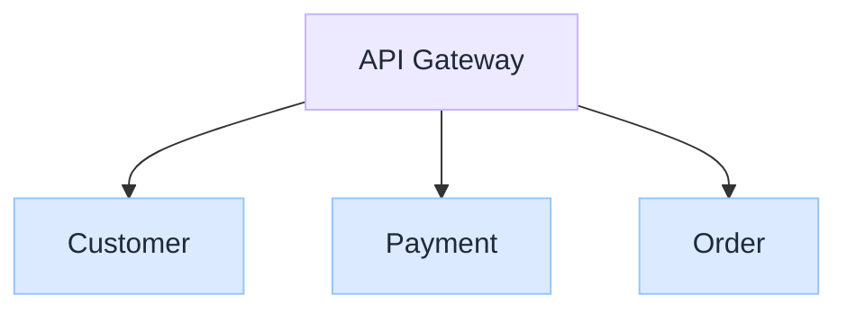
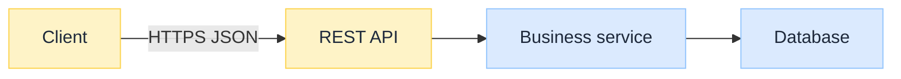
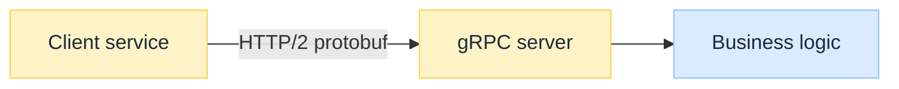
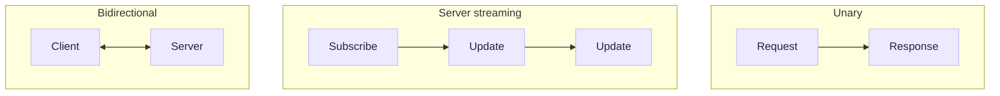
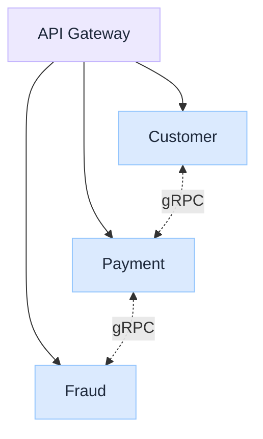
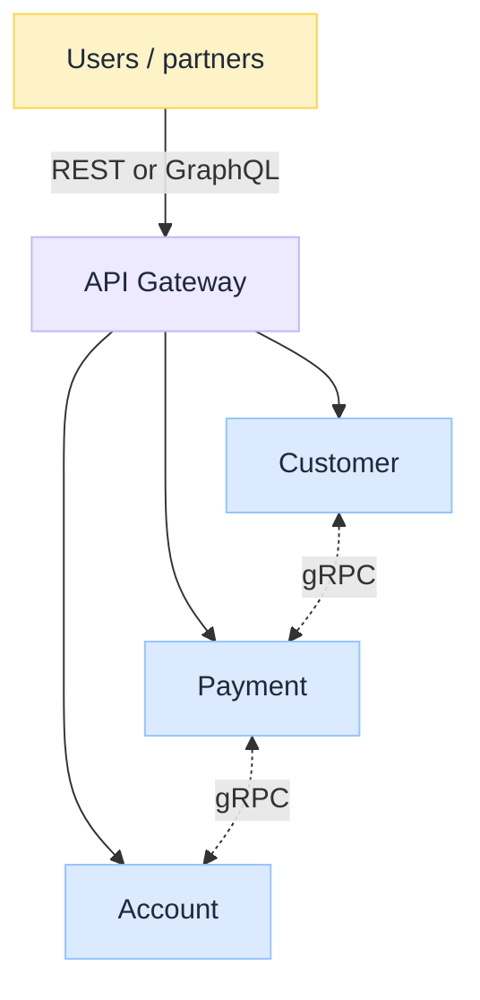

import Details from '@theme/Details';

<br/>


# REST vs gRPC Under the Hood

*Modern platforms are not one app. They are dozens or hundreds of services that must talk over the network. The design question is not "JSON or binary?" alone. It is which communication model fits which boundary.*

A banking, ecommerce, or streaming platform may split customer, payments, auth, orders, recommendations, notifications, and fraud into separate services. Two of the most common answers are **REST** (resource-oriented HTTP APIs) and **gRPC** (RPC over HTTP/2 with protobuf). Both move messages between systems. They solve different jobs.

:::tip[THE CLAIM]
**REST and gRPC are not competitors for the same boundary.** REST optimises for simple, interoperable, often public HTTP APIs. gRPC optimises for typed, high-throughput service-to-service calls on HTTP/2. Mature architectures usually use **both**: REST (or GraphQL) at the edge, gRPC inside.
:::

<!-- truncate -->

## The bottom line first

- **REST:** "access this **resource**" via HTTP methods and (usually) JSON.
- **gRPC:** "call this **function** on another service" via stubs, protobuf, and HTTP/2.
- **Stack:** both sit *above* HTTP; both typically ride **TLS + TCP**. Neither is "the UDP option."
- **Contracts:** OpenAPI/common docs for REST; `.proto` codegen for gRPC.
- **Browsers:** REST/`fetch` is native; gRPC needs grpc-web or a gateway for browsers.
- **Default enterprise pattern:** external REST, internal gRPC.

## Where they sit in the stack


<br/>

Companions: [HTTP vs HTTPS Under the Hood](/insights/http-vs-https-under-the-hood) · [TCP vs UDP Under the Hood](/insights/tcp-vs-udp-under-the-hood). HTTP/2 framing deep dive: HTTP/1.1 vs HTTP/2 vs HTTP/3 Under the Hood (coming soon).

---

## From monolith to service-to-service

Early systems often lived in one process:


<br/>

As organisations split into microservices, calls cross the network:


<br/>

That creates the need for clear, efficient communication protocols.

---

## REST: resource-based communication

REST is an architectural style centred on **resources** (business objects): customer, account, order, transaction. Clients interact with resources using standard HTTP methods.

| Intent | Example |
| --- | --- |
| Read | `GET /customers/123` |
| Create | `POST /payments` |
| Replace / update | `PUT /accounts/456` |
| Delete | `DELETE /orders/789` |

Focus: **"What resource do I want to access?"**

### REST flow


<br/>

<Details summary="Example REST request and JSON response">

```http
GET /customers/123 HTTP/1.1
Host: api.example.com
Authorization: Bearer token123
```

```json
{
  "customerId": 123,
  "name": "John",
  "status": "ACTIVE"
}
```

</Details>

### REST characteristics

| Trait | What it means |
| --- | --- |
| **HTTP standards** | Methods, status codes (`200`, `404`, `401`, `500`), headers, familiar auth |
| **JSON (common)** | Human-readable, easy to debug, everywhere |
| **Stateless** | Each request carries what the server needs (e.g. bearer token) |

:::tip[TAKEAWAY]
**REST optimises for a shared web vocabulary.** Great when many clients and humans must integrate without a custom RPC stack.
:::

---

## gRPC: function-based communication

gRPC asks a different question: **"Which function should run on another service?"**

Example mental model: `PaymentService.ProcessPayment(...)`. It feels like a local call; the implementation runs remotely.

### gRPC flow


<br/>

### Protocol Buffers

REST commonly uses JSON. gRPC commonly uses **Protocol Buffers** and a `.proto` contract.

<Details summary="Example .proto service contract">

```protobuf
service PaymentService {
  rpc ProcessPayment(PaymentRequest) returns (PaymentResponse);
}
```

</Details>

The contract defines operations, inputs, and outputs. Clients and servers generate typed stubs from it.

### Why gRPC is often faster

| Lever | Effect |
| --- | --- |
| **Binary protobuf** | Smaller payloads; faster (de)serialise than typical JSON |
| **HTTP/2 multiplexing** | Many RPCs on one connection (less handshake churn) |
| **Streaming** | Unary, server-stream, client-stream, bidirectional built in |


<br/>

Streaming fits stock ticks, chat-like paths, and other continuous exchanges. REST can approximate some of this (SSE, WebSockets, chunked responses) but it is not the native model.

:::tip[TAKEAWAY]
**gRPC optimises for typed internal RPC.** You pay with tooling, binary payloads, and weaker native browser support.
:::

---

## Side-by-side matrix

| Capability | **REST** | **gRPC** |
| --- | --- | --- |
| Communication model | Resource based | Function / RPC based |
| Protocol | HTTP/1.1 or HTTP/2 | HTTP/2 (typical) |
| Data format | JSON / XML (common) | Protocol Buffers |
| Performance | Good | Very high (typical) |
| Human readable | Yes (JSON) | No (binary) |
| Contract | OpenAPI / docs | `.proto` + codegen |
| Streaming | Limited / add-on | Built-in |
| Browser support | Excellent | Limited (needs bridge) |
| Best usage | External / public APIs | Internal services |

---

## When to use REST

Prefer REST when **humans and external systems** consume the API:

- Mobile and web clients
- Partner / public APIs
- Payment, ecommerce, and integration surfaces that need easy docs and debugging


<br/>

## When to use gRPC

Prefer gRPC for **internal microservice** paths that need speed and contracts:

- Banking / cloud platforms with chatty service meshes
- Fraud, risk, and recommendation engines behind the gateway
- Real-time internal streams


<br/>

---

## Enterprise pattern: use both

Most large organisations do not pick one forever. A common design:


<br/>

| Boundary | Usual choice |
| --- | --- |
| **External world** | REST (sometimes GraphQL) |
| **Inside the platform** | gRPC |

### Banking payment sketch

Mobile app: `POST /payments` over REST. Inside: Payment to Fraud to Risk over gRPC. REST stays simple at the edge; gRPC keeps internal hops tight.

### Streaming-platform sketch

Mobile app to REST to API Gateway to User / Video / Recommendation services. Internal fan-out and ranking paths speak gRPC so customer-facing APIs do not expose every internal call shape.

:::tip[TAKEAWAY]
**Choose by boundary, not by fashion.** External simplicity and internal performance can coexist.
:::

---

## Final takeaway

REST focuses on simplicity, interoperability, and public HTTP access. gRPC focuses on performance, strongly typed contracts, and efficient service-to-service communication.

The mature pattern is not REST *or* gRPC. It is knowing where each belongs:

> **Use REST when humans and external systems need to consume your services. Use gRPC when internal services need to communicate at high speed and scale.**

:::info[Builds on]
[HTTP vs HTTPS Under the Hood](/insights/http-vs-https-under-the-hood) · [TCP vs UDP Under the Hood](/insights/tcp-vs-udp-under-the-hood)
:::

## Further reading

| Topic | Resource | Why read it |
| --- | --- | --- |
| **gRPC** | [gRPC documentation](https://grpc.io/docs/) | Official concepts, languages, and guides |
| **Protobuf** | [Protocol Buffers docs](https://protobuf.dev/) | Language guide and wire format |
| **REST** | [MDN: HTTP](https://developer.mozilla.org/en-US/docs/Web/HTTP) | Methods, status codes, and HTTP basics |
| **OpenAPI** | [OpenAPI Specification](https://spec.openapis.org/oas/latest.html) | Common contract style for REST APIs |
| **HTTP/2** | [RFC 9113: HTTP/2](https://www.rfc-editor.org/rfc/rfc9113.html) | Multiplexing under typical gRPC |
| **grpc-web** | [grpc-web](https://github.com/grpc/grpc-web) | Browser path when you must expose gRPC-ish APIs |
