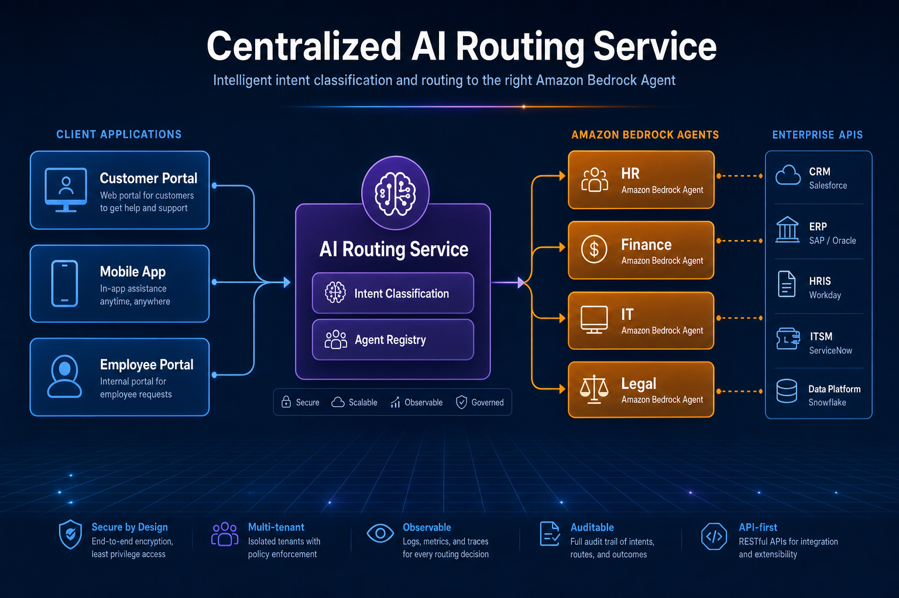
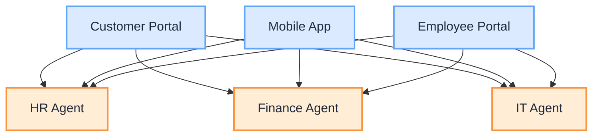
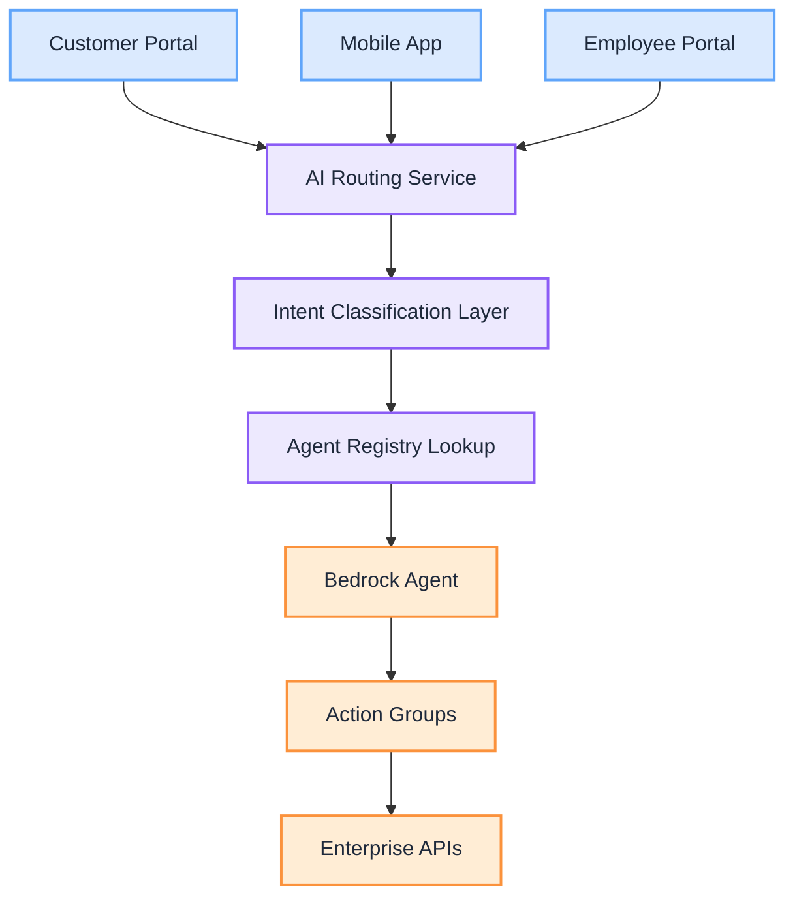
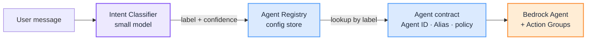
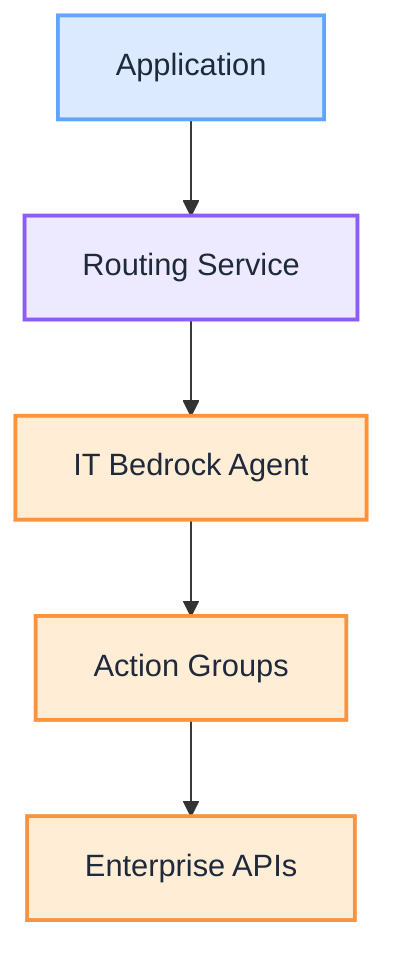
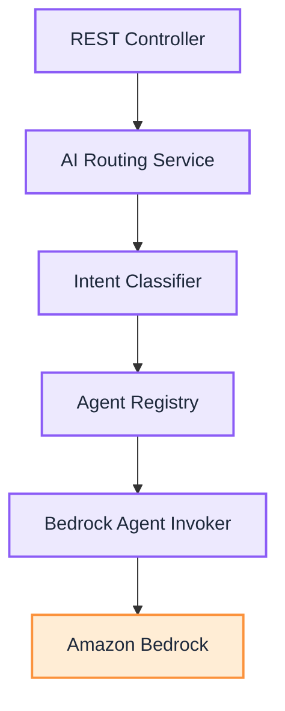
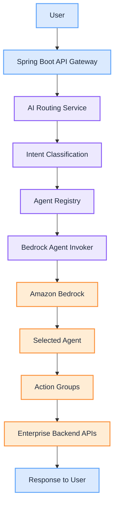

import Details from '@theme/Details';

<br/>



# Building a Centralized AI Routing Service with Java and Amazon Bedrock

As organizations adopt Generative AI, one challenge quickly emerges:

> **How do you support dozens of AI agents without hardcoding routing logic into every application?**

If every application needs to know the Agent ID, Alias ID, and invocation logic for each Bedrock Agent, your architecture quickly becomes tightly coupled and difficult to maintain. A better approach is to introduce a **Centralized AI Routing Service**: instead of applications calling Bedrock Agents directly, they call a single API. The service determines which agent should handle the request, invokes the correct Bedrock Agent, and returns the response.

This is an **architecture breakdown** of that pattern, traced end to end in Java and Spring Boot, aligned with [How to Design an Intent Router for Agentic AI](/insights/design-intent-router).

:::tip[THE CLAIM]
**Applications should not know Agent IDs, Alias IDs, or invocation logic.** A centralized routing service classifies intent, looks up the right Bedrock Agent, invokes it, and returns the response behind one stable API, so adding an agent becomes a configuration change, not an application rewrite.
:::

<!-- truncate -->

## The problem

Imagine your enterprise has AI agents for HR, Finance, IT Support, Legal, Enterprise Architecture, and Customer Service. Without a centralized routing layer, every application contains AI-specific logic and calls each agent directly.

<div className="gain-diagram-wrap">



</div>
<br/>

Each application must know which Bedrock Agent to invoke, the Agent IDs, the Alias IDs, authentication, routing rules, and retry logic. Now imagine adding a **Legal AI Agent**: every application must be modified and redeployed. That is not scalable.

## A better architecture

Instead, introduce a dedicated AI Routing Service. Applications now have only one responsibility: send the user's request to the routing service. The routing service handles everything else.

<div className="gain-diagram-wrap">



</div>
<br/>

## Step 1: receive the request

Every application calls a single endpoint. The application does not need to know whether the request belongs to HR, IT, or another domain.

<Details summary="API request: single POST endpoint">

```http
POST /api/chat
```

```json
{
    "message": "Reset my VPN password."
}
```

</Details>

## Step 2: classify the intent

The routing service first determines which business capability owns the request. This is typically implemented using a lightweight model such as Amazon Nova Micro, Claude Haiku, Amazon Comprehend, a custom SageMaker model, or rule-based routing.

The classifier's only responsibility is to return a business domain. Using a small model keeps latency low and costs significantly lower than invoking a large reasoning model for every request.

<Details summary="Intent classifier: flow, prompt, and response">

Classification flow:

```text
User:
"Reset my VPN password."

↓

Classifier

↓

IT
```

Example prompt:

```text
You are an intent classifier.

Possible domains:

- HR
- Finance
- IT
- Legal
- Architecture

Return only the domain.

User:
Reset my VPN password.
```

Expected response:

```text
IT
```

</Details>

## Step 3: look up the agent

Once the intent is known, the routing service queries an Agent Registry. Instead of hardcoding Agent IDs, the service stores mappings centrally.

| Domain  | Agent ID | Alias |
| ------- | -------- | ----- |
| HR      | AGENT001 | PROD  |
| Finance | AGENT002 | PROD  |
| IT      | AGENT003 | PROD  |
| Legal   | AGENT004 | PROD  |

The registry can be stored in DynamoDB, AWS AppConfig, Systems Manager Parameter Store, RDS, or configuration files for smaller deployments. This means adding a new agent usually requires updating configuration rather than changing application code.

## Separation of concerns: classifier, registry, and agent

A common point of confusion: does the classifier return the Agent ID, the alias, and the invocation config? **No.** The classifier returns only a **label** (the business domain) plus a confidence score, and optionally any entities it extracted. Everything else is a **lookup** keyed by that label.

<Details summary="Classifier output: a label, not the agent config">

```json
{
    "intent_label": "IT",
    "confidence": 0.94,
    "entities": { "request_type": "vpn_password_reset" }
}
```

The classifier never emits `Agent ID`, `Alias`, or tool schemas. It picks from a fixed set of domains; the registry resolves that label into the rest.

</Details>

This keeps three distinct concerns separate. They can share infrastructure in a pilot, but each is logically its own thing with its own owner and version.

| Concern | What it returns or holds | Produced when | Where it lives (AWS) |
| --- | --- | --- | --- |
| **Intent classifier** | `intent_label` + confidence (+ entities) | Runtime, per request | Small model: Nova Micro, Claude Haiku, Comprehend, or a SageMaker model |
| **Agent registry** | Maps the label to Agent ID, alias, and policy | Authored ahead, versioned | DynamoDB, AppConfig, or Parameter Store |
| **Agent capabilities** | The tools and APIs the agent may call | Authored ahead, versioned | Bedrock Agent **action groups** (OpenAPI schemas) |

<div className="gain-diagram-wrap">



</div>
<br/>

Why keep them separate rather than one blob:

- **Blast radius.** The classifier is a model. If it could emit Agent IDs or tool access, a prompt injection could talk it into granting itself the wrong agent. Restricting its output to one label means the worst it can do is pick the wrong route, which the registry and authorization layer can still catch.
- **Change cadence and ownership.** The registry is owned by whoever runs the platform; agent capabilities (action groups) are owned by the teams that build each agent. Each can be revved and rolled back independently, without redeploying the other.
- **Auditability.** A wrong answer is easier to diagnose when you can tell a misclassification (wrong label) apart from a bad registry entry (right label, wrong Agent ID) apart from an agent-side failure (right agent, wrong tool call).

For a small deployment the classifier can be one model call, the registry a YAML file, and the agents plus action groups defined in Bedrock: three logical stores that happen to be cheap. As the platform grows, promote the registry to DynamoDB or AppConfig and keep each agent's action groups versioned in Bedrock. The boundary stays the same: the classifier decides **which** label, the registry decides **which agent**, and the agent decides **how** to do the work.

## Step 4: invoke the Bedrock Agent

After locating the correct agent, the routing service invokes Bedrock. The application never communicates with Bedrock directly.

<div className="gain-diagram-wrap">



</div>
<br/>

## Step 5: Bedrock orchestrates the work

The selected Bedrock Agent now takes over. Suppose the user asked to reset their VPN password. The agent may:

1. Verify the user's identity.
2. Call the Identity Management API.
3. Generate a temporary password.
4. Send a notification email.
5. Return a confirmation.

The routing service does not know how these steps are performed. It simply invokes the appropriate Bedrock Agent.

## Spring Boot architecture

A clean implementation separates responsibilities into dedicated components, each with a single responsibility.

<div className="gain-diagram-wrap">



</div>
<br/>

| Component | Responsibility |
| --- | --- |
| **REST Controller** | Receives incoming requests |
| **Intent Classifier** | Determines the business domain |
| **Agent Registry** | Maps domains to Bedrock Agent IDs |
| **Bedrock Agent Invoker** | Executes the selected Bedrock Agent |

This modular design makes the platform easier to test, extend, and maintain.

## Adding a new AI agent

Suppose your organization introduces a Legal AI Agent.

Without centralized routing, you update every application, add new routing logic, and redeploy multiple services. With centralized routing:

1. Create the Legal Bedrock Agent.
2. Register it in the Agent Registry.
3. Update the classifier prompt (or retrain the classifier if necessary).

That is it. Applications continue calling the same endpoint. No client changes, no new APIs, and no redeployment across dozens of services.

## Production enhancements

As your AI platform grows, additional capabilities can be introduced.

| Capability | Enhancement |
| --- | --- |
| **Agent Registry** | Move configuration from YAML files to DynamoDB or AWS AppConfig |
| **Intent Classification** | Use Amazon Nova Micro or Claude Haiku for low-cost intent detection |
| **Authorization** | Ensure users can only access agents they are permitted to use |
| **Observability** | Capture agent selected, classification confidence, response time, token usage, and errors using CloudWatch and distributed tracing |
| **Caching** | Cache frequently requested routing decisions to reduce latency |

## Benefits of a centralized AI routing service

This architecture provides several operational advantages.

- **Loose coupling.** Applications know nothing about Bedrock Agent IDs or routing logic.
- **Easy expansion.** New agents can be introduced without modifying client applications.
- **Lower costs.** Small models perform inexpensive intent classification before expensive reasoning models are invoked.
- **Centralized governance.** Authentication, authorization, logging, and monitoring happen in one place.
- **Consistent user experience.** Every application uses the same routing logic and agent registry.

## Reference architecture

<div className="gain-diagram-wrap">



</div>
<br/>

## Final thoughts

A common mistake when building enterprise AI systems is allowing every application to manage its own Bedrock integrations. This leads to duplicated routing logic, tight coupling, and unnecessary maintenance effort.

A **Centralized AI Routing Service** solves this by acting as the single entry point for all AI requests. It classifies user intent, looks up the appropriate Bedrock Agent, invokes it, and returns the response, all behind a stable API. As your organization grows from a handful of AI agents to dozens or even hundreds, this architecture scales naturally: new agents become configuration changes instead of application rewrites, enabling teams to evolve the AI platform independently of the applications that consume it.

:::tip[TAKEAWAY]
Put one routing service in front of your Bedrock Agents. Applications call a single API, intent classification and the agent registry live in one place, and onboarding a new agent is a config change, not a fleet-wide redeploy. The result is an AI platform that is modular, governable, cost-efficient, and ready for enterprise-scale adoption.
:::

:::info[Builds on]
[How to Design an Intent Router for Agentic AI](/insights/design-intent-router) · [What Is an Intent Router](/insights/what-is-intent-router)
:::
