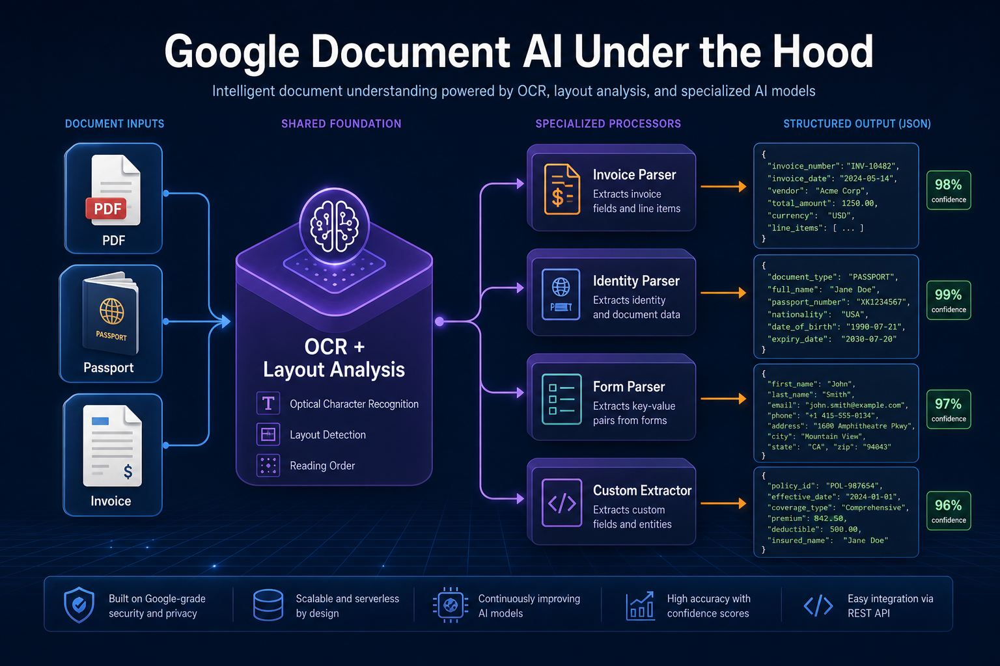
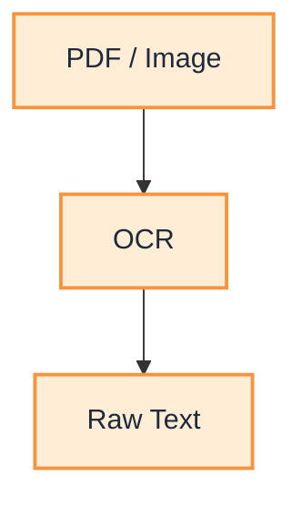
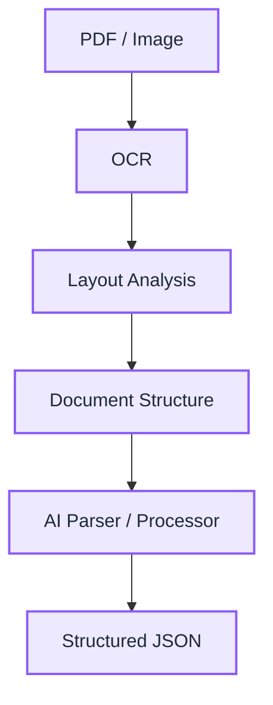
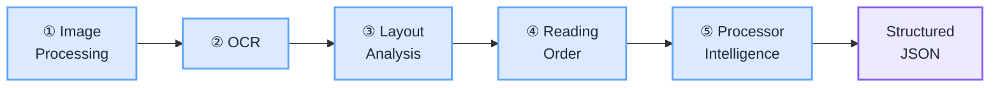
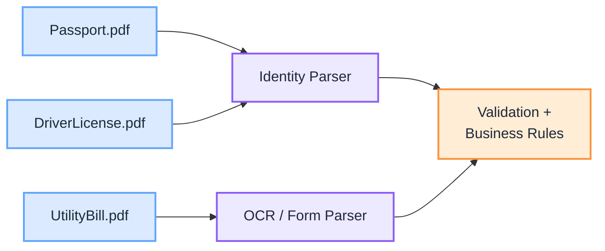
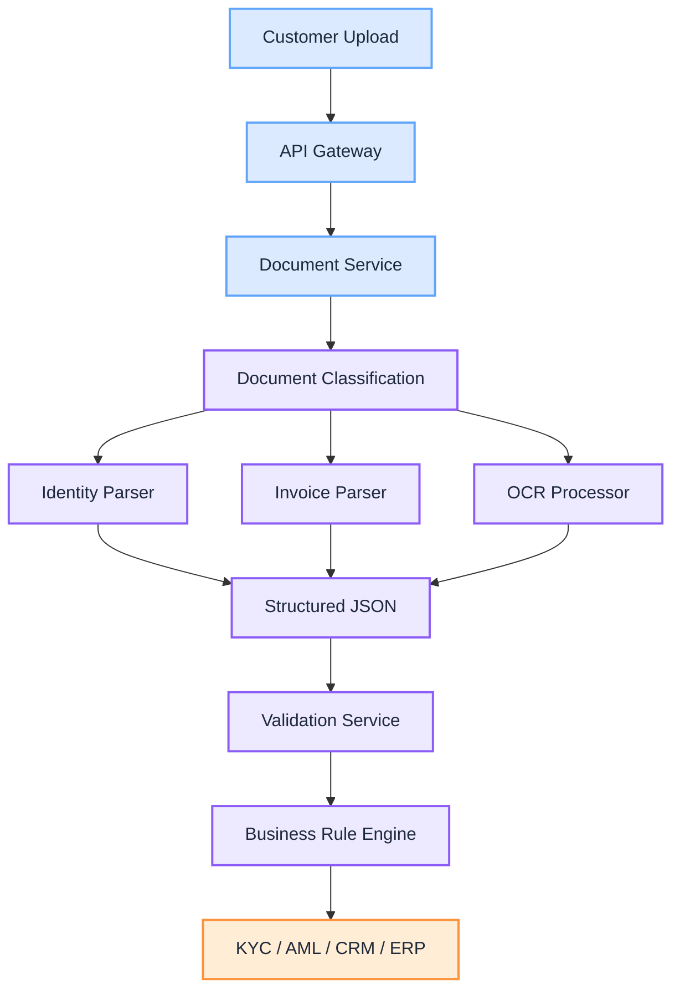

import Details from '@theme/Details';
import Tabs from '@theme/Tabs';
import TabItem from '@theme/TabItem';

<br/>



# Google Document AI Under the Hood: OCR, Parsers, Processors, and Enterprise Document Intelligence

When most engineers hear OCR (Optical Character Recognition), they think about converting a scanned PDF into text. OCR is an important first step, but modern enterprise document processing goes far beyond recognizing characters. Businesses need systems that understand invoices, passports, driver's licences, tax forms, purchase orders, bank statements, contracts, and countless other document types.

This is exactly what Google Cloud Document AI provides. Rather than offering a single OCR API, Document AI is a platform of specialized processors. Each processor is trained to understand a particular class of documents and return structured business information instead of raw text.

This is an explainer: how Document AI works internally, what each processor does, when to use it, and how the pieces fit an enterprise architecture.

:::tip[THE CLAIM]
Document AI is not a single OCR engine. It is a collection of specialized document understanding processors built on a shared OCR and layout foundation. Every processor starts by recognizing text and reconstructing structure, then applies domain intelligence to extract business entities such as invoice totals, passport numbers, account balances, or custom fields.
:::

<!-- truncate -->

## Traditional OCR vs Document AI

Traditional OCR answers one question: "What text is present on this page?" Document AI answers a much richer one: "What document is this, where is everything located, and what business information does it contain?"

<Tabs groupId="ocr-vs-document-ai">
  <TabItem value="traditional-ocr" label="Traditional OCR" default>



<br/>

  </TabItem>
  <TabItem value="document-ai" label="Document AI">



<br/>

  </TabItem>
</Tabs>

Traditional OCR gives you characters. Document AI gives you meaning tied to a location on the page.

## The core processing pipeline

Almost every Document AI processor begins with the same foundational stages. Only the final stage changes based on the processor you select.

<div className="gain-diagram-wrap">



</div>
<br/>

### Stage 1: image processing

Incoming documents may arrive as PDF, TIFF, PNG, JPEG, scanned images, or mobile phone photos. The service first removes noise, rotates pages, corrects skew, improves contrast, and separates pages so downstream stages work on a clean canvas.

### Stage 2: OCR

OCR identifies every visible character and turns it into machine-readable text. Google also records character, word, line, and paragraph positions plus page numbers.

<Details summary="Stage 2 example: raw invoice snippet becomes text">

```text
Invoice Number

INV-98231
```

Each token is captured with its position on the page, not just the string value.

</Details>

### Stage 3: layout analysis

Instead of treating the page as a flat stream of text, Document AI reconstructs it. It identifies titles, headers, footers, paragraphs, lists, tables, images, signatures, and checkboxes.

<Details summary="Stage 3 example: distinct layout regions">

```text
----------------------------------
Invoice

Supplier

ABC Pty Ltd

Invoice Number

INV-12345
----------------------------------
```

The processor understands these are distinct regions, not one paragraph.

</Details>

### Stage 4: reading order

Human documents rarely flow perfectly from top to bottom. They contain two columns, side notes, floating text, and rotated tables. Document AI reconstructs the natural reading order so the text makes sense in sequence.

### Stage 5: processor-specific intelligence

Only after OCR and layout reconstruction does the selected processor begin extracting business meaning. This is where processors differ, and it is the subject of the next section.

:::tip[TAKEAWAY]
The first four stages are shared plumbing. The value of Document AI is that you pick the right processor for stage five, and it returns business entities instead of leaving you to parse text yourself.
:::

## Processor families

Google Document AI contains multiple processor families. Each one takes the same pre-processed document and returns a different shape of structured data. The examples below show a representative input and the structured output for each. Click each block to expand. Collapsed by default.

:::note[The outputs below are simplified]
Every processor actually returns the **same** top-level schema: one `Document` object. Extracted fields appear as items in an `entities[]` array, and each entity shares the same envelope (`type`, `mentionText`, `normalizedValue`, `confidence`, `pageAnchor`, `textAnchor`, and nested `properties[]`). Only the `type` labels differ per processor. Pure OCR and Layout processors populate `pages[]` (tokens, tables, form fields) rather than `entities[]`. The per-parser JSON below is a flattened business view for readability. See [The real API shape](#the-real-api-shape) for the raw envelope.
:::

### 1. OCR Processor

Extracts text from any document: pages, paragraphs, lines, words, bounding boxes, and confidence scores. Ideal for books, reports, manuals, articles, and scanned documents. It does not understand invoices, passports, forms, or contracts.

<Details summary="OCR Processor: input and output">

Input:

```text
Page 1
Quarterly Report

Revenue grew 12% year over year.

Page 2
Regional Breakdown

APAC contributed 34% of total revenue.
```

Output:

```json
{
  "pages": [
    {
      "page_number": 1,
      "paragraphs": [
        {
          "text": "Quarterly Report",
          "confidence": 0.994,
          "bounding_box": [0.08, 0.05, 0.42, 0.09]
        },
        {
          "text": "Revenue grew 12% year over year.",
          "confidence": 0.991,
          "bounding_box": [0.08, 0.12, 0.66, 0.16]
        }
      ]
    },
    {
      "page_number": 2,
      "paragraphs": [
        {
          "text": "Regional Breakdown",
          "confidence": 0.993,
          "bounding_box": [0.08, 0.05, 0.44, 0.09]
        },
        {
          "text": "APAC contributed 34% of total revenue.",
          "confidence": 0.989,
          "bounding_box": [0.08, 0.12, 0.71, 0.16]
        }
      ]
    }
  ]
}
```

</Details>

### 2. Layout Parser

Understands page structure: headings, sections, tables, reading order, and document hierarchy. Ideal for reports, research papers, magazines, and long PDFs.

<Details summary="Layout Parser: input and output">

Input:

```text
Methods

We sampled 1,000 documents.

| Type    | Count |
| Invoice | 620   |
| Receipt | 380   |

Figure 1: distribution
```

Output:

```json
{
  "document": {
    "children": [
      { "type": "heading", "text": "Methods" },
      { "type": "paragraph", "text": "We sampled 1,000 documents." },
      {
        "type": "table",
        "rows": [
          ["Type", "Count"],
          ["Invoice", "620"],
          ["Receipt", "380"]
        ]
      },
      { "type": "image_caption", "text": "Figure 1: distribution" }
    ]
  }
}
```

</Details>

### 3. Form Parser

Forms contain labels and values. The Form Parser automatically pairs them into key-value fields. Perfect for application forms, claim forms, onboarding forms, and surveys.

<Details summary="Form Parser: input and output">

Input:

```text
First Name: John

Last Name: Smith

DOB: 10 Jan 1990
```

Output:

```json
{
  "First Name": "John",
  "Last Name": "Smith",
  "DOB": "10 Jan 1990"
}
```

</Details>

### 4. Invoice Parser

Designed specifically for invoices. Instead of returning text, it extracts business entities: invoice id, supplier, total, line items, tax, currency, purchase order, and payment terms.

<Details summary="Invoice Parser: input and output">

Input:

```text
Invoice Number

INV-1001

Supplier

Google

Line Items
Cloud Compute   $500.00
Support         $32.50

Total

$532.50
```

Output:

```json
{
  "invoice_id": "INV-1001",
  "supplier": "Google",
  "currency": "USD",
  "line_items": [
    { "description": "Cloud Compute", "amount": "500.00" },
    { "description": "Support", "amount": "32.50" }
  ],
  "total": "532.50"
}
```

</Details>

### 5. Expense Parser

Designed for receipts, expense claims, restaurant bills, and travel receipts. Extracts merchant, subtotal, GST/VAT, total, payment method, and date. Ideal for expense management systems.

<Details summary="Expense Parser: input and output">

Input:

```text
The Coffee House
Date: 12 Mar 2026

Flat White      6.00
Muffin          4.50

Subtotal       10.50
GST             1.05
Total          11.55

VISA ****1234
```

Output:

```json
{
  "merchant": "The Coffee House",
  "date": "2026-03-12",
  "subtotal": "10.50",
  "gst_vat": "1.05",
  "total": "11.55",
  "payment_method": "VISA ****1234"
}
```

</Details>

### 6. Identity Document Parser

Designed for KYC. Supports passports, driver's licences, national IDs, and residence permits. Returns document number, surname, date of birth, expiry, nationality, issuing country, and the machine-readable zone (MRZ).

<Details summary="Identity Parser: input and output">

Input:

```text
PASSPORT
Surname: SMITH
Given Names: JOHN
Passport No: N123456
Nationality: AUSTRALIAN
Date of Birth: 01 JAN 1990
Date of Expiry: 10 FEB 2035

P<AUSSMITH<<JOHN<<<<<<<<<<<<<<<<<<<<<<<<<<<<
N123456<7AUS9001019M3502108<<<<<<<<<<<<<<<<06
```

Output:

```json
{
  "document_type": "passport",
  "passport_number": "N123456",
  "surname": "Smith",
  "given_names": "John",
  "nationality": "AUS",
  "issuing_country": "AUS",
  "dob": "1990-01-01",
  "expiry": "2035-02-10",
  "mrz": "P<AUSSMITH<<JOHN<<<<..."
}
```

</Details>

### 7. Procurement Parser

Specialized for procurement documents such as purchase orders, invoices, and goods received notes. Extracts PO number, vendor, buyer, line items, and totals.

<Details summary="Procurement Parser: input and output">

Input:

```text
PURCHASE ORDER
PO Number: PO-77521
Buyer: Acme Corp
Vendor: ABC Pty Ltd

10 x Widget A    $250.00
 5 x Widget B    $180.00

Total: $430.00
```

Output:

```json
{
  "po_number": "PO-77521",
  "buyer": "Acme Corp",
  "vendor": "ABC Pty Ltd",
  "line_items": [
    { "description": "Widget A", "quantity": 10, "amount": "250.00" },
    { "description": "Widget B", "quantity": 5, "amount": "180.00" }
  ],
  "total": "430.00"
}
```

</Details>

### 8. Bank Statement Parser

Designed for financial institutions. Extracts account number, opening balance, closing balance, transactions, and dates. Ideal for mortgage processing, loan approvals, and customer onboarding.

<Details summary="Bank Statement Parser: input and output">

Input:

```text
Account: 0012-345678
Opening Balance: 1,200.00

01 Mar  Salary        +3,000.00
05 Mar  Rent          -1,500.00
09 Mar  Groceries       -180.00

Closing Balance: 2,520.00
```

Output:

```json
{
  "account_number": "0012-345678",
  "opening_balance": "1200.00",
  "closing_balance": "2520.00",
  "transactions": [
    { "date": "2026-03-01", "description": "Salary", "amount": "3000.00" },
    { "date": "2026-03-05", "description": "Rent", "amount": "-1500.00" },
    { "date": "2026-03-09", "description": "Groceries", "amount": "-180.00" }
  ]
}
```

</Details>

### 9. Contract Parser

Contracts contain complex legal structures. Instead of extracting only text, this processor identifies parties, clauses, obligations, dates, signatures, and renewal terms. Useful for legal automation.

<Details summary="Contract Parser: input and output">

Input:

```text
SERVICE AGREEMENT
Between: Acme Corp ("Client") and ABC Pty Ltd ("Provider")
Effective Date: 01 Jan 2026
Term: 12 months, auto-renewing unless terminated with 60 days notice.
```

Output:

```json
{
  "parties": [
    { "name": "Acme Corp", "role": "Client" },
    { "name": "ABC Pty Ltd", "role": "Provider" }
  ],
  "effective_date": "2026-01-01",
  "term_months": 12,
  "renewal": {
    "auto_renew": true,
    "notice_days": 60
  }
}
```

</Details>

### 10. Lending Parser

Used by financial institutions for mortgage documents, income statements, and loan applications. Extracts borrower, employer, salary, liabilities, and assets.

<Details summary="Lending Parser: input and output">

Input:

```text
Borrower: John Smith
Employer: Globex Inc
Gross Annual Salary: $120,000

Liabilities: Car Loan $18,000
Assets: Savings $45,000
```

Output:

```json
{
  "borrower": "John Smith",
  "employer": "Globex Inc",
  "annual_salary": "120000.00",
  "liabilities": [
    { "type": "car_loan", "amount": "18000.00" }
  ],
  "assets": [
    { "type": "savings", "amount": "45000.00" }
  ]
}
```

</Details>

### 11. Tax Form Parser

Designed for tax documents such as W-2, W-9, 1099, and country-specific tax forms. Returns structured tax fields.

<Details summary="Tax Form Parser: input and output">

Input:

```text
Form W-2 Wage and Tax Statement
Employer EIN: 12-3456789
Wages, tips: 85,000.00
Federal income tax withheld: 12,400.00
```

Output:

```json
{
  "form_type": "W-2",
  "employer_ein": "12-3456789",
  "wages": "85000.00",
  "federal_tax_withheld": "12400.00"
}
```

</Details>

### 12. Custom Extractor

Sometimes organizations have proprietary documents with fields Google cannot know in advance. You train the processor on your own examples, then it extracts your custom fields.

<Details summary="Custom Extractor: input and output">

Input:

```text
Customer Onboarding Form

Customer Risk

Medium

Relationship Manager

Sarah

Portfolio

Corporate Banking
```

Output (after training):

```json
{
  "customer_risk": "Medium",
  "relationship_manager": "Sarah",
  "portfolio": "Corporate Banking"
}
```

</Details>

## What every processor shares

All processors return much more than extracted values. Each field typically includes the value, a confidence score, the page, coordinates, and a text anchor back into the OCR output.

<Details summary="Shared field envelope: value plus provenance">

```json
{
  "type": "invoice_total",
  "value": "512.43",
  "confidence": 0.996,
  "page": 1,
  "bounding_box": [0.72, 0.88, 0.94, 0.92]
}
```

This lets applications display exactly where a value was found and highlight it for a reviewer.

</Details>

## The real API shape

The flattened examples above are convenient, but they are not what the API returns on the wire. Every processor responds with a single `Document` object. Extraction processors put their results in `entities[]`, where each entity uses one consistent envelope and only the `type` differs between an invoice, a passport, or a bank statement. Nested data (invoice line items, address components) appears under `properties[]`.

<Details summary="Raw Document response: two-page Invoice Parser entities[]">

A two-page invoice from the Invoice Parser, in the actual response shape. Note the single global `text` string spans both pages, `pages[]` has one entry per page, and each entity's `pageAnchor.pageRefs[].page` plus `textAnchor.textSegments[]` point back into that one `text`. Page 1 carries the header and first line item; page 2 carries the remaining line item and the total.

```json
{
  "text": "Invoice Number\nINV-1001\nSupplier\nGoogle\nCloud Compute $500.00\n--- Page 2 ---\nSupport $32.50\nTotal\n$532.50",
  "pages": [
    {
      "pageNumber": 1,
      "dimension": { "width": 612, "height": 792, "unit": "points" },
      "tables": [],
      "formFields": []
    },
    {
      "pageNumber": 2,
      "dimension": { "width": 612, "height": 792, "unit": "points" },
      "tables": [],
      "formFields": []
    }
  ],
  "entities": [
    {
      "type": "invoice_id",
      "mentionText": "INV-1001",
      "normalizedValue": { "text": "INV-1001" },
      "confidence": 0.996,
      "pageAnchor": { "pageRefs": [ { "page": "0", "boundingPoly": {} } ] },
      "textAnchor": { "textSegments": [ { "startIndex": "15", "endIndex": "23" } ] }
    },
    {
      "type": "supplier_name",
      "mentionText": "Google",
      "normalizedValue": { "text": "Google" },
      "confidence": 0.981,
      "pageAnchor": { "pageRefs": [ { "page": "0", "boundingPoly": {} } ] },
      "textAnchor": { "textSegments": [ { "startIndex": "33", "endIndex": "39" } ] }
    },
    {
      "type": "line_item",
      "mentionText": "Cloud Compute $500.00",
      "confidence": 0.972,
      "pageAnchor": { "pageRefs": [ { "page": "0", "boundingPoly": {} } ] },
      "textAnchor": { "textSegments": [ { "startIndex": "40", "endIndex": "61" } ] },
      "properties": [
        { "type": "line_item/description", "mentionText": "Cloud Compute" },
        { "type": "line_item/amount", "mentionText": "500.00" }
      ]
    },
    {
      "type": "line_item",
      "mentionText": "Support $32.50",
      "confidence": 0.968,
      "pageAnchor": { "pageRefs": [ { "page": "1", "boundingPoly": {} } ] },
      "textAnchor": { "textSegments": [ { "startIndex": "76", "endIndex": "90" } ] },
      "properties": [
        { "type": "line_item/description", "mentionText": "Support" },
        { "type": "line_item/amount", "mentionText": "32.50" }
      ]
    },
    {
      "type": "total_amount",
      "mentionText": "$532.50",
      "normalizedValue": { "money": { "currencyCode": "USD", "units": "532", "nanos": 500000000 } },
      "confidence": 0.995,
      "pageAnchor": { "pageRefs": [ { "page": "1", "boundingPoly": {} } ] },
      "textAnchor": { "textSegments": [ { "startIndex": "97", "endIndex": "104" } ] }
    }
  ]
}
```

Two things to read off this shape. First, `pageAnchor.pageRefs[].page` is a zero-based index, so `"0"` is page 1 and `"1"` is page 2. Entities can live on any page, and a single entity can even span pages via multiple `textSegments`. Second, swap the `type` values (for example `passport_number`, `expiry_date`) and this same envelope describes an Identity Parser or any other extraction processor.

</Details>

### Pages, form fields, and tables

In the examples above `pages[].tables` and `pages[].formFields` are empty. They stay empty unless the processor you ran actually detects that structure. Which processor you pick decides which arrays get populated.

| Field | Filled by | Usually empty for |
| --- | --- | --- |
| `formFields` | Form Parser | OCR Processor, specialized extractors (they use `entities[]`) |
| `tables` | Form Parser, Layout Parser | OCR Processor |
| `entities` | Invoice, Identity, Expense, Custom, and other extractors | OCR, Layout, Form Parser (Form Parser uses `formFields`) |

Specialized extractors such as Invoice and Identity return their business data in `entities[]`, which is why the arrays are empty in the invoice response. Run the Form Parser or Layout Parser on the same document and the page structures fill in instead.

<Details summary="Filled formFields: Form Parser key-value pairs">

The Form Parser records each label and value as a `FormField`. Both `fieldName` and `fieldValue` point into the global `text` via `textAnchor`.

```json
"formFields": [
  {
    "fieldName": {
      "textAnchor": { "textSegments": [ { "startIndex": "0", "endIndex": "10" } ], "content": "First Name" },
      "confidence": 0.983,
      "boundingPoly": {}
    },
    "fieldValue": {
      "textAnchor": { "textSegments": [ { "startIndex": "12", "endIndex": "16" } ], "content": "John" },
      "confidence": 0.979,
      "boundingPoly": {}
    },
    "valueType": "text"
  }
]
```

Checkboxes use the same shape with `valueType` set to `filled_checkbox` or `unfilled_checkbox`.

</Details>

<Details summary="Filled tables: Form Parser or Layout Parser grid">

A `Table` has `headerRows[]` and `bodyRows[]`. Each row is a list of `cells[]`, and every cell carries its own `layout.textAnchor` plus optional `rowSpan` and `colSpan`.

```json
"tables": [
  {
    "layout": { "boundingPoly": {}, "textAnchor": {} },
    "headerRows": [
      { "cells": [
        { "layout": { "textAnchor": { "content": "Item" } }, "rowSpan": 1, "colSpan": 1 },
        { "layout": { "textAnchor": { "content": "Amount" } }, "rowSpan": 1, "colSpan": 1 }
      ] }
    ],
    "bodyRows": [
      { "cells": [
        { "layout": { "textAnchor": { "content": "Cloud Compute" } } },
        { "layout": { "textAnchor": { "content": "500.00" } } }
      ] },
      { "cells": [
        { "layout": { "textAnchor": { "content": "Support" } } },
        { "layout": { "textAnchor": { "content": "32.50" } } }
      ] }
    ]
  }
]
```

</Details>

## Confidence scores and human in the loop

Every extracted entity carries a confidence score. Enterprises turn those scores into routing rules so that clean documents flow through automatically while uncertain ones get a human.

| Confidence | Typical rule |
| --- | --- |
| Greater than 99% | Auto approve |
| 90% to 99% | Business validation |
| Below 90% | Human review |

<Details summary="Example: per-field confidence on one invoice">

```text
Invoice Number   99.8%
Supplier         98.7%
Total            99.5%
```

Here the supplier falls in the validation band, so the record is flagged for a quick check while the rest auto approves.

</Details>

## Which processor should you use?

| Document | Recommended processor |
| --- | --- |
| Scanned PDF | OCR Processor |
| Research paper | Layout Parser |
| Application form | Form Parser |
| Invoice | Invoice Parser |
| Receipt | Expense Parser |
| Passport | Identity Parser |
| Driver licence | Identity Parser |
| Purchase order | Procurement Parser |
| Bank statement | Bank Statement Parser |
| Contract | Contract Parser |
| Mortgage package | Lending Parser |
| Proprietary business form | Custom Extractor |

## Enterprise KYC example

Imagine a customer uploads a passport, a driver's licence, and a utility bill. Your application routes each document to the appropriate processor, then applies business rules to the structured results. This is the same routing discipline described in [How to Design an Intent Router for Agentic AI](/insights/design-intent-router): a deterministic classification step decides where each input goes before any deeper processing runs.

<div className="gain-diagram-wrap">



</div>
<br/>

Your business logic then validates the extracted data. Are names consistent across documents? Is the address the same? Has the passport expired? Are all mandatory fields present? Does the customer pass AML screening? Document AI handles the understanding; your application focuses on orchestration and business rules.

## Typical enterprise architecture

<div className="gain-diagram-wrap">



</div>
<br/>

## Benefits for enterprise systems

By using specialized processors instead of generic OCR, organizations can:

- Reduce custom parsing logic.
- Eliminate brittle regular expressions.
- Improve extraction accuracy with domain-trained models.
- Accelerate onboarding and document workflows.
- Support human in the loop review using confidence scores.
- Integrate structured data directly into downstream systems such as CRM, ERP, KYC, and workflow engines.

## Final takeaway

Document AI is not a single OCR engine. It is a collection of specialized document understanding processors built on a common OCR and layout foundation. Every processor begins by recognizing text and reconstructing structure, then applies domain intelligence to extract meaningful entities such as invoice totals, passport numbers, account balances, contract clauses, or custom business fields.

For enterprise architects, this means document processing shifts from text recognition to intelligent information extraction. Applications no longer spend effort parsing documents by hand. Instead they orchestrate the right processor, validate the extracted data, and apply business workflows. That separation of concerns yields simpler architectures, higher accuracy, and faster delivery of document-driven processes.

:::info[Builds on]
[How to Design an Intent Router for Agentic AI](/insights/design-intent-router) · [How LLM Works Under the Hood](/insights/how-llm-works-under-the-hood)
:::
