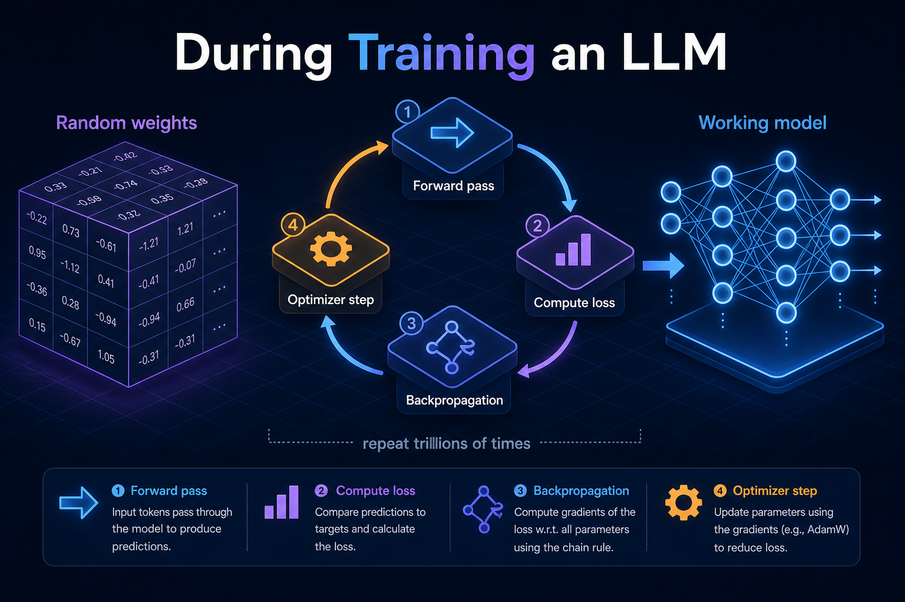
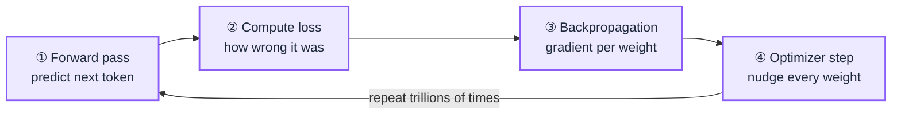
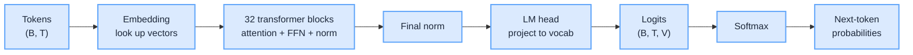
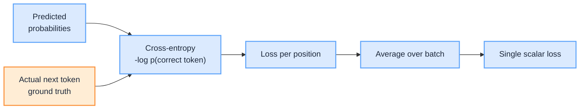
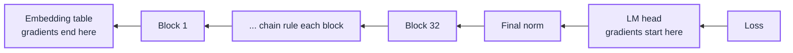
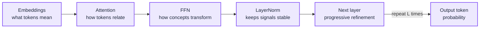

import Details from '@theme/Details';

<br/>



# During Training an LLM: From Random Weights to a Working Model

Before training, two things are already finalised: the shape of every weight tensor and the vocabulary of token ids. This page covers what happens inside those tensors as training runs, the journey from random numbers to a model that can read, reason, and write.

We split it into three phases:

1. **Start of training:** every weight is a random number. The model is mathematically valid but cognitively empty.
2. **The training loop:** the four-step inner cycle (forward pass, compute loss, backpropagation, optimizer step) that converts data into weight updates, repeated trillions of times.
3. **What each component learns:** the specific role every part of the network drifts into as that loop runs.

That is pre-training: a capable next-token model. Turning that into a helpful assistant is a separate stage (SFT and preference tuning), covered in [Aligning an LLM](/insights/aligning-an-llm).

This is a deep dive into Stage 2 of [How LLM Works Under the Hood](/insights/how-llm-works-under-the-hood), and the sequel to [Before Training an LLM: From Design Dials to a Frozen Shape](/insights/before-training-an-llm), which covers everything decided before the first forward pass.

:::tip[THE CLAIM]
A model is not programmed, it is grown by one four-step loop repeated trillions of times. Every role (embeddings encode meaning, attention tracks relationships, FFNs transform) is not designed in. Each role is simply the equilibrium gradient descent settles into because it happens to reduce the loss.
:::

<!-- truncate -->

## 1. Start of training: randomly initialised

When training begins, every learnable tensor is filled with small random values (typically a Gaussian or truncated-normal initialisation). Concretely, that means:

| Component | Tensors | Eventually learns |
| --- | --- | --- |
| **Embedding layer** | Token embedding matrix `E ∈ R^(vocab_size × hidden_size)`, one row per token; optional learned positional embeddings (only if not using RoPE / ALiBi) | What each token means |
| **Attention (every block)** | Query `W_Q`, Key `W_K`, Value `W_V`, Output projection `W_O` | To project tokens into spaces where "similarity = relevance" |
| **Feed-forward (FFN)** | Expansion matrix (`hidden_size → ffn_hidden`), compression matrix (`ffn_hidden → hidden_size`) | The non-linear transforms that turn context into conclusions |
| **LayerNorm** | Scale `γ` and bias `β`, typically initialised to `γ = 1`, `β = 0` | How strongly each feature should contribute |

At initialization the model has no language understanding, no relationships between tokens, and no reasoning. It holds only random numerical values.

:::important[Mathematically valid, cognitively empty]
A forward pass will run end to end and produce a probability distribution over the next token, but that distribution is essentially uniform garbage. Every weight is waiting for backpropagation to assign it a job.
:::

## 2. The training loop: how learning actually happens

Random weights become meaningful weights through a single inner loop, repeated trillions of times. Every iteration is exactly four steps.

<div className="gain-diagram-wrap">



</div>
<br/>

### Step 1: forward pass

A batch of tokenised sequences (shape `(B, T)`) flows through the model end to end. For every position in the batch, the model outputs a probability distribution over the entire vocabulary (size `V`), its prediction of the next token at that position.

<div className="gain-diagram-wrap">



</div>
<br/>

The forward pass is really just a chain of shape transformations. Token ids go in; a probability distribution over the vocabulary comes out, for every position at once.

<Details summary="Tracking the shapes (D = 4096, V = 32000, B = 4, T = 2048)">

```text
(B, T)      <- token ids (integers)                    e.g. (4, 2048)
  | embedding lookup
(B, T, D)   <- each id replaced by its D-dim vector         (4, 2048, 4096)
  | 32 transformer blocks (attention + FFN + norm)
(B, T, D)   <- same shape, but now context-aware
  | final norm + LM head (project D -> V)
(B, T, V)   <- logits: a raw score per vocab token          (4, 2048, 32000)
  | softmax over the last dim
(B, T, V)   <- probabilities (each row sums to 1)
```

The shape stays `(B, T, D)` the whole way through the 32 blocks. Each block re-writes the vectors in place; it never changes the dimensions.

</Details>

<Details summary="What each stage does">

**Embedding lookup:** each integer id is a row index into the embedding table `E` of shape `(V, D)`.

```text
id 982 -> E[982] -> a 4096-dim vector
```

Do that for all `B × T` ids and you get a `(B, T, D)` tensor. No math, just a lookup.

**The 32 transformer blocks:** each block updates every token's vector, and every position is processed in parallel.

1. Attention mixes in information from other tokens. With causal masking, position `t` can only see positions `<= t`; it cannot peek at the future, which would make next-token prediction trivial.
2. FFN independently transforms each token's vector (the "thinking" step).
3. LayerNorm and residual wrap both, keeping signals stable.

**LM head to logits:** a final matrix `(D, V)` projects each vector to `V` raw scores: `(B, T, D) × (D, V) -> (B, T, V)`.

**Softmax to probabilities:** squashes each row of `V` logits into a probability distribution (positive, sums to 1).

```text
p(token i) = exp(logit_i) / sum_j exp(logit_j)
```

</Details>

:::tip[TAKEAWAY]
All `T` predictions are computed in one pass, not token by token. Token-by-token generation only happens at inference. During training the whole sequence is scored simultaneously, and causal masking is what lets the model predict at all `T` positions at once without cheating.
:::

### Step 2: compute the loss

The model's prediction is compared against the actual next token in the training data, using the cross-entropy loss.

<div className="gain-diagram-wrap">



</div>
<br/>

<Details summary="The simplest way to see it">

The model read "The cat sat on the" and has to guess the next word. It produced a probability for every token in the vocabulary, but the loss only looks at the probability it gave to the one correct answer (`mat`):

```text
The model's guesses after "The cat sat on the":
  mat   -> 0.60   correct answer
  floor -> 0.20
  table -> 0.15
  ...   -> ...

Loss = -log(0.60) = 0.51
```

Now imagine three versions of the model making that same guess. Only the probability on `mat` matters:

```text
Confident & right:  p(mat) = 0.95 -> -log(0.95) = 0.05   tiny loss
Unsure:             p(mat) = 0.30 -> -log(0.30) = 1.20   medium
Confident & wrong:  p(mat) = 0.01 -> -log(0.01) = 4.61   huge loss
```

The rule in plain words: give the right token a high probability and the loss is small; give it a low probability and the loss is big. Being confidently wrong is punished the hardest.

</Details>

The loss collapses the model's billions of predictions into a single scalar, one number that summarises how wrong the entire batch was.

| Loss value | What it means |
| --- | --- |
| `ln(V) = 10.4` for `V = 32k` | Random guessing, what you get at step 0 with random weights |
| `= 3.5` | Surface-level grammar, weak coherence |
| `= 2.0` | Coherent paragraphs, basic reasoning |
| `= 1.8` | A well-trained 7B model |
| `< 1.5` | Frontier-class models on the same data |

Lower loss means the model assigned higher probability to the actual next token. The entire point of training is to make this one number smaller, step by step.

### Step 3: backpropagation

Backpropagation answers one question for every learnable weight in the model: "If I changed this weight by a tiny amount, how would the loss change?" That number is the weight's gradient. For a 7B model that means about 7 billion gradients, one per parameter, all computed in a single pass by applying the chain rule backwards through the network.

<div className="gain-diagram-wrap">



</div>
<br/>

<Details summary="The starting signal: prediction - truth">

Backprop does not start from nowhere. It starts from one simple vector at the logits (the `V` raw scores before softmax). For softmax with cross-entropy, the gradient at each logit is just:

```text
gradient at logit i = predicted_probability_i - truth_i = p_i - y_i
```

where `y_i` is `1` for the correct token's id and `0` for every other token. This is exactly where the real token id from the loss step gets used. Using `mat` (id 2603) as the correct next token:

```text
slot                  predicted p   truth y   gradient (p - y)
id 2603 ("mat")       0.60          1         -0.40   <- correct token
id 5527 ("floor")     0.20          0         +0.20
id 7891 ("table")     0.15          0         +0.15
... all other tokens  tiny          0         +tiny
```

Read those numbers as instructions (we move opposite the gradient):

- correct token: negative gradient, push this logit up
- every wrong token: positive gradient, push these logits down

That single `(p - y)` vector, raise the right token's score and lower the rest, is the seed that flows backward through the whole network.

</Details>

<Details summary="How the signal reaches every weight">

As `(p - y)` flows backward, each layer is told how the loss changes with respect to its output, and from that it computes two things locally:

1. the gradient for its own weights, stored for the optimizer to use, and
2. the gradient for its input, handed down to the layer below, which then repeats the same two steps.

Repeat down all 32 blocks and every one of the roughly 7B parameters ends up with its own gradient. Two reasons a single batch touches every weight:

- The whole network was on the path from input to loss, so the chain rule reaches all of it.
- Attention mixed the tokens, so the error on predicting `mat` flows back into the representations of `the`, `cat`, and `sat` too. One wrong prediction adjusts weights all across the network, not just near the output.

For backprop to work, the forward pass had to remember the intermediate activations at every layer. This is why training a 7B model needs far more GPU memory than running inference on the same model: the activations across all layers must be held in memory until the backward pass consumes them.

</Details>

:::important[Backprop computes, it does not update]
Backprop only computes gradients; it never changes a weight. It produces the `dloss/dw` number for all roughly 7B parameters. Actually moving the weights is the optimizer's job (Step 4).

| Phase | What it does | Changes weights? |
| --- | --- | --- |
| Backpropagation | flows `(p - y)` backward, computes a gradient per weight | No |
| Optimizer step | applies `w <- w - lr × gradient` to all weights at once | Yes |
:::

### Step 4: optimizer step

Once every weight has a gradient, the optimizer uses it to actually update the weights. The basic update rule of every optimiser is:

<Details summary="The update rule">

```text
weight <- weight - learning_rate × adjusted_gradient
```

- `learning_rate` is tiny (e.g. `1e-4` to `3e-4` for a 7B model) and follows a schedule (a short warmup followed by cosine or linear decay).
- `adjusted_gradient` is the raw gradient massaged by the optimiser. Modern LLMs almost always use **AdamW**, which tracks a running average of past gradients (momentum) and of their squared magnitudes (variance) per weight. This adapts the effective step size per parameter and damps oscillations.

After this step, every one of the model's billions of weights has moved a tiny distance in the direction that would have reduced the loss on this batch.

</Details>

The bare rule is the skeleton. In a production run, four extra mechanics wrap every step to keep the update fast and stable.

| Mechanism | What it does | Why it matters |
| --- | --- | --- |
| **Learning-rate warmup** | ramp `lr` from near 0 up to its peak over the first few thousand steps | a freshly initialised model produces wild gradients; starting at full `lr` would blow it up |
| **Cosine / linear decay** | after warmup, smoothly anneal `lr` back toward 0 over the run | large steps early to explore, tiny steps late to settle into a sharp minimum |
| **Gradient clipping** | rescale the whole gradient if its global norm exceeds a threshold (e.g. `1.0`) | one pathological batch can produce a huge gradient; clipping caps the step so a single batch cannot wreck the weights |
| **Weight decay** (the "W" in AdamW) | pull every weight slightly toward zero each step | mild regularisation that stops weights drifting to large values and improves generalisation |

On top of these, large runs train in **mixed precision**: the matrix multiplies run in bf16 (half the memory, much faster on modern GPUs) while an fp32 master copy of each weight is kept for the actual update, so the tiny `lr × gradient` nudge does not vanish to rounding. bf16 is preferred over fp16 because its wider exponent range rarely overflows.

:::note[Guardrails, not a new loop]
None of these change the shape of the loop; it is still forward, loss, backprop, step. They are guardrails and accelerators bolted onto step 4 so that hundreds of thousands of updates compound smoothly instead of diverging.
:::

### Repeat: trillions of tokens

One training step typically processes a batch of about 4 M tokens (e.g. 2048 sequences by 2048 tokens). A modern 7B pre-training run processes roughly 1 to 15 trillion tokens in total, about 250k to 4M training steps.

<Details summary="What 2048 sequences by 2048 tokens actually means">

The `(B, T)` batch is a rectangle of tokens: `B` is how many sequences are stacked, `T` is how many tokens are in each one. Its area is the tokens processed per step.

```text
tokens per step = B × T = 2048 × 2048 = 4,000,000
```

A sequence is not a line and not a document. It is a fixed window of `T` tokens (about 1,500 words, several paragraphs). The corpus is first flattened into one continuous token stream with documents glued together by `<EOS>` markers, then sliced every `T` tokens ignoring line and document boundaries (the packing strategy):

```text
...the cat sat on the mat <EOS> Recipe: preheat oven to 200C ... <EOS> def main(): ...
|------------ sequence 1 (2048 tokens) ------------|--- sequence 2 ---|
```

So a single sequence can span the end of one document and the start of the next, hold several short documents, or be a middle slice of one long document.

</Details>

<Details summary="Token and sequence, by example">

A token is one entry from the model's vocabulary, usually a piece of a word, not a whole word. As a rule of thumb, 1 token is about three quarters of an English word (roughly 4 characters). The tokenizer maps each piece to an integer id:

```text
text:   "Tokenization isn't magic."
tokens: "Token" | "ization" | " isn" | "'t" | " magic" | "."
ids:     15496  |  1634     |  5818  | 470  |  5536    | 13
```

6 tokens for 4 words. Notice "Tokenization" alone became 2 tokens, and the leading space is part of the token (`" isn"`, `" magic"`).

A sequence is just `T` of those ids in a row. With a tiny `T = 12` (real runs use 2048):

```text
text: "The cat sat on the mat. The dog ran in the park."
ids:  [ 464, 3797, 3332, 319, 262, 2603, 13, 383, 3290, 4966, 287, 262 ]
      |---------------- one sequence: T = 12 tokens ----------------|
```

The slice ends mid-sentence: the window is a fixed length, it does NOT stop at sentence or line ends. Stack `B` of these `T`-token rows and you have the `(B, T)` batch the forward pass consumes.

| Term | What it is | Rough size |
| --- | --- | --- |
| token | one vocab unit (about ¾ of a word) | 1 cell |
| line | a visual row of text | 10 to 30 tokens |
| sequence | one fixed `T`-token training window | 2048 tokens (a few pages) |
| batch | `B` sequences stacked together | 2048 × 2048 = about 4 M tokens |

</Details>

:::important[Batches are shuffled, not consecutive]
The `B` sequences in a batch are pulled from random locations across the corpus, not read in order. This keeps each batch's gradient representative of the whole dataset rather than one narrow topic.
:::

<Details summary="How many batches in a full run?">

One batch equals one training step equals one weight update. So the number of batches is the total corpus divided by the tokens per step:

```text
number of batches (steps) = total tokens / (B × T)

 1,000,000,000,000 / 4,000,000 =   250,000 batches
15,000,000,000,000 / 4,000,000 = 3,750,000 batches
```

That is hundreds of thousands to millions of `(B, T)` batches, each scooped from the corpus, run through the full four-step loop, and then discarded.

In practice no single GPU holds a 4 M-token batch at once. The effective batch is assembled from data parallelism (split across many GPUs) and gradient accumulation (several small micro-batches summed before one update):

```text
B_effective = micro-batch per GPU × number of GPUs × accumulation steps
```

The model behaves as if it saw all 4 M tokens in one step.

</Details>

<Details summary="Sequential across batches, parallel within each batch">

Does the model chew through batches one at a time, or all at once? Both, on different axes.

- **Across batches: strictly sequential.** Batch 2 trains on the weights that batch 1 just updated, so it cannot start until batch 1 finishes its full four-step loop. This data dependency is irreducible; it is what makes a run a fixed-length march of 250k to 3.75M steps.

```text
batch 1 -> update weights -> batch 2 (sees updated weights) -> update -> batch 3 -> ...
you cannot run these in parallel: each step depends on the last
```

- **Within one batch: massively parallel.** A single `(B, T)` batch is not fed in token by token. All `B × T` (about 4 M) token positions flow through the model in one forward pass and get a prediction simultaneously (teacher forcing plus causal mask make this safe).
- **Within one step: parallel across GPUs.** That one batch is physically split across many GPUs (data parallelism), each computing partial gradients in parallel, which are summed before the single update.

Think of it as nested levels: the model marches through the corpus in lockstep, one batch at a time (sequential), but each step is an enormous parallel computation over millions of tokens spread across thousands of GPUs. The sequential part fixes the length of the run; the parallel parts make each step finish in a fraction of a second instead of hours.

</Details>

<Details summary="Worked example: a 7B / 8B model">

The corpus size is a separate choice from the parameter count. Two reference points for a 7B-class model:

| Guideline | Total tokens | Note |
| --- | --- | --- |
| Chinchilla-optimal (about 20 tokens/param) | about 140 B | compute-optimal minimum |
| Modern practice (over-trained) | 1 to 15 T | Llama-2 7B is about 2 T, Llama-3 8B is about 15 T |

Convert a corpus into steps and weight-nudges (using `B × T = 4 M`):

```text
Llama-3 8B class - 15 T tokens
  steps = 15,000,000,000,000 / 4,000,000 = 3,750,000 steps
  -> all 8 B weights are nudged ~3,750,000 times each
  -> total nudges = 8e9 × 3.75e6 = 3 × 10^19 individual adjustments

Llama-2 7B - 2 T tokens
  steps = 2,000,000,000,000 / 4,000,000 = 500,000 steps
  -> all ~7 B weights nudged ~500,000 times each

scales side by side:
  1 batch  -> ~4 M tokens processed
  1 step   -> ~7-8 B weights each moved a tiny bit, once
  full run -> that repeated 250k-3.75M times
```

Each nudge is tiny (learning rate about `1e-4` to `3e-4`) and differs per weight. It is the accumulation of millions of these small, mostly consistent nudges that turns the random initial numbers into a working model.

</Details>

:::tip[TAKEAWAY]
After enough steps, the random numbers in every weight tensor have been nudged into values where each component plays a specific role. Nobody told the embedding table to encode meaning, or the attention layers to track coreference. Those roles are simply the equilibrium that gradient descent settled into to make the loss as small as possible.
:::

## A worked example: "The cat sat on the mat"

The four steps are easier to see on a single tiny sequence. Take the sentence "The cat sat on the mat" as one training example.

<Details summary="Forward pass: one sequence is many prediction tasks">

All tokens go in together (not one by one). The model runs embeddings, attention, and FFN, and produces a next-token prediction at every position simultaneously:

```text
"The" -> predicts "cat"
"cat" -> predicts "sat"
"sat" -> predicts "on"
"on"  -> predicts "the"
"the" -> predicts "mat"
```

So one sequence is really `T` prediction tasks bundled together, each position predicting the token that follows it:

```text
Position 1: sees [The]               -> predicts -> "cat"
Position 2: sees [The, cat]          -> predicts -> "sat"
Position 3: sees [The, cat, sat]     -> predicts -> "on"
Position 4: sees [The, cat, sat, on] -> predicts -> "the"
...
```

A sequence of length `T` yields `T` predictions (and `T` loss values). Scaled to a full batch: `B × T` predictions per step, e.g. 2048 × 2048, about 4 M, all made at once.

</Details>

<Details summary="Why all positions predict in parallel (teacher forcing + causal mask)">

How can position 2 predict `sat` at the same time as position 1 predicts `cat`, when `cat` is itself position 1's answer? Because predictions never depend on other predictions; they depend only on the real input tokens.

During training the entire ground-truth sequence is fed in as input. So position 2 already has the real word `cat` sitting in front of it; it does not wait for position 1 to guess. This is teacher forcing: the model is always shown the correct prefix, no matter what it would have guessed.

What stops the model from cheating by looking at the answer is the causal mask: each position may attend only to itself and tokens to its left.

```text
can attend to ->
        The  cat  sat  on   the  mat
The   [  Y    .    .    .    .    .  ]
cat   [  Y    Y    .    .    .    .  ]
sat   [  Y    Y    Y    .    .    .  ]
on    [  Y    Y    Y    Y    .    .  ]
the   [  Y    Y    Y    Y    Y    .  ]
mat   [  Y    Y    Y    Y    Y    Y  ]
```

Position `cat` cannot see `sat` (the empty future cells), so predicting `sat` is never trivial. But because every position's legal inputs are already-known real tokens, the GPU computes all `T` predictions in one matrix operation.

This all-at-once behaviour is training only. At inference the future tokens do not exist yet, so the model must generate one token at a time (autoregressive decoding), feeding each output back as the next input.

</Details>

<Details summary="Compute loss: targets are inputs shifted left by one">

Every token's label is the token that actually follows it:

```text
Inputs:  The cat sat on  the mat
Targets: cat sat on  the mat <EOS>
```

Compute the cross-entropy loss at each position. For example, if the model assigned probability 0.7 to the correct token `cat` after `The`:

```text
P(cat | "The") = 0.7
Loss           = -log(0.7)
```

Do this for every position, then average:

```text
Total loss = (L1 + L2 + L3 + L4 + L5) / 5
```

One number summarising all prediction errors across the sequence.

</Details>

:::important[Many predictions, but only one weight update]
The `T` positions produce `T` predictions and `T` loss values, but they are all averaged into a single scalar first, and the weights update once from that scalar. The model does not update after every position.

```text
T predictions -> T losses -> average into 1 loss -> 1 backprop -> 1 weight update
```
:::

After the loss, backprop flows the error backward through the entire network and produces a gradient for every weight (embeddings, attention `Q/K/V`, FFN weights). Because of attention, the error at one token affects many others: a wrong prediction for `mat` can adjust how the model represented `the`, `cat`, or `sat`. The optimizer then applies those gradients once (`weight <- weight - learning_rate × adjusted_gradient`), and the model is now very slightly better at "The cat sat on the mat". The next sequence repeats all four steps from scratch.

### How the loss falls over a run

The loss does not slide smoothly to zero. Plotted against steps it drops steeply at first, then flattens into a long, slow grind, roughly a reciprocal or log shape.

<Details summary="The loss curve and its two regimes">

```text
loss
10.4 |*
     | *
 3.5 |  **
     |    ***
 2.0 |      ******
 1.8 |            ****************  <- long plateau, diminishing returns
     +--------------------------------> training steps
      fast early gains   slow, expensive refinement
```

- **Early (the cliff).** In the first few percent of steps the model learns the cheap, high-impact statistics: token frequencies, spelling, basic grammar, "a noun often follows the". Loss falls from about 10.4 toward 3.5 quickly.
- **Late (the plateau).** The remaining drop from about 3.5 to 1.8 is where facts, long-range structure, and reasoning are slowly fitted. Each additional 0.1 of loss costs exponentially more data and compute; this is why frontier runs are so expensive.

</Details>

Two numbers are tracked: **training loss** (on batches the model is updating from) and **validation loss** (on a held-out slice the model never trains on). In classic ML, training loss keeps falling while validation loss eventually rises, and that growing gap is overfitting. In LLM pre-training the two curves track each other almost exactly, because the model sees the colossal corpus only about once (a single epoch). A given token is rarely shown twice, so the model cannot memorise the training set the way a small model on a small dataset would.

:::important[Single-epoch is why the curves stay glued]
LLM pre-training is essentially single-epoch over a colossal corpus. The model is forced to generalise, to learn reusable structure, because memorising sequences it will only ever see once does nothing to lower the average loss. Multi-epoch training (re-using data) appears in smaller-data regimes and fine-tuning, where overfitting genuinely becomes a risk.
:::

Real loss curves are not always smooth. Occasional spikes (a bad batch, a numerical instability, or too-high a learning rate) can briefly send the loss back up. Runs are checkpointed precisely so that, if a spike turns into divergence, engineers can roll back to the last good checkpoint and resume (often skipping the offending data). Watching this curve is the single most important signal that a multi-week, multi-million-dollar run is healthy.

## 3. What each component learns

With the loop above running for weeks on thousands of GPUs, every component of the network drifts into a specific role. The roles are not designed in; they are what gradient descent organically settles on because each role happens to reduce the loss.

| Component | Role |
| --- | --- |
| **Embeddings** | What tokens mean |
| **Attention** | How tokens relate |
| **FFNs** | How concepts transform (the "thinking") |
| **LayerNorm** | Keeps signals stable and usable |
| **Depth (layers)** | Progressive refinement of understanding |

### Token embeddings: lexical meaning

Each token becomes a point in a high-dimensional space (e.g. 4096-D). Distance in that space encodes semantic similarity: `king` and `queen` end up near each other; `king` and `apple` end up far apart. The meaning stored here is context-free (context-averaged across the entire training corpus). Purpose: store what tokens generally mean.

### Attention weights: relationships

Attention learns which tokens should attend to which others. By the end of training it has captured patterns like subject-verb agreement, coreference ("he" points to "John"), long-range dependencies, and induction and repetition heads. Purpose: decide what context is relevant right now.

<Details summary="Why attention is contextual">

The same token attends differently depending on the surrounding sentence:

```text
"He sat by the river bank."
"He deposited money at the bank."
```

- The embedding for "bank" is identical in both sentences.
- The attention patterns differ: "river" pulls "bank" toward the water sense; "money" and "deposited" pull it toward the financial sense.
- Context resolves the meaning.

Attention does not store facts, perform transformations, or decide conclusions. It only routes information. The metaphor: attention is like highlighting the relevant parts of a page while you read.

</Details>

### Feed-forward networks (FFNs): transformation, the "thinking"

FFNs learn non-linear transformations of the (now context-mixed) information that attention has just delivered. By the end of training they encode abstractions like question versus statement, logical patterns, arithmetic steps, and domain-specific behaviours. Purpose: transform contextual information into higher-level concepts and next-step representations. This is where most parameters (about 50 to 60 percent) and most reasoning capacity live.

<Details summary="Why FFNs are associated with thinking">

- They contain the majority of the model's parameters.
- They apply non-linear transformations (the gate / SwiGLU activation does the actual work).
- They turn patterns into decisions.

Empirically:

- Increasing FFN size improves reasoning more than increasing attention size.
- Mixture-of-Experts (MoE) models scale FFNs specifically to boost intelligence per compute dollar.

FFNs do not decide what to look at (attention does) or store raw word meaning (embeddings do). They compute transformations. The metaphor: FFNs are the mental math and inference steps once you already know what matters.

</Details>

### LayerNorm (scale γ and bias β): signal conditioning

LayerNorm learns a scaling (`γ`) and shifting (`β`) of each feature dimension, which determines how strongly different features should contribute numerically. In practice it controls activation magnitudes, stabilizes gradients during backpropagation, and keeps representations in a usable numerical range across many layers (especially important in deep networks of 30, 80, or 120+ layers). Purpose: maintain stable, well-conditioned representations so learning and inference work reliably.

LayerNorm does not encode semantic meaning, encode relationships, or perform reasoning. It supports computation rather than contributing content. The metaphor: LayerNorm is like maintaining healthy blood pressure. It is not the thinking itself, but it is essential for thinking to happen.

### Putting it together

<div className="gain-diagram-wrap">



</div>
<br/>

Reading the model end to end:

1. Embeddings decide what each token means in isolation.
2. Attention decides which other tokens matter for the current one.
3. FFNs transform that mix into higher-level concepts and next-step predictions.
4. LayerNorm keeps the signal stable enough that the next layer can do the same thing again.
5. Stack this `num_layers` times, and the output gradually refines from raw lexical patterns into a confident next-token prediction.

Zooming all the way back out, that entire end-to-end pass is one forward pass inside the training loop, repeated trillions of times, each cycle nudging every weight a little closer to its role.

## What you have at the end of pre-training

Pre-training produces a strong next-token model: fluent text, latent skills, most of the knowledge and most of the training cost. It is still not a product assistant. Turning that base into an instruction-following, preference-tuned model is Stage 3: [Aligning an LLM: From Autocomplete to Assistant](/insights/aligning-an-llm). After that, weights freeze and inference begins: [After Training an LLM](/insights/after-training-an-llm).

## Final takeaway

An LLM is not written, it is grown. Before training, only the shape and the vocabulary exist. Then one loop (forward pass, loss, backpropagation, optimizer step) runs trillions of times, and each pass nudges every weight a tiny distance in the direction that lowers the loss. Out of that relentless pressure, roles emerge on their own: embeddings encode meaning, attention routes relevant context, FFNs transform it into conclusions, and LayerNorm keeps the whole thing numerically stable. Nobody designs those roles; they are the equilibrium that minimising a single scalar settles into.

For architects, the practical picture is this: pre-training is where almost all the knowledge and cost live (single-epoch over a colossal corpus, hundreds of thousands to millions of steps). Behavior shaping (instruction-following, helpfulness, refusals) is a later, thinner stage. Understanding which stage produces which capability is what lets you reason about where model quality, cost, and risk actually come from.

:::info[Builds on]
[Before Training an LLM: From Design Dials to a Frozen Shape](/insights/before-training-an-llm) · [Aligning an LLM: From Autocomplete to Assistant](/insights/aligning-an-llm) · [After Training an LLM: From Frozen Weights to Token-by-Token Inference](/insights/after-training-an-llm) · [How LLM Works Under the Hood](/insights/how-llm-works-under-the-hood)
:::
