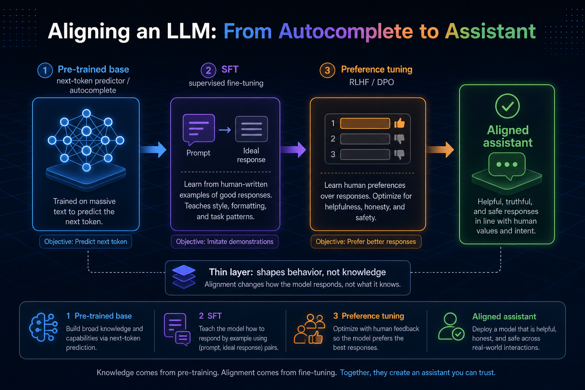
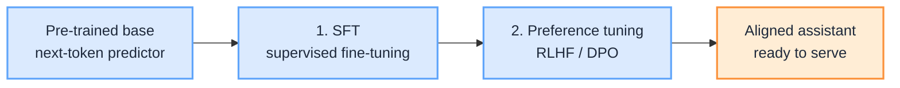

 

# Aligning an LLM: From Autocomplete to Assistant

Pre-training grows a model that predicts the next token extremely well. That is not the same as a helpful assistant. A raw base model will continue any prompt, mimic toxic text, or ignore an instruction when a more statistically likely continuation wins.

Alignment is the stage that reshapes that behavior. It still updates weights with the same four-step loop (forward, loss, backprop, optimizer), but with different data, a different objective, and far fewer steps. The result is the chat-style model you actually ship.

This is a deep dive into Stage 3 of [How LLM Works Under the Hood](/insights/how-llm-works-under-the-hood). It follows [During Training an LLM](/insights/during-training-an-llm), which covers how pre-training fills the weight tensors, and precedes [After Training an LLM](/insights/after-training-an-llm), which covers frozen inference.

:::tip[THE CLAIM]
Alignment is still training, but it is a thin layer on top of pre-training. It shapes behavior (instruction-following, helpfulness, refusals). It does not pour in the knowledge. Almost everything the model knows came from the base pre-training run.
:::

<!-- truncate -->

## Why pre-training is not enough

By the end of pre-training, each component has settled into its role: embeddings encode meaning, attention routes context, FFNs transform, LayerNorm stabilises. The model is a strong next-token predictor over internet-scale text.

What it has *not* learned:

| Capability | Pre-trained base | Aligned assistant |
| --- | --- | --- |
| Continue text fluently | Yes | Yes |
| Follow an instruction as a task | Unreliable | Expected |
| Prefer helpful, clear answers | No explicit preference | Tuned |
| Refuse harmful requests | No | Tuned |
| Stay in assistant format | No | Tuned |

A base model optimises one thing: *p(next token \| context)*. An assistant needs a second job on top of that: given a user prompt, produce a good *response*, not just a plausible continuation of the prompt string.

## Same loop, different job

Alignment does not invent a new training algorithm. It reuses the loop from pre-training:

1. Forward pass
2. Compute loss
3. Backpropagation
4. Optimizer step

What changes:

| Dial | Pre-training | Alignment |
| --- | --- | --- |
| **Data** | Trillions of tokens of raw (or lightly filtered) text | Thousands to millions of curated examples or preference pairs |
| **Loss focus** | Every token in the sequence | Often response tokens only (SFT), or a preference / reward objective |
| **Steps and cost** | Weeks/months, enormous compute | Short, comparatively cheap |
| **What improves** | Knowledge, fluency, latent skills | Behavior, format, preference |

:::important[Same weights, new objective]
The architecture dials and vocabulary stay frozen from [Before Training an LLM](/insights/before-training-an-llm). Alignment only changes *values* inside those tensors, and only a little compared with pre-training.
:::

## Stage 1: supervised fine-tuning (SFT)

Train on curated `(prompt, ideal response)` pairs written or vetted by humans (or strong models). The loop matches pre-training with one important change: the loss is computed on the **response** tokens, so the model learns to produce good answers rather than merely continue the prompt.

What SFT teaches:

- When asked a question, answer it
- When asked for a list, produce a list
- Stay in assistant voice and format
- Rough instruction-following

Dataset size is typically thousands to a few million examples, versus trillions of tokens in pre-training. After SFT the model behaves like an assistant, but its sense of *which* answer is best among several plausible ones is still rough.

## Stage 2: preference tuning (RLHF / DPO)

Humans (or a model) rank competing responses to the same prompt. That preference signal pushes the model toward the preferred kind of answer.

 

Two common recipes:

- **RLHF:** train a separate reward model to score responses, then use reinforcement learning (often PPO) so the LLM maximises that score while staying close to the SFT policy.
- **DPO** (and variants): skip the separate reward model and optimise directly on preference pairs with a classification-style loss. Simpler, and now very common.

This stage shapes helpfulness, tone, and harmlessness. It is why a model refuses dangerous requests and prefers clear, well-structured answers.

Variants such as RLAIF (AI feedback instead of human labels) or constitutional-style rule sets are the same idea: a preference or principle signal, not a second internet-scale pre-train.

## Alignment is a thin layer

|  | Main training (pre-train) | Polish (alignment) |
| --- | --- | --- |
| Data | Trillions of words | Thousands to millions of examples |
| Length / cost | Weeks/months, huge cost | Short, cheap |
| What it does | Teaches knowledge | Shapes behavior |

Alignment still changes weights, but typically with a tiny dataset, a small learning rate, and few steps (often with parameter-efficient methods like LoRA that update only a slice of the weights). It mostly elicits and shapes behavior the base model already latently has. It does not replace pre-training as the source of capability.

:::tip[TAKEAWAY]
If the base model never saw the underlying skill in pre-training, alignment rarely invents it. Alignment is how you *steer* what is already there.
:::

## What this means for architects

| Question | Mostly answered by |
| --- | --- |
| Does the model know enough about my domain? | Pre-training (and later domain fine-tunes / RAG), not alignment alone |
| Will it follow instructions and stay in format? | SFT |
| Will it prefer safe, helpful answers? | Preference tuning |
| Why is the chat model different from the base download? | Alignment stages on top of the same architecture |
| Where did most of the $ go? | Pre-training |

Product choice often looks like "base vs instruct/chat." That label is largely this stage: same frozen shape from Before, knowledge from During, behavior from Align.

## Handoff: freeze and ship

After alignment the weights are shipped and locked. No optimiser, no loss, no backward pass at serve time. Everything from here is read-only inference: prefill, decode, sampling, KV cache.

Deep dive: [After Training an LLM: From Frozen Weights to Token-by-Token Inference](/insights/after-training-an-llm).

## Final takeaway

Pre-training grows knowledge into the tensors. Alignment is a short second training phase that turns a next-token predictor into an assistant: SFT for format and instruction-following, preference tuning (RLHF/DPO) for which answers are better. For architects, keep the split clear: quality of knowledge and most of the cost live in pre-training; product behavior, refusals, and "chat vs base" live in alignment.

:::info[Builds on]
[Before Training an LLM: From Design Dials to a Frozen Shape](/insights/before-training-an-llm) · [During Training an LLM: From Random Weights to a Working Model](/insights/during-training-an-llm) · [After Training an LLM: From Frozen Weights to Token-by-Token Inference](/insights/after-training-an-llm) · [How LLM Works Under the Hood](/insights/how-llm-works-under-the-hood)
:::
