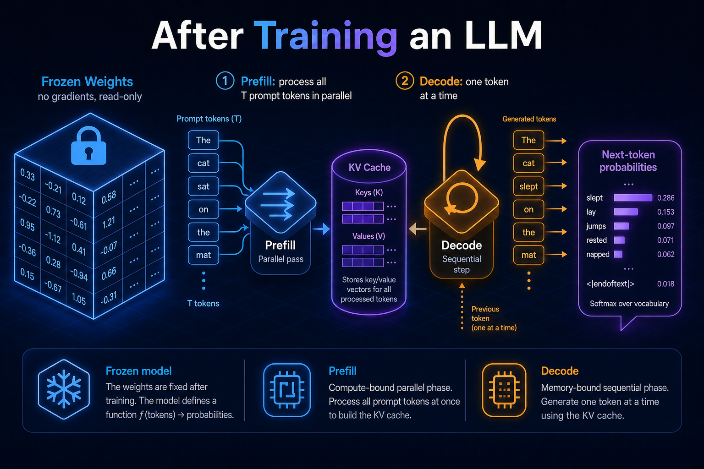
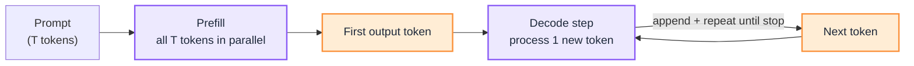
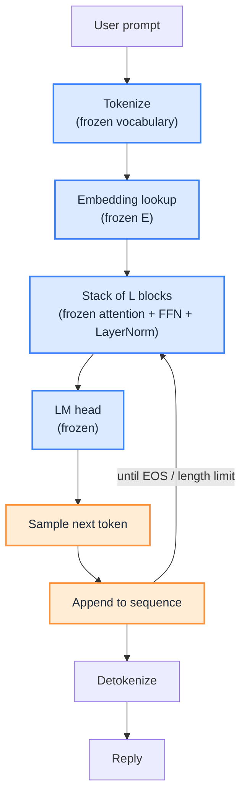

import Details from '@theme/Details';

 

# After Training an LLM: From Frozen Weights to Token-by-Token Inference

Before training sets the shape of every weight tensor and the vocabulary. During training, backpropagation fills those tensors with values. After training stops, the focus shifts to what happens on every inference call: the model is shipped, the weights are locked, and generation is a read-only walk through a fixed function.

This page covers that last stage of the lifecycle:

1. **The model is frozen:** no optimiser, no loss, no backward pass.
2. **What each component now means:** embeddings, attention, FFNs, LayerNorm, and depth as baked-in roles.
3. **How inference actually runs:** prefill vs decode, sampling, the KV cache, and the serving tricks that make it faster and cheaper.

This is a deep dive into Stage 4 of [How LLM Works Under the Hood](/insights/how-llm-works-under-the-hood), and the sequel to [Before Training an LLM: From Design Dials to a Frozen Shape](/insights/before-training-an-llm). [During Training an LLM](/insights/during-training-an-llm) covers how those weight values were grown; [Aligning an LLM](/insights/aligning-an-llm) covers the SFT and preference stage before the freeze.

:::tip[THE CLAIM]
Once pre-training (and any post-training stage) ends, no parameter ever changes again for that model. Inference is not learning. It is traversing a fixed function `f(input_tokens) → next_token_probabilities`. Same weights plus same input produce the same logits every time; only sampling injects variability.
:::

<!-- truncate -->

## The model is now frozen

After alignment the weights are shipped and locked. Concretely:

- All weights are frozen.
- No gradients, no learning.
- Every parameter now encodes learned structure.

:::important[Read-only from here on]
Once pre-training (and any post-training stage) ends, **no parameter ever changes again** for that model. There is no optimiser, no loss, no backward pass at inference time. The model is a fixed function `f(input_tokens) → next_token_probabilities`. The same weights produce the same logits for the same input, every time.
:::

The mental shift is simple:

| Mode | What it does |
| --- | --- |
| **Training** | Update the weights so the function gets better |
| **Inference** | Run the function. Read-only |

## Functional meaning after training

Training did not redesign the architecture. It assigned jobs to the tensors that already existed. After training those jobs are baked in:

| Component | What it represents |
| --- | --- |
| **Embeddings** | Static semantic meaning of tokens. The embedding table is a finished dictionary: every token id maps to a fixed point in a D-dimensional space. |
| **Attention layers** | Learned contextual relationships. They have finished learning which kinds of context matter, and route information with fixed Q/K/V/O projections. |
| **FFNs** | Learned reasoning and abstraction. They turn context into conclusions using fixed weights. |
| **LayerNorm** | Learned scale (`γ`) and bias (`β`) that keep activations in a stable, well-conditioned range. |
| **Depth (layers)** | Progressive refinement of thought from the first layer to the last (`L`). |

Nothing in that table is still learning. Each row is a finished piece of a fixed machine.

## Inference = using learned geometry, not learning new geometry

Inference is the act of *traversing* the geometry built during training, not extending or changing it.

The process is the same six steps on every call:

1. Look up each token in the **(frozen) embedding table**.
2. Mix vectors using **(frozen) attention weights**.
3. Transform vectors using **(frozen) FFN weights**.
4. Stabilize them using **(frozen) LayerNorm `γ`/`β`**.
5. Repeat these steps for every layer in the stack.
6. Read out the next-token probabilities from the **(frozen) LM head**.

:::important[Nothing is learned during inference]
Every step is a matrix multiplication against tensors whose values were locked in at the end of training. The model "thinks" by moving an input vector through a fixed, high-dimensional landscape. It does not reshape that landscape.
:::

Generation then splits into two distinct phases: **prefill** (digest the prompt) and **decode** (write the answer, one token at a time).

## Inference runs in two phases: prefill and decode

A generation request is not one uniform process. It is an initial parallel prompt pass, then a sequential token-generation loop.

 

| Phase | Input | How it runs | Bottleneck |
| --- | --- | --- | --- |
| **Prefill** | The whole prompt (`T` tokens) | All positions in **one parallel pass** (like training's forward pass) | **Compute-bound**: a lot of matmul at once |
| **Decode** | One token at a time | Strictly **sequential**: each token needs the previous one | **Memory-bound**: dominated by reading weights + KV cache from memory |

:::important[Why latency follows output length]
Prefill is cheap per token because it pushes the whole prompt through at once. Decode is the slow part: every new token requires a full pass through all `L` layers, and you cannot start token `n+1` until token `n` exists. Scaling is determined much more by output length than prompt length. Most serving optimizations target the decode loop.
:::

### What each phase actually does

**Prefill**

1. Produces the **first output token**.
2. Computes and stores **Key/Value (KV) vectors** for every prompt token in the **KV cache** so they are never re-processed.

**Decode**

1. Takes the single token from the previous step as input.
2. Runs that one token through all `L` layers.
3. Computes K/V for that token, **appends it to the KV cache**, and attends over the entire cache (all prior tokens).
4. Reads next-token probabilities, samples one token, and appends to the sequence.
5. Repeats until a stop token (`<EOS>`) or length limit is reached.

In short:

- `PREFILL (once):` whole prompt → all `L` layers in parallel → 1st token + fill KV cache
- `DECODE (loop):` last token → all `L` layers → append K/V → sample next token → repeat

### Sequential or parallel during inference?

Training scores all `T` positions of each sequence in parallel because the answers are already known. Inference is a mix:

- **Prefill is parallel.** The prompt's tokens are all known beforehand, so the model processes them in one pass, similar to a training forward pass.
- **Decode is strictly sequential.** The answer is generated one token at a time (autoregressive). Token `n` becomes the input for token `n+1`. You cannot parallelize that chain inside a single request.
- **Across requests, hardware can still batch.** GPUs pack many users together with continuous batching even though each decode stream is serial.

Analogy: prefill is reading the question all at once; decode is writing the answer one word at a time.

:::important[Training vs inference parallelism]
**Training:** sequential across batches, but scores all `T` positions of each sequence in parallel. **Inference:** parallel during prefill, strictly sequential during decode. The serial decode loop is why output length dominates latency.
:::

### Worked example: "The capital of France is"

**Phase 1 (prefill).** Tokens `[The] [capital] [of] [France] [is]` enter together in one parallel pass. The model predicts `Paris` as the first output token and fills the KV cache for the prompt.

**Phase 2 (decode).** Every further token feeds the model's own output back in:

| Step | Input (conceptually) | Output |
| --- | --- | --- |
| 1 | `The capital of France is` | `Paris` |
| 2 | `… is Paris` | `,` |
| 3 | `… Paris,` | ` a` |
| 4 | `… Paris, a` | ` city` |
| 5 | `… a city` | ` of` |
| n | … | `<EOS>` (stop) |

This is **autoregressive**: the model conditions on its own prior outputs. The dependency chain is why decode cannot be parallelized the way prefill can.

:::note[Known inputs vs self-generated inputs]
Prefill can run in parallel because every input is a known prompt token. Decode is serial because every input is the model's previous output, which does not exist yet. That difference is the irreducible serial chain of inference.
:::

## Choosing the next token: sampling

The model's raw output is a probability distribution over the entire vocabulary. **Sampling** collapses that distribution into a single token. This is the only place randomness enters inference.

| Strategy | How it picks | Effect |
| --- | --- | --- |
| **Greedy** | Always take the highest-probability token (`argmax`) | Deterministic, but repetitive and often dull |
| **Temperature (`T`)** | Sharpen (`T < 1`) or flatten (`T > 1`) the distribution before sampling | Low `T` = focused/safe; high `T` = creative/risky |
| **Top-k** | Sample only from the `k` most likely tokens | Cuts off the long tail of unlikely tokens |
| **Top-p** (nucleus) | Sample from the smallest set whose probabilities sum to `p` | Adaptive cutoff: narrow when the model is confident, wide when it is not |

:::important[Same settings, same output]
Same weights + same input + same sampling settings (and seed) → **same output**. The model itself is deterministic. All variability between two runs of the "same" prompt comes from sampling, never from the model learning or changing.
:::

## The KV cache: why decode stays fast

Naively, generating token `n` would re-run the entire prompt and all previously generated tokens through every layer. That is a massive amount of redundant work.

In each attention layer, every token produces a **key** and a **value** vector. Those vectors depend only on previously seen tokens and fixed weights, so they never change once computed. The **KV cache** stores them.

- **Prefill:** compute and cache K/V for every token in the prompt.
- **Each decode step:** compute K/V for *only the one new token*, append it to the cache, and attend over the whole accumulated cache.

| Approach | Work per new token |
| --- | --- |
| **Without cache** | Recompute K/V for all `n` tokens (`O(n)` work per step) |
| **With cache** | Compute K/V for 1 token, reuse the rest (`O(1)` new work per step) |

The trade-off is memory. Cache size grows with `sequence length × layers × heads`. For long contexts, KV memory can exceed the memory used by the model weights themselves.

:::info[Training memory vs inference memory]
**Training** needs huge memory to hold activations for the backward pass. Inference has no backward pass, so its main growing cost is the **KV cache**, not gradients or activations.
:::

## Putting it together

End to end, one reply looks like this:

 

Every component that touches a weight tensor is frozen. The only thing that grows is the *input sequence*, not the model. Different sampling strategies produce different outputs from the *same* model; the weights do not change.

## Making inference faster and cheaper

Because the model is read-only, serving optimizations focus on traversing the fixed landscape faster, or packing more users onto the same hardware, without changing what the model knows.

| Technique | What it does |
| --- | --- |
| **KV cache** | Reuse past keys/values so each new token is `O(1)` extra work |
| **Paged attention** | Manage the KV cache in pages to avoid fragmentation and fit more concurrent requests (vLLM) |
| **Continuous batching** | Pack many users' requests through the GPU together to maximise throughput |
| **Speculative decoding** | A small "draft" model proposes several tokens; the big model verifies them in one pass |
| **Quantisation** | Store weights (and/or the KV cache) in 8- or 4-bit to cut memory and bandwidth |

:::important[Execution, not knowledge]
None of these touch the weights' learned values. They change *how* the fixed function is executed, not *what* it computes.
:::

## Final takeaway

Training **builds** a geometry inside the model's weight tensors. Inference **navigates** that geometry to produce one token at a time. The model is a read-only function from this point on.

Every clever trick at inference time (KV cache, paged attention, speculative decoding, quantisation, batching) is about traversing this fixed landscape *faster* and *cheaper*, never about changing it. For architects, that split is the practical one: training quality and cost live in the weight values; serving latency, throughput, and unit economics live in how you execute the frozen function.

:::info[Builds on]
[Before Training an LLM: From Design Dials to a Frozen Shape](/insights/before-training-an-llm) · [During Training an LLM: From Random Weights to a Working Model](/insights/during-training-an-llm) · [Aligning an LLM: From Autocomplete to Assistant](/insights/aligning-an-llm) · [How LLM Works Under the Hood](/insights/how-llm-works-under-the-hood)
:::
