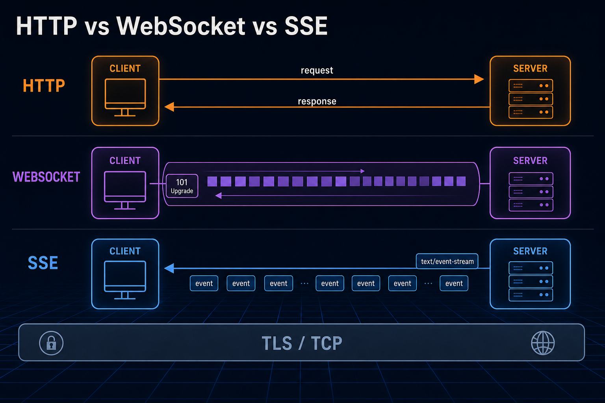
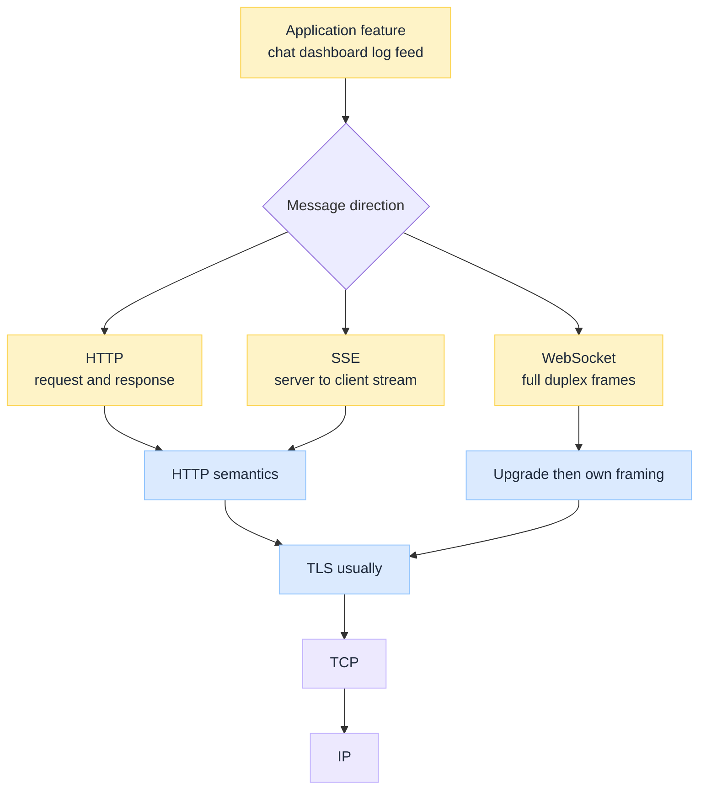
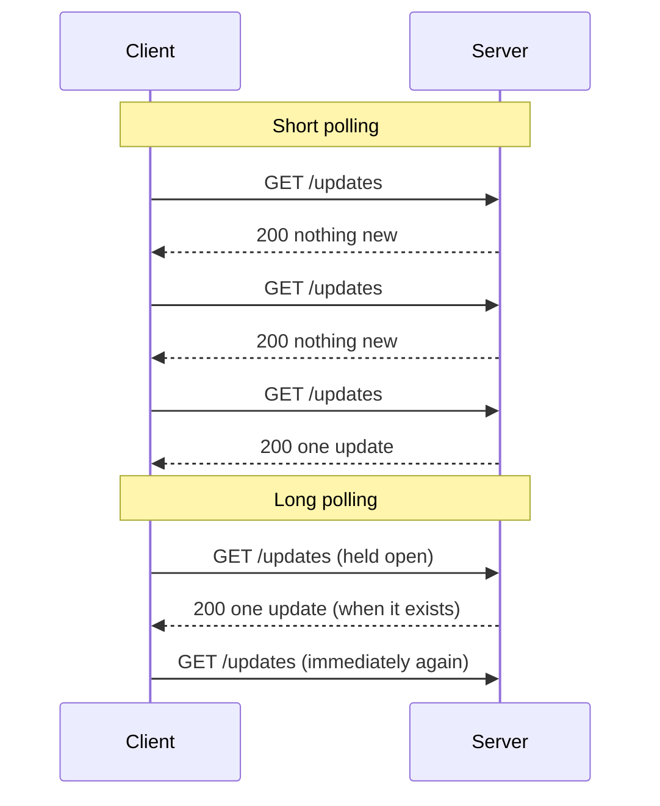
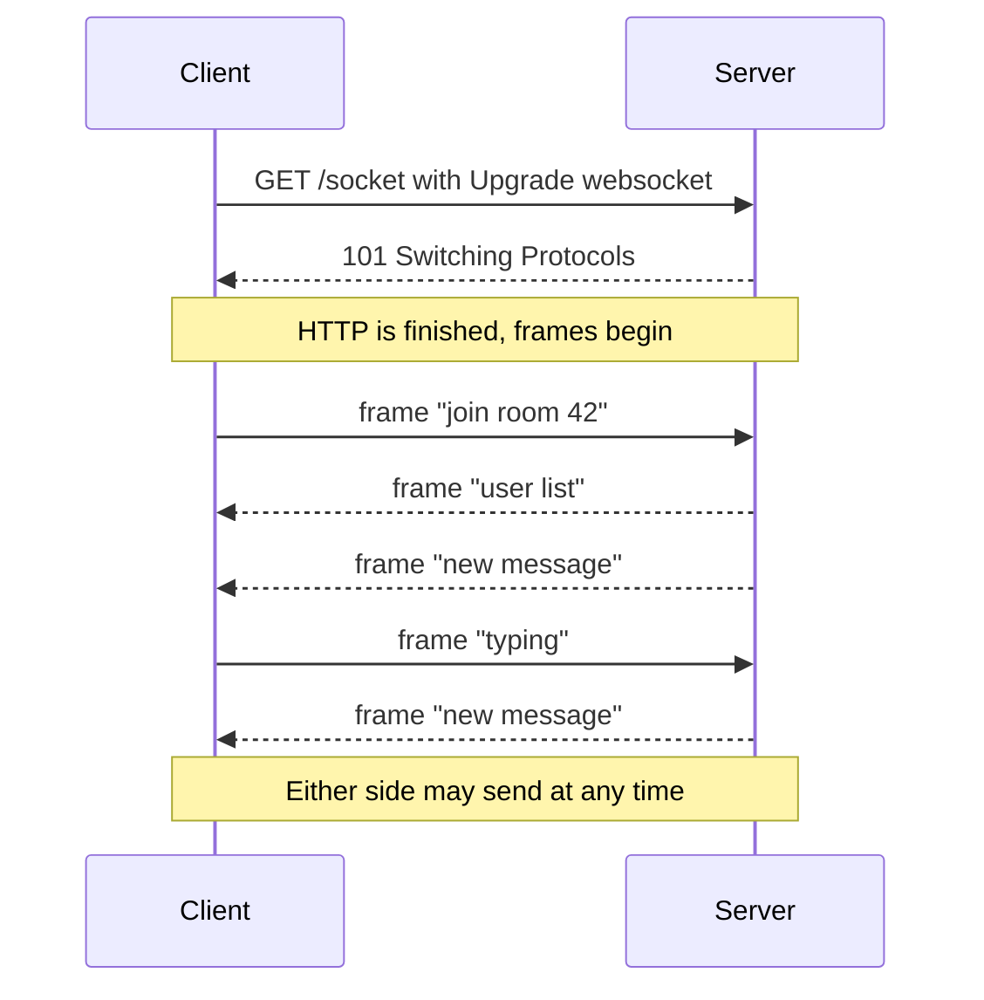
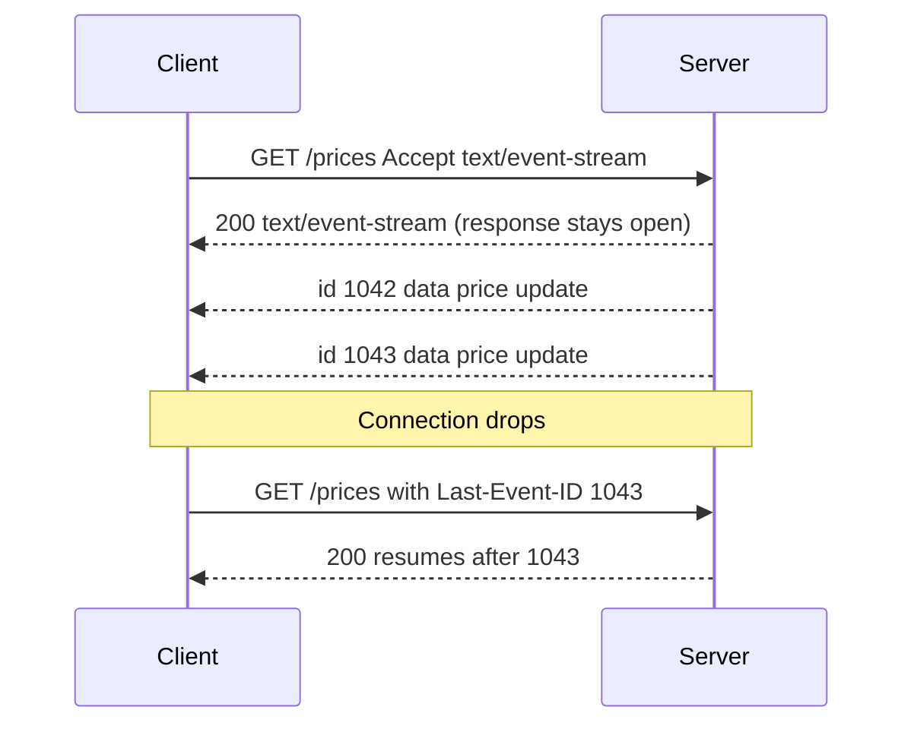
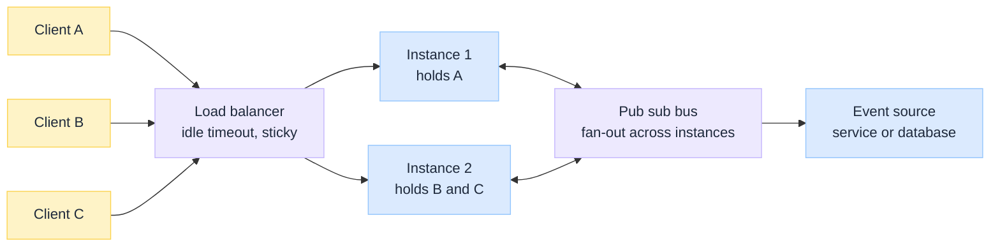

import Details from '@theme/Details';
import Tabs from '@theme/Tabs';
import TabItem from '@theme/TabItem';

<br/>


# HTTP vs WebSocket vs SSE Under the Hood

*Plain HTTP has one rule that shapes everything else: the client speaks first, and the server may only answer. Every "real time" feature you have ever built is a way of living with that rule or escaping it.*

A dashboard that updates itself, a chat thread, a build log that scrolls as it runs, a seat map that greys out while you watch. All three of these transports can deliver those features, and teams usually pick the one they used last time. The decision that actually matters is smaller and more precise: **who is allowed to send a message without being asked?**

:::tip[THE CLAIM]
**HTTP, WebSocket, and SSE are not three speeds of the same thing. They are three directions of conversation over the same TCP and TLS foundation.** HTTP is client-initiated round trips. WebSocket is a two way channel after an upgrade handshake. SSE is a one way server stream inside an ordinary HTTP response. Choose by direction and reconnect behaviour, then let performance follow.
:::

<!-- truncate -->

## The bottom line first

- **Same foundation:** all three run over TCP, normally with TLS, on ports 443 or 80. None of them is "the UDP option".
- **HTTP request and response:** the client asks, the server answers, the exchange ends. Servers cannot push. Polling fakes it and pays a full round trip per check.
- **WebSocket:** starts as an HTTP request carrying `Upgrade: websocket`, gets `101 Switching Protocols`, then abandons request and response framing for a **full duplex** frame stream. You own reconnects.
- **SSE:** an ordinary `GET` whose response never ends, sent as `text/event-stream`. **Server to client only**, text only, and the browser **reconnects for you** with `Last-Event-ID`.
- **The deciding question:** does the client need to send messages continuously, or only receive them? Continuous both ways means WebSocket. Receive only means SSE.
- **The hidden cost is operational.** All persistent connections turn stateless web tiers into stateful ones: idle timeouts, connection budgets, drain during deploys, fan-out across instances.

## What all three share

Before the differences, the common floor. WebSocket and SSE are not alternatives *to* the network stack under HTTP. They sit on the same layers described in [HTTP vs HTTPS Under the Hood](/insights/http-vs-https-under-the-hood) and [TCP vs UDP Under the Hood](/insights/tcp-vs-udp-under-the-hood).


<br/>

| Shared trait | Consequence |
| --- | --- |
| **DNS then TCP then TLS** | Same resolution and handshake cost before any of them carries a byte |
| **Ports 443 and 80** | All three traverse networks that only allow web ports |
| **Origin and CORS rules** | Browser security model applies to `EventSource` and to WebSocket handshakes |
| **Starts as an HTTP request** | Even WebSocket opens with an HTTP `GET`, so gateways and auth see it |

The split happens immediately after that first request. HTTP and SSE keep HTTP semantics for the whole exchange. WebSocket keeps them for exactly one round trip and then leaves.

---

## HTTP request and response

### What it is

The default model. A client sends a request, the server sends one response, and the exchange is complete. The connection may be reused for the next request thanks to keep-alive, but the **turn taking never changes**: nothing arrives at the client that the client did not ask for.

This is not a weakness. It is why HTTP caches, retries, load balances, and debugs so well. Every message is a self-contained unit with a method, a status, and headers.

### Faking push: polling and long polling

When the data changes on the server and the client needs to know, teams reach for two workarounds.

**Short polling** asks on a timer. Simple, and wasteful in a specific way: you pay a full request and response for every check, and most checks return nothing new.

**Long polling** asks and the server holds the request open until it has something to say (or a timeout fires). The client immediately asks again. It delivers near real time updates over ordinary HTTP, at the cost of a reconnect after every single message and a held request per client on the server.


<br/>

### The cost model

| Approach | What you pay per update |
| --- | --- |
| **Short polling** | One full round trip per poll, whether or not data changed, plus headers and auth every time |
| **Long polling** | One held request per connected client, plus a new request after every delivered message |
| **Latency floor** | Short polling latency averages half the poll interval, so a 30 second timer means 15 seconds of typical staleness |

Polling still has a legitimate home: low frequency updates, small client counts, environments where nothing but plain request and response survives the network path.

:::tip[TAKEAWAY]
**HTTP is the right default for anything that ends.** It becomes the wrong tool the moment the server knows something before the client thinks to ask, and you find yourself shortening a poll interval to compensate.
:::

---

## WebSocket

### What it is

WebSocket (RFC 6455) gives both sides a persistent, **full duplex** channel. After it is open, the client and server can each send messages at any time, independently, with no request and no response pairing.

It begins as HTTP. The client sends a normal `GET` with upgrade headers. If the server agrees, it answers `101 Switching Protocols`, and from that byte onward the connection is no longer speaking HTTP. It carries WebSocket frames.

<Details summary="WebSocket upgrade handshake, request and response">

The client request is ordinary HTTP/1.1 with upgrade headers:

```http
GET /socket HTTP/1.1
Host: example.com
Upgrade: websocket
Connection: Upgrade
Sec-WebSocket-Key: dGhlIHNhbXBsZSBub25jZQ==
Sec-WebSocket-Version: 13
Origin: https://example.com
```

The server accepts by switching protocols:

```http
HTTP/1.1 101 Switching Protocols
Upgrade: websocket
Connection: Upgrade
Sec-WebSocket-Accept: s3pPLMBiTxaQ9kYGzzhZRbK+xOo=
```

`Sec-WebSocket-Accept` is derived from the client key, which proves the server understood the handshake rather than a cache replaying an old response.

</Details>


<br/>

### The frame layer

Once upgraded, the unit of transfer is a **frame**, not a request. Frames carry an opcode that says what they are: text, binary, close, ping, or pong. There are no status codes and no headers per message, so per-message overhead drops to a few bytes.

| Frame concept | What it means in practice |
| --- | --- |
| **Text and binary opcodes** | Send JSON or raw bytes natively, no base64 tax on binary payloads |
| **Ping and pong** | Built-in liveness check, so you can detect a dead peer that never sent a close |
| **Close frame** | An orderly shutdown with a code and reason, distinct from a socket that simply vanished |
| **Client masking** | Browser to server frames are masked, a defence against confusing intermediaries into treating payloads as requests |
| **Subprotocols** | `Sec-WebSocket-Protocol` names the message grammar you agreed to, such as a JSON-RPC or STOMP dialect |

### What you now own

The channel is yours, and so is everything HTTP used to provide.

- **Reconnection.** There is no automatic retry. When the socket drops, your code decides when and how to reopen, ideally with backoff and jitter so a server restart does not trigger a synchronised stampede.
- **Message replay.** HTTP had no state to lose. A WebSocket that reconnects must work out which messages it missed, so you need sequence numbers or a resume token.
- **Heartbeats.** Idle connections get culled by proxies and load balancers. Application level pings keep the path warm and detect half-open sockets.
- **Authentication over time.** A token that was valid at handshake will eventually expire. Long-lived connections need a re-authentication or revocation story.

`ws://` is cleartext, `wss://` is WebSocket over TLS. Use `wss://` in production for the same reasons you use HTTPS, and because cleartext upgrades are far more likely to be mangled by an intermediary.

:::tip[TAKEAWAY]
**WebSocket buys you a symmetric channel and charges you the connection lifecycle.** Take it when the client genuinely needs to speak continuously. If the client only listens, you are paying for a duplex channel and using half of it.
:::

---

## Server-Sent Events

### What it is

SSE is the quiet option. There is no upgrade and no new protocol. The client makes an ordinary `GET`, and the server replies with `Content-Type: text/event-stream` and simply **never finishes the response body**. It writes events into that open response as they occur.

Because it stays HTTP the whole way through, every piece of infrastructure that understands HTTP still understands it: gateways, auth middleware, access logs, compression, HTTP/2.

<Details summary="SSE response format and the browser client">

The server response holds the connection open and writes text events:

```http
HTTP/1.1 200 OK
Content-Type: text/event-stream
Cache-Control: no-cache
Connection: keep-alive

id: 1042
event: price
data: {"symbol":"ACME","price":41.20}

id: 1043
event: price
data: {"symbol":"ACME","price":41.35}

: keepalive comment to stop idle timeouts
```

Each event ends with a blank line. A line starting with `:` is a comment, commonly used as a heartbeat.

The browser side is a few lines, and reconnection is built in:

```javascript
const stream = new EventSource('/prices');

stream.addEventListener('price', (e) => {
  render(JSON.parse(e.data));
});

stream.onerror = () => {
  // The browser is already retrying. Surface state, do not reconnect manually.
};
```

</Details>


<br/>

### Reconnection is the feature

This is the part teams underrate. The browser's `EventSource` reconnects automatically when the stream breaks, and it sends the last event id it saw in a `Last-Event-ID` request header. If your server honours that header, a client that lost connectivity in a tunnel resumes exactly where it stopped, with no client code at all.

The server can tune the retry delay by writing a `retry:` field into the stream. Everything a WebSocket makes you build by hand, SSE gives you as a default.

### The real limits

| Limit | Detail |
| --- | --- |
| **One direction only** | The client cannot send on the stream. Client actions go over normal HTTP requests alongside it |
| **UTF-8 text only** | No binary frames. Binary must be encoded, which inflates payloads |
| **Connection limit on HTTP/1.1** | Browsers cap roughly 6 connections per origin, and each open stream consumes one. Several tabs can starve the origin |
| **`EventSource` cannot set headers** | No custom `Authorization` header. Use cookies, a query parameter, or a fetch-based stream reader instead |

That connection cap is the most common production surprise, and the fix is protocol level rather than application level. Over HTTP/2 each stream is multiplexed onto one connection, so the practical ceiling moves from about 6 to the server's concurrent stream limit. If you deploy SSE, deploy it behind HTTP/2. See [HTTP/1.1 vs HTTP/2 vs HTTP/3 Under the Hood](/insights/http-1-vs-http-2-vs-http-3-under-the-hood).

:::tip[TAKEAWAY]
**SSE is the cheapest correct answer for one way feeds.** It stays inside HTTP, it reconnects and resumes for free, and its main constraint disappears once you are on HTTP/2.
:::

---

## Side-by-side matrix

| | **HTTP** | **WebSocket** | **SSE** |
| --- | --- | --- | --- |
| **Direction** | Client asks, server answers | Full duplex, both sides initiate | Server to client only |
| **Protocol after setup** | HTTP | WebSocket frames (RFC 6455) | HTTP, response never closes |
| **Wire scheme** | `http` / `https` | `ws` / `wss` | `http` / `https` |
| **Payload types** | Any | Text and binary | UTF-8 text only |
| **Per-message overhead** | Full headers each time | A few bytes per frame | Small text preamble per event |
| **Reconnect** | Not applicable | You build it | Automatic, with `Last-Event-ID` |
| **Browser API** | `fetch` | `WebSocket` | `EventSource` |
| **Proxy and gateway friendliness** | Universal | Needs upgrade support end to end | Universal, needs buffering disabled |
| **Caching and CDN** | Native | None | Not cacheable, must bypass edge caches |
| **Connection cost at scale** | Per request | One open socket per client | One open response per client |
| **Best fit** | Actions and queries that end | Chat, collaboration, live control | Dashboards, notifications, log and progress feeds |

---

## Connection walkthrough

Same feature, a live order status page, three ways. Click through the tabs.

<Tabs groupId="realtime-transport">
  <TabItem value="poll" label="HTTP polling" default>

1. Page loads and starts a timer.
2. Every N seconds, issue `GET /orders/123/status` with full headers and auth.
3. Server answers with the current status, usually unchanged.
4. Update the DOM only when something differs.

Cost: one round trip per tick per client, and staleness averaging half the interval. Simplicity: nothing special anywhere in the path.

  </TabItem>
  <TabItem value="ws" label="WebSocket">

1. Page opens `wss://example.com/orders` and completes the upgrade handshake.
2. Client sends a frame subscribing to order 123.
3. Server pushes status frames as they change; client can send cancel or amend frames on the same socket.
4. On disconnect, client code reconnects with backoff and re-subscribes, then reconciles missed changes.

Cost: an open socket and a lifecycle you maintain. Payoff: the client can act, not just watch.

  </TabItem>
  <TabItem value="sse" label="SSE">

1. Page opens `new EventSource('/orders/123/events')`.
2. Server holds the response open as `text/event-stream` and writes an event per status change, each with an `id`.
3. Client renders on each event. Actions like cancel go over a normal `POST`, separate from the stream.
4. On disconnect, the browser reconnects on its own and sends `Last-Event-ID`, and the server replays from there.

Cost: one held response per client. Payoff: no client reconnect logic, and ordinary HTTP the whole way.

  </TabItem>
</Tabs>

---

## Choosing by use case

The honest heuristic: **start at SSE for feeds and move to WebSocket only when the client must talk back continuously.** Most "we need WebSockets" requirements are one way feeds wearing a duplex costume.

| Feature | Fit | Why |
| --- | --- | --- |
| Chat and messaging | **WebSocket** | Clients send constantly, and typing indicators need low latency both ways |
| Collaborative editing and cursors | **WebSocket** | High frequency, symmetric, order sensitive |
| Multiplayer and live control panels | **WebSocket** | Client input is the point |
| Trading, telemetry, and metrics dashboards | **SSE** | Pure downstream fan-out with a natural event id per tick |
| Notifications and activity feeds | **SSE** | Infrequent server pushes, and free reconnect matters more than latency |
| Build logs and long job progress | **SSE** | Append-only text, and resume after a dropped connection is exactly `Last-Event-ID` |
| Form submissions, search, CRUD | **HTTP** | Bounded exchanges that cache, retry, and log cleanly |
| Low frequency status checks, few clients | **HTTP polling** | Persistent connections are not worth the operational weight |

A live page usually needs more than one of these at once. Streaming the feed over SSE while sending user actions over ordinary `POST` requests is a normal, healthy design, not a compromise. For the service to service side of the same system, the streaming comparison continues in [REST vs gRPC Under the Hood](/insights/rest-vs-grpc-under-the-hood).

---

## Operating them at scale

This is where the choice stops being about protocols. A stateless HTTP tier can be scaled, redeployed, and load balanced without much thought. Persistent connections remove that freedom.


<br/>

| Concern | What to get right |
| --- | --- |
| **Idle timeouts** | Load balancers and proxies close quiet connections, often after 60 seconds. Send heartbeats: WebSocket ping frames, or SSE comment lines |
| **Response buffering** | A reverse proxy that buffers responses will hold your SSE events until the buffer fills. Disable buffering on stream routes or nothing arrives |
| **Upgrade support** | Every hop must forward `Upgrade` and `Connection` headers, including the CDN. See [Load Balancer Under the Hood](/insights/load-balancer-under-the-hood) and [CDN Under the Hood](/insights/cdn-under-the-hood) |
| **Fan-out across instances** | The client holding a connection is rarely the instance where the event originates. Route events through a pub sub bus, not in-process memory |
| **Connection budget** | Capacity is now measured in concurrent connections and memory per connection, not requests per second |
| **Deploys and draining** | A rolling deploy disconnects every client at once. Stagger restarts, and make reconnect backoff jittered so they do not all return in the same second |
| **Backpressure** | A slow client must not grow an unbounded server-side queue. Decide early whether to drop, coalesce, or disconnect |

### What to measure

Request rate and p99 latency describe HTTP well and describe streams badly. Persistent transports need their own signals: **concurrent connections per instance**, **connection age distribution**, **reconnect rate**, **messages sent per connection**, and **queue depth per slow consumer**. A rising reconnect rate is usually the first visible symptom of an idle timeout or a buffering proxy, long before users complain that the page went quiet.

---

## Common mistakes

| Mistake | Why it hurts |
| --- | --- |
| **WebSocket for a one way feed** | You inherit reconnection, replay, and heartbeat work that SSE would have done for you |
| **SSE over HTTP/1.1 at scale** | The 6 connection per origin cap starves other requests once a user opens a few tabs |
| **No heartbeat on either transport** | Proxies silently close idle connections and clients sit on dead sockets believing they are live |
| **Reconnecting without backoff and jitter** | Every client returns at the same instant after a restart and re-kills the tier |
| **Assuming the whole path supports upgrades** | One CDN or proxy hop that drops `Upgrade` headers turns into an unexplained handshake failure in production only |
| **Holding subscription state in instance memory** | Works on one node, silently delivers nothing once you scale to two |
| **Polling faster to feel real time** | Cost grows linearly with clients while latency only halves, and the server never gets to push |
| **Treating a dropped connection as an error state** | For SSE the browser is already retrying, and a manual reconnect on top of it doubles your connections |

## Final takeaway

HTTP, WebSocket, and SSE all sit on the same TCP and TLS floor and differ on one axis that decides everything downstream: **who may send a message without being asked.**

HTTP says only the client may initiate, which is why it caches, retries, and scales so easily, and why polling is the only way to fake push. WebSocket says both sides may initiate, which buys a symmetric low overhead channel and hands you the connection lifecycle to manage. SSE says only the server may initiate, and by staying inside an ordinary HTTP response it keeps your infrastructure and gives you reconnect and resume for free.

> **Pick by direction, not by novelty. Use HTTP for exchanges that end, SSE when the server does all the talking, and WebSocket when both sides genuinely need to speak at once.**

:::info[Builds on]
[HTTP vs HTTPS Under the Hood](/insights/http-vs-https-under-the-hood) · [HTTP/1.1 vs HTTP/2 vs HTTP/3 Under the Hood](/insights/http-1-vs-http-2-vs-http-3-under-the-hood) · [TCP vs UDP Under the Hood](/insights/tcp-vs-udp-under-the-hood) · [REST vs gRPC Under the Hood](/insights/rest-vs-grpc-under-the-hood) · [Load Balancer Under the Hood](/insights/load-balancer-under-the-hood)
:::

## Further reading

| Topic | Resource | Why read it |
| --- | --- | --- |
| **WebSocket** | [RFC 6455: The WebSocket Protocol](https://www.rfc-editor.org/rfc/rfc6455.html) | Handshake, framing, opcodes, and masking rules |
| **WebSocket over HTTP/2** | [RFC 8441: Bootstrapping WebSockets with HTTP/2](https://www.rfc-editor.org/rfc/rfc8441.html) | Extended CONNECT, for running sockets on a multiplexed connection |
| **SSE** | [HTML Standard: Server-sent events](https://html.spec.whatwg.org/multipage/server-sent-events.html) | Normative stream format, `Last-Event-ID`, and retry behaviour |
| **EventSource API** | [MDN: Using server-sent events](https://developer.mozilla.org/en-US/docs/Web/API/Server-sent_events/Using_server-sent_events) | Practical client guide with reconnection notes |
| **WebSocket API** | [MDN: The WebSocket API](https://developer.mozilla.org/en-US/docs/Web/API/WebSockets_API) | Browser client, events, and close codes |
| **HTTP semantics** | [RFC 9110: HTTP Semantics](https://www.rfc-editor.org/rfc/rfc9110.html) | The request and response model the other two react to |
| **HTTP/2** | [RFC 9113: HTTP/2](https://www.rfc-editor.org/rfc/rfc9113.html) | Multiplexing that removes the SSE connection cap |
