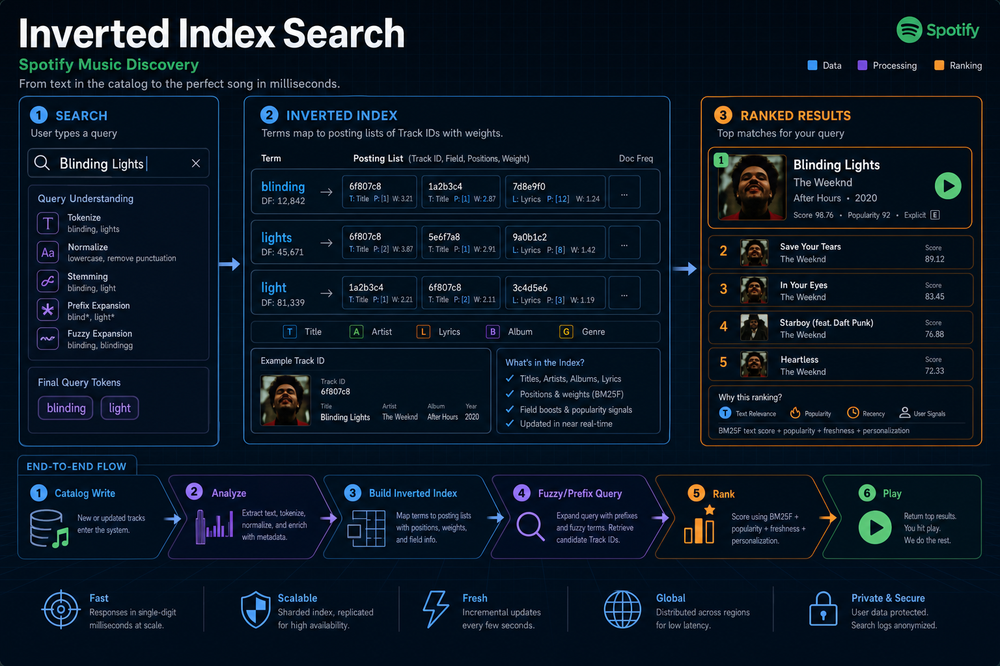
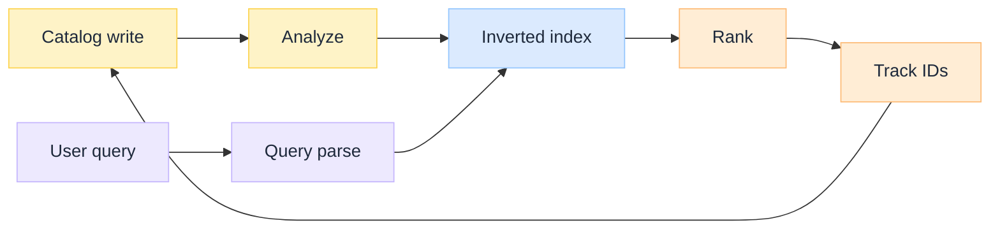
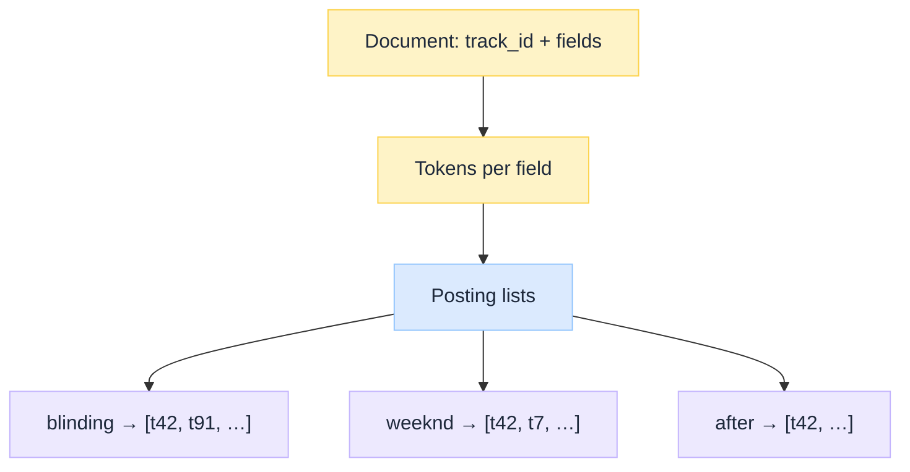
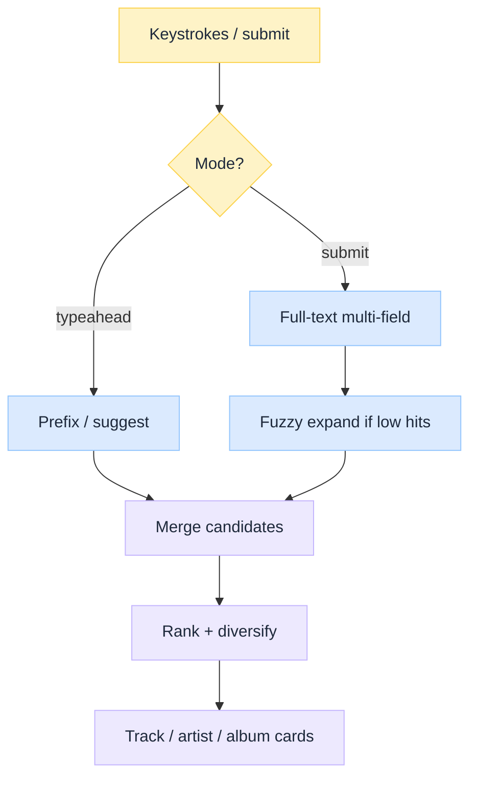
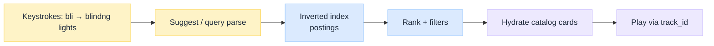
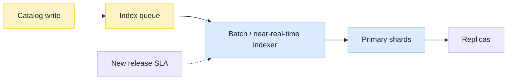

 

# Inverted Index Search Explained: Spotify Music Discovery

*When you type in Spotify's search box, you are not scanning a tracks table. You are probing an inverted index: terms from title, artist, album, and lyrics mapped to posting lists of track IDs, then ranked and hydrated from the catalog so Play still hits the right audio object.*

Most system-design interviews stop at "Elasticsearch on track metadata." That skips the hard parts Spotify-class search must get right: **catalog vs index as two planes**, **tokenization that makes autocomplete and fuzzy match cheap**, **multi-field ranking**, and a **freshness SLA** so new releases appear before the marketing window closes.

This is an **architecture breakdown** of inverted index search, using **Spotify music discovery** as the running example. Exact internal names evolve; the design lessons stay useful. Parent pipeline context: Spotify Music Streaming Pipeline (coming soon).

:::tip[THE CLAIM]
**Spotify-class discovery is inverted index search, not SQL LIKE.** Catalog is the source of truth for play and rights. The search index is a projection optimized for prefix, fuzzy, and ranked retrieval over title, artist, album, and lyrics. Mixing those jobs is how search latency and catalog load both explode.
:::

<!-- truncate -->

## Search path at a glance

 

| Component | What it does | Failure if skipped |
| --- | --- | --- |
| **Catalog** | Authoritative track / album / artist / rights identities | Search returns IDs nothing can play |
| **Analyzer** | Tokenize and normalize title, artist, album, lyrics | Typos and prefixes miss; ranking is noise |
| **Inverted index** | Map terms → posting lists of document IDs | Every query becomes a catalog scan |
| **Query parse** | Classify autocomplete vs fuzzy vs multi-field | Wrong operator for the UX mode |
| **Ranker** | Lexical score + popularity / locale / personalization | Relevant hits buried under obscure matches |
| **Hydration** | Resolve ranked IDs back to catalog cards | Empty tiles or stale artwork |

---

## Catalog vs search index

On a Spotify-shaped stack, upload and play trust the **catalog**; the search box trusts the **inverted index**.

| Plane | Owns | Optimized for |
| --- | --- | --- |
| **Catalog** | Identity, rights, relationships, playable object keys | Consistency, joins, compliance |
| **Search index** | Terms, postings, field norms, suggest structures | Latency, recall for messy human queries |

The catalog write is the event. The indexer is a consumer. Search never mutates rights or audio object keys; it only projects fields needed for discovery.

Store choices look like classic [SQL vs NoSQL](/insights/sql-vs-nosql-under-the-hood) tradeoffs on the catalog side. The search plane is usually a purpose-built inverted-index engine (Elasticsearch / OpenSearch / Lucene-class, or an in-house equivalent), not a general document DB with a text column.

**Analogy:** the catalog is the library's official accession record. The inverted index is the keyword drawers and "sounds like" cards you keep in sync. Patrons find books through the drawers; checkout still uses the accession number.

---

## Inverted index fundamentals

An **inverted index** flips the document: instead of "track 42 has tokens `[weeknd, blinding, lights]`," you store "token `blinding` appears in tracks `[…, 42, …]`."

 

### Fields that matter for music

| Field | Why index it | Query shape |
| --- | --- | --- |
| **Title** | Primary intent for many queries | Exact, prefix, fuzzy |
| **Artist** | High typo rate; aliases and featuring credits | Fuzzy, synonym / alias expand |
| **Album** | Disambiguates same title across releases | Multi-field boost |
| **Lyrics** | Phrase and deep recall ("that song that goes…") | Phrase, larger postings, costlier |

Index **aliases** (artist AKA, transliterations) as sibling terms or a dedicated alias field. Without aliases, lexical search silently fails on how fans actually type.

Postings often store more than document IDs: term frequency, positions (for phrases / lyrics), and field norms for scoring. Lyrics inflate index size; treat them as an optional expensive field with its own analyzer and query path.

---

## Tokenization and analyzers

Raw strings are not searchable until an **analyzer** turns them into tokens.

| Step | Music-search examples |
| --- | --- |
| **Normalize** | Lowercase, strip punctuation, Unicode fold (café → cafe) |
| **Tokenize** | Split on whitespace / punctuation; keep featuring markers as needed |
| **Filter** | Stop words (language-aware); optional stemming for lyrics, often light for proper names |
| **N-grams / edge n-grams** | Prefix autocomplete: `bli`, `blin`, `blind`… for "Blinding Lights" |
| **Phonetic (optional)** | Soundex / Metaphone-class for hard artist names |

**Artist names are not English prose.** Aggressive stemming that helps lyrics can destroy band names. Use **per-field analyzers**: gentle for artist/title, richer for lyrics.

Autocomplete usually needs a **suggest** structure (edge n-grams, completion suggester, or a dedicated trie) separate from the full-text path. One analyzer rarely serves both typeahead and full query well.

---

## Query types that matter

 

| Query type | Typical use | Design note |
| --- | --- | --- |
| **Prefix / autocomplete** | Every keystroke | Edge n-grams or completion index; hard latency budget |
| **Multi-field match** | Submitted search box | Weighted title > artist > album > lyrics |
| **Fuzzy** | Typos ("weeknd" vs "weekend" edge cases, "bieber" misspellings) | Edit-distance expand; cap expansions or cost explodes |
| **Phrase** | Lyrics fragments | Needs positions; heavier than bag-of-words |
| **Filter** | Locale, availability, content type | Apply as filters, not as scored text |

Fuzzy match is a **recall tool**, not the default for every query. Run exact/prefix first; widen with fuzziness when the candidate set is thin. Unbounded fuzzy on hot terms is a classic load amplifier.

---

## Ranking and personalization hooks

Lexical engines score with something in the **BM25 / TF-IDF family**: rare terms weigh more; repeated terms in a short title weigh more than the same count in a long lyric dump. Field boosts encode product taste (title matches beat buried lyric matches for the same token).

| Signal | Role |
| --- | --- |
| **Lexical score** | Textual relevance |
| **Popularity / stream velocity** | Breaks ties toward what people actually play |
| **Locale / market** | Same string, different chart reality |
| **Personalization** | Re-rank with taste profile (optional second stage) |
| **Business rules** | Take-downs, territorial blocks, editorial pins |

Keep **stage 1** (index retrieval) cheap and **stage 2** (personalization / business) small-N. Pulling personalization into every inverted-index shard query couples two different SLOs.

Retrieval that decides what enters a model context has a cousin problem in AI stacks; see [RAG Is Not a Database](/insights/rag-is-not-a-database) and [Retrieval Is a Governed Action](/insights/retrieval-is-a-governed-action) for the governed-retrieval framing. Music search is usually lexical-first; the governance lesson still applies: ranked IDs are a product decision, not a neutral dump.

---

## Spotify worked example: finding Blinding Lights

Treat the following as a **teaching reconstruction**, not an internal Spotify dump. The point is the contract: index returns IDs; catalog and CDN finish the job.

### 1. Catalog document (truth)

| Field | Example value |
| --- | --- |
| `track_id` | `t_blinding_lights` |
| Title | Blinding Lights |
| Artist | The Weeknd |
| Album | After Hours |
| Lyrics (snippet) | I said, ooh, I'm blinded by the lights |
| Playable object keys | bitrate ladder URLs / CDN keys |
| Rights / markets | territorial availability flags |

### 2. Analyze into tokens

| Field | Tokens (simplified) |
| --- | --- |
| Title | `blinding`, `lights` |
| Artist | `weeknd` (stopword `the` dropped; alias `the weeknd` may also index) |
| Album | `after`, `hours` |
| Lyrics | `said`, `ooh`, `blinded`, `lights`, … |
| Suggest (edge n-grams) | `b`, `bl`, `bli`, `blin`, `blind`, `blindi`, … |

### 3. Inverted index postings (toy slice)

| Term | Field | Posting list (track IDs) |
| --- | --- | --- |
| `blinding` | title | `[t_blinding_lights, t_other_blinding, …]` |
| `lights` | title | `[t_blinding_lights, t_city_lights, …]` |
| `weeknd` | artist | `[t_blinding_lights, t_starboy, …]` |
| `after` | album | `[t_blinding_lights, …]` |
| `blinded` | lyrics | `[t_blinding_lights, …]` |

A real engine also stores term frequency, positions (for lyric phrases), and field norms for BM25-style scoring.

### 4. Typeahead: user types `bli`

1. Client debounces and hits the **suggest** path (not full fuzzy).
2. Edge n-gram `bli` intersects suggest postings → candidate track/artist/album IDs.
3. Ranker boosts high stream-velocity titles; `t_blinding_lights` rises.
4. API hydrates cards from the **catalog** (artwork, display name), not from the index alone.

### 5. Submit: `blindng lights` (typo)

1. Analyzer yields `blindng`, `lights`.
2. Exact title match for `blindng` is empty or weak.
3. **Fuzzy expand** `blindng` → candidates including `blinding` (edit distance 1).
4. Intersect / score with `lights` across title (high boost) and lyrics (lower boost).
5. Stage-1 lexical top-N includes `t_blinding_lights`.
6. Stage-2 may re-rank with locale and taste; business filters drop unavailable markets.
7. User taps Play → **control plane** resolves `track_id` to CDN object + license (search is done).

 

| Step | Owns the data | Spotify-shaped outcome |
| --- | --- | --- |
| Index hit | Search plane | Ranked `track_id`s in tens of milliseconds |
| Card UI | Catalog | Correct title, artist, cover art |
| Audio | Object store + multi-CDN | Range-request chunks for the chosen bitrate |

If search wrote playable URLs into the index and the encode ladder changed, cached search results would point at dead objects. That is why **IDs cross the boundary**, not raw CDN paths.

---

## Indexing pipeline and freshness

 

| Concern | Design implication |
| --- | --- |
| **Freshness SLA** | Tentpole releases need near-real-time indexing, not nightly batch only |
| **Deletes / take-downs** | Tombstones must propagate as fast as legal requires |
| **Partial failure** | Catalog success + index lag is a visible product bug ("I uploaded but can't find it") |
| **Backfill** | Analyzer or mapping changes need reindex strategy without search downtime |

Treat **searchable** as a release gate next to **playable**. A track live on CDN but missing from the index is a failed launch for discovery-led traffic.

---

## Scale and operations

| Pressure | Common response |
| --- | --- |
| **Catalog size** | Shard by document ID or routing key; replicate for read |
| **Hot terms** | Cache popular queries; careful with fuzzy expand on stop-ish tokens |
| **Lyrics volume** | Separate index or field; optional query path; watch heap and merge cost |
| **Typeahead QPS** | Dedicated suggest tier; aggressive client debounce |
| **Multi-entity results** | Parallel queries for track / artist / album / playlist; merge in the API |

Operations need the usual search SLOs: p99 query latency, index lag, refresh interval, merge backlog, and "zero-result rate" as a product signal (often a ranking or analyzer bug, not empty catalog).

---

## Lexical vs dense retrieval

Inverted indexes excel at **keyword and typo-tolerant** discovery. They struggle when the user describes a vibe ("upbeat 90s workout") with no shared tokens.

| Path | Strength | Weakness |
| --- | --- | --- |
| **Lexical (inverted index)** | Precise names, prefixes, lyrics phrases | Semantic / vibe queries |
| **Dense (embeddings + ANN)** | Natural language, podcast topical search | Cold-start terms, exact title precision, ops cost |

Production systems often **hybrid**: lexical candidates plus dense candidates, then a fusion / re-ranker. Dense retrieval does not replace the catalog or the inverted index for "play Blinding Lights." It extends recall for queries that never share tokens with the metadata.

---

## Design lessons (what to steal)

| Lesson | Why it matters |
| --- | --- |
| **Separate catalog and index** | Consistency vs discovery latency |
| **Per-field analyzers** | Artists ≠ lyrics |
| **Prefix path ≠ full-text path** | Typeahead has a harder latency budget |
| **Fuzzy as fallback** | Protects recall without torching QPS |
| **Rank in stages** | Lexical retrieve, then personalize / policy |
| **Freshness is a product SLO** | New release must be findable |
| **Hydrate from catalog** | Index returns IDs; cards come from truth |

## Where teams go wrong copying this

| Mistake | Why it hurts |
| --- | --- |
| **`LIKE '%query%'` on the catalog** | Full scans; no ranking; locks under load |
| **One analyzer for all fields** | Stemmed artist names and broken autocomplete |
| **Fuzzy on every keystroke** | Latency and cluster CPU melt |
| **Index as source of truth for play** | Stale rights and wrong object keys |
| **Ignoring zero-result rate** | Silent product failure while ops metrics look "green" |
| **Replacing lexical with embeddings only** | Exact-title precision collapses |

:::tip[TAKEAWAY]
**Inverted index search at Spotify scale is a projection machine:** analyze title, artist, album, and lyrics into postings; serve prefix and fuzzy queries against that index; rank with lexical score plus product signals; hydrate IDs from the catalog; only then resolve Play. The design win is not "add Elasticsearch." It is **keeping truth, discovery, and playback on explicit contracts**, as the Blinding Lights walkthrough shows.
:::

:::info[Builds on]
[SQL vs NoSQL Under the Hood](/insights/sql-vs-nosql-under-the-hood) · [RAG Is Not a Database](/insights/rag-is-not-a-database) · [Retrieval Is a Governed Action](/insights/retrieval-is-a-governed-action)
:::

## Further reading

### Inverted index and search engines

| Resource | Why read it |
| --- | --- |
| [Elasticsearch / Lucene inverted index docs](https://www.elastic.co/guide/en/elasticsearch/reference/current/documents-indices.html) | Vocabulary: documents, inverted index, mappings, analyzers |
| [BM25](https://en.wikipedia.org/wiki/Okapi_BM25) | Default lexical scoring intuition behind modern engines |

### Related insights

| Resource | Why read it |
| --- | --- |
| [SQL vs NoSQL Under the Hood](/insights/sql-vs-nosql-under-the-hood) | Catalog store tradeoffs behind the index |
| [RAG Is Not a Database](/insights/rag-is-not-a-database) | Why retrieval stacks are not "just a DB" |
| [Retrieval Is a Governed Action](/insights/retrieval-is-a-governed-action) | Ranking and access as product decisions |

### Product context

| Resource | Why read it |
| --- | --- |
| Spotify Engineering Blog | Primary write-ups on search, podcast retrieval, and ranking experiments |
| Spotify Music Streaming Pipeline (coming soon) | Where this index sits in upload → search → play |
