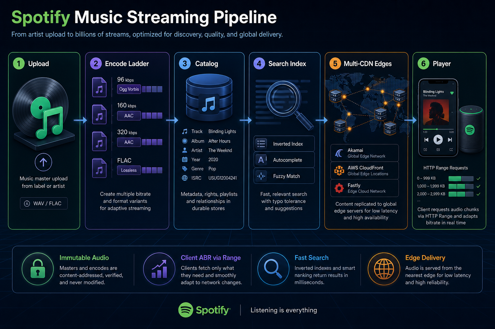
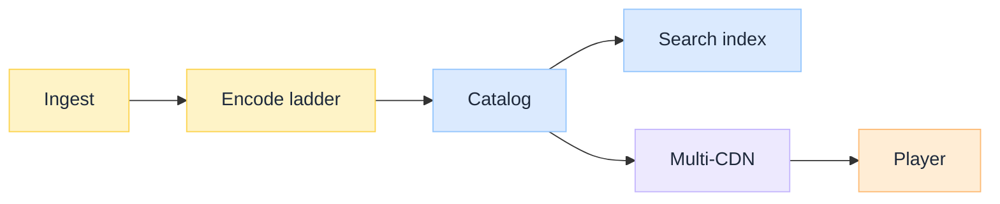
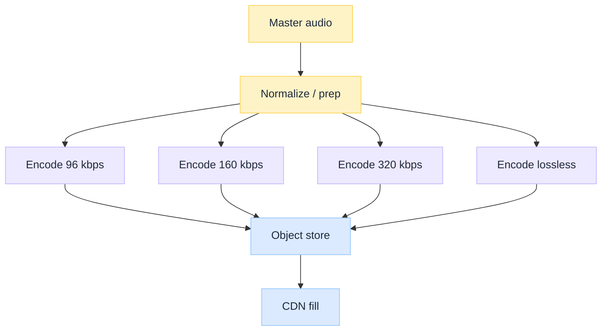
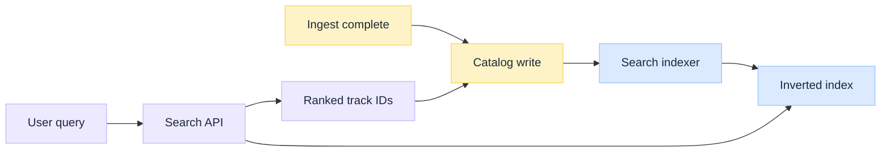
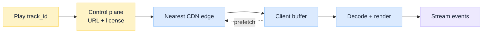
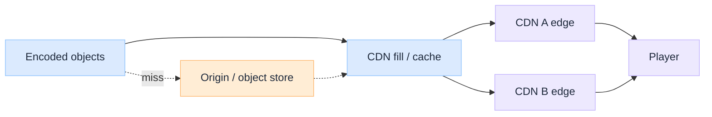

 

# Spotify Music Streaming Pipeline: From Upload to Search and Play

*A track does not become streamable when someone clicks Upload. It becomes streamable when a media factory turns one master into many bitrate objects, indexes the catalog for discovery, places immutable bytes at the edge, and lets a client player fetch the next Range chunk before the buffer runs dry.*

Most system-design interviews stop at "encode Ogg and put it on a CDN." That skips the hard parts of a Spotify-class stack: **metadata and rights as first-class ingest**, **multi-bitrate ladders without HLS/DASH manifests**, **search as a separate index plane**, and a **multi-CDN play path** where adaptive bitrate is implemented in the client over HTTP range requests.

This is an **architecture breakdown** of upload → search → play, grounded in publicly discussed Spotify Engineering patterns and common system-design reconstructions. Exact internal names and topologies evolve; the design lessons stay useful. For the video sibling, see [Netflix Video Processing Pipeline](/insights/netflix-video-processing-pipeline).

:::tip[THE CLAIM]
**Upload, search, and play are three products that share a catalog and object store.** Encoding audio is cheaper than video, but TTFB, inverted-index search, multi-CDN steering, and client-side ABR over range requests are the real pipeline. The product is the control plane plus immutable bytes, not a single MP3 file.
:::

<!-- truncate -->

## Pipeline at a glance

 

| Component | What it does | Failure if skipped |
| --- | --- | --- |
| **Ingest** (master + metadata) | Accept label/distributor/artist masters; validate format and rights fields | Bad masters and broken geo/rights pollute every stream |
| **Encode ladder** | Transcode to multiple bitrates/codecs (e.g. Ogg Vorbis, AAC, FLAC) | Devices cannot adapt; premium and free tiers share one quality |
| **Catalog** | Authoritative track/album/artist/playlist metadata | Search and play have nothing stable to point at |
| **Search index** | Inverted index for title, artist, album, lyrics, fuzzy match | Catalog exists but discovery is slow or empty |
| **Multi-CDN** | Cache immutable audio objects near listeners | Origin melts; startup latency spikes |
| **Player** | HTTP Range chunks, buffer, client ABR, prefetch | No playback, constant stalls, or quality thrash |

---

## How this differs from Netflix video

Audio tracks are small (megabytes, not gigabytes), so the factory is lighter on chunked parallel encode and ABR packaging. The pressure moves elsewhere:

| Concern | Netflix-style video | Spotify-style audio |
| --- | --- | --- |
| Source | Studio mezzanine / IMF | Label or artist master (WAV/FLAC/high-bitrate) |
| Encode shape | Chunked parallel + many resolution rungs | Whole-track encode into a few bitrate/codec files |
| Player contract | HLS/DASH manifests and segments | Single file per quality; client uses `Range` headers |
| Delivery | Purpose-built Open Connect | Multi-CDN (Akamai, CloudFront, Fastly-class edges) |
| Extra plane | Quality service (VMAF) | Search index + personalization event loop |

Video ABR mechanics (buffer, bandwidth estimate, next chunk) still apply conceptually; see [Adaptive Video Streaming Explained](/insights/adaptive-video-streaming-explained). Spotify-class audio usually implements the same idea **without** a manifest: switch quality by starting range requests against a different bitrate object.

---

## Ingest and metadata

### What arrives upstream

Upstream of streaming sits a **master**: a high-quality audio package from a label, distributor, or independent creator, plus a metadata payload (ISRC, title, artists, album, release dates, territories, rights). That master is the root of every later encode. Podcasts and UGC follow similar shape with different rights rules.

### Why validate before encode

Encoding is cheaper than video, but still a catalog-wide cost, and bad metadata breaks search, royalties, and geo compliance. Fail fast on:

| Check class | Examples |
| --- | --- |
| **Conformance** | Expected containers, sample rates, channel layouts |
| **Loudness / sanity** | Gross defects; loudness normalization targets (e.g. LUFS) |
| **Identity / rights** | Track IDs, territories, exclusive windows, take-down readiness |
| **Fingerprinting** | Duplicate or rights-conflict detection where required |

Studio/label paths may also need review proxies or watermarked review copies. Those belong on an editorial path, not on every member play encode.

---

## Multi-bitrate encoding

### Ladder, not one file

Member devices and network conditions need a **ladder**: multiple bitrates and often multiple codecs. Public reconstructions commonly cite lossy tiers around **96 / 160 / 320 kbps** (historically Ogg Vorbis; AAC on Apple platforms) plus a **lossless** FLAC-class tier for HiFi. Each rung is a **whole-file object**, content-addressed or versioned, treated as immutable once published.

In plain terms, one master becomes several whole-file copies of the same song at different quality levels. The client (and the plan) pick which file to stream:

| Tier | Rough role |
| --- | --- |
| **~96 kbps** | Low / mobile-friendly: less data, weaker fidelity |
| **~160 kbps** | Default / "Normal" middle rung |
| **~320 kbps** | High / "Very High" premium-class lossy |
| **Lossless** | HiFi (FLAC-class): bigger files, no lossy compression |

These numbers are the usual lossy quality steps in a Spotify-class ladder, not exact public API constants. Adaptive bitrate means switching which of these files you fetch, not re-encoding on the fly.

 

| Concern | Design implication |
| --- | --- |
| Device diversity | Multiple codecs per track, not one universal MP3 |
| Network diversity | Client picks a rung; switches mid-play by changing the target object |
| Immutability | New master = new object identity; long CDN TTLs stay safe |
| Cost | Encode at ingest time, not on every play |

**Multiple codecs per track** means the same song is stored in more than one encoding format, not only at different bitrates. A single universal MP3 for everyone is a weak fit: iOS often prefers AAC, Spotify-class desktop/Android paths historically used Ogg Vorbis, and HiFi needs FLAC (or similar lossless). Devices, OS audio stacks, and licenses differ, so the encode ladder may include codec variants of the same quality rung (for example Vorbis at 320 and AAC at a nearby bitrate). The play path picks the object that matches the client's codec and quality choice.

### Why not HLS/DASH for tracks?

Unlike Netflix packaging into segment playlists, Spotify-class audio delivery is often described as **one file per quality** on the CDN. The client fetches roughly half-megabyte **HTTP range** windows over HTTPS and runs its own adaptive logic. When it wants a higher tier, it stops the current file and continues range requests against the higher-tier file (aligned to a sensible byte/time offset). That keeps the origin contract simple: immutable objects + CDN + signed URLs, not a packager fleet per track.

---

## Catalog and search

### Catalog is the source of truth

The **catalog** holds track, album, artist, and relationship data the rest of the system points at. Play requests resolve `track_id` → object keys and metadata. Playlist collaboration, library follows, and recommendations hang off the same identities. Storage choices here look like classic [SQL vs NoSQL](/insights/sql-vs-nosql-under-the-hood) tradeoffs: strong relational models for rights and ownership graphs, document or cache layers for hot read paths.

### Search is a derived index

Search is not "query the catalog table with LIKE." At catalog scale you maintain an **inverted index** (Elasticsearch-class or equivalent) over titles, artists, albums, lyrics, and aliases, with:

| Capability | Why it matters |
| --- | --- |
| **Autocomplete / prefix** | Instant typeahead as the user types |
| **Fuzzy / typo tolerance** | Real-world queries misspell artists |
| **Ranking** | Popularity, personalization signals, locale |
| **Freshness** | New releases must appear within the publish SLA |

 

**Analogy:** the catalog is the library card catalog of record. The search index is the sticky notes and keyword drawers you keep in sync. Play and royalties trust the catalog; discovery trusts the index.

Podcast and natural-language playlist search may add dense retrieval (embeddings + ANN) beside the lexical index. Treat that as an extra retrieval path, not a replacement for the catalog.

---

## Play path: control plane then bytes

Pressing play is two planes:

1. **Control plane:** authenticate, resolve `track_id`, pick CDN hostname / object URL, obtain DRM or license material where required, return playback session metadata.
2. **Data plane:** client downloads audio in chunks via `Range` requests, fills a 10-30 second-class buffer, prefetches ahead, and may switch bitrate objects as network changes.

 

| Play concern | Pipeline implication |
| --- | --- |
| Time to first audio | Objects must already exist at the edge for hot titles |
| Gapless / crossfade | Client buffer and decode schedule, not just CDN hit ratio |
| Offline | Encrypted local copies + license refresh; still rooted in the same object identity |
| Connect / multi-device | Control plane moves the session; bytes still come from edges |

Name → edge IP still starts with [DNS](/insights/dns-under-the-hood). Generic edge mechanics live in [CDN Under the Hood](/insights/cdn-under-the-hood).

---

## Global delivery: multi-CDN

After encode, listeners should not pull every byte from a single origin region. Spotify-class delivery uses a **multi-CDN** strategy: popular immutable audio objects are cached at edges operated by different providers, with steering for capacity, geography, and failure.

That differs from Netflix **Open Connect** (ISP appliances and heavy pre-positioning of video catalogs), but the control-plane idea is the same: treat placement and hit ratio as part of the pipeline, not an afterthought. Audio's smaller objects make long TTLs and origin shielding especially effective once objects are immutable.

 

| Delivery concern | Pipeline implication |
| --- | --- |
| Hit ratio | Encode complete before release windows; immutable keys |
| Catalog bursts | Elastic encode + scheduled fill for tentpole releases |
| Provider diversity | Steer away from a single CDN outage |
| Security | Signed URLs / tokens; DRM for offline where required |

---

## Stream events and observability

Every successful play emits **stream events**: what played, for how long, device, quality rung, errors, skip behavior. That telemetry feeds:

| Consumer | Why |
| --- | --- |
| **Royalties / reporting** | Rights holders and finance depend on play accounting |
| **Personalization** | Taste profiles, Discover Weekly-class candidates |
| **QoE** | Startup delay, stall rate, bitrate mix |
| **Ops** | CDN miss storms, encode defects, regional incidents |

Separating **encode** (make bytes) from **observability** (judge sessions) keeps product analytics from blocking the media factory. Treat play telemetry as a first-class contract, not a client-side log dump.

---

## Design lessons (what to steal)

| Lesson | Why it matters |
| --- | --- |
| **Validate masters and rights before encode** | Fail fast on garbage and geo/rights debt |
| **Pre-encode the ladder at ingest** | Play path should fetch, not transcode |
| **Immutable objects + long CDN TTL** | Safe caching at multi-CDN scale |
| **Client ABR over Range, not always manifests** | Simpler audio contract; still adaptive |
| **Catalog ≠ search index** | Source of truth vs discovery plane |
| **Control plane then data plane** | Auth, URL, license before bytes |
| **CDN is part of the release** | Hot titles must exist at the edge on day one |
| **Stream events close the loop** | Royalties, reco, and QoE need the same play signal |

## Where teams go wrong copying this

| Mistake | Why it hurts |
| --- | --- |
| **One bitrate for all users** | Free and premium share a bad middle; mobile burns buffer |
| **Search queries against the catalog DB** | Latency and load explode; ranking stays naive |
| **Mutable object URLs after publish** | CDN caches serve stale or broken audio |
| **HLS packaging cargo-culted for short tracks** | Extra packager complexity without video-scale need |
| **CDN bolted on after launch** | Origin storms on tentpole releases |
| **No play-event contract** | Broken royalties and blind personalization |

:::tip[TAKEAWAY]
**From upload to search and play is a staged audio factory:** validate → encode a bitrate ladder into immutable objects → write catalog and search index → fill multi-CDN edges → resolve play on the control plane → let the client fetch Range chunks and adapt. A Spotify-class design is less about a brand-name codec and more about **boundaries between catalog, index, bytes, and telemetry**.
:::

:::info[Builds on]
[Netflix Video Processing Pipeline](/insights/netflix-video-processing-pipeline) · [Adaptive Video Streaming Explained](/insights/adaptive-video-streaming-explained) · [CDN Under the Hood](/insights/cdn-under-the-hood) · [DNS Under the Hood](/insights/dns-under-the-hood) · [SQL vs NoSQL Under the Hood](/insights/sql-vs-nosql-under-the-hood)
:::

## Further reading

Public engineering write-ups and system-design reconstructions behind this case study. Prefer primary Spotify Engineering posts where available; treat interview-style designs as vocabulary, not internal blueprints.

### Pipeline and delivery

| Resource | Why read it |
| --- | --- |
| [Spotify Engineering Blog](https://engineering.atspotify.com/) | Primary source for platform, delivery, and client topics |
| [CDN Under the Hood](/insights/cdn-under-the-hood) | Generic edge, cache key, and origin shielding mechanics |
| [Netflix Video Processing Pipeline](/insights/netflix-video-processing-pipeline) | Contrast: video factory, ABR packaging, Open Connect |

### Search and catalog shape

| Resource | Why read it |
| --- | --- |
| [SQL vs NoSQL Under the Hood](/insights/sql-vs-nosql-under-the-hood) | When catalog truth and search indexes diverge |
| Spotify Engineering posts on search / podcast retrieval | Lexical vs dense retrieval for discovery |

### Related (playback and foundations)

| Resource | Why read it |
| --- | --- |
| [Adaptive Video Streaming Explained](/insights/adaptive-video-streaming-explained) | Buffer, bandwidth estimate, quality switching ideas |
| [DNS Under the Hood](/insights/dns-under-the-hood) | How clients find the nearest edge IP |
| [HTTP/1 vs HTTP/2 vs HTTP/3 Under the Hood](/insights/http-1-vs-http-2-vs-http-3-under-the-hood) | Transport choices under Range-heavy download |
