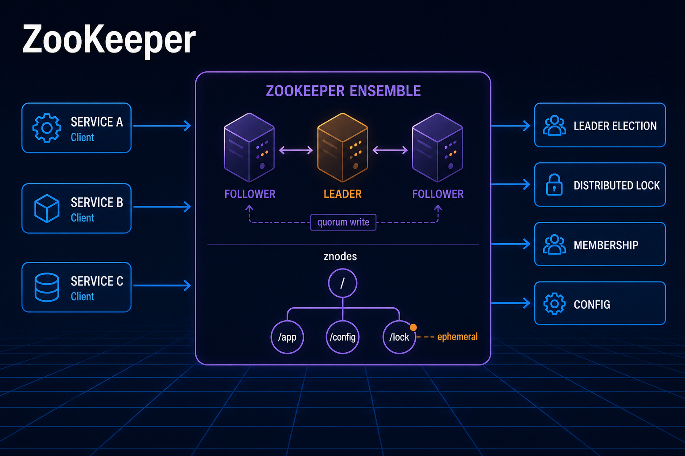
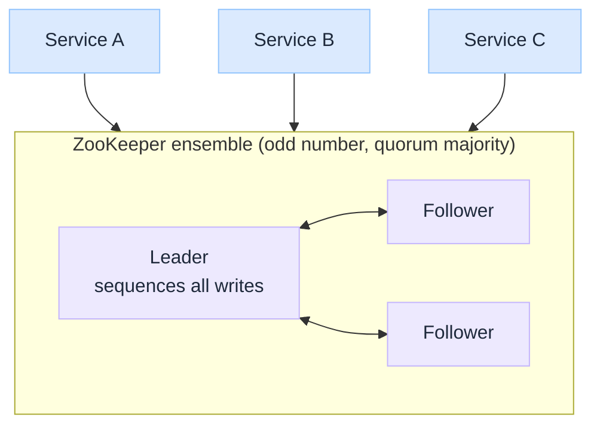
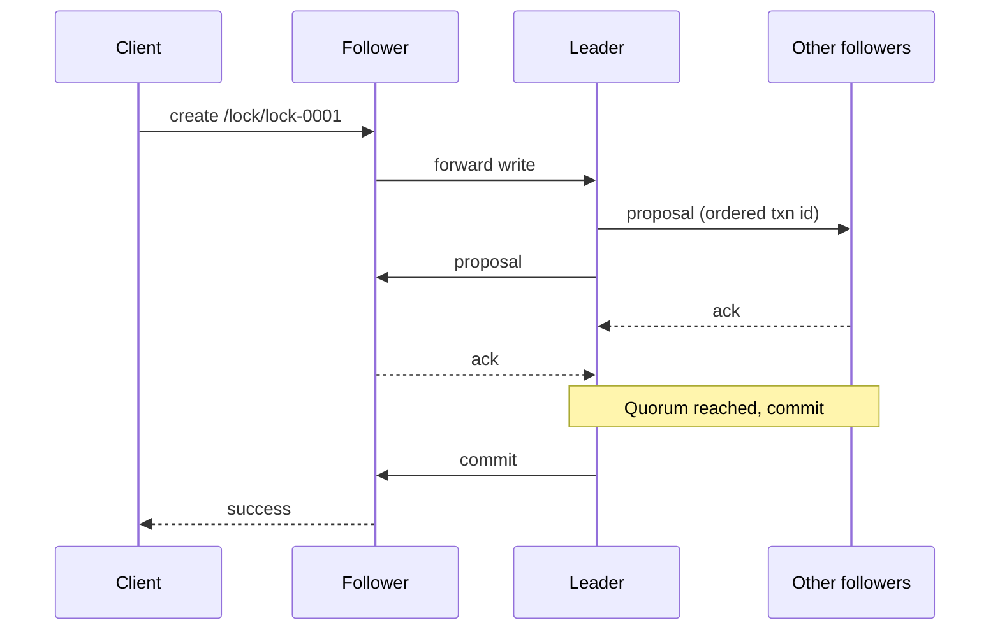
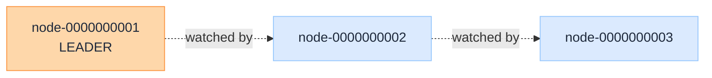
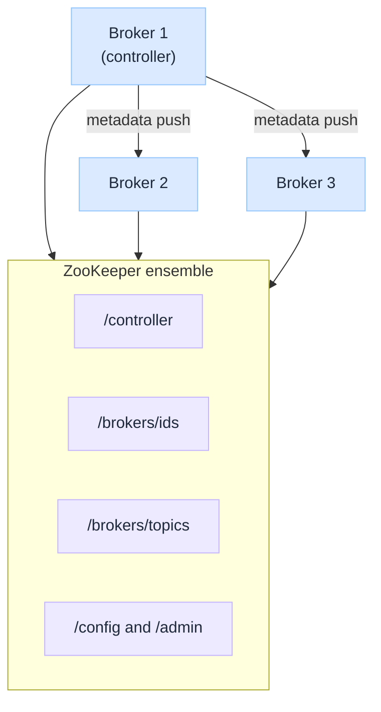
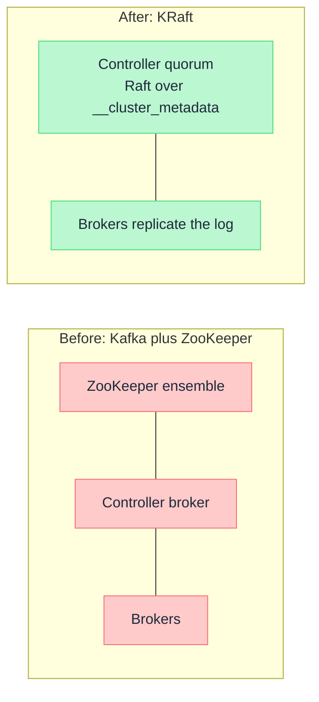

import Details from '@theme/Details';
import Tabs from '@theme/Tabs';
import TabItem from '@theme/TabItem';

<br/>


# ZooKeeper Under the Hood

*Run one copy of a service and every question has an obvious answer. Run five copies and the hard questions arrive at once: which one is in charge, which ones are still alive, and who gets to hold the lock right now.*

Those questions look like application problems. They are not. They are the same small set of agreement problems, and getting them right with timeouts and retries is famously easy to do badly. Apache ZooKeeper exists so that a cluster can answer them by asking one dependable service instead of each node guessing from its own vantage point.

The usual description, "ZooKeeper is a distributed configuration store", is the least interesting thing about it. What you are really buying is **agreement that survives a node dying mid-sentence**.

:::tip[THE CLAIM]
**ZooKeeper is not a database. It is a small, strongly consistent, in-memory tree used as a coordination kernel.** Its power comes from three primitives working together: **ephemeral nodes** that vanish when a client dies, **sequential nodes** that impose a global order, and **watches** that notify instead of poll. Leader election, locking, and membership are all recipes built from those three.
:::

<!-- truncate -->

## The bottom line first

- **Problem solved:** who is the leader, who is alive, who holds the lock, and what is the current config, answered consistently for every node.
- **Data model:** a filesystem-like tree of **znodes**. Small values only, held in memory, replicated to every server in the ensemble.
- **The trick:** **ephemeral** znodes are tied to a client session and disappear automatically when that client stops heartbeating. Failure detection is built into the data model.
- **Consistency:** writes go through a **leader** and need a **quorum**, ordered by the **ZAB** protocol. Reads are served locally and can be slightly stale unless you ask for a `sync`.
- **Kafka used it for a decade** to store broker registration, topic metadata, and controller election, then replaced it with **KRaft**. ZooKeeper was **removed entirely in Kafka 4.0**.
- **Alternatives today:** **etcd** for anything Kubernetes-shaped, **Consul** when service discovery and health checking come together, ZooKeeper mainly where the Apache ecosystem already runs it.

## The problem before the solution

Picture five workers that must have exactly one leader. The naive approach is a config file naming the leader, which fails the moment that host dies. The next approach is a heartbeat and an election in your own code, and this is where teams lose weeks.

| The hard part | Why homegrown attempts fail |
| --- | --- |
| **Detecting death** | A node that is slow, garbage collecting, or network partitioned looks exactly like a node that is dead |
| **Agreeing on the answer** | Two workers can each conclude they won, and both start writing. That is split brain |
| **Ordering events** | Without a single ordering authority, "who asked first" has no reliable answer |
| **Surviving the coordinator** | If the thing tracking leadership is itself a single node, you moved the problem rather than solving it |

ZooKeeper's contribution is to solve this **once**, in a replicated service, and expose the result as something as simple as a small file tree.


<br/>

---

## The data model: a tree of znodes

Everything in ZooKeeper lives in a hierarchical namespace that looks like a filesystem path, for example `/services/payments/instance-004`. Each node in that tree is a **znode**, and unlike a filesystem, every znode can hold data **and** have children.

The values are deliberately tiny. The default cap is about **1 MB per znode**, and the whole dataset is held **in memory on every server** so reads are fast. This is the single most important constraint to internalise: ZooKeeper stores **pointers and decisions**, never payloads. Storing a document, a queue of messages, or an event log in ZooKeeper is a well-known way to bring down a cluster.

### The three znode flavours

| Type | Lifetime | What it gives you |
| --- | --- | --- |
| **Persistent** | Until explicitly deleted | Config values, static topology, anything that should outlive its creator |
| **Ephemeral** | Deleted automatically when the creating session ends | Liveness. A registered instance disappears on its own when the process dies |
| **Sequential** | Suffixed with a monotonically increasing counter | Global ordering. `lock-0000000001`, `lock-0000000002`, and so on |

Ephemeral and sequential can be combined, and that combination is the foundation of nearly every recipe in this article.

Each znode also carries a version number. Writes can be made conditional on that version, which gives you compare and set semantics without a lock.

<Details summary="Znode operations at the CLI">

```bash
# Register a service instance that vanishes if this session dies
create -e /services/payments/instance-004 "10.2.0.14:8443"

# Read a value and its metadata (version, ephemeral owner, children count)
get -s /services/payments/instance-004

# Conditional write: only succeeds if the znode is still at version 7
set /config/feature-flags '{"newCheckout":true}' 7

# List live members
ls /services/payments
```

The `-e` flag is the whole liveness story. No cleanup job removes that node. It is removed when the session behind it stops heartbeating.

</Details>

### Watches: notification instead of polling

A client can set a **watch** on a znode when it reads it. When that znode changes or its children change, ZooKeeper sends the client a one-time notification.

Two properties matter in practice. First, a watch fires **once** and must be re-registered, which leaves a small window where a second change can be missed. Correct clients therefore treat a watch as "something changed, go and re-read the state", never as "here is the change". Second, the notification is delivered **before** the client sees the new data, so the ordering guarantee holds: you cannot observe a change without having been told about it.

:::tip[TAKEAWAY]
**The data model is the feature.** A tree, ephemeral lifetimes, sequence numbers, and change notifications are enough to express leader election, locks, and membership without ZooKeeper knowing what any of those words mean.
:::

---

## The ensemble: how agreement is reached

ZooKeeper runs as an **ensemble** of servers, conventionally an odd number: 3, 5, or 7. One server is the **leader**, the rest are **followers**. A write is only committed when a **quorum**, meaning a strict majority, has acknowledged it.

Odd sizing is not superstition. A five node ensemble tolerates two failures, and so does a six node ensemble, so the sixth server adds cost and latency without adding fault tolerance.

### The write path

All writes are forwarded to the leader, which assigns each one a globally ordered transaction id and broadcasts it using **ZAB**, the ZooKeeper Atomic Broadcast protocol. This is what guarantees that every server applies the same changes in the same order.


<br/>

### The read path, and the one surprise

Reads are served **directly by whichever server the client is connected to**, from memory, with no quorum round trip. That is why ZooKeeper reads are fast and why read-heavy workloads scale by adding followers.

The catch: that follower might be a few milliseconds behind the leader, so a read can return slightly stale data. ZooKeeper guarantees **sequential consistency** per client and **linearizable writes**, but **not linearizable reads** by default. When you must see the very latest committed state, issue a `sync` before the read.

| Guarantee | What it means for your code |
| --- | --- |
| **Sequential consistency** | One client's operations are applied in the order it sent them |
| **Atomicity** | A write either fully applies across the quorum or does not apply at all |
| **Single system image** | A client sees the same view regardless of which server it connects to, over time |
| **Reliability** | Once a write is applied it persists until overwritten |
| **Timeliness** | Client views are guaranteed current within a bounded time |

### Sessions: the actual failure detector

A client's connection to the ensemble is a **session** with a negotiated timeout. The client heartbeats to keep it alive. If heartbeats stop for longer than the timeout, the ensemble **expires the session and deletes every ephemeral znode that session created**.

That single mechanism is what makes membership and leader election work. Nothing has to notice the failure and clean up, because the disappearance of the data *is* the notification, and everyone watching that path finds out at the same time.

Session timeout tuning is the classic operational trade-off: too short and a garbage collection pause will evict a healthy node, too long and a genuinely dead leader keeps its lock while the cluster waits.

:::tip[TAKEAWAY]
**Quorum for writes, local memory for reads, sessions for liveness.** Almost every ZooKeeper behaviour that surprises people, stale reads, sudden mass ephemeral deletion, election storms after a network blip, follows directly from those three choices.
:::

---

## What teams actually build with it

ZooKeeper ships primitives, not features. These recipes are the features, and most JVM teams consume them through **Apache Curator** rather than writing them by hand, because the edge cases are unforgiving.

<Tabs groupId="zk-recipes">
  <TabItem value="election" label="Leader election" default>

1. Every candidate creates an **ephemeral sequential** znode under `/election`.
2. Each reads the children and compares. The lowest sequence number is the leader.
3. Non-leaders set a watch on the node **immediately before** their own, not on the leader, which avoids a stampede when one node leaves.
4. If the leader's process dies, its session expires, its ephemeral node vanishes, and exactly the next node in sequence is notified and takes over.


<br/>

  </TabItem>
  <TabItem value="lock" label="Distributed lock">

Structurally identical to election, with a different meaning attached to winning.

1. Create an ephemeral sequential znode under `/locks/resource-x`.
2. If yours is the lowest, you hold the lock.
3. Otherwise watch the node just ahead of you and wait.
4. Release by deleting your znode, or die and let session expiry release it for you.

The last point is why this beats a lock in a normal database: a crashed holder cannot leave the lock stuck forever, because the lock's existence depends on a live session.

  </TabItem>
  <TabItem value="membership" label="Cluster membership">

1. Each instance creates an ephemeral znode under `/members` on startup, containing its host and port.
2. Any interested client lists `/members` and sets a watch on the children.
3. Instances that crash, hang, or get partitioned drop out of the list automatically.

This is service discovery with a built-in health signal, and it is where the comparison to Consul and etcd later in this article becomes interesting.

  </TabItem>
  <TabItem value="config" label="Configuration">

1. Store settings in persistent znodes such as `/config/limits`.
2. Every service reads on startup and sets a watch.
3. An operator writes a new value once, and every watcher is notified and re-reads.

No polling, no restart, and every node converges on the same value because the write went through one ordered log.

  </TabItem>
</Tabs>

---

## Case study: how Kafka used ZooKeeper

For more than ten years, ZooKeeper was where Kafka kept the truth about itself. Brokers stored the data, ZooKeeper stored **everything needed to agree on who stores what**.


<br/>

| Znode path | What Kafka kept there |
| --- | --- |
| `/brokers/ids/{id}` | **Ephemeral** registration per broker. A broker dying removed its own entry instantly |
| `/controller` | **Ephemeral** node won by exactly one broker. That broker became the **controller** |
| `/brokers/topics/{topic}` | Partition count and the replica assignment for each partition |
| `/config/...` | Dynamic topic and client configuration overrides |
| `/admin/...` | In-flight operations such as partition reassignment and topic deletion |

### The controller, and why it mattered

Kafka needs one broker to make cluster-wide decisions: which replica leads each partition, and what happens when a broker disappears. That role is the **controller**, and it was elected with the exact ephemeral node recipe described earlier. Every broker raced to create `/controller`, one won, and the rest watched it.

When a broker died, its ephemeral registration vanished, the controller was notified, and it elected new partition leaders for every partition that had lost its leader, writing the results back to ZooKeeper and pushing them to the remaining brokers.

Two details are worth remembering because they explain the eventual divorce. First, consumer group offsets originally lived in ZooKeeper too, and were moved into an internal Kafka topic years ago precisely because ZooKeeper was a poor fit for high frequency writes. Second, when a controller failed, the new controller had to **read the entire cluster metadata out of ZooKeeper before it could do anything**.

:::tip[TAKEAWAY]
**Kafka was not using ZooKeeper as a database. It was using it as an election service and a source of truth for metadata.** The pattern was textbook, and it still hit a ceiling.
:::

### Why Kafka left

The problem was scale and operational surface, not correctness.

| Pain point | Effect in production |
| --- | --- |
| **Two distributed systems** | Every Kafka team had to size, tune, secure, monitor, and upgrade a JVM ensemble that was not Kafka |
| **Controller failover cost** | Rebuilding full metadata from ZooKeeper took longer as partition counts grew, so recovery time scaled with cluster size |
| **Metadata propagation** | Changes travelled through ZooKeeper and then out to brokers via RPC, an indirect path with its own lag |
| **Partition ceiling** | Practical limits sat in the low tens of thousands of partitions per cluster |
| **Divergence risk** | Two sources of state means windows where a broker's view and ZooKeeper's view disagree |

**KRaft** (KIP-500) removes the external dependency by making Kafka do its own consensus. Dedicated **controller nodes** form a Raft quorum, and cluster metadata becomes an ordinary Kafka log, an internal topic called `__cluster_metadata`. Brokers follow that log the same way consumers follow any topic, so metadata propagation becomes event driven replication rather than a separate protocol.


<br/>

The payoff is a single system to operate, near instant controller failover because the new controller already has the metadata log in memory, and support for far larger partition counts.

The timeline matters if you still run Kafka anywhere: KRaft became production ready in **3.3**, **3.9 is the final bridge release** that can run both modes and perform the migration, and **4.0 removed ZooKeeper completely**. There is no ZooKeeper fallback in 4.x. A cluster still on ZooKeeper must migrate to KRaft while on 3.9 before it can move to 4.x at all.

:::tip[TAKEAWAY]
**Kafka leaving ZooKeeper is not a verdict on ZooKeeper.** It is a mature system absorbing its own consensus because it already had a replicated, ordered log, which is exactly the thing ZooKeeper was providing.
:::

---

## Where ZooKeeper still runs

The Kafka headline has convinced some teams that ZooKeeper is dead. It is not. Version **3.9.5** shipped in March 2026, and the software still underpins a large amount of the Apache data ecosystem.

| Still commonly seen in | Role it plays |
| --- | --- |
| **Apache HBase** | Master election, region server membership, cluster state |
| **Apache Hadoop (HDFS and YARN HA)** | Automatic NameNode and ResourceManager failover |
| **Apache Solr (SolrCloud)** | Cluster state, collection config, leader election per shard |
| **Apache Pinot, Druid, NiFi, Flink** | Coordination and high availability, though several now offer alternatives |

The fair summary is that ZooKeeper is **in maintenance and wide production use, but rarely the choice for a greenfield system** that has no existing Apache dependency.

---

## Services that do the same job

Every system below solves the same core problem, replicated consistent state with change notification, and differs mostly in the shape of the API and what it bundles.

| | **ZooKeeper** | **etcd** | **Consul** | **Chubby** |
| --- | --- | --- | --- | --- |
| **Consensus** | ZAB | Raft | Raft | Paxos |
| **Data model** | Hierarchical znode tree | Flat keys with prefixes and revisions | Flat KV plus a service catalog | Coarse-grained lock files |
| **API** | Custom binary, Java and C clients | gRPC and HTTP/JSON | HTTP/JSON and DNS | Internal to Google |
| **Watches** | One-time, must re-register | Streaming, resumable from a revision | Blocking queries on index | Event callbacks |
| **Liveness** | Ephemeral znodes tied to sessions | Keys bound to leases | Native health checks, script, HTTP, TTL | Session based |
| **Linearizable reads** | Only with an explicit `sync` | Yes | Yes | Yes |
| **Bundled discovery** | Recipes you build | Not built in | Yes, with DNS and health checking | No |
| **Typical home** | Apache data stack | Kubernetes control plane | Multi-datacenter service networking | Google internal |

A few clarifications that come up constantly:

- **Chubby is the ancestor.** Google's lock service inspired ZooKeeper, which is why the concepts map so neatly.
- **etcd is not "the Kubernetes database" by coincidence.** Its revision-based, resumable watch API is a better fit for controllers that must never miss an event, which is exactly the Kubernetes reconciliation model.
- **Consul solves a wider problem.** It bundles service discovery, health checking, DNS, and multi-datacenter support, so it competes with ZooKeeper plus a registry rather than with ZooKeeper alone. Discovery through DNS is the part teams underestimate, since every runtime already speaks it. See [DNS Under the Hood](/insights/dns-under-the-hood).
- **Eureka and Nacos sit a layer up.** They are service registries aimed at application frameworks, and they generally trade strict consistency for availability during partitions.
- **Sometimes the answer is no separate service at all.** Kafka's KRaft, CockroachDB, and TiDB all embed Raft directly. If your system already maintains a replicated log, an external coordinator can be redundant.

### Choosing today

| Situation | Reach for |
| --- | --- |
| Running on Kubernetes, or building operators and controllers | **etcd**, which is already there |
| Service discovery, health checks, and multi-datacenter in one product | **Consul** |
| Operating HBase, Solr, Hadoop HA, or another Apache system that expects it | **ZooKeeper** |
| Building a distributed system with its own replicated log | **Embedded Raft**, no external coordinator |
| Only needing "spread traffic across healthy instances" | Not a coordination service. Use a load balancer, see [Load Balancer Under the Hood](/insights/load-balancer-under-the-hood) |

That last row is the most common mistake in the list. Plenty of teams stand up an ensemble to solve a problem that health checks on a load balancer already solved.

---

## Common mistakes

| Mistake | Why it hurts |
| --- | --- |
| **Storing real data in znodes** | The dataset lives in memory on every server. Large values trigger garbage collection pauses, and pauses expire sessions across the whole cluster |
| **Using it as a message queue** | High write rates funnel through a single leader and quorum acknowledgement. This is the workload it is worst at |
| **Even numbered ensembles** | Six servers tolerate the same two failures as five, at higher cost and write latency |
| **Treating a watch as a change feed** | Watches fire once and can coalesce. Always re-read state on notification rather than trusting the event to carry it |
| **Session timeouts shorter than your GC pauses** | A healthy leader gets evicted mid-pause, and the cluster churns through elections for no reason |
| **Assuming reads are linearizable** | A follower can be behind. Call `sync` first when correctness depends on the very latest value |
| **Co-locating the ensemble with heavy workloads** | ZooKeeper is latency sensitive on disk fsync and network. Noisy neighbours turn into election storms |
| **Ignoring the Kafka 4.0 removal** | There is no ZooKeeper mode to fall back to. Migration must happen on 3.9 before any 4.x upgrade |

## Final takeaway

ZooKeeper answers one question for a cluster: **what do we all agree is true right now?** It answers it with a small replicated tree, ordered writes through a quorum, znodes whose lifetime is bound to a live session, and notifications instead of polling. Leader election, distributed locks, membership, and configuration are not features it implements. They are recipes that fall out of those four ideas.

Kafka's departure is the clearest illustration of both its value and its limit. ZooKeeper carried Kafka's metadata and elections for over a decade, and Kafka outgrew it, absorbing consensus into its own log because it already had one. For everyone else the choice narrowed rather than disappeared: etcd where Kubernetes lives, Consul where discovery and health checking belong together, ZooKeeper where the Apache ecosystem already depends on it.

> **Coordination is a small, brutal problem that is best solved once. Use a coordination service for decisions, never for data, and be honest about whether your system already has a replicated log that makes the external dependency unnecessary.**

:::info[Builds on]
[Load Balancer Under the Hood](/insights/load-balancer-under-the-hood) · [DNS Under the Hood](/insights/dns-under-the-hood) · [REST vs gRPC Under the Hood](/insights/rest-vs-grpc-under-the-hood) · [TCP vs UDP Under the Hood](/insights/tcp-vs-udp-under-the-hood)
:::

## Further reading

| Topic | Resource | Why read it |
| --- | --- | --- |
| **ZooKeeper** | [Apache ZooKeeper documentation](https://zookeeper.apache.org/doc/current/index.html) | Data model, sessions, watches, and consistency guarantees from the source |
| **Recipes** | [ZooKeeper recipes and solutions](https://zookeeper.apache.org/doc/current/recipes.html) | Canonical election, lock, barrier, and queue patterns |
| **Client library** | [Apache Curator](https://curator.apache.org/) | The recipes implemented correctly, with the edge cases handled |
| **Kafka and KRaft** | [KIP-500: Replace ZooKeeper with a self-managed quorum](https://cwiki.apache.org/confluence/display/KAFKA/KIP-500%3A+Replace+ZooKeeper+with+a+Self-Managed+Metadata+Quorum) | The original design argument for removing ZooKeeper |
| **Kafka 4.0** | [Apache Kafka 4.0 release announcement](https://kafka.apache.org/blog/2025/03/18/apache-kafka-4.0.0-release-announcement/) | The release where ZooKeeper mode was removed |
| **Migration** | [KRaft operations and migration](https://kafka.apache.org/documentation/#kraft) | Bridge release path and cutover steps |
| **etcd** | [etcd versus other key-value stores](https://etcd.io/docs/latest/learning/why/) | Direct feature comparison with ZooKeeper and Consul |
| **Consul** | [Consul documentation](https://developer.hashicorp.com/consul/docs) | Discovery, health checking, and multi-datacenter model |
| **Foundations** | [The Chubby lock service (Google)](https://research.google/pubs/pub27897/) | The paper that shaped this whole category |
