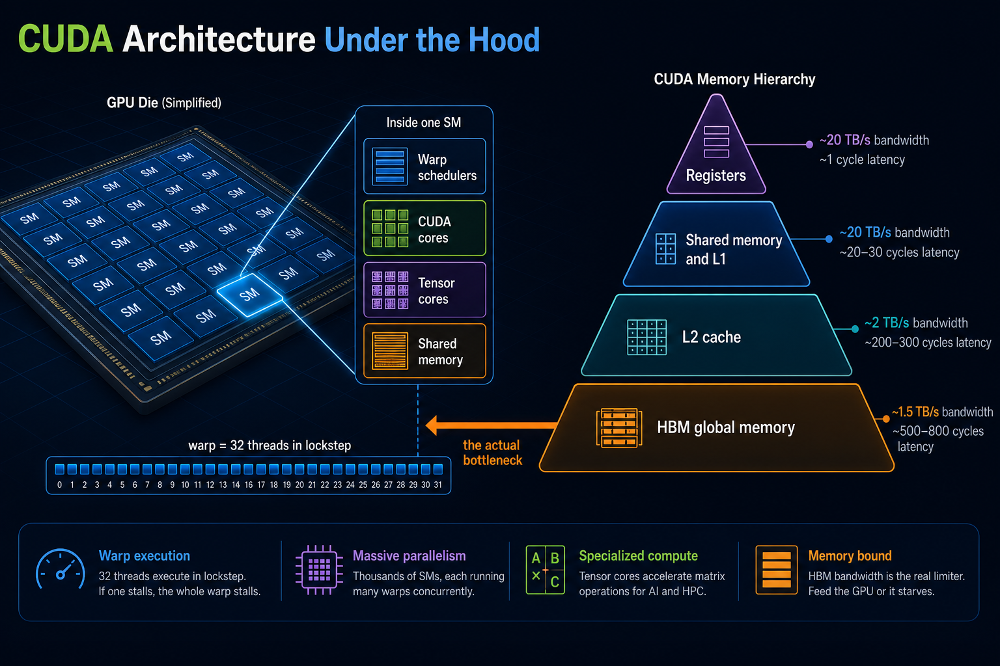
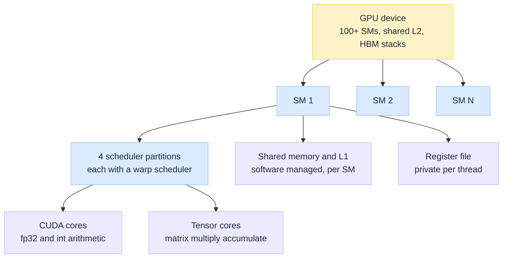
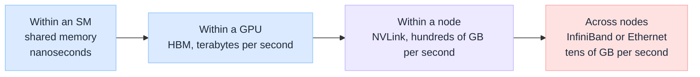

import Details from '@theme/Details';

<br/>


# CUDA Architecture: How a GPU Actually Runs Your Model

*I started with the mental model most people start with: a GPU is a CPU with thousands of tiny cores, so it does the same work about a thousand times faster. Almost every wrong performance intuition I had came from that one sentence.*

The correction took a while to land, and it is not really about cores at all. A CPU is built to finish one thread as quickly as possible. A GPU is built to keep an enormous number of threads in flight so that the machine never sits idle waiting for memory. Once you see it that way, the things that seemed like implementation trivia (warps, shared memory, coalescing) turn out to be the whole design, and the headline FLOPs number on the spec sheet turns out to predict very little.

This is a learner's pass through that architecture, written the way I wish it had been explained to me: hardware first, then the programming model that maps onto it, then the memory hierarchy that actually decides whether your code is fast.

:::tip[THE CLAIM]
**A GPU is a throughput machine, and its real constraint is moving bytes, not doing arithmetic.** CUDA is the hierarchy that maps your work onto that machine: grids onto the device, blocks onto streaming multiprocessors, warps onto schedulers. Most kernels are limited by memory bandwidth long before they are limited by compute, which is why optimisation work is almost always about data movement. And the durable moat around CUDA is the library stack, not the silicon.
:::

<!-- truncate -->

## What CUDA actually is

My first misconception was small but consequential: I thought CUDA was a driver, something you install so PyTorch can see the card. It is three things stacked on each other, and only the bottom one is close to a driver.

| Layer | What lives there | Why it matters |
| --- | --- | --- |
| **Programming model** | Kernels, grids, blocks, threads, shared memory, streams | The abstraction you write against, and it maps almost one to one onto hardware |
| **Compiler and runtime** | `nvcc`, PTX (a virtual instruction set), SASS (the real machine code), the CUDA runtime | PTX is why a binary built years ago still runs on a newer card. It is recompiled to that card's SASS at load time |
| **Library stack** | cuBLAS, cuDNN, CUTLASS, NCCL, Thrust, and the frameworks above them | Where the performance actually comes from. Almost nobody writing AI code writes raw kernels |

That third row is the part worth internalising as an architect. When people say "the CUDA moat", they rarely mean the hardware. They mean that a decade of matrix multiply kernels, convolution algorithms, collective communication routines, and framework integrations are tuned against this one platform. Competing silicon has to reproduce that stack, not just the chip.

:::tip[TAKEAWAY]
**CUDA is a programming model plus a library ecosystem.** The silicon is replaceable in principle. The tuned kernel libraries and the frameworks built on them are what make switching expensive.
:::

---

## GPU vs CPU

Before the hardware detail, the comparison that the opening misconception deserves. A CPU and a GPU are not fast and faster. They are two different answers to the question of what to spend transistors on.

| Dimension | **CPU** | **GPU** |
| --- | --- | --- |
| **Cores** | A handful to low hundreds, each individually powerful | Tens of thousands of simple lanes spread across 100+ SMs |
| **Transistor budget goes to** | Control logic: branch prediction, out of order execution, speculation, deep caches | Arithmetic units and register files |
| **Clock speed** | High, in the gigahertz range | Lower, and it does not matter much |
| **Cache per thread** | Megabytes | Kilobytes |
| **Memory system** | DDR, hundreds of GB per second, hundreds of GB, low latency | HBM, several TB per second, tens of GB, high latency |
| **Good at** | Finishing one thing quickly, whatever shape it is | Doing one shape of thing to an enormous amount of data |
| **Bad at** | Bulk numeric throughput | Branchy, serial, latency-sensitive work |

The rows to read together are cache per thread and memory bandwidth. A CPU gives each thread a large private working set and low latency access to it. A GPU gives each thread almost nothing and compensates with raw bandwidth plus thousands of threads to hide the latency. Neither is a compromise. They are optimised for opposite workloads.

### The dividing question

One test decides where work belongs: **can this be expressed as the same operation applied to thousands of independent data elements?** That is data parallelism, and it is the only thing a GPU is good at. In practice the test has three parts, and work needs all three.

| Requirement | Meaning | Fails when |
| --- | --- | --- |
| **Parallel** | Thousands of items with no dependency between them | Each step needs the previous step's result |
| **Regular** | Same instruction path, predictable memory access | Heavy branching on per-item conditions, or pointer chasing |
| **Substantial** | Enough arithmetic to justify moving the data across PCIe | The job is small, or the data is used once |

That third row is the one people forget. A kernel launch costs a few microseconds of overhead before any work happens, and copying data between host memory and the device runs over an interconnect an order of magnitude slower than HBM. Ship a small array to the GPU, add one to every element, and copy it back, and you will lose comfortably to a plain CPU loop. The GPU only wins when the arithmetic it saves exceeds the transport it costs.

### What runs where

| Workload | Runs on | Why |
| --- | --- | --- |
| Operating system, scheduling, drivers | **CPU** | Serial, branchy, latency-critical, and it is the thing launching everything else |
| Web and API request handling | **CPU** | Thousands of independent but branch-heavy control paths, each tiny |
| Transactional databases | **CPU** | Locking, ordering, and pointer-heavy structures that defeat coalescing |
| Parsing, regex, serialisation | **CPU** | Data-dependent branching on every byte |
| Business rules and orchestration | **CPU** | Complex control flow, negligible arithmetic |
| Tokenisation and data preprocessing | **CPU** | Irregular string work, though it feeds the GPU and must keep up |
| Graph traversal with irregular access | **CPU**, usually | Pointer chasing produces uncoalesced reads, the GPU's worst case |
| Dense matrix multiply and linear algebra | **GPU** | The canonical data-parallel operation, and what tensor cores exist for |
| Neural network training | **GPU** | Mostly large GEMMs, plus collectives across devices |
| Neural network inference | **GPU** | Same shapes, though decode is bandwidth bound rather than compute bound |
| Embedding generation and vector similarity at scale | **GPU** | The same operation over millions of independent vectors |
| Image and video encode, decode, and filtering | **GPU** | Per-pixel work with identical instruction paths, plus dedicated hardware blocks |
| Scientific simulation, FFT, molecular dynamics | **GPU** | Regular grids and dense arithmetic, the original CUDA use case |
| Rendering and ray tracing | **GPU** | What the hardware was designed for before anyone trained a model on it |

### They are not alternatives

Every CUDA program is a **host program that launches device work**. The CPU allocates memory, copies data, launches kernels, and synchronises. The GPU never starts anything on its own. Real systems are heterogeneous by construction, and an LLM serving request is a clean example of the split.


<br/>

The practical consequence is one I did not expect: **the CPU side is a common reason expensive GPUs sit idle.** If tokenisation, batch assembly, or data loading cannot keep up, the device runs out of work and waits. Low GPU utilisation is usually not a kernel problem. It is a host-side or data-pipeline problem, and it is the first thing to check before concluding you need more accelerators.

:::tip[TAKEAWAY]
**Send work to the GPU only when it is parallel, regular, and big enough to pay for the trip.** Everything else belongs on the CPU, and the CPU stays in charge regardless, which makes it the usual suspect when utilisation is low.
:::

---

## The hardware hierarchy

A GPU is not a flat pool of cores. It is a repeating unit copied many times, and the repeating unit is the **streaming multiprocessor (SM)**. A datacentre class GPU has on the order of a hundred or more SMs on one die.


<br/>

Inside one SM there are two kinds of arithmetic unit, and conflating them was another early mistake of mine.

- **CUDA cores** do ordinary scalar floating point and integer work, one operation per lane per cycle. This is what the marketing "core count" refers to.
- **Tensor cores** do one thing: a small matrix multiply and accumulate, in one instruction. They are enormously faster than CUDA cores at that one shape and useless for anything else.

The gap between them is not marginal. On current datacentre parts, tensor core throughput in bf16 is roughly an order of magnitude above the fp32 CUDA core path. Every headline AI FLOPs figure is a tensor core figure. If your kernel is not expressed as matrix multiplies, you never touch that number.

---

## The execution model

You do not schedule threads onto SMs yourself. You launch a **kernel** as a **grid** of **thread blocks**, and the hardware places blocks onto whatever SMs have capacity.

| CUDA concept | Hardware reality |
| --- | --- |
| **Thread** | One lane of execution with its own registers |
| **Warp** | **32 threads that execute in lockstep**, the true unit of scheduling. You never schedule a thread, only a warp |
| **Thread block** | A group of threads (up to 1024) guaranteed to run on **one SM**, able to share memory and synchronise with each other |
| **Grid** | All the blocks in one kernel launch, distributed across all available SMs |

The warp is the concept that changed how I read code. Threads are not independent. Thirty-two of them share one instruction pointer, which is the model NVIDIA calls SIMT, single instruction multiple thread. Blocks matter because they define the only scope where threads can cheaply cooperate: within a block you have shared memory and a barrier, and across blocks you have essentially nothing but global memory.

<Details summary="A minimal kernel, and how the indices map to hardware">

Vector addition, the canonical first CUDA program:

```cuda
__global__ void add(const float* a, const float* b, float* c, int n) {
    int i = blockIdx.x * blockDim.x + threadIdx.x;
    if (i < n) {
        c[i] = a[i] + b[i];
    }
}

// launch: 256 threads per block, enough blocks to cover n
int threads = 256;
int blocks  = (n + threads - 1) / threads;
add<<<blocks, threads>>>(d_a, d_b, d_c, n);
```

Three things are happening that took me a while to see:

1. `blockIdx.x * blockDim.x + threadIdx.x` is every thread computing its own global position. There is no loop. The loop became the launch geometry.
2. The `if (i < n)` guard exists because the grid almost never divides evenly. The extra threads must do nothing rather than write out of bounds.
3. Those 256 threads per block become 8 warps of 32. Choosing 250 threads would still allocate 8 warps, with 6 lanes idle in the last one, forever.

This kernel is also a perfect example of the theme below: it does one add per two loads and one store. It is entirely memory bound, and no amount of tensor core capability helps it.

</Details>

:::tip[TAKEAWAY]
**Write for warps, not threads.** Block sizes that are multiples of 32, branches that whole warps take together, and cooperation kept inside a block are not micro-optimisations. They are the grain of the machine.
:::

---

## The memory hierarchy is the real architecture

This is the section I would put first if I were teaching it again. Performance on a GPU is a memory story, and the hierarchy spans about three orders of magnitude in both latency and bandwidth.

| Level | Scope | Rough latency | Rough capacity | Managed by |
| --- | --- | --- | --- | --- |
| **Registers** | One thread | ~1 cycle | A few hundred KB per SM | Compiler |
| **Shared memory and L1** | One block, on one SM | ~20 to 30 cycles | ~100 to 200 KB per SM | **You**, explicitly |
| **L2 cache** | Whole device | ~200 cycles | Tens of MB | Hardware |
| **HBM (global memory)** | Whole device | ~400 to 800 cycles | Tens of GB, terabytes per second | You, via allocations |
| **Host DRAM** | Over PCIe or NVLink | Thousands of cycles | System RAM | You, via explicit copies |

The row that has no CPU equivalent is shared memory. It is a software managed scratchpad sitting where L1 would be, and the entire craft of hand-written CUDA is deciding what to stage in it. You load a tile of data from HBM into shared memory once, then let the block hammer that tile from fast storage instead of paying the HBM trip repeatedly.

Two rules govern whether HBM access is fast or catastrophic:

- **Coalescing.** When the 32 threads of a warp read consecutive addresses, the hardware merges them into a minimal number of wide memory transactions. When they read scattered addresses, you can get up to 32 separate transactions for the same amount of useful data. Same instruction count, an order of magnitude difference in time.
- **Alignment.** Transactions are served in fixed size segments. Data that straddles segment boundaries costs extra transactions for nothing.

I found this genuinely surprising: two kernels that perform identical arithmetic, differing only in the order they walk an array, can differ by more than 10x. The arithmetic was never the point.

---

## Latency hiding replaces caching

A CPU spends most of its transistor budget fighting latency: deep caches, branch prediction, out of order execution, speculation. All of it exists to make one thread finish sooner.

A GPU makes the opposite bet. It accepts that a memory access takes hundreds of cycles and simply keeps enough other work resident to fill the gap. This is the mechanism underneath the design split described earlier.

| Facing a memory stall | **CPU** | **GPU** |
| --- | --- | --- |
| **Strategy** | Predict, cache, and reorder to avoid the stall | Accept the stall and switch to another warp that is ready |
| **Context switch cost** | Expensive, state must be saved and restored | Effectively free, every warp's registers stay resident |
| **Work available to switch to** | A handful of threads | Thousands of resident warps |

The mechanism is that every resident warp keeps its registers allocated for its whole lifetime. Switching warps means pointing the scheduler at a different register set, so there is no state to save. When one warp stalls on HBM, the scheduler issues from another in the same cycle.

The metric for this is **occupancy**: how many warps are resident on an SM relative to the maximum. Occupancy is bounded by resources per SM, so a kernel that uses too many registers per thread, or too much shared memory per block, allows fewer resident blocks and loses the ability to hide latency. That is the counter-intuitive part. Using more fast resources per thread can make the whole kernel slower, because it starves the machine of work to switch to.

:::tip[TAKEAWAY]
**The GPU does not avoid memory latency, it outruns it with parallelism.** Anything that reduces the number of resident warps (register pressure, oversized shared memory, too few blocks) removes the only defence the architecture has.
:::

---

## Why most kernels are memory bound

Here is the number that reorganised my thinking. Take a current datacentre GPU: roughly 1,000 teraflops of bf16 tensor core throughput against roughly 3 terabytes per second of HBM bandwidth. Divide one by the other and you get the machine's break-even point:

**Roughly 300 floating point operations for every byte you read.**

If your kernel does less arithmetic than that per byte of traffic, the tensor cores are idle waiting for data, and you are running at memory speed no matter what the spec sheet claims. That ratio is called **arithmetic intensity**, and plotting achievable performance against it gives you the roofline model: a diagonal memory-bound region, then a flat compute-bound ceiling.

| Operation | Arithmetic intensity | Verdict |
| --- | --- | --- |
| Elementwise add, GELU, dropout | About 1 FLOP per byte | Deeply memory bound |
| LayerNorm, softmax | A few FLOPs per byte | Memory bound |
| Attention over a long sequence | Depends on the implementation, often memory bound as written | Fixable, see below |
| Large matrix multiply | Grows with matrix size, easily hundreds | Compute bound, the good case |
| Decode step of LLM inference, batch of one | Under 1 FLOP per byte | Bandwidth bound by construction |

Large matrix multiplies are the one operation that is comfortably compute bound, because a tile of data gets reused many times once it is loaded. This is why transformers run well on GPUs: the architecture is mostly big GEMMs. It is also why everything *between* the GEMMs (the normalisations, activations, and residual adds) is the part that wastes time.

---

## Tensor cores and mixed precision

Tensor cores compute a small matrix multiply and accumulate as a single instruction across a warp. That is the only trick, and it is enough to change the economics of the field.

To use them you give up precision on the multiply while keeping it on the accumulate:

| Format | Where it is used | Why |
| --- | --- | --- |
| **fp32** | Master weights, optimiser state, accumulation | Full precision where small updates would otherwise vanish to rounding |
| **bf16** | The dominant training format for matmuls | Half the bytes of fp32 with the same exponent range, so it rarely overflows. Preferred over fp16 for exactly that reason |
| **fp8** | Inference, and increasingly training on newer parts | Half the bytes again, which matters most because it halves memory traffic |

Notice that every step down in precision is a **bandwidth** win as much as a compute win. Given the 300 FLOPs per byte break-even, halving the bytes moves a memory-bound kernel closer to the compute roof. Quantisation is often described as a way to fit a model in memory. Just as often, its real benefit is that it makes the same work move less data. The precision choices in [Before Training an LLM](/insights/before-training-an-llm) and the mixed precision loop in [During Training an LLM](/insights/during-training-an-llm) are the same story seen from the model side.

---

## Kernel fusion, and why FlashAttention is a memory trick

Once you accept that bytes are the currency, a whole class of optimisation becomes obvious.

An unfused sequence of elementwise operations reads a tensor from HBM, writes it back, reads it again for the next operation, and writes it again. Four HBM round trips to do two cheap arithmetic operations. **Fusion** performs both operations while the data is still in registers or shared memory, turning four trips into two. The arithmetic is unchanged. The runtime is not.

This is also the honest explanation of FlashAttention, which I had initially filed as "a faster attention algorithm". It is not a different mathematical result. Standard attention materialises the full sequence-by-sequence score matrix in HBM, which is quadratic in memory traffic. FlashAttention tiles the computation so scores are produced and consumed inside fast on-chip memory, never written out in full. Exact same attention, dramatically less data movement.

<Details summary="The cost of a round trip, in rough numbers">

Consider a tensor of 100 million bf16 elements, so 200 MB, and two elementwise operations over it.

```text
Unfused
  read  200 MB  (op 1 input)
  write 200 MB  (op 1 output)
  read  200 MB  (op 2 input)
  write 200 MB  (op 2 output)
  total 800 MB of HBM traffic

Fused
  read  200 MB
  write 200 MB
  total 400 MB of HBM traffic
```

At around 3 TB/s, that is roughly 270 microseconds versus 130. The arithmetic in both cases is a few hundred million operations, which the machine can do in under a microsecond. The kernel time is essentially all memory.

</Details>

:::tip[TAKEAWAY]
**Nearly every famous GPU optimisation is a data movement optimisation wearing an algorithmic costume.** Fusion, tiling, FlashAttention, quantisation, and paged KV caches all reduce bytes crossing HBM rather than reducing FLOPs.
:::

---

## The two classic performance killers

Beyond bandwidth, two hardware behaviours punish code that ignores the warp.

**Warp divergence.** All 32 threads in a warp share one instruction pointer. When a branch sends some threads one way and the rest another, the hardware executes both paths in sequence, masking off the threads that are not participating. A branch that splits a warp evenly costs you close to half your throughput on that stretch of code. Branching is not banned. Branching *within* a warp is what costs, and branching on a condition that holds uniformly across a warp is free.

**Uncoalesced access.** Covered above, and worth repeating because it is the single most common cause of a kernel running at a fraction of its potential. It is also why data layout is a performance decision. A structure of arrays lets consecutive threads read consecutive addresses. An array of structures makes them stride, and the same loop suddenly issues many times more memory transactions.

Both of these share a shape: the hardware will happily run your code correctly while doing several times more work than necessary, and nothing in the output tells you. You need a profiler to see it, which is why the NVIDIA profiling tools are part of the platform rather than an accessory.

---

## Scaling past one GPU

No frontier model trains on one device, so the hierarchy extends outward, and each step out is dramatically slower than the one before.


<br/>

Communication between GPUs runs through **NCCL**, the collective communication library, which implements the operations distributed training needs: all-reduce, all-gather, reduce-scatter, broadcast. Data parallel training is essentially one all-reduce of the gradients per step, so the size of the model and the speed of the interconnect set a floor on step time that no amount of compute can remove.

This is why cluster topology, not just GPU count, decides what is trainable. Eight GPUs inside one node talk over NVLink at hundreds of gigabytes per second. The same eight GPUs split across two nodes talk over a network an order of magnitude slower. Parallelism strategies exist largely to keep the chattiest traffic inside the fastest tier: tensor parallelism within a node because it communicates every layer, pipeline or data parallelism across nodes because they communicate less often. The distributed training loop in [During Training an LLM](/insights/during-training-an-llm) is what these collectives are carrying.

---

## What this means for LLM work

Bringing the hardware view back to the model view, the two phases of serving a language model sit on opposite sides of the roofline. [After Training an LLM](/insights/after-training-an-llm) describes prefill and decode from the model's perspective; here is the same split from the GPU's.

| Phase | Shape of the work | Bound by | Consequence |
| --- | --- | --- | --- |
| **Training** | Huge matrix multiplies, plus gradient collectives | Compute, then interconnect | Scales well, and the interconnect is the ceiling |
| **Prefill** | All prompt tokens at once, large GEMMs | Compute | Uses tensor cores properly, cost scales with prompt length |
| **Decode** | One token at a time, matrix times vector | **Memory bandwidth** | Every token requires reading the weights from HBM again |

Decode is the one that reorganises how you think about serving cost. Generating a single token with a batch of one means streaming the entire model out of HBM to do a comparatively tiny amount of arithmetic. Take a 70 billion parameter model in bf16, which is about 140 GB of weights. At roughly 3 TB/s, physics caps you at about 20 to 24 tokens per second for that one sequence, and buying a chip with twice the FLOPs changes nothing.

The fix is batching. Run many sequences through the same weight read and the weights get amortised across all of them, which raises arithmetic intensity and moves decode back toward the compute roof. This is the hardware reason that continuous batching, paged attention, and speculative decoding all exist, and the reason per-token pricing falls as provider utilisation rises. It also reframes the hosting question in [Model Hosting Options for Regulated Industries](/insights/model-hosting-options-regulated-industries): a dedicated endpoint with low utilisation is paying for bandwidth it never uses.

---

## What I got wrong

The honest list, since this is a learner's write-up.

| What I believed | What is actually true |
| --- | --- |
| A GPU is a CPU with more cores | It is a different bet entirely: throughput through parallelism instead of latency through prediction and caching |
| Core count is the meaningful spec | Memory bandwidth predicts real-world performance for most AI kernels. Cores predict the ceiling you rarely reach |
| More FLOPs means faster | Only above roughly 300 FLOPs per byte. Below that the tensor cores wait on HBM |
| Occupancy should be maximised by giving threads plenty of registers | The opposite. Registers and shared memory per thread are what *limit* occupancy |
| CUDA is a driver | It is a programming model plus the library stack that constitutes the actual competitive moat |
| FlashAttention is a cleverer attention formula | It is exact attention with a better memory access pattern |
| Quantisation is about fitting the model in memory | Fitting is the obvious benefit. Halving memory traffic is often the larger one |
| Distributed training is bounded by total GPU count | It is bounded by where the slow links sit in the topology |

The pattern across all of these is the same. I kept reaching for compute as the explanation, and the answer was almost always data movement.

---

## Final takeaway

CUDA looks like a lot of unfamiliar vocabulary, but it collapses into one idea repeated at every level. Threads are grouped into warps because scheduling 32 lanes together is cheaper than scheduling one. Blocks exist because a group of threads sharing a fast scratchpad beats every thread reaching into HBM. Kernels are fused because a round trip to memory costs more than the arithmetic between trips. Tensor parallelism stays inside a node because NVLink is an order of magnitude faster than the network. Every one of those is the same instruction: **keep the data close, and keep enough work resident to cover the time it takes to move.**

> **A GPU is not a faster processor. It is a machine that stays busy while memory catches up, and CUDA is the map from your problem onto that structure. Optimise the bytes, and the FLOPs take care of themselves.**

:::info[Builds on]
[How LLM Works Under the Hood](/insights/how-llm-works-under-the-hood) · [Before Training an LLM](/insights/before-training-an-llm) · [During Training an LLM](/insights/during-training-an-llm) · [After Training an LLM](/insights/after-training-an-llm) · [Model Hosting Options for Regulated Industries](/insights/model-hosting-options-regulated-industries)
:::

## Further reading

| Topic | Resource | Why read it |
| --- | --- | --- |
| **Programming model** | [CUDA C++ Programming Guide](https://docs.nvidia.com/cuda/cuda-c-programming-guide/) | The normative description of grids, blocks, warps, and memory spaces |
| **Optimisation** | [CUDA C++ Best Practices Guide](https://docs.nvidia.com/cuda/cuda-c-best-practices-guide/) | Coalescing, occupancy, and divergence with concrete guidance |
| **Roofline model** | [Roofline: An Insightful Visual Performance Model](https://dl.acm.org/doi/10.1145/1498765.1498785) | Where arithmetic intensity and the memory versus compute ceiling come from |
| **FlashAttention** | [FlashAttention: Fast and Memory-Efficient Exact Attention with IO-Awareness](https://arxiv.org/abs/2205.14135) | The clearest worked example of treating memory traffic as the optimisation target |
| **Collectives** | [NCCL documentation](https://docs.nvidia.com/deeplearning/nccl/user-guide/docs/index.html) | All-reduce and friends, the primitives distributed training is built from |
| **Serving economics** | [Efficient Memory Management for LLM Serving with PagedAttention](https://arxiv.org/abs/2309.06180) | Why KV cache memory management drives inference throughput |
