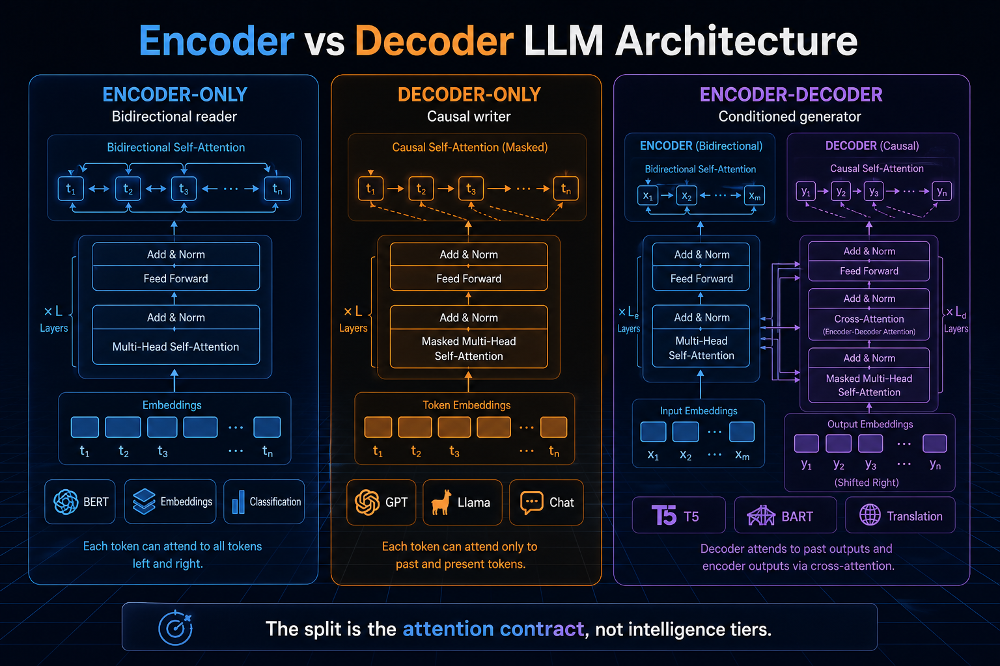
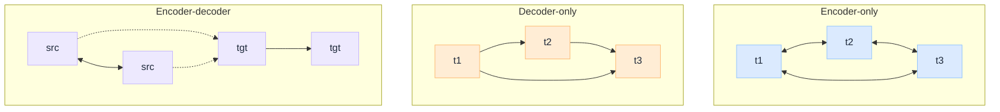
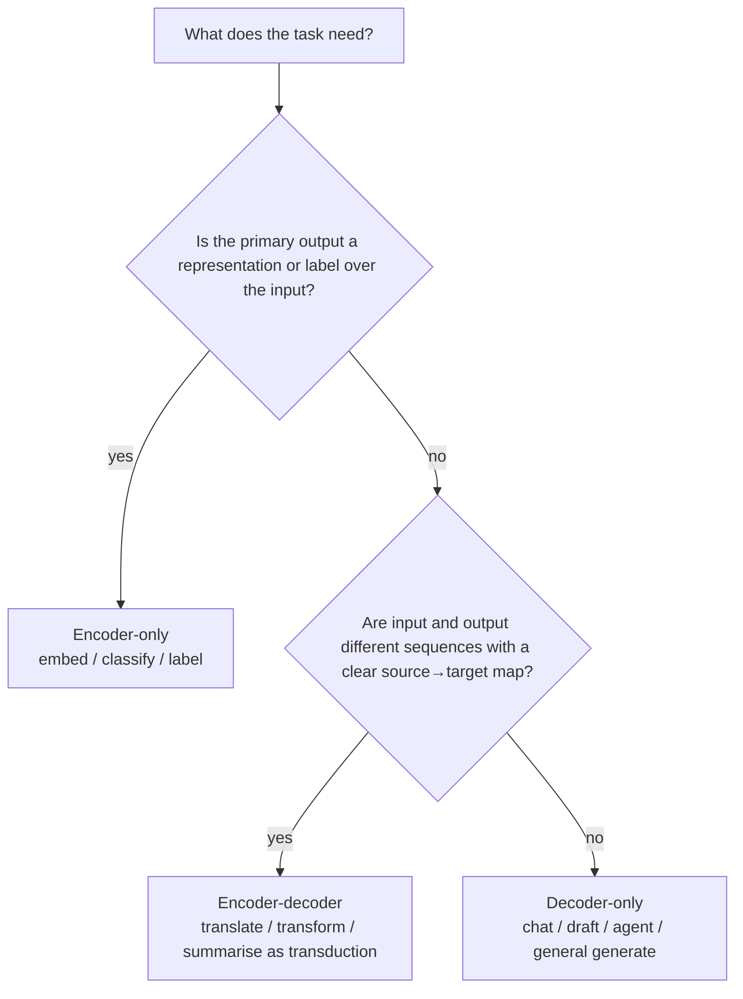

 

# Encoder vs Decoder LLM Architecture: How Attention Direction Decides the Job

*Say "transformer" in most rooms and people picture GPT: a model that writes the next token. That is one member of the family. BERT is a transformer too. So is T5. They do not fail at chat because they are weaker. They were built under a different rule about which tokens a position is allowed to see.*

The rule is called the attention contract, and it is fixed when you choose the architecture, long before training starts. [Before Training an LLM](/insights/before-training-an-llm) lists it as the model-type dial. Flip that dial and you change what the model is *for*, not how smart it is.

This is a **decision guide**: three architecture families, one comparison matrix, and a rule for sending understand / generate / transform work to the right stack.

:::tip[THE CLAIM]
**Encoder-only, decoder-only, and encoder-decoder are three attention contracts, not three intelligence tiers.** Bidirectional attention makes a reader. Causal attention makes a writer. Cross-attention makes a conditioned translator. Pick by what the task needs to see, not by which family currently tops a chat leaderboard.
:::

<!-- truncate -->

## The bottom line first

- **The split is visibility, not depth.** Same block shape (attention + FFN + residual). Different masks decide which positions may attend to which.
- **Encoder-only is a bidirectional reader.** Every token sees the full sequence. Best for understanding: embeddings, classification, span labelling. It does not generate open-ended text.
- **Decoder-only is a causal writer.** Each token sees only the past. Best for generation, chat, agents, and most of what people now mean by "LLM".
- **Encoder-decoder is a conditioned generator.** A full-context encoder feeds a causal decoder through cross-attention. Best when input and output are different sequences (translate, summarise, structured transform).
- **Chat defaults to decoder-only for a reason.** One stack, one training objective (next token), one serving path (prefill then decode). That simplicity won the platform war.
- **Production systems often need more than one family.** Embedding and retrieval stacks still lean encoder (or encoder-style embedding models). Generation stacks lean decoder. Do not force one architecture to do both jobs badly.

## What all three share

Before the differences, the floor. If you have read the lifecycle series, this is familiar: [How LLM Works Under the Hood](/insights/how-llm-works-under-the-hood), [During Training an LLM](/insights/during-training-an-llm), and [After Training an LLM](/insights/after-training-an-llm).

| Shared trait | Consequence |
| --- | --- |
| **Transformer block** | Attention mixes information across positions; the FFN transforms each position; residuals and norms keep the stack trainable |
| **Token embeddings + positions** | Text starts as discrete tokens mapped into vectors; order comes from a positional scheme |
| **Learned weights, frozen at inference** | Architecture sets the *shape*. Training fills the values. Inference does not retrain |
| **Attention is the mixing operator** | The only structural difference that matters for this article is *which* positions attention is allowed to mix |

The last row is the whole story. Everything else (width, depth, vocabulary, positional scheme) is a dial you can turn inside any family. The mask is the family.

---

## The attention contract

Attention answers one question for every position: **given my query, which other positions am I allowed to read?** The three families answer that question differently.

 

| Family | Self-attention mask | Cross-attention | What a position can see |
| --- | --- | --- | --- |
| **Encoder-only** | Bidirectional (full) | None | Every token in the input, left and right |
| **Decoder-only** | Causal (lower triangular) | None | Only tokens at or before the current position |
| **Encoder-decoder** | Bidirectional on source; causal on target | Yes: target queries source | Source: full context. Target: past targets plus the encoded source |

That table is the decision surface. Everything below is consequence.

:::tip[TAKEAWAY]
**If you remember one diagram, remember the mask.** Bidirectional = reader. Causal = writer. Cross-attention = writer that can look at a separate encoded input.
:::

---

## Encoder-only

### What it is

A stack of transformer blocks with **full self-attention**. Every token representation is refined using the entire sequence. There is no left-to-right generation loop. The model emits a representation (or a classification head on top of one), not an open-ended token stream.

Classic lineage: BERT, RoBERTa, encoder towers used for sentence and document embeddings. The training objective is usually masked language modelling or a similar fill-in-the-blank task: hide some tokens, predict them from both sides. That objective only makes sense if the mask is bidirectional.

### How it behaves at inference

One forward pass over the input. No autoregressive decode. Latency is roughly a function of input length and model size, not of how many tokens you want to "say back". That is why embedding APIs feel different from chat APIs: they are not running the same serving loop.

### Where it wins

| Job | Why the encoder fits |
| --- | --- |
| **Dense embeddings for retrieval** | You need a fixed vector that summarises the whole passage. Bidirectional context is the point. See [RAG Is Not a Database](/insights/rag-is-not-a-database) |
| **Classification and ranking** | Intent, toxicity, topic, relevance: one label (or score) over a full sequence |
| **Token / span labelling** | NER, PII spotting, extractive QA spans: each position needs left *and* right context |
| **Semantic similarity** | Pair or set scoring where neither side is "generating" the other |

### How it fails

Ask it to write a paragraph, hold a multi-turn conversation, or call tools in a loop, and you are fighting the architecture. You can bolt a generation head onto an encoder, but you have left the design centre. Decoder-only (or encoder-decoder) owns open-ended text.

---

## Decoder-only

### What it is

A stack of transformer blocks with a **causal mask**. Position *t* may attend to positions `1…t` and must not see the future. Training is next-token prediction over that constraint. At inference the model is a loop: condition on what has been written so far, sample (or argmax) the next token, append, repeat.

Classic lineage: GPT, Llama, Claude-class, Gemini-class chat models, and almost every model people mean when they say "LLM" in 2026. [Aligning an LLM](/insights/aligning-an-llm) is largely a story about this family: SFT and preference tuning on top of a causal base.

### How it behaves at inference

Two phases, covered in [After Training an LLM](/insights/after-training-an-llm):

1. **Prefill:** run the prompt through the stack once, build the KV cache.
2. **Decode:** emit tokens one by one, each step attending to the cached past.

Cost and latency are dominated by how many tokens you ask it to write (and, for long prompts, by prefill). Reasoning-style models still sit in this family; they spend more decode tokens before the visible answer. The architecture did not change. The inference budget did.

### Where it wins

| Job | Why the decoder fits |
| --- | --- |
| **Chat and assistants** | The product *is* sequential token generation conditioned on a growing context |
| **Agents and tool loops** | Plan → act → observe is naturally a continuing token stream |
| **Open-ended drafting** | Summaries, emails, code, explanations: output length is unknown up front |
| **In-context learning** | Put examples in the prompt; the causal model continues in that style |

### How it fails

Pure decoder-only is a compromise for pure understanding jobs. You *can* embed with a decoder (mean-pool hidden states, use a dedicated embedding fine-tune), and many teams do. You still pay for a causal inductive bias that was designed for writing, not for symmetric sentence representation. When retrieval quality is the product, an encoder-style embedding model is usually the sharper tool.

### Why it became the default "LLM"

Three practical reasons beat elegance:

| Reason | Effect |
| --- | --- |
| **One objective scales** | Next-token prediction on internet-scale text is simple, stable, and data-hungry in a way that rewarded bigger runs |
| **One stack to serve** | No separate encoder tower, no cross-attention path, one KV-cache story |
| **One interface for products** | Prompt in, tokens out covers chat, code, tools, and (with enough scale) a surprising amount of "understanding" |

Encoder-decoder is often a better *fit* for translation-shaped jobs. Decoder-only won because it was a better *platform*.

:::tip[TAKEAWAY]
**Decoder-only won the platform war, not the fit contest.** Prefer it as the default generator. Reach for an encoder when the job is a representation, not a reply.
:::

---

## Encoder-decoder

### What it is

The original Transformer shape from the 2017 paper: an **encoder** that reads the source with bidirectional attention, and a **decoder** that generates the target with causal self-attention plus **cross-attention** into the encoder states.

Classic lineage: the original attention paper's machine translation model, BART, T5, and many specialised seq2seq systems. Training typically looks like: corrupt or present a source sequence, generate a target sequence (translation, denoising, span reconstruction, instruction → response).

### How it behaves at inference

1. Encode the full source once (bidirectional).
2. Decode the target autoregressively, each step attending to past target tokens *and* the encoded source.

You get a clean separation: input representation vs output generation. That separation is exactly what translation and many document transforms want.

### Where it wins

| Job | Why encoder-decoder fits |
| --- | --- |
| **Translation** | Source and target are different sequences, often different languages |
| **Document → structured output** | Long source, constrained target schema |
| **Summarisation as transduction** | Treat summary as a target sequence conditioned on a full pass over the source |
| **Specialised seq2seq** | When you control both sides of the pair and want an explicit encode-then-decode contract |

### How it fails

As a general chat platform it is heavier: two towers, cross-attention, a more awkward unified pre-training story than pure next-token. Most frontier assistants absorbed the "condition on a long prompt" idea into a single decoder context window instead. Encoder-decoder remains strong where input and output are cleanly asymmetric and you want that asymmetry in the architecture, not only in the prompt template.

---

## Side-by-side comparison

| Dimension | **Encoder-only** | **Decoder-only** | **Encoder-decoder** |
| --- | --- | --- | --- |
| **Attention** | Bidirectional self-attention | Causal self-attention | Bidirectional encoder + causal decoder + cross-attention |
| **Training objective (classic)** | Masked LM / contrastive or classification heads | Next-token prediction | Seq2seq (translate, denoise, span reconstruct) |
| **Inference shape** | Single forward pass → representation or label | Prefill + autoregressive decode | Encode source once + autoregressive decode |
| **Natural output** | Vectors, labels, spans | Open-ended tokens | Open-ended tokens conditioned on a source |
| **Best at** | Understand, embed, classify | Chat, generate, agents | Transform source → target |
| **Awkward at** | Open-ended generation | Symmetric sentence embeddings (unless specialised) | Being the one model for every product surface |
| **Examples** | BERT, RoBERTa, many embedding models | GPT, Llama, most chat APIs | T5, BART, classic MT Transformers |

Read the "Best at" row as the router. The rest of the table explains why that row is stable.

---

## How to choose

Route by the **shape of the task**, not by brand familiarity.

 

| Signal in the requirement | Prefer |
| --- | --- |
| "Give me a vector / score / tag for this text" | Encoder-only |
| "Turn this document into that language / schema / shorter form" as a dedicated pipe | Encoder-decoder |
| "Talk, draft, plan, call tools, continue from a prompt" | Decoder-only |
| "One model for the whole product" and generation dominates | Decoder-only, plus a separate embedding model if retrieval matters |
| "Retrieval quality is the product" | Dedicated encoder-style embeddings beside whatever generates the answer |

A common enterprise pattern is already this split, even when teams do not name it: **encoder (or embedding model) for find, decoder for speak**. That is the right instinct. See [RAG Is Not a Database](/insights/rag-is-not-a-database) for why retrieval is its own stage.

---

## What this means for production systems

Architecture choice leaks into serving, cost, and ownership boundaries.

| Concern | Encoder-shaped path | Decoder-shaped path |
| --- | --- | --- |
| **Serving loop** | Batchable forward passes, embedding caches, ANN indexes | Prefill/decode, KV cache, streaming tokens |
| **Scaling lever** | Index and batch size; re-embed on model change | Context length, decode throughput, speculative decoding |
| **Failure mode** | Bad vectors → silent retrieval miss | Fluent wrong tokens → visible hallucination |
| **Team ownership** | Often search / platform / data | Often product / agent / application |

Mixing them without naming the boundary is how platforms get expensive. A chat model used as a generic embedder, or an encoder asked to "just write the email", both work in a demo and both tax you in production.

For the broader lifecycle context (why the blueprint is fixed before training, why inference is read-only), stay with the series that starts at [How LLM Works Under the Hood](/insights/how-llm-works-under-the-hood).

---

## Common mistakes

| Mistake | Why it hurts |
| --- | --- |
| **Treating BERT and GPT as the same tool** | Same block family, opposite attention contracts. Shared vocabulary does not mean shared job |
| **Using a chat model as your only embedder by default** | Convenient, often weaker than a model trained for bidirectional sentence representation |
| **Expecting an encoder to chat** | No causal generation loop; you will reinvent a decoder badly |
| **Ignoring encoder-decoder for true transduction** | Prompting a decoder to "translate" works until you need a dedicated, evaluable source→target system |
| **Buying one frontier decoder for every lane** | Retrieval, classification, and generation want different contracts; one invoice is not one architecture |
| **Confusing "decoder-only won" with "encoders are obsolete"** | Encoders (and encoder-style embedding models) still own large parts of search and classification |

## Key takeaways

- **Pick by the attention contract.** Bidirectional for understand, causal for generate, cross-attention when source and target are separate sequences.
- **Encoder-only emits representations and labels**, not open-ended chat.
- **Decoder-only is the default LLM platform** because one stack and one objective cover most product surfaces.
- **Encoder-decoder remains the right shape for asymmetric transform jobs**, even if chat products absorbed many of those jobs into long-context decoders.
- **Production systems usually need both a reader and a writer.** Embed/find with an encoder-shaped model; speak/act with a decoder.
- **Do not rank the families on a chat benchmark.** Rank them on whether the task needs full context, a continuing write, or an explicit source→target map.

:::info[Builds on]
[How LLM Works Under the Hood](/insights/how-llm-works-under-the-hood) · [Before Training an LLM](/insights/before-training-an-llm) · [During Training an LLM](/insights/during-training-an-llm) · [Aligning an LLM](/insights/aligning-an-llm) · [After Training an LLM](/insights/after-training-an-llm) · [RAG Is Not a Database](/insights/rag-is-not-a-database)
:::
