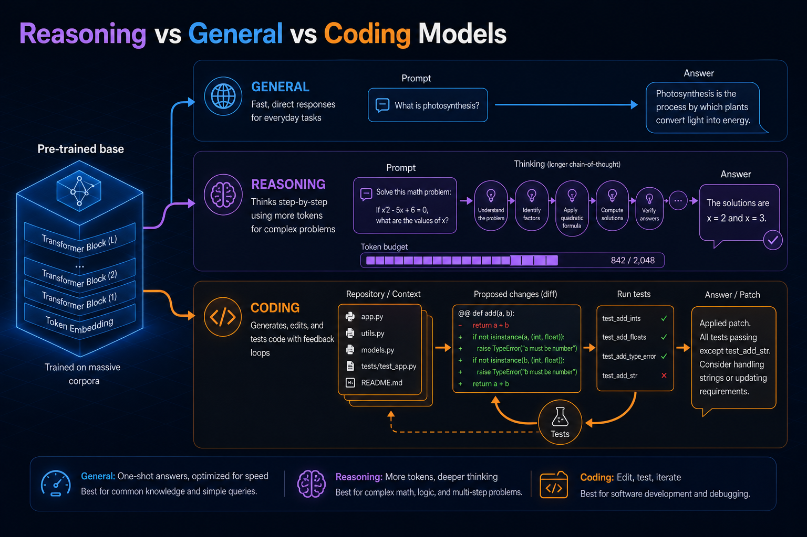
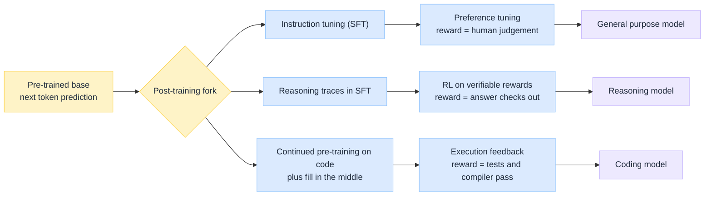
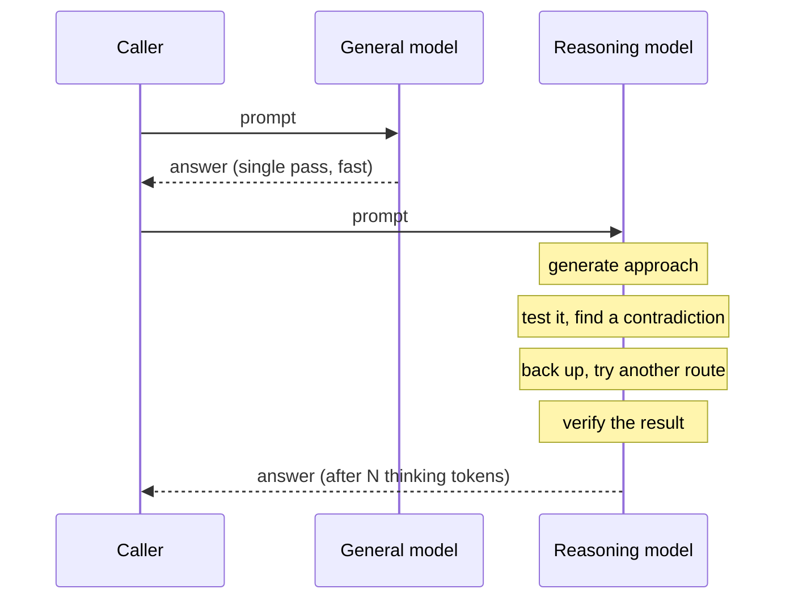
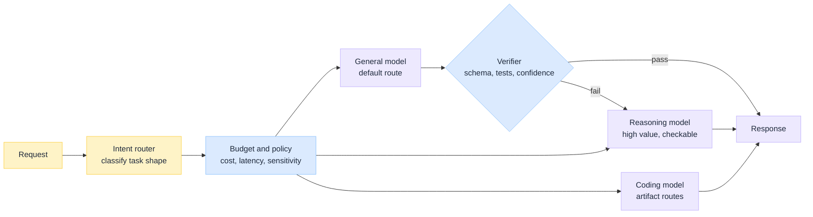

import Details from '@theme/Details';
import Tabs from '@theme/Tabs';
import TabItem from '@theme/TabItem';

<br/>


# Reasoning vs General vs Coding Models: How They Differ

*Open the model picker in any provider console and you are offered a general model, a reasoning model, and a coding model, usually at three different prices. The naming suggests three tiers of intelligence. It is not that at all.*

All three start life as the same thing: a transformer trained to predict the next token over a very large corpus. Nothing in that pre-training run says "be a reasoner" or "be a coder". The differences arrive later, and they arrive in exactly three places: **what data the model sees after pre-training, what signal it is rewarded against, and how many tokens it is allowed to spend before it answers you.**

This is a **decision guide**. The goal is not to rank the families but to give you a rule for sending each piece of work to the right one.

:::tip[THE CLAIM]
**These are not three tiers of the same model. They are three different bets about where compute should go.** General models optimise the single-pass reply and are rewarded by human preference. Reasoning models are rewarded by verifiable outcomes and buy accuracy with test-time tokens. Coding models are specialised on code data and rewarded by artifacts that actually compile and pass. Route by the shape of the task, not by the benchmark headline.
:::

<!-- truncate -->

## The bottom line first

- **Same architecture, same base.** All three are transformers doing next-token prediction over frozen weights at inference. The family label describes post-training and serving behaviour, not a different machine.
- **The sharpest divide is the reward signal.** General models are tuned against *human preference*, which is subjective. Reasoning models are tuned against *checkable outcomes*, which is not. That single difference explains almost everything downstream.
- **Reasoning models spend tokens to buy accuracy.** The long internal chain is generated output, billed and timed like any other output. You are paying for compute at inference instead of at training.
- **Coding models are a data and format specialisation**, not a reasoning one. Code-heavy corpora, fill-in-the-middle training, repository-scale context, and diff and tool-call formats the rest of your pipeline can apply mechanically.
- **The wrong default is expensive in both directions.** A reasoning model on a classification task burns money and latency for nothing. A general model on a multi-step derivation returns a fluent wrong answer at speed.
- **Design for routing, not for a winner.** A production system runs all three behind a router with a token budget per route, and escalates only when a cheap answer fails a check.

## What all three share

Before the differences, the floor they stand on. If you have read the lifecycle series, this is familiar ground: [How LLM Works Under the Hood](/insights/how-llm-works-under-the-hood) and [During Training an LLM](/insights/during-training-an-llm) describe the pre-training run that produces the base every family is cut from.

| Shared trait | Consequence |
| --- | --- |
| **Transformer, next-token objective** | None of them "does logic" natively. Every behaviour is a distribution over tokens |
| **Pre-trained on a broad corpus** | The world knowledge in a coding model came from the same general internet-scale data |
| **Weights frozen at inference** | No family learns from your prompt. See [After Training an LLM](/insights/after-training-an-llm) |
| **Prefill then decode** | The same two-phase inference loop and the same KV cache economics apply to all three |
| **Context window is the working memory** | Nothing outside the window exists, whatever the label on the model says |

That last two rows matter more than teams expect. A reasoning model does not have a private scratchpad somewhere. Its "thinking" occupies the same context window and the same decode loop as its answer.

---

## Where they diverge: the post-training fork

One base model, three post-training paths. [Aligning an LLM](/insights/aligning-an-llm) covers the general path in depth. The other two branch from the same point.


<br/>

Read the middle column as the answer to one question: **who grades the model?**

| Family | Grader | What that grader can and cannot see |
| --- | --- | --- |
| **General** | A human, or a reward model trained on human choices | Sees tone, helpfulness, format, and refusal behaviour. Cannot reliably see whether step four of a derivation was valid |
| **Reasoning** | A checker: the arithmetic result, the proof, the unit test, the parser | Sees only whether the final answer is right. Blind to style, which is why raw reasoning output often reads badly |
| **Coding** | A compiler, a test suite, a linter, a diff that applies | Sees whether the artifact works in a repository, which is a narrower and much harder target than "looks like code" |

A grader that can only judge preference produces a model that is very good at *seeming* right. A grader that runs the answer produces a model that is willing to spend effort *being* right. That is the whole story in one line.

---

## General purpose models

### What they are

The default. A base model taken through supervised fine-tuning on instruction and response pairs, then preference tuning (RLHF or DPO) so its outputs match what human raters prefer. Breadth is the design goal: summarise, extract, draft, translate, classify, converse, answer.

### How they behave at inference

One pass. The prompt is prefilled, tokens are decoded, and the first tokens the model emits are already part of the answer. There is no deliberation phase, and latency is close to a linear function of output length. Cost is predictable enough to put in a budget spreadsheet.

You can ask a general model to think step by step, and it will produce visible intermediate steps. This helps, but it is a prompting technique layered on a model that was never rewarded for the correctness of those steps. It looks like reasoning. It is imitation of the shape of reasoning drawn from the training corpus.

### Where they win

Anything with a wide, shallow task surface, especially where the output is judged by a human rather than a checker. Summaries, rewrites, extraction into a schema, routing decisions, tone-sensitive drafting, conversational turns. The overwhelming majority of enterprise LLM calls are this shape.

### How they fail

Fluently. A general model asked to do a five-step calculation will produce a confident, well-formatted, structurally plausible answer that is wrong at step three, and it will not flag the fact. Nothing in its training rewarded catching that.

:::tip[TAKEAWAY]
**The general model is the right default for anything a human will read and judge.** It stops being the right choice the moment correctness has a definition sharper than "sounds right".
:::

---

## Reasoning models

### What they are

A model post-trained with reinforcement learning where the reward comes from **verifiable outcomes**. Did the maths problem produce the correct number. Did the generated program pass the tests. Does the logical answer match the key. Because the grader is mechanical, training can run at scale without a human in the loop, and the model can be pushed hard toward whatever behaviour improves the score.

The behaviour that improves the score turns out to be deliberation: generating a long intermediate chain before committing, exploring an approach, noticing a contradiction, backing up, and trying another route. Reasoning models are not built with a different architecture. They are built by rewarding the base model for spending tokens productively before answering.

### The critical mechanical detail

The "thinking" is **generated tokens**. It occupies the context window, runs through the same decode loop, takes wall-clock time, and appears on your invoice. Many providers hide the chain from the response body while still billing it as output.

<Details summary="What a reasoning call actually costs, compared to a general call">

Two calls, same question, very different token accounting:

```text
General model
  input:      420 tokens
  output:     180 tokens   (the answer)
  billed:     600 tokens
  latency:    ~2s

Reasoning model
  input:      420 tokens
  output:   4,900 tokens   (4,700 thinking + 200 answer)
  billed:   5,320 tokens
  latency:    ~40s
```

The answer you see may be shorter than the general model's. The bill is an order of magnitude larger, because the deliberation is output too.

</Details>

This gives you a dial that general models do not have: **the thinking budget**. Allow more tokens and accuracy on hard, checkable problems tends to improve. Allow fewer and you get a faster, cheaper, less reliable answer. Compute has moved from training time to inference time, and it is now a per-request decision you own.


<br/>

### Where they win

Problems with a **search structure and a checkable answer**. Multi-step maths and quantitative analysis. Constraint satisfaction and scheduling. Debugging a failure with several interacting causes. Planning a multi-step agent trajectory before execution. Reviewing a complex change for logical, not stylistic, defects. Anywhere a wrong answer is expensive and a slow answer is tolerable.

### How they fail

| Failure | What it looks like |
| --- | --- |
| **Overthinking** | Four thousand thinking tokens spent on "which category is this ticket", at fifty times the cost of the right answer from a general model |
| **Latency variance** | The same route returns in 5 seconds or 90 seconds depending on how hard the model finds a particular input, which breaks user-facing timeouts |
| **Grounding is untouched** | Deliberation improves *derivation*, not *knowledge*. A reasoning model with no retrieval will reason carefully to a confidently wrong fact. See [RAG Is Not a Database](/insights/rag-is-not-a-database) |
| **The chain is not an audit trail** | The visible reasoning is generated text, not a faithful log of the computation that produced the answer. Do not treat it as evidence in a regulated control |

That last row is the one that catches governance teams. A reasoning trace is persuasive, legible, and not a guarantee of anything. It is an artifact of the same next-token process as the answer.

:::tip[TAKEAWAY]
**Reasoning models convert tokens into accuracy, and only on problems where accuracy has a definition.** If your task has no checkable notion of correct, you are paying the deliberation premium and receiving a longer general answer.
:::

---

## Coding models

### What they are

A base model given **continued pre-training on code-heavy data**: repositories, commit histories, issues, pull requests, documentation, and notebooks. Then post-trained on the formats and feedback specific to software work. The specialisation is in data and interface, not in a new reasoning capability.

### The four things that actually change

| Change | Why it matters |
| --- | --- |
| **Fill-in-the-middle objective** | Alongside left-to-right prediction, the model trains on a prefix and a suffix with a hole in between. This is what real editing looks like, and it is why a code model completes inside a function competently while a general model wants to restart it |
| **Repository-scale context** | Long windows and training on multi-file inputs, so imports, adjacent modules, and type definitions are usable context rather than noise |
| **Structured output formats** | Trained to emit unified diffs, patch blocks, and tool or function calls that a harness can apply mechanically, instead of prose with code inside it |
| **Execution feedback** | Rewarded against compilers, test suites, and linters. The target is not "plausible code" but "code that runs" |

<Details summary="Fill in the middle, the objective a general model never trained on">

Standard pre-training predicts forward only:

```text
def parse_config(path):
    with open(path) as f:
        ▮ predict everything from here
```

Fill in the middle gives the model both sides and asks for the gap:

```text
<PREFIX>
def parse_config(path):
    with open(path) as f:
<MIDDLE>  ▮ predict only this
<SUFFIX>
    return validated
```

Editing existing code is almost always a middle problem, which is why this objective changes the practical feel of a coding model far more than its parameter count does.

</Details>

### Where they win

In-editor completion and inline edits. Refactors across several files. Translating between languages or framework versions. Generating tests against existing code. Any agentic loop where the model must emit a tool call or a patch that a harness applies without a human interpreting it.

### How they fail

Local competence, global drift. Coding models produce idiomatic code that compiles and satisfies the literal request while missing the intent, and they degrade on tasks outside their specialisation, including the plain-language explanation of what they just wrote. They are also the family most exposed to context limits, because a repository is always larger than the window.

### The blurring frontier

The clean three-way split is an increasingly leaky abstraction. The strongest coding models are now reasoning-trained, because "did the test pass" is the ideal verifiable reward, and code was one of the first domains where reasoning RL worked at scale. Treat the families as **three axes of specialisation** that a given released model may combine, rather than three mutually exclusive boxes.

:::tip[TAKEAWAY]
**A coding model is a data and interface specialisation, not a smarter model.** You choose it when the output must land inside a repository as a mechanically applicable artifact.
:::

---

## Side-by-side matrix

| | **General** | **Reasoning** | **Coding** |
| --- | --- | --- | --- |
| **Post-training signal** | Human preference (RLHF, DPO) | Verifiable outcome (RL on checkable answers) | Execution feedback (compile, tests, lint) |
| **Optimised for** | Helpfulness across breadth | Correctness on hard, checkable problems | Working artifacts inside a repository |
| **Token spend per answer** | Answer only | Answer plus a large hidden chain | Answer, often long, plus tool calls |
| **Latency profile** | Predictable, linear in output | Variable, sometimes by an order of magnitude | Moderate, dominated by context size |
| **Cost shape** | Low and stable | High and input-dependent | Moderate, driven by large prompts |
| **Context pressure** | Prompt sized | Chain competes with prompt for the window | Repository never fits, retrieval required |
| **Characteristic failure** | Fluent wrong answer at step three | Overthinks trivial work, still ungrounded | Compiles, passes, misses the intent |
| **Best fit** | Summarise, extract, classify, converse | Derive, plan, debug, decide under constraints | Complete, refactor, patch, tool-call |
| **Worst fit** | Multi-step derivation | High-volume classification | Open-ended prose and business narrative |

---

## What they actually do differently at inference

Same prompt, three families, three different things happening inside the decode loop. Click through the tabs.

<Tabs groupId="model-family">
  <TabItem value="general" label="General" default>

1. Prefill the prompt, build the KV cache.
2. Decode the answer directly. The first emitted token is already answer content.
3. Stop at the end of the response.

Compute spent: one pass. What you can tune: temperature, max output, and the prompt. Accuracy is essentially fixed at call time.

  </TabItem>
  <TabItem value="reasoning" label="Reasoning">

1. Prefill the prompt.
2. Decode a long internal chain: propose, test, contradict, revise. Often thousands of tokens, usually hidden from the response body.
3. Decode the final answer conditioned on that chain.
4. Stop, having billed the chain as output.

Compute spent: as much as the budget allows. What you can tune: the **thinking budget**, which is a genuine accuracy dial on checkable problems and pure waste on everything else.

  </TabItem>
  <TabItem value="coding" label="Coding">

1. Prefill a large, assembled context: the open file, its neighbours, type definitions, retrieved repository fragments.
2. Decode a structured artifact, typically a diff or a tool call rather than prose.
3. A harness applies it, runs tests, and feeds failures back as a new turn.

Compute spent: dominated by prefill, not decode. What you can tune: **what you put in the context**, which matters more than any sampling parameter.

  </TabItem>
</Tabs>

The practical consequence: these three families stress completely different parts of your serving budget. General models are decode-bound and cheap. Reasoning models are decode-bound and expensive. Coding models are prefill-bound, which means your retrieval and context assembly determine both their cost and their quality.

---

## Choosing per task

The honest heuristic: **start general, escalate to reasoning only when a check fails, and switch to coding when the output must be applied rather than read.**

| Task | Family | Why |
| --- | --- | --- |
| Summarise a document, draft an email | **General** | Judged by a human, single pass, latency matters |
| Extract fields into a schema | **General** | High volume, shallow, checkable by validation rather than deliberation |
| Classify and route an incoming request | **General** | The cheapest correct answer, and deliberation adds nothing |
| Multi-step quantitative analysis | **Reasoning** | Errors compound silently and the answer has a right value |
| Root-cause a failure with interacting causes | **Reasoning** | Requires hypothesis, test, and backtrack, which is exactly what the RL rewarded |
| Plan an agent trajectory before execution | **Reasoning** | A bad plan executed by tools is far more expensive than the thinking tokens |
| Decide under hard constraints (scheduling, allocation) | **Reasoning** | Search structure with a verifiable feasible answer |
| In-editor completion and inline edits | **Coding** | Fill in the middle is the trained objective |
| Cross-file refactor, framework migration | **Coding** | Repository context and diff output formats |
| Generate tests for existing code | **Coding** | Execution feedback is the native reward signal |
| Explain a codebase to a non-engineer | **General** | The artifact is prose, not code, whatever the subject matter |

Real workloads mix these in a single user action. A support agent might classify with a general model, retrieve with an embedding model, deliberate over an ambiguous entitlement with a reasoning model, and never touch a coding model at all. That is a healthy design.

---

## Routing them in one system

Once you accept there is no winner, the architecture question becomes concrete: something must decide, per request, which family gets the work. That is an intent router. See [What Is an Intent Router](/insights/what-is-intent-router) and [Design an Intent Router](/insights/design-intent-router).


<br/>

| Design point | What to get right |
| --- | --- |
| **Escalation, not selection** | Run the cheap model first and promote to reasoning when a verifier fails. Most traffic never escalates, and you pay the premium only where it earns its keep |
| **A budget per route** | Thinking tokens are unbounded by default. Cap them per route, and make the cap a product decision rather than a provider default |
| **Timeouts sized per family** | A p99 that fits a general model will cut off a reasoning model mid-chain. Different routes need different deadlines and different user-facing affordances |
| **Measure cost per resolved task** | Cost per token makes reasoning models look indefensible and general models look free. Cost per *correct outcome* is the number that decides the route |
| **Watch the escalation rate** | A rising escalation rate is the earliest signal that your prompts, your retrieval, or your default model have drifted |
| **Hosting follows the family** | Reasoning routes have the widest cost and latency spread, which changes the build versus buy maths. See [Model Hosting Options for Regulated Industries](/insights/model-hosting-options-regulated-industries) |

Abstract the family behind your own route names rather than provider model IDs. Families are converging and model names churn every few months. A route called `analysis.high-assurance` survives a provider swap. A route called `o-series-preview` does not.

---

## Common mistakes

| Mistake | Why it hurts |
| --- | --- |
| **Reasoning model as the default** | You pay ten to fifty times more and add tens of seconds of latency on traffic that was never hard |
| **Expecting reasoning to fix hallucination** | Deliberation improves derivation, not knowledge. Ungrounded input still produces confident invention |
| **Treating the chain of thought as an audit trail** | It is generated text, not a faithful execution log, and it will not survive contact with a regulator who asks what the decision was based on |
| **Judging families on one leaderboard** | Benchmarks are weighted toward checkable problems, which is exactly the terrain reasoning models were trained on. It says nothing about your summarisation route |
| **Coding model for anything technical** | The specialisation is code artifacts. Architecture narrative and stakeholder explanation are general model work |
| **Ignoring the thinking budget** | Unbounded deliberation turns one anomalous input into a cost and latency incident |
| **Ignoring context assembly for coding routes** | Coding models are prefill-bound. What you retrieve into the window sets both quality and cost, and no sampling parameter compensates |
| **Hardcoding provider model IDs into application code** | The families are converging and the names change quarterly. Route names last, model IDs do not |

## Key takeaways

- **The family label describes post-training and serving behaviour, not a different machine.** Same transformer, same frozen weights, same decode loop.
- **Pick by who can grade the task.** A human judging the output means general. A checker judging the answer means reasoning. A harness applying the artifact means coding.
- **Reasoning buys accuracy with billed, timed tokens.** Treat the thinking budget as an explicit product decision with a cap per route.
- **Coding models are prefill-bound**, so invest in context assembly and retrieval, not sampling parameters.
- **Escalate rather than select.** Cheap model first, verifier second, reasoning model only on failure, and measure cost per resolved task.
- **Name routes, not models.** The families are converging fast, and your abstraction is what survives the next release cycle.

:::info[Builds on]
[How LLM Works Under the Hood](/insights/how-llm-works-under-the-hood) · [During Training an LLM](/insights/during-training-an-llm) · [Aligning an LLM](/insights/aligning-an-llm) · [After Training an LLM](/insights/after-training-an-llm) · [What Is an Intent Router](/insights/what-is-intent-router) · [Design an Intent Router](/insights/design-intent-router) · [Model Hosting Options for Regulated Industries](/insights/model-hosting-options-regulated-industries)
:::
