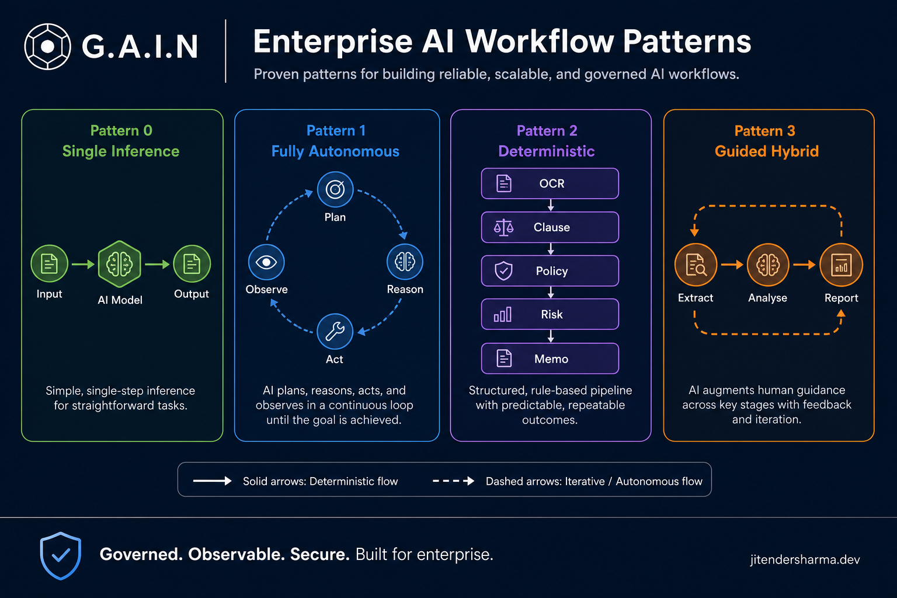
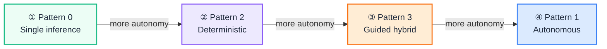
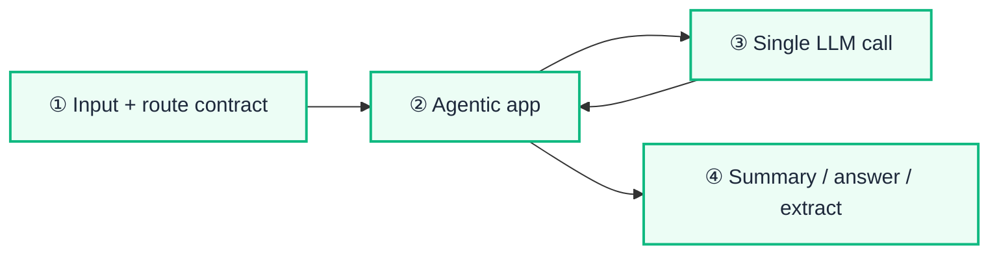
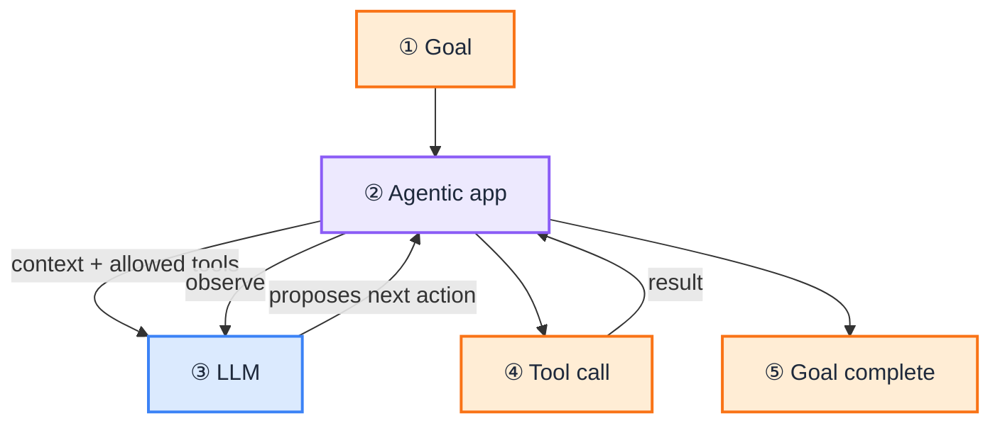
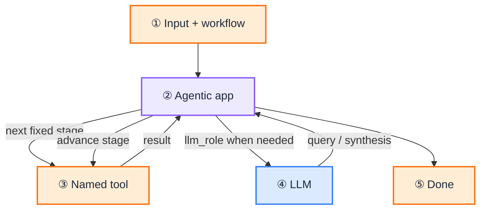
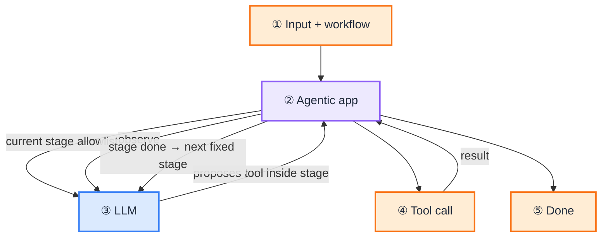
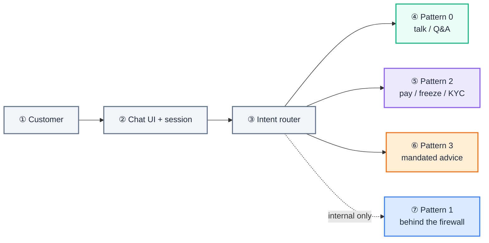
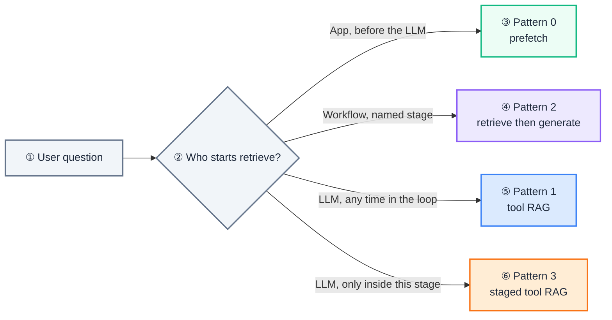
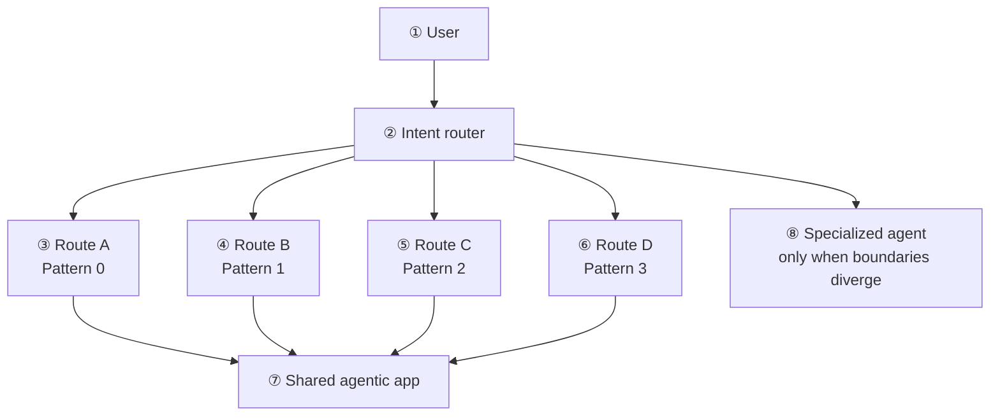

import Tabs from '@theme/Tabs';
import TabItem from '@theme/TabItem';
import Details from '@theme/Details';

<br/>



# Enterprise AI Workflow Patterns: Autonomy vs Control

When designing enterprise AI systems, the hard question is not "should we use an agent?" It is **how much autonomy the model gets versus how much control the business process requires**. Four patterns cover most production designs, starting with a baseline that is **not an agent at all**: a single inference call through the agentic service. Pick wrong and you either overbuild an agent runtime for summarize/Q&A, lose auditability on an open loop, or waste a flexible model on a fixed pipeline.

This is a **decision guide**: Pattern 0 (single inference), Pattern 1 (fully autonomous), Pattern 2 (deterministic), and Pattern 3 (guided hybrid), with comparison criteria and JSON-shaped contracts. The reference design is the [Agents Blueprint](/blueprints/agents-blueprint). Route row fields live in [Route contract reference](/playbooks/agents/intent-router/route-contract-reference). It also builds on [How to Design an Intent Router](/insights/design-intent-router) and [Policy-Governed Agent Runtime](/insights/policy-governed-agent-runtime).

:::tip[THE CLAIM]
**Not every LLM feature is an agent. Start at single inference.** Escalate only when you need tools, fixed multi-step process, or staged autonomy. Fix the business stages when process control matters; give the LLM autonomy inside each stage only when exploration is the product.
:::

<!-- truncate -->

## The bottom line first

- **Four patterns, one axis:** who decides the next step (nobody beyond one call, the LLM, the workflow designer, or both at different layers).
- **Pattern 0** is one LLM call through the [agentic app](/playbooks/governance/runtime/boundary/agentic-app) (summarize, Q&A, extract). No tool loop. Not an agent.
- **Pattern 1** fits research, coding, and investigation when the path is unknown.
- **Pattern 2** fits payments, KYC, claims, and any flow where order and side effects must be fixed.
- **Pattern 3** fits contract review, regulatory analysis, and enterprise copilots: fixed stages, flexible tools inside a stage.
- **Governance lives in contracts and checkpoints**, not in hoping the prompt "behaves." See [Route contract reference](/playbooks/agents/intent-router/route-contract-reference) for the row fields.
- **RAG is orthogonal:** same retrieve action on every pattern. `deterministic_prefetch` vs `tool` only changes who starts it. See [RAG across patterns](#rag-same-action-who-starts-retrieve).
- **Memory is route policy + session state**, not a workflow step; long-term facts are retrieved, not stuffed into the prompt.
- **Ingress (UI, API, event) is orthogonal** to Patterns 0-3; pick the pattern for autonomy vs control, then choose how the route starts and resumes.
- **Default is one agentic app with many routes** (including multiple autonomous ones). Split into another agent or agentic app only when execution boundaries diverge.
- **Regulated default (bank):** Pattern 0 for talk and Q&A; Pattern 2 for money movement and account changes; Pattern 3 for mandated-process advice; Pattern 1 stays behind the firewall unless the manifest is read-only and the budget is tiny.

## The autonomy vs control spectrum



<br/>

| Layer | Pattern 0 | Pattern 1 | Pattern 2 | Pattern 3 |
| --- | --- | --- | --- | --- |
| Business process | One step | Open | Fixed | Fixed |
| Tool sequence | None | LLM chooses | Designer chooses | Fixed stages; LLM chooses inside a stage |
| Is it an agent? | No | Yes | Workflow + LLM steps | Hybrid agent |
| Primary risk | Thin context / hallucination | Unpredictable path | Brittleness | Extra architecture |

Use the tabs under each pattern. Every pattern has **two examples**. Each example uses **Route** plus the artifacts it references (**Workflow**, **Manifest**, **Prompt**, **Output**, **Eval**, and **Trace** when useful).

## Pattern 0: Single inference (not an agent)

### How it works

The [intent router](/insights/what-is-intent-router) (if present) selects a [route contract](/playbooks/agents/intent-router/route-contract-reference). The [agentic app](/playbooks/governance/runtime/boundary/agentic-app) assembles the prompt (plus optional context), makes **one** LLM call, and returns the completion. There is no Observe → Decide → Tool cycle and no multi-stage workflow. The model does not choose the next action. Clients do not call the LLM API directly; the agentic service owns session, model profile, and output handling.



<br/>

Optional RAG or deterministic pre/post processing can sit **around** the call in the agentic app without making this Pattern 1-3. Declare prefetch on the [route row](/playbooks/agents/intent-router/route-contract-reference): `retrieval: { "mode": "deterministic_prefetch", "scope": [...] }`. **RAG prefetch is not an agent**: if the agentic app runs retrieval before the LLM and the model never chooses tools, you are still on Pattern 0 (or Pattern 2 if you model `retrieve → generate` as an explicit fixed two-stage workflow). Tool-mode retrieve on Patterns 1-3: [RAG across patterns](#rag-same-action-who-starts-retrieve).

**Examples**

| Job | Shape |
| --- | --- |
| Summarize this email | route → agentic app → completion |
| Answer from a pasted policy | route → agentic app → completion |
| Extract fields from a form | route → agentic app → structured JSON |
| Rewrite tone / translate | route → agentic app → completion |
| Classify intent (cheap router model) | route → agentic app → label |

### Contracts (JSON)

A [route contract](/playbooks/agents/intent-router/route-contract-reference) stays lean. Prompt, output schema, and offline eval suite are separate artifacts the agentic app loads by id.

**Example A: email summarize**

<Tabs groupId="pattern-0-summarize">
  <TabItem value="route" label="Route" default>

No tools. No stages. One inference via the agentic app.

```json
{
  "route_id": "email_summarize",
  "intent": "summarize_email",
  "model_profile": "fast-chat",
  "tool_manifest": "none",
  "policy_profile": "read_only_standard",
  "prompt_id": "email_summarize_v2",
  "output_schema_id": "exec_bullets_v1",
  "eval_suite_id": "email_summarize_golden"
}
```


  </TabItem>
  <TabItem value="prompt" label="Prompt">

```json
{
  "prompt_id": "email_summarize_v2",
  "system": "Summarize for an executive in 5 bullets. Do not invent facts.",
  "user": "{{email_body}}"
}
```


  </TabItem>
  <TabItem value="output" label="Output">

```json
{
  "output_schema_id": "exec_bullets_v1",
  "type": "object",
  "required": ["bullets"],
  "properties": {
    "bullets": { "type": "array", "items": { "type": "string" }, "maxItems": 5 }
  }
}
```


  </TabItem>
  <TabItem value="eval" label="Eval">

```json
{
  "eval_suite_id": "email_summarize_golden",
  "when": "offline_ci",
  "checks": ["faithfulness_to_input", "max_bullet_count"]
}
```


  </TabItem>
</Tabs>

**Example B: grounded Q&A with deterministic prefetch**

Retrieval runs in the agentic app before the LLM call. The model does not choose tools.

<Tabs groupId="pattern-0-policy-qa">
  <TabItem value="route" label="Route" default>

```json
{
  "route_id": "policy_qa",
  "intent": "policy_question",
  "model_profile": "fast-chat",
  "tool_manifest": "none",
  "policy_profile": "read_only_standard",
  "retrieval": { "mode": "deterministic_prefetch", "scope": ["policy-engine"] },
  "prompt_id": "policy_qa_grounded_v1",
  "output_schema_id": "cited_answer_v1",
  "eval_suite_id": "policy_qa_golden"
}
```


  </TabItem>
  <TabItem value="prompt" label="Prompt">

```json
{
  "prompt_id": "policy_qa_grounded_v1",
  "system": "Answer only from the provided chunks. Cite chunk ids. If unknown, say you do not know.",
  "user": "{{user_question}}",
  "context_chunks": ["{{chunk_1}}", "{{chunk_2}}"]
}
```


  </TabItem>
  <TabItem value="output" label="Output">

```json
{
  "output_schema_id": "cited_answer_v1",
  "type": "object",
  "required": ["answer", "citations"],
  "properties": {
    "answer": { "type": "string" },
    "citations": { "type": "array", "items": { "type": "string" } }
  }
}
```


  </TabItem>
  <TabItem value="eval" label="Eval">

```json
{
  "eval_suite_id": "policy_qa_golden",
  "when": "offline_ci",
  "checks": ["groundedness", "citation_present"]
}
```


  </TabItem>
</Tabs>

### Pros and cons

| Pros | Cons |
| --- | --- |
| Cheapest, fastest, easiest to audit | No multi-step reasoning over tools |
| Easy to eval and cache | Weak when the task needs search + act |
| Clear SLOs and cost | Hallucination risk if context is thin |
| Ideal behind an intent route that only needs text | Cannot perform side effects via LLM-chosen tools |

### Best use cases

Summarization · Q&A over provided context · Extraction · Classification · Rewriting · Simple generation · Cheap classifier inside an intent router

## Pattern 1: Fully autonomous agent

### How it works

The router (if any) selects a route and provides the **allowed tools**. The **agentic app** runs the loop; the **LLM** proposes the next action. The app executes tools, observes results, and feeds them back until the goal is met or the budget is exhausted.



<br/>

The sequence of tool calls is **not fixed**. Two runs with the same goal can take different paths and both be valid. The agentic app owns the budget; the LLM only proposes.

**Example: contract investigation (same goal, different paths)**

| Run | Path |
| --- | --- |
| Run 1 | OCR → Clause Search → Policy Search → Memo |
| Run 2 | OCR → Policy Search → Risk Engine → Clause Search → Memo |

### Contracts (JSON)

Same [route shape](/playbooks/agents/intent-router/route-contract-reference) as Pattern 0, plus a tool manifest. Path order is not fixed; eval checks goal completion and policy, not a single tool sequence.

:::note[`max_loop_steps` is a run budget]
`max_loop_steps: 12` caps the **whole** autonomous loop (decide → tool → observe), across all tools combined. It is not “each tool may run 12 times.” One `clause_search` plus one `policy_search` counts as **2** steps toward 12. When the cap is hit, the agentic app stops even if the model wants another call. Pattern 3 uses `max_tool_calls` **per stage** for the same idea inside a fixed outer workflow.
:::

**Example A: contract investigation**

<Tabs groupId="pattern-1-contract">
  <TabItem value="route" label="Route" default>

```json
{
  "route_id": "contract_investigation",
  "intent": "contract_investigate",
  "model_profile": "reasoning-standard",
  "tool_manifest": "contract_investigate_v1",
  "policy_profile": "read_only_standard",
  "retrieval": { "mode": "tool", "scope": ["clause-index", "legal-playbook"] },
  "memory_profile": {
    "conversation": "session",
    "working": "session",
    "loop": "checkpoint",
    "long_term": "retrieve_only",
    "ttl_hours": 24,
    "isolation": ["tenant", "user", "session"]
  },
  "prompt_id": "contract_investigate_v1",
  "output_schema_id": "risk_memo_v1",
  "eval_suite_id": "contract_investigate_golden",
  "max_loop_steps": 12
}
```


  </TabItem>
  <TabItem value="manifest" label="Manifest">

Loaded by `tool_manifest`. The agent may call these tools in any order; it cannot invent tools outside this list.

```json
{
  "manifest_id": "contract_investigate_v1",
  "manifest_version": "2026.08.1",
  "description": "Contract investigation tools (read-only + memo draft)",
  "tools": [
    {
      "name": "ocr_extract",
      "description": "Extract text from a document id",
      "schema": {
        "type": "object",
        "required": ["doc_id"],
        "properties": { "doc_id": { "type": "string" } }
      },
      "pdp_action": "ocr_extract",
      "risk_tier": "low"
    },
    {
      "name": "clause_search",
      "description": "Search extracted text for clause topics",
      "schema": {
        "type": "object",
        "required": ["topics"],
        "properties": {
          "topics": { "type": "array", "items": { "type": "string" } }
        }
      },
      "pdp_action": "clause_search",
      "risk_tier": "low"
    },
    {
      "name": "policy_search",
      "description": "Search the legal playbook",
      "schema": {
        "type": "object",
        "required": ["policy_set"],
        "properties": { "policy_set": { "type": "string" } }
      },
      "pdp_action": "policy_search",
      "risk_tier": "low"
    },
    {
      "name": "risk_engine",
      "description": "Score risk from extracted clauses",
      "schema": {
        "type": "object",
        "required": ["score_profile"],
        "properties": { "score_profile": { "type": "string" } }
      },
      "pdp_action": "risk_engine",
      "risk_tier": "medium"
    },
    {
      "name": "draft_memo",
      "description": "Draft counsel-ready memo from investigation context",
      "schema": {
        "type": "object",
        "required": ["audience"],
        "properties": { "audience": { "type": "string" } }
      },
      "pdp_action": "draft_memo",
      "risk_tier": "medium"
    }
  ]
}
```


  </TabItem>
  <TabItem value="prompt" label="Prompt">

```json
{
  "prompt_id": "contract_investigate_v1",
  "system": "Investigate the document using only allowed tools. Prefer evidence over speculation. Stop when risk is assessed or budget is exhausted.",
  "user": "{{goal}}"
}
```


  </TabItem>
  <TabItem value="output" label="Output">

```json
{
  "output_schema_id": "risk_memo_v1",
  "type": "object",
  "required": ["summary", "risks", "citations"],
  "properties": {
    "summary": { "type": "string" },
    "risks": { "type": "array", "items": { "type": "string" } },
    "citations": { "type": "array", "items": { "type": "string" } }
  }
}
```


  </TabItem>
  <TabItem value="eval" label="Eval">

```json
{
  "eval_suite_id": "contract_investigate_golden",
  "when": "offline_ci",
  "checks": ["goal_completed", "tools_in_manifest_only", "citation_present"]
}
```


  </TabItem>
  <TabItem value="trace" label="Trace">

Same `goal` and allowed tools. Different `tool_calls` order. Both succeed.

```json
{
  "route_id": "contract_investigation",
  "goal": "Assess termination and indemnity risk for MSA-4821",
  "runs": [
    {
      "run_id": "run_1",
      "tool_calls": [
        { "step": 1, "tool": "ocr_extract" },
        { "step": 2, "tool": "clause_search" },
        { "step": 3, "tool": "policy_search" },
        { "step": 4, "tool": "draft_memo" }
      ]
    },
    {
      "run_id": "run_2",
      "tool_calls": [
        { "step": 1, "tool": "ocr_extract" },
        { "step": 2, "tool": "policy_search" },
        { "step": 3, "tool": "risk_engine" },
        { "step": 4, "tool": "clause_search" },
        { "step": 5, "tool": "draft_memo" }
      ]
    }
  ]
}
```


  </TabItem>
</Tabs>

**Example B: research assistant**

<Tabs groupId="pattern-1-research">
  <TabItem value="route" label="Route" default>

```json
{
  "route_id": "research_assistant",
  "intent": "research_topic",
  "model_profile": "reasoning-standard",
  "tool_manifest": "research_assistant_v1",
  "policy_profile": "read_only_standard",
  "prompt_id": "research_assistant_v1",
  "output_schema_id": "research_brief_v1",
  "eval_suite_id": "research_assistant_golden",
  "max_loop_steps": 16
}
```


  </TabItem>
  <TabItem value="manifest" label="Manifest">

```json
{
  "manifest_id": "research_assistant_v1",
  "manifest_version": "2026.08.1",
  "description": "Open-ended research tools",
  "tools": [
    {
      "name": "web_search",
      "description": "Search the web for sources",
      "schema": {
        "type": "object",
        "required": ["query"],
        "properties": { "query": { "type": "string" } }
      },
      "pdp_action": "web_search",
      "risk_tier": "low"
    },
    {
      "name": "fetch_url",
      "description": "Fetch and extract text from a URL",
      "schema": {
        "type": "object",
        "required": ["url"],
        "properties": { "url": { "type": "string" } }
      },
      "pdp_action": "fetch_url",
      "risk_tier": "low"
    },
    {
      "name": "note_store",
      "description": "Save a research note for later synthesis",
      "schema": {
        "type": "object",
        "required": ["note"],
        "properties": { "note": { "type": "string" } }
      },
      "pdp_action": "note_store",
      "risk_tier": "low"
    },
    {
      "name": "draft_brief",
      "description": "Draft a research brief from gathered notes",
      "schema": {
        "type": "object",
        "required": ["audience"],
        "properties": { "audience": { "type": "string" } }
      },
      "pdp_action": "draft_brief",
      "risk_tier": "medium"
    }
  ]
}
```


  </TabItem>
  <TabItem value="prompt" label="Prompt">

```json
{
  "prompt_id": "research_assistant_v1",
  "system": "Research the topic using only allowed tools. Prefer primary sources. Stop when the brief is evidence-backed or budget is exhausted.",
  "user": "{{goal}}"
}
```


  </TabItem>
  <TabItem value="output" label="Output">

```json
{
  "output_schema_id": "research_brief_v1",
  "type": "object",
  "required": ["brief", "sources"],
  "properties": {
    "brief": { "type": "string" },
    "sources": { "type": "array", "items": { "type": "string" } }
  }
}
```


  </TabItem>
  <TabItem value="eval" label="Eval">

```json
{
  "eval_suite_id": "research_assistant_golden",
  "when": "offline_ci",
  "checks": ["goal_completed", "tools_in_manifest_only", "sources_present"]
}
```


  </TabItem>
  <TabItem value="trace" label="Trace">

Same goal, different tool paths. Both valid under Pattern 1.

```json
{
  "route_id": "research_assistant",
  "goal": "Summarize recent guidance on MSA indemnity clauses",
  "runs": [
    {
      "run_id": "run_1",
      "tool_calls": [
        { "step": 1, "tool": "web_search" },
        { "step": 2, "tool": "fetch_url" },
        { "step": 3, "tool": "draft_brief" }
      ]
    },
    {
      "run_id": "run_2",
      "tool_calls": [
        { "step": 1, "tool": "web_search" },
        { "step": 2, "tool": "fetch_url" },
        { "step": 3, "tool": "note_store" },
        { "step": 4, "tool": "web_search" },
        { "step": 5, "tool": "draft_brief" }
      ]
    }
  ]
}
```


  </TabItem>
</Tabs>

### Pros and cons

| Pros | Cons |
| --- | --- |
| Maximum flexibility | Harder to audit |
| Adapts to unexpected situations | Harder to predict |
| Strong for research and discovery | Needs strong checkpointing |
| Handles unknown paths well | More difficult to govern |

### Best use cases

Research assistants · Coding agents · Investigation · Data analysis · Document review (exploratory) · Knowledge discovery

## Pattern 2: Deterministic AI workflow

### How it works

The workflow is **fixed**. The **agentic app** advances stages from the workflow artifact; the **LLM** performs only the work assigned to a stage (`llm_role`). Every execution follows the same sequence.



<br/>

There is no "LLM decides next action" between stages. Branching, if any, is explicit in the workflow definition (approval gates, error handlers), not inventable by the model. The agentic app owns stage order; the LLM never chooses the next step.

### Contracts (JSON)

[Route](/playbooks/agents/intent-router/route-contract-reference) points at a fixed `workflow_id`. Stage order lives in the **Workflow** artifact; the **Manifest** holds tool schemas for PEP. The LLM does not pick the next tool.

:::note[No `max_tool_calls` here]
Pattern 2 has no open tool-choice loop inside a stage. Each stage already names the tool (or a fixed `branch`), so the budget is the stage list itself, plus retries / timeouts. Use `max_tool_calls` on Pattern 3 (and `max_loop_steps` on Pattern 1), where the LLM can call several tools before a stage or goal completes.
:::

**Example A: MSA risk review**

<Tabs groupId="pattern-2-msa">
  <TabItem value="route" label="Route" default>

```json
{
  "route_id": "msa_risk_review",
  "intent": "msa_risk_review",
  "model_profile": "reasoning-standard",
  "tool_manifest": "msa_risk_review_v1",
  "policy_profile": "read_only_standard",
  "retrieval": { "mode": "tool", "scope": ["clause-index", "legal-playbook"] },
  "workflow_id": "msa_risk_review_v1",
  "prompt_id": "msa_risk_review_v1",
  "output_schema_id": "msa_memo_v1",
  "eval_suite_id": "msa_risk_review_golden"
}
```


  </TabItem>
  <TabItem value="workflow" label="Workflow">

Stage order is authoritative. The model cannot reorder stages. `llm_role` scopes what the model may do inside a stage. Two retrieve stages: bind each to one corpus from `retrieval.scope`. One `retrieval` object, not two.

```json
{
  "workflow_id": "msa_risk_review_v1",
  "stages": [
    { "id": "ocr", "tool": "ocr_extract", "llm_role": "none" },
    {
      "id": "clause_search",
      "tool": "clause_search",
      "corpus": "clause-index",
      "llm_role": "query_formulation"
    },
    {
      "id": "policy_search",
      "tool": "policy_search",
      "corpus": "legal-playbook",
      "llm_role": "query_formulation"
    },
    { "id": "risk_engine", "tool": "risk_engine", "llm_role": "none" },
    { "id": "memo", "tool": "draft_memo", "llm_role": "synthesis" }
  ]
}
```


  </TabItem>
  <TabItem value="manifest" label="Manifest">

Loaded by `tool_manifest`. Used for schemas and PEP; the workflow picks which tool runs, not the LLM.

```json
{
  "manifest_id": "msa_risk_review_v1",
  "manifest_version": "2026.08.1",
  "description": "Fixed MSA risk review tools",
  "tools": [
    {
      "name": "ocr_extract",
      "description": "Extract text from a document id",
      "schema": {
        "type": "object",
        "required": ["doc_id"],
        "properties": { "doc_id": { "type": "string" } }
      },
      "pdp_action": "ocr_extract",
      "risk_tier": "low"
    },
    {
      "name": "clause_search",
      "description": "Search extracted text for clause topics",
      "schema": {
        "type": "object",
        "required": ["topics"],
        "properties": {
          "topics": { "type": "array", "items": { "type": "string" } }
        }
      },
      "pdp_action": "clause_search",
      "risk_tier": "low"
    },
    {
      "name": "policy_search",
      "description": "Search the legal playbook",
      "schema": {
        "type": "object",
        "required": ["policy_set"],
        "properties": { "policy_set": { "type": "string" } }
      },
      "pdp_action": "policy_search",
      "risk_tier": "low"
    },
    {
      "name": "risk_engine",
      "description": "Score risk from extracted clauses",
      "schema": {
        "type": "object",
        "required": ["score_profile"],
        "properties": { "score_profile": { "type": "string" } }
      },
      "pdp_action": "risk_engine",
      "risk_tier": "medium"
    },
    {
      "name": "draft_memo",
      "description": "Draft counsel-ready memo from stage outputs",
      "schema": {
        "type": "object",
        "required": ["audience"],
        "properties": { "audience": { "type": "string" } }
      },
      "pdp_action": "draft_memo",
      "risk_tier": "medium"
    }
  ]
}
```


  </TabItem>
  <TabItem value="prompt" label="Prompt">

```json
{
  "prompt_id": "msa_risk_review_v1",
  "stages": {
    "clause_search": {
      "system": "Formulate a precise clause search query. Do not invent clause text."
    },
    "policy_search": {
      "system": "Formulate a policy search query against the legal playbook."
    },
    "memo": {
      "system": "Draft a counsel-ready memo from stage outputs only. Cite sources."
    }
  }
}
```


  </TabItem>
  <TabItem value="output" label="Output">

```json
{
  "output_schema_id": "msa_memo_v1",
  "type": "object",
  "required": ["memo", "risk_score"],
  "properties": {
    "memo": { "type": "string" },
    "risk_score": { "type": "string", "enum": ["low", "medium", "high"] }
  }
}
```


  </TabItem>
  <TabItem value="eval" label="Eval">

```json
{
  "eval_suite_id": "msa_risk_review_golden",
  "when": "offline_ci",
  "checks": ["stage_order_fixed", "all_required_stages", "memo_grounded"]
}
```


  </TabItem>
</Tabs>

**Example B: payment / KYC onboarding**

Order and approvals matter. `branch` is a deterministic next-stage map from the risk score, not an LLM choice. Side-effect stages are gated.

<Tabs groupId="pattern-2-kyc">
  <TabItem value="route" label="Route" default>

```json
{
  "route_id": "kyc_onboarding",
  "intent": "kyc_onboard",
  "model_profile": "reasoning-standard",
  "tool_manifest": "kyc_onboarding_v2",
  "policy_profile": "high_risk_step_up",
  "workflow_id": "kyc_onboarding_v2",
  "prompt_id": "kyc_onboarding_v2",
  "output_schema_id": "kyc_result_v1",
  "eval_suite_id": "kyc_onboarding_golden"
}
```


  </TabItem>
  <TabItem value="workflow" label="Workflow">

```json
{
  "workflow_id": "kyc_onboarding_v2",
  "stages": [
    { "id": "collect_docs", "tool": "doc_intake" },
    { "id": "identity_check", "tool": "id_verify" },
    { "id": "sanctions_screen", "tool": "sanctions_api" },
    {
      "id": "risk_score",
      "tool": "kyc_risk_engine",
      "branch": { "high": "manual_review", "low": "activate_account" }
    },
    { "id": "manual_review", "type": "human_gate" },
    {
      "id": "activate_account",
      "tool": "account_activate",
      "side_effect": true,
      "requires_approval": true
    }
  ]
}
```


  </TabItem>
  <TabItem value="manifest" label="Manifest">

```json
{
  "manifest_id": "kyc_onboarding_v2",
  "manifest_version": "2026.08.1",
  "description": "KYC onboarding tools with gated account activation",
  "tools": [
    {
      "name": "doc_intake",
      "description": "Collect and store onboarding documents",
      "schema": {
        "type": "object",
        "required": ["customer_id"],
        "properties": { "customer_id": { "type": "string" } }
      },
      "pdp_action": "doc_intake",
      "risk_tier": "low"
    },
    {
      "name": "id_verify",
      "description": "Verify identity documents",
      "schema": {
        "type": "object",
        "required": ["customer_id"],
        "properties": { "customer_id": { "type": "string" } }
      },
      "pdp_action": "id_verify",
      "risk_tier": "medium"
    },
    {
      "name": "sanctions_api",
      "description": "Screen customer against sanctions lists",
      "schema": {
        "type": "object",
        "required": ["customer_id"],
        "properties": { "customer_id": { "type": "string" } }
      },
      "pdp_action": "sanctions_screen",
      "risk_tier": "high"
    },
    {
      "name": "kyc_risk_engine",
      "description": "Score KYC risk as low or high",
      "schema": {
        "type": "object",
        "required": ["customer_id"],
        "properties": { "customer_id": { "type": "string" } }
      },
      "pdp_action": "kyc_risk_score",
      "risk_tier": "medium"
    },
    {
      "name": "account_activate",
      "description": "Activate customer account after approvals",
      "schema": {
        "type": "object",
        "required": ["customer_id"],
        "properties": { "customer_id": { "type": "string" } }
      },
      "pdp_action": "account_activate",
      "risk_tier": "high"
    }
  ]
}
```


  </TabItem>
  <TabItem value="prompt" label="Prompt">

Most KYC stages are tool-only. Prompt is used when a stage needs LLM help (for example summarizing a manual-review packet).

```json
{
  "prompt_id": "kyc_onboarding_v2",
  "stages": {
    "manual_review": {
      "system": "Summarize KYC evidence for a human reviewer. Do not recommend activation."
    }
  }
}
```


  </TabItem>
  <TabItem value="output" label="Output">

```json
{
  "output_schema_id": "kyc_result_v1",
  "type": "object",
  "required": ["status", "risk"],
  "properties": {
    "status": {
      "type": "string",
      "enum": ["pending_review", "activated", "rejected"]
    },
    "risk": { "type": "string", "enum": ["low", "high"] }
  }
}
```


  </TabItem>
  <TabItem value="eval" label="Eval">

```json
{
  "eval_suite_id": "kyc_onboarding_golden",
  "when": "offline_ci",
  "checks": [
    "stage_order_fixed",
    "branch_high_to_manual_review",
    "branch_low_to_activate",
    "activate_requires_approval"
  ]
}
```


  </TabItem>
</Tabs>

### Pros and cons

| Pros | Cons |
| --- | --- |
| Easy to audit | Less flexible |
| Easy to resume | Cannot adapt easily |
| Predictable | Workflow changes need design changes |
| Excellent governance | Weak on unknown scenarios |
| Ideal for regulated industries | |

### Best use cases

Payments · Loan processing · Insurance claims · Customer onboarding · Compliance workflows · KYC

## Pattern 3: Guided agent (hybrid)

### How it works

The **workflow is fixed**. The **reasoning inside each step is flexible**. The **agentic app** advances stages and exposes only the current stage allowlist; the **LLM** proposes which allowed tools to call and in what order. The process never invents new stages.



<br/>

**Example A (simple Analyse):** Clause Search → Done

**Example B (deeper Analyse):** Clause Search → Policy Search → Risk Engine → Done

The outer workflow stays `Extract → Analyse → Generate Report`. Only the internal path changes. The agentic app owns outer stage order; the LLM owns tool choice only inside a stage.

### Contracts (JSON)

[Route](/playbooks/agents/intent-router/route-contract-reference) picks the capability; **Workflow** fixes outer stages; **Manifest** holds tool schemas; each stage has an allowlist. Prompt / output / eval can be stage-scoped.

**Example A: legal contract review**

Outer workflow stays `Extract → Analyse → Generate Report`. Inside Analyse, tool order can vary.

<Tabs groupId="pattern-3-contract">
  <TabItem value="route" label="Route" default>

```json
{
  "route_id": "legal_contract_review",
  "intent": "contract_review",
  "model_profile": "reasoning-standard",
  "tool_manifest": "contract_review_staged_v3",
  "policy_profile": "read_only_standard",
  "retrieval": { "mode": "tool", "scope": ["clause-index", "legal-playbook"] },
  "workflow_id": "contract_review_v3",
  "memory_profile": {
    "conversation": "session",
    "working": "session",
    "loop": "checkpoint",
    "long_term": "retrieve_only",
    "ttl_hours": 24,
    "isolation": ["tenant", "user", "session"]
  },
  "prompt_id": "contract_review_v3",
  "output_schema_id": "counsel_memo_v1",
  "eval_suite_id": "contract_review_golden"
}
```


  </TabItem>
  <TabItem value="workflow" label="Workflow">

```json
{
  "workflow_id": "contract_review_v3",
  "stages": [
    {
      "id": "extract",
      "allowed_tools": ["ocr_extract", "pdf_parser", "metadata_enrich"],
      "max_tool_calls": 4
    },
    {
      "id": "analyse",
      "allowed_tools": ["clause_search", "policy_search", "risk_engine", "citation_lookup"],
      "max_tool_calls": 12
    },
    {
      "id": "generate_report",
      "allowed_tools": ["draft_memo", "format_citations"],
      "max_tool_calls": 3,
      "side_effect_tools": ["draft_memo"]
    }
  ]
}
```


  </TabItem>
  <TabItem value="manifest" label="Manifest">

Full tool schemas for PEP. At runtime the agentic app exposes only the **current stage** allowlist to the LLM.

```json
{
  "manifest_id": "contract_review_staged_v3",
  "manifest_version": "2026.08.1",
  "description": "Staged contract review tools",
  "tools": [
    {
      "name": "ocr_extract",
      "description": "Extract text from a document id",
      "schema": {
        "type": "object",
        "required": ["doc_id"],
        "properties": { "doc_id": { "type": "string" } }
      },
      "pdp_action": "ocr_extract",
      "risk_tier": "low"
    },
    {
      "name": "pdf_parser",
      "description": "Parse PDF structure and pages",
      "schema": {
        "type": "object",
        "required": ["doc_id"],
        "properties": { "doc_id": { "type": "string" } }
      },
      "pdp_action": "pdf_parser",
      "risk_tier": "low"
    },
    {
      "name": "metadata_enrich",
      "description": "Enrich document metadata",
      "schema": {
        "type": "object",
        "required": ["doc_id"],
        "properties": { "doc_id": { "type": "string" } }
      },
      "pdp_action": "metadata_enrich",
      "risk_tier": "low"
    },
    {
      "name": "clause_search",
      "description": "Search for clause topics",
      "schema": {
        "type": "object",
        "required": ["topics"],
        "properties": {
          "topics": { "type": "array", "items": { "type": "string" } }
        }
      },
      "pdp_action": "clause_search",
      "risk_tier": "low"
    },
    {
      "name": "policy_search",
      "description": "Search the legal playbook",
      "schema": {
        "type": "object",
        "required": ["policy_set"],
        "properties": { "policy_set": { "type": "string" } }
      },
      "pdp_action": "policy_search",
      "risk_tier": "low"
    },
    {
      "name": "risk_engine",
      "description": "Score risk from clauses",
      "schema": {
        "type": "object",
        "required": ["score_profile"],
        "properties": { "score_profile": { "type": "string" } }
      },
      "pdp_action": "risk_engine",
      "risk_tier": "medium"
    },
    {
      "name": "citation_lookup",
      "description": "Resolve citation ids",
      "schema": {
        "type": "object",
        "required": ["citation_id"],
        "properties": { "citation_id": { "type": "string" } }
      },
      "pdp_action": "citation_lookup",
      "risk_tier": "low"
    },
    {
      "name": "draft_memo",
      "description": "Draft counsel-ready memo",
      "schema": {
        "type": "object",
        "required": ["audience"],
        "properties": { "audience": { "type": "string" } }
      },
      "pdp_action": "draft_memo",
      "risk_tier": "medium"
    },
    {
      "name": "format_citations",
      "description": "Format citation list for the memo",
      "schema": {
        "type": "object",
        "required": ["citation_ids"],
        "properties": {
          "citation_ids": { "type": "array", "items": { "type": "string" } }
        }
      },
      "pdp_action": "format_citations",
      "risk_tier": "low"
    }
  ]
}
```


  </TabItem>
  <TabItem value="prompt" label="Prompt">

```json
{
  "prompt_id": "contract_review_v3",
  "stages": {
    "extract": {
      "system": "Normalize the document. Use only extract tools. Stop when text and metadata are ready."
    },
    "analyse": {
      "system": "Identify material risk clauses and score against policy. Stay inside Analyse tools."
    },
    "generate_report": {
      "system": "Produce a counsel-ready memo with citations from Analyse outputs only."
    }
  }
}
```


  </TabItem>
  <TabItem value="output" label="Output">

```json
{
  "output_schema_id": "counsel_memo_v1",
  "type": "object",
  "required": ["memo", "risk_summary", "citations"],
  "properties": {
    "memo": { "type": "string" },
    "risk_summary": { "type": "string" },
    "citations": { "type": "array", "items": { "type": "string" } }
  }
}
```


  </TabItem>
  <TabItem value="eval" label="Eval">

```json
{
  "eval_suite_id": "contract_review_golden",
  "when": "offline_ci",
  "checks": [
    "outer_stage_order_fixed",
    "tools_within_stage_allowlist",
    "citation_present",
    "no_cross_stage_tools"
  ]
}
```


  </TabItem>
  <TabItem value="trace" label="Trace">

Same workflow. Analyse depth differs; outer stages stay fixed.

```json
{
  "workflow_id": "contract_review_v3",
  "current_stage": "analyse",
  "variants": [
    { "label": "simple", "tool_calls": ["clause_search"] },
    {
      "label": "deep",
      "tool_calls": ["clause_search", "policy_search", "risk_engine"]
    }
  ]
}
```


  </TabItem>
</Tabs>

**Example B: regulatory impact analysis**

Same hybrid shape: fixed stages, flexible tools inside Analyse.

<Tabs groupId="pattern-3-regulatory">
  <TabItem value="route" label="Route" default>

```json
{
  "route_id": "regulatory_impact",
  "intent": "regulatory_analysis",
  "model_profile": "reasoning-standard",
  "tool_manifest": "regulatory_impact_v1",
  "policy_profile": "read_only_standard",
  "retrieval": { "mode": "tool", "scope": ["reg-index", "control-library"] },
  "workflow_id": "regulatory_impact_v1",
  "memory_profile": {
    "conversation": "session",
    "working": "session",
    "loop": "checkpoint",
    "long_term": "retrieve_only",
    "ttl_hours": 24,
    "isolation": ["tenant", "user", "session"]
  },
  "prompt_id": "regulatory_impact_v1",
  "output_schema_id": "reg_impact_memo_v1",
  "eval_suite_id": "regulatory_impact_golden"
}
```


  </TabItem>
  <TabItem value="workflow" label="Workflow">

```json
{
  "workflow_id": "regulatory_impact_v1",
  "stages": [
    {
      "id": "extract",
      "allowed_tools": ["doc_parse", "reg_index_lookup"],
      "max_tool_calls": 4
    },
    {
      "id": "analyse",
      "allowed_tools": ["obligation_search", "control_map", "gap_score"],
      "max_tool_calls": 10
    },
    {
      "id": "generate_report",
      "allowed_tools": ["draft_impact_memo"],
      "max_tool_calls": 2,
      "side_effect_tools": ["draft_impact_memo"]
    }
  ]
}
```


  </TabItem>
  <TabItem value="manifest" label="Manifest">

```json
{
  "manifest_id": "regulatory_impact_v1",
  "manifest_version": "2026.08.1",
  "description": "Staged regulatory impact tools",
  "tools": [
    {
      "name": "doc_parse",
      "description": "Parse regulation or policy text",
      "schema": {
        "type": "object",
        "required": ["doc_id"],
        "properties": { "doc_id": { "type": "string" } }
      },
      "pdp_action": "doc_parse",
      "risk_tier": "low"
    },
    {
      "name": "reg_index_lookup",
      "description": "Lookup related regulations in the index",
      "schema": {
        "type": "object",
        "required": ["query"],
        "properties": { "query": { "type": "string" } }
      },
      "pdp_action": "reg_index_lookup",
      "risk_tier": "low"
    },
    {
      "name": "obligation_search",
      "description": "Find obligations in extracted text",
      "schema": {
        "type": "object",
        "required": ["topics"],
        "properties": {
          "topics": { "type": "array", "items": { "type": "string" } }
        }
      },
      "pdp_action": "obligation_search",
      "risk_tier": "low"
    },
    {
      "name": "control_map",
      "description": "Map obligations to existing controls",
      "schema": {
        "type": "object",
        "required": ["control_set"],
        "properties": { "control_set": { "type": "string" } }
      },
      "pdp_action": "control_map",
      "risk_tier": "medium"
    },
    {
      "name": "gap_score",
      "description": "Score control gaps",
      "schema": {
        "type": "object",
        "required": ["profile"],
        "properties": { "profile": { "type": "string" } }
      },
      "pdp_action": "gap_score",
      "risk_tier": "medium"
    },
    {
      "name": "draft_impact_memo",
      "description": "Draft regulatory impact memo",
      "schema": {
        "type": "object",
        "required": ["audience"],
        "properties": { "audience": { "type": "string" } }
      },
      "pdp_action": "draft_impact_memo",
      "risk_tier": "medium"
    }
  ]
}
```


  </TabItem>
  <TabItem value="prompt" label="Prompt">

```json
{
  "prompt_id": "regulatory_impact_v1",
  "stages": {
    "extract": {
      "system": "Extract obligations and related regs. Use only extract tools."
    },
    "analyse": {
      "system": "Map obligations to controls and score gaps. Stay inside Analyse tools."
    },
    "generate_report": {
      "system": "Draft an impact memo from Analyse outputs only. Cite obligations."
    }
  }
}
```


  </TabItem>
  <TabItem value="output" label="Output">

```json
{
  "output_schema_id": "reg_impact_memo_v1",
  "type": "object",
  "required": ["memo", "gaps", "citations"],
  "properties": {
    "memo": { "type": "string" },
    "gaps": { "type": "array", "items": { "type": "string" } },
    "citations": { "type": "array", "items": { "type": "string" } }
  }
}
```


  </TabItem>
  <TabItem value="eval" label="Eval">

```json
{
  "eval_suite_id": "regulatory_impact_golden",
  "when": "offline_ci",
  "checks": [
    "outer_stage_order_fixed",
    "tools_within_stage_allowlist",
    "citation_present",
    "no_cross_stage_tools"
  ]
}
```


  </TabItem>
  <TabItem value="trace" label="Trace">

```json
{
  "workflow_id": "regulatory_impact_v1",
  "current_stage": "analyse",
  "variants": [
    { "label": "simple", "tool_calls": ["obligation_search"] },
    {
      "label": "deep",
      "tool_calls": ["obligation_search", "control_map", "gap_score"]
    }
  ]
}
```


  </TabItem>
</Tabs>

### Pros and cons

| Pros | Cons |
| --- | --- |
| Strong governance | More architecture |
| Flexible reasoning | Needs workflow + agent runtime |
| Easier auditing than Pattern 1 | Slightly more complex to implement |
| Good balance of control and autonomy | |
| Enterprise friendly | |

### Best use cases

Legal review · Contract review · Medical review · Financial advice · Regulatory analysis · Enterprise copilots

## Choosing a pattern

Use this section to pick Pattern 0-3. Everything after it (RAG, memory, ingress, agent-to-agent, split) is orthogonal: it applies once you have a pattern, and does not change which pattern you chose.

### Comparison matrix

| Capability | Pattern 0: Single inference | Pattern 1: Autonomous | Pattern 2: Deterministic | Pattern 3: Guided |
| --- | --- | --- | --- | --- |
| Is an agent | No | Yes | No (fixed workflow) | Yes (within stages) |
| Workflow fixed | N/A (one step) | No | Yes | Yes |
| Tool sequence fixed | N/A (no tools) | No | Yes | No (within a step) |
| LLM decides next action | No | Yes | No | Yes (inside each step) |
| Easy to audit | Excellent | No | Yes | Yes |
| Easy recovery | Excellent (retry call) | Medium | Excellent | Excellent |
| Flexibility | Low | High | Low | Medium-High |
| Enterprise governance | Excellent | Medium | Excellent | Excellent |
| Complexity | Lowest | Medium | Low | High |
| Agent-to-agent calls | No | Yes (dynamic) | Yes (fixed handoffs only) | Yes (stage-scoped) |
| Retrieval | Prefetch before the one call | Tool; LLM chooses when | Named retrieve stage; order fixed | Tool; only inside the current stage |
| Memory | Optional context for one call | Session + loop; long-term via retrieve | Stage / working along fixed path | Stage-scoped working; governed handoffs |
| Ingress affinity | UI + sync API | UI or async / event for long loops | API + events (UI with gates) | UI review + API / batch |

### Which should you choose?

#### Choose Pattern 0 if...

- One reasoning pass is enough.
- No tools (or only deterministic pre/post handled by the agentic app around the call).
- No side effects driven by the LLM.
- Latency and cost matter more than multi-step investigation.

Examples: summarization, Q&A over provided context, extraction, classification, rewriting.

#### Choose Pattern 1 if...

- The problem is exploratory.
- You do not know the execution path in advance.
- The AI needs maximum autonomy.

Examples: research, coding, investigation, knowledge assistants.

#### Choose Pattern 2 if...

- Every step is mandatory.
- Order matters.
- Compliance is critical.
- Side effects (payments, writes) must be tightly controlled.

Examples: payments, loan approvals, insurance processing, KYC.

#### Choose Pattern 3 if...

- The business process is fixed.
- Reasoning within each stage is complex and varies.
- You need both governance and AI flexibility.

Examples: contract review, regulatory compliance, due diligence, financial document analysis, enterprise legal assistants.

Quick filter:

| Signal | Prefer |
| --- | --- |
| One call is enough (summarize, Q&A, extract) | Pattern 0 |
| Unknown path is the product | Pattern 1 |
| Side effects + mandatory order | Pattern 2 |
| Fixed stages, variable depth of analysis | Pattern 3 |

**Escalate from Pattern 0 when** the model needs to search, call APIs, or iterate (Pattern 1 or 3), or when the business requires mandatory ordered stages with side effects (Pattern 2).

### Which should you choose in a regulated industry?

A retail-banking chatbot is the **channel and session**, not a pattern. The customer talks to one assistant. Each turn still picks a **route**, and the route picks Pattern 0-3. Do not map "we have a chatbot" to Pattern 1. Conversation is [ingress](#ingress-ui-api-or-event). Autonomy is a property of the route.

**Default mix in a bank:** Pattern 0 for talk and Q&A. Pattern 2 for anything that moves money or changes an account. Pattern 3 for advice that has a mandated process. Pattern 1 stays behind the firewall (fraud investigation, coding, research) unless the tool manifest is read-only and the budget is tiny.



<br/>

Same agentic app, many routes. Balance, transactions, statements, and card freeze share customer context. They do **not** share one autonomy contract.

| Customer says | Route | Pattern | Why |
| --- | --- | --- | --- |
| "Hi, what's my balance?" | `account_balance` | **0** | One call plus a deterministic balance read. The model does not choose the next step. |
| "What's the overdraft fee?" | `policy_qa` | **0** | Prefetch from the fee corpus, one grounded answer. |
| "Show last five transactions" | `account_history` | **0** or **2** | **0** if it is read and format. **2** if you require a fixed `auth → fetch → redact → present` chain. |
| "Freeze my card" / "Send $500 to Acme" | `card_freeze` / `payment_initiate` | **2** | Order, identity, limits, and side effects are non-negotiable. The model does not invent the next stage. |
| "Help me understand this loan offer" | `loan_explain` | **3** | Fixed stages (extract → analyse vs policy → explain). Depth can flex inside Analyse. |
| "Why was I charged this? Dig around." | usually not Pattern 1 | **2** or **3** | Investigation still needs a governed retrieve allowlist and no write tools. Open-loop research is for internal ops, not the customer chat. |

Multi-turn chat is **session memory plus stickiness**, not an autonomous loop. Short replies ("yes", "$500") stay on the active route. A real new intent (balance question to card freeze) is a **new pin**, not more autonomy on the same run. See [How to Design an Intent Router](/insights/design-intent-router).

Quick filter for regulated work:

| Signal | Prefer |
| --- | --- |
| Talk, FAQ, grounded policy Q&A, read and format | Pattern 0 |
| Write path: pay, freeze, open, close, dispute | Pattern 2 |
| Mandated process, variable depth of analysis | Pattern 3 |
| Open-ended path is the product (internal only) | Pattern 1, read-only manifest + hard budget |

If a step can **write**, the outer process is Pattern 2. The model may draft a confirmation or a query inside a stage. It does not choose whether activation happens. If a step is **read plus explain**, stay on Pattern 0 until you need tools or fixed stages.

Putting the whole bot on Pattern 1 is how you get an unauditable payment path with a friendly chat UI.

## Across every pattern

These concerns cut across Patterns 0-3. Set them on the [route](/playbooks/agents/intent-router/route-contract-reference) and agentic app after you pick a pattern. They do not replace the autonomy-vs-control choice.

### RAG: same action, who starts retrieve

RAG is not a fifth pattern. It is the same action on every route: fetch chunks from a corpus, pack them as context, then generate. Patterns 0-3 only change **who starts retrieve** and **when**. Declare it on the route as `retrieval`.

Two modes:

| `retrieval.mode` | Who starts retrieve | Fits |
| --- | --- | --- |
| omit / `none` | Nobody | Chat or handoff with no knowledge path |
| `deterministic_prefetch` | Agentic app, before the LLM. Model never sees retrieve tools. | Pattern 0 Q&A. Pattern 2 if `retrieve → generate` is a named workflow. |
| `tool` | LLM may propose retrieve inside `scope`. PEP still gates the action. | Patterns 1-3. On Pattern 2 the workflow names the stage; the LLM does not choose when. |

`scope` is the list of corpus / index ids the route may touch. More than one retrieve still uses **one** `retrieval` object: put every corpus in `scope`. Bind each Pattern 2 stage with `corpus`. Do not add a second `retrieval` key.



<br/>

<Details summary="Route retrieval field (JSON)">

Prefetch (Pattern 0). Two corpora: app packs each, then one LLM call.

```json
{
  "retrieval": {
    "mode": "deterministic_prefetch",
    "scope": ["policy-engine", "product-faq"]
  }
}
```

Tool mode (Patterns 1-3). One object, two corpora. Each tool call or stage hits one corpus in `scope`.

```json
{
  "retrieval": {
    "mode": "tool",
    "scope": ["clause-index", "legal-playbook"]
  }
}
```

</Details>

#### How each pattern uses RAG

| Pattern | Mode | What happens | In this article |
| --- | --- | --- | --- |
| **0** | `deterministic_prefetch` | App retrieves, then one LLM call. Not an agent. | Example B: `policy_qa` |
| **1** | `tool` | LLM may retrieve zero, one, or many times, in any order, mixed with other tools. | Contract investigation: `clause_search` / `policy_search` |
| **2** | Prefetch as a named stage, or `tool` with fixed order | Workflow owns order. LLM may formulate the query (`llm_role: query_formulation`); it cannot skip or reorder retrieve. | MSA risk review: `clause_search` then `policy_search` |
| **3** | `tool`, stage-scoped | Outer stages stay fixed. Retrieve only from the current stage allowlist. | Contract review: Analyse allowlist |

| | Pattern 0 | Pattern 1 | Pattern 2 | Pattern 3 |
| --- | --- | --- | --- | --- |
| Can skip retrieve? | No, if prefetch is declared | Yes | No | Yes, inside that stage only |
| Can retrieve twice? | No (one pack, one call) | Yes | Only if the workflow has two retrieve stages | Yes, until `max_tool_calls` |

**Pick the pattern from process control, then attach RAG.** Prefetch Q&A is Pattern 0. Mandatory search-then-generate is Pattern 2. Exploratory multi-hop retrieve is Pattern 1. Fixed stages with flexible retrieve inside one stage is Pattern 3.

Long-term and episodic memory are also retrieval (`long_term: "retrieve_only"`). They do not pick the pattern. Load them in context assembly or via an allowlisted tool. See [Memory](#memory-route-policy-session-state).

### Memory: route policy, session state

Memory is **not** a workflow step on the route row. The route (or its `policy_profile` / `memory_profile`) declares **whether** memory is allowed and under what isolation / TTL rules. Field dictionary: [Route contract reference](/playbooks/agents/intent-router/route-contract-reference). How to build the store: [Memory](/playbooks/agents/orchestration/memory). The [agentic app](/playbooks/governance/runtime/boundary/agentic-app) owns read, write, and assembly during the session. Treat memory like manifests and prompts: **config and runtime**, not another tool the LLM invents mid-path.

Split memory by lifecycle (same idea as [G.A.I.N Agents](/frameworks/gain-agents)):

| Kind | What it holds | Scoped to | Who owns it |
| --- | --- | --- | --- |
| **Conversation** | User / assistant messages | Session | Agentic app (session store) |
| **Working** | Task slots, route entities, stage outputs | Session (pinned route) | Agentic app |
| **Loop** | Step count, proposals, observations, checkpoints | Session / run | Agentic app (checkpointer) |
| **Episodic** | Summaries of past sessions | User / tenant | Your memory service + retrieval |
| **Long-term** | Prefs, durable facts | User / tenant | Your memory service + retrieval |

**Session pin applies here too.** At route decision, pin the route and manifest versions that define which tools and stages may run. Working and loop memory stay under that pin for the in-flight run. Do not swap mid-session memory contracts without explicit policy.

#### How each pattern uses memory

| Pattern | Typical memory | What to avoid |
| --- | --- | --- |
| **0** | Optional short conversation or caller-supplied context for one call | Treating chat history as an agent loop |
| **1** | Conversation + working + loop state across Observe → Decide → Tool | Unbounded history in the prompt; cross-session bleed |
| **2** | Working / stage outputs along the fixed workflow; loop only inside LLM stages | Letting the model rewrite prior stage outputs as "memory" |
| **3** | Stage-scoped working memory; clear handoff of allowed slots between stages | Carrying Stage A tool results into Stage B outside the allowlist |

**Long-term and episodic memory are retrieval**, not free context. Load them in context assembly (What Is the Agentic Loop, coming soon) or via an allowlisted tool on the manifest. Do not dump every past session into the system prompt. Corpus RAG (prefetch vs tool) is a separate route field: [RAG across patterns](#rag-same-action-who-starts-retrieve).

#### Route shape (optional)

Routes stay lean. Prefer a `memory_profile` (or fields on `policy_profile`) over embedding store credentials or raw history rules in the row. Full field list: [Route contract reference](/playbooks/agents/intent-router/route-contract-reference).

<Details summary="Route memory_profile example (JSON)">

```json
{
  "route_id": "legal_contract_review",
  "intent": "contract_review",
  "model_profile": "reasoning-standard",
  "tool_manifest": "contract_review_staged_v3",
  "policy_profile": "read_only_standard",
  "retrieval": { "mode": "tool", "scope": ["clause-index", "legal-playbook"] },
  "workflow_id": "contract_review_v3",
  "memory_profile": {
    "conversation": "session",
    "working": "session",
    "loop": "checkpoint",
    "long_term": "retrieve_only",
    "ttl_hours": 24,
    "isolation": ["tenant", "user", "session"]
  },
  "prompt_id": "contract_review_v3",
  "output_schema_id": "counsel_memo_v1",
  "eval_suite_id": "contract_review_golden"
}
```

</Details>

| Field | Meaning |
| --- | --- |
| `conversation` / `working` / `loop` | Where that tier lives for this route (`none`, `session`, `checkpoint`) |
| `long_term` | Usually `retrieve_only` or `none`; write paths need their own policy and tools |
| `ttl_hours` | Soft lifetime for session-scoped stores |
| `isolation` | Required partition keys so Session A cannot read Session B |

When the row's `memory_profile` (or memory fields on `policy_profile`) change, treat it like any other route-row policy change: bump and pin per the [route table lifecycle](/playbooks/agents/intent-router/route-table-lifecycle). Field dictionary: [Route contract reference](/playbooks/agents/intent-router/route-contract-reference).

### Ingress: UI, API, or event

Patterns 0-3 answer **who decides the next step**. They do **not** answer **how the run is started**. None of the patterns is UI-only or API/event-only. The same `route_id` can be invoked from a chat UI, a synchronous API, or an event worker. Ingress is a separate concern on the agentic app: latency SLO, sync vs async, human gates, idempotency, and how you wait or resume.

| Ingress | What it is | Typical fit |
| --- | --- | --- |
| **UI** | Chat, copilot, form, review screen | Interactive turns; streaming; human approval UX |
| **API** | Sync request/response (or async job start) | Systems integration; clear request/response contracts |
| **Event** | Queue, webhook, schedule, domain event | Background work; retries; long runs; side-effect pipelines |

#### Affinity by pattern (not a hard rule)

| Pattern | Typical ingress | Why |
| --- | --- | --- |
| **0** Single inference | UI + sync API | Fast, one-shot; summarize, extract, classify |
| **1** Autonomous | UI copilots; sync or async jobs | Exploratory loops; long runs often better async / event |
| **2** Deterministic | API + events (UI with gates too) | Fixed order and side effects; queues fit resume and retry |
| **3** Guided hybrid | UI review + API / batch | Fixed stages; humans often in the loop for report or approve |

#### Does ingress decide the pattern?

**Mostly no.** Choose Pattern 0-3 from process needs (tools? fixed order? stage autonomy?). Then bind the route to one or more ingress adapters without changing the autonomy contract.

**When ingress does matter:**

| Constraint | Implication |
| --- | --- |
| Interactive UI, tight latency | Cap loop/stage budgets hard; favor Pattern 0, or short Pattern 1 / 3; stream when you can |
| Long tool loops or heavy jobs | Prefer async API or event start; do not block a browser on an open Pattern 1 loop |
| Event-driven side effects | Pattern 2 (and long Pattern 1 / 3) shine: idempotent workers, checkpoint resume, no user waiting |
| Human approval | Need a channel (UI or ticket); Pattern 2 / 3 already model `human_gate` |

Do **not** map "UI = agent" or "API = workflow." Map the pattern to control; map UI / API / event to how you start, wait, and resume that route.

### Agent-to-agent calls

Not every pattern supports one agent invoking another. The distinction matters when you split capabilities across specialist agents instead of tools.

**Pattern 0: No.** There is no agent loop. The agentic app makes one inference call and cannot delegate to another agent.

**Pattern 1: Yes (dynamic).** The running agent can treat another agent as a tool or sub-agent and decide when to invoke it. Any specialist may run in any order. Maximum flexibility, weakest predictability for which agents run.

**Pattern 2: Yes (fixed orchestration only).** You can wire agents as explicit workflow stages: Agent A completes, then Agent B runs. The workflow designer defines the handoff, not the model. Good for audit; no exploratory delegation.

**Pattern 3: Yes (governed).** The usual enterprise shape. A stage host agent may call specialist agents only if they are on that stage's allowlist, or each stage is owned by a dedicated agent with fixed handoffs between stages. Multi-agent capability without open-ended spawning.

| Need | Prefer |
| --- | --- |
| Dynamic "call another agent when needed" | Pattern 1 |
| Fixed "stage 1 agent → stage 2 agent" pipeline | Pattern 2 or 3 |
| Governed specialist delegation inside a stage | Pattern 3 |

## Scaling the platform

Patterns answer **how much autonomy**. This section answers **how many agentic apps** and where versioning lives. Prefer routes on one runtime until boundaries force a split.

### When to split into another agent or agentic app

Patterns 0-3 answer **how much autonomy** a capability gets. They do **not** answer **how many agentic apps** you need. Hundreds of routes, including several Pattern 1 autonomous routes **and several Pattern 2 write workflows**, can share one agentic app. A new use case is usually a new **route**, not a new agent.

| Term | What it is |
| --- | --- |
| **Route** | Governed execution contract: tools, policy, model, prompt, workflow, budgets for this intent |
| **Agentic app / runtime** | Shared service that loads the route and runs the matching pattern |
| **Specialized agent** | Separate reasoning and ownership boundary (own instructions, memory, evals, release cadence), often its own agentic app or hard isolation |



<br/>

#### Stay on one agentic app when...

- The **business domain** is shared (same customer journey, same data owners).
- Differences are mainly **tools, prompts, workflows, or policy profiles**.
- One team owns prompts, evals, releases, and monitoring.
- You need **many Pattern 1 routes** (research, investigation, coding) that still share session, observability, and PEP.
- You need **many Pattern 2 routes** (pay, freeze, KYC, claims) that still share session and PEP. Fixed order lives in `workflow_id` on the route, not in a second app.

Same runtime, different `route_id`. Autonomy lives in the [route contract](/playbooks/agents/intent-router/route-contract-reference) (`tool_manifest`, `workflow_id`, `max_loop_steps`, model profile), not in a separate process.

#### Split into another agent or agentic app when...

| Signal | Why a route is not enough |
| --- | --- |
| **Different business domains** | Finance vs HR vs Legal: different systems, policies, and mental models |
| **Different data boundaries** | Tenant, PII class, or system of record must not share session or retrieval scope |
| **Different risk / compliance** | Payment or write-path isolation needs a harder boundary than a Pattern 2 route allowlist |
| **Different ownership** | Separate teams need separate release, eval, and incident ownership |
| **Different reasoning style** | Citation-heavy legal review vs repo-bound coding are different cognitive products |
| **Different memory contracts** | Episodic or long-term memory must not bleed across domains |

Mixed signals (same domain, but a high-risk write slice with a different compliance owner) usually mean: **keep the bulk on shared routes; split only the high-risk slice**.

#### What not to do

- Do **not** create an agent per intent, chatbot, Pattern 1 route, or Pattern 2 workflow.
- Do **not** equate "autonomous" or "deterministic write path" with "separate agentic app." Multiple Pattern 1 and Pattern 2 routes on one runtime is the default.
- Do **not** start with an agent fleet. Grow: single app → capability routes → specialized agents when boundaries force it.

Quick filter:

| Question | Prefer |
| --- | --- |
| Same domain, owner, and data boundary; only tools or pattern differ? | New **route** on the shared agentic app |
| Multiple exploratory / autonomous capabilities in that domain? | Multiple **Pattern 1 routes**, same app |
| Multiple write / KYC / claims flows in that domain? | Multiple **Pattern 2 routes**, same app |
| Domain, risk, data, ownership, or reasoning boundary diverges? | New **specialized agent** / agentic app |
| Need one specialist to call another? | Keep patterns from [agent-to-agent calls](#agent-to-agent-calls); split only if boundaries require it |

:::info[Related]
For the deeper routes-vs-agents decision guide, see [One Agent with Routes vs Specialized Agents](/insights/one-agent-routes-vs-specialized-agents).
:::

### Route versioning

All four patterns share one versioned **route table**. Workflows, manifests, prompts, schemas, and eval suites are separate artifacts the route references. Bump and session-pin rules are the same regardless of Pattern 0-3. For fields and when to bump `route_table_version`, see [Route contract reference](/playbooks/agents/intent-router/route-contract-reference) and [Route table lifecycle](/playbooks/agents/intent-router/route-table-lifecycle).

## Key takeaways

- **Choose on the autonomy axis**, not on whether "agents are cool."
- **Pattern 0** when one call through the agentic app is enough; it is not an agent.
- **Pattern 1** when the path is the discovery; accept weaker predictability.
- **Pattern 2** when order and side effects are non-negotiable.
- **Pattern 3** when the process is fixed but stage-level reasoning must flex.
- **Agent-to-agent calls:** Pattern 1 for dynamic delegation; Pattern 2 or 3 for fixed or governed multi-agent handoffs; Pattern 0 does not apply.
- **Split agents only for execution boundaries** (domain, data, risk, ownership, reasoning), not for each autonomous route.
- **Encode contracts as JSON** and only add agent or checkpoint machinery when the pattern needs it.
- **RAG:** prefetch for Pattern 0 Q&A; tool-mode retrieve for Patterns 1-3; Pattern 2 names retrieve as a stage. Same `retrieval` field; who starts retrieve follows the pattern.
- **Memory:** declare isolation and TTL on the route; keep working/loop state on the session; retrieve long-term memory, do not treat it as a free step in the path.
- **Ingress:** UI, API, and events can all start the same route; pick the pattern for autonomy vs control, then choose start / wait / resume for the channel.
- **Regulated mix:** the chatbot is the session, not the pattern. Pattern 0 for talk and Q&A, Pattern 2 for writes, Pattern 3 for mandated advice, Pattern 1 behind the firewall.

:::info[Builds on]
[Agents Blueprint](/blueprints/agents-blueprint) · [What Is an Intent Router](/insights/what-is-intent-router) · [How to Design an Intent Router](/insights/design-intent-router) · [Route contract reference](/playbooks/agents/intent-router/route-contract-reference) · [Route table lifecycle](/playbooks/agents/intent-router/route-table-lifecycle) · [Policy-Governed Agent Runtime](/insights/policy-governed-agent-runtime) · [Retrieval Is a Governed Action](/insights/retrieval-is-a-governed-action) · [RAG Is Not a Database](/insights/rag-is-not-a-database) · [MCP for Enterprise Business Agents](/insights/mcp-for-enterprise-business-agents) · [G.A.I.N Agents](/frameworks/gain-agents)
:::
