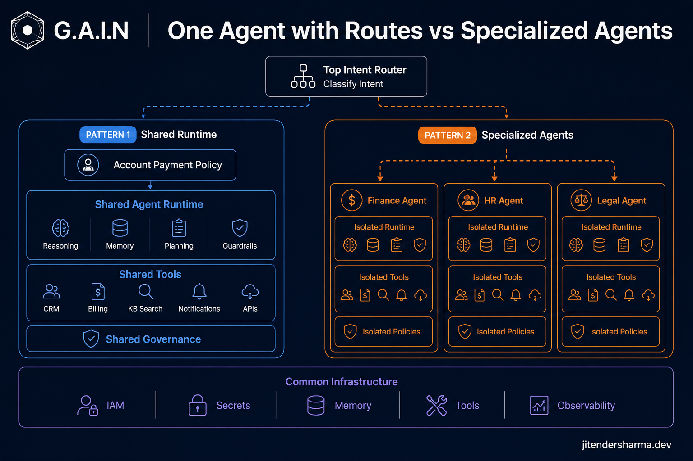
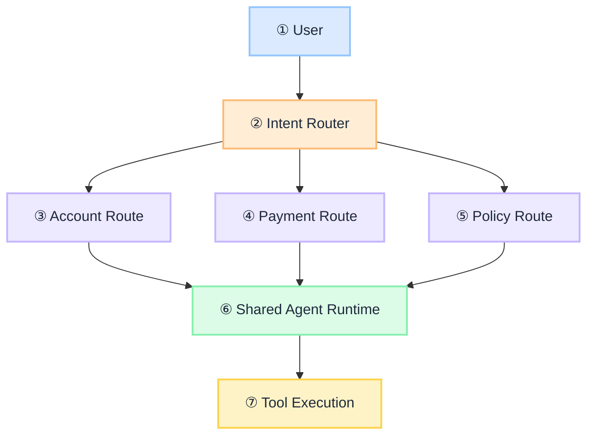
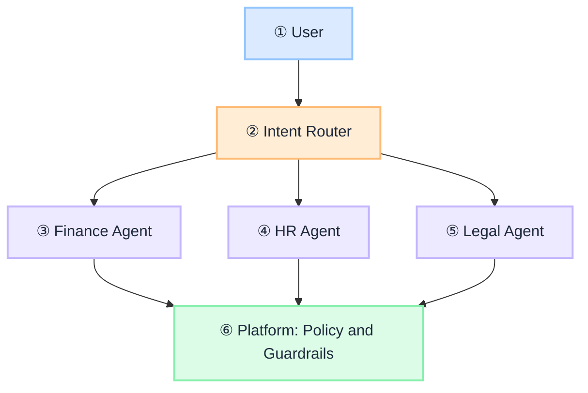

 

# One Agent with Routes vs Specialized Agents: When to Split

As organizations move from simple chatbots to enterprise-grade agentic AI, one architectural question appears repeatedly: **should we build one powerful agent with multiple capabilities, or multiple specialized agents with routing between them?**

The answer is not "more agents are better." Many enterprises create multiple agents too early and inherit duplicated logic, inconsistent governance, and operational overhead. The right question is: **does this capability need a different execution context, or only different tools and policies?**

This is a **decision guide**: two patterns, when each fits, an evolution path, and a practical matrix. It builds on [What Is an Intent Router](/insights/what-is-intent-router), [How to Design an Intent Router](/insights/design-intent-router), and [Policy-Governed Agent Runtime](/insights/policy-governed-agent-runtime).

:::tip[THE CLAIM]
**Do not create agents because you have different use cases. Create agents because you have different execution boundaries.** A route is a governed execution contract (tools, knowledge, policies, models, guardrails). An agent is a reasoning and ownership boundary. Prefer the minimum number of agents that keeps capability, security, governance, and ownership clear.
:::

<!-- truncate -->

## The bottom line first

- **Start with one agent** and grow into capability routes before you invent agent fleets.
- **Routes are enough** when the domain, owning team, and reasoning style are shared and only tools or policies differ.
- **Split into specialized agents** when domains, risk levels, data boundaries, compliance, or ownership diverge.
- **A route is not an agent.** It scopes what the shared runtime may access for this turn.
- **An agent owns how reasoning happens**: instructions, memory, evals, and release cadence.
- **Goal is controlled intelligence**, not maximum agent count.

## Pattern 1: Single agent runtime with multiple routes

One agent platform. Requests land in an [intent router](/insights/what-is-intent-router), which activates a **route**: a governed execution contract. The runtime stays the same; the route changes what is allowed.

 

The route controls:

| Control plane | Examples |
| --- | --- |
| Tools | Which APIs and actions are visible |
| Knowledge | Which retrieval sources are in scope |
| Policies | Read-only vs write, approval gates |
| Model selection | Fast path vs heavier reasoning |
| Guardrails | Content and action limits |
| Execution limits | Timeouts, spend, tool-call caps |

This is the same idea as a [route contract in the intent router design guide](/insights/design-intent-router): the classifier picks a row in the table; it does not invent a new agent.

### Banking example: account history

Customer: *"Show me my last five transactions."*

Router intent: `account_history`. Account route activates:

| Field | Value |
| --- | --- |
| Route | Account History |
| Tools | GetTransactions, GetBalance, GetStatement |
| Policy | Read-only |
| Knowledge | Customer account data |

The agent reasons only inside that boundary. It cannot see TransferMoney, CloseAccount, or LoanApproval. Same runtime, different capability surface. That boundary enforcement belongs in the [policy-governed agent runtime](/insights/policy-governed-agent-runtime), not in the prompt alone.

## When Pattern 1 works best

### 1. Same business domain

A banking assistant that checks balance, views transactions, downloads statements, and freezes a card still shares customer context, security model, data ownership, and user journey. Separate agents add little value.

### 2. Differences are mainly tools

If Capability A needs SearchAccount / GetTransactions and Capability B needs FreezeCard / ReplaceCard, a shared runtime with different manifests is usually enough. The reasoning pattern is similar. Tool exposure is still a product decision: see [MCP for enterprise business agents](/insights/mcp-for-enterprise-business-agents) for when connectors should stay behind governed boundaries.

### 3. A single team owns the capability

One team owns prompts, evaluations, tools, releases, and monitoring. A single platform reduces operational complexity.

## Pattern 2: Multiple specialized agents

The router selects a **specialized agent**, not only a route on a shared brain. Agents own reasoning and domain capability. **Policy and guardrails still come from the platform**, not from each agent stack.

 

Each agent has its own instructions, memory, tools, retrieval sources, and evaluation framework. Approval gates, content limits, audit, and action controls are enforced by the shared platform layer so governance stays consistent across specialized agents.

### Enterprise assistant example

| Domain | Capabilities | What makes it different |
| --- | --- | --- |
| Finance | Invoice approval, expenses, payment status | Financial systems, approval workflows, strong controls |
| HR | Leave policy, employee info, benefits | HR systems, employee privacy |
| Legal | Contract analysis, regulatory questions | Legal corpora, citations, heavier reasoning |

These domains are fundamentally different. A single agent becomes hard to govern, evaluate, and own. Specialization splits reasoning and ownership; the platform still holds policy and guardrails.

## When Pattern 2 works best

### 1. Different business domains

Finance and HR are not just different tools. They have different data, processes, and ownership. Separate agents create cleaner boundaries while the platform keeps shared policy enforcement.

### 2. Different risk levels

| Agent | Risk | Actions |
| --- | --- | --- |
| HR | Lower | Read employee information |
| Payment | High | Move money, require approval and MFA |

A dedicated payment agent gives stronger isolation for high-impact actions. Higher risk still maps to stricter platform policies, not a separate ad-hoc guardrail stack per team.

### 3. Different reasoning styles

A legal agent may need citation generation, contract interpretation, and regulatory reasoning. A coding agent may need repository access, code execution, and testing. Those are different cognitive workflows, not just different tool lists.

### 4. Different ownership models

Large enterprises often map agents to teams: HR Team owns the HR Agent; Finance owns Finance; Security owns Security. Each team manages its own tools, evaluations, and releases. Policy and guardrails remain platform-owned so every specialized agent inherits the same control plane.

## The evolution path most enterprises should follow

A common mistake is starting with twenty agents. Prefer staged growth:

| Stage | Shape | When |
| --- | --- | --- |
| **1. Single agent** | One assistant, a small tool set | Early product, one domain, one owner |
| **2. Capability routing** | Router → customer / payment / support routes on one runtime | Tools and policies diverge; domain still shared |
| **3. Specialized agents** | Router → Finance / HR / Legal / Security agents | Domains, risk, ownership, or reasoning diverge |

Introduce Stage 3 only when complexity requires it. Design the [route table](/insights/design-intent-router) before you invent agent fleets.

## Decision framework

Ask these questions. Prefer the first "yes" cluster for routes; the second for specialized agents.

| Question | If yes | Recommendation |
| --- | --- | --- |
| Same business domain? | Yes | Single agent with routes |
| Same owning team? | Yes | Single agent with routes |
| Only different tools? | Yes | Single agent with routes |
| Different compliance requirements? | Yes | Multiple agents |
| Different business owners? | Yes | Multiple agents |
| Different data boundaries? | Yes | Multiple agents |
| Different reasoning behaviour? | Yes | Multiple agents |

Mixed signals (same domain but different compliance owners, for example) usually mean **split the high-risk slice** into a specialized agent and keep the rest on routes.

## Key takeaways

- **Routes scope access; agents scope reasoning and ownership.** Do not conflate use cases with agents.
- **Default to one runtime with governed routes** until domain, risk, data, or ownership forces a split.
- **Evolve Stage 1 → routes → specialized agents**; do not start at Stage 3.
- **Keep policy and guardrails on the platform** in both patterns so specialized agents do not invent parallel control planes.
- **Optimize for clear boundaries and operable ownership**, not agent count.

:::info[Builds on]
[What Is an Intent Router](/insights/what-is-intent-router) · [How to Design an Intent Router](/insights/design-intent-router) · [Policy-Governed Agent Runtime](/insights/policy-governed-agent-runtime) · [MCP for Enterprise Business Agents](/insights/mcp-for-enterprise-business-agents)
:::
