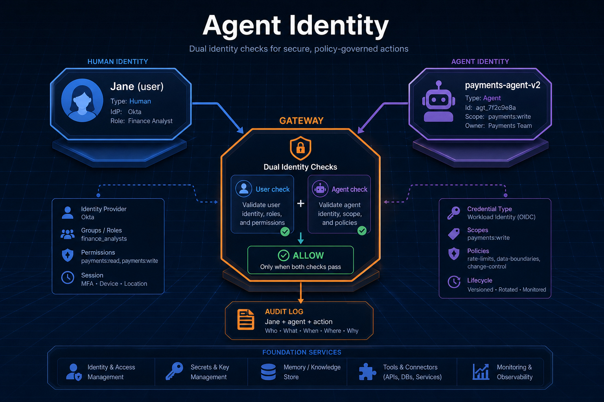
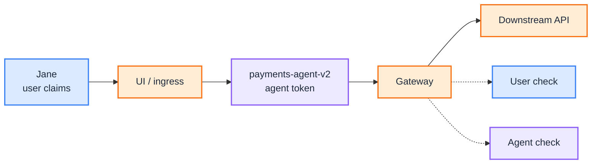
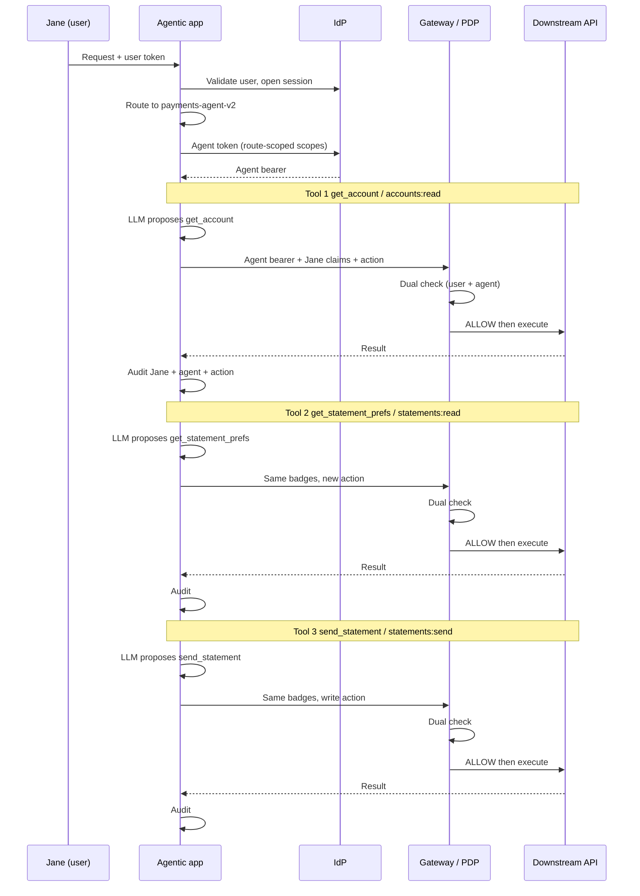
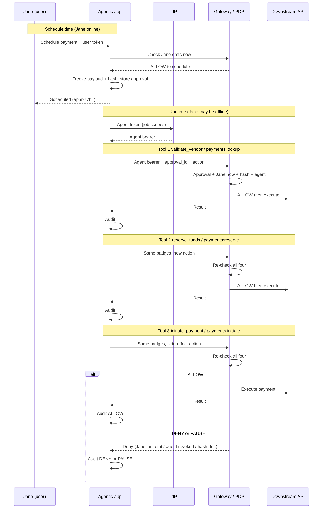

import Tabs from '@theme/Tabs';
import TabItem from '@theme/TabItem';

<br/>



# Agent Identity: Why the Robot Needs Its Own Badge

Jane the banker asks an agent to send a statement. If the runtime calls the statements API as Jane, you have borrowed her login. If it calls as a shared `svc-agents` account, you have a fat service identity that every agent shares. Production needs a third option: **Jane is who is asking; `payments-agent-v2` is which software is acting.** Both principals show up on every tool call.

This is a **concept primer** with worked real-time and batch sequences. It sits next to [Policy-Governed Agent Runtime](/insights/policy-governed-agent-runtime): the model proposes, the gateway enforces, and enforcement needs to know **which robot** proposed the call, not only which human started the session.

:::tip[THE CLAIM]
**Give every agent its own identity.** User identity answers "may this person?"; agent identity answers "may this robot?" The gateway enforces both on every tool and API call, including scheduled batch work. Stop using Jane's token as the caller, and stop sharing one service account across agents.
:::

<!-- truncate -->

## The bottom line first

- **User identity** = who is asking (Jane the banker).
- **Agent identity** = which software agent is acting (`payments-agent-v2`).
- Both are required: least privilege, audit, revoke, and job control.
- Same identity model for real-time and batch; only how you carry **user** authority changes.
- Gateway allow needs **agent scopes and user entitlements** (or a stored approval bound to Jane).
- Guides below: **swimlanes** for the three-tool story; **tabs** that split Jane, agent, wire, dual check, and audit.

## User identity vs agent identity

| Principal | Answers | Example |
| --- | --- | --- |
| **User identity** | Who is asking? | Jane: `sub`, `roles`, `branch`, `emts` |
| **Agent identity** | Which software is acting? | `payments-agent-v2`: `client_id`, route-scoped `scope` |

They are not interchangeable. Jane's session starts the work. The agent is the runtime principal that calls APIs. Mixing them collapses audit and privilege into one blob. Exact claim shapes appear in the step-by-step tabs (user login vs agent token).

## Why agent identity exists

So the agent is **not** using a shared service account or Jane's login.

| Capability | Without agent identity | With agent identity |
| --- | --- | --- |
| **Least privilege** | One fat `svc-agents` can call everything | Each agent gets only the scopes it needs |
| **Audit** | "Some agent did this" | Which agent (`payments-agent-v2`) |
| **Revoke** | Kill the shared account, break everything | Revoke one agent; others keep running |
| **Job control** | Hard to bind long-running work to a robot | Same agent identity across steps and schedules |

## Dual check (not redundant)



<br/>

| Check | Question |
| --- | --- |
| **User check** | Is Jane allowed to do this on this resource? |
| **Agent check** | Is this approved agent allowed to call this API? |

| User | Agent | Result |
| --- | --- | --- |
| Unauthorized banker | Valid agent | **Deny** |
| Valid banker | Revoked or unapproved agent | **Deny** |
| Valid banker | Valid agent | **Allow** |

User fine-grained control uses Jane's claims + `action` + resource attributes (branch match, account active, and so on). That does not replace the agent-scope check. Same separation as [PGAR](/insights/policy-governed-agent-runtime): proposal is not permission.

**How the agent gets tools:** register the agent in the IdP, allow only needed scopes, mint a token **after** the route loads (downscoped to that route), call APIs with the agent bearer plus user context, gateway enforces both. See [MCP for Enterprise Business Agents](/insights/mcp-for-enterprise-business-agents).

## Real-time vs batch

Identity is tied to the **agent**, not to how long the workflow runs.

| Mode | User authority | Agent identity |
| --- | --- | --- |
| **Real-time** | Live claims on every tool call | Route-scoped agent bearer every call |
| **Batch** | Stored approval at schedule time; re-check Jane **now** at runtime | Same agent identity; Jane may be offline |

## Step-by-step guides

Swimlanes tell the story (who acts, in what order). JSON under each is **evidence** (claims and one tool-call shape), not a full dump per hop. Each mode runs **three tool calls**; dual identity is checked on **every** call.

:::note[Route-scoped claims (user and agent)]
Do not treat "load every possible claim up front" as the production default.

| Principal | Typical issue | Prefer |
| --- | --- | --- |
| **User** | Login JWT with every entitlement Jane might ever use | Hold Jane's entitlements at ingress; **enforce only what this action needs** via PDP (`action` + `resource`). Absence of an entitlement means not entitled; no explicit `false` flags required. |
| **Agent** | One fat token with every API scope the client is registered for | **After** the route contract loads, request or exchange an agent token whose `scope` is IdP-allowed ∩ **this route's** required scopes. Mid-session route change → new downscoped agent token. |

Order: **route first, then agent token**. The agent must not invent scopes outside IdP registration or the route allowlist.
:::

### Real-time: three tool calls

Jane: "Send my statement for ACC-4821." Same session, same agent badge. Tools 1-3 only change `action`.

| # | Tool | Action |
| --- | --- | --- |
| 1 | `get_account` | `accounts:read` |
| 2 | `get_statement_prefs` | `statements:read` |
| 3 | `send_statement` | `statements:send` |

<div className="gain-diagram-wrap">



</div>

<br/>

Walk the tabs left to right. Each shows **one** idea. Tools 1–3 reuse the same shape — only `action` changes.

<Tabs groupId="guide-realtime">
  <TabItem value="jane" label="1. Jane" default>

**Who is asking?** Live user claims from Jane's session. Her `emts` say what *she* may do.

```json
{
  "sub": "jane@bank.example",
  "roles": ["banker"],
  "branch": "SYD-01",
  "emts": {
    "accounts:read": true,
    "statements:read": true,
    "statements:send": true
  }
}
```

  </TabItem>
  <TabItem value="agent" label="2. Agent">

**Which robot is acting?** Issued **after** the route picks `payments-agent-v2`. Scopes are capped to this route — not Jane's full login.

```json
{
  "client_id": "payments-agent-v2",
  "scope": [
    "accounts:read",
    "statements:read",
    "statements:send"
  ],
  "jti": "agt-tok-91c2"
}
```

Same agent token for tools 1, 2, and 3 in this session.

  </TabItem>
  <TabItem value="wire" label="3. On the wire">

**Both badges travel with every tool call.** The bearer is the **agent** token. Jane is a claim header (or equivalent), not the `Authorization` bearer.

Example = tool 3 (`send_statement`):

```json
{
  "headers": {
    "Authorization": "Bearer <agent_token>",
    "X-User-Sub": "jane@bank.example",
    "X-Session-Id": "sess-8f2a"
  },
  "body": {
    "action": "statements:send",
    "account_id": "ACC-4821"
  }
}
```

  </TabItem>
  <TabItem value="check" label="4. Dual check">

Gateway asks **two** questions. Both must be true or the call is denied.

| Question | Looks at | For tool 3 |
| --- | --- | --- |
| May Jane? | her live `emts` | `statements:send: true` |
| May this agent? | agent `scope` | includes `statements:send` |

```json
{
  "action": "statements:send",
  "jane_allowed": true,
  "agent_allowed": true,
  "verdict": "ALLOW"
}
```

Never send Jane's bearer as the caller. Never skip the agent check because Jane already passed.

  </TabItem>
  <TabItem value="per-tool" label="5. Per tool">

Same wire shape and same badges. **Only `action` changes.**

```json
[
  { "tool": "get_account", "action": "accounts:read" },
  { "tool": "get_statement_prefs", "action": "statements:read" },
  { "tool": "send_statement", "action": "statements:send" }
]
```

Each row re-runs the dual check with that `action`.

  </TabItem>
  <TabItem value="audit" label="6. Audit">

One log line per tool call — both principals, the action, the verdict.

```json
{
  "user_sub": "jane@bank.example",
  "agent_client_id": "payments-agent-v2",
  "action": "statements:send",
  "resource_id": "ACC-4821",
  "verdict": "ALLOW"
}
```

  </TabItem>
</Tabs>

:::tip[Real-time rule]
**Every** tool call re-runs the dual check. Same agent token and live Jane claims; different `action` / resource. Never substitute Jane's bearer for the agent.
:::

### Batch: three tool calls

Jane: "Schedule a $500 AUD payment to VND-ACME from ACC-4821 for tonight." She schedules while online. At runtime three tools share one agent badge and one approval — Jane may be offline.

| # | Tool | Action |
| --- | --- | --- |
| 1 | `validate_vendor` | `payments:lookup` |
| 2 | `reserve_funds` | `payments:reserve` |
| 3 | `initiate_payment` | `payments:initiate` |

<div className="gain-diagram-wrap">



</div>

<br/>

Walk the tabs left to right. Start with **Jane** (same as real-time), then the frozen **approval** because she may be offline at runtime.

<Tabs groupId="guide-batch">
  <TabItem value="jane" label="1. Jane" default>

**Who is asking?** Same principal as real-time. At schedule time her live `emts` are checked; at runtime they are checked **again** (Jane may have lost an entitlement).

```json
{
  "sub": "jane@bank.example",
  "roles": ["banker"],
  "branch": "SYD-01",
  "emts": {
    "payments:lookup": true,
    "payments:reserve": true,
    "payments:initiate": true
  }
}
```

  </TabItem>
  <TabItem value="approval" label="2. Approval">

**What Jane froze while online.** Not her live session token — a stored approval bound to her, **this** agent, the allowed actions, and a payload hash.

`agent_client_id` is required so Jane approved a **named robot**, not "any service that can pay." At runtime the gateway rejects the job if a different agent presents the approval (or if `payments-agent-v2` was revoked).

```json
{
  "approval_id": "appr-77b1",
  "approved_by": "jane@bank.example",
  "agent_client_id": "payments-agent-v2",
  "allowed_actions": [
    "payments:lookup",
    "payments:reserve",
    "payments:initiate"
  ],
  "payload": {
    "account_id": "ACC-4821",
    "vendor_id": "VND-ACME",
    "amount": 500.0,
    "currency": "AUD"
  },
  "payload_hash": "sha256:9f2c8a1b0e4d77c3",
  "status": "scheduled"
}
```

  </TabItem>
  <TabItem value="agent" label="3. Agent">

**Which robot runs the job?** Same idea as real-time: a job-scoped agent token for `payments-agent-v2`, not Jane's login.

```json
{
  "client_id": "payments-agent-v2",
  "scope": [
    "payments:lookup",
    "payments:reserve",
    "payments:initiate"
  ],
  "jti": "agt-tok-job-4401"
}
```

Same agent token for tools 1, 2, and 3 in this job.

  </TabItem>
  <TabItem value="wire" label="4. On the wire">

**Agent bearer + approval id** on every tool call. Jane may be offline — her authority rides in the approval, not in a live user token.

Example = tool 3 (`initiate_payment`):

```json
{
  "headers": {
    "Authorization": "Bearer <agent_token>",
    "X-Approval-Id": "appr-77b1",
    "X-Job-Id": "job-4401"
  },
  "body": {
    "action": "payments:initiate",
    "account_id": "ACC-4821",
    "vendor_id": "VND-ACME",
    "amount": 500.0,
    "currency": "AUD"
  }
}
```

  </TabItem>
  <TabItem value="check" label="5. Four checks">

Every tool must pass all four:

| Check | How it is done |
| --- | --- |
| Approval still good? | Load `appr-77b1`. Confirm it exists, is `scheduled` / not cancelled or expired, and lists this `action` in `allowed_actions`. |
| Jane still allowed **now**? | Take `approved_by` (`jane@bank.example`). Look up her **current** entitlements in the IdP / entitlement store (no live user JWT). Confirm this `action` is still true. |
| Amount / payload unchanged? | Re-hash the request body. Compare to `payload_hash` on the approval. Mismatch → drift (e.g. amount changed) → `PAUSE` / deny. |
| This agent still allowed? | Validate the agent bearer. Confirm `client_id` matches `agent_client_id` on the approval, status is active, and `scope` includes this `action`. |

```json
{
  "action": "payments:initiate",
  "approval_valid": true,
  "jane_allowed_now": true,
  "payload_unchanged": true,
  "agent_allowed": true,
  "verdict": "ALLOW"
}
```

  </TabItem>
  <TabItem value="per-tool" label="6. Per tool">

Same wire shape, same approval, same agent. **Only `action` changes.**

```json
[
  { "tool": "validate_vendor", "action": "payments:lookup" },
  { "tool": "reserve_funds", "action": "payments:reserve" },
  { "tool": "initiate_payment", "action": "payments:initiate" }
]
```

Each row re-runs all four checks with that `action`.

  </TabItem>
  <TabItem value="audit" label="7. Audit">

One log line per tool call — approval, both principals, action, verdict.

```json
{
  "approval_id": "appr-77b1",
  "job_id": "job-4401",
  "user_sub": "jane@bank.example",
  "agent_client_id": "payments-agent-v2",
  "action": "payments:initiate",
  "verdict": "ALLOW"
}
```

  </TabItem>
  <TabItem value="deny" label="8. If deny">

Any one failed check stops the tool (and usually the job).

```json
[
  {
    "fail": "jane_allowed_now",
    "reason": "Jane lost entitlement before a later tool",
    "verdict": "DENY"
  },
  {
    "fail": "agent_allowed",
    "reason": "payments-agent-v2 revoked",
    "verdict": "DENY"
  },
  {
    "fail": "payload_unchanged",
    "reason": "amount drifted 500.00 -> 5000.00",
    "verdict": "PAUSE"
  }
]
```

  </TabItem>
</Tabs>

:::tip[Batch rule]
Schedule once; **re-check on every tool call** at runtime (approval, Jane now, hash, agent). Same robot badge for all three tools.
:::

### Side-by-side

| Concern | Real-time (3 tools) | Batch (3 tools) |
| --- | --- | --- |
| Agent identity | Same bearer on tools 1-3 | Same bearer on tools 1-3 |
| User authority | Live claims on every tool call | Approval + live re-check on every tool call |
| Jane online | Required for the turn | Required to schedule; optional at run |
| Drift control | N/A | `payload_hash` checked each tool |
| Audit | One row per tool call | One row per tool call + `approval_id` / `job_id` |

## Mental model

```text
Every agent action =
  Agent identity (robot badge)
  + User authority (human entitlement / stored approval)
  + Gateway policy check (action + resource)
```

| Question | Answered by | Claims / fields |
| --- | --- | --- |
| May this person? | User identity / stored approval | `user.sub`, `roles`, `branch`, `emts` (or `approval_id`) |
| May this robot? | Agent identity | `agent.client_id`, `scope`, agent `status` |
| May this action on this resource? | Gateway policy | `action` + `resource.*` against both principals |

## Key takeaways

- Treat agent identity as a **first-class principal**, separate from the human session.
- Prefer per-agent IdP registration and **route-scoped** tokens over shared service accounts or user-token passthrough.
- Enforce **dual checks** on every tool and API call: agent scopes and user entitlements (or stored approval).
- Use the **same agent identity** for real-time and batch; change how you carry user authority, not the robot badge.
- Audit **Jane + agent + action** (plus `approval_id` / `job_id` for batch) so revoke and forensics stay possible.

:::info[Builds on]
[Policy-Governed Agent Runtime](/insights/policy-governed-agent-runtime) · [MCP for Enterprise Business Agents](/insights/mcp-for-enterprise-business-agents) · [Retrieval Is a Governed Action](/insights/retrieval-is-a-governed-action)
:::
