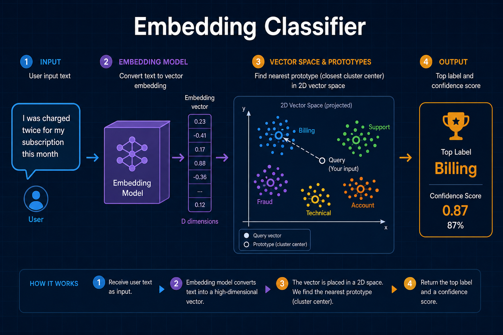
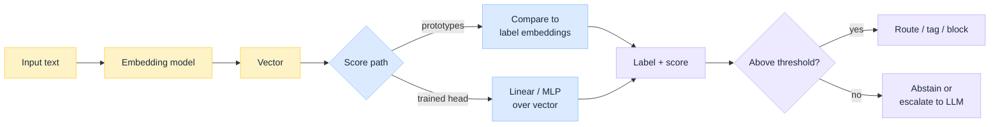
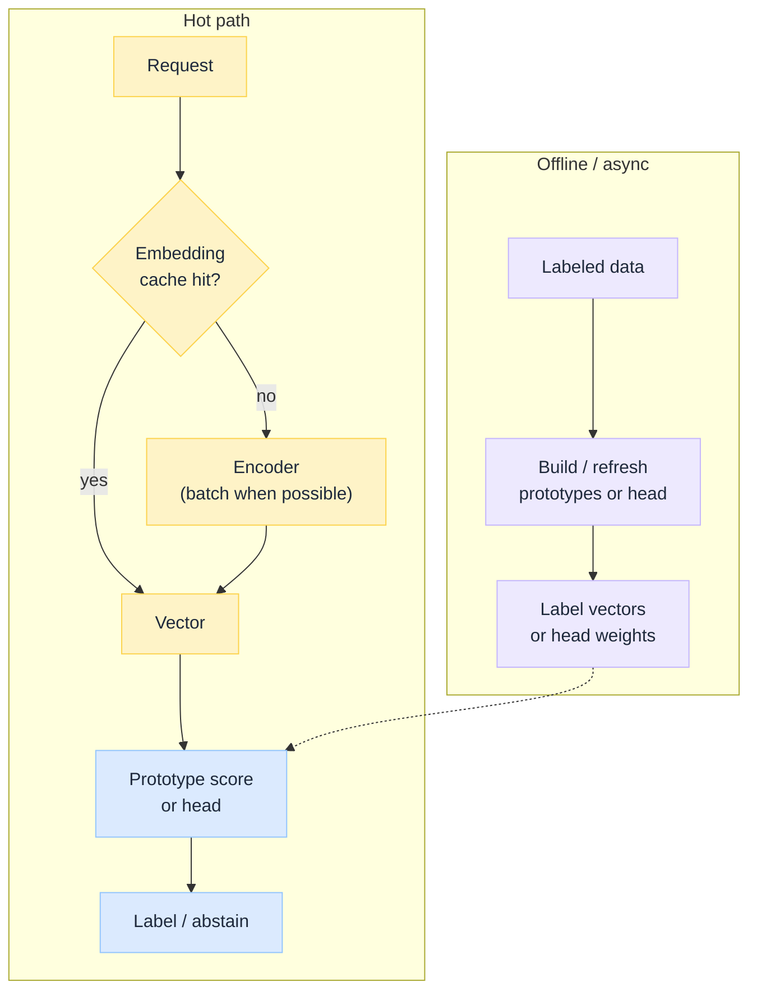

import Details from '@theme/Details';

<br/>


# Embedding Classifier: How It Works, Where to Use It, How to Scale

*Not every "what is this text about?" needs a full LLM. If your labels are a **stable taxonomy**, an **embedding classifier** is often enough: turn the text into a vector, then pick the closest label (or run a thin head on that vector). Fast, cheap, and easy to put in front of an [intent router](/insights/what-is-intent-router).*

This is a **concept primer** on embedding classifiers: how they work, where they belong, how to scale them, and the failure modes teams hit when they treat them like magic understanding.

:::tip[THE CLAIM]
**An embedding classifier maps text to a vector, then assigns a label from a fixed set using similarity or a small trained head.** It wins on latency, cost, and governable label spaces. It loses when labels are open-ended, the decision needs multi-step reasoning, or the taxonomy drifts while the vectors stay frozen. Use it as a first-line gate, not as a substitute for judgment.
:::

<!-- truncate -->

## The bottom line first

- **What it is:** embed input → score against label prototypes or a linear/MLP head → return label(s) + confidence.
- **Why it exists:** classification at high QPS without paying for a generative model on every request.
- **Where it sits:** often before routing, retrieval, or expensive agents ([design intent router](/insights/design-intent-router)).
- **Scale lever:** batch and cache embeddings; keep the label set in memory or ANN only when it is huge.
- **Main risks:** threshold drift, short/ambiguous text, multilingual skew, and silent taxonomy change.

## What an embedding classifier is

Three common ways people "classify" text:

| Approach | How it decides | Strength | Weakness |
| --- | --- | --- | --- |
| **Rules / keywords** | Pattern match | Simple, explainable | Brittle; misses paraphrase |
| **Embedding classifier** | Vector similarity or thin head | Fast, paraphrase-aware, cheap | Fixed labels; weak at deep reasoning |
| **LLM classifier** | Prompt or fine-tuned generative model | Flexible, nuanced | Cost, latency, harder to constrain |

An embedding classifier assumes:

1. You have a **closed label set** (or a slowly changing one).
2. Meaning is close enough in embedding space that same-intent texts land near each other.
3. A **score threshold** (or calibrated probabilities) is good enough to act or abstain.

It does not "understand" like a chat model. It **places** the text in a space you already labeled.

## How it works


<br/>

### Path A: prototype / nearest-label

1. **Encode** the user text with an embedding model → vector `q`.
2. For each label, keep one or more **prototype vectors** (label name embedding, few-shot examples averaged, or centroid of training texts).
3. **Score** with cosine similarity (or dot product on normalized vectors).
4. Take **top-1 or top-k**; apply a **threshold**. Below threshold → abstain.

This is the "RAG of labels" idea: retrieve the nearest class instead of the nearest document. Same geometry, different product meaning. [RAG is not a database](/insights/rag-is-not-a-database); here the "corpus" is your taxonomy.

### Path B: embedding + trained head

1. Encode text → vector `q` (frozen or lightly fine-tuned encoder).
2. Train a **small classifier** (logistic regression, linear layer, shallow MLP) on labeled `(q, label)` pairs.
3. At serve time: embed once, run the head, softmax or sigmoid, threshold.

Often more accurate than raw prototypes when you have enough labeled data. Still cheap compared to an LLM call.

### What "confidence" really is

Similarity and softmax scores are **model-relative**, not human certainty. Calibrate on a holdout set. A score of 0.72 on model A is not the same as 0.72 on model B. Production systems need an **abstain band**, not only an argmax.

<Details summary="Toy example: three intents, prototype path">

```text
Labels: billing | technical | cancel

User: "I was charged twice this month"
  → embed(q)
  → cosine(q, proto_billing)   = 0.81
  → cosine(q, proto_technical) = 0.44
  → cosine(q, proto_cancel)    = 0.39
  → threshold 0.65 → label = billing

User: "hmm not sure"
  → best score 0.41 → abstain → escalate to LLM or human
```

</Details>

## Use cases

| Use case | What you classify | Why embeddings fit |
| --- | --- | --- |
| **Intent routing** | Which skill / agent / tool path | Stable intents, high volume ([intent router](/insights/what-is-intent-router)) |
| **Ticket / queue routing** | Support tier, team, product area | Taxonomy already exists in the ops tool |
| **Topic / tagging** | Content tags for search or analytics | Many labels, paraphrase-heavy titles |
| **Language / locale hint** | Language ID as a gate | Small label set, very high QPS |
| **Safety triage** | Toxicity, jailbreak-ish, PII-ish buckets | First-line filter before heavier checks |
| **RAG gate** | "Needs retrieval?" vs "chitchat" | Cheap branch before embedding a corpus query |
| **Duplicate / near-duplicate** | Same issue as known ticket | Similarity is the product feature |
| **Policy bucket** | Which policy pack applies | Closed set of regimes ([retrieval as governed action](/insights/retrieval-is-a-governed-action)) |

## Where you should use it

Use an embedding classifier when **most** of these are true:

| Condition | Why it matters |
| --- | --- |
| **Closed, named labels** | The model must choose from a list you own |
| **High QPS or tight latency** | Embed + score beats an LLM round trip |
| **Cost budget** | Classification is on the hot path |
| **Paraphrase matters** | Users say the same intent many ways |
| **Abstain is allowed** | Low scores can escalate safely |
| **You can eval offline** | Precision/recall per label, confusion matrix |

**Sweet spot in an agent platform:** first-line intent and safety buckets, then hand off to tools, RAG, or a larger model only when needed. That matches the design intent of putting cheap classification **before** expensive inference.

## Where you should not (or not alone)

| Situation | Why embeddings struggle | Prefer |
| --- | --- | --- |
| **Open-ended labels** ("any category the user invents") | No prototype to match | LLM extract / generative tag with review |
| **Multi-hop reasoning** | Vector proximity ≠ logical entailment | LLM or explicit workflow |
| **Fine legal / medical judgment** | Score ≠ liability-ready decision | Human + governed model, not argmax |
| **Adversarial prompt attacks as sole defense** | Paraphrase attacks and obfuscation | Layered guards, not one classifier |
| **Brand-new label with no examples** | Cold prototype is noise | Seed examples, or rules, until data exists |
| **Extremely short / emoji-only text** | Weak signal in the vector | Rules, clarify turn, or LLM |

## How to scale


<br/>

| Scale pressure | Pattern |
| --- | --- |
| **QPS** | Sync embed for single requests; **micro-batch** embeds under load; GPU/CPU pool sized to p99 |
| **Repeated text** | Cache embeddings by normalized text hash (TTL + model version in the key) |
| **Many labels (hundreds+)** | Exact cosine is fine longer than people think; switch to **ANN** over label vectors when scoring dominates |
| **Huge training sets** | Train the head offline; serve only weights + encoder |
| **Multi-region** | Pin model version; replicate prototype tables; avoid split-brain taxonomies |
| **Model upgrades** | Re-embed prototypes (and often retrain the head); never mix vectors from two encoder versions |
| **Feature store style** | Version `encoder_id`, `taxonomy_id`, `threshold_set` together so rollbacks are atomic |

**Capacity rule of thumb:** the encoder is usually the expensive part. Keep label scoring in-process memory for tens or hundreds of classes. Optimize ANN and distributed search only when profiling says label compare is the bottleneck.

## Issues and challenges

| Challenge | What you see | Mitigation |
| --- | --- | --- |
| **Taxonomy drift** | New products, renamed intents, dead labels | Version taxonomies; retrain / refresh prototypes on a schedule |
| **Threshold rot** | Sudden spike in abstains or wrong autos | Monitor score distributions; recalibrate after model or data shifts |
| **Confusable labels** | `cancel` vs `refund` swap | Merge labels, add contrastive examples, or escalate that pair to LLM |
| **Short / noisy text** | Random top label with medium score | Min length rules; clarify; higher abstain threshold |
| **Multilingual / code-switch** | One language dominates training | Multilingual encoder; per-locale prototypes; eval by language |
| **Domain shift** | Generic embedder weak on jargon | Domain fine-tune of encoder or head; glossary-augmented prototypes |
| **Class imbalance** | Rare intents never win | Oversample, class weights, or separate detectors for rare critical labels |
| **Calibration** | High score, wrong label | Temperature scaling / isotonic on validation; don't trust raw cosine as probability |
| **Evaluation gaps** | "Looks fine in a demo" | Confusion matrix, per-label recall, canary intents, shadow vs LLM |
| **Security** | Adversarial paraphrases bypass topic rails | Defense in depth; never one classifier as the only control |
| **Ops coupling** | Encoder upgrade silently breaks routing | Bundle encoder + prototypes + thresholds as one release artifact |

:::note[Abstain is a feature]
The highest-leverage design choice is often **not** picking a better embedder. It is defining when the system may say "I am not sure" and escalate. Forced argmax is how embedding classifiers earn a bad reputation.
:::

## Key takeaways

- **Embedding classifiers** embed text, then assign a **closed** label via prototypes or a thin head.
- **Use them** for high-QPS intent, topic, triage, and gates in front of routers and agents.
- **Do not use them alone** for open-ended, high-stakes, or deep-reasoning decisions.
- **Scale the encoder and cache first**; ANN over labels only when the label set is truly large.
- **Version encoder, taxonomy, and thresholds together**, and treat **abstain** as a first-class outcome.

:::info[Builds on]
[What Is an Intent Router](/insights/what-is-intent-router) · [Design Intent Router](/insights/design-intent-router) · [RAG Is Not a Database](/insights/rag-is-not-a-database) · [Retrieval Is a Governed Action](/insights/retrieval-is-a-governed-action) · [How LLM Works Under the Hood](/insights/how-llm-works-under-the-hood)
:::
