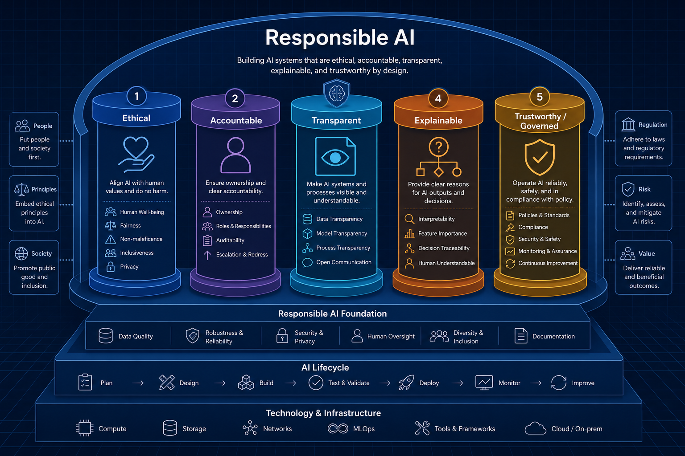
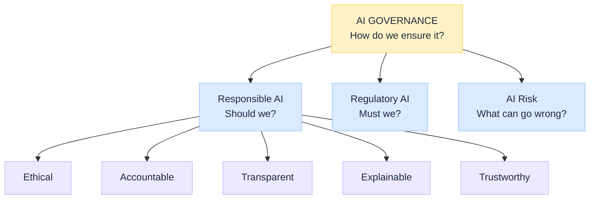

import Details from '@theme/Details';

<br/>


# Responsible AI: Five Outcome Pillars

*Slideware loves twenty AI adjectives. Teams nod, then still cannot answer who owns a bad decision or why the chatbot refused a request.*

**Responsible AI** is the **principles and outcomes** layer: what good looks like. It sits **under** [AI Governance](/insights/what-is-ai-governance) ([G.A.I.N Governance](/frameworks/gain-governance) for the operating map), beside [Regulatory AI](/insights/what-is-regulatory-ai) (must we?) and [AI Risk](/insights/what-is-ai-risk-management) (what can go wrong?). It is not the whole control system, and it is not the law.

Five pillars make outcomes operable: **Ethical, Accountable, Transparent, Explainable, Trustworthy.**

:::tip[THE CLAIM]
**Responsible AI defines the outcomes you want.** Ethical sets harm boundaries. Accountable names owners. Transparent makes the system visible. Explainable answers why *this* output. Trustworthy covers reliability, safety, security, robustness, and ongoing assurance. **AI Governance** is what operationalises these outcomes (and regulatory obligations) in production. Do not rename the fifth pillar "Governed" or you collide with Governance as the parent discipline.
:::

<!-- truncate -->

## The bottom line first

- **Should we?** → Responsible AI. **Must we?** → Regulatory. **How do we ensure it?** → Governance. **What can go wrong?** → Risk.
- Five pillars: ethical, accountable, transparent, explainable, **trustworthy** (not "trustworthy/governed").
- Each pillar has terms inside it, owners, and evidence.
- Overlaps are normal; assign a **primary** pillar so RACI stays clear.
- Map every use case to all five outcomes, then wire them through Governance controls.

## Where Responsible AI sits


<br/>

| Layer | Job |
| --- | --- |
| [AI Governance](/insights/what-is-ai-governance) | Operating model and controls |
| **Responsible AI** | Desired outcomes (this article) |
| [Regulatory AI](/insights/what-is-regulatory-ai) | External obligations |
| [AI Risk](/insights/what-is-ai-risk-management) | What can go wrong |

---

## The five pillars at a glance

| Pillar | Core question | One-line job |
| --- | --- | --- |
| **Ethical** | Consistent with our values and harm boundaries? | Values and prohibited uses |
| **Accountable** | Who owns decision, model, consequences? | Ownership and contestability |
| **Transparent** | What can users, regulators, auditors see? | Disclosure and visibility |
| **Explainable** | Why this particular output? | Decision reasons |
| **Trustworthy** | Reliable, safe, secure, robust, assured? | Ongoing technical assurance |

---

## 1. Ethical AI

**Is this AI used in a way consistent with our values and harm boundaries?**

| Fits here | Examples |
| --- | --- |
| Fair / unbiased | Disparate impact tests |
| Inclusive | Accessibility, representation in eval |
| Privacy (values) | Minimization, purpose limitation |
| Sustainable | Energy and cost externalities |
| Prohibited uses | Uses the firm simply will not do |

**Evidence:** ethics review, use-case register, fairness reports.

---

## 2. Accountable AI

**Who owns the decision, model, and consequences?**

| Fits here | Examples |
| --- | --- |
| RACI | Business + platform owners |
| Human oversight / HITL | Mandatory review bands |
| Contestable | Appeals and overrides |
| Vendor accountability | Contracts and shared responsibility |
| Incident ownership | Named post-incident lead |

**Evidence:** go-live sign-off, appeal logs, vendor DPAs. Hosting choices matter: [Model Hosting Options for Regulated Industries](/insights/model-hosting-options-regulated-industries).

---

## 3. Transparent AI

**What can users, regulators, and auditors see?**

| Fits here | Examples |
| --- | --- |
| Disclosure | "AI-assisted" notices |
| System / model cards | Intended use and limits |
| Auditable | Versions, who changed what |
| Traceable | Data, prompt, tool, retrieval lineage |

**Evidence:** UX notices, cards, audit trails. [AI observability](/insights/ai-observability-in-enterprise) keeps this true after launch.

---

## 4. Explainable AI

**Can we understand why this particular output or decision occurred?**

| Fits here | Examples |
| --- | --- |
| Local XAI | Feature contributions |
| Interpretable models | Simple global structure |
| Citations | Retrieved policy passages |
| Route reasons | Why this intent / tool |

**Evidence:** explanation payloads, citation UI, recorded override reasons.

---

## 5. Trustworthy AI

**Is it controlled in the reliability sense: safe, secure, robust, and continuously assured?**

This pillar is about **outcome quality of the running system**, not about renaming the Governance program.

| Fits here | Examples |
| --- | --- |
| Safety | Jailbreak resistance, misuse refusal |
| Security | Injection defenses, secret handling |
| Reliability / robustness | Drift monitors, fallbacks |
| Alignment to goals | Behaviour matches stated intent |
| Ongoing assurance | Eval gates, red teams, health checks |

**Evidence:** red-team reports, eval gates, security reviews, deny logs. Runtime policy enforcement lives in **Governance** (and in designs like a [policy-governed agent runtime](/insights/policy-governed-agent-runtime)); Trustworthy is the outcome those controls protect.

---

## Overlaps (normal)

| Topic | Primary pillar | Also touches |
| --- | --- | --- |
| Privacy | Ethical | Transparent + Regulatory |
| Auditability | Transparent | Accountable |
| Contestability | Accountable | Explainable |
| Safety / security | Trustworthy | Governance controls + Risk |
| Fairness metrics | Ethical | Trustworthy monitoring + Regulatory |

<Details summary="Refund agent across five Responsible pillars">

```text
Ethical:       Fair treatment tested; use allowed by policy
Accountable:   Operations owner + appeal desk
Transparent:   Customer told AI assisted; versions logged
Explainable:   Top drivers / policy cites on decline or cap
Trustworthy:   Fraud limits, eval green, injection controls healthy
```

Governance still supplies inventory, approvals, and audit packaging. Regulatory still supplies the must-we list. Risk still rates residual fraud and bias.

</Details>

## Key takeaways

- **Responsible AI = should we?** outcomes under Governance, not Governance itself.
- Five pillars: **Ethical, Accountable, Transparent, Explainable, Trustworthy.**
- Keep **Governed** language in the **AI Governance** parent, not as a Responsible pillar name.
- Pair with [Regulatory](/insights/what-is-regulatory-ai) and [Risk](/insights/what-is-ai-risk-management) for a complete enterprise story.

:::info[Builds on]
[What Is AI Governance](/insights/what-is-ai-governance) · [What Is Regulatory AI](/insights/what-is-regulatory-ai) · [What Is AI Risk Management](/insights/what-is-ai-risk-management) · [Policy-Governed Agent Runtime](/insights/policy-governed-agent-runtime) · [Retrieval Is a Governed Action](/insights/retrieval-is-a-governed-action) · [AI Observability in the Enterprise](/insights/ai-observability-in-enterprise) · [Model Hosting Options for Regulated Industries](/insights/model-hosting-options-regulated-industries)
:::
