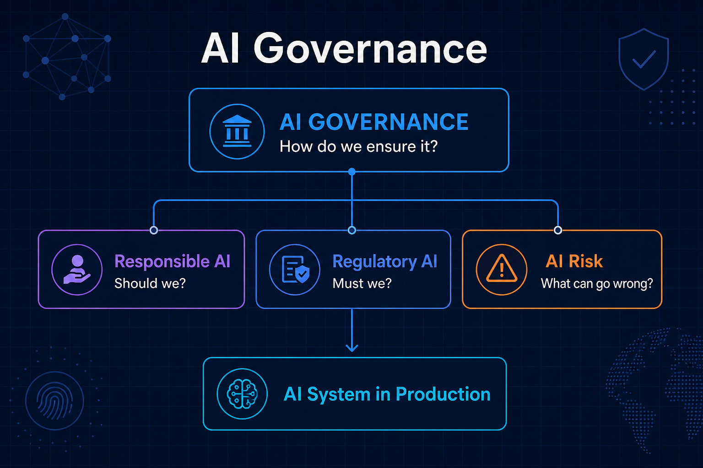
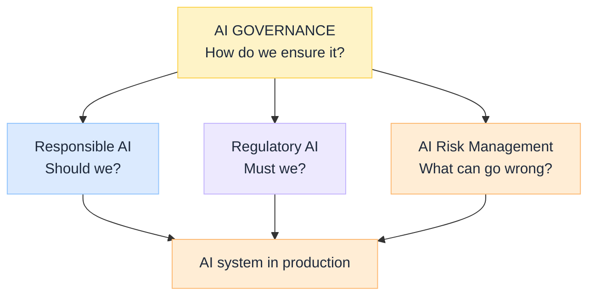

import Details from '@theme/Details';

<br/>


# What Is AI Governance: How We Ensure It

*Enterprises often use **Responsible AI**, **Regulatory AI**, and **AI Governance** as if they were synonyms. They complement each other. They are not the same thing.*

The cleanest enterprise model is three questions under one operating system:

| Layer | Question | Job |
| --- | --- | --- |
| **Responsible AI** | Should we? | Principles and outcomes you want |
| **Regulatory AI** | Must we? | Compliance obligations you must satisfy |
| **AI Governance** | How do we ensure it? | Management and control system across the estate |
| **AI Risk** | What can go wrong? | Identify, assess, mitigate, monitor residual risk |

Governance sits **above** the others as the way you operationalise them. It is not a fifth Responsible AI pillar. For the G.A.I.N operating map (capability tree, control path, plane owners), see [G.A.I.N Governance](/frameworks/gain-governance).

:::tip[THE CLAIM]
**AI Governance is the enterprise control system for AI.** Responsible AI defines desired outcomes. Regulatory AI defines obligations. AI Risk asks what can go wrong. Governance is the operating model (policy, inventory, approvals, controls, monitoring, audit) that keeps all three true in production.
:::

<!-- truncate -->

## The bottom line first

- **Do not treat** Responsible, Regulatory, and Governance as competing categories.
- Position them as **Principles → Obligations → Operating model**, with **Risk** as the continuous "what can go wrong" discipline.
- Governance owns the **capability tree**: strategy, risk, responsible outcomes, regulatory compliance, lifecycle, security/privacy, oversight, controls, monitoring, audit.
- A bank refund agent example shows all three questions at once.
- Without governance, principles and regs stay in slideware.

## The stack


<br/>

| Layer | Insight |
| --- | --- |
| Responsible AI (pillars) | [Responsible AI: five buckets](/insights/responsible-ai-five-buckets) |
| Regulatory AI | [What Is Regulatory AI](/insights/what-is-regulatory-ai) |
| AI Risk Management | [What Is AI Risk Management](/insights/what-is-ai-risk-management) |

**One line each:**

- **Responsible AI** defines the **outcomes**.
- **Regulatory AI** defines the **obligations**.
- **AI Governance** defines the **system of controls** that makes both operational.
- **AI Risk** feeds Governance with threats, treatments, and residual risk.

## What AI Governance actually is

Governance is **how the enterprise controls AI end to end**: who decides, what is allowed, what must be evidenced, how models and agents change, and how you know production still matches policy.

It is the management system. A [policy-governed agent runtime](/insights/policy-governed-agent-runtime) is one technical expression of that system on the agent path. [Retrieval as a governed action](/insights/retrieval-is-a-governed-action) is another.

### Capability tree

```text
AI Governance
├── AI Strategy & Policy
├── AI Risk Management
├── Responsible AI
│   ├── Ethical
│   ├── Accountable
│   ├── Transparent
│   ├── Explainable
│   └── Trustworthy
├── Regulatory Compliance
├── Model / AI Lifecycle Governance
├── Security & Privacy
├── Human Oversight
├── Controls & Guardrails
├── Monitoring & Assurance
└── Audit & Evidence
```

| Capability | Ensures… |
| --- | --- |
| Strategy & policy | Intentional use; banned uses; risk appetite |
| Risk management | Threats are known, treated, accepted |
| Responsible AI | Outcomes match values and harm boundaries |
| Regulatory compliance | Legal "must" list is mapped to controls |
| Lifecycle governance | Inventory, change, retirement of models/agents |
| Security & privacy | Attack surface and data duties are owned |
| Human oversight | HITL where risk demands it |
| Controls & guardrails | Runtime enforcement, not hope |
| Monitoring & assurance | Drift, quality, control health |
| Audit & evidence | Reconstructable story for supervisors |

## Bank example: AI agent approves a customer refund

| Lens | Questions the bank must answer |
| --- | --- |
| **Responsible AI** | Fair treatment? Clear human accountability? Can the decision be explained? |
| **Regulatory AI** | Banking, privacy, consumer-protection, and applicable AI rules satisfied? |
| **AI Risk** | Wrong refund, fraud, bias, model drift, prompt injection: likelihood and impact? |
| **AI Governance** | Approval process, model inventory, access control, monitoring, audit evidence, escalation so the above stay true in prod |

Miss Governance and you may have ethics slides and a policy PDF while the agent ships with no inventory entry and no deny logs.

## When "governance" is missing

| Symptom | What is actually broken |
| --- | --- |
| Principles page, no owners | Accountable gap + no operating model |
| Legal memo, no runtime controls | Regulatory mapped on paper only |
| Red-team once, never again | Risk without monitoring |
| Shadow agents in business units | No lifecycle / inventory |
| Incident with no timeline | No audit evidence ([observability](/insights/ai-observability-in-enterprise)) |

## How to use this model

1. Name **Governance** as the parent program in architecture and RACI.
2. Run **Responsible**, **Regulatory**, and **Risk** as sibling workstreams under it.
3. For every use case, answer all four questions before go-live.
4. Put controls on the path (policy, tools, retrieval, serve), not only in a committee.
5. Hosting and vendor choices fix shared responsibility; see [Model Hosting Options for Regulated Industries](/insights/model-hosting-options-regulated-industries).

## Key takeaways

- **Governance = how we ensure it**; not a synonym for ethics or for the law.
- **Responsible / Regulatory / Risk** are distinct layers Governance operationalises.
- Use **Principles → Obligations → Operating model** in banking and regulated architecture.
- Staff the **capability tree**; principles without inventory, controls, and evidence fail in prod.

:::info[Builds on]
[G.A.I.N Governance](/frameworks/gain-governance) · [Responsible AI: five buckets](/insights/responsible-ai-five-buckets) · [What Is Regulatory AI](/insights/what-is-regulatory-ai) · [What Is AI Risk Management](/insights/what-is-ai-risk-management) · [Policy-Governed Agent Runtime](/insights/policy-governed-agent-runtime) · [Retrieval Is a Governed Action](/insights/retrieval-is-a-governed-action) · [AI Observability in the Enterprise](/insights/ai-observability-in-enterprise) · [Model Hosting Options for Regulated Industries](/insights/model-hosting-options-regulated-industries)
:::
