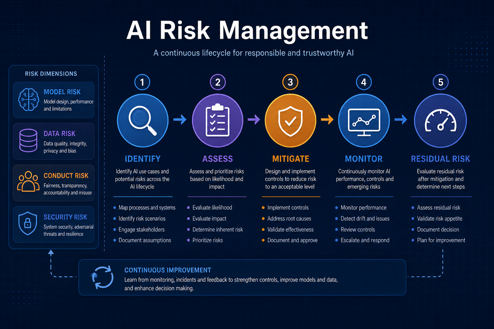
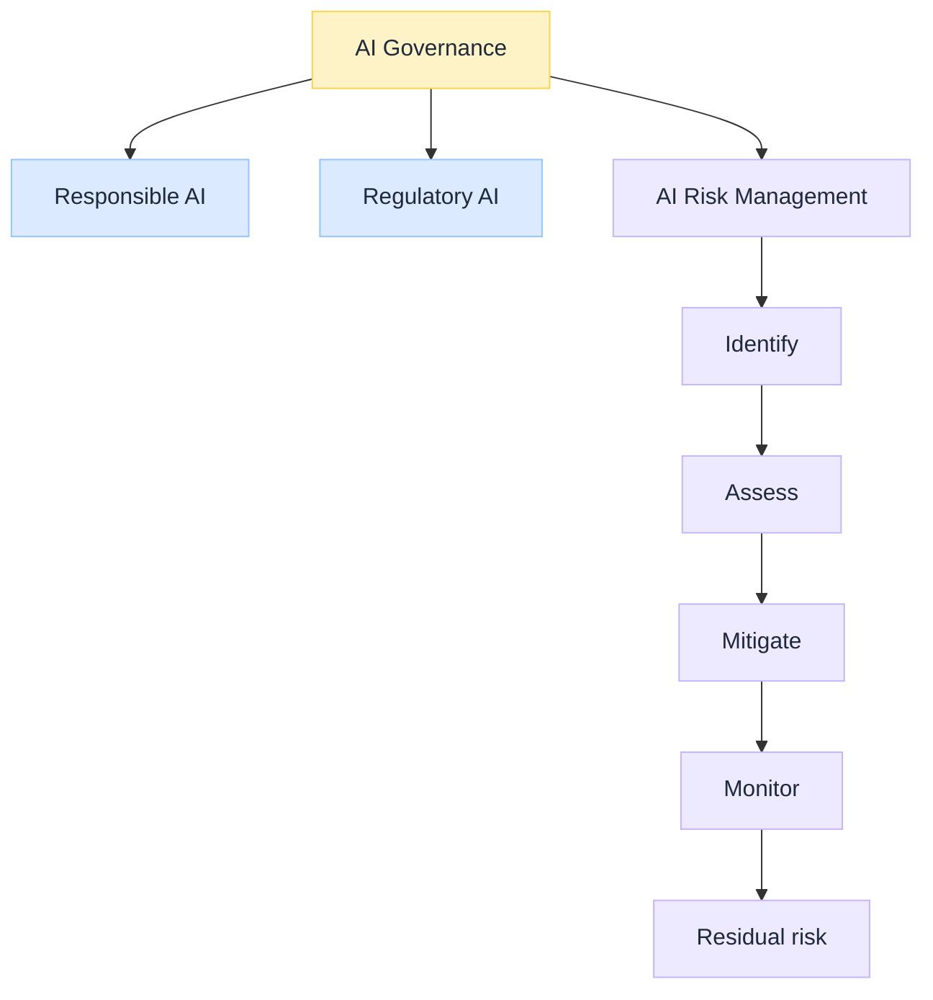

import Details from '@theme/Details';

 

# What Is AI Risk Management: What Can Go Wrong

*Responsible AI sets the outcomes you want. Regulatory AI lists what you must satisfy. **AI Risk Management** asks what can go wrong, how bad it could be, what you will do about it, and what residual risk leadership accepts.*

Under [AI Governance](/insights/what-is-ai-governance), risk is a first-class sibling of Responsible and Regulatory, not a synonym for either.

:::tip[THE CLAIM]
**AI Risk Management is the what-can-go-wrong discipline.** Identify, assess, mitigate, monitor, and accept residual risk. It feeds Governance with treatments and appetite. It does not replace ethics (should we?) or the law (must we?). Skipping it is how "compliant on paper" systems still blow up in production.
:::

<!-- truncate -->

## The bottom line first

- Risk answers **what can go wrong**, not only "are we ethical" or "are we legal."
- Run a full loop: **identify → assess → mitigate → monitor → residual risk**.
- Cover **model, data, conduct, security, third-party, and operational** risk, not only accuracy.
- Tie mitigations to [Responsible](/insights/responsible-ai-five-buckets) outcomes and [Regulatory](/insights/what-is-regulatory-ai) controls.
- Accept residual risk **explicitly**; silent acceptance is not management.

## Where it sits

 

| Layer | Question |
| --- | --- |
| Responsible AI | Should we? (outcomes) |
| Regulatory AI | Must we? (obligations) |
| **AI Risk** | What can go wrong? |
| AI Governance | How do we ensure all of the above? |

## The risk loop

| Stage | What you produce |
| --- | --- |
| **Identify** | Risk register entries for the use case (threats, actors, failure modes) |
| **Assess** | Likelihood, impact, inherent risk rating |
| **Mitigate** | Controls: design, runtime, process, vendor |
| **Monitor** | KRIs, drift, incidents, control health |
| **Residual risk** | What remains after controls; explicit accept / escalate |

### Risk types that matter for AI

| Type | Examples |
| --- | --- |
| **Model risk** | Wrong predictions, unstable performance, unvalidated change |
| **Data risk** | Poisoning, leakage, biased or stale training/retrieval data |
| **Conduct / customer** | Unfair outcomes, poor disclosure, harmful advice |
| **Security** | Prompt injection, tool abuse, model/exfil attacks |
| **Third-party** | Foundation model vendor outage, ToS, training-use of your data |
| **Operational** | Capacity, dependency failure, runaway agent loops |
| **Hallucination / grounding** | Confident falsehoods; treat as [system design](/insights/hallucinations-is-a-system-design-problem-not-model-problem), not only "model IQ" |

## Link to Responsible and Regulatory

| Risk finding | Often maps to |
| --- | --- |
| Bias in declines | Ethical + Regulatory fair-treatment duties |
| No owner for overrides | Accountable gap |
| Cannot reconstruct a decision | Transparent / audit gap |
| No reason codes | Explainable gap |
| Jailbreak to leak PII | Trustworthy + security + privacy obligations |
| Missing validation evidence | Regulatory model-risk expectations |

Risk **discovers**; Responsible and Regulatory **define the bar**; Governance **runs the controls**.

## Bank example: refund agent

| Risk | Mitigation sketch | Residual |
| --- | --- | --- |
| Fraudulent refund loops | Velocity limits, fraud signals, HITL above threshold | Some small fraud accepted within appetite |
| Biased refund denials | Fairness tests, monitoring by segment | Ongoing monitoring required |
| Wrong policy retrieval | Governed retrieval, citations, allowlisted corpora | Doc freshness risk remains |
| Prompt injection via ticket text | Input filters, tool allowlists, least privilege | Novel attacks need red-team cadence |
| Model drift after prompt change | Change control, eval gates, rollback | Low if gates hold |

Governance ensures those mitigations are **inventory-backed, approved, monitored, and evidenced**, not tribal knowledge.

## Common mistakes

| Mistake | Why it hurts |
| --- | --- |
| Risk = accuracy only | Miss conduct, security, vendor, ops |
| One workshop at launch | No monitor stage; residual risk goes stale |
| Controls without owners | Mitigation is fictional |
| Confusing risk accept with "Legal said OK" | Different questions (risk appetite vs legality) |
| No link to runtime | Paper register; agent unconstrained ([PGAR](/insights/policy-governed-agent-runtime)) |

## Key takeaways

- **AI Risk = what can go wrong**, with a full manage-and-monitor loop.
- Keep it **beside** Responsible and Regulatory under Governance, not inside one slogan.
- Cover **multiple risk types**; mitigate; **accept residual risk on purpose**.
- Wire findings into controls on the path and into evidence packs.

:::info[Builds on]
[What Is AI Governance](/insights/what-is-ai-governance) · [Responsible AI: five buckets](/insights/responsible-ai-five-buckets) · [What Is Regulatory AI](/insights/what-is-regulatory-ai) · [Policy-Governed Agent Runtime](/insights/policy-governed-agent-runtime) · [Hallucinations Is a System Design Problem](/insights/hallucinations-is-a-system-design-problem-not-model-problem) · [AI Observability in the Enterprise](/insights/ai-observability-in-enterprise)
:::
