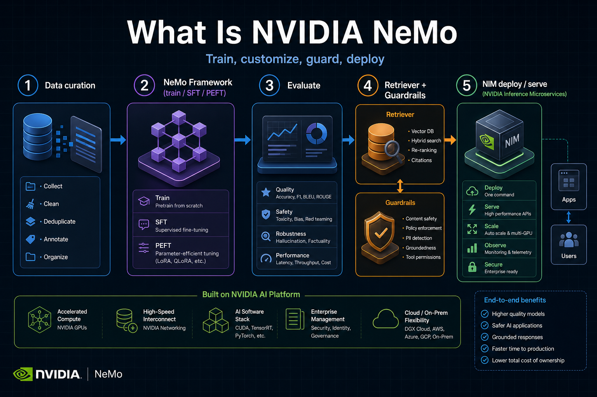
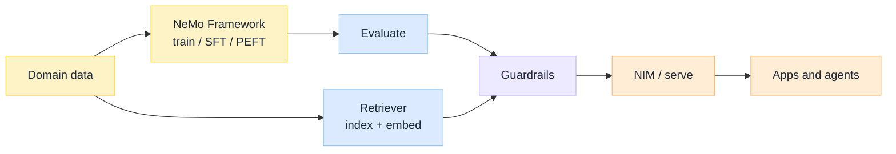

import Details from '@theme/Details';

<br/>


# What Is NVIDIA NeMo: Train, Customize, Guard, Deploy

*People say "we use NeMo" the way they once said "we use TensorFlow": as if it were one import. In practice NeMo is a **suite**: train and customize models, retrieve for RAG, put rails on behaviour, evaluate, and serve on NVIDIA GPUs, often through NIM microservices.*

If you only need a thin agent SDK or a single chat API, NeMo will feel heavy. If you need an enterprise path from domain data to a governed, GPU-accelerated model in production, it is one of the clearest NVIDIA-shaped answers. Model lifecycle context: [How LLM Works Under the Hood](/insights/how-llm-works-under-the-hood) · [During Training an LLM](/insights/during-training-an-llm) · [After Training an LLM](/insights/after-training-an-llm).

:::tip[THE CLAIM]
**NeMo is an end-to-end specialization platform for generative AI on NVIDIA, not a chat wrapper.** The durable pieces are the Framework (pretrain / SFT / PEFT at scale), Retriever (grounding), Guardrails (policy at conversation boundaries), evaluation / customization microservices, and NIM for optimized serve. Treating "NeMo" as one library hides which contract you actually bought.
:::

<!-- truncate -->

## The bottom line first

- **NeMo Framework:** scalable training and customization of LLMs (and multimodal / speech collections) on GPU clusters, with NeMo 2.0 leaning on Python config and Megatron-class parallelism.
- **NeMo Retriever:** embedding and retrieval building blocks for RAG so answers can ground in your data.
- **NeMo Guardrails:** dialogue and safety rails (Colang and related checks) around input, retrieval, tools, and output.
- **Microservices + NIM:** enterprise packaging to customize, evaluate, deploy, and serve models as optimized inference endpoints.
- **Fit:** NVIDIA GPU estate, domain specialization, and governed production paths.
- **Overkill:** a weekend prototype, a pure CPU shop, or "we only needed LangChain glue."

## What NeMo actually is

NeMo is best understood as **layers that share a brand**, not a single binary.

| Piece | Job | You reach for it when… |
| --- | --- | --- |
| **NeMo Framework** | Pretrain, SFT, PEFT (LoRA and friends), recipes, multi-node scale | You are changing weights, not only prompts |
| **NeMo Retriever** | GPU-accelerated embeddings / retrieval for RAG | You need grounded answers from enterprise corpora |
| **NeMo Guardrails** | Policy and dialogue control around the model | You need enforceable rails, not hope in the system prompt |
| **Customizer / Evaluator** (microservices) | Domain fine-tune and systematic eval | You want flywheel-style improve loops |
| **NIM (+ deployment management)** | Optimized, often OpenAI-compatible serve | You need production inference on NVIDIA |


<br/>

NVIDIA's product story has also pushed an **agent-first** framing: specialize, observe, optimize, and govern agents with these same skills. The architecture lesson does not change. Agents still need models, retrieval, policy, and a serving path. NeMo is one vendor-shaped way to wire those planes on CUDA GPUs.

## The path under the hood

A typical enterprise journey looks like this:

| Stage | What happens | NeMo-shaped tools |
| --- | --- | --- |
| **1. Curate** | Clean and format domain data | Framework data tooling / recipes |
| **2. Customize** | SFT or PEFT on a base checkpoint | Framework, Customizer microservice |
| **3. Evaluate** | Measure quality, safety, regressions | Evaluator microservice |
| **4. Ground** | Index corpora; retrieve at ask time | Retriever (+ your vector/store choices) |
| **5. Guard** | Rail inputs, retrieval, tools, outputs | Guardrails |
| **6. Deploy** | Export / optimize and serve | NIM, TensorRT-LLM paths, Triton-class serving |

Stages 4 and 5 are where teams confuse "we fine-tuned" with "we are safe and grounded." Fine-tuning changes behaviour averages. [RAG is not a database](/insights/rag-is-not-a-database), and [retrieval is a governed action](/insights/retrieval-is-a-governed-action): NeMo Retriever and Guardrails exist because production needs those contracts explicitly.

### Framework note (NeMo 2.0)

Older NeMo workflows leaned on YAML experiment configs. **NeMo 2.0** moves toward Python-first configuration, Lightning-compatible training objects, and **NeMo-Run** for launching locally or across large GPU jobs (Slurm or Kubernetes). Under the hood, large LLM recipes still depend on **Megatron-class** parallelism ideas: tensor / pipeline / data parallel so one model fits and trains across many GPUs.

You are not writing CUDA kernels. You are configuring a stack that already mapped matmuls onto the GPU machine.

<Details summary="Conceptual: PEFT vs full SFT in the NeMo path">

```text
Base checkpoint
    ├─ Full SFT     → update many / all weights (more GPU memory, stronger domain shift)
    └─ PEFT (LoRA…) → train small adapters (cheaper, faster iteration, easier rollback)

Both still need: clean data → train job → eval → decide ship or iterate
Serving may merge adapters or keep them modular depending on export path
```

</Details>

## Core pieces in plain language

### NeMo Framework

The training and customization engine for LLMs (plus multimodal and speech collections in the wider NeMo family). Default configs and recipes cover cluster setup, data, and hyperparameters so teams start from known-good patterns instead of empty YAML.

**Pair with:** [During Training an LLM](/insights/during-training-an-llm) for what the training loop is doing; NeMo is how you run that loop at NVIDIA scale.

### NeMo Retriever

Building blocks for **retrieval-augmented** systems: embed, index, and fetch passages so the generator can cite enterprise knowledge without stuffing everything into weights. It does not replace your policy about *what* may be retrieved.

### NeMo Guardrails

Open toolkit (and microservice packaging) to put **rails** around model interaction: topical boundaries, jailbreak resistance, PII patterns, dialog flows (historically with Colang), and hooks into broader safety services. This is the closest NeMo piece to a policy enforcement point on the conversation path.

### Microservices and NIM

Enterprise deployments often stop thinking in "run a Python trainer" and start thinking in **services**: customize, evaluate, deploy, proxy. **NVIDIA NIM** microservices package optimized inference (commonly TensorRT-LLM under the hood for LLMs) with familiar HTTP APIs. Hosting tradeoffs still apply: see [Model Hosting Options for Regulated Industries](/insights/model-hosting-options-regulated-industries).

## When to use NeMo

| Signal | Why NeMo fits |
| --- | --- |
| You already standardize on **NVIDIA GPUs** | The stack is built for that estate |
| You need **domain specialization** (SFT / PEFT), not only prompting | Framework and Customizer are first-class |
| You need **RAG + rails** in the same vendor story | Retriever and Guardrails sit beside train/serve |
| You want **production NIM** endpoints | Deploy path is productised |
| Speech / multimodal NVIDIA collections matter | Broader NeMo family beyond text LLMs |
| Platform team will own Slurm or K8s GPU pools | Framework and NeMo-Run assume real clusters |

## When it is overkill

| Situation | Why NeMo is heavy | Leaner path |
| --- | --- | --- |
| Weekend prototype or hackathon chatbot | You will fight install surfaces and concepts | Hosted API + thin app code |
| Prompt-only experiments on a laptop | No weight updates, no cluster | Notebook + API |
| Team has no NVIDIA GPUs (CPU-only or other accelerators) | Core value assumes CUDA-class hardware | Other frameworks / clouds |
| You only needed an agent orchestrator | NeMo is not "LangChain with a logo" | Orchestration library + any model API |
| Single small model, no RAG, no compliance rails | Microservice mesh is ceremony | One inference container or API |
| Org standardized on another full stack already | Switching cost dominates | Stay; adopt one NeMo piece only if needed (e.g. Guardrails alone) |

**Plain test:** if your roadmap has no training/customization, no GPU pool, and no governed retrieval story, buying "the NeMo platform" is almost certainly overkill. Borrow one open component if it solves a sharp problem.

## Gotchas

| Gotcha | What goes wrong | What to do |
| --- | --- | --- |
| **Brand soup** | People say NeMo and mean only Guardrails, or only training | Name the piece in designs and RFCs |
| **GPU starvation** | Jobs queued forever; "NeMo is slow" | Capacity plan; start with PEFT; right-size recipes |
| **Skipping eval** | Fine-tune ships regressions | Evaluator gates before NIM cutover |
| **RAG without governance** | Retriever returns toxic or secret chunks | Pair Retriever with policy and Guardrails |
| **Rails as the only control** | Guardrails without identity, tool allowlists, or audit | Treat rails as one layer in a broader runtime |
| **Export surprises** | Train works; TensorRT-LLM / NIM path breaks | Budget an export and load-test stage |
| **Confusing NeMo with TPU / JAX stacks** | Wrong cloud mental model | NeMo is NVIDIA GPU-shaped; Google TPU path is a different bet |

:::note[Composition, not magic]
NeMo does not remove the need for data quality, evaluation discipline, or runtime policy. It packages NVIDIA-accelerated ways to do those jobs. Weak data in still yields a confident wrong model out.
:::

## Key takeaways

- **NeMo is a suite:** Framework, Retriever, Guardrails, microservices, and NIM share a brand and a GPU bias.
- **Use it to specialize and operate genAI on NVIDIA**, from PEFT to governed serve, not as a generic chat SDK.
- **Retriever and Guardrails are first-class** because grounding and policy are not free with fine-tuning alone.
- **It is overkill** without GPUs, without customization/governance needs, or when a thin API app would do.
- **Say which NeMo piece you mean** in every architecture diagram.

:::info[Builds on]
[How LLM Works Under the Hood](/insights/how-llm-works-under-the-hood) · [During Training an LLM](/insights/during-training-an-llm) · [After Training an LLM](/insights/after-training-an-llm) · [RAG Is Not a Database](/insights/rag-is-not-a-database) · [Retrieval Is a Governed Action](/insights/retrieval-is-a-governed-action) · [Model Hosting Options for Regulated Industries](/insights/model-hosting-options-regulated-industries)
:::
