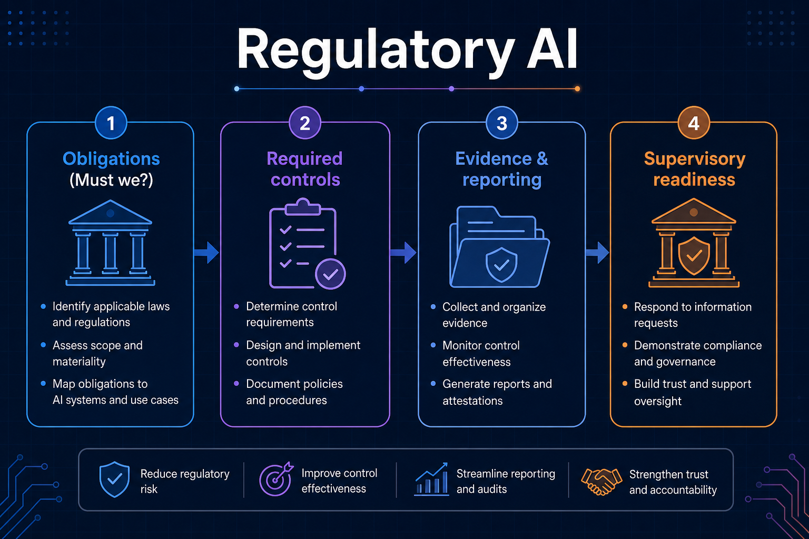
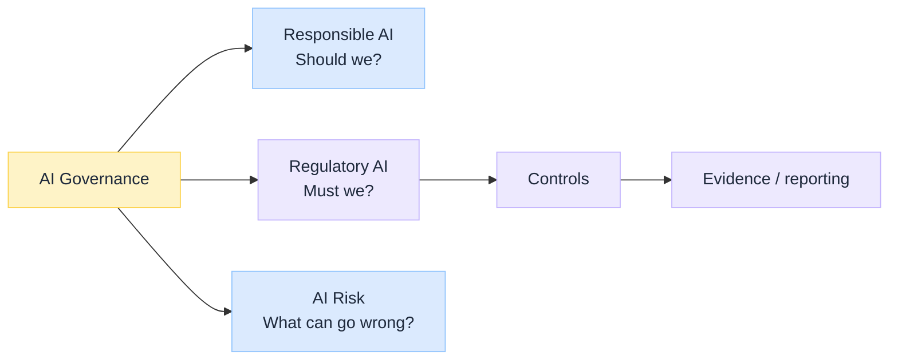

import Details from '@theme/Details';

<br/>


# What Is Regulatory AI: The Must-We Layer

*Responsible AI asks whether a use is consistent with your values. Regulatory AI asks whether the use is **legally and supervisorily allowed**, and what you **must** prove. Confusing the two produces either gold-plated ethics with no compliance map, or a checkbox culture with no principle spine.*

Under [AI Governance](/insights/what-is-ai-governance), Regulatory AI is the **obligations** lane: statutes, regulators, codes, and the controls and evidence they imply.

:::tip[THE CLAIM]
**Regulatory AI is the must-we layer.** It turns external obligations into required controls, evidence, and reporting. It does not replace Responsible AI (should we?) or AI Governance (how do we ensure it?). In regulated industries, "we have an ethics board" is not a substitute for a mapped obligation register.
:::

<!-- truncate -->

## The bottom line first

- **Should we?** → Responsible AI. **Must we?** → Regulatory AI. **How do we ensure it?** → Governance.
- Regulatory AI covers **obligations, mandatory controls, evidence, and reporting**.
- Map each use case to an **obligation register**, then to control owners and artifacts.
- Overlap with ethics and risk is normal; primary ownership stays with Compliance / Legal for "must."
- Banking example: consumer duty, privacy, model risk, and AI-specific rules are obligations, not slogans.

## Where it sits


<br/>

| Layer | Defines | Typical owner |
| --- | --- | --- |
| [Responsible AI](/insights/responsible-ai-five-buckets) | Desired outcomes (ethical, accountable, transparent, explainable, trustworthy) | Ethics + product + risk partners |
| **Regulatory AI** | External obligations and proof | Legal / Compliance / Reg relations |
| [AI Risk](/insights/what-is-ai-risk-management) | What can go wrong and residual risk | Risk function |
| [AI Governance](/insights/what-is-ai-governance) | Operating model that binds them | AI governance / CRO partners / platform |

## What fits inside Regulatory AI

| Area | Examples of "must" |
| --- | --- |
| **AI-specific regimes** | High-risk AI duties, prohibited practices, transparency to users where mandated |
| **Sector rules** | Banking conduct, insurance fairness, health device rules |
| **Privacy / data protection** | Lawful basis, minimization, cross-border, subject rights |
| **Consumer protection** | Fair treatment, disclosure, complaint handling |
| **Model risk / SR-style expectations** | Inventory, validation, ongoing monitoring where applicable |
| **Safety / security baselines** | Mandated controls, incident notification clocks |
| **Recordkeeping** | Retention of decisions, prompts, versions, overrides |

Regulatory AI does **not** mean "only the EU AI Act." It means **every binding obligation** that applies to that use case in that jurisdiction and sector.

## Obligations → controls → evidence

| Stage | Output |
| --- | --- |
| **1. Obligation register** | What law/rule applies to this use case |
| **2. Control mapping** | Which technical and process controls satisfy it |
| **3. Evidence pack** | Logs, validations, disclosures, test results, approvals |
| **4. Reporting** | What supervisors, boards, or customers must receive |

<Details summary="Refund agent: obligation sketch (illustrative)">

```text
Obligation          Control                     Evidence
Consumer fairness   Policy + HITL thresholds    Override logs, fair-treatment tests
Privacy             Data minimization, access   DPIA, access reviews
Explainability duty Explanation API + notice    Sample packs, UX screenshots
Model risk          Validation + monitoring     Validation report, drift alerts
Operational resil.  Fallback + kill switch      Runbooks, game-day results
```

Exact rules depend on jurisdiction. The **pattern** does not.

</Details>

## Bank example

A bank wants an AI agent to approve a customer refund.

| Lens | Focus |
| --- | --- |
| Responsible | Fair treatment, accountability, explainability as outcomes |
| **Regulatory** | Applicable banking, privacy, consumer-protection, and AI rules; mandatory disclosures; complaint pathways |
| Governance | Inventory, approvals, access, monitoring, audit trail that keep obligations true in prod |
| Risk | Fraudulent refunds, biased declines, model failure modes |

Regulatory AI answers: **which obligations apply, and what proof do we keep?**

## When Regulatory AI is weak

| Mistake | Result |
| --- | --- |
| Ethics board substitutes for compliance map | Supervisor asks for obligation→control trace; you have principles |
| One-off legal memo at launch | Rules change; no refresh trigger |
| Evidence not production-grade | Cannot reconstruct a decision months later |
| Copying another country's checklist | Wrong jurisdiction, false comfort |
| Ignoring vendor / hosting shared responsibility | Gap between your controls and the model's operator ([hosting options](/insights/model-hosting-options-regulated-industries)) |

## Key takeaways

- **Regulatory AI = must we?** obligations, controls, evidence, reporting.
- Keep it **distinct** from Responsible (should we?) and Governance (how we ensure it).
- Maintain an **obligation register** per use case, mapped to owners and artifacts.
- In regulated industries, **proof in production** is the product.

:::info[Builds on]
[What Is AI Governance](/insights/what-is-ai-governance) · [Responsible AI: five buckets](/insights/responsible-ai-five-buckets) · [What Is AI Risk Management](/insights/what-is-ai-risk-management) · [Model Hosting Options for Regulated Industries](/insights/model-hosting-options-regulated-industries) · [Retrieval Is a Governed Action](/insights/retrieval-is-a-governed-action)
:::
