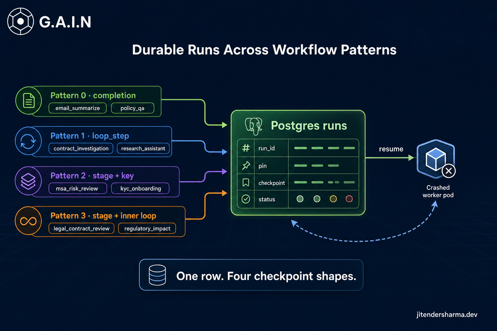
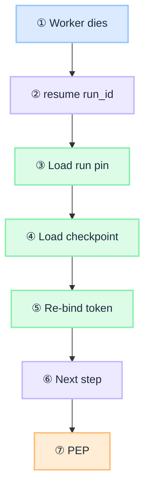
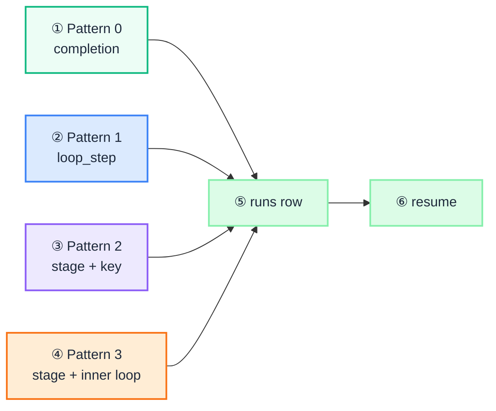

import Details from '@theme/Details';

<br/>



# Durable Runs Across Workflow Patterns: Survive the Restart

[Enterprise AI Workflow Patterns](/insights/enterprise-ai-workflow-patterns-autonomy-vs-control) answers **who decides the next step**. It does not answer what happens when the worker dies mid-run. A Pattern 0 summarize and a Pattern 2 KYC activate both need a restart story. They do not need the same checkpoint.

The eight worked examples in that article already name the routes. This piece pins each one to a durable `runs` row and shows what to write before the pod disappears. The [intent router](/insights/what-is-intent-router) still decides the route. The [agentic app](/playbooks/governance/runtime/boundary/agentic-app) owns the pin, the loop, and resume. [Policy-Governed Agent Runtime](/insights/policy-governed-agent-runtime) still gates every side effect on the way back.

This is an **architecture breakdown**: one store, one restart path, then each example's checkpoint.

:::tip[THE CLAIM]
**One durable `runs` row makes Patterns 0-3 restart-safe. The checkpoint blob is what changes.** Temporal is later, when that table grows timers, human waits, and sagas. Replaying the chat log is not resume.
:::

<!-- truncate -->

## The shared restart path

Do not give each pattern its own engine. Production Plane ② writes a Postgres `runs` row keyed by `run_id` **before** the first LLM call. Workers stay almost stateless. Redis stickiness (`session_id` → `route_id`) is not enough to resume a loop. How-to: [Session custody](/playbooks/agents/orchestration/session-custody).

<Details summary="Restart path">

```text
pod dies
  → resume(run_id)
  → load pin (frozen route, manifest, policy)
  → load checkpoint
  → re-bind token
  → do the next thing
  → PEP still gates
```

</Details>



<br/>

Four rules, every pattern:

1. **Pin before work.** Freeze `route_id`, `route_table_version`, and `manifest_version`. Resume loads that pin, not whatever is `active` now. Same freeze as [How to Design an Intent Router](/insights/design-intent-router).
2. **Checkpoint before side effects.** If you activate the account and then crash, a naive retry double-activates unless the idempotency key saves you.
3. **Idempotency on every write.** Pattern 2/3 write stages, and any Pattern 1 write tool, need a key the downstream API honors.
4. **Re-mint the token on resume.** Do not paste a bearer out of the conversation store. [Agent identity](/insights/agent-identity) stays in app custody.

Autonomy shape still decides **who picks the next step**. Durability decides **what is still true after a crash**. They are orthogonal. [Autonomy shape](/playbooks/agents/orchestration/autonomy-shape).

## Pattern 0: retry the call or return the stored answer

No tools. No loop. Durability is the **request and the completion**, not a stage pointer. Session custody calls this "nothing extra": no Temporal. You still write a `runs` row so a crash does not lose the answer or double-bill inference.

### Example A: `email_summarize`

One inference. Five executive bullets. If the pod dies mid-call, retry. If the completion is already stored, return it.

<Details summary="email_summarize run record (JSON)">

```json
{
  "run_id": "run-sum-01",
  "session_id": "sess-88",
  "status": "running",
  "pin": {
    "route_id": "email_summarize",
    "route_table_version": "2026.08.1",
    "tool_manifest": "none",
    "prompt_id": "email_summarize_v2"
  },
  "checkpoint": {
    "input_hash": "sha256:email-body"
  }
}
```

</Details>

On success: `status: "done"` and store the structured bullets. Restart while `running` retries prefetch-free generate. Restart while `done` skips the model.

### Example B: `policy_qa`

Same one-call shape. Retrieval is **deterministic prefetch** in the agentic app, not a tool the model chooses. [Retrieval is a governed action](/insights/retrieval-is-a-governed-action). The retry includes prefetch inside `scope: ["policy-engine"]`, then one grounded completion.

<Details summary="policy_qa run record (JSON)">

```json
{
  "run_id": "run-qa-01",
  "status": "running",
  "pin": {
    "route_id": "policy_qa",
    "route_table_version": "2026.08.1",
    "retrieval": { "mode": "deterministic_prefetch", "scope": ["policy-engine"] }
  },
  "checkpoint": {
    "input_hash": "sha256:user-question",
    "prefetch": "pending"
  }
}
```

</Details>

If prefetch finished and generate did not, store the packed chunk ids on the checkpoint so resume does not hit the corpus twice unless the pack expired. [RAG is not a database](/insights/rag-is-not-a-database): the store here is the run, not the index.

**Restart:** retry the one call, or return the stored cited answer. There is no `loop_step`.

## Pattern 1: resume the loop, not the chat log

The model chooses the next tool. Path order is not fixed. What must survive is **which tool last finished**, plus working slots, plus `loop_step` against `max_loop_steps`. Dumping the chat into the model is not exact step recovery.

### Example A: `contract_investigation`

Trace in the parent article already shows two legal orders for the same goal. Resume must continue **this** order, not invent a third from memory.

Crash after `ocr_extract` on MSA-4821:

<Details summary="contract_investigation run record (JSON)">

```json
{
  "run_id": "run-inv-01",
  "status": "running",
  "pin": {
    "route_id": "contract_investigation",
    "manifest_id": "contract_investigate_v1",
    "manifest_version": "2026.08.1",
    "max_loop_steps": 12,
    "loop_step": 1
  },
  "checkpoint": {
    "last_tool": "ocr_extract",
    "working": { "doc_id": "MSA-4821" }
  }
}
```

</Details>

Bump `loop_step` after each Observe → Decide → Tool. Flush **before** `draft_memo`. Resume at step 2 with the same working `doc_id`. Do not re-OCR unless the checkpoint says the extract is missing. PEP still evaluates `clause_search` on the way back.

### Example B: `research_assistant`

Open web path: `web_search` → `fetch_url` → `note_store` → `draft_brief`. Notes are working memory. If you only keep conversation, a restart re-fetches the web and may draft from an empty notebook.

<Details summary="research_assistant run record (JSON)">

```json
{
  "run_id": "run-res-01",
  "status": "running",
  "pin": {
    "route_id": "research_assistant",
    "manifest_id": "research_assistant_v1",
    "max_loop_steps": 16,
    "loop_step": 5
  },
  "checkpoint": {
    "last_tool": "note_store",
    "working": {
      "notes": ["n-1", "n-2", "n-3"],
      "sources": ["https://example.gov/rule"]
    }
  }
}
```

</Details>

**Restart:** continue the hunt at step 6. Cap still 16 for the **whole** loop, not per tool. A LangChain retry of one LLM call is not durability for `note_store`.

## Pattern 2: resume the stage, never stage 1

The workflow designer owns order. The model does assigned `llm_role` work inside a stage. Durability is **`current_stage`**, completed stages, and an **idempotency key** on anything that writes.

### Example A: `msa_risk_review`

Fixed stages: `ocr` → `clause_search` → `policy_search` → `risk_engine` → `memo`. Crash after clause search must not restart OCR.

<Details summary="msa_risk_review run record (JSON)">

```json
{
  "run_id": "run-msa-01",
  "status": "running",
  "pin": {
    "route_id": "msa_risk_review",
    "workflow_id": "msa_risk_review_v1",
    "manifest_version": "2026.08.1"
  },
  "checkpoint": {
    "current_stage": "policy_search",
    "completed": ["ocr", "clause_search"],
    "working": { "doc_id": "MSA-4821", "topics": ["termination", "indemnity"] }
  }
}
```

</Details>

LLM framework (query formulation, synthesis) runs **inside** the stage. It does not own KYC-style order, and it does not own this MSA order either. Resume at `policy_search` with the pinned corpus `legal-playbook`.

### Example B: `kyc_onboarding`

This is the write path. Stages include `human_gate` and `account_activate` with `side_effect: true`. A crash after identity check must not collect docs again. A crash after activate must not activate twice.

<Details summary="kyc_onboarding run record (JSON)">

```json
{
  "run_id": "run-kyc-01",
  "status": "running",
  "pin": {
    "route_id": "kyc_onboarding",
    "workflow_id": "kyc_onboarding_v2",
    "policy_profile": "high_risk_step_up"
  },
  "checkpoint": {
    "current_stage": "activate_account",
    "completed": [
      "collect_docs",
      "identity_check",
      "sanctions_screen",
      "risk_score"
    ],
    "branch": "low",
    "idempotency_key": "cust-4412:activate:v1",
    "working": { "customer_id": "cust-4412" }
  }
}
```

</Details>

Mark `risk_score` complete **before** you call activate. Send the same `idempotency_key` to `account_activate`. High-risk branch waits on `manual_review`: the row stays `running` (or `waiting_human`) for hours. That wait is when a step table starts looking like Temporal. Until then, the `runs` row plus the key is enough.

**Restart:** skip completed stages. Run the current stage once. If activate already succeeded, the key makes retry a no-op. The model does not pick `manual_review` vs `activate_account`. The `branch` map does.

## Pattern 3: outer stage plus inner loop

Fixed outer stages. The model may choose tools **inside** the current stage allowlist. Durability is Pattern 2's stage pointer **and** Pattern 1's inner `loop_step`, plus only the slots the next stage may see.

### Example A: `legal_contract_review`

Outer: `extract` → `analyse` → `generate_report`. Inside Analyse, simple is `clause_search`; deep is `clause_search` → `policy_search` → `risk_engine`. Crash in Analyse must stay in Analyse. It must not open `draft_memo`. It must not attach Extract's raw OCR to Generate.

<Details summary="legal_contract_review run record (JSON)">

```json
{
  "run_id": "run-rev-01",
  "status": "running",
  "pin": {
    "route_id": "legal_contract_review",
    "workflow_id": "contract_review_v3",
    "manifest_id": "contract_review_staged_v3",
    "manifest_version": "2026.08.1"
  },
  "checkpoint": {
    "current_stage": "analyse",
    "completed": ["extract"],
    "loop_step": 2,
    "last_tool": "clause_search",
    "max_tool_calls": 12,
    "handoff": { "clauses": ["termination", "indemnity"] }
  }
}
```

</Details>

On resume: load the pin, expose **only** the Analyse allowlist (`clause_search`, `policy_search`, `risk_engine`, `citation_lookup`), continue at inner step 2. `max_tool_calls: 12` is per stage, not the whole run. When Analyse completes, write `handoff` and advance. Generate sees clauses, not every search hit.

### Example B: `regulatory_impact`

Same hybrid: `extract` → `analyse` → `generate_report`. Analyse tools are `obligation_search`, `control_map`, `gap_score`. Prefs may pack at stage entry. Episodes load only if a recall tool is on **this** stage allowlist.

<Details summary="regulatory_impact run record (JSON)">

```json
{
  "run_id": "run-reg-01",
  "status": "running",
  "pin": {
    "route_id": "regulatory_impact",
    "workflow_id": "regulatory_impact_v1",
    "manifest_version": "2026.08.1"
  },
  "checkpoint": {
    "current_stage": "analyse",
    "completed": ["extract"],
    "loop_step": 1,
    "last_tool": "obligation_search",
    "handoff": { "doc_id": "reg-basel-x", "obligations": ["ob-12", "ob-18"] }
  }
}
```

</Details>

**Restart:** stay in Analyse. Resume inner tools. Do not jump to `draft_impact_memo` with a half-built gap list. Same runtime as the other seven routes until data boundaries force a split. [One agent with routes vs specialized agents](/insights/one-agent-routes-vs-specialized-agents).

## Same row, four checkpoint shapes

Eight routes. One table. The blob is the contract.

| Route | Pattern | What `checkpoint` holds | On restart |
| --- | --- | --- | --- |
| `email_summarize` | **0** | Input hash; completion once `done` | Retry the call, or return stored bullets |
| `policy_qa` | **0** | Input hash; optional packed chunk ids | Retry prefetch + generate, or return cited answer |
| `contract_investigation` | **1** | `loop_step`, last tool, `doc_id` | Next loop step; do not re-OCR |
| `research_assistant` | **1** | `loop_step`, notes, sources | Continue the hunt; keep the notebook |
| `msa_risk_review` | **2** | `current_stage`, completed stages | That stage, never `ocr` again |
| `kyc_onboarding` | **2** | Stage, branch, **idempotency key** | Activate once; human wait stays on the row |
| `legal_contract_review` | **3** | Stage + inner `loop_step` + `handoff` | Stay in Analyse; do not leak Extract tools |
| `regulatory_impact` | **3** | Stage + inner loop + obligation slots | Stay in Analyse; then report from handoff |

Conversation can live in a session store. Tokens live in a token store. Trace the run with `run_id`, `route_id`, `loop_step`, `current_stage`. [AI observability in enterprise](/insights/ai-observability-in-enterprise). None of those stores is the resume engine. The `runs` row is.



<br/>

Promote this table to Temporal when KYC human waits span days, when many workers share one saga, or when you start inventing timers in cron. Until then, one `runs` table is the durability for all four patterns. Field dictionary: [Route contract reference](/playbooks/agents/intent-router/route-contract-reference).

:::tip[TAKEAWAY]
Pattern 0 retries a call. Pattern 1 resumes a loop. Pattern 2 resumes a pipeline. Pattern 3 resumes a pipeline and the loop inside the current stage. Write the pin before the first token. Write the checkpoint before the side effect. Resume by `run_id`, never from `active`.
:::

:::info[Builds on]
[Enterprise AI Workflow Patterns](/insights/enterprise-ai-workflow-patterns-autonomy-vs-control) · [What Is an Intent Router](/insights/what-is-intent-router) · [How to Design an Intent Router](/insights/design-intent-router) · [Policy-Governed Agent Runtime](/insights/policy-governed-agent-runtime) · [One Agent with Routes vs Specialized Agents](/insights/one-agent-routes-vs-specialized-agents) · [Retrieval Is a Governed Action](/insights/retrieval-is-a-governed-action) · [RAG Is Not a Database](/insights/rag-is-not-a-database) · [Agent Identity](/insights/agent-identity) · [AI Observability in Enterprise](/insights/ai-observability-in-enterprise) · [Session custody](/playbooks/agents/orchestration/session-custody) · [Autonomy shape](/playbooks/agents/orchestration/autonomy-shape)
:::
