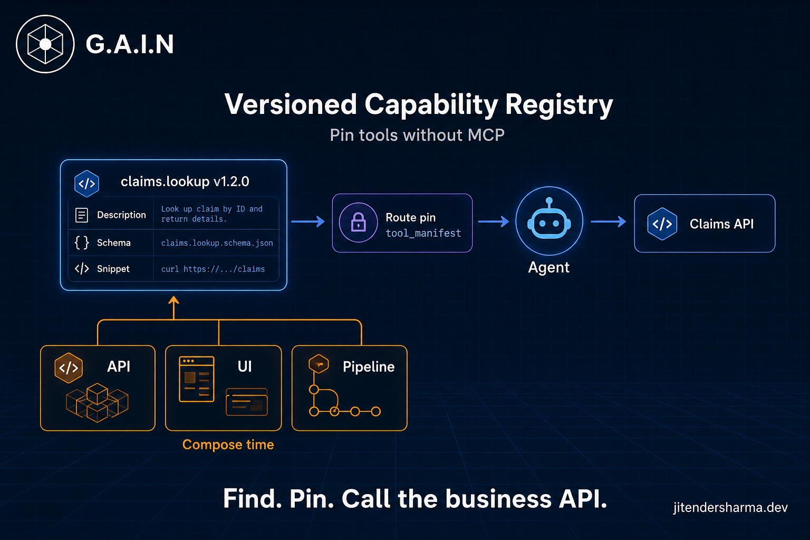
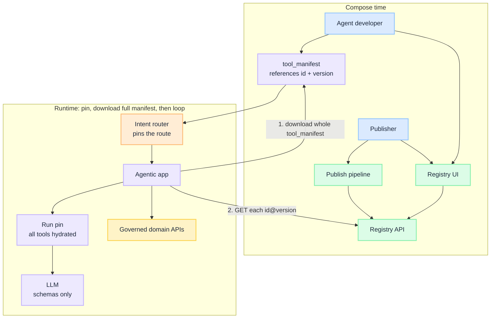
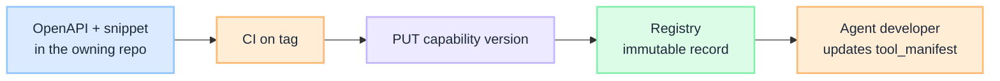
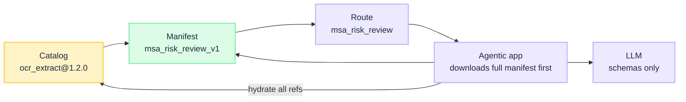

import Details from '@theme/Details';

<br/>



# Versioned Capability Registry: Pin Tools Without MCP

An agent developer is wiring [MSA risk review](/insights/enterprise-ai-workflow-patterns-autonomy-vs-control): OCR, clause search, playbook search, risk engine, memo. Those APIs already exist. What they do not have is a governed way to **find a published version and refer to it from `tool_manifest: msa_risk_review_v1`**. So they wrap each API by hand, or someone proposes an MCP server in front of an API that is already governed.

That is the wrong default. [MCP is a protocol](/insights/mcp-for-enterprise-business-agents), not a catalog. Two writers, two artifacts:

| Who | Writes | Does not write |
| --- | --- | --- |
| **Publisher** (API owner) | One immutable version into the capability registry | The agent's `tool_manifest` |
| **Agent developer** | A reference (`id` + `version`) in their `tool_manifest` | A new copy of the API |

The [route](/insights/what-is-intent-router) is pinned at **session start**, not at build. The **first** thing the agentic app does after that pin is **download the full pinned `tool_manifest`**: every tool, not one as the model proposes it. Then it hydrates schema and `invoke` for those refs **once**, stores that on the run pin, sends **schemas only** to the LLM, and calls the business API. It does not fetch a tool mid-loop.

This is an **architecture breakdown**: the developer path, what a version is, then the three surfaces publishers and developers use (API, UI, pipeline).

:::tip[THE CLAIM]
**Publishers publish versions into a capability registry. Agent developers refer to those versions in the tool manifest.** MCP is optional later, not the catalog. The router pins the route at session start. The agentic app **downloads that whole manifest first**, hydrates it onto the run pin, then talks to the LLM. Not a build-time publish. Not a fetch per tool.
:::

<!-- truncate -->

## The path: publish, refer, call

Three moments. Only the last one is the agent loop.

| Moment | Who | What happens |
| --- | --- | --- |
| **Publish** | Publisher | Pipeline puts one version in the registry: `ocr_extract@1.2.0`. |
| **Refer** | Agent developer | Adds `{ "id": "ocr_extract", "version": "1.2.0" }` to `msa_risk_review_v1`. They do not republish OCR. |
| **Call** | Agentic app | Router has pinned `msa_risk_review`. **First:** download the full `msa_risk_review_v1` (all five tools). Hydrate each `capability_id@version` once. Freeze on the run pin. Then schemas only to the LLM. |



<br/>

UI and pipeline **write** the catalog. After the pin, the agentic app **downloads the whole manifest first**, hydrates it, then works from the run pin. That is the same split as [Retrieval is a governed action](/insights/retrieval-is-a-governed-action): the agent proposes; the contract was frozen before the loop, not at build.

## What a capability version is

Treat a capability like a package, not like a live `list_tools` session.

| Field | Why it exists |
| --- | --- |
| `id` | Stable name: `ocr_extract`. Product, not vendor. |
| `version` | Immutable semver. `1.2.0` never changes once published. |
| `description` | What the agent developer (and later the model) reads. |
| `input_schema` / `output_schema` | JSON Schema. Becomes the tool schema on the route. |
| `invoke` | How to call the **governed business API** (method, path, auth). Not an MCP server URL. |
| `snippet` | Copy-paste example for the developer. Documentation, not runtime. |
| `owner` | The team that may publish the next version. |
| `status` | `draft` / `published` / `deprecated`. Manifests may reference `published` only. |

Breaking the contract is a **new major**. Adding an optional field is a minor. A typo in the description can be a patch. Overwriting `1.2.0` is not a version; it is a lie in the audit log.

The **manifest** does not store "whatever is latest." It stores a reference: `ocr_extract` at `1.2.0`. Publishing `2.0.0` does not move `msa_risk_review_v1`. The agent developer changes the reference when they are ready, with the same CI gate you already use for [manifest lifecycle](/playbooks/agents/manifests/manifest-lifecycle).

<Details summary="Capability version record (JSON)">

```json
{
  "id": "ocr_extract",
  "version": "1.2.0",
  "description": "Extract text from a document id.",
  "input_schema": {
    "type": "object",
    "required": ["doc_id"],
    "properties": {
      "doc_id": { "type": "string" }
    }
  },
  "output_schema": {
    "type": "object",
    "required": ["text"],
    "properties": {
      "text": { "type": "string" }
    }
  },
  "invoke": {
    "method": "POST",
    "url": "https://api.internal/ocr/extract",
    "auth": "domain-oauth"
  },
  "snippet": "POST /ocr/extract { \"doc_id\": \"...\" }",
  "owner": "document-intel",
  "status": "published"
}
```

</Details>

## Part 1: Registry API

The registry API is for the **UI, the pipeline, and one hydrate at pin**. It is a catalog, closer to a package index than to MCP `list_tools`. It is not a client the loop calls on every turn.

| Method | Path | Who calls it |
| --- | --- | --- |
| `PUT` | `/capabilities/{id}/versions/{version}` | Pipeline (publish). UI (draft save). |
| `GET` | `/capabilities/{id}/versions/{version}` | UI (detail). Agentic app after it has downloaded the pinned manifest (hydrate every ref). |
| `GET` | `/capabilities/{id}/versions` | UI (version history). |
| `GET` | `/capabilities?q=` | UI (search). |

Publish is append-only. `PUT` of an existing `(id, version)` returns conflict unless the record is still `draft`.

<Details summary="Registry API (Java, pseudocode)">

Handlers the UI, pipeline, and pin-time hydrate call. The loop does not import this client on the turn.

```java
record CapabilityVersion(
    String id,
    String version,
    String description,
    Map<String, Object> inputSchema,
    Map<String, Object> outputSchema,
    Map<String, Object> invoke,
    String snippet,
    String owner,
    String status  // draft | published | deprecated
) {}

record CapabilityRef(String id, String version) {}

class AlreadyPublished extends RuntimeException {
    AlreadyPublished(String id, String version) {
        super(id + "@" + version);
    }
}

class Registry {
    private final Map<String, CapabilityVersion> store = new HashMap<>();

    private static String key(String id, String version) {
        return id + "@" + version;
    }

    CapabilityVersion put(CapabilityVersion record, String actor) {
        String k = key(record.id(), record.version());
        CapabilityVersion existing = store.get(k);
        if (existing != null && "published".equals(existing.status())) {
            throw new AlreadyPublished(record.id(), record.version());
        }
        store.put(k, record);
        // audit("put", k, actor);
        return record;
    }

    CapabilityVersion get(String capabilityId, String version) {
        return store.get(key(capabilityId, version));
    }

    List<CapabilityVersion> listVersions(String capabilityId) {
        return store.values().stream()
            .filter(r -> r.id().equals(capabilityId))
            .sorted(Comparator.comparing(CapabilityVersion::version))
            .toList();
    }

    List<CapabilityVersion> search(String q) {
        String needle = q.toLowerCase();
        return store.values().stream()
            .filter(r -> "published".equals(r.status()))
            .filter(r -> r.id().contains(needle)
                || r.description().toLowerCase().contains(needle))
            .toList();
    }

    static CapabilityRef reference(CapabilityVersion record) {
        return new CapabilityRef(record.id(), record.version());
    }
}
```

What the agent developer writes is a **reference**, not a copy of the schema: `new CapabilityRef("ocr_extract", "1.2.0")`.

</Details>

When the router pins the route, the app **downloads the full `tool_manifest` first** (every tool in `msa_risk_review_v1`). Then it hydrates schema and `invoke` for those refs onto the **run pin**. Do not resolve at build. Do not download a tool when the model first names it. The [Policy-Governed Agent Runtime](/insights/policy-governed-agent-runtime) audits the pin, not a live catalog fetch and not a CI artifact.

## Part 2: Registry UI

Two jobs on one catalog.

| Persona | What the UI must do |
| --- | --- |
| **Publisher** | Register a capability: description, OpenAPI, snippet, owner. Save draft. Pipeline publishes one version. |
| **Agent developer** | Search, open a version, read schema, copy a **reference** (`id` + `version`) into their `tool_manifest`. |

A useful detail page is a package page, not a monitoring dashboard: name, versions, changelog, schema, snippet, **Copy reference**. That reference is what goes in `tools[]`. The developer does not paste the OpenAPI into the manifest by hand.

<Details summary="UI shape (Java, pseudocode)">

Enough structure to implement later. Not a component library.

```java
CapabilityVersion publisherRegister(Map<String, Object> form) {
    CapabilityVersion record = new CapabilityVersion(
        (String) form.get("id"),             // ocr_extract
        (String) form.get("version"),        // 1.2.0
        (String) form.get("description"),
        (Map<String, Object>) form.get("inputSchema"),
        (Map<String, Object>) form.get("outputSchema"),
        (Map<String, Object>) form.get("invoke"),
        (String) form.get("snippet"),
        (String) form.get("owner"),
        "draft"
    );
    return registry.put(record, record.owner());
}

List<Map<String, String>> developerSearch(String q) {
    return registry.search(q).stream()
        .map(r -> Map.of(
            "id", r.id(),
            "version", r.version(),
            "description", r.description(),
            "owner", r.owner()
        ))
        .toList();
}

CapabilityRef developerCopyReference(String capabilityId, String version) {
    CapabilityVersion record = registry.get(capabilityId, version);
    if (!"published".equals(record.status())) {
        throw new IllegalStateException("only published versions can be referenced");
    }
    return Registry.reference(record);
}
```

Screen list for the first UI, nothing more:

```text
/                  search published capabilities
/c/:id             version history
/c/:id/:version    schema, snippet, Copy reference
/register          publisher draft form (pipeline publishes)
```

</Details>

If the UI lets an owner "publish" from a browser, you still want the pipeline to be the path that sets `status=published`. Humans draft. CI publishes. That keeps the audit trail in git even when the catalog is a service.

## Part 3: Pipeline to push new versions

The library is versioned because **publish is a release**, not an edit. An OpenAPI change in the OCR repo should produce a new catalog version the same way a library tag produces an artifact.



<br/>

Existing manifests **keep their references** until an agent developer changes them. Publishing `ocr_extract@2.0.0` does not move `msa_risk_review_v1` off `1.2.0`. That is the point of a library.

<Details summary="Publish pipeline (Java, pseudocode)">

```java
CapabilityVersion publishFromRepo(String specDir, String version, String actor) {
    CapabilityVersion record = loadFromOpenApi(
        specDir + "/openapi.yaml",
        specDir + "/snippet.md",
        version,
        "published"
    );
    assertSemver(record.version());
    try {
        return registry.put(record, actor);
    } catch (AlreadyPublished e) {
        throw new IllegalStateException(
            "refusing to overwrite " + record.id() + "@" + record.version(), e);
    }
}

static void assertSemver(String version) {
    String[] parts = version.split("\\.");
    Integer.parseInt(parts[0]);
    Integer.parseInt(parts[1]);
    Integer.parseInt(parts[2]);
}

// CI: on git tag ocr_extract-v1.2.0
//   java -jar publish.jar --id ocr_extract --version 1.2.0
```

Do not auto-bump every `tool_manifest`. A new published version is available in the catalog. Consumers move when the agent developer updates the reference. Surprise schema change in a live agent is how you get a compliance incident with a clean CI log.

</Details>

Version policy in one line: **publishers append versions; developers refer by id and version; upgrades are manifest changes.** Same discipline the router already uses when it pins `route_table_version` and `manifest_version` for the session.

## How a reference lands in the tool manifest

Three objects, two writers.

| Object | Who writes it | What it holds |
| --- | --- | --- |
| **Capability version** | Publisher | One released API: schema, invoke, snippet. `ocr_extract@1.2.0` |
| **Tool manifest** | Agent developer | References for MSA review: OCR, clause search, playbook, risk, memo |
| **Route row** | Platform / router config | `msa_risk_review`. Points at `msa_risk_review_v1`. Still no `tools[]`. |

The [intent router](/insights/design-intent-router) already works this way: the row is a [route contract](/playbooks/agents/intent-router/route-contract-reference). `tool_manifest` is one field among many. The [manifest](/playbooks/agents/manifests/manifest-registry) is the bundle of **references**. The capability registry is where publishers put each version those references resolve to.



<br/>

The agent developer does **not** publish into the capability registry. That is the publisher's job. They version a **manifest file** of references in their agent repo. Changing a ref is a new `manifest_version` so the pin can name it. That file is not the freeze. The freeze is the [session pin](/playbooks/agents/orchestration/session-custody).

| Step | What they do |
| --- | --- |
| 1. Find | Search the catalog UI. Copy references: `ocr_extract@1.2.0`, `clause_search@1.0.0`, … |
| 2. Write | Edit `manifests/msa_risk_review/2026.08.2.json`. `tools[]` is id + version + `pdp_action` + `risk_tier` only. |
| 3. PR | Reviewers see which catalog versions moved. CI checks each ref exists and is `published`. It does not bake schemas. |
| 4. Store | The versioned ref file is available to load. New sessions can pin `manifest_version: 2026.08.2`. |
| 5. Pin | At session start the router pins the route. **First** the app downloads that whole `tool_manifest`. Then it hydrates every ref onto the run pin. Then the LLM. |
| 6. Route | Keep `tool_manifest: msa_risk_review_v1` if the id is stable. Bump the **route row** only when the pointer itself changes. |

First version is the same path with an empty file. Adding a tool or bumping `ocr_extract` from `1.2.0` to `1.3.0` is a **new manifest version**, not an edit in place.

<Details summary="Download the full manifest first (Java, pseudocode)">

```java
record ManifestRef(String capabilityId, String capabilityVersion,
                   String name, String pdpAction, String riskTier) {}

record ToolManifest(String manifestId, String manifestVersion,
                    String description, List<ManifestRef> tools) {}

record HydratedTool(ManifestRef ref, Map<String, Object> schema,
                    Map<String, Object> invoke) {}

List<HydratedTool> startRun(String manifestId, String manifestVersion) {
    ToolManifest pinned = downloadManifest(manifestId, manifestVersion);
    // first thing: whole file. all five MSA tools. not lazy per proposal.

    List<HydratedTool> tools = new ArrayList<>();
    for (ManifestRef ref : pinned.tools()) {
        CapabilityVersion cap = registry.get(ref.capabilityId(), ref.capabilityVersion());
        if (cap == null || !"published".equals(cap.status())) {
            throw new IllegalStateException(
                "cannot hydrate " + ref.capabilityId() + "@" + ref.capabilityVersion());
        }
        tools.add(new HydratedTool(ref, cap.inputSchema(), cap.invoke()));
    }
    return tools;  // freeze on the run pin before the first LLM call
}

// Router pin: route_id + tool_manifest + manifest_version
// App: downloadManifest → hydrate all → then schemas only to the LLM
```

</Details>

The agent developer adds a reference to `tools[]`. They do not duplicate the publisher's schema. After the pin, the app downloads that file in full, then fills schema and `invoke` from the registry onto the run pin.

<Details summary="1. What the publisher published (one version in the registry)">

```json
{
  "id": "ocr_extract",
  "version": "1.2.0",
  "description": "Extract text from a document id",
  "input_schema": { "type": "object", "required": ["doc_id"] },
  "invoke": { "method": "POST", "url": "https://api.internal/ocr/extract" }
}
```

</Details>

<Details summary="2. What the agent developer writes (msa_risk_review_v1)">

Same five tools as [MSA risk review](/insights/enterprise-ai-workflow-patterns-autonomy-vs-control). Here they are **references** to publisher versions, not inlined schemas.

```json
{
  "manifest_id": "msa_risk_review_v1",
  "manifest_version": "2026.08.1",
  "description": "Fixed MSA risk review tools",
  "tools": [
    {
      "name": "ocr_extract",
      "capability_id": "ocr_extract",
      "capability_version": "1.2.0",
      "pdp_action": "ocr_extract",
      "risk_tier": "low"
    },
    {
      "name": "clause_search",
      "capability_id": "clause_search",
      "capability_version": "1.0.0",
      "pdp_action": "clause_search",
      "risk_tier": "low"
    },
    {
      "name": "policy_search",
      "capability_id": "policy_search",
      "capability_version": "1.1.0",
      "pdp_action": "policy_search",
      "risk_tier": "low"
    },
    {
      "name": "risk_engine",
      "capability_id": "risk_engine",
      "capability_version": "2.0.0",
      "pdp_action": "risk_engine",
      "risk_tier": "medium"
    },
    {
      "name": "draft_memo",
      "capability_id": "draft_memo",
      "capability_version": "1.0.3",
      "pdp_action": "draft_memo",
      "risk_tier": "medium"
    }
  ]
}
```

Five publishers, five versions, one manifest. `pdp_action` and `risk_tier` stay on the manifest because they are agent-policy, not publisher API contract.

</Details>

<Details summary="3. Route row msa_risk_review (tools stay on the manifest)">

This is the [Pattern 2 MSA route](/insights/enterprise-ai-workflow-patterns-autonomy-vs-control). Catalog versions do not appear here. `tool_manifest` is the only field that names them.

```json
{
  "route_id": "msa_risk_review",
  "intent": "msa_risk_review",
  "model_profile": "reasoning-standard",
  "tool_manifest": "msa_risk_review_v1",
  "policy_profile": "read_only_standard",
  "retrieval": { "mode": "tool", "scope": ["clause-index", "legal-playbook"] },
  "workflow_id": "msa_risk_review_v1",
  "prompt_id": "msa_risk_review_v1",
  "output_schema_id": "msa_memo_v1",
  "eval_suite_id": "msa_risk_review_golden"
}
```

| Field | What it means on this route |
| --- | --- |
| `route_id` / `intent` | This turn is MSA risk review. Classifier target and audit id. |
| `model_profile` | Reasoning tier at the gateway. Not a catalog version. |
| `tool_manifest` | Load `msa_risk_review_v1`. That artifact holds the five capability references. |
| `policy_profile` | PEP uses `read_only_standard`. Permission is not granted by the registry. |
| `retrieval` | Who may retrieve, and from which corpora (`clause-index`, `legal-playbook`). This is RAG scope, not the capability catalog. |
| `workflow_id` | Pattern 2: stage order (OCR → clause search → playbook → risk → memo). The LLM does not pick the next tool. |
| `prompt_id` | Stage prompts for query formulation and memo synthesis. |
| `output_schema_id` | Counsel memo shape (`msa_memo_v1`). |
| `eval_suite_id` | Golden checks: stage order, required stages, memo grounded. |

</Details>

At session start the router pins `msa_risk_review` and `manifest_version`. **First** the agentic app downloads that whole ref file (`msa_risk_review_v1` at `2026.08.1`: OCR, clause search, playbook, risk, memo). Then it hydrates each `capability_id@version` and freezes schema plus `invoke` on the run pin. Only then does it send **schemas only** to the model. It keeps [agent identity](/insights/agent-identity), `invoke`, and PEP off the model. Downstream is OCR, clause index, playbook, risk engine, memo API. It does not download a tool when the model first names it.

If two agents need different catalog versions, that is two manifests (or two routes), not two MCP servers. Split agents only when execution boundaries diverge ([one agent with routes vs specialized agents](/insights/one-agent-routes-vs-specialized-agents)).

## What this is not

| Not this | Why |
| --- | --- |
| **MCP server per internal API** | OCR, clause search, and the playbook already have governed APIs. Wrapping each in MCP adds a fleet you do not need yet. |
| **Build-time hydrate** | The route is pinned at session start. CI does not freeze which schemas a run uses. |
| **Runtime `list_tools`** | Rediscovery after the route is pinned undoes the contract. Catalog search is for developers. |
| **Lazy tool fetch** | Do not `GET` OCR when the model first proposes `ocr_extract`. Download the full pinned manifest before the first LLM call. |
| **Agent calling the registry on the turn** | Hydrate after the manifest download, once. After that, call the domain APIs named on the run pin. |
| **REST replacement** | `invoke` points at those APIs. The catalog does not run OCR or score risk. |
| **Mixing retrieval with the catalog** | `retrieval.scope` is corpora (`clause-index`, `legal-playbook`). Capability versions live on the manifest. |
| **Latest-always** | `latest` is not a reference. References are versions. |
| **A substitute for PEP** | A published capability is still proposed, then allowed or denied. Protocol and catalog do not grant permission. |

MCP can still earn its keep for vendor tools you do not control. That decision lives in the [MCP piece](/insights/mcp-for-enterprise-business-agents). This registry is Phase 1 of that guide, drawn as something an agent developer can actually use.

:::tip[TAKEAWAY]
Publishers publish one version at a time into the capability registry. Agent developers refer to those versions in the tool manifest. Keep catalog publish append-only. Freeze at the session pin, not at build. Download the full pinned manifest first. Then hydrate. Then the LLM. Add MCP later only where a domain API is not already the contract.
:::

:::info[Builds on]
[Is MCP Really Necessary for Business Agents](/insights/mcp-for-enterprise-business-agents) · [Enterprise AI Workflow Patterns](/insights/enterprise-ai-workflow-patterns-autonomy-vs-control) · [What Is an Intent Router](/insights/what-is-intent-router) · [How to Design an Intent Router](/insights/design-intent-router) · [Policy-Governed Agent Runtime](/insights/policy-governed-agent-runtime) · [Agent Identity](/insights/agent-identity) · [One Agent with Routes vs Specialized Agents](/insights/one-agent-routes-vs-specialized-agents) · [Retrieval is a governed action](/insights/retrieval-is-a-governed-action) · [G.A.I.N MCP](/frameworks/gain-mcp) · [Agents Blueprint](/blueprints/agents-blueprint) · [Route contract reference](/playbooks/agents/intent-router/route-contract-reference) · [Manifest lifecycle](/playbooks/agents/manifests/manifest-lifecycle)
:::
