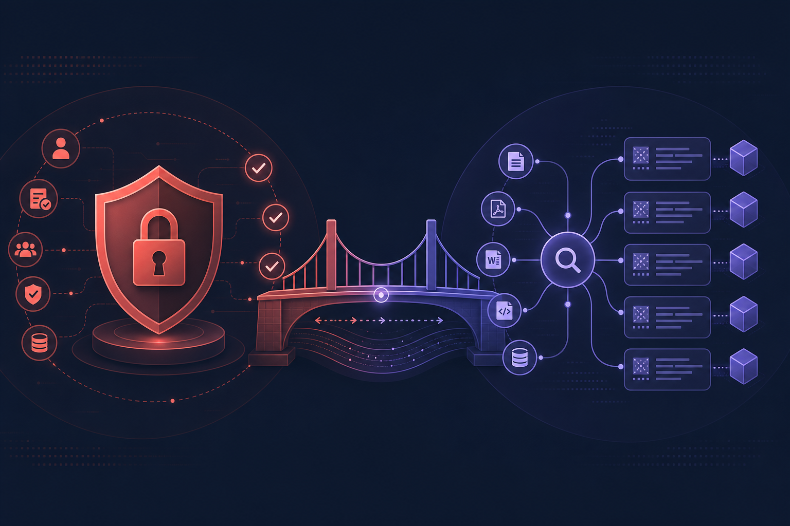
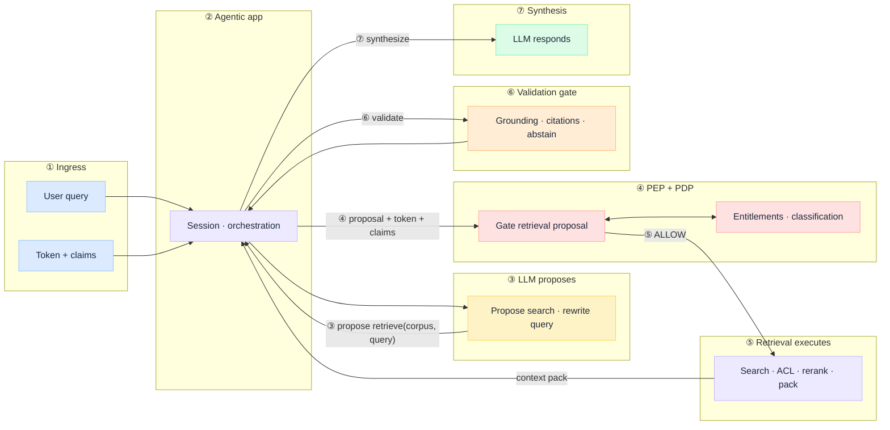
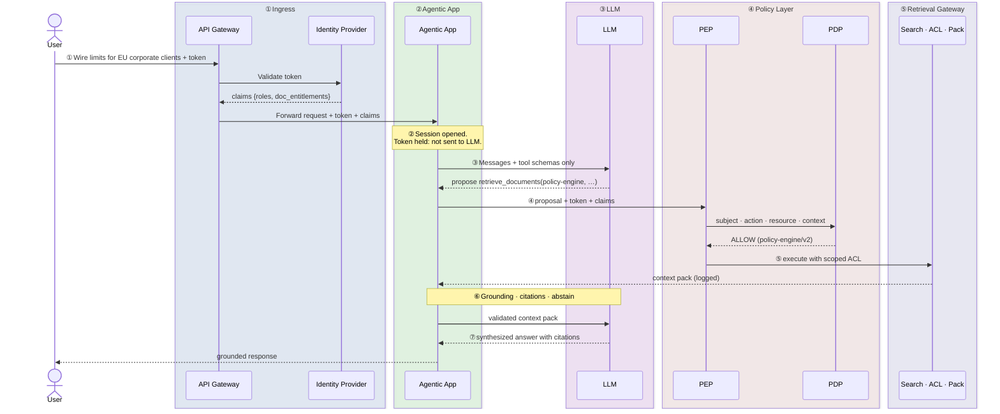

# PGAR with RAG

Two architecture questions collide in agentic RAG:

- *"What assembles evidence for this principal, on this request?"* — [RAG Is Not a Database](/insights/rag-is-not-a-database)
- *"Who authorized what, with which policy, before side effects?"* — [Policy-Governed Agent Runtime](/insights/policy-governed-agent-runtime)

If you have not reframed retrieval as runtime context construction, start with the RAG insight. The database fallacy — treating the vector index as the architecture — is what makes prompt-governed similarity search feel like production RAG.

This is an **architecture breakdown** of what happens when you apply PGAR to that pipeline: every retrieval path and every assembled context pack is something governance must decide, not something the model or the index gets to choose.

:::info[Builds on]
[RAG Is Not a Database](/insights/rag-is-not-a-database) (context construction) · [Policy-Governed Agent Runtime](/insights/policy-governed-agent-runtime) (authorization)
:::

:::tip[THE CLAIM]
**Retrieval is not permission.** An agent or orchestrator **proposes** a search. Governance **decides** whether it runs, which corpora and documents may enter context, and what gets logged before inference begins.

In PGAR with RAG, the token and entitlements stay out of the LLM. The model proposes queries and synthesizes from validated context. The PEP enforces. The PDP decides. The context pack is an audit artifact, not a prompt convenience.
:::

<!-- truncate -->

## Why these two pieces belong together

| | RAG insight | PGAR insight |
| --- | --- | --- |
| **Wrong model** | Vector DB = storage layer | System prompt = authorization |
| **Right model** | Governed context pipeline | PEP/PDP on the execution path |
| **Failure mode** | User retrieves docs they should never see | Agent executes actions it should not |
| **Examiner question** | [Who retrieved what, under which policy?](/insights/rag-is-not-a-database#why-the-database-mental-model-fails) | Which policy version allowed this before side effects? |

Both reject the same mistake: **delegating truth to a predictor.** Entitlements in the system prompt are suggestions the model may ignore. ACL rules applied after vector search still leak candidates into logs and rerankers. PGAR with RAG keeps prediction upstream (what to search, how to phrase an answer) and truth on the execution path (whether this principal may see these documents, whether this context pack may reach the model).

:::important[PREDICTION VS. TRUTH]
**Intelligence in the LLM. Truth in the PDP.** Never conflate a retrieval proposal with permission to assemble context for a regulated inference call.
:::

## The unified path on one page

[RAG Is Not a Database](/insights/rag-is-not-a-database#what-actually-runs-at-query-time) maps production RAG as four query-time boundaries: ingress → retrieval → rank & pack → inference. Agentic PGAR wraps that pipeline with orchestration and authorization — and splits inference into validation before synthesis.

Seven boundaries, one request. Stages **⑤–⑦** run the RAG pipeline under PEP/PDP control; stages **①–④** add what the RAG insight assumes but does not specify when an agent drives retrieval:

- **① Ingress · ② Agentic app:** identity binding and session orchestration as in the RAG pipeline; the app holds token and claims and never forwards them to the LLM.
- **③ LLM proposes:** rewrite the query or propose a `retrieve_*` tool call. Proposal only, not permission.
- **④ PEP + PDP:** map subject, action, resource, and context; return ALLOW, DENY, or STEP_UP **before** search runs.
- **⑤ Retrieval executes:** hybrid search, ACL filter, rerank, context-pack assembly — only on ALLOW ([four-boundary pipeline](/insights/rag-is-not-a-database#what-actually-runs-at-query-time)).
- **⑥ Validation gate · ⑦ Synthesis:** grounding, citations, abstention, then response — orchestrated by the agentic app; validated context only, not raw index output.

Two enforcement surfaces matter, and they are not interchangeable:

- **Pre-retrieval (PGAR core):** identity, entitlements, and classification verdicts **before** any chunk enters context.
- **Post-retrieval ([G.A.I.N RAG](/frameworks/gain-rag) validation):** grounding, citations, and abstention **before** the answer reaches the user.

Policy gates retrieval. Validation gates delivery. Skip either and you ship fluent wrong answers or silent data leaks.

:::important[Ask before you ship]
**Where does policy run?** **Where is the context pack logged?** **Where is grounding validated?**

If policy runs after retrieval, validation is skipped, or the agent can hit the index without passing through the PEP, you do not have PGAR with RAG. You have prompt-governed similarity search.
:::

## Treat retrieval as a tool proposal

When RAG lives inside an agent, `search_knowledge`, `retrieve_documents`, and similar tools are the same class of side effect as `initiate_wire`. The LLM proposes *what* to search. It does not decide *whether* that search may run or *which* documents may enter the context window.

Every retrieval proposal uses the same four-field PGAR contract:

| Field | RAG mapping | Example |
| --- | --- | --- |
| **subject** | Caller claims from the IdP | `roles`, tenant, document entitlements |
| **action** | Tool name | `retrieve_documents`, `search_policy_corpus` |
| **resource** | Target corpus, collection, or doc scope | `corpus:hr-policies`, `doc:contract-8842` |
| **context** | Query + runtime conditions | query text, classification level, freshness window |

The PDP returns **ALLOW**, **DENY**, or **STEP_UP** (for example, when accessing a restricted classification requires supervisor attestation). Only **ALLOW** reaches the retrieval service. The audit record carries policy version and redacted context **before** chunks are assembled.

This is the structural fix for the [leakage failure mode](/insights/rag-is-not-a-database#two-failure-modes-do-not-conflate-them) from the RAG insight: *the vector store returned a valid result; the pipeline never bound retrieval to identity.*

## What crosses each boundary

Apply the **PGAR test** to RAG:

**The LLM sees:** conversation, tool schemas (`query`, `corpus_hint`, `filters`), and retrieved context *after* policy allowed it.

**The LLM never sees:** bearer token, roles, entitlements, ACL rules, or classification policy text.

If document access rules live in the system prompt (*"never retrieve HR files"*), you have prompt-governed RAG, not PGAR with RAG. An injected prompt can rewrite those rules. A PDP cannot.

**The agentic app holds:** session, token, and claims. It forwards `proposal + token + claims` to the PEP on every retrieval call.

**The retrieval gateway is the structural choke point:** the app cannot call the vector index directly. Every path goes through PEP → (on ALLOW) → gateway with identity-scoped ACL filters applied **before** candidate generation, not as a post-hoc filter on whatever top-k the index returned.

| | Prompt-governed RAG | PGAR with RAG |
| --- | --- | --- |
| **Access control** | "Don't cite confidential docs" in the system message | PDP verdict + ACL filter at gateway |
| **Enforcement** | Model may comply | PEP blocks before search runs |
| **Audit** | Prompt logs | PEP/PDP verdict + context pack log |
| **Injection resistance** | Attacker rewrites rules | Attacker cannot see or rewrite PDP rules |
| **Examiner replay** | "We told the model not to" | Policy version + verdict chain + context pack |

Per-API auth on the search endpoint alone is not enough. Same reason PGAR gives for payment APIs. The search API may authorize the HTTP call; it does not record **which policy version permitted this principal to search this corpus with this scope** before context was assembled.

## One request, traced end to end

User asks: *"What's our wire limit for corporate clients in the EU?"*

1. **① Ingress:** Gateway validates the token; IdP issues claims (`roles`, `doc_entitlements`, `tenant`).
2. **② Agentic app:** Sends messages and tool schemas to the LLM. No credentials.
3. **③ LLM proposes:** `retrieve_documents(corpus="policy-engine", query="wire limits EU corporate")`.
4. **④ PEP → PDP:** Subject is the officer. Action is `retrieve_documents`. Resource is `policy-engine`. Context includes query and requested classification.
5. **④ PDP verdict (deny path):** Officer lacks `policy-engine:read` → **DENY**. No chunks enter context. Audit log written first.
6. **⑤ PDP verdict (allow path):** **ALLOW**, but one hit is `CONFIDENTIAL` → ACL filter drops it at the gateway; reranker runs on allowed candidates only.
7. **⑤ Context pack:** Assembled and logged: sources, scores, policy version. This is the replay artifact auditors ask for.
8. **⑥ Validation:** Grounding check and citation requirement before synthesis.
9. **⑦ LLM synthesizes:** Only from validated, attributed context. Abstain when evidence is thin.

The model never "decided" access. It proposed a search. Governance decided what could enter the window.

**Implementation walkthrough** (payloads, SARAC, audit, branches): [Domain: RAG retrieval § worked example](/playbooks/pgar-runtime/domain/rag-retrieval#worked-example-one-request-step-by-step).

:::note[DECISION FIRST, CONTEXT SECOND]
This is the record operational-resilience and model-risk reviewers expect: verdict logged before any chunk enters the context window. No retroactive narrative from chat transcripts.
:::

## Standalone RAG vs agent-driven RAG

Not every RAG deployment is agentic. PGAR still applies; the enforcement surface shifts.

| Pattern | Where PGAR lives | What the LLM does |
| --- | --- | --- |
| **Standalone RAG chatbot** | Retrieval gateway at ingress: auth, policy hooks, classification before search | Rewrites query (optional), synthesizes from the validated pack |
| **Agent with RAG tools** | Full PEP/PDP on each `retrieve_*` tool proposal **plus** gateway enforcement on the retrieval service | Proposes search strategy, corpus hints, and follow-up retrievals |
| **Workflow-orchestrated RAG** | Policy gate in the orchestrator before the retrieval step executes | May not call retrieval directly; orchestrator holds the token |

In all three, the non-negotiables are the same: **policy before retrieval**, **context pack logged**, **validation before delivery**, **structural choke point** so no path bypasses the gateway.

## What breaks when you skip this

Teams conflate PGAR with RAG in the demo and split them in production. Three governance-specific symptoms show up first:

- **Leakage.** A user retrieves chunks from documents their role should never see. Policy ran in the prompt, or ACL filters ran after top-k — not at the gateway before candidate generation.
- **No replay story.** An auditor asks what the model saw on a specific date. The team has index stats and chat logs, not the assembled context pack with policy version and verdict chain.
- **Fluent bypass.** The model proposes a broader search than entitlements allow. Without a PEP on the proposal, the retrieval service runs anyway because the API key is valid.

For empty vs wrong retrieval — and why abstention and ranking are separate gates — see [Two failure modes](/insights/rag-is-not-a-database#two-failure-modes-do-not-conflate-them) in the RAG insight. PGAR adds authorization before the pipeline runs; it does not replace ranking or abstention.

## Design checklist

1. **Policy before retrieval:** Entitlements and classification filters at the gateway, not after vector search and not in the prompt.
2. **Retrieval is a PEP-gated action:** When an agent drives RAG, every `retrieve_*` proposal goes through PEP/PDP with subject/action/resource/context.
3. **Context pack is an audit artifact:** Log what entered the window: sources, scores, policy version, verdict. Answers *"what did the model see?"*
4. **Validation before delivery:** Grounding and citations are a second gate, analogous to downstream re-auth in PGAR.
5. **Abstention is a system outcome:** Thin evidence means stop. Not a prompt wish.
6. **Structural enforcement:** If the agentic app can hit the vector DB without passing through PEP and the gateway, you have a suggestion, not governance.

:::important[THE PGAR TEST FOR RAG]
If roles, entitlements, ACL rules, or policy text appear in your LLM payload, you do not have PGAR with RAG. You have prompt-governed retrieval.
:::

## Where this connects in G.A.I.N

[G.A.I.N RAG](/frameworks/gain-rag) already maps the request path as **User → Policy → Retrieval → Validation → LLM**. PGAR is the enforcement mechanism for the Policy stage when retrieval is agent-driven, and the architectural discipline for the gateway when it is not.

| G.A.I.N stage | PGAR role |
| --- | --- |
| **Policy** | PEP/PDP verdict before search; identity-scoped ACL |
| **Retrieval** | Executes only on ALLOW; assembles the context pack |
| **Validation** | Grounding and citations before synthesis, separate from authorization |
| **Platform** | Trace, eval, and replay on the full verdict + context pack chain |

A scope leak can be an indexing bug or a policy bypass: different gates, different evals.

## Where I land

PGAR with RAG is not a new product category. It is the intersection of the two questions above.

Retrieval and context assembly are **authorized actions**, not passive fetches. The LLM proposes queries and synthesizes from evidence. The PDP decides which corpora, documents, and classifications may enter context. The PEP enforces that verdict before search runs and logs it before any chunk reaches the model.

Stop treating the system prompt as the access control layer. Treat the context pack as the replay artifact: scoped, ranked, validated — with a verdict chain examiners can audit without opening the chat log.

:::tip[TAKEAWAY]
**Retrieval is not permission.** PGAR with RAG means governance on the path that assembles context: proposal in the LLM, verdict in the PDP, enforcement in the PEP, replay in the context pack.
:::
