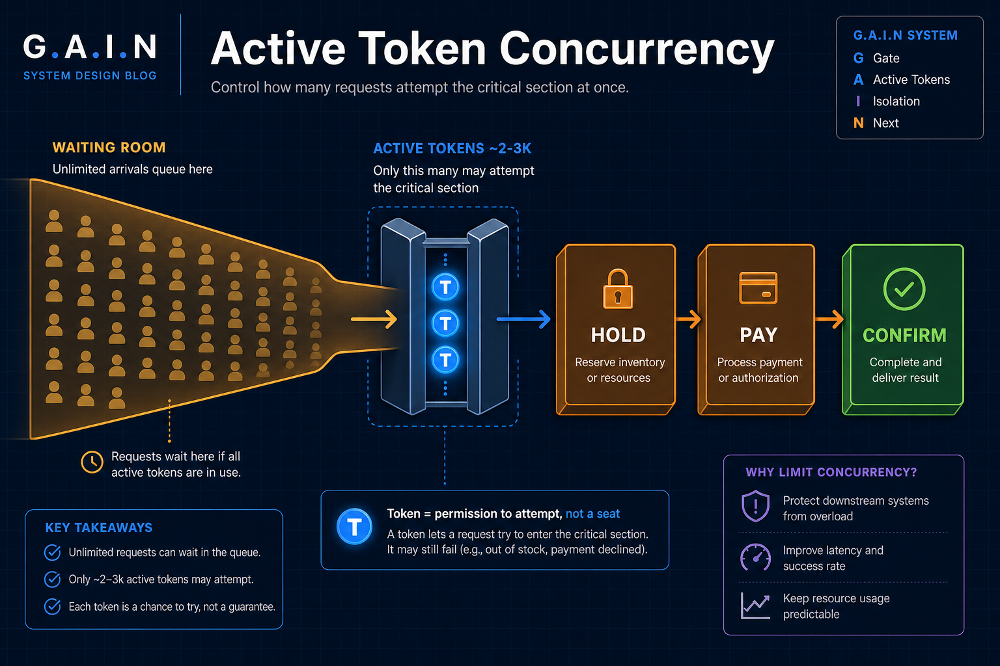
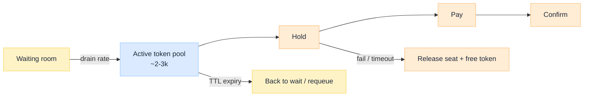

import Details from '@theme/Details';

<br/>


# Active Token Concurrency: Turning a Spike into a Pace

*A waiting room stops the herd from touching booking. An active token decides how hard booking may be touched. Without that second gate, "you are next" still becomes a thundering herd one wave later.*

In Tatkal-class and BookMyShow-class drops, the useful work is tiny compared with demand: tens or hundreds of scarce items, not millions of successful checkouts. The system should therefore **choose its own concurrency**, for example only 2-3k users at a time in hold and pay, while everyone else keeps seeing "You are in queue."

This is an **architecture breakdown** of tokenized concurrency after admission. Pair with Virtual Waiting Room (coming soon) upstream and Redis Atomic Inventory (coming soon) downstream.

:::tip[THE CLAIM]
**Active tokens set the pace. The crowd does not.** A token is permission to attempt hold and pay inside a concurrency budget. It is not a seat, not a PNR, and not a guarantee. Confusing queue position, active token, and inventory lease is how designs oversell fairness and underspecify failure.
:::

<!-- truncate -->

## Active tokens vs RPS

These get mixed in verbal designs. Separate them:

| Term | Means | Example |
| --- | --- | --- |
| **Active tokens** | Concurrent users allowed into the book lane | ~2,000-3,000 simultaneous holders of a valid pass |
| **Drain / issue rate** | How fast new tokens are minted as others finish or expire | Admit 200/sec from the waiting room |
| **RPS** | Requests those active users generate | Polls, hold, pay callbacks |

Three thousand active users are not "3k RPS." Each may produce many requests. Capacity planning sizes **booking and inventory** for `active_tokens × requests_per_user`, not for the waiting-room headcount.


<br/>

## Path at a glance

| # Stage | What it does | Failure if skipped |
| --- | --- | --- |
| **1. Promote from room** | Pick next waiter(s) per policy | Random stampedes when any client self-promotes |
| **2. Mint token** | Signed, short-lived, bound to user + sale | Replay and sharing across accounts |
| **3. Enforce on book APIs** | Hold/pay require valid token | Waiting room bypassed |
| **4. Cap the pool** | Reject mint when active count at max | Concurrency returns to "whatever the crowd is" |
| **5. Expire or complete** | TTL, success, or abandon frees a slot | Token hoarding blocks real buyers |

---

## Issuing and draining tokens

The control knob is a **pool with a max** plus a **drain policy**.

**Pool max:** hard ceiling on concurrent active tokens (product + capacity decision).  
**Drain:** when a slot frees, mint for the next waiting-room head (FIFO, lottery, or fair shard).

<Details summary="Pseudo-contract: mint and validate">

```text
POST /tokens/mint   (requires waiting-room ADMITTED pass)
  -> { token, expiresAt } | { error: POOL_FULL }

Booking APIs:
  Authorization: Bearer <token>
  Reject if expired, revoked, wrong saleId, or wrong userId
```

Store active token ids in Redis with TTL equal to (or slightly above) the client-visible expiry so the pool count stays honest.

</Details>

**Fairness note:** FIFO feels just and is gameable (early bots). Lottery feels harsher and is simpler under extreme load. Many production rooms combine authenticated entry, rate limits, and a hybrid promote policy. The token layer should stay policy-pluggable.

---

## TTL, refresh during pay, expiry

Checkout is slow relative to an open second. Tokens need a **TTL long enough for a real payment** (often a few minutes) and short enough that abandoners do not freeze the pool.

| Event | Token action |
| --- | --- |
| **Mint** | Start TTL; increment active count |
| **Hold success** | Optionally extend TTL to cover pay window |
| **Pay in progress** | Allow one controlled refresh tied to payment session id |
| **Confirm success** | Revoke token; free pool slot |
| **TTL hit** | Revoke; free pool slot; release any hold downstream |

Unbounded refresh is how hoarders sit in the active set forever. Cap refreshes and bind them to server-side payment state, not to "user clicked again."

---

## Token is permission to attempt, not inventory

Spell this out in product copy and in the architecture:

```text
queue position  ->  you may wait
active token    ->  you may call hold/pay
inventory lease ->  you temporarily own a scarce unit
PNR / order     ->  money and durable booking agree
```

A user can hold a valid token and still see **sold out** when the Redis counter is empty. That is correct behavior. The token plane protects **system pace**; the inventory plane protects **truth about seats**.

---

## Failure modes

| Failure | Symptom | Mitigation |
| --- | --- | --- |
| **Hoarding** | Active set full, few confirms | Short TTL, refresh caps, revoke on idle |
| **Refresh storms** | Pay page hammers mint | Server-driven extend only |
| **Bypass** | Clients call hold without token | Gateway enforce on all book routes |
| **Clock skew** | Token looks expired early | Short skew tolerance; prefer server expiry |
| **Unfair drain** | Same cohort always wins | Auth bind, rate limit, promote policy |

Load-test the **pool boundary**, not only peak RPS: fill the waiting room, set max tokens to 2-3k, and prove hold/pay latency stays inside SLO while waiters only poll status.

---

:::tip[TAKEAWAY]
**Decide the concurrency budget, then enforce it with short-lived active tokens on every hold and pay call.** Drain from the waiting room on your schedule, expire aggressively, and never imply that a token is a seat. Pace is a product policy implemented in the control plane; inventory correctness lives one layer down.
:::
